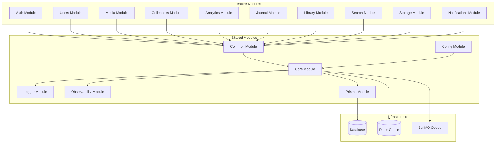
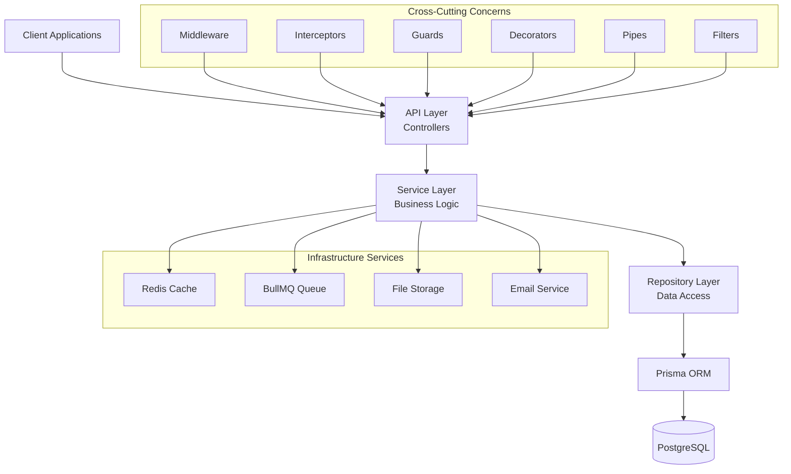
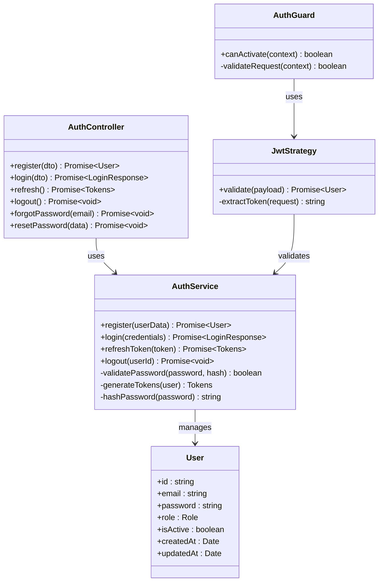
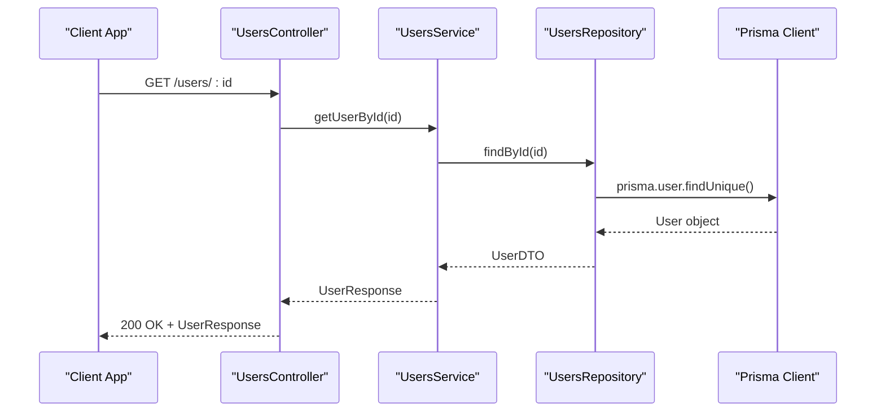
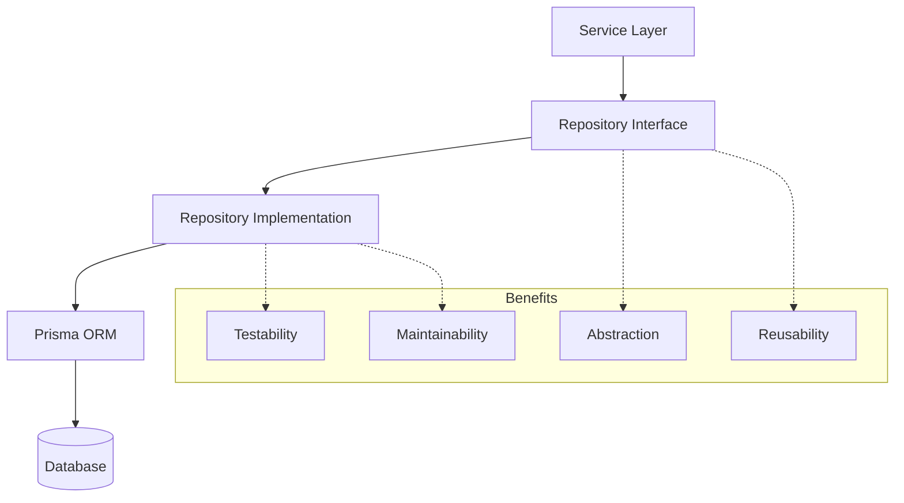
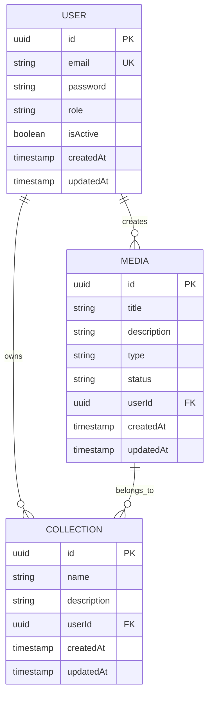
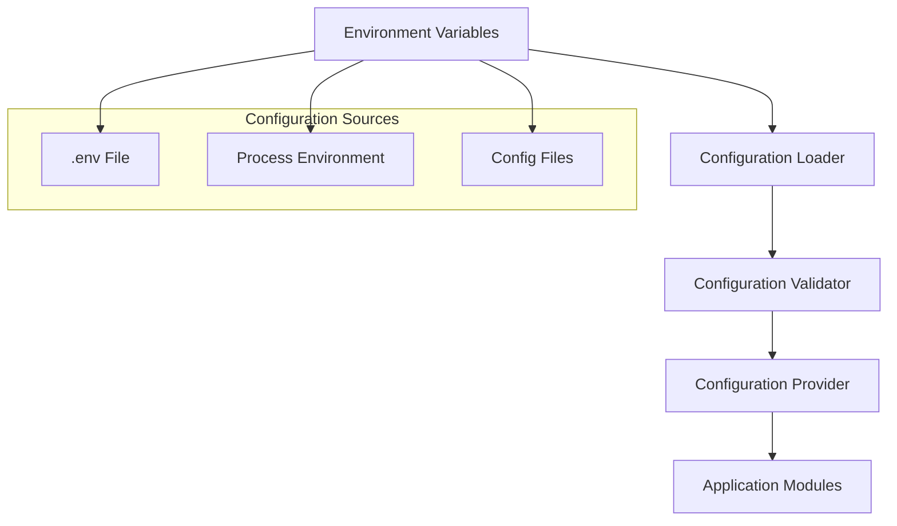
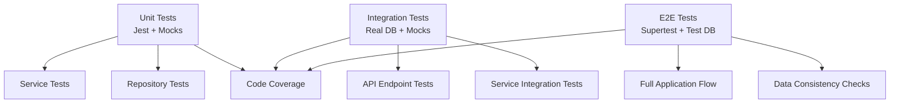

# Backend Documentation

<cite>
**Referenced Files in This Document**
- [app.module.ts](file://apps/backend/src/app.module.ts)
- [main.ts](file://apps/backend/src/main.ts)
- [app.bootstrap.ts](file://apps/backend/src/app.bootstrap.ts)
- [configuration.ts](file://apps/backend/src/config/configuration.ts)
- [env.validation.ts](file://apps/backend/src/config/env.validation.ts)
- [prisma.service.ts](file://apps/backend/src/prisma/prisma.service.ts)
- [prisma.module.ts](file://apps/backend/src/prisma/prisma.module.ts)
- [auth.module.ts](file://apps/backend/src/auth/auth.module.ts)
- [auth.service.ts](file://apps/backend/src/auth/auth.service.ts)
- [auth.controller.ts](file://apps/backend/src/auth/auth.controller.ts)
- [users.module.ts](file://apps/backend/src/users/users.module.ts)
- [users.service.ts](file://apps/backend/src/users/users.service.ts)
- [users.repository.ts](file://apps/backend/src/users/users.repository.ts)
- [common.module.ts](file://apps/backend/src/common/common.module.ts)
- [core.module.ts](file://apps/backend/src/core/core.module.ts)
- [logger.module.ts](file://apps/backend/src/logger/logger.module.ts)
- [observability.module.ts](file://apps/backend/src/observability/observability.module.ts)
- [schema.prisma](file://apps/backend/prisma/schema.prisma)
</cite>

## Table of Contents
1. [Introduction](#introduction)
2. [Project Structure](#project-structure)
3. [Core Components](#core-components)
4. [Architecture Overview](#architecture-overview)
5. [Detailed Component Analysis](#detailed-component-analysis)
6. [Dependency Injection Patterns](#dependency-injection-patterns)
7. [Repository Pattern Implementation](#repository-pattern-implementation)
8. [Prisma ORM Integration](#prisma-orm-integration)
9. [Middleware Stack](#middleware-stack)
10. [Interceptors and Guards](#interceptors-and-guards)
11. [Configuration Management](#configuration-management)
12. [Error Handling Strategy](#error-handling-strategy)
13. [Logging Implementation](#logging-implementation)
14. [Testing Approaches](#testing-approaches)
15. [Performance Considerations](#performance-considerations)
16. [Conclusion](#conclusion)

## Introduction

This document provides comprehensive backend documentation for the NestJS application, focusing on modular architecture, dependency injection patterns, service layer organization, repository pattern implementation, Prisma ORM usage, middleware stack, interceptors, guards, decorators, configuration management, error handling, logging, and testing approaches.

The application follows a well-structured modular architecture with clear separation of concerns, making it maintainable and scalable. Each feature is encapsulated within its own module, promoting loose coupling and high cohesion.

## Project Structure

The backend application follows a feature-based organization with shared modules for cross-cutting concerns:

**Diagram sources**
- [app.module.ts](file://apps/backend/src/app.module.ts)
- [common.module.ts](file://apps/backend/src/common/common.module.ts)
- [core.module.ts](file://apps/backend/src/core/core.module.ts)

**Section sources**
- [app.module.ts](file://apps/backend/src/app.module.ts)
- [main.ts](file://apps/backend/src/main.ts)

## Core Components

### Application Bootstrap and Configuration

The application bootstrap process initializes the NestJS application with proper configuration, environment validation, and global settings. The main entry point configures the HTTP server, middleware, and application lifecycle.

Key components include:
- **Application Bootstrap**: Initializes the NestFactory and configures global settings
- **Environment Validation**: Validates required environment variables at startup
- **Global Configuration**: Sets up CORS, helmet, compression, and other security headers
- **Module Registration**: Registers all feature modules and shared dependencies

### Shared Infrastructure Modules

#### Common Module
Provides shared utilities, pipes, filters, interceptors, and decorators used across the application. Includes pagination helpers, response wrappers, and common exception handlers.

#### Core Module
Contains domain models, base classes, and core business logic that doesn't belong to any specific feature. Includes audit trails, caching strategies, UUID generation, and transaction management.

#### Configuration Module
Manages environment-specific configurations, configuration validation, and configuration providers. Supports different environments (development, staging, production) with type-safe configuration access.

**Section sources**
- [main.ts](file://apps/backend/src/main.ts)
- [configuration.ts](file://apps/backend/src/config/configuration.ts)
- [env.validation.ts](file://apps/backend/src/config/env.validation.ts)
- [common.module.ts](file://apps/backend/src/common/common.module.ts)
- [core.module.ts](file://apps/backend/src/core/core.module.ts)

## Architecture Overview

The application follows a layered architecture pattern with clear separation between presentation, business logic, and data access layers:

**Diagram sources**
- [app.module.ts](file://apps/backend/src/app.module.ts)
- [auth.controller.ts](file://apps/backend/src/auth/auth.controller.ts)
- [auth.service.ts](file://apps/backend/src/auth/auth.service.ts)
- [users.repository.ts](file://apps/backend/src/users/users.repository.ts)

## Detailed Component Analysis

### Authentication Module

The authentication module implements JWT-based authentication with role-based access control. It includes user registration, login, password reset, and session management.

**Diagram sources**
- [auth.service.ts](file://apps/backend/src/auth/auth.service.ts)
- [auth.controller.ts](file://apps/backend/src/auth/auth.controller.ts)
- [auth.module.ts](file://apps/backend/src/auth/auth.module.ts)

### User Management Module

The users module handles user profile management, preferences, and account settings. It follows the repository pattern for data access abstraction.

**Diagram sources**
- [users.service.ts](file://apps/backend/src/users/users.service.ts)
- [users.repository.ts](file://apps/backend/src/users/users.repository.ts)

**Section sources**
- [auth.module.ts](file://apps/backend/src/auth/auth.module.ts)
- [auth.service.ts](file://apps/backend/src/auth/auth.service.ts)
- [auth.controller.ts](file://apps/backend/src/auth/auth.controller.ts)
- [users.module.ts](file://apps/backend/src/users/users.module.ts)
- [users.service.ts](file://apps/backend/src/users/users.service.ts)
- [users.repository.ts](file://apps/backend/src/users/users.repository.ts)

## Dependency Injection Patterns

NestJS uses constructor-based dependency injection throughout the application. Services are injected into controllers, repositories into services, and shared services into feature modules.

### Constructor Injection Pattern
All services use constructor injection for their dependencies, promoting testability and clear dependency relationships.

### Module-Level Dependencies
Modules declare their dependencies in the `imports` array, ensuring proper initialization order and dependency resolution.

### Provider Scope
Services can be configured with different scopes (default, request, transient) depending on their statefulness and performance requirements.

**Section sources**
- [auth.service.ts](file://apps/backend/src/auth/auth.service.ts)
- [users.service.ts](file://apps/backend/src/users/users.service.ts)

## Repository Pattern Implementation

The repository pattern abstracts data access logic from business logic, providing a clean interface for data operations.

### Repository Interface Design
Each entity has a corresponding repository interface that defines CRUD operations and custom queries.

### Repository Implementation
Repositories implement database-specific logic using Prisma ORM, hiding ORM details from service layer.

### Transaction Support
Repositories support database transactions for operations that require atomicity.

**Diagram sources**
- [users.repository.ts](file://apps/backend/src/users/users.repository.ts)
- [media.repository.ts](file://apps/backend/src/media/media.repository.ts)

**Section sources**
- [users.repository.ts](file://apps/backend/src/users/users.repository.ts)
- [media.repository.ts](file://apps/backend/src/media/media.repository.ts)

## Prisma ORM Integration

Prisma serves as the primary ORM for database operations, providing type-safe database access and automatic schema migrations.

### Schema Definition
The Prisma schema defines all database models, relations, and constraints in a declarative format.

### Type Generation
Prisma generates TypeScript types from the schema, ensuring compile-time safety for database operations.

### Migration Management
Database migrations are managed through Prisma's migration system, supporting version control and rollback capabilities.

**Diagram sources**
- [schema.prisma](file://apps/backend/prisma/schema.prisma)

**Section sources**
- [prisma.service.ts](file://apps/backend/src/prisma/prisma.service.ts)
- [prisma.module.ts](file://apps/backend/src/prisma/prisma.module.ts)
- [schema.prisma](file://apps/backend/prisma/schema.prisma)

## Middleware Stack

The application uses NestJS middleware for cross-cutting concerns like logging, authentication, and request processing.

### Built-in Middleware
- **Helmet**: Security headers
- **CORS**: Cross-origin resource sharing
- **Compression**: Response compression
- **Morgan**: HTTP request logging

### Custom Middleware
- **Authentication Middleware**: Token validation and user context setup
- **Rate Limiting**: Request throttling
- **Request ID**: Unique request tracking
- **Caching**: Response caching

### Middleware Execution Order
Middleware executes in the order they are registered, allowing for proper request/response processing flow.

**Section sources**
- [main.ts](file://apps/backend/src/main.ts)

## Interceptors and Guards

### Interceptors
Interceptors handle cross-cutting concerns like logging, transformation, and exception handling at the controller level.

- **Logging Interceptor**: Request/response logging with timing
- **Transform Interceptor**: Response data transformation
- **Exception Interceptor**: Global exception handling
- **Timeout Interceptor**: Request timeout handling

### Guards
Guards control access to routes based on authentication and authorization rules.

- **JWT Guard**: Token validation and user extraction
- **Role Guard**: Role-based access control
- **Ownership Guard**: Resource ownership verification
- **Rate Limit Guard**: Request rate limiting

### Decorators
Custom decorators provide reusable functionality across the application.

- **@CurrentUser**: Extract current user from request
- **@Roles**: Define required roles for route access
- **@Public**: Mark routes as public access
- **@Throttle**: Apply rate limiting to endpoints

**Section sources**
- [auth.guard.ts](file://apps/backend/src/auth/guards/auth.guard.ts)
- [roles.decorator.ts](file://apps/backend/src/auth/decorators/roles.decorator.ts)

## Configuration Management

The application uses a centralized configuration system with environment-specific overrides and validation.

### Environment Variables
Required environment variables are validated at startup with clear error messages for missing or invalid values.

### Configuration Providers
Configuration is accessed through typed providers that inject configuration objects into services.

### Environment-Specific Settings
Different environments (development, staging, production) have their own configuration files with appropriate defaults.

**Diagram sources**
- [configuration.ts](file://apps/backend/src/config/configuration.ts)
- [env.validation.ts](file://apps/backend/src/config/env.validation.ts)

**Section sources**
- [configuration.ts](file://apps/backend/src/config/configuration.ts)
- [env.validation.ts](file://apps/backend/src/config/env.validation.ts)

## Error Handling Strategy

The application implements a comprehensive error handling strategy with consistent error responses and logging.

### Global Exception Filter
A global exception filter catches all unhandled exceptions and converts them to standardized API responses.

### Custom Exceptions
Domain-specific exceptions extend NestJS's BaseException for better error categorization.

### Error Response Format
All errors follow a consistent JSON format with status codes, messages, and optional error details.

### Logging Integration
Errors are automatically logged with full stack traces and contextual information.

**Section sources**
- [common/filters](file://apps/backend/src/common/filters)
- [common/exceptions](file://apps/backend/src/common/exceptions)

## Logging Implementation

The application uses structured logging with correlation IDs for request tracing and debugging.

### Logger Service
A centralized logger service provides consistent logging across the application with different log levels.

### Request Correlation
Each request gets a unique correlation ID that flows through the entire request lifecycle for traceability.

### Log Levels
- **Debug**: Detailed debugging information
- **Info**: General operational information
- **Warn**: Warning conditions
- **Error**: Error conditions requiring attention
- **Fatal**: Critical errors causing application failure

### Log Formatting
Logs include timestamps, log levels, correlation IDs, and contextual information for easy analysis.

**Section sources**
- [logger.module.ts](file://apps/backend/src/logger/logger.module.ts)
- [observability/logging.service.ts](file://apps/backend/src/observability/logging.service.ts)

## Testing Approaches

The application follows comprehensive testing strategies for unit tests, integration tests, and end-to-end tests.

### Unit Testing
Services and repositories are tested in isolation using Jest with mocked dependencies.

### Integration Testing
API endpoints are tested with real database connections and external service mocks.

### End-to-End Testing
Full application flows are tested using Supertest for HTTP requests and test databases.

### Test Utilities
Reusable test utilities and fixtures provide consistent test data and setup.

**Section sources**
- [auth.service.spec.ts](file://apps/backend/src/auth/auth.service.spec.ts)
- [users.repository.spec.ts](file://apps/backend/src/users/users.repository.spec.ts)

## Performance Considerations

### Database Optimization
- Proper indexing strategies for frequently queried columns
- Query optimization with selective field selection
- Connection pooling for database connections
- Caching strategies with Redis for expensive operations

### Memory Management
- Efficient data structures and algorithms
- Proper cleanup of resources and event listeners
- Memory leak prevention with proper subscription management

### Caching Strategy
- Multi-level caching with in-memory and distributed cache
- Cache invalidation strategies for data consistency
- Cache warming for frequently accessed data

### Monitoring and Metrics
- Application performance metrics collection
- Database query performance monitoring
- Memory usage and garbage collection monitoring

## Conclusion

This NestJS backend application demonstrates best practices in modular architecture, dependency injection, repository pattern implementation, and comprehensive error handling. The codebase is well-structured with clear separation of concerns, making it maintainable and scalable.

Key strengths include:
- **Modular Architecture**: Feature-based organization with clear boundaries
- **Type Safety**: Comprehensive TypeScript usage with Prisma-generated types
- **Testability**: Well-structured code with clear interfaces for testing
- **Scalability**: Horizontal scaling support with stateless design
- **Maintainability**: Clear separation of concerns and consistent patterns

The application is ready for production deployment with proper configuration management, monitoring, and error handling in place.