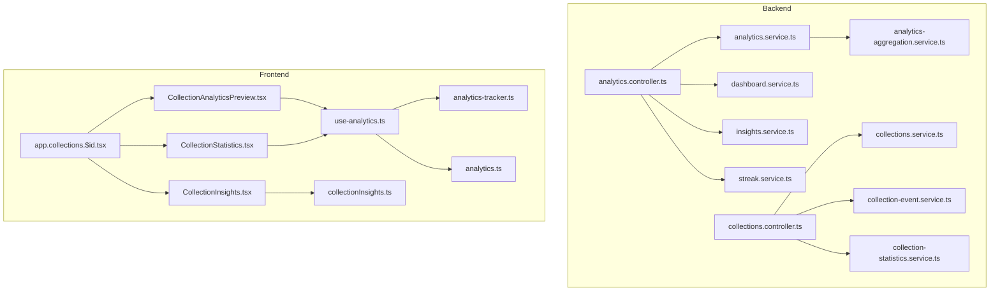
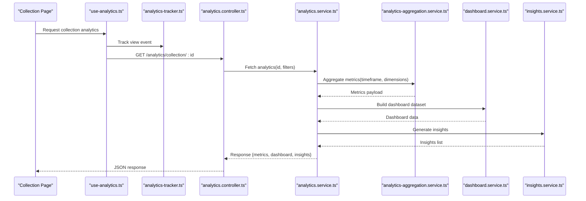
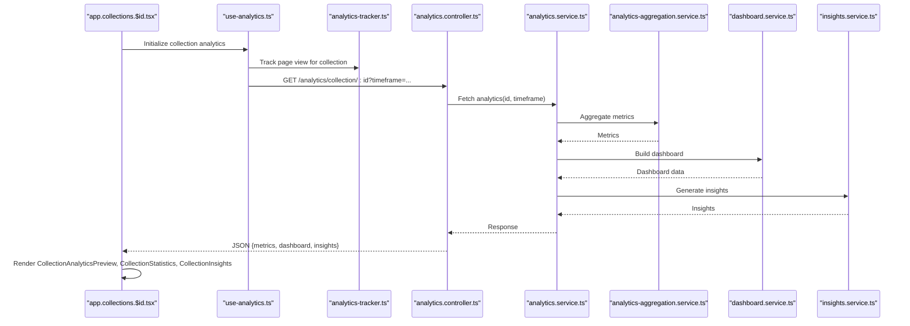
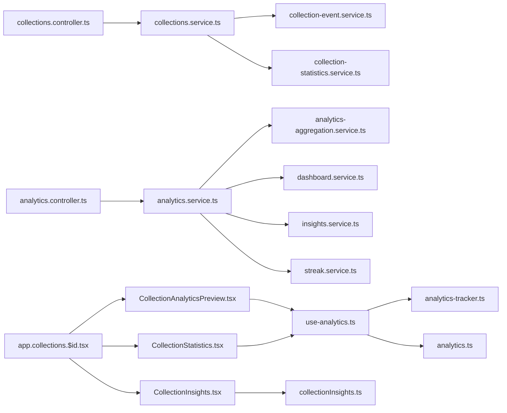

# Collection Analytics & Insights

<cite>
**Referenced Files in This Document**
- [analytics.controller.ts](file://apps/backend/src/analytics/analytics.controller.ts)
- [analytics.service.ts](file://apps/backend/src/analytics/analytics.service.ts)
- [analytics-aggregation.service.ts](file://apps/backend/src/analytics/analytics-aggregation.service.ts)
- [dashboard.service.ts](file://apps/backend/src/analytics/dashboard.service.ts)
- [insights.service.ts](file://apps/backend/src/analytics/insights.service.ts)
- [streak.service.ts](file://apps/backend/src/analytics/streak.service.ts)
- [collection-event.service.ts](file://apps/backend/src/collections/collection-event.service.ts)
- [collection-statistics.service.ts](file://apps/backend/src/collections/collection-statistics.service.ts)
- [collections.controller.ts](file://apps/backend/src/collections/collections.controller.ts)
- [collections.service.ts](file://apps/backend/src/collections/collections.service.ts)
- [use-analytics.ts](file://src/hooks/use-analytics.ts)
- [analytics-tracker.ts](file://src/lib/analytics-tracker.ts)
- [analytics.ts](file://src/lib/analytics.ts)
- [collectionInsights.ts](file://src/lib/collectionInsights.ts)
- [CollectionAnalyticsPreview.tsx](file://src/components/collections/CollectionAnalyticsPreview.tsx)
- [CollectionStatistics.tsx](file://src/components/collections/CollectionStatistics.tsx)
- [CollectionInsights.tsx](file://src/components/collections/CollectionInsights.tsx)
- [app.collections.$id.tsx](file://src/routes/app.collections.$id.tsx)
</cite>

## Table of Contents
1. [Introduction](#introduction)
2. [Project Structure](#project-structure)
3. [Core Components](#core-components)
4. [Architecture Overview](#architecture-overview)
5. [Detailed Component Analysis](#detailed-component-analysis)
6. [Dependency Analysis](#dependency-analysis)
7. [Performance Considerations](#performance-considerations)
8. [Troubleshooting Guide](#troubleshooting-guide)
9. [Conclusion](#conclusion)
10. [Appendices](#appendices)

## Introduction
This document explains the analytics and insights system for collections. It covers how collection usage patterns are tracked, how engagement metrics are calculated, and how insights are generated. It also describes integration with the broader analytics system, real-time statistics updates, reporting capabilities, visualization data structures, performance metrics, and customization options for collection-specific analytics dashboards.

## Project Structure
The analytics and insights functionality spans backend services (NestJS modules), frontend hooks and utilities, and UI components:
- Backend analytics module exposes controllers and services for aggregation, dashboard data, and insights.
- Collections module provides event tracking and statistics computation specific to collections.
- Frontend analytics utilities track events and provide hooks for consuming analytics data.
- UI components render collection analytics previews, statistics, and insights.

**Diagram sources**
- [analytics.controller.ts](file://apps/backend/src/analytics/analytics.controller.ts)
- [analytics.service.ts](file://apps/backend/src/analytics/analytics.service.ts)
- [analytics-aggregation.service.ts](file://apps/backend/src/analytics/analytics-aggregation.service.ts)
- [dashboard.service.ts](file://apps/backend/src/analytics/dashboard.service.ts)
- [insights.service.ts](file://apps/backend/src/analytics/insights.service.ts)
- [streak.service.ts](file://apps/backend/src/analytics/streak.service.ts)
- [collections.controller.ts](file://apps/backend/src/collections/collections.controller.ts)
- [collections.service.ts](file://apps/backend/src/collections/collections.service.ts)
- [collection-event.service.ts](file://apps/backend/src/collections/collection-event.service.ts)
- [collection-statistics.service.ts](file://apps/backend/src/collections/collection-statistics.service.ts)
- [use-analytics.ts](file://src/hooks/use-analytics.ts)
- [analytics-tracker.ts](file://src/lib/analytics-tracker.ts)
- [analytics.ts](file://src/lib/analytics.ts)
- [collectionInsights.ts](file://src/lib/collectionInsights.ts)
- [CollectionAnalyticsPreview.tsx](file://src/components/collections/CollectionAnalyticsPreview.tsx)
- [CollectionStatistics.tsx](file://src/components/collections/CollectionStatistics.tsx)
- [CollectionInsights.tsx](file://src/components/collections/CollectionInsights.tsx)
- [app.collections.$id.tsx](file://src/routes/app.collections.$id.tsx)

**Section sources**
- [analytics.controller.ts](file://apps/backend/src/analytics/analytics.controller.ts)
- [analytics.service.ts](file://apps/backend/src/analytics/analytics.service.ts)
- [analytics-aggregation.service.ts](file://apps/backend/src/analytics/analytics-aggregation.service.ts)
- [dashboard.service.ts](file://apps/backend/src/analytics/dashboard.service.ts)
- [insights.service.ts](file://apps/backend/src/analytics/insights.service.ts)
- [streak.service.ts](file://apps/backend/src/analytics/streak.service.ts)
- [collections.controller.ts](file://apps/backend/src/collections/collections.controller.ts)
- [collections.service.ts](file://apps/backend/src/collections/collections.service.ts)
- [collection-event.service.ts](file://apps/backend/src/collections/collection-event.service.ts)
- [collection-statistics.service.ts](file://apps/backend/src/collections/collection-statistics.service.ts)
- [use-analytics.ts](file://src/hooks/use-analytics.ts)
- [analytics-tracker.ts](file://src/lib/analytics-tracker.ts)
- [analytics.ts](file://src/lib/analytics.ts)
- [collectionInsights.ts](file://src/lib/collectionInsights.ts)
- [CollectionAnalyticsPreview.tsx](file://src/components/collections/CollectionAnalyticsPreview.tsx)
- [CollectionStatistics.tsx](file://src/components/collections/CollectionStatistics.tsx)
- [CollectionInsights.tsx](file://src/components/collections/CollectionInsights.tsx)
- [app.collections.$id.tsx](file://src/routes/app.collections.$id.tsx)

## Core Components
- Analytics Controller: Exposes endpoints for analytics queries and aggregates data via services.
- Analytics Service: Orchestrates analytics calculations and delegates to aggregation and insight services.
- Aggregation Service: Computes time-series and summary metrics used by dashboards and reports.
- Dashboard Service: Provides curated datasets for dashboard panels.
- Insights Service: Generates actionable insights based on aggregated metrics.
- Streak Service: Tracks user streaks relevant to engagement patterns.
- Collections Event Service: Emits and processes collection-related events for tracking usage.
- Collections Statistics Service: Calculates collection-specific metrics such as views, interactions, and growth.
- Collections Controller/Service: Entry points for collection operations that trigger analytics events and fetch stats.
- Frontend Analytics Hooks/Utilities: Track client-side events and expose analytics data to components.
- Collection Analytics UI Components: Render previews, statistics, and insights tailored to a collection.

**Section sources**
- [analytics.controller.ts](file://apps/backend/src/analytics/analytics.controller.ts)
- [analytics.service.ts](file://apps/backend/src/analytics/analytics.service.ts)
- [analytics-aggregation.service.ts](file://apps/backend/src/analytics/analytics-aggregation.service.ts)
- [dashboard.service.ts](file://apps/backend/src/analytics/dashboard.service.ts)
- [insights.service.ts](file://apps/backend/src/analytics/insights.service.ts)
- [streak.service.ts](file://apps/backend/src/analytics/streak.service.ts)
- [collection-event.service.ts](file://apps/backend/src/collections/collection-event.service.ts)
- [collection-statistics.service.ts](file://apps/backend/src/collections/collection-statistics.service.ts)
- [collections.controller.ts](file://apps/backend/src/collections/collections.controller.ts)
- [collections.service.ts](file://apps/backend/src/collections/collections.service.ts)
- [use-analytics.ts](file://src/hooks/use-analytics.ts)
- [analytics-tracker.ts](file://src/lib/analytics-tracker.ts)
- [analytics.ts](file://src/lib/analytics.ts)
- [collectionInsights.ts](file://src/lib/collectionInsights.ts)
- [CollectionAnalyticsPreview.tsx](file://src/components/collections/CollectionAnalyticsPreview.tsx)
- [CollectionStatistics.tsx](file://src/components/collections/CollectionStatistics.tsx)
- [CollectionInsights.tsx](file://src/components/collections/CollectionInsights.tsx)

## Architecture Overview
The system follows a layered architecture:
- Client-side tracking emits events through analytics utilities.
- Backend controller endpoints receive requests and delegate to services.
- Services compute metrics, aggregate data, and generate insights.
- UI components consume hooks and libraries to render dashboards and insights.

**Diagram sources**
- [use-analytics.ts](file://src/hooks/use-analytics.ts)
- [analytics-tracker.ts](file://src/lib/analytics-tracker.ts)
- [analytics.controller.ts](file://apps/backend/src/analytics/analytics.controller.ts)
- [analytics.service.ts](file://apps/backend/src/analytics/analytics.service.ts)
- [analytics-aggregation.service.ts](file://apps/backend/src/analytics/analytics-aggregation.service.ts)
- [dashboard.service.ts](file://apps/backend/src/analytics/dashboard.service.ts)
- [insights.service.ts](file://apps/backend/src/analytics/insights.service.ts)

## Detailed Component Analysis

### Analytics Controller
- Responsibilities: Define routes for analytics queries, validate inputs, and return structured responses.
- Integration: Delegates to analytics service for computation and returns aggregated results.
- Error handling: Uses consistent error responses and status codes.

**Section sources**
- [analytics.controller.ts](file://apps/backend/src/analytics/analytics.controller.ts)

### Analytics Service
- Responsibilities: Orchestrate analytics computations, coordinate between aggregation, dashboard, and insights services.
- Data flow: Accepts request parameters (e.g., collection id, timeframe), calls aggregation for metrics, builds dashboard payloads, and generates insights.
- Performance: May cache or paginate heavy aggregations; integrates with underlying repositories.

**Section sources**
- [analytics.service.ts](file://apps/backend/src/analytics/analytics.service.ts)

### Analytics Aggregation Service
- Responsibilities: Compute time-series metrics, counts, averages, and trends across collection interactions.
- Algorithms: Windowed aggregations, rolling sums, and rate calculations over time intervals.
- Output: Structured metric arrays suitable for charts and dashboards.

**Section sources**
- [analytics-aggregation.service.ts](file://apps/backend/src/analytics/analytics-aggregation.service.ts)

### Dashboard Service
- Responsibilities: Assemble curated datasets for dashboard panels (e.g., top collections, activity heatmaps).
- Customization: Supports filters for user, timeframe, and collection scope.
- Output: Panel-ready objects with labels, values, and series data.

**Section sources**
- [dashboard.service.ts](file://apps/backend/src/analytics/dashboard.service.ts)

### Insights Service
- Responsibilities: Derive actionable insights from metrics (e.g., spikes, drops, streaks, anomalies).
- Rules: Applies thresholds and pattern detection to produce human-readable insights.
- Output: List of insight items with context and suggested actions.

**Section sources**
- [insights.service.ts](file://apps/backend/src/analytics/insights.service.ts)

### Streak Service
- Responsibilities: Track consecutive days of collection engagement to compute streaks.
- Logic: Maintains state per user/collection and updates on each interaction.
- Output: Current streak length and historical streak data.

**Section sources**
- [streak.service.ts](file://apps/backend/src/analytics/streak.service.ts)

### Collections Event Service
- Responsibilities: Emit and process events related to collection usage (views, adds, bookmarks, completions).
- Tracking: Ensures consistent event schema and deduplication.
- Integration: Publishes events consumed by analytics pipelines.

**Section sources**
- [collection-event.service.ts](file://apps/backend/src/collections/collection-event.service.ts)

### Collections Statistics Service
- Responsibilities: Calculate collection-specific metrics (views, unique visitors, engagement rate, growth).
- Computation: Aggregates raw events into meaningful KPIs and trend indicators.
- Output: Summary statistics and time-series data for charts.

**Section sources**
- [collection-statistics.service.ts](file://apps/backend/src/collections/collection-statistics.service.ts)

### Collections Controller and Service
- Responsibilities: Handle CRUD and business logic for collections; trigger analytics events and retrieve stats.
- Flow: On key actions (create, update, view), emit events and update statistics.
- Integration: Works with event and statistics services to keep analytics current.

**Section sources**
- [collections.controller.ts](file://apps/backend/src/collections/collections.controller.ts)
- [collections.service.ts](file://apps/backend/src/collections/collections.service.ts)

### Frontend Analytics Hooks and Utilities
- use-analytics.ts: Provides hooks to fetch analytics data and subscribe to updates.
- analytics-tracker.ts: Tracks client-side events (page views, clicks) and sends them to the backend.
- analytics.ts: Shared analytics configuration and helpers.
- collectionInsights.ts: Utilities for interpreting and formatting collection insights.

**Section sources**
- [use-analytics.ts](file://src/hooks/use-analytics.ts)
- [analytics-tracker.ts](file://src/lib/analytics-tracker.ts)
- [analytics.ts](file://src/lib/analytics.ts)
- [collectionInsights.ts](file://src/lib/collectionInsights.ts)

### Collection Analytics UI Components
- CollectionAnalyticsPreview.tsx: Renders a compact preview of collection analytics (trends, highlights).
- CollectionStatistics.tsx: Displays detailed statistics (counts, rates, time-series).
- CollectionInsights.tsx: Shows generated insights with contextual explanations.
- app.collections.$id.tsx: Route component orchestrating data fetching and rendering for a collection page.

**Section sources**
- [CollectionAnalyticsPreview.tsx](file://src/components/collections/CollectionAnalyticsPreview.tsx)
- [CollectionStatistics.tsx](file://src/components/collections/CollectionStatistics.tsx)
- [CollectionInsights.tsx](file://src/components/collections/CollectionInsights.tsx)
- [app.collections.$id.tsx](file://src/routes/app.collections.$id.tsx)

#### Sequence Diagram: Collection Analytics Page Load

**Diagram sources**
- [app.collections.$id.tsx](file://src/routes/app.collections.$id.tsx)
- [use-analytics.ts](file://src/hooks/use-analytics.ts)
- [analytics-tracker.ts](file://src/lib/analytics-tracker.ts)
- [analytics.controller.ts](file://apps/backend/src/analytics/analytics.controller.ts)
- [analytics.service.ts](file://apps/backend/src/analytics/analytics.service.ts)
- [analytics-aggregation.service.ts](file://apps/backend/src/analytics/analytics-aggregation.service.ts)
- [dashboard.service.ts](file://apps/backend/src/analytics/dashboard.service.ts)
- [insights.service.ts](file://apps/backend/src/analytics/insights.service.ts)

## Dependency Analysis
The analytics system depends on:
- Collections module for event emission and statistics computation.
- Backend analytics services for aggregation, dashboard assembly, and insight generation.
- Frontend hooks and trackers for client-side event capture and data consumption.

**Diagram sources**
- [collections.controller.ts](file://apps/backend/src/collections/collections.controller.ts)
- [collections.service.ts](file://apps/backend/src/collections/collections.service.ts)
- [collection-event.service.ts](file://apps/backend/src/collections/collection-event.service.ts)
- [collection-statistics.service.ts](file://apps/backend/src/collections/collection-statistics.service.ts)
- [analytics.controller.ts](file://apps/backend/src/analytics/analytics.controller.ts)
- [analytics.service.ts](file://apps/backend/src/analytics/analytics.service.ts)
- [analytics-aggregation.service.ts](file://apps/backend/src/analytics/analytics-aggregation.service.ts)
- [dashboard.service.ts](file://apps/backend/src/analytics/dashboard.service.ts)
- [insights.service.ts](file://apps/backend/src/analytics/insights.service.ts)
- [streak.service.ts](file://apps/backend/src/analytics/streak.service.ts)
- [app.collections.$id.tsx](file://src/routes/app.collections.$id.tsx)
- [CollectionAnalyticsPreview.tsx](file://src/components/collections/CollectionAnalyticsPreview.tsx)
- [CollectionStatistics.tsx](file://src/components/collections/CollectionStatistics.tsx)
- [CollectionInsights.tsx](file://src/components/collections/CollectionInsights.tsx)
- [use-analytics.ts](file://src/hooks/use-analytics.ts)
- [analytics-tracker.ts](file://src/lib/analytics-tracker.ts)
- [analytics.ts](file://src/lib/analytics.ts)
- [collectionInsights.ts](file://src/lib/collectionInsights.ts)

**Section sources**
- [collections.controller.ts](file://apps/backend/src/collections/collections.controller.ts)
- [collections.service.ts](file://apps/backend/src/collections/collections.service.ts)
- [collection-event.service.ts](file://apps/backend/src/collections/collection-event.service.ts)
- [collection-statistics.service.ts](file://apps/backend/src/collections/collection-statistics.service.ts)
- [analytics.controller.ts](file://apps/backend/src/analytics/analytics.controller.ts)
- [analytics.service.ts](file://apps/backend/src/analytics/analytics.service.ts)
- [analytics-aggregation.service.ts](file://apps/backend/src/analytics/analytics-aggregation.service.ts)
- [dashboard.service.ts](file://apps/backend/src/analytics/dashboard.service.ts)
- [insights.service.ts](file://apps/backend/src/analytics/insights.service.ts)
- [streak.service.ts](file://apps/backend/src/analytics/streak.service.ts)
- [app.collections.$id.tsx](file://src/routes/app.collections.$id.tsx)
- [CollectionAnalyticsPreview.tsx](file://src/components/collections/CollectionAnalyticsPreview.tsx)
- [CollectionStatistics.tsx](file://src/components/collections/CollectionStatistics.tsx)
- [CollectionInsights.tsx](file://src/components/collections/CollectionInsights.tsx)
- [use-analytics.ts](file://src/hooks/use-analytics.ts)
- [analytics-tracker.ts](file://src/lib/analytics-tracker.ts)
- [analytics.ts](file://src/lib/analytics.ts)
- [collectionInsights.ts](file://src/lib/collectionInsights.ts)

## Performance Considerations
- Aggregation efficiency: Use indexed queries and windowed aggregations to minimize latency for time-series metrics.
- Caching: Cache dashboard datasets and frequently accessed insights for short-lived periods.
- Pagination: Paginate large metric sets to avoid heavy payloads.
- Event batching: Batch client-side analytics events before sending to reduce network overhead.
- Real-time updates: Prefer incremental updates via websockets or polling where necessary to keep dashboards fresh without full reloads.

[No sources needed since this section provides general guidance]

## Troubleshooting Guide
- Missing metrics: Verify that collection events are emitted on key actions and that the event service is wired correctly.
- Stale data: Check caching layers and ensure invalidation occurs after significant updates.
- Slow queries: Profile aggregation queries and add indexes for common filter fields (user, collection, timestamp).
- Frontend errors: Ensure analytics tracker is initialized and that hooks handle loading and error states gracefully.

**Section sources**
- [collection-event.service.ts](file://apps/backend/src/collections/collection-event.service.ts)
- [collection-statistics.service.ts](file://apps/backend/src/collections/collection-statistics.service.ts)
- [analytics-aggregation.service.ts](file://apps/backend/src/analytics/analytics-aggregation.service.ts)
- [use-analytics.ts](file://src/hooks/use-analytics.ts)
- [analytics-tracker.ts](file://src/lib/analytics-tracker.ts)

## Conclusion
The collection analytics and insights system combines robust backend services for aggregation and insight generation with a responsive frontend layer that tracks usage and renders rich dashboards. By emitting consistent events, computing meaningful metrics, and delivering actionable insights, it enables users to understand and optimize their collection engagement effectively.

[No sources needed since this section summarizes without analyzing specific files]

## Appendices

### Visualization Data Structures
- Metrics payload: Time-series arrays with timestamps, values, and labels for charts.
- Dashboard dataset: Panel objects containing summaries, series, and metadata.
- Insights list: Items with type, description, context, and suggested actions.

[No sources needed since this section describes conceptual structures]

### Customization Options
- Timeframe selection: Daily, weekly, monthly, custom ranges.
- Filters: User scope, collection scope, tags, statuses.
- Panel toggles: Enable/disable specific dashboard panels.
- Insight thresholds: Adjust sensitivity for anomaly detection and streak calculation.

[No sources needed since this section describes conceptual options]