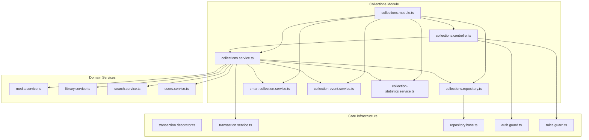
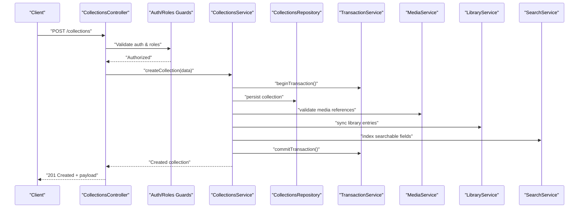
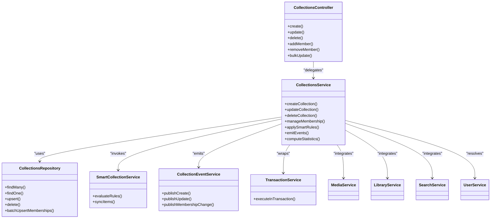
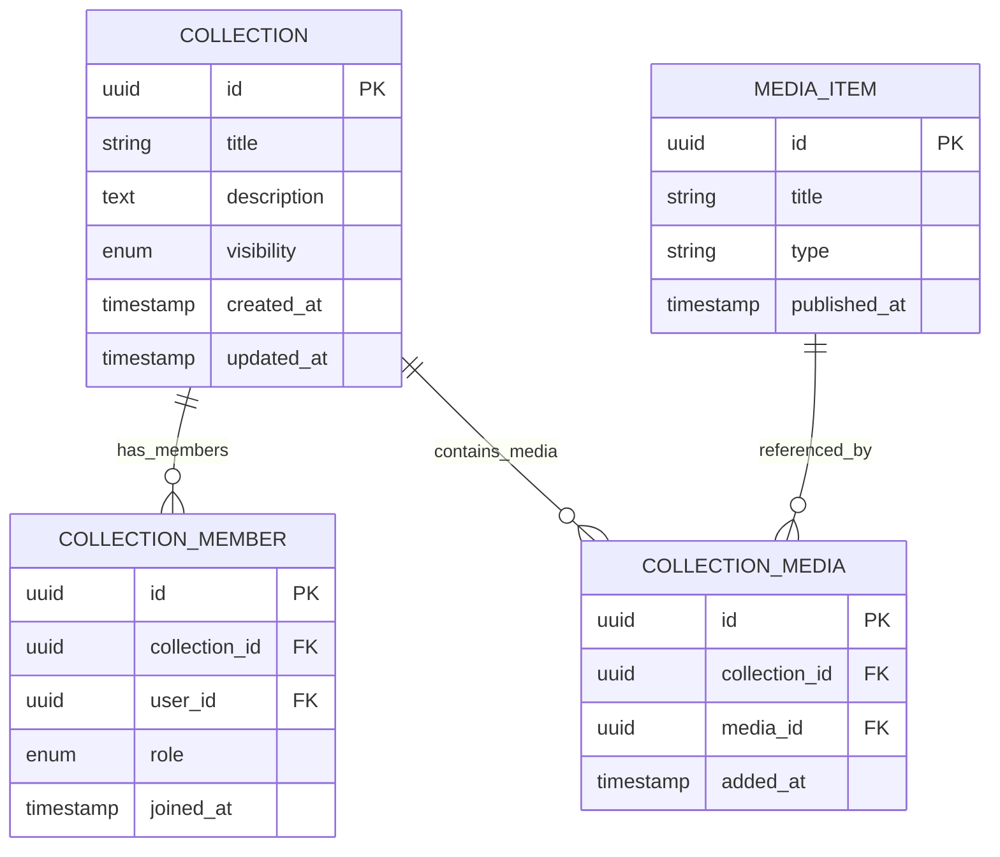

# Collection Management & Operations

<cite>
**Referenced Files in This Document**
- [collections.controller.ts](file://apps/backend/src/collections/collections.controller.ts)
- [collections.service.ts](file://apps/backend/src/collections/collections.service.ts)
- [collections.repository.ts](file://apps/backend/src/collections/collections.repository.ts)
- [smart-collection.service.ts](file://apps/backend/src/collections/smart-collection.service.ts)
- [collection-event.service.ts](file://apps/backend/src/collections/collection-event.service.ts)
- [collection-statistics.service.ts](file://apps/backend/src/collections/collection-statistics.service.ts)
- [collections.module.ts](file://apps/backend/src/collections/collections.module.ts)
- [index.ts](file://apps/backend/src/collections/index.ts)
- [schema.prisma](file://apps/backend/prisma/schema.prisma)
- [transaction.decorator.ts](file://apps/backend/src/core/transaction/transaction.decorator.ts)
- [transaction.service.ts](file://apps/backend/src/core/transaction/transaction.service.ts)
- [repository.base.ts](file://apps/backend/src/core/repository/repository.base.ts)
- [auth.guard.ts](file://apps/backend/src/auth/guards/auth.guard.ts)
- [roles.guard.ts](file://apps/backend/src/auth/guards/roles.guard.ts)
- [user.service.ts](file://apps/backend/src/users/users.service.ts)
- [media.service.ts](file://apps/backend/src/media/media.service.ts)
- [library.service.ts](file://apps/backend/src/library/library.service.ts)
- [search.service.ts](file://apps/backend/src/search/search.service.ts)
</cite>

## Table of Contents
1. [Introduction](#introduction)
2. [Project Structure](#project-structure)
3. [Core Components](#core-components)
4. [Architecture Overview](#architecture-overview)
5. [Detailed Component Analysis](#detailed-component-analysis)
6. [Dependency Analysis](#dependency-analysis)
7. [Performance Considerations](#performance-considerations)
8. [Troubleshooting Guide](#troubleshooting-guide)
9. [Conclusion](#conclusion)
10. [Appendices](#appendices)

## Introduction
This document explains collection management operations across the backend, focusing on CRUD, membership management, advanced filtering, repository layer patterns, transaction handling, sharing and permissions, and collaborative editing. It maps how controllers, services, repositories, and core infrastructure collaborate to provide robust data access and business logic for collections.

## Project Structure
The collections feature is implemented as a NestJS module with clear separation of concerns:
- Controller exposes HTTP endpoints for collection operations.
- Service encapsulates business logic, including membership and collaboration workflows.
- Repository handles data access via Prisma with consistent patterns.
- Core modules provide transactions, guards, and shared utilities.

**Diagram sources**
- [collections.controller.ts](file://apps/backend/src/collections/collections.controller.ts)
- [collections.service.ts](file://apps/backend/src/collections/collections.service.ts)
- [collections.repository.ts](file://apps/backend/src/collections/collections.repository.ts)
- [smart-collection.service.ts](file://apps/backend/src/collections/smart-collection.service.ts)
- [collection-event.service.ts](file://apps/backend/src/collections/collection-event.service.ts)
- [collection-statistics.service.ts](file://apps/backend/src/collections/collection-statistics.service.ts)
- [collections.module.ts](file://apps/backend/src/collections/collections.module.ts)
- [transaction.decorator.ts](file://apps/backend/src/core/transaction/transaction.decorator.ts)
- [transaction.service.ts](file://apps/backend/src/core/transaction/transaction.service.ts)
- [repository.base.ts](file://apps/backend/src/core/repository/repository.base.ts)
- [auth.guard.ts](file://apps/backend/src/auth/guards/auth.guard.ts)
- [roles.guard.ts](file://apps/backend/src/auth/guards/roles.guard.ts)
- [media.service.ts](file://apps/backend/src/media/media.service.ts)
- [library.service.ts](file://apps/backend/src/library/library.service.ts)
- [search.service.ts](file://apps/backend/src/search/search.service.ts)
- [user.service.ts](file://apps/backend/src/users/users.service.ts)

**Section sources**
- [collections.module.ts](file://apps/backend/src/collections/collections.module.ts)
- [index.ts](file://apps/backend/src/collections/index.ts)

## Core Components
- Collections Controller: Defines REST endpoints for creating, reading, updating, deleting collections; managing members; and performing bulk actions.
- Collections Service: Implements business rules for CRUD, membership lifecycle, permission checks, smart collections, events, statistics, and integration with media/library/search.
- Collections Repository: Encapsulates Prisma queries for collections, memberships, and related entities with pagination and filtering helpers.
- Smart Collection Service: Evaluates dynamic rules to include/exclude media items based on criteria (e.g., tags, dates, status).
- Collection Event Service: Emits domain events for changes (create, update, member add/remove) to support audit and integrations.
- Collection Statistics Service: Computes metrics like item counts, growth trends, and engagement indicators.

Key responsibilities:
- Enforce ownership and role-based access control before mutations.
- Use transactions for multi-step writes (e.g., adding multiple members or syncing items).
- Provide efficient filtering and pagination for large datasets.
- Emit events for downstream consumers (notifications, analytics).

**Section sources**
- [collections.controller.ts](file://apps/backend/src/collections/collections.controller.ts)
- [collections.service.ts](file://apps/backend/src/collections/collections.service.ts)
- [collections.repository.ts](file://apps/backend/src/collections/collections.repository.ts)
- [smart-collection.service.ts](file://apps/backend/src/collections/smart-collection.service.ts)
- [collection-event.service.ts](file://apps/backend/src/collections/collection-event.service.ts)
- [collection-statistics.service.ts](file://apps/backend/src/collections/collection-statistics.service.ts)

## Architecture Overview
The collections subsystem follows a layered architecture:
- Controllers receive requests, validate inputs, and delegate to services.
- Services orchestrate business logic, enforce permissions, and coordinate with other domain services.
- Repositories abstract database interactions using Prisma with consistent base patterns.
- Core modules supply cross-cutting concerns like transactions and authentication.

**Diagram sources**
- [collections.controller.ts](file://apps/backend/src/collections/collections.controller.ts)
- [collections.service.ts](file://apps/backend/src/collections/collections.service.ts)
- [collections.repository.ts](file://apps/backend/src/collections/collections.repository.ts)
- [transaction.service.ts](file://apps/backend/src/core/transaction/transaction.service.ts)
- [media.service.ts](file://apps/backend/src/media/media.service.ts)
- [library.service.ts](file://apps/backend/src/library/library.service.ts)
- [search.service.ts](file://apps/backend/src/search/search.service.ts)

## Detailed Component Analysis

### Collections Controller
Responsibilities:
- Expose endpoints for CRUD, membership, and bulk operations.
- Apply authentication and role-based authorization decorators.
- Map DTOs to service calls and return standardized responses.

Common operations:
- Create collection: validates owner context, persists via service.
- Update/Delete collection: enforces ownership and roles.
- Manage members: add/remove/update roles within a collection.
- Bulk actions: batch updates for tagging, archiving, or moving items.

Integration points:
- Uses guards for security.
- Delegates to service for all business logic.

**Section sources**
- [collections.controller.ts](file://apps/backend/src/collections/collections.controller.ts)
- [auth.guard.ts](file://apps/backend/src/auth/guards/auth.guard.ts)
- [roles.guard.ts](file://apps/backend/src/auth/guards/roles.guard.ts)

### Collections Service
Responsibilities:
- Implement CRUD operations with validation and error handling.
- Manage membership lifecycle and permission checks.
- Coordinate smart collection evaluation and rule application.
- Emit events for state changes and compute statistics.
- Orchestrate transactions for atomic multi-step operations.

Advanced filtering:
- Supports filters by tags, dates, statuses, and custom predicates.
- Leverages search service for full-text and faceted queries.
- Applies pagination and sorting efficiently.

Collaborative editing:
- Tracks collaborators and their roles.
- Ensures write conflicts are handled through optimistic concurrency or locking strategies.
- Publishes change events for real-time sync where applicable.

**Section sources**
- [collections.service.ts](file://apps/backend/src/collections/collections.service.ts)
- [smart-collection.service.ts](file://apps/backend/src/collections/smart-collection.service.ts)
- [collection-event.service.ts](file://apps/backend/src/collections/collection-event.service.ts)
- [collection-statistics.service.ts](file://apps/backend/src/collections/collection-statistics.service.ts)
- [transaction.service.ts](file://apps/backend/src/core/transaction/transaction.service.ts)

### Collections Repository
Responsibilities:
- Provide typed Prisma queries for collections and memberships.
- Implement pagination, filtering, and sorting helpers.
- Optimize queries with selective field projection and joins.
- Follow base repository patterns for consistency.

Data access patterns:
- Use transactions for multi-entity writes.
- Batch operations for performance-critical paths.
- Cache-friendly query composition when appropriate.

**Section sources**
- [collections.repository.ts](file://apps/backend/src/collections/collections.repository.ts)
- [repository.base.ts](file://apps/backend/src/core/repository/repository.base.ts)

### Smart Collection Service
Responsibilities:
- Evaluate dynamic inclusion rules for media items.
- Support rule types such as tag matches, date ranges, and status filters.
- Re-evaluate collections on relevant changes (item updates, tag changes).

Algorithm overview:
- Parse rule set into executable predicates.
- Iterate candidate items and apply filters.
- Persist membership results atomically.

**Section sources**
- [smart-collection.service.ts](file://apps/backend/src/collections/smart-collection.service.ts)

### Transaction Handling
Patterns:
- Decorator-based transaction boundaries around service methods.
- Centralized transaction service for begin/commit/rollback.
- Consistent error propagation and rollback on failures.

Best practices:
- Keep transactions short and focused.
- Avoid long-running I/O inside transactions.
- Use nested transaction helpers cautiously.

**Section sources**
- [transaction.decorator.ts](file://apps/backend/src/core/transaction/transaction.decorator.ts)
- [transaction.service.ts](file://apps/backend/src/core/transaction/transaction.service.ts)

### Permission Model and Sharing
Permissions:
- Owner: full control over collection and membership.
- Members: role-based access (view, edit, manage members).
- Public/Private visibility controls for sharing.

Sharing features:
- Generate share links with scoped permissions.
- Invite users via email or internal user IDs.
- Audit membership changes and track history.

Collaborative editing:
- Conflict resolution strategies for concurrent edits.
- Event-driven synchronization for live updates.
- Versioning or snapshots for critical content.

**Section sources**
- [collections.service.ts](file://apps/backend/src/collections/collections.service.ts)
- [roles.guard.ts](file://apps/backend/src/auth/guards/roles.guard.ts)
- [user.service.ts](file://apps/backend/src/users/users.service.ts)

### Integration Patterns
- Media Service: Validate and link media items to collections.
- Library Service: Sync collection membership with library entries.
- Search Service: Index collection metadata and memberships for fast retrieval.
- Users Service: Resolve collaborators and enforce user-level permissions.

**Section sources**
- [media.service.ts](file://apps/backend/src/media/media.service.ts)
- [library.service.ts](file://apps/backend/src/library/library.service.ts)
- [search.service.ts](file://apps/backend/src/search/search.service.ts)
- [user.service.ts](file://apps/backend/src/users/users.service.ts)

## Dependency Analysis
The collections module depends on core infrastructure and domain services. The following diagram shows key relationships and coupling.

**Diagram sources**
- [collections.controller.ts](file://apps/backend/src/collections/collections.controller.ts)
- [collections.service.ts](file://apps/backend/src/collections/collections.service.ts)
- [collections.repository.ts](file://apps/backend/src/collections/collections.repository.ts)
- [smart-collection.service.ts](file://apps/backend/src/collections/smart-collection.service.ts)
- [collection-event.service.ts](file://apps/backend/src/collections/collection-event.service.ts)
- [transaction.service.ts](file://apps/backend/src/core/transaction/transaction.service.ts)
- [media.service.ts](file://apps/backend/src/media/media.service.ts)
- [library.service.ts](file://apps/backend/src/library/library.service.ts)
- [search.service.ts](file://apps/backend/src/search/search.service.ts)
- [user.service.ts](file://apps/backend/src/users/users.service.ts)

**Section sources**
- [collections.module.ts](file://apps/backend/src/collections/collections.module.ts)

## Performance Considerations
- Query optimization:
  - Use selective projections to reduce payload size.
  - Leverage indexes on frequently filtered fields (tags, dates, status).
  - Prefer batched upserts for membership changes.
- Pagination and sorting:
  - Implement cursor-based pagination for large result sets.
  - Avoid deep offsets; use keyset pagination where possible.
- Transactions:
  - Minimize transaction scope to reduce lock contention.
  - Avoid heavy computations inside transactions.
- Caching:
  - Cache read-heavy queries (e.g., collection metadata) with invalidation on writes.
- Concurrency:
  - Use optimistic concurrency for collaborative edits to prevent lost updates.

[No sources needed since this section provides general guidance]

## Troubleshooting Guide
Common issues and resolutions:
- Authorization errors:
  - Ensure the authenticated user has required roles for the operation.
  - Verify ownership checks for collection mutations.
- Transaction failures:
  - Check for deadlocks or constraint violations during bulk operations.
  - Review logs for partial commits and rollbacks.
- Filtering performance:
  - Inspect query plans for missing indexes.
  - Simplify complex predicates if necessary.
- Membership sync inconsistencies:
  - Re-run smart collection evaluation jobs.
  - Validate event emission and consumption pipelines.

Debugging tips:
- Enable detailed logging for service methods involved in mutations.
- Use health and metrics endpoints to monitor performance.
- Validate schema migrations and constraints in Prisma.

**Section sources**
- [collections.service.ts](file://apps/backend/src/collections/collections.service.ts)
- [collections.repository.ts](file://apps/backend/src/collections/collections.repository.ts)
- [transaction.service.ts](file://apps/backend/src/core/transaction/transaction.service.ts)

## Conclusion
The collections subsystem provides a robust foundation for managing collections with strong separation of concerns, secure access controls, and scalable data access patterns. By leveraging transactions, smart rules, and integrations with media/library/search, it supports both individual and collaborative workflows. Adhering to the recommended performance and troubleshooting practices ensures reliable operation at scale.

[No sources needed since this section summarizes without analyzing specific files]

## Appendices

### Data Model Overview
The collections feature interacts with entities defined in the Prisma schema. Key entities include collections, memberships, and related media/library associations.

**Diagram sources**
- [schema.prisma](file://apps/backend/prisma/schema.prisma)

### Common Operations Examples
- Create a collection:
  - Endpoint: POST /collections
  - Payload: title, description, visibility
  - Outcome: persisted collection with owner membership
- Add members:
  - Endpoint: POST /collections/:id/members
  - Payload: array of {userId, role}
  - Outcome: batch membership creation within a transaction
- Filter collections:
  - Endpoint: GET /collections?filters=...
  - Filters: tags, date range, status, visibility
  - Outcome: paginated list with applied predicates
- Delete a collection:
  - Endpoint: DELETE /collections/:id
  - Outcome: cascade delete memberships and media associations

[No sources needed since this section provides conceptual examples]