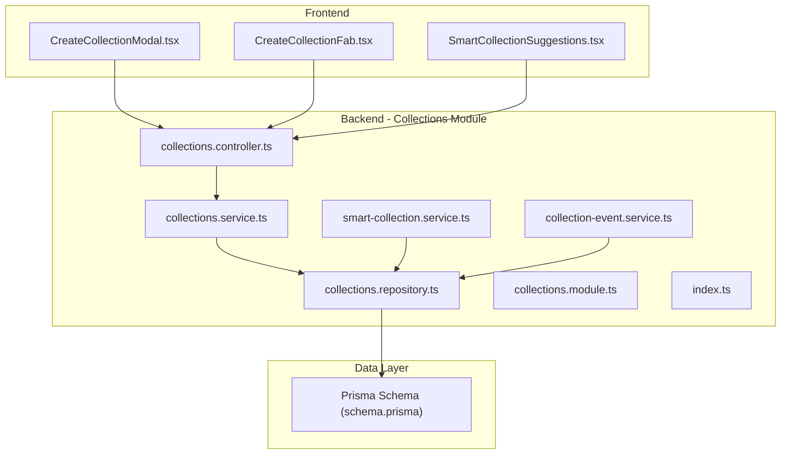
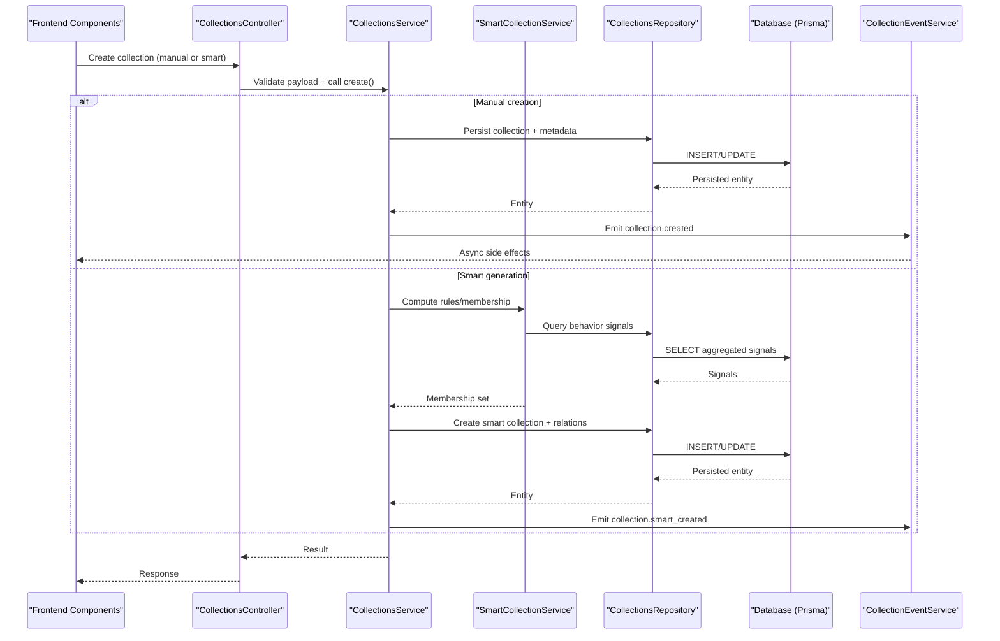
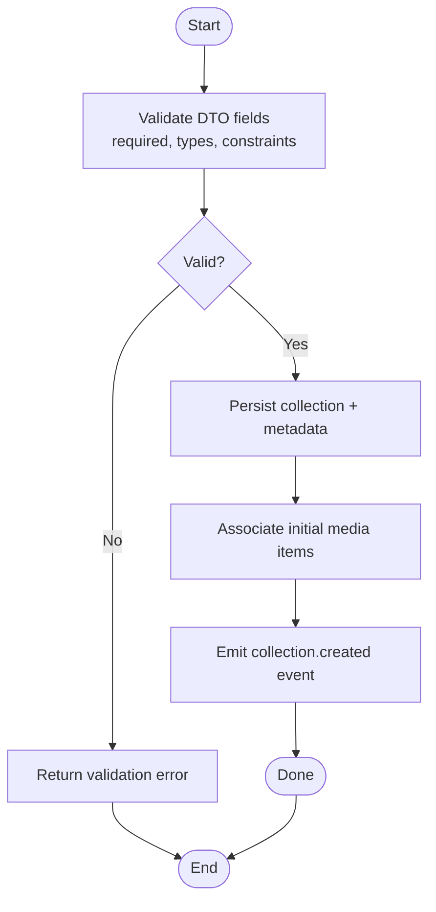
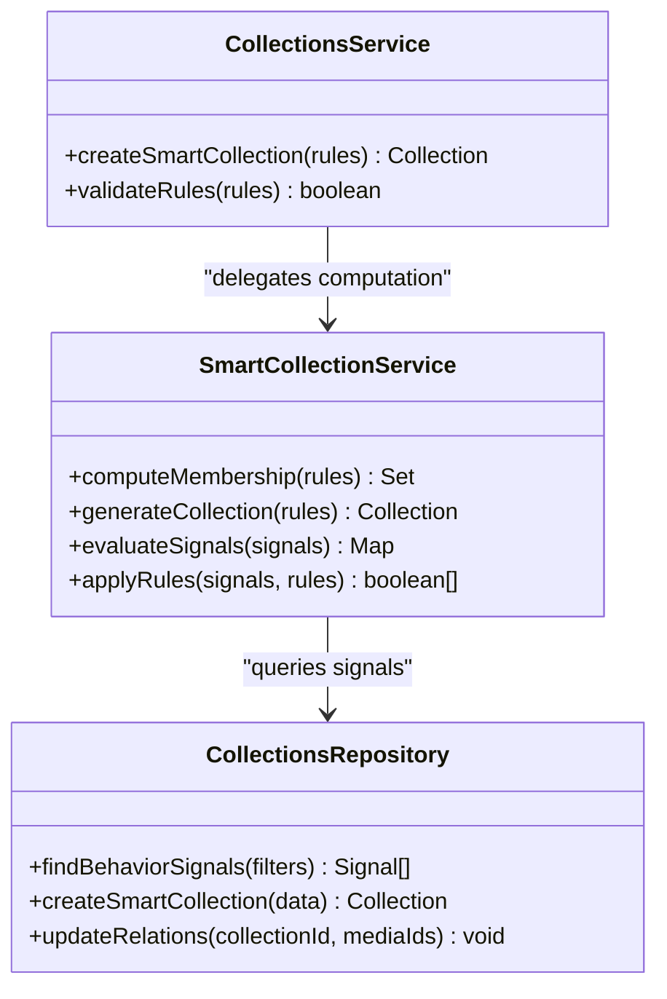
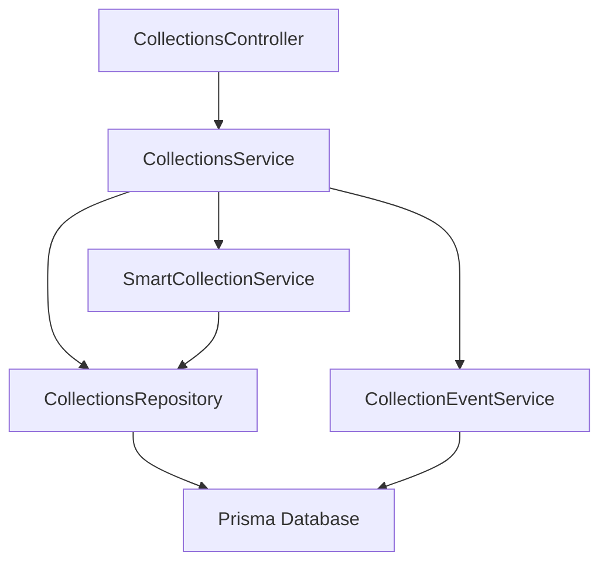

# Collection Types & Creation

<cite>
**Referenced Files in This Document**
- [collections.controller.ts](file://apps/backend/src/collections/collections.controller.ts)
- [collections.service.ts](file://apps/backend/src/collections/collections.service.ts)
- [collections.repository.ts](file://apps/backend/src/collections/collections.repository.ts)
- [smart-collection.service.ts](file://apps/backend/src/collections/smart-collection.service.ts)
- [collection-event.service.ts](file://apps/backend/src/collections/collection-event.service.ts)
- [collections.module.ts](file://apps/backend/src/collections/collections.module.ts)
- [index.ts](file://apps/backend/src/collections/index.ts)
- [dto/create-collection.dto.ts](file://apps/backend/src/collections/dto/create-collection.dto.ts)
- [dto/update-collection.dto.ts](file://apps/backend/src/collections/dto/update-collection.dto.ts)
- [schema.prisma](file://apps/backend/prisma/schema.prisma)
- [CreateCollectionModal.tsx](file://src/components/collections/CreateCollectionModal.tsx)
- [CreateCollectionFab.tsx](file://src/components/collections/CreateCollectionFab.tsx)
- [SmartCollectionSuggestions.tsx](file://src/components/collections/SmartCollectionSuggestions.tsx)
</cite>

## Table of Contents
1. [Introduction](#introduction)
2. [Project Structure](#project-structure)
3. [Core Components](#core-components)
4. [Architecture Overview](#architecture-overview)
5. [Detailed Component Analysis](#detailed-component-analysis)
6. [Dependency Analysis](#dependency-analysis)
7. [Performance Considerations](#performance-considerations)
8. [Troubleshooting Guide](#troubleshooting-guide)
9. [Conclusion](#conclusion)
10. [Appendices](#appendices)

## Introduction
This document explains collection types and creation mechanisms, focusing on:
- Manual collection creation with custom metadata
- Smart collection generation based on user behavior patterns
- The collection DTO structure and validation rules
- Differences between manual and automated collections
- Examples of creation workflows, metadata schemas, and best practices for organizing media content

The goal is to make it easy for both technical and non-technical readers to understand how collections are modeled, created, validated, and maintained over time.

## Project Structure
Collections functionality is implemented across backend modules (controllers, services, repositories, DTOs), a Prisma schema, and frontend components that drive the user experience.

**Diagram sources**
- [collections.controller.ts](file://apps/backend/src/collections/collections.controller.ts)
- [collections.service.ts](file://apps/backend/src/collections/collections.service.ts)
- [collections.repository.ts](file://apps/backend/src/collections/collections.repository.ts)
- [smart-collection.service.ts](file://apps/backend/src/collections/smart-collection.service.ts)
- [collection-event.service.ts](file://apps/backend/src/collections/collection-event.service.ts)
- [collections.module.ts](file://apps/backend/src/collections/collections.module.ts)
- [index.ts](file://apps/backend/src/collections/index.ts)
- [schema.prisma](file://apps/backend/prisma/schema.prisma)
- [CreateCollectionModal.tsx](file://src/components/collections/CreateCollectionModal.tsx)
- [CreateCollectionFab.tsx](file://src/components/collections/CreateCollectionFab.tsx)
- [SmartCollectionSuggestions.tsx](file://src/components/collections/SmartCollectionSuggestions.tsx)

**Section sources**
- [collections.controller.ts](file://apps/backend/src/collections/collections.controller.ts)
- [collections.service.ts](file://apps/backend/src/collections/collections.service.ts)
- [collections.repository.ts](file://apps/backend/src/collections/collections.repository.ts)
- [smart-collection.service.ts](file://apps/backend/src/collections/smart-collection.service.ts)
- [collection-event.service.ts](file://apps/backend/src/collections/collection-event.service.ts)
- [collections.module.ts](file://apps/backend/src/collections/collections.module.ts)
- [index.ts](file://apps/backend/src/collections/index.ts)
- [schema.prisma](file://apps/backend/prisma/schema.prisma)
- [CreateCollectionModal.tsx](file://src/components/collections/CreateCollectionModal.tsx)
- [CreateCollectionFab.tsx](file://src/components/collections/CreateCollectionFab.tsx)
- [SmartCollectionSuggestions.tsx](file://src/components/collections/SmartCollectionSuggestions.tsx)

## Core Components
- Controller: Exposes endpoints for creating, updating, and managing collections; orchestrates requests and responses.
- Service: Encapsulates business logic for manual and smart collections, including validation and event emission.
- Repository: Handles persistence operations against the database via Prisma.
- Smart Collection Service: Implements rule-based or behavior-driven generation of collections.
- Event Service: Emits domain events when collections change, enabling side effects like analytics or notifications.
- DTOs: Define request/response shapes and validation constraints for collection creation and updates.
- Prisma Schema: Defines the data model for collections and related entities.
- Frontend Components: Provide UI for manual creation and smart suggestions.

Key responsibilities:
- Manual creation: Validate inputs, persist metadata, associate media items, emit events.
- Smart generation: Evaluate user behavior signals, compute membership rules, create or update collections automatically.
- Validation: Enforce required fields, type safety, and business constraints.
- Events: Decouple side effects from core logic using domain events.

**Section sources**
- [collections.controller.ts](file://apps/backend/src/collections/collections.controller.ts)
- [collections.service.ts](file://apps/backend/src/collections/collections.service.ts)
- [collections.repository.ts](file://apps/backend/src/collections/collections.repository.ts)
- [smart-collection.service.ts](file://apps/backend/src/collections/smart-collection.service.ts)
- [collection-event.service.ts](file://apps/backend/src/collections/collection-event.service.ts)
- [dto/create-collection.dto.ts](file://apps/backend/src/collections/dto/create-collection.dto.ts)
- [dto/update-collection.dto.ts](file://apps/backend/src/collections/dto/update-collection.dto.ts)
- [schema.prisma](file://apps/backend/prisma/schema.prisma)

## Architecture Overview
The system separates concerns into controller, service, repository layers, with clear boundaries for manual vs. automated collection creation.

**Diagram sources**
- [collections.controller.ts](file://apps/backend/src/collections/collections.controller.ts)
- [collections.service.ts](file://apps/backend/src/collections/collections.service.ts)
- [smart-collection.service.ts](file://apps/backend/src/collections/smart-collection.service.ts)
- [collections.repository.ts](file://apps/backend/src/collections/collections.repository.ts)
- [collection-event.service.ts](file://apps/backend/src/collections/collection-event.service.ts)
- [schema.prisma](file://apps/backend/prisma/schema.prisma)

## Detailed Component Analysis

### Manual Collection Creation
Manual creation allows users to define a collection with explicit metadata and initial members.

Workflow highlights:
- Input validation via DTOs ensures required fields and correct types.
- Persistence layer creates the collection record and relationships.
- Domain events notify other parts of the system about the new collection.

**Diagram sources**
- [collections.controller.ts](file://apps/backend/src/collections/collections.controller.ts)
- [collections.service.ts](file://apps/backend/src/collections/collections.service.ts)
- [collections.repository.ts](file://apps/backend/src/collections/collections.repository.ts)
- [collection-event.service.ts](file://apps/backend/src/collections/collection-event.service.ts)
- [dto/create-collection.dto.ts](file://apps/backend/src/collections/dto/create-collection.dto.ts)

**Section sources**
- [collections.controller.ts](file://apps/backend/src/collections/collections.controller.ts)
- [collections.service.ts](file://apps/backend/src/collections/collections.service.ts)
- [collections.repository.ts](file://apps/backend/src/collections/collections.repository.ts)
- [collection-event.service.ts](file://apps/backend/src/collections/collection-event.service.ts)
- [dto/create-collection.dto.ts](file://apps/backend/src/collections/dto/create-collection.dto.ts)

### Smart Collection Generation
Smart collections are generated automatically based on user behavior patterns and configurable rules.

Behavioral signals may include:
- Frequent interactions with specific genres, creators, or themes
- Time-based preferences (e.g., weekend viewing habits)
- Cross-entity relationships (e.g., characters, franchises)

**Diagram sources**
- [smart-collection.service.ts](file://apps/backend/src/collections/smart-collection.service.ts)
- [collections.repository.ts](file://apps/backend/src/collections/collections.repository.ts)
- [collections.service.ts](file://apps/backend/src/collections/collections.service.ts)

**Section sources**
- [smart-collection.service.ts](file://apps/backend/src/collections/smart-collection.service.ts)
- [collections.repository.ts](file://apps/backend/src/collections/collections.repository.ts)
- [collections.service.ts](file://apps/backend/src/collections/collections.service.ts)

### Collection DTO Structure and Validation Rules
DTOs define the shape and constraints for collection creation and updates.

Typical properties:
- Title and description
- Visibility and sharing settings
- Metadata key-value pairs
- Initial member identifiers (for manual creation)
- Rule definitions (for smart collections)

Validation principles:
- Required fields enforced at the DTO level
- Type checks and format validations
- Business rule constraints (e.g., uniqueness, allowed values)

Best practices:
- Keep DTOs minimal and focused on input/output contracts
- Centralize validation messages for consistency
- Use separate DTOs for create vs. update where appropriate

**Section sources**
- [dto/create-collection.dto.ts](file://apps/backend/src/collections/dto/create-collection.dto.ts)
- [dto/update-collection.dto.ts](file://apps/backend/src/collections/dto/update-collection.dto.ts)

### Collection Properties and Metadata Schema
Collections support flexible metadata to organize and annotate media content.

Common properties:
- Identifier and timestamps
- Title, description, visibility flags
- Custom metadata map (key-value pairs)
- Membership list (media item references)

Metadata schema guidelines:
- Use consistent keys across collections
- Prefer structured values for filtering and analytics
- Avoid overly deep nesting to simplify queries

Example metadata categories:
- Thematic tags (e.g., “nostalgia”, “adventure”)
- Temporal markers (e.g., “summer 2024”)
- Personal annotations (e.g., “favorite quotes”, “discussion notes”)

**Section sources**
- [schema.prisma](file://apps/backend/prisma/schema.prisma)
- [collections.repository.ts](file://apps/backend/src/collections/collections.repository.ts)

### Difference Between Manual and Automated Collections
Manual collections:
- Created explicitly by users with defined metadata and members
- Stable until edited; changes require explicit actions

Automated (smart) collections:
- Generated by evaluating behavioral signals and rules
- Dynamic membership that updates as signals change
- Ideal for recurring themes or evolving interests

Operational differences:
- Manual: immediate persistence and event emission
- Automated: periodic evaluation or triggered recomputation

**Section sources**
- [collections.service.ts](file://apps/backend/src/collections/collections.service.ts)
- [smart-collection.service.ts](file://apps/backend/src/collections/smart-collection.service.ts)

### Frontend Integration and User Workflows
Frontend components guide users through collection creation and suggest smart collections based on context.

Key components:
- CreateCollectionModal: Presents form fields for manual creation and metadata entry
- CreateCollectionFab: Quick action to initiate creation flow
- SmartCollectionSuggestions: Displays recommended smart collections based on current activity

User workflow example:
- Open modal, fill title and metadata, add initial members
- Submit to backend controller, which validates and persists
- Optionally receive smart suggestions and auto-create collections

**Section sources**
- [CreateCollectionModal.tsx](file://src/components/collections/CreateCollectionModal.tsx)
- [CreateCollectionFab.tsx](file://src/components/collections/CreateCollectionFab.tsx)
- [SmartCollectionSuggestions.tsx](file://src/components/collections/SmartCollectionSuggestions.tsx)

## Dependency Analysis
The collections module depends on shared infrastructure and external services.

**Diagram sources**
- [collections.controller.ts](file://apps/backend/src/collections/collections.controller.ts)
- [collections.service.ts](file://apps/backend/src/collections/collections.service.ts)
- [collections.repository.ts](file://apps/backend/src/collections/collections.repository.ts)
- [smart-collection.service.ts](file://apps/backend/src/collections/smart-collection.service.ts)
- [collection-event.service.ts](file://apps/backend/src/collections/collection-event.service.ts)
- [schema.prisma](file://apps/backend/prisma/schema.prisma)

**Section sources**
- [collections.module.ts](file://apps/backend/src/collections/collections.module.ts)
- [index.ts](file://apps/backend/src/collections/index.ts)

## Performance Considerations
- Batch operations: Group multiple media associations to reduce round trips.
- Indexing: Ensure indexes on frequently queried metadata keys and membership relations.
- Caching: Cache computed smart memberships for short-lived periods to avoid heavy recomputation.
- Pagination: Paginate large membership lists and suggestion sets.
- Event processing: Use queues for async side effects to keep request latency low.

[No sources needed since this section provides general guidance]

## Troubleshooting Guide
Common issues and resolutions:
- Validation errors: Check DTO constraints and required fields; ensure client payloads match server expectations.
- Duplicate collections: Verify uniqueness constraints and deduplication logic before creation.
- Smart membership not updating: Confirm signal ingestion pipelines and rule evaluation triggers.
- Event failures: Inspect event handlers and retry policies; log failures for diagnostics.

Debugging tips:
- Enable detailed logging around DTO validation and persistence steps.
- Use Prisma query logs to inspect slow or failing queries.
- Monitor event queues for backlogs or errors.

**Section sources**
- [collections.controller.ts](file://apps/backend/src/collections/collections.controller.ts)
- [collections.service.ts](file://apps/backend/src/collections/collections.service.ts)
- [collection-event.service.ts](file://apps/backend/src/collections/collection-event.service.ts)

## Conclusion
Collections provide a flexible way to organize media content through both manual curation and automated intelligence. By separating concerns across controllers, services, repositories, and leveraging DTOs and events, the system supports robust validation, dynamic membership, and scalable growth. Following the best practices outlined here will help maintain clarity, performance, and reliability in collection management.

[No sources needed since this section summarizes without analyzing specific files]

## Appendices

### Example Creation Workflows
- Manual creation:
  - User fills title, description, and metadata
  - Adds initial media items
  - Submits; backend validates, persists, emits event
- Smart generation:
  - System evaluates recent interactions and preferences
  - Computes membership based on rules
  - Creates collection and associates members dynamically

**Section sources**
- [CreateCollectionModal.tsx](file://src/components/collections/CreateCollectionModal.tsx)
- [SmartCollectionSuggestions.tsx](file://src/components/collections/SmartCollectionSuggestions.tsx)
- [collections.service.ts](file://apps/backend/src/collections/collections.service.ts)
- [smart-collection.service.ts](file://apps/backend/src/collections/smart-collection.service.ts)

### Best Practices for Organizing Media Content
- Use consistent metadata keys across collections
- Prefer descriptive titles and concise descriptions
- Limit nested metadata to improve queryability
- Leverage smart collections for evolving themes
- Regularly review and prune outdated collections

[No sources needed since this section provides general guidance]