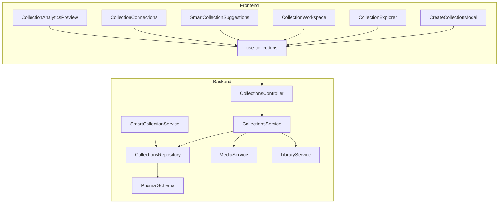
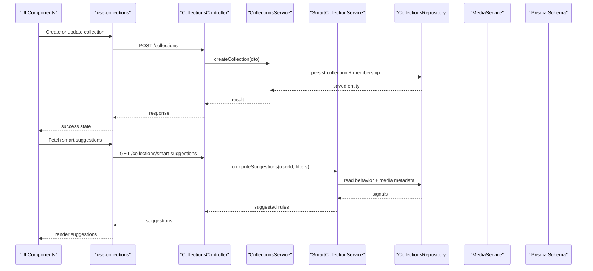
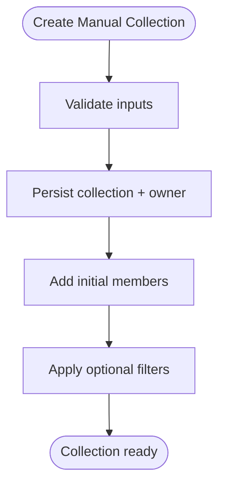
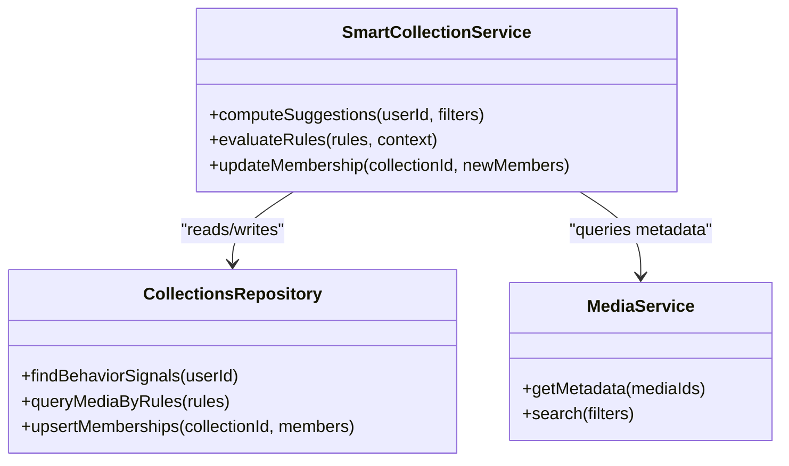
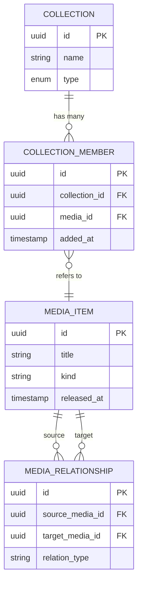
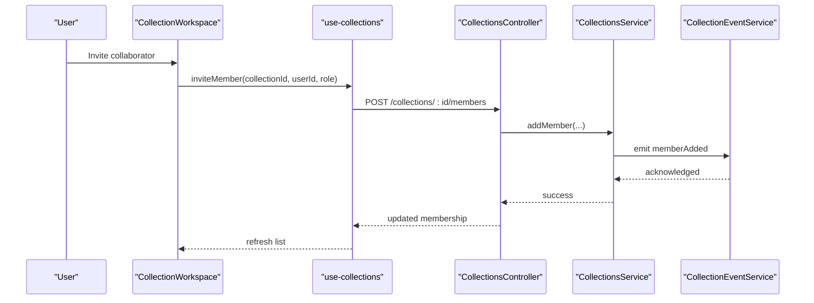
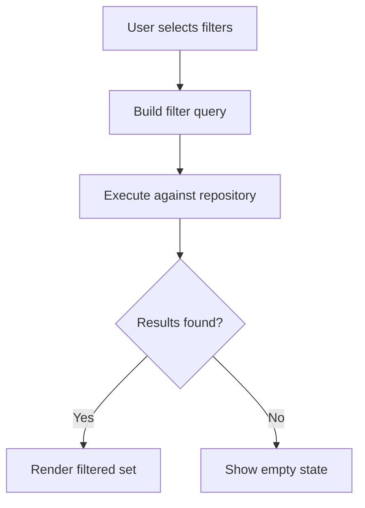
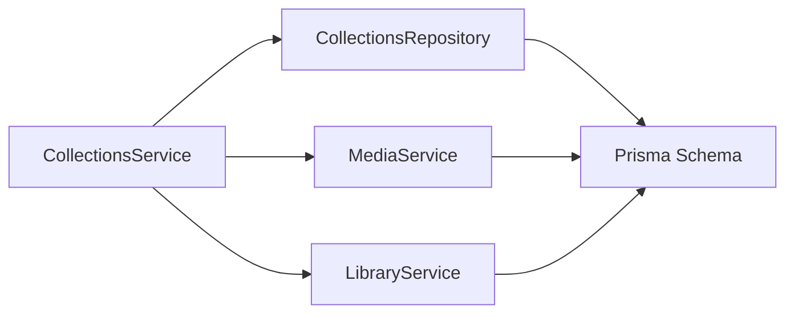
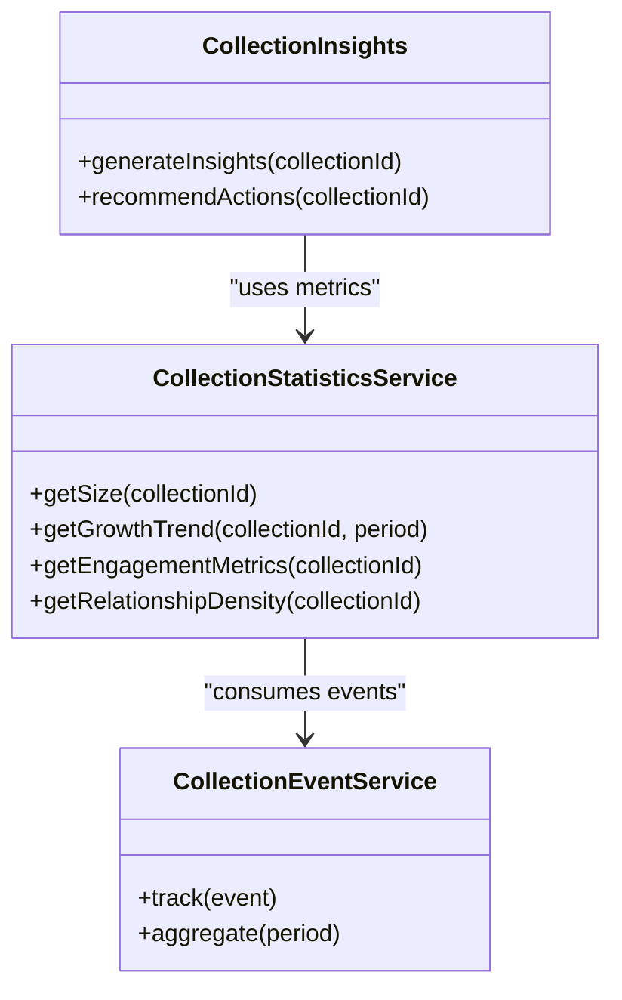
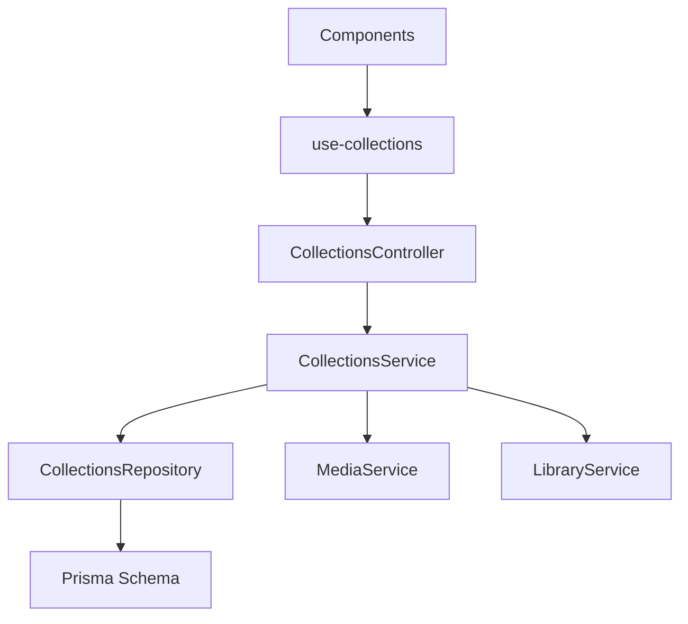

# Collections & Organization

<cite>
**Referenced Files in This Document**
- [collections.service.ts](file://apps/backend/src/collections/collections.service.ts)
- [collections.controller.ts](file://apps/backend/src/collections/collections.controller.ts)
- [collections.repository.ts](file://apps/backend/src/collections/collections.repository.ts)
- [smart-collection.service.ts](file://apps/backend/src/collections/smart-collection.service.ts)
- [collection-event.service.ts](file://apps/backend/src/collections/collection-event.service.ts)
- [collection-statistics.service.ts](file://apps/backend/src/collections/collection-statistics.service.ts)
- [collections.module.ts](file://apps/backend/src/collections/collections.module.ts)
- [schema.prisma](file://apps/backend/prisma/schema.prisma)
- [use-collections.ts](file://src/hooks/use-collections.ts)
- [CreateCollectionModal.tsx](file://src/components/collections/CreateCollectionModal.tsx)
- [SmartCollectionSuggestions.tsx](file://src/components/collections/SmartCollectionSuggestions.tsx)
- [CollectionExplorer.tsx](file://src/components/collections/CollectionExplorer.tsx)
- [CollectionWorkspace.tsx](file://src/components/collections/CollectionWorkspace.tsx)
- [CollectionConnections.tsx](file://src/components/collections/CollectionConnections.tsx)
- [CollectionAnalyticsPreview.tsx](file://src/components/collections/CollectionAnalyticsPreview.tsx)
- [collectionInsights.ts](file://src/lib/collectionInsights.ts)
- [collectionRelationships.ts](file://src/lib/collectionRelationships.ts)
- [media.service.ts](file://apps/backend/src/media/media.service.ts)
- [library.service.ts](file://apps/backend/src/library/library.service.ts)
</cite>

## Table of Contents
1. Introduction
2. Project Structure
3. Core Components
4. Architecture Overview
5. Detailed Component Analysis
6. Dependency Analysis
7. Performance Considerations
8. Troubleshooting Guide
9. Conclusion

## Introduction
This document explains the collections and organizational system: how collections are created, how smart suggestions work from user behavior, how media items cross-reference each other within collections, and how collaboration features operate. It covers manual vs smart collection types, membership management, advanced filtering, the relationship engine connecting collections to media and other collections, and analytics/insights for organization.

## Project Structure
The collections feature spans backend NestJS modules (controllers, services, repositories), Prisma schema definitions, and frontend React components/hooks that drive creation, exploration, workspace editing, and insights.

**Diagram sources**
- [CreateCollectionModal.tsx](file://src/components/collections/CreateCollectionModal.tsx)
- [CollectionExplorer.tsx](file://src/components/collections/CollectionExplorer.tsx)
- [CollectionWorkspace.tsx](file://src/components/collections/CollectionWorkspace.tsx)
- [SmartCollectionSuggestions.tsx](file://src/components/collections/SmartCollectionSuggestions.tsx)
- [CollectionConnections.tsx](file://src/components/collections/CollectionConnections.tsx)
- [CollectionAnalyticsPreview.tsx](file://src/components/collections/CollectionAnalyticsPreview.tsx)
- [use-collections.ts](file://src/hooks/use-collections.ts)
- [collections.controller.ts](file://apps/backend/src/collections/collections.controller.ts)
- [collections.service.ts](file://apps/backend/src/collections/collections.service.ts)
- [smart-collection.service.ts](file://apps/backend/src/collections/smart-collection.service.ts)
- [collections.repository.ts](file://apps/backend/src/collections/collections.repository.ts)
- [media.service.ts](file://apps/backend/src/media/media.service.ts)
- [library.service.ts](file://apps/backend/src/library/library.service.ts)
- [schema.prisma](file://apps/backend/prisma/schema.prisma)

**Section sources**
- [collections.controller.ts](file://apps/backend/src/collections/collections.controller.ts)
- [collections.service.ts](file://apps/backend/src/collections/collections.service.ts)
- [collections.repository.ts](file://apps/backend/src/collections/collections.repository.ts)
- [smart-collection.service.ts](file://apps/backend/src/collections/smart-collection.service.ts)
- [use-collections.ts](file://src/hooks/use-collections.ts)
- [CreateCollectionModal.tsx](file://src/components/collections/CreateCollectionModal.tsx)
- [CollectionExplorer.tsx](file://src/components/collections/CollectionExplorer.tsx)
- [CollectionWorkspace.tsx](file://src/components/collections/CollectionWorkspace.tsx)
- [SmartCollectionSuggestions.tsx](file://src/components/collections/SmartCollectionSuggestions.tsx)
- [CollectionConnections.tsx](file://src/components/collections/CollectionConnections.tsx)
- [CollectionAnalyticsPreview.tsx](file://src/components/collections/CollectionAnalyticsPreview.tsx)
- [collectionInsights.ts](file://src/lib/collectionInsights.ts)
- [collectionRelationships.ts](file://src/lib/collectionRelationships.ts)
- [schema.prisma](file://apps/backend/prisma/schema.prisma)

## Core Components
- CollectionsController: Exposes REST endpoints for CRUD, membership, relationships, and smart operations.
- CollectionsService: Orchestrates business logic for manual and smart collections, membership, and relationships.
- SmartCollectionService: Generates dynamic membership rules based on user behavior and metadata.
- CollectionsRepository: Data access layer over Prisma for collections, memberships, and relationships.
- CollectionEventService: Emits lifecycle events for collection changes to support analytics and integrations.
- CollectionStatisticsService: Computes metrics like size, growth, and engagement per collection.
- Frontend hooks and components: Provide UI for creating, exploring, editing, suggesting, and analyzing collections.

Key responsibilities:
- Manual collections: explicit membership by users.
- Smart collections: rule-based, auto-updating membership driven by behavior signals and media attributes.
- Cross-references: links between media items and between collections.
- Collaboration: shared ownership and permissions via membership.
- Filtering: advanced query filters for both manual and smart sets.
- Analytics: insights into usage, growth, and relationships.

**Section sources**
- [collections.controller.ts](file://apps/backend/src/collections/collections.controller.ts)
- [collections.service.ts](file://apps/backend/src/collections/collections.service.ts)
- [smart-collection.service.ts](file://apps/backend/src/collections/smart-collection.service.ts)
- [collections.repository.ts](file://apps/backend/src/collections/collections.repository.ts)
- [collection-event.service.ts](file://apps/backend/src/collections/collection-event.service.ts)
- [collection-statistics.service.ts](file://apps/backend/src/collections/collection-statistics.service.ts)

## Architecture Overview
The system follows a layered architecture:
- Presentation layer (React components) calls API hooks.
- API layer (NestJS controller) validates requests and delegates to services.
- Domain services implement business logic and coordinate with repositories and related services.
- Data layer uses Prisma to persist collections, memberships, and relationships.

**Diagram sources**
- [use-collections.ts](file://src/hooks/use-collections.ts)
- [collections.controller.ts](file://apps/backend/src/collections/collections.controller.ts)
- [collections.service.ts](file://apps/backend/src/collections/collections.service.ts)
- [smart-collection.service.ts](file://apps/backend/src/collections/smart-collection.service.ts)
- [collections.repository.ts](file://apps/backend/src/collections/collections.repository.ts)
- [media.service.ts](file://apps/backend/src/media/media.service.ts)
- [schema.prisma](file://apps/backend/prisma/schema.prisma)

## Detailed Component Analysis

### Manual Collections
Manual collections are explicitly curated by users. Membership is managed directly through add/remove operations. Advanced filtering can be applied when querying members.

- Creation: Users define title, description, type (manual), and initial members.
- Membership: Add/remove members; supports bulk operations.
- Filtering: By tags, dates, status, and custom fields exposed by media metadata.
- Relationships: Link to other collections and media items.

**Diagram sources**
- [collections.controller.ts](file://apps/backend/src/collections/collections.controller.ts)
- [collections.service.ts](file://apps/backend/src/collections/collections.service.ts)
- [collections.repository.ts](file://apps/backend/src/collections/collections.repository.ts)

**Section sources**
- [collections.service.ts](file://apps/backend/src/collections/collections.service.ts)
- [collections.repository.ts](file://apps/backend/src/collections/collections.repository.ts)

### Smart Collections
Smart collections use rules derived from user behavior and media attributes to auto-populate membership. Rules can include genre, release date ranges, completion status, ratings, and interaction signals.

- Rule Engine: Builds queries dynamically from rule definitions.
- Behavior Signals: Uses interaction history, watch/read progress, and preferences.
- Evaluation: Periodic or on-demand recomputation of membership.
- Suggestions: UI suggests rule templates based on recent activity.

**Diagram sources**
- [smart-collection.service.ts](file://apps/backend/src/collections/smart-collection.service.ts)
- [collections.repository.ts](file://apps/backend/src/collections/collections.repository.ts)
- [media.service.ts](file://apps/backend/src/media/media.service.ts)

**Section sources**
- [smart-collection.service.ts](file://apps/backend/src/collections/smart-collection.service.ts)
- [collections.repository.ts](file://apps/backend/src/collections/collections.repository.ts)
- [media.service.ts](file://apps/backend/src/media/media.service.ts)

### Cross-References Between Media Items
Cross-references enable linking media items within a collection (e.g., sequels, spin-offs, companion pieces). These links are stored as relationships and surfaced in the UI.

- Relationship Types: Sequel, Prequel, Companion, Adaptation, etc.
- Bidirectional Links: Optional symmetry for discoverability.
- Validation: Prevent cycles and enforce referential integrity.

**Diagram sources**
- [schema.prisma](file://apps/backend/prisma/schema.prisma)
- [collections.repository.ts](file://apps/backend/src/collections/collections.repository.ts)
- [media.service.ts](file://apps/backend/src/media/media.service.ts)

**Section sources**
- [schema.prisma](file://apps/backend/prisma/schema.prisma)
- [collections.repository.ts](file://apps/backend/src/collections/collections.repository.ts)
- [media.service.ts](file://apps/backend/src/media/media.service.ts)

### Collaborative Features
Collaboration is enabled through membership roles and permissions. Owners can invite collaborators, assign roles, and manage access.

- Roles: Owner, Editor, Viewer.
- Permissions: Read, write, manage membership, publish/share.
- Audit: Track changes via event service.

**Diagram sources**
- [CollectionWorkspace.tsx](file://src/components/collections/CollectionWorkspace.tsx)
- [use-collections.ts](file://src/hooks/use-collections.ts)
- [collections.controller.ts](file://apps/backend/src/collections/collections.controller.ts)
- [collections.service.ts](file://apps/backend/src/collections/collections.service.ts)
- [collection-event.service.ts](file://apps/backend/src/collections/collection-event.service.ts)

**Section sources**
- [collection-event.service.ts](file://apps/backend/src/collections/collection-event.service.ts)
- [collections.service.ts](file://apps/backend/src/collections/collections.service.ts)

### Advanced Filtering Capabilities
Filtering supports multiple dimensions:
- Metadata: genre, year, language, duration, rating.
- Status: in-progress, completed, dropped, planning.
- Interaction: watched/read counts, favorites, bookmarks.
- Custom tags and labels defined by users.

**Diagram sources**
- [collections.repository.ts](file://apps/backend/src/collections/collections.repository.ts)
- [media.service.ts](file://apps/backend/src/media/media.service.ts)
- [library.service.ts](file://apps/backend/src/library/library.service.ts)

**Section sources**
- [collections.repository.ts](file://apps/backend/src/collections/collections.repository.ts)
- [media.service.ts](file://apps/backend/src/media/media.service.ts)
- [library.service.ts](file://apps/backend/src/library/library.service.ts)

### Relationship Engine
The relationship engine connects:
- Collections to media items via membership records.
- Collections to other collections via explicit links.
- Media items to each other via relationship records.

It ensures consistency, prevents invalid states, and powers discovery surfaces.

**Diagram sources**
- [collections.service.ts](file://apps/backend/src/collections/collections.service.ts)
- [collections.repository.ts](file://apps/backend/src/collections/collections.repository.ts)
- [media.service.ts](file://apps/backend/src/media/media.service.ts)
- [library.service.ts](file://apps/backend/src/library/library.service.ts)
- [schema.prisma](file://apps/backend/prisma/schema.prisma)

**Section sources**
- [collections.service.ts](file://apps/backend/src/collections/collections.service.ts)
- [collections.repository.ts](file://apps/backend/src/collections/collections.repository.ts)
- [media.service.ts](file://apps/backend/src/media/media.service.ts)
- [library.service.ts](file://apps/backend/src/library/library.service.ts)
- [schema.prisma](file://apps/backend/prisma/schema.prisma)

### Analytics and Insights
Analytics provide visibility into collection health and usage:
- Size and growth trends.
- Engagement metrics (views, reads, interactions).
- Relationship density and connectivity.
- Recommendations for reorganization.

**Diagram sources**
- [collection-statistics.service.ts](file://apps/backend/src/collections/collection-statistics.service.ts)
- [collection-event.service.ts](file://apps/backend/src/collections/collection-event.service.ts)
- [collectionInsights.ts](file://src/lib/collectionInsights.ts)

**Section sources**
- [collection-statistics.service.ts](file://apps/backend/src/collections/collection-statistics.service.ts)
- [collection-event.service.ts](file://apps/backend/src/collections/collection-event.service.ts)
- [collectionInsights.ts](file://src/lib/collectionInsights.ts)

## Dependency Analysis
The collections module depends on media and library services for metadata and status data, and on Prisma for persistence. The frontend hook abstracts API calls and state synchronization.

**Diagram sources**
- [collections.controller.ts](file://apps/backend/src/collections/collections.controller.ts)
- [collections.service.ts](file://apps/backend/src/collections/collections.service.ts)
- [collections.repository.ts](file://apps/backend/src/collections/collections.repository.ts)
- [media.service.ts](file://apps/backend/src/media/media.service.ts)
- [library.service.ts](file://apps/backend/src/library/library.service.ts)
- [schema.prisma](file://apps/backend/prisma/schema.prisma)
- [use-collections.ts](file://src/hooks/use-collections.ts)

**Section sources**
- [collections.controller.ts](file://apps/backend/src/collections/collections.controller.ts)
- [collections.service.ts](file://apps/backend/src/collections/collections.service.ts)
- [collections.repository.ts](file://apps/backend/src/collections/collections.repository.ts)
- [media.service.ts](file://apps/backend/src/media/media.service.ts)
- [library.service.ts](file://apps/backend/src/library/library.service.ts)
- [schema.prisma](file://apps/backend/prisma/schema.prisma)
- [use-collections.ts](file://src/hooks/use-collections.ts)

## Performance Considerations
- Indexing: Ensure indexes on frequently filtered fields (genre, release date, status).
- Query Optimization: Use selective projections and avoid N+1 queries in membership retrieval.
- Caching: Cache smart suggestion results for short periods to reduce recomputation.
- Batch Operations: Support bulk add/remove for membership updates.
- Pagination: Implement cursor-based pagination for large collections.

[No sources needed since this section provides general guidance]

## Troubleshooting Guide
Common issues and resolutions:
- Smart suggestions not updating: Verify behavior signal ingestion and scheduled evaluation jobs.
- Membership inconsistencies: Check transaction boundaries during bulk updates and ensure referential integrity constraints.
- Filter performance degradation: Review query plans and add appropriate indexes.
- Collaboration errors: Validate role-based permissions and audit logs for unauthorized actions.

**Section sources**
- [smart-collection.service.ts](file://apps/backend/src/collections/smart-collection.service.ts)
- [collections.repository.ts](file://apps/backend/src/collections/collections.repository.ts)
- [collection-event.service.ts](file://apps/backend/src/collections/collection-event.service.ts)

## Conclusion
The collections system combines manual curation with intelligent automation, enabling powerful organization and discovery. Through robust relationships, collaborative membership, advanced filtering, and actionable analytics, it supports both personal and team-driven media storytelling.

[No sources needed since this section summarizes without analyzing specific files]