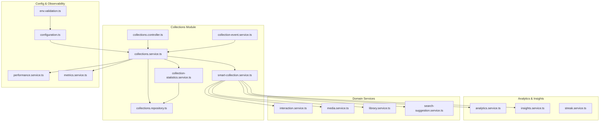
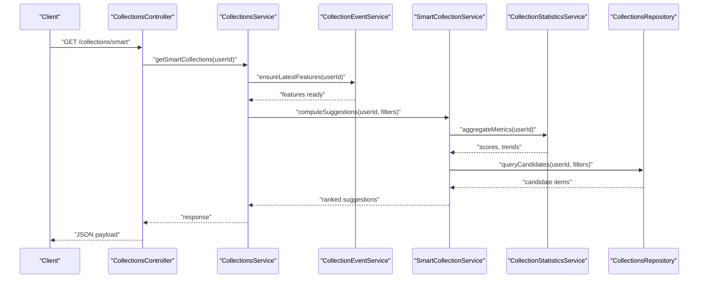
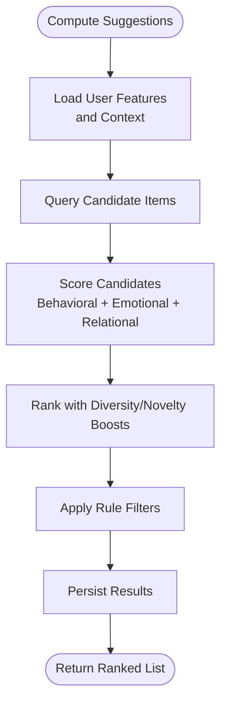
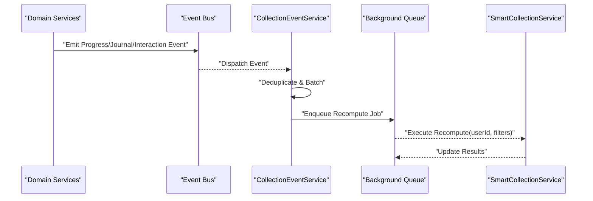
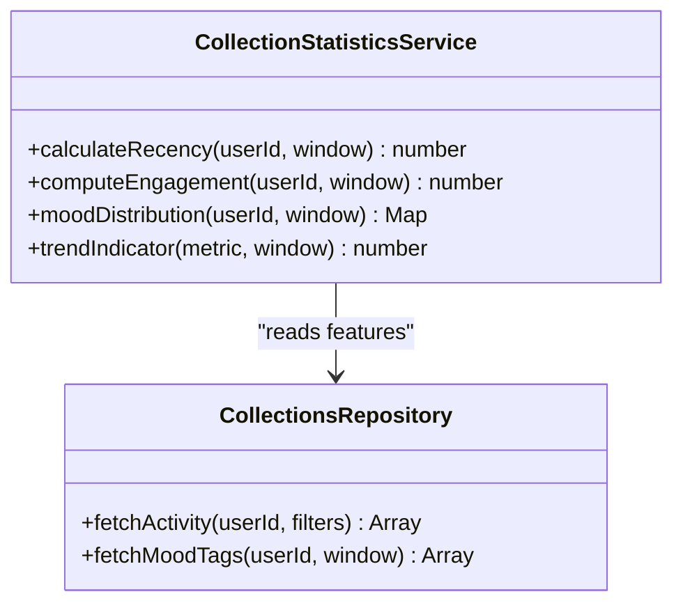
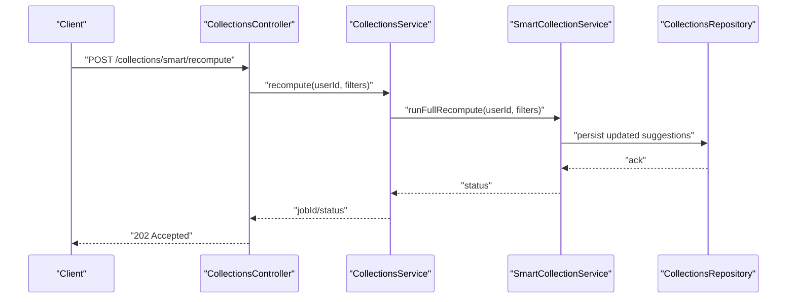
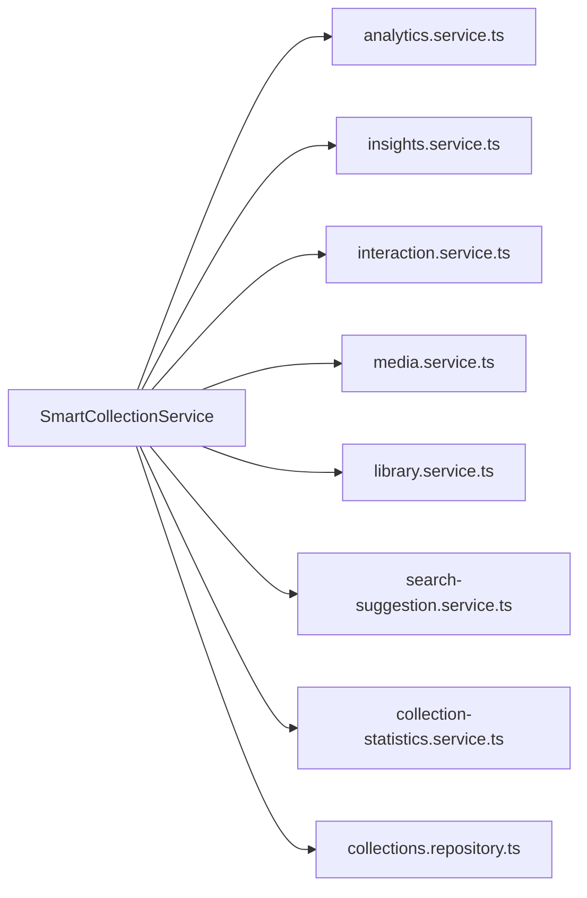

# Smart Collections Engine

<cite>
**Referenced Files in This Document**
- [collections.service.ts](file://apps/backend/src/collections/collections.service.ts)
- [smart-collection.service.ts](file://apps/backend/src/collections/smart-collection.service.ts)
- [collection-event.service.ts](file://apps/backend/src/collections/collection-event.service.ts)
- [collection-statistics.service.ts](file://apps/backend/src/collections/collection-statistics.service.ts)
- [collections.controller.ts](file://apps/backend/src/collections/collections.controller.ts)
- [collections.module.ts](file://apps/backend/src/collections/collections.module.ts)
- [collections.repository.ts](file://apps/backend/src/collections/collections.repository.ts)
- [analytics.service.ts](file://apps/backend/src/analytics/analytics.service.ts)
- [insights.service.ts](file://apps/backend/src/analytics/insights.service.ts)
- [streak.service.ts](file://apps/backend/src/analytics/streak.service.ts)
- [interaction.service.ts](file://apps/backend/src/interaction/interaction.service.ts)
- [media.service.ts](file://apps/backend/src/media/media.service.ts)
- [library.service.ts](file://apps/backend/src/library/library.service.ts)
- [search-suggestion.service.ts](file://apps/backend/src/search/search-suggestion.service.ts)
- [configuration.ts](file://apps/backend/src/config/configuration.ts)
- [env.validation.ts](file://apps/backend/src/config/env.validation.ts)
- [performance.service.ts](file://apps/backend/src/observability/performance.service.ts)
- [metrics.service.ts](file://apps/backend/src/observability/metrics.service.ts)
- [SmartCollectionSuggestions.tsx](file://src/components/collections/SmartCollectionSuggestions.tsx)
</cite>

## Table of Contents
1. [Introduction](#introduction)
2. [Project Structure](#project-structure)
3. [Core Components](#core-components)
4. [Architecture Overview](#architecture-overview)
5. [Detailed Component Analysis](#detailed-component-analysis)
6. [Dependency Analysis](#dependency-analysis)
7. [Performance Considerations](#performance-considerations)
8. [Troubleshooting Guide](#troubleshooting-guide)
9. [Conclusion](#conclusion)
10. [Appendices](#appendices)

## Introduction
This document explains the Smart Collections Engine, an AI-powered system that generates dynamic collections based on user consumption patterns, emotional states inferred from journaling and interactions, and relationships among media items. It covers the event-driven architecture that triggers updates, statistics calculation algorithms, recommendation logic, configuration options, performance considerations, and customization guidelines for different use cases.

## Project Structure
The smart collections engine is implemented as a NestJS module under apps/backend/src/collections with supporting analytics, interaction, media, library, search, observability, and configuration modules. The frontend exposes a Smart Collection Suggestions component to display recommendations.

**Diagram sources**
- [collections.controller.ts](file://apps/backend/src/collections/collections.controller.ts)
- [collections.service.ts](file://apps/backend/src/collections/collections.service.ts)
- [smart-collection.service.ts](file://apps/backend/src/collections/smart-collection.service.ts)
- [collection-event.service.ts](file://apps/backend/src/collections/collection-event.service.ts)
- [collection-statistics.service.ts](file://apps/backend/src/collections/collection-statistics.service.ts)
- [collections.repository.ts](file://apps/backend/src/collections/collections.repository.ts)
- [analytics.service.ts](file://apps/backend/src/analytics/analytics.service.ts)
- [insights.service.ts](file://apps/backend/src/analytics/insights.service.ts)
- [streak.service.ts](file://apps/backend/src/analytics/streak.service.ts)
- [interaction.service.ts](file://apps/backend/src/interaction/interaction.service.ts)
- [media.service.ts](file://apps/backend/src/media/media.service.ts)
- [library.service.ts](file://apps/backend/src/library/library.service.ts)
- [search-suggestion.service.ts](file://apps/backend/src/search/search-suggestion.service.ts)
- [configuration.ts](file://apps/backend/src/config/configuration.ts)
- [env.validation.ts](file://apps/backend/src/config/env.validation.ts)
- [performance.service.ts](file://apps/backend/src/observability/performance.service.ts)
- [metrics.service.ts](file://apps/backend/src/observability/metrics.service.ts)

**Section sources**
- [collections.module.ts](file://apps/backend/src/collections/collections.module.ts)
- [collections.controller.ts](file://apps/backend/src/collections/collections.controller.ts)
- [collections.service.ts](file://apps/backend/src/collections/collections.service.ts)

## Core Components
- SmartCollectionService: Orchestrates AI-powered suggestion generation by combining consumption signals, emotional context, and media relationships. Implements scoring, ranking, and filtering rules.
- CollectionEventService: Subscribes to domain events (e.g., media progress, journal entries, interactions) and triggers recomputation or incremental updates to smart collections.
- CollectionStatisticsService: Computes aggregate metrics such as recency, frequency, diversity, and engagement scores used by the recommendation engine.
- CollectionsService: Exposes API endpoints, validates inputs, enforces permissions, and coordinates background jobs for heavy computations.
- CollectionsRepository: Data access layer for collection metadata, membership, and computed features.

Key responsibilities:
- Ingest events and update feature stores.
- Compute per-user and per-item features.
- Apply rule-based and learned weights to rank candidates.
- Persist results and invalidate caches when needed.

**Section sources**
- [smart-collection.service.ts](file://apps/backend/src/collections/smart-collection.service.ts)
- [collection-event.service.ts](file://apps/backend/src/collections/collection-event.service.ts)
- [collection-statistics.service.ts](file://apps/backend/src/collections/collection-statistics.service.ts)
- [collections.service.ts](file://apps/backend/src/collections/collections.service.ts)
- [collections.repository.ts](file://apps/backend/src/collections/collections.repository.ts)

## Architecture Overview
The engine follows an event-driven architecture:
- Events are emitted by domain services (progress, interactions, journaling).
- CollectionEventService listens and dispatches tasks to update smart collections.
- SmartCollectionService computes suggestions using analytics, insights, and relationship data.
- Results are persisted via repository and surfaced through controllers and UI components.

**Diagram sources**
- [collections.controller.ts](file://apps/backend/src/collections/collections.controller.ts)
- [collections.service.ts](file://apps/backend/src/collections/collections.service.ts)
- [collection-event.service.ts](file://apps/backend/src/collections/collection-event.service.ts)
- [smart-collection.service.ts](file://apps/backend/src/collections/smart-collection.service.ts)
- [collection-statistics.service.ts](file://apps/backend/src/collections/collection-statistics.service.ts)
- [collections.repository.ts](file://apps/backend/src/collections/collections.repository.ts)

## Detailed Component Analysis

### SmartCollectionService
Responsibilities:
- Aggregates consumption signals (play history, completion rates, rewatch frequency).
- Incorporates emotional state proxies from journaling and interaction sentiment.
- Leverages media relationships (co-occurrence, genre, creator, narrative arcs).
- Applies configurable rules and weights to score and rank candidates.
- Supports incremental updates and full recomputation modes.

Recommendation Logic Highlights:
- Feature extraction: recency decay, session length, completion ratio, mood tags, genre affinity.
- Scoring: weighted sum of behavioral, emotional, and relational features.
- Ranking: global ordering with diversity and novelty boosts.
- Filtering: user-defined constraints (genres, time windows, exclusions).

**Diagram sources**
- [smart-collection.service.ts](file://apps/backend/src/collections/smart-collection.service.ts)
- [collection-statistics.service.ts](file://apps/backend/src/collections/collection-statistics.service.ts)
- [collections.repository.ts](file://apps/backend/src/collections/collections.repository.ts)

**Section sources**
- [smart-collection.service.ts](file://apps/backend/src/collections/smart-collection.service.ts)
- [collection-statistics.service.ts](file://apps/backend/src/collections/collection-statistics.service.ts)

### CollectionEventService
Responsibilities:
- Subscribes to domain events such as media progress updates, journal entries, and user interactions.
- Batches and deduplicates events to avoid redundant recomputations.
- Triggers asynchronous recomputation or incremental updates to feature stores and cached suggestions.

Event Flow:
- On new progress or interaction, enqueue a job to refresh relevant collections.
- Debounce bursts of events within a configured window.
- Ensure idempotency to prevent duplicate updates.

**Diagram sources**
- [collection-event.service.ts](file://apps/backend/src/collections/collection-event.service.ts)
- [smart-collection.service.ts](file://apps/backend/src/collections/smart-collection.service.ts)

**Section sources**
- [collection-event.service.ts](file://apps/backend/src/collections/collection-event.service.ts)

### CollectionStatisticsService
Responsibilities:
- Computes aggregate metrics over time windows (daily, weekly, monthly).
- Calculates engagement intensity, recency-weighted activity, and mood/emotion distributions.
- Provides trend indicators and streaks to influence recommendation weights.

Algorithms:
- Recency decay functions to prioritize recent behavior.
- Frequency normalization across users and sessions.
- Mood aggregation from journal tags and interaction sentiment.

**Diagram sources**
- [collection-statistics.service.ts](file://apps/backend/src/collections/collection-statistics.service.ts)
- [collections.repository.ts](file://apps/backend/src/collections/collections.repository.ts)

**Section sources**
- [collection-statistics.service.ts](file://apps/backend/src/collections/collection-statistics.service.ts)
- [collections.repository.ts](file://apps/backend/src/collections/collections.repository.ts)

### CollectionsService and Controller
Responsibilities:
- Expose REST endpoints for fetching and managing smart collections.
- Validate requests, enforce user scoping, and handle pagination.
- Coordinate background recomputation and cache invalidation.

API Workflow:
- GET /collections/smart returns ranked suggestions for the authenticated user.
- POST /collections/smart/recompute triggers immediate recomputation for a user or set of filters.

**Diagram sources**
- [collections.controller.ts](file://apps/backend/src/collections/collections.controller.ts)
- [collections.service.ts](file://apps/backend/src/collections/collections.service.ts)
- [smart-collection.service.ts](file://apps/backend/src/collections/smart-collection.service.ts)
- [collections.repository.ts](file://apps/backend/src/collections/collections.repository.ts)

**Section sources**
- [collections.controller.ts](file://apps/backend/src/collections/collections.controller.ts)
- [collections.service.ts](file://apps/backend/src/collections/collections.service.ts)

### Frontend Integration
The SmartCollectionSuggestions component consumes the backend API to render personalized suggestions. It handles loading states, error boundaries, and user feedback loops (e.g., thumbs up/down) that feed back into the event pipeline.

**Section sources**
- [SmartCollectionSuggestions.tsx](file://src/components/collections/SmartCollectionSuggestions.tsx)

## Dependency Analysis
SmartCollectionService depends on multiple domain services to build rich features:
- Analytics and Insights provide consumption patterns and derived insights.
- Interaction service supplies engagement signals and sentiment proxies.
- Media and Library services offer metadata and relationship graphs.
- Search Suggestion service contributes contextual queries and trending topics.

**Diagram sources**
- [smart-collection.service.ts](file://apps/backend/src/collections/smart-collection.service.ts)
- [analytics.service.ts](file://apps/backend/src/analytics/analytics.service.ts)
- [insights.service.ts](file://apps/backend/src/analytics/insights.service.ts)
- [interaction.service.ts](file://apps/backend/src/interaction/interaction.service.ts)
- [media.service.ts](file://apps/backend/src/media/media.service.ts)
- [library.service.ts](file://apps/backend/src/library/library.service.ts)
- [search-suggestion.service.ts](file://apps/backend/src/search/search-suggestion.service.ts)
- [collection-statistics.service.ts](file://apps/backend/src/collections/collection-statistics.service.ts)
- [collections.repository.ts](file://apps/backend/src/collections/collections.repository.ts)

**Section sources**
- [smart-collection.service.ts](file://apps/backend/src/collections/smart-collection.service.ts)

## Performance Considerations
- Caching: Cache computed features and suggestions with TTLs aligned to event batching windows.
- Incremental Updates: Prefer delta recomputation triggered by specific events rather than full scans.
- Batching and Debouncing: Aggregate high-frequency events to reduce recomputation load.
- Indexing: Ensure database indexes on user-scoped foreign keys and time windows for fast queries.
- Backpressure: Use queues to throttle recomputation jobs and avoid spikes.
- Observability: Track latency and throughput metrics; log slow queries and failed recomputations.

Configuration Options:
- Event batch window size and debounce intervals.
- Recomputation strategy (full vs incremental).
- Feature freshness thresholds and cache TTLs.
- Weight tuning parameters for behavioral, emotional, and relational signals.

**Section sources**
- [performance.service.ts](file://apps/backend/src/observability/performance.service.ts)
- [metrics.service.ts](file://apps/backend/src/observability/metrics.service.ts)
- [configuration.ts](file://apps/backend/src/config/configuration.ts)
- [env.validation.ts](file://apps/backend/src/config/env.validation.ts)

## Troubleshooting Guide
Common issues and resolutions:
- Stale Suggestions: Verify event ingestion and queue processing; check cache TTLs and invalidation hooks.
- Slow Queries: Analyze query plans, add missing indexes, and partition large datasets by user and time.
- Over-recomputation: Increase debounce window and deduplicate event payloads.
- Incorrect Weights: Tune scoring parameters and validate against A/B test outcomes.
- Missing Emotional Signals: Ensure journaling and interaction events are captured and mapped to mood tags.

Operational checks:
- Monitor queue depth and job success rates.
- Inspect logs for failed recomputation jobs and retry policies.
- Validate environment configuration for feature flags and thresholds.

**Section sources**
- [collection-event.service.ts](file://apps/backend/src/collections/collection-event.service.ts)
- [smart-collection.service.ts](file://apps/backend/src/collections/smart-collection.service.ts)
- [configuration.ts](file://apps/backend/src/config/configuration.ts)
- [env.validation.ts](file://apps/backend/src/config/env.validation.ts)

## Conclusion
The Smart Collections Engine combines behavioral analytics, emotional context, and media relationships to deliver personalized, dynamic collections. Its event-driven design ensures timely updates while maintaining performance through caching, batching, and incremental recomputation. With configurable rules and robust observability, it supports diverse use cases from casual browsing to curated discovery experiences.

## Appendices

### Configuration Options Summary
- Event Processing:
  - Batch window size
  - Debounce interval
  - Retry policy and max attempts
- Recomputation:
  - Strategy selection (full/incremental)
  - Trigger conditions (per-user, per-filter)
- Scoring and Ranking:
  - Behavioral weight
  - Emotional weight
  - Relational weight
  - Diversity and novelty boost factors
- Caching:
  - Feature cache TTL
  - Suggestion cache TTL
  - Invalidation triggers

**Section sources**
- [configuration.ts](file://apps/backend/src/config/configuration.ts)
- [env.validation.ts](file://apps/backend/src/config/env.validation.ts)

### Customization Guidelines
- For casual users: Emphasize recency and completion rate; lower diversity boost.
- For explorers: Increase novelty and cross-genre relational weights; higher diversity boost.
- For mood-driven experiences: Weight emotional signals heavily; filter by mood tags.
- For binge scenarios: Prioritize series continuity and co-occurrence relationships.

[No sources needed since this section provides general guidance]