# Core Infrastructure & Utilities

<cite>
**Referenced Files in This Document**
- [core.module.ts](file://apps/backend/src/core/core.module.ts)
- [index.ts](file://apps/backend/src/core/index.ts)
- [cache.service.ts](file://apps/backend/src/hardening/cache.service.ts)
- [cache-invalidation.service.ts](file://apps/backend/src/hardening/cache-invalidation.service.ts)
- [database-optimization.service.ts](file://apps/backend/src/hardening/database-optimization.service.ts)
- [performance-audit.service.ts](file://apps/backend/src/hardening/performance-audit.service.ts)
- [rate-limit-audit.service.ts](file://apps/backend/src/hardening/rate-limit-audit.service.ts)
- [query-analysis.service.ts](file://apps/backend/src/hardening/query-analysis.service.ts)
- [load-test-support.service.ts](file://apps/backend/src/hardening/load-test-support.service.ts)
- [hardening.module.ts](file://apps/backend/src/hardening/hardening.module.ts)
- [transaction-manager.service.ts](file://apps/backend/src/core/transaction/transaction-manager.service.ts)
- [transaction.decorator.ts](file://apps/backend/src/core/transaction/transaction.decorator.ts)
- [uuid-generator.service.ts](file://apps/backend/src/core/uuid/uuid-generator.service.ts)
- [hash-service.ts](file://apps/backend/src/core/hash/hash-service.ts)
- [backup.service.ts](file://apps/backend/src/deployment/backup.service.ts)
- [restore.service.ts](file://apps/backend/src/deployment/restore.service.ts)
- [production-configuration.service.ts](file://apps/backend/src/deployment/production-configuration.service.ts)
- [environment-validation.service.ts](file://apps/backend/src/deployment/environment-validation.service.ts)
- [release-validation.service.ts](file://apps/backend/src/deployment/release-validation.service.ts)
- [deployment-health.service.ts](file://apps/backend/src/deployment/deployment-health.service.ts)
- [deployment.module.ts](file://apps/backend/src/deployment/deployment.module.ts)
- [redis.service.ts](file://apps/backend/src/redis/redis.service.ts)
- [prisma.service.ts](file://apps/backend/src/prisma/prisma.service.ts)
- [configuration.ts](file://apps/backend/src/config/configuration.ts)
- [env.validation.ts](file://apps/backend/src/config/env.validation.ts)
</cite>

## Table of Contents
1. [Introduction](#introduction)
2. [Project Structure](#project-structure)
3. [Core Components](#core-components)
4. [Architecture Overview](#architecture-overview)
5. [Detailed Component Analysis](#detailed-component-analysis)
6. [Dependency Analysis](#dependency-analysis)
7. [Performance Considerations](#performance-considerations)
8. [Troubleshooting Guide](#troubleshooting-guide)
9. [Conclusion](#conclusion)

## Introduction
This document explains the core infrastructure and utility services that underpin the application. It focuses on base abstractions, shared utilities, and cross-cutting concerns such as caching, transactions, identifiers, hashing, hardening (database optimization, rate limiting, performance auditing), deployment utilities (backup/restore, configuration management), and production readiness. The goal is to provide a clear mental model for how these components interact and how they can be extended or configured in different environments.

## Project Structure
The backend organizes infrastructure into dedicated modules:
- Core abstractions: cache, transaction, UUID, hash, repository, domain, events, storage, clock, context, idempotency, audit
- Hardening: cache invalidation, database optimization, performance auditing, query analysis, rate limit auditing, load test support
- Deployment: backup/restore, environment and release validation, production configuration, health checks
- Shared runtime integrations: Redis client, Prisma service, configuration and environment validation

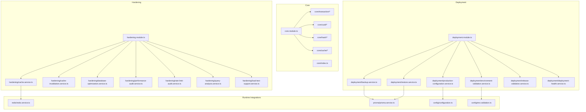

**Diagram sources**
- [core.module.ts](file://apps/backend/src/core/core.module.ts)
- [index.ts](file://apps/backend/src/core/index.ts)
- [hardening.module.ts](file://apps/backend/src/hardening/hardening.module.ts)
- [deployment.module.ts](file://apps/backend/src/deployment/deployment.module.ts)
- [redis.service.ts](file://apps/backend/src/redis/redis.service.ts)
- [prisma.service.ts](file://apps/backend/src/prisma/prisma.service.ts)
- [configuration.ts](file://apps/backend/src/config/configuration.ts)
- [env.validation.ts](file://apps/backend/src/config/env.validation.ts)

**Section sources**
- [core.module.ts](file://apps/backend/src/core/core.module.ts)
- [index.ts](file://apps/backend/src/core/index.ts)
- [hardening.module.ts](file://apps/backend/src/hardening/hardening.module.ts)
- [deployment.module.ts](file://apps/backend/src/deployment/deployment.module.ts)

## Core Components
This section documents the foundational abstractions and utilities used across the application.

### Cache Abstraction Layer
- Purpose: Provide a consistent interface for caching operations across the app, decoupling business logic from specific cache backends.
- Key responsibilities:
  - Get/set/delete with optional TTL
  - Namespace isolation per feature/domain
  - Error handling and fallback behavior
- Integration points:
  - Redis-backed implementation via the Redis service
  - Used by hardening services for performance-sensitive paths

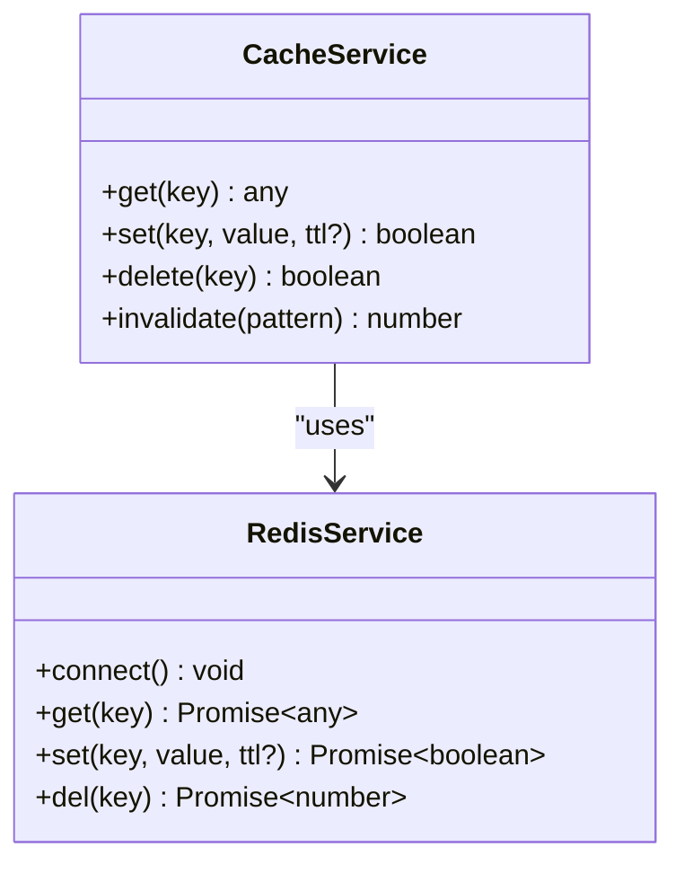

**Diagram sources**
- [cache.service.ts](file://apps/backend/src/hardening/cache.service.ts)
- [redis.service.ts](file://apps/backend/src/redis/redis.service.ts)

**Section sources**
- [cache.service.ts](file://apps/backend/src/hardening/cache.service.ts)
- [redis.service.ts](file://apps/backend/src/redis/redis.service.ts)

### Transaction Management
- Purpose: Ensure data consistency across multiple database operations using declarative transaction boundaries.
- Key responsibilities:
  - Decorator-based transaction scoping
  - Automatic commit/rollback based on outcome
  - Nested transaction awareness where supported
- Integration points:
  - Prisma client for underlying transaction execution

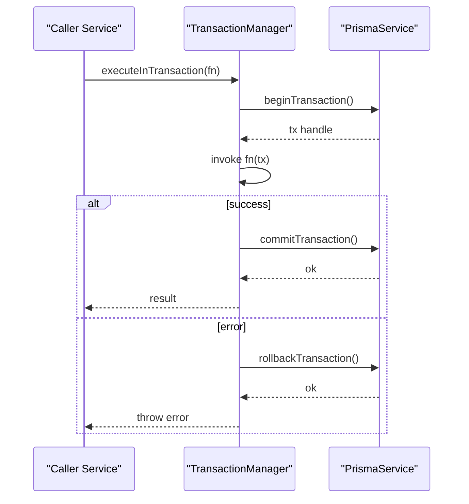

**Diagram sources**
- [transaction-manager.service.ts](file://apps/backend/src/core/transaction/transaction-manager.service.ts)
- [transaction.decorator.ts](file://apps/backend/src/core/transaction/transaction.decorator.ts)
- [prisma.service.ts](file://apps/backend/src/prisma/prisma.service.ts)

**Section sources**
- [transaction-manager.service.ts](file://apps/backend/src/core/transaction/transaction-manager.service.ts)
- [transaction.decorator.ts](file://apps/backend/src/core/transaction/transaction.decorator.ts)
- [prisma.service.ts](file://apps/backend/src/prisma/prisma.service.ts)

### UUID Generation
- Purpose: Provide globally unique identifiers with deterministic options when needed.
- Key responsibilities:
  - Generate v4 UUIDs by default
  - Optional time-based or custom strategies
  - Consistent formatting and validation helpers

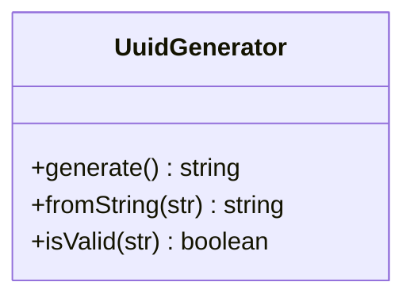

**Diagram sources**
- [uuid-generator.service.ts](file://apps/backend/src/core/uuid/uuid-generator.service.ts)

**Section sources**
- [uuid-generator.service.ts](file://apps/backend/src/core/uuid/uuid-generator.service.ts)

### Hashing Services
- Purpose: Securely hash sensitive data such as passwords and secrets.
- Key responsibilities:
  - Strong hashing algorithm selection
  - Salt generation and management
  - Comparison utilities

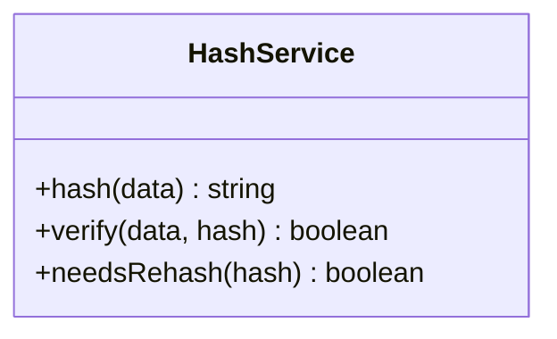

**Diagram sources**
- [hash-service.ts](file://apps/backend/src/core/hash/hash-service.ts)

**Section sources**
- [hash-service.ts](file://apps/backend/src/core/hash/hash-service.ts)

## Architecture Overview
The infrastructure layers are composed as follows:
- Core provides abstractions and utilities (cache, transactions, UUID, hash)
- Hardening enhances reliability and performance (cache invalidation, DB optimization, performance audits, query analysis, rate limit audits, load testing support)
- Deployment ensures operational readiness (backup/restore, environment/release validation, production configuration, health checks)
- Runtime integrations connect to Redis and Prisma, and validate configuration at startup

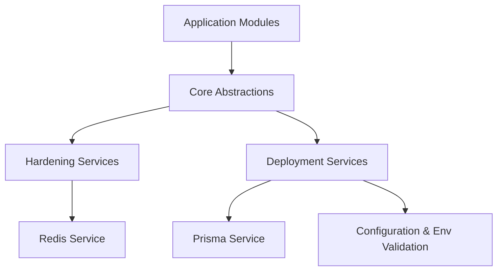

**Diagram sources**
- [core.module.ts](file://apps/backend/src/core/core.module.ts)
- [hardening.module.ts](file://apps/backend/src/hardening/hardening.module.ts)
- [deployment.module.ts](file://apps/backend/src/deployment/deployment.module.ts)
- [redis.service.ts](file://apps/backend/src/redis/redis.service.ts)
- [prisma.service.ts](file://apps/backend/src/prisma/prisma.service.ts)
- [configuration.ts](file://apps/backend/src/config/configuration.ts)
- [env.validation.ts](file://apps/backend/src/config/env.validation.ts)

## Detailed Component Analysis

### Cache Abstraction and Invalidation
- Cache service exposes get/set/delete and bulk invalidation patterns.
- Cache invalidation service coordinates cache updates around domain mutations to prevent stale reads.
- Redis service encapsulates connection lifecycle and low-level commands.

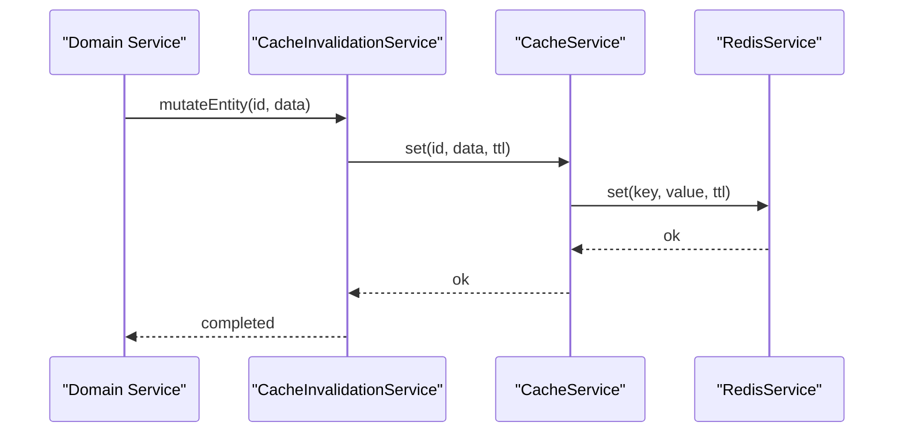

**Diagram sources**
- [cache-invalidation.service.ts](file://apps/backend/src/hardening/cache-invalidation.service.ts)
- [cache.service.ts](file://apps/backend/src/hardening/cache.service.ts)
- [redis.service.ts](file://apps/backend/src/redis/redis.service.ts)

**Section sources**
- [cache-invalidation.service.ts](file://apps/backend/src/hardening/cache-invalidation.service.ts)
- [cache.service.ts](file://apps/backend/src/hardening/cache.service.ts)
- [redis.service.ts](file://apps/backend/src/redis/redis.service.ts)

### Database Optimization and Query Analysis
- Database optimization service applies schema-level improvements, index tuning, and maintenance routines.
- Query analysis service inspects slow queries and suggests optimizations.

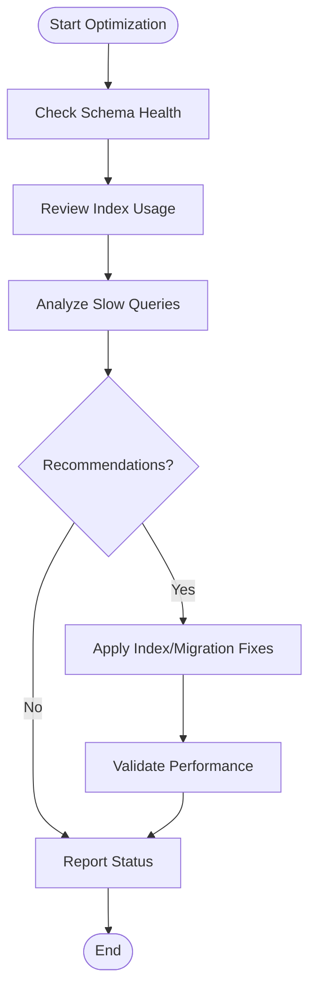

**Diagram sources**
- [database-optimization.service.ts](file://apps/backend/src/hardening/database-optimization.service.ts)
- [query-analysis.service.ts](file://apps/backend/src/hardening/query-analysis.service.ts)

**Section sources**
- [database-optimization.service.ts](file://apps/backend/src/hardening/database-optimization.service.ts)
- [query-analysis.service.ts](file://apps/backend/src/hardening/query-analysis.service.ts)

### Rate Limit Auditing
- Tracks request rates per client/IP and surfaces metrics for throttling decisions.
- Integrates with cache to store counters efficiently.

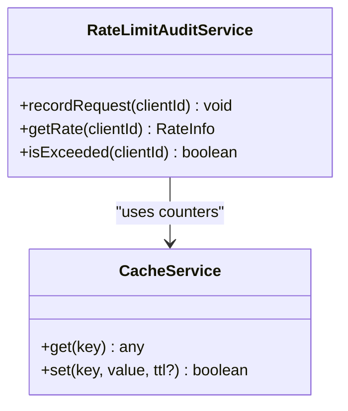

**Diagram sources**
- [rate-limit-audit.service.ts](file://apps/backend/src/hardening/rate-limit-audit.service.ts)
- [cache.service.ts](file://apps/backend/src/hardening/cache.service.ts)

**Section sources**
- [rate-limit-audit.service.ts](file://apps/backend/src/hardening/rate-limit-audit.service.ts)
- [cache.service.ts](file://apps/backend/src/hardening/cache.service.ts)

### Performance Auditing
- Captures latency, throughput, and resource usage metrics.
- Provides hooks for instrumentation and reporting.

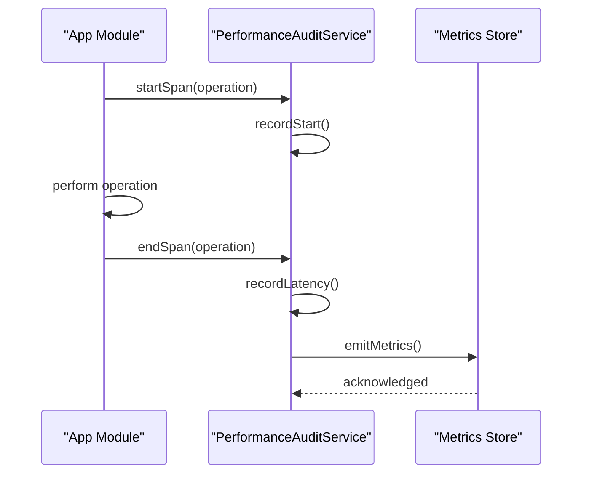

**Diagram sources**
- [performance-audit.service.ts](file://apps/backend/src/hardening/performance-audit.service.ts)

**Section sources**
- [performance-audit.service.ts](file://apps/backend/src/hardening/performance-audit.service.ts)

### Load Test Support
- Provides utilities to simulate traffic and measure system behavior under load.
- Integrates with performance auditing and cache to validate scaling characteristics.

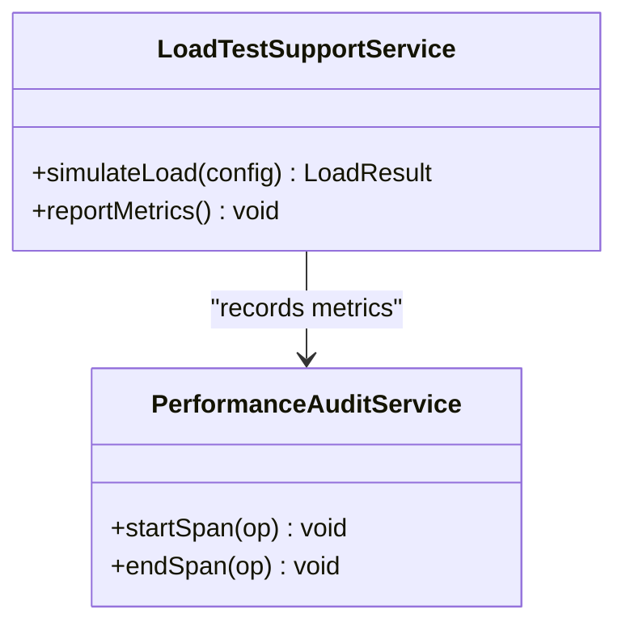

**Diagram sources**
- [load-test-support.service.ts](file://apps/backend/src/hardening/load-test-support.service.ts)
- [performance-audit.service.ts](file://apps/backend/src/hardening/performance-audit.service.ts)

**Section sources**
- [load-test-support.service.ts](file://apps/backend/src/hardening/load-test-support.service.ts)
- [performance-audit.service.ts](file://apps/backend/src/hardening/performance-audit.service.ts)

### Backup and Restore Services
- Backup service creates consistent snapshots of the database and associated artifacts.
- Restore service validates backups and restores state safely, with rollback safeguards.

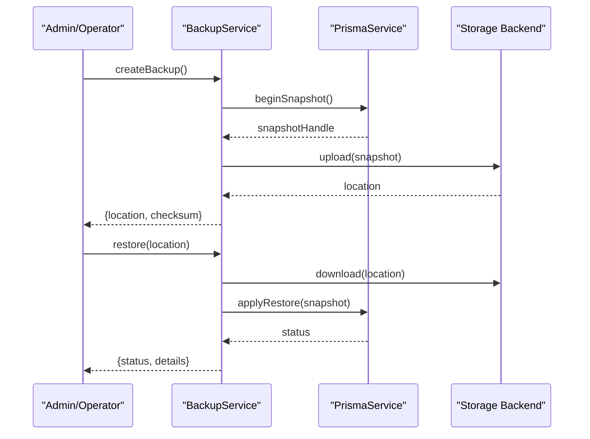

**Diagram sources**
- [backup.service.ts](file://apps/backend/src/deployment/backup.service.ts)
- [restore.service.ts](file://apps/backend/src/deployment/restore.service.ts)
- [prisma.service.ts](file://apps/backend/src/prisma/prisma.service.ts)

**Section sources**
- [backup.service.ts](file://apps/backend/src/deployment/backup.service.ts)
- [restore.service.ts](file://apps/backend/src/deployment/restore.service.ts)
- [prisma.service.ts](file://apps/backend/src/prisma/prisma.service.ts)

### Production Configuration Management
- Centralized configuration loading and validation for production environments.
- Environment validation ensures required settings are present and correct.
- Release validation checks compatibility and prerequisites before rollout.
- Deployment health service aggregates readiness and liveness signals.

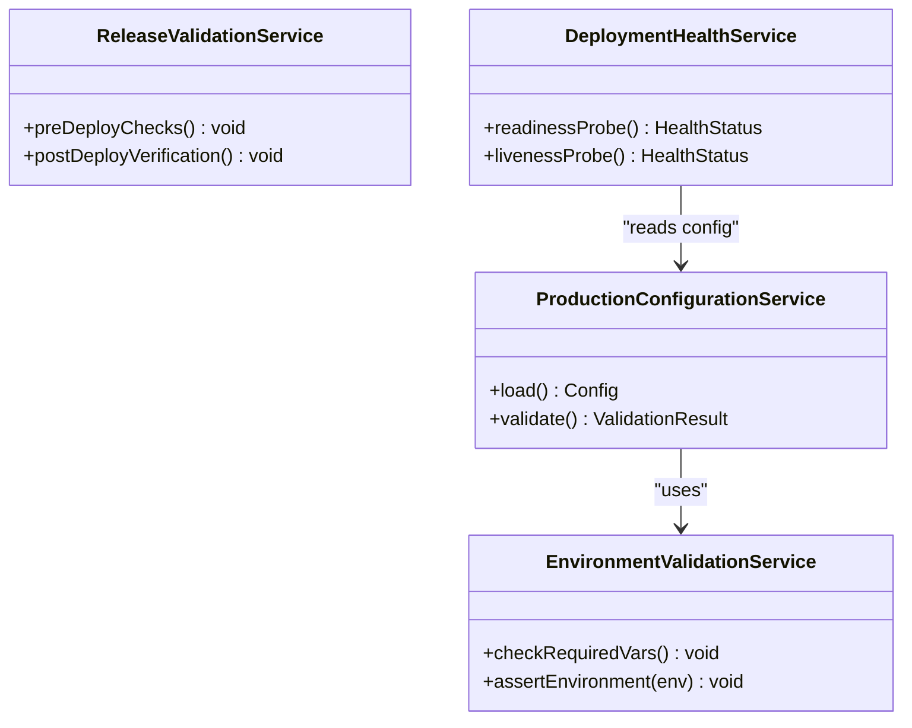

**Diagram sources**
- [production-configuration.service.ts](file://apps/backend/src/deployment/production-configuration.service.ts)
- [environment-validation.service.ts](file://apps/backend/src/deployment/environment-validation.service.ts)
- [release-validation.service.ts](file://apps/backend/src/deployment/release-validation.service.ts)
- [deployment-health.service.ts](file://apps/backend/src/deployment/deployment-health.service.ts)
- [configuration.ts](file://apps/backend/src/config/configuration.ts)
- [env.validation.ts](file://apps/backend/src/config/env.validation.ts)

**Section sources**
- [production-configuration.service.ts](file://apps/backend/src/deployment/production-configuration.service.ts)
- [environment-validation.service.ts](file://apps/backend/src/deployment/environment-validation.service.ts)
- [release-validation.service.ts](file://apps/backend/src/deployment/release-validation.service.ts)
- [deployment-health.service.ts](file://apps/backend/src/deployment/deployment-health.service.ts)
- [configuration.ts](file://apps/backend/src/config/configuration.ts)
- [env.validation.ts](file://apps/backend/src/config/env.validation.ts)

## Dependency Analysis
Key dependency relationships:
- Hardening services depend on cache and Redis for performance-critical operations.
- Deployment services rely on Prisma for data operations and configuration modules for environment setup.
- Core abstractions are consumed by domain services to ensure consistent behavior.

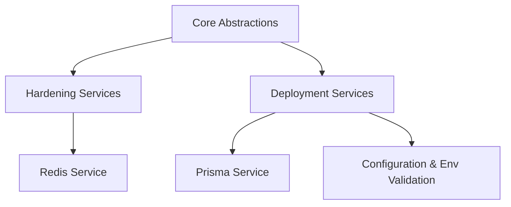

**Diagram sources**
- [core.module.ts](file://apps/backend/src/core/core.module.ts)
- [hardening.module.ts](file://apps/backend/src/hardening/hardening.module.ts)
- [deployment.module.ts](file://apps/backend/src/deployment/deployment.module.ts)
- [redis.service.ts](file://apps/backend/src/redis/redis.service.ts)
- [prisma.service.ts](file://apps/backend/src/prisma/prisma.service.ts)
- [configuration.ts](file://apps/backend/src/config/configuration.ts)
- [env.validation.ts](file://apps/backend/src/config/env.validation.ts)

**Section sources**
- [core.module.ts](file://apps/backend/src/core/core.module.ts)
- [hardening.module.ts](file://apps/backend/src/hardening/hardening.module.ts)
- [deployment.module.ts](file://apps/backend/src/deployment/deployment.module.ts)

## Performance Considerations
- Prefer cache-first reads with short TTLs for frequently accessed data; use cache invalidation on writes to maintain consistency.
- Use transaction decorators to group related operations and reduce round-trips.
- Monitor slow queries and apply targeted indexes; avoid over-indexing write-heavy tables.
- Enable performance auditing in staging and production to track latency spikes.
- Conduct periodic load tests to validate scaling limits and identify bottlenecks.

[No sources needed since this section provides general guidance]

## Troubleshooting Guide
Common issues and resolutions:
- Cache misses or stale data:
  - Verify cache invalidation flows after mutations.
  - Check TTL settings and Redis connectivity.
- Transaction failures:
  - Inspect nested transaction scopes and rollback conditions.
  - Ensure Prisma transaction handles are correctly propagated.
- Backup/restore errors:
  - Validate backup integrity and permissions.
  - Confirm database version compatibility during restore.
- Configuration problems:
  - Run environment validation to surface missing or invalid variables.
  - Review production configuration loading order.

**Section sources**
- [cache-invalidation.service.ts](file://apps/backend/src/hardening/cache-invalidation.service.ts)
- [cache.service.ts](file://apps/backend/src/hardening/cache.service.ts)
- [redis.service.ts](file://apps/backend/src/redis/redis.service.ts)
- [transaction-manager.service.ts](file://apps/backend/src/core/transaction/transaction-manager.service.ts)
- [prisma.service.ts](file://apps/backend/src/prisma/prisma.service.ts)
- [backup.service.ts](file://apps/backend/src/deployment/backup.service.ts)
- [restore.service.ts](file://apps/backend/src/deployment/restore.service.ts)
- [environment-validation.service.ts](file://apps/backend/src/deployment/environment-validation.service.ts)
- [production-configuration.service.ts](file://apps/backend/src/deployment/production-configuration.service.ts)

## Conclusion
The core infrastructure and utilities provide a robust foundation for reliable, high-performance operations. By abstracting caching, transactions, identifiers, and hashing, and by adding hardening and deployment capabilities, the application achieves consistency, resilience, and operational clarity. Following the recommended practices and troubleshooting steps will help maintain stability and performance across environments.

[No sources needed since this section summarizes without analyzing specific files]