# AI-Powered Prompt Generation

<cite>
**Referenced Files in This Document**
- [prompt.service.ts](file://apps/backend/src/journal/prompt.service.ts)
- [journal.controller.ts](file://apps/backend/src/journal/journal.controller.ts)
- [journal.service.ts](file://apps/backend/src/journal/journal.service.ts)
- [media.service.ts](file://apps/backend/src/media/media.service.ts)
- [analytics.service.ts](file://apps/backend/src/analytics/analytics.service.ts)
- [streak.service.ts](file://apps/backend/src/analytics/streak.service.ts)
- [cache.service.ts](file://apps/backend/src/hardening/cache.service.ts)
- [performance-audit.service.ts](file://apps/backend/src/hardening/performance-audit.service.ts)
- [rate-limit-audit.service.ts](file://apps/backend/src/hardening/rate-limit-audit.service.ts)
- [redis.service.ts](file://apps/backend/src/redis/redis.service.ts)
- [config.module.ts](file://apps/backend/src/config/config.module.ts)
- [configuration.ts](file://apps/backend/src/config/configuration.ts)
- [env.validation.ts](file://apps/backend/src/config/env.validation.ts)
- [JournalPrompt.tsx](file://src/components/journal/JournalPrompt.tsx)
- [QuickPromptDialog.tsx](file://src/components/media/QuickPromptDialog.tsx)
- [use-journal.ts](file://src/hooks/use-journal.ts)
</cite>

## Table of Contents
1. [Introduction](#introduction)
2. [Project Structure](#project-structure)
3. [Core Components](#core-components)
4. [Architecture Overview](#architecture-overview)
5. [Detailed Component Analysis](#detailed-component-analysis)
6. [Dependency Analysis](#dependency-analysis)
7. [Performance Considerations](#performance-considerations)
8. [Troubleshooting Guide](#troubleshooting-guide)
9. [Conclusion](#conclusion)
10. [Appendices](#appendices)

## Introduction
This document explains the AI-powered prompt generation system that creates contextual prompts based on user history, media consumption patterns, and emotional states. It covers prompt templates, personalization algorithms, integration with external AI services, caching strategies, fallback mechanisms, performance optimization, and example prompt types with use cases for enhancing user engagement.

## Project Structure
The prompt generation system spans backend modules (journaling, media analytics, hardening utilities, configuration, and Redis), and frontend components/hooks that surface prompts to users. Key areas:
- Journal module: orchestrates prompt generation and delivery
- Media module: provides consumption signals
- Analytics module: aggregates behavior and streaks
- Hardening module: caching, rate limiting, and performance auditing
- Configuration: environment-driven settings for AI providers and cache policies
- Frontend: UI components and hooks for prompt display and interaction

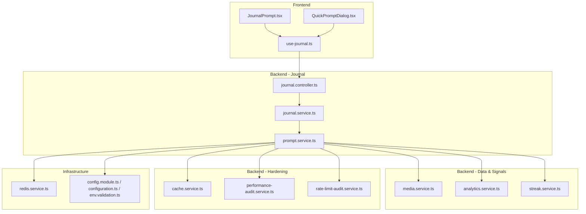

**Diagram sources**
- [journal.controller.ts](file://apps/backend/src/journal/journal.controller.ts)
- [journal.service.ts](file://apps/backend/src/journal/journal.service.ts)
- [prompt.service.ts](file://apps/backend/src/journal/prompt.service.ts)
- [media.service.ts](file://apps/backend/src/media/media.service.ts)
- [analytics.service.ts](file://apps/backend/src/analytics/analytics.service.ts)
- [streak.service.ts](file://apps/backend/src/analytics/streak.service.ts)
- [cache.service.ts](file://apps/backend/src/hardening/cache.service.ts)
- [performance-audit.service.ts](file://apps/backend/src/hardening/performance-audit.service.ts)
- [rate-limit-audit.service.ts](file://apps/backend/src/hardening/rate-limit-audit.service.ts)
- [redis.service.ts](file://apps/backend/src/redis/redis.service.ts)
- [config.module.ts](file://apps/backend/src/config/config.module.ts)
- [configuration.ts](file://apps/backend/src/config/configuration.ts)
- [env.validation.ts](file://apps/backend/src/config/env.validation.ts)
- [JournalPrompt.tsx](file://src/components/journal/JournalPrompt.tsx)
- [QuickPromptDialog.tsx](file://src/components/media/QuickPromptDialog.tsx)
- [use-journal.ts](file://src/hooks/use-journal.ts)

**Section sources**
- [prompt.service.ts](file://apps/backend/src/journal/prompt.service.ts)
- [journal.controller.ts](file://apps/backend/src/journal/journal.controller.ts)
- [journal.service.ts](file://apps/backend/src/journal/journal.service.ts)
- [media.service.ts](file://apps/backend/src/media/media.service.ts)
- [analytics.service.ts](file://apps/backend/src/analytics/analytics.service.ts)
- [streak.service.ts](file://apps/backend/src/analytics/streak.service.ts)
- [cache.service.ts](file://apps/backend/src/hardening/cache.service.ts)
- [performance-audit.service.ts](file://apps/backend/src/hardening/performance-audit.service.ts)
- [rate-limit-audit.service.ts](file://apps/backend/src/hardening/rate-limit-audit.service.ts)
- [redis.service.ts](file://apps/backend/src/redis/redis.service.ts)
- [config.module.ts](file://apps/backend/src/config/config.module.ts)
- [configuration.ts](file://apps/backend/src/config/configuration.ts)
- [env.validation.ts](file://apps/backend/src/config/env.validation.ts)
- [JournalPrompt.tsx](file://src/components/journal/JournalPrompt.tsx)
- [QuickPromptDialog.tsx](file://src/components/media/QuickPromptDialog.tsx)
- [use-journal.ts](file://src/hooks/use-journal.ts)

## Core Components
- Prompt Service: central logic for assembling context, selecting templates, invoking AI, caching, and returning a personalized prompt.
- Journal Controller/Service: API boundary and orchestration for journal-related operations, including prompt endpoints.
- Media Service: supplies recent consumption data, completion status, and metadata used to tailor prompts.
- Analytics Services: aggregate user behavior, streaks, and insights to inform emotional state and engagement signals.
- Cache Service: in-memory or Redis-backed caching for generated prompts and related contexts.
- Redis Service: distributed cache client for cross-instance consistency.
- Performance Audit and Rate Limit Audit: measure latency and guard against excessive AI calls.
- Configuration: environment variables for AI provider keys, model selection, and cache TTLs.
- Frontend Components/Hooks: render prompts and trigger generation from the UI.

**Section sources**
- [prompt.service.ts](file://apps/backend/src/journal/prompt.service.ts)
- [journal.controller.ts](file://apps/backend/src/journal/journal.controller.ts)
- [journal.service.ts](file://apps/backend/src/journal/journal.service.ts)
- [media.service.ts](file://apps/backend/src/media/media.service.ts)
- [analytics.service.ts](file://apps/backend/src/analytics/analytics.service.ts)
- [streak.service.ts](file://apps/backend/src/analytics/streak.service.ts)
- [cache.service.ts](file://apps/backend/src/hardening/cache.service.ts)
- [redis.service.ts](file://apps/backend/src/redis/redis.service.ts)
- [performance-audit.service.ts](file://apps/backend/src/hardening/performance-audit.service.ts)
- [rate-limit-audit.service.ts](file://apps/backend/src/hardening/rate-limit-audit.service.ts)
- [config.module.ts](file://apps/backend/src/config/config.module.ts)
- [configuration.ts](file://apps/backend/src/config/configuration.ts)
- [env.validation.ts](file://apps/backend/src/config/env.validation.ts)
- [JournalPrompt.tsx](file://src/components/journal/JournalPrompt.tsx)
- [QuickPromptDialog.tsx](file://src/components/media/QuickPromptDialog.tsx)
- [use-journal.ts](file://src/hooks/use-journal.ts)

## Architecture Overview
The system follows a layered architecture:
- Presentation layer (frontend components/hooks) requests prompts via API.
- Application layer (journal controller/service) validates input and delegates to prompt service.
- Domain layer (prompt service) composes context from media and analytics, selects template, invokes AI, applies caching, and returns result.
- Infrastructure layer (Redis, performance/rate-limit audits, configuration) supports reliability and performance.

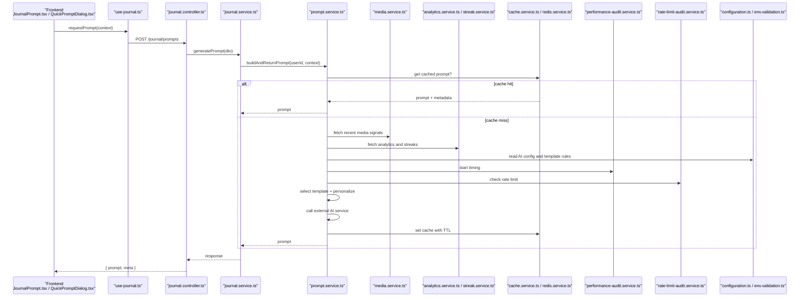

**Diagram sources**
- [journal.controller.ts](file://apps/backend/src/journal/journal.controller.ts)
- [journal.service.ts](file://apps/backend/src/journal/journal.service.ts)
- [prompt.service.ts](file://apps/backend/src/journal/prompt.service.ts)
- [media.service.ts](file://apps/backend/src/media/media.service.ts)
- [analytics.service.ts](file://apps/backend/src/analytics/analytics.service.ts)
- [streak.service.ts](file://apps/backend/src/analytics/streak.service.ts)
- [cache.service.ts](file://apps/backend/src/hardening/cache.service.ts)
- [redis.service.ts](file://apps/backend/src/redis/redis.service.ts)
- [performance-audit.service.ts](file://apps/backend/src/hardening/performance-audit.service.ts)
- [rate-limit-audit.service.ts](file://apps/backend/src/hardening/rate-limit-audit.service.ts)
- [configuration.ts](file://apps/backend/src/config/configuration.ts)
- [env.validation.ts](file://apps/backend/src/config/env.validation.ts)

## Detailed Component Analysis

### Prompt Service
Responsibilities:
- Context assembly: merges user ID, time window, and optional media focus into a structured context.
- Template selection: chooses among predefined prompt categories (reflection, continuation, mood-based, milestone).
- Personalization: injects user-specific signals (recent genres, streaks, completion rates, emotional indicators).
- AI integration: formats the prompt payload for external AI providers and parses responses.
- Caching: stores generated prompts keyed by stable context hash; respects TTL and invalidation.
- Fallbacks: degrades gracefully when AI is unavailable or rate-limited.
- Observability: measures latency and logs key metrics.

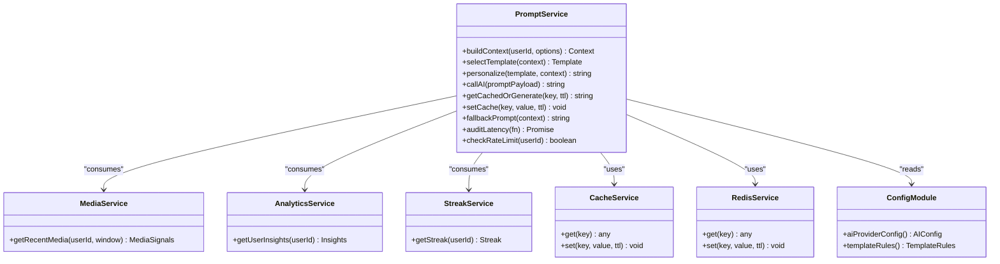

**Diagram sources**
- [prompt.service.ts](file://apps/backend/src/journal/prompt.service.ts)
- [media.service.ts](file://apps/backend/src/media/media.service.ts)
- [analytics.service.ts](file://apps/backend/src/analytics/analytics.service.ts)
- [streak.service.ts](file://apps/backend/src/analytics/streak.service.ts)
- [cache.service.ts](file://apps/backend/src/hardening/cache.service.ts)
- [redis.service.ts](file://apps/backend/src/redis/redis.service.ts)
- [config.module.ts](file://apps/backend/src/config/config.module.ts)

**Section sources**
- [prompt.service.ts](file://apps/backend/src/journal/prompt.service.ts)

### Journal Controller and Service
- Controller exposes endpoints for generating prompts, handling validation and authorization.
- Service coordinates business flow, passing DTOs to the prompt service and formatting responses.

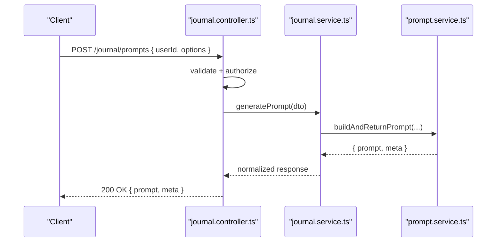

**Diagram sources**
- [journal.controller.ts](file://apps/backend/src/journal/journal.controller.ts)
- [journal.service.ts](file://apps/backend/src/journal/journal.service.ts)
- [prompt.service.ts](file://apps/backend/src/journal/prompt.service.ts)

**Section sources**
- [journal.controller.ts](file://apps/backend/src/journal/journal.controller.ts)
- [journal.service.ts](file://apps/backend/src/journal/journal.service.ts)

### Media and Analytics Integration
- Media signals include recently consumed items, completion status, genre preferences, and recency weights.
- Analytics provide aggregated insights such as mood trends, engagement levels, and streaks.

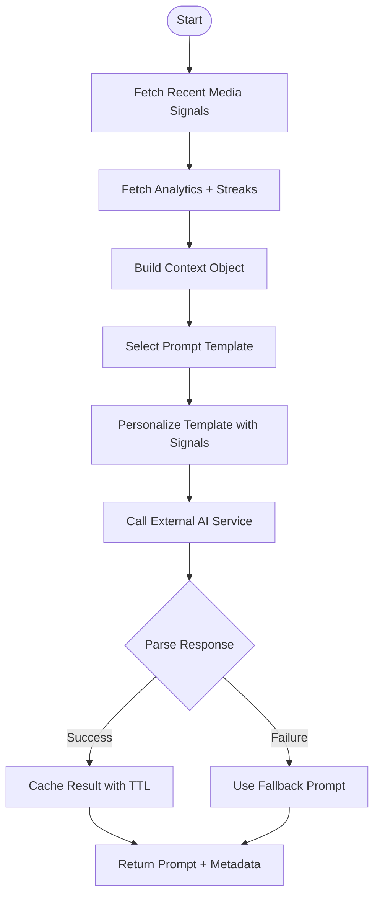

**Diagram sources**
- [media.service.ts](file://apps/backend/src/media/media.service.ts)
- [analytics.service.ts](file://apps/backend/src/analytics/analytics.service.ts)
- [streak.service.ts](file://apps/backend/src/analytics/streak.service.ts)
- [prompt.service.ts](file://apps/backend/src/journal/prompt.service.ts)

**Section sources**
- [media.service.ts](file://apps/backend/src/media/media.service.ts)
- [analytics.service.ts](file://apps/backend/src/analytics/analytics.service.ts)
- [streak.service.ts](file://apps/backend/src/analytics/streak.service.ts)

### Caching Strategy
- Keys are derived from stable context hashes (user ID, time window, selected template, and signal snapshot).
- TTLs are configurable per environment; short-lived for dynamic content, longer for stable templates.
- Invalidation occurs on significant user events (e.g., new streak milestones, major media completions).
- Redis-backed cache ensures consistency across instances.

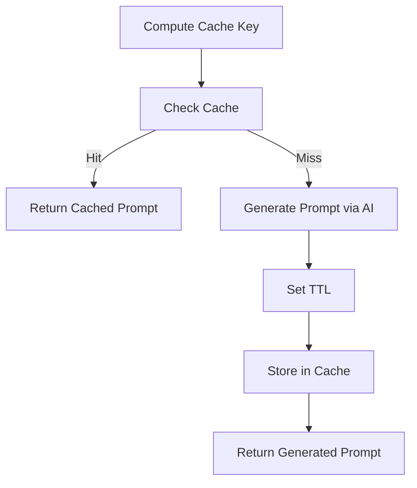

**Diagram sources**
- [cache.service.ts](file://apps/backend/src/hardening/cache.service.ts)
- [redis.service.ts](file://apps/backend/src/redis/redis.service.ts)
- [prompt.service.ts](file://apps/backend/src/journal/prompt.service.ts)

**Section sources**
- [cache.service.ts](file://apps/backend/src/hardening/cache.service.ts)
- [redis.service.ts](file://apps/backend/src/redis/redis.service.ts)

### Fallback Mechanisms
- If AI provider is down or rate-limited, return curated fallback prompts tailored to the current context.
- Fallback prompts maintain engagement while preserving personalization signals.
- Rate-limit audit enforces throttling to protect downstream services.

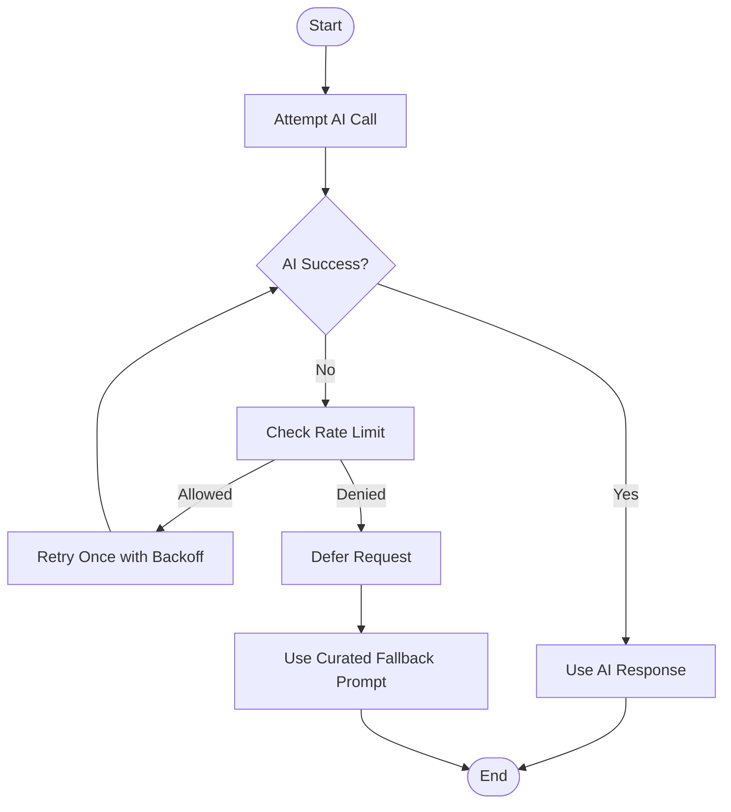

**Diagram sources**
- [prompt.service.ts](file://apps/backend/src/journal/prompt.service.ts)
- [rate-limit-audit.service.ts](file://apps/backend/src/hardening/rate-limit-audit.service.ts)

**Section sources**
- [prompt.service.ts](file://apps/backend/src/journal/prompt.service.ts)
- [rate-limit-audit.service.ts](file://apps/backend/src/hardening/rate-limit-audit.service.ts)

### Performance Optimization
- Latency measurement around AI calls and cache operations.
- Concurrency control for parallel fetching of media and analytics signals.
- Cache-first strategy to minimize AI calls.
- Environment-based tuning of TTLs and timeouts.

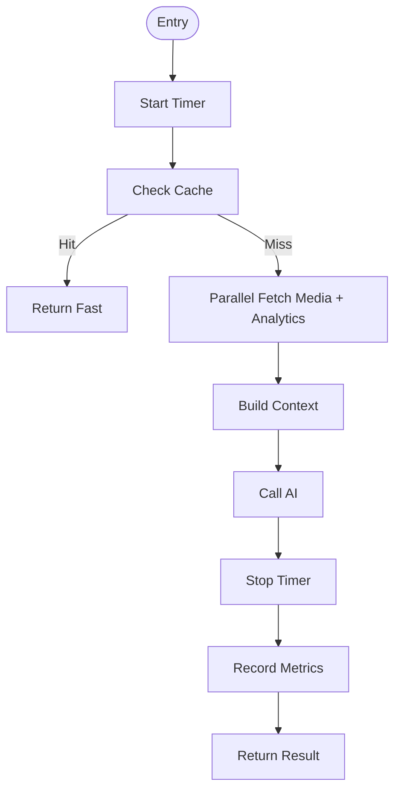

**Diagram sources**
- [performance-audit.service.ts](file://apps/backend/src/hardening/performance-audit.service.ts)
- [prompt.service.ts](file://apps/backend/src/journal/prompt.service.ts)

**Section sources**
- [performance-audit.service.ts](file://apps/backend/src/hardening/performance-audit.service.ts)
- [prompt.service.ts](file://apps/backend/src/journal/prompt.service.ts)

### Configuration and Environment
- AI provider configuration includes keys, model names, and endpoint URLs.
- Template rules define categories, tone, and constraints.
- Cache TTLs and rate limits are validated at startup.

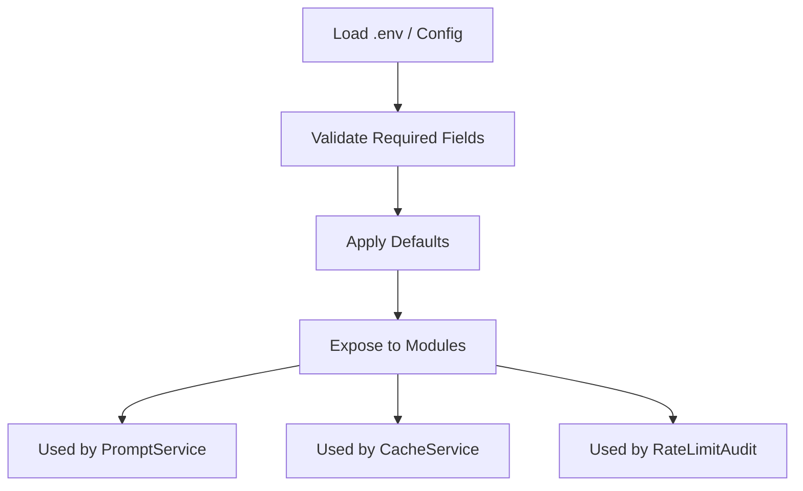

**Diagram sources**
- [config.module.ts](file://apps/backend/src/config/config.module.ts)
- [configuration.ts](file://apps/backend/src/config/configuration.ts)
- [env.validation.ts](file://apps/backend/src/config/env.validation.ts)

**Section sources**
- [config.module.ts](file://apps/backend/src/config/config.module.ts)
- [configuration.ts](file://apps/backend/src/config/configuration.ts)
- [env.validation.ts](file://apps/backend/src/config/env.validation.ts)

### Frontend Integration
- JournalPrompt component displays prompts and triggers regeneration.
- QuickPromptDialog offers quick access to prompts within media detail views.
- use-journal hook encapsulates API calls and local state management.

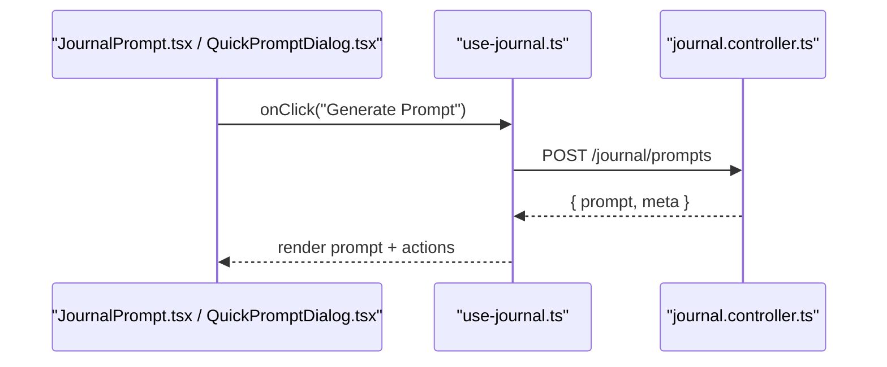

**Diagram sources**
- [JournalPrompt.tsx](file://src/components/journal/JournalPrompt.tsx)
- [QuickPromptDialog.tsx](file://src/components/media/QuickPromptDialog.tsx)
- [use-journal.ts](file://src/hooks/use-journal.ts)
- [journal.controller.ts](file://apps/backend/src/journal/journal.controller.ts)

**Section sources**
- [JournalPrompt.tsx](file://src/components/journal/JournalPrompt.tsx)
- [QuickPromptDialog.tsx](file://src/components/media/QuickPromptDialog.tsx)
- [use-journal.ts](file://src/hooks/use-journal.ts)

## Dependency Analysis
The prompt generation pipeline depends on multiple services and infrastructure layers. Coupling is minimized through clear interfaces and modular responsibilities.

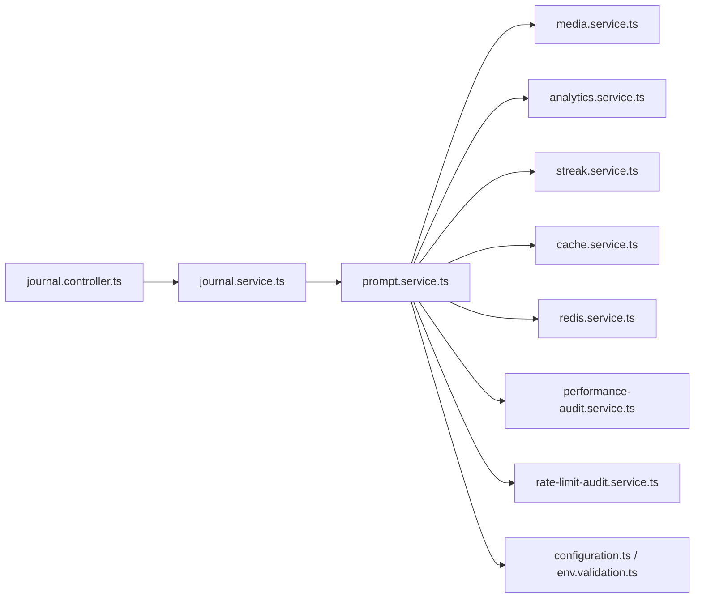

**Diagram sources**
- [prompt.service.ts](file://apps/backend/src/journal/prompt.service.ts)
- [media.service.ts](file://apps/backend/src/media/media.service.ts)
- [analytics.service.ts](file://apps/backend/src/analytics/analytics.service.ts)
- [streak.service.ts](file://apps/backend/src/analytics/streak.service.ts)
- [cache.service.ts](file://apps/backend/src/hardening/cache.service.ts)
- [redis.service.ts](file://apps/backend/src/redis/redis.service.ts)
- [performance-audit.service.ts](file://apps/backend/src/hardening/performance-audit.service.ts)
- [rate-limit-audit.service.ts](file://apps/backend/src/hardening/rate-limit-audit.service.ts)
- [configuration.ts](file://apps/backend/src/config/configuration.ts)
- [env.validation.ts](file://apps/backend/src/config/env.validation.ts)
- [journal.controller.ts](file://apps/backend/src/journal/journal.controller.ts)
- [journal.service.ts](file://apps/backend/src/journal/journal.service.ts)

**Section sources**
- [prompt.service.ts](file://apps/backend/src/journal/prompt.service.ts)
- [journal.controller.ts](file://apps/backend/src/journal/journal.controller.ts)
- [journal.service.ts](file://apps/backend/src/journal/journal.service.ts)

## Performance Considerations
- Prefer cache hits by designing stable keys and appropriate TTLs.
- Parallelize independent data fetches (media and analytics).
- Monitor latency and error rates; adjust timeouts and backoff strategies.
- Enforce rate limits to avoid overloading AI providers.
- Profile hot paths and consider batching where applicable.

[No sources needed since this section provides general guidance]

## Troubleshooting Guide
Common issues and resolutions:
- AI provider errors: verify configuration, network connectivity, and credentials; enable retries with backoff.
- Rate limiting: reduce request frequency, increase TTLs, or scale horizontally with shared Redis cache.
- Cache misses: ensure consistent key hashing and correct TTL configuration.
- High latency: profile AI calls, optimize context size, and consider pre-warming caches.

**Section sources**
- [performance-audit.service.ts](file://apps/backend/src/hardening/performance-audit.service.ts)
- [rate-limit-audit.service.ts](file://apps/backend/src/hardening/rate-limit-audit.service.ts)
- [cache.service.ts](file://apps/backend/src/hardening/cache.service.ts)
- [redis.service.ts](file://apps/backend/src/redis/redis.service.ts)
- [prompt.service.ts](file://apps/backend/src/journal/prompt.service.ts)

## Conclusion
The AI-powered prompt generation system integrates user history, media consumption, and emotional signals to deliver personalized prompts. It leverages caching, rate limiting, and performance auditing to ensure reliability and responsiveness. The modular design allows flexible template selection and robust fallbacks, enabling high user engagement across diverse scenarios.

[No sources needed since this section summarizes without analyzing specific files]

## Appendices

### Prompt Templates and Personalization Algorithms
- Categories: reflection, continuation, mood-based, milestone, recommendation.
- Personalization inputs: recent genres, completion rates, streak length, mood trends, time-of-day.
- Algorithm steps: assemble context, select template, inject signals, format payload, call AI, parse and cache.

**Section sources**
- [prompt.service.ts](file://apps/backend/src/journal/prompt.service.ts)
- [configuration.ts](file://apps/backend/src/config/configuration.ts)

### Example Prompt Types and Use Cases
- Reflection prompt after completing a series episode to capture emotions and themes.
- Continuation prompt suggesting next viewing based on unfinished arcs.
- Mood-based prompt encouraging journaling aligned with detected sentiment.
- Milestone prompt celebrating streak achievements and prompting reflective writing.

[No sources needed since this section provides conceptual examples]