# Emotional State Tracking & Mood Analysis

<cite>
**Referenced Files in This Document**
- [journal.service.ts](file://apps/backend/src/journal/journal.service.ts)
- [journal-statistics.service.ts](file://apps/backend/src/journal/journal-statistics.service.ts)
- [timeline-event-factory.ts](file://apps/backend/src/journal/timeline-event-factory.ts)
- [journal.controller.ts](file://apps/backend/src/journal/journal.controller.ts)
- [journal.repository.ts](file://apps/backend/src/journal/journal.repository.ts)
- [journal.module.ts](file://apps/backend/src/journal/journal.module.ts)
- [analytics-aggregation.service.ts](file://apps/backend/src/analytics/analytics-aggregation.service.ts)
- [dashboard.service.ts](file://apps/backend/src/analytics/dashboard.service.ts)
- [insights.service.ts](file://apps/backend/src/analytics/insights.service.ts)
- [streak.service.ts](file://apps/backend/src/analytics/streak.service.ts)
- [analytics.controller.ts](file://apps/backend/src/analytics/analytics.controller.ts)
- [analytics.module.ts](file://apps/backend/src/analytics/analytics.module.ts)
- [schema.prisma](file://apps/backend/prisma/schema.prisma)
- [EmotionJourney.tsx](file://src/components/media/EmotionJourney.tsx)
- [MoodChart.tsx](file://src/components/journal/MoodChart.tsx)
- [DashboardMood.tsx](file://src/components/dashboard/DashboardMood.tsx)
- [MemoryJourney.tsx](file://src/components/memory/MemoryJourney.tsx)
</cite>

## Table of Contents
1. [Introduction](#introduction)
2. [Project Structure](#project-structure)
3. [Core Components](#core-components)
4. [Architecture Overview](#architecture-overview)
5. [Detailed Component Analysis](#detailed-component-analysis)
6. [Dependency Analysis](#dependency-analysis)
7. [Performance Considerations](#performance-considerations)
8. [Troubleshooting Guide](#troubleshooting-guide)
9. [Conclusion](#conclusion)
10. [Appendices](#appendices)

## Introduction
This document explains the emotional tracking and mood analysis system, focusing on how emotional states are captured, stored, analyzed over time, and visualized. It covers mood scoring algorithms, sentiment analysis integration points, correlation with media consumption patterns, timeline event generation based on emotional changes, statistical calculations for mood trends, and examples of mood visualization and emotional journey mapping.

## Project Structure
The emotional tracking and mood analysis spans backend services (journaling, analytics, insights), data models (Prisma schema), and frontend components that render mood charts and emotion journeys. The key modules include:
- Journal module: captures journal entries and computes statistics and timeline events.
- Analytics module: aggregates metrics, builds dashboards, and generates insights.
- Frontend components: visualize mood and emotion timelines and map emotional journeys across media interactions.

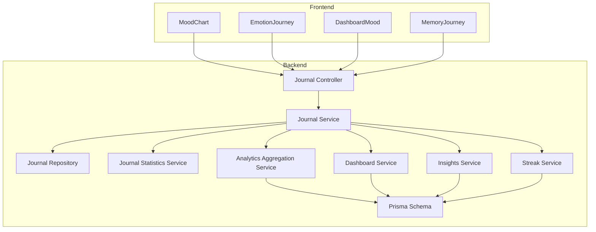

**Diagram sources**
- [journal.controller.ts](file://apps/backend/src/journal/journal.controller.ts)
- [journal.service.ts](file://apps/backend/src/journal/journal.service.ts)
- [journal.repository.ts](file://apps/backend/src/journal/journal.repository.ts)
- [journal-statistics.service.ts](file://apps/backend/src/journal/journal-statistics.service.ts)
- [analytics-aggregation.service.ts](file://apps/backend/src/analytics/analytics-aggregation.service.ts)
- [dashboard.service.ts](file://apps/backend/src/analytics/dashboard.service.ts)
- [insights.service.ts](file://apps/backend/src/analytics/insights.service.ts)
- [streak.service.ts](file://apps/backend/src/analytics/streak.service.ts)
- [schema.prisma](file://apps/backend/prisma/schema.prisma)
- [MoodChart.tsx](file://src/components/journal/MoodChart.tsx)
- [EmotionJourney.tsx](file://src/components/media/EmotionJourney.tsx)
- [DashboardMood.tsx](file://src/components/dashboard/DashboardMood.tsx)
- [MemoryJourney.tsx](file://src/components/memory/MemoryJourney.tsx)

**Section sources**
- [journal.controller.ts](file://apps/backend/src/journal/journal.controller.ts)
- [journal.service.ts](file://apps/backend/src/journal/journal.service.ts)
- [journal-statistics.service.ts](file://apps/backend/src/journal/journal-statistics.service.ts)
- [analytics-aggregation.service.ts](file://apps/backend/src/analytics/analytics-aggregation.service.ts)
- [dashboard.service.ts](file://apps/backend/src/analytics/dashboard.service.ts)
- [insights.service.ts](file://apps/backend/src/analytics/insights.service.ts)
- [streak.service.ts](file://apps/backend/src/analytics/streak.service.ts)
- [schema.prisma](file://apps/backend/prisma/schema.prisma)
- [MoodChart.tsx](file://src/components/journal/MoodChart.tsx)
- [EmotionJourney.tsx](file://src/components/media/EmotionJourney.tsx)
- [DashboardMood.tsx](file://src/components/dashboard/DashboardMood.tsx)
- [MemoryJourney.tsx](file://src/components/memory/MemoryJourney.tsx)

## Core Components
- Journal Service: orchestrates capturing journal entries, computing mood scores, generating timeline events, and coordinating analytics.
- Journal Statistics Service: calculates mood trends, distributions, and summary metrics.
- Timeline Event Factory: creates timeline events triggered by emotional state changes.
- Analytics Aggregation Service: aggregates mood and interaction data for dashboards and insights.
- Dashboard Service: composes dashboard-level mood summaries and trends.
- Insights Service: derives actionable insights from mood and media correlations.
- Streak Service: tracks streaks related to journaling or mood consistency.
- Prisma Schema: defines entities for journal entries, mood scores, and related metadata.
- Frontend Components: render mood charts, emotion journeys, and dashboard mood widgets.

**Section sources**
- [journal.service.ts](file://apps/backend/src/journal/journal.service.ts)
- [journal-statistics.service.ts](file://apps/backend/src/journal/journal-statistics.service.ts)
- [timeline-event-factory.ts](file://apps/backend/src/journal/timeline-event-factory.ts)
- [analytics-aggregation.service.ts](file://apps/backend/src/analytics/analytics-aggregation.service.ts)
- [dashboard.service.ts](file://apps/backend/src/analytics/dashboard.service.ts)
- [insights.service.ts](file://apps/backend/src/analytics/insights.service.ts)
- [streak.service.ts](file://apps/backend/src/analytics/streak.service.ts)
- [schema.prisma](file://apps/backend/prisma/schema.prisma)
- [MoodChart.tsx](file://src/components/journal/MoodChart.tsx)
- [EmotionJourney.tsx](file://src/components/media/EmotionJourney.tsx)
- [DashboardMood.tsx](file://src/components/dashboard/DashboardMood.tsx)
- [MemoryJourney.tsx](file://src/components/memory/MemoryJourney.tsx)

## Architecture Overview
The system follows a layered architecture:
- Controllers expose endpoints for capturing journal entries and retrieving mood analytics.
- Services implement business logic for mood scoring, trend calculation, and insight generation.
- Repositories interact with the database via Prisma.
- Frontend components consume APIs to render mood charts and emotion journeys.

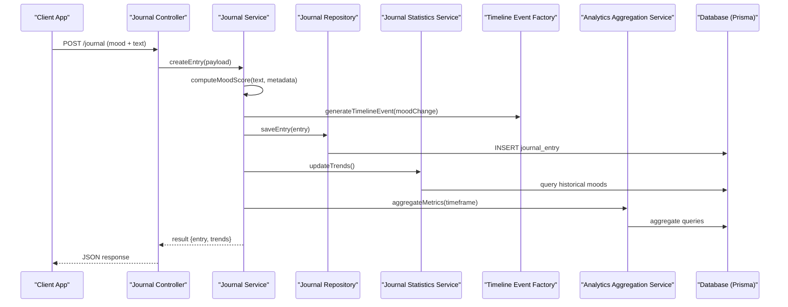

**Diagram sources**
- [journal.controller.ts](file://apps/backend/src/journal/journal.controller.ts)
- [journal.service.ts](file://apps/backend/src/journal/journal.service.ts)
- [journal.repository.ts](file://apps/backend/src/journal/journal.repository.ts)
- [journal-statistics.service.ts](file://apps/backend/src/journal/journal-statistics.service.ts)
- [timeline-event-factory.ts](file://apps/backend/src/journal/timeline-event-factory.ts)
- [analytics-aggregation.service.ts](file://apps/backend/src/analytics/analytics-aggregation.service.ts)
- [schema.prisma](file://apps/backend/prisma/schema.prisma)

## Detailed Component Analysis

### Journal Service
Responsibilities:
- Captures journal entries with mood annotations.
- Computes mood scores using textual sentiment and optional explicit mood inputs.
- Generates timeline events when significant emotional changes occur.
- Coordinates updates to statistics and analytics aggregations.

Key behaviors:
- Mood scoring integrates sentiment signals and user-provided mood tags.
- Timeline events are created for transitions between mood states.
- Trend calculations leverage historical data to produce rolling averages and variance.

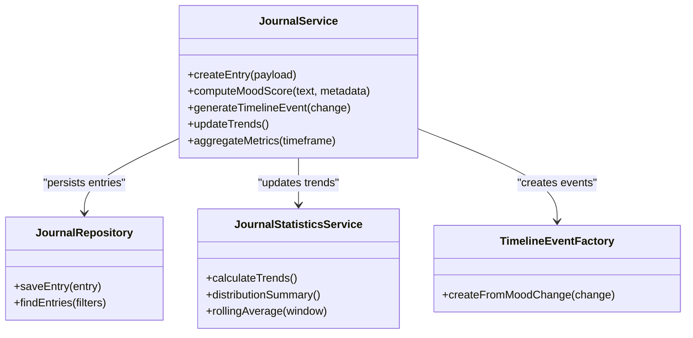

**Diagram sources**
- [journal.service.ts](file://apps/backend/src/journal/journal.service.ts)
- [journal.repository.ts](file://apps/backend/src/journal/journal.repository.ts)
- [journal-statistics.service.ts](file://apps/backend/src/journal/journal-statistics.service.ts)
- [timeline-event-factory.ts](file://apps/backend/src/journal/timeline-event-factory.ts)

**Section sources**
- [journal.service.ts](file://apps/backend/src/journal/journal.service.ts)
- [journal.repository.ts](file://apps/backend/src/journal/journal.repository.ts)
- [journal-statistics.service.ts](file://apps/backend/src/journal/journal-statistics.service.ts)
- [timeline-event-factory.ts](file://apps/backend/src/journal/timeline-event-factory.ts)

### Journal Statistics Service
Responsibilities:
- Calculates mood trends over configurable windows.
- Produces distribution summaries (e.g., frequency of each mood).
- Computes rolling averages and variance to detect volatility.

Algorithm highlights:
- Rolling average uses a sliding window over chronological mood scores.
- Distribution summary counts occurrences per mood category.
- Volatility is measured by standard deviation within the window.

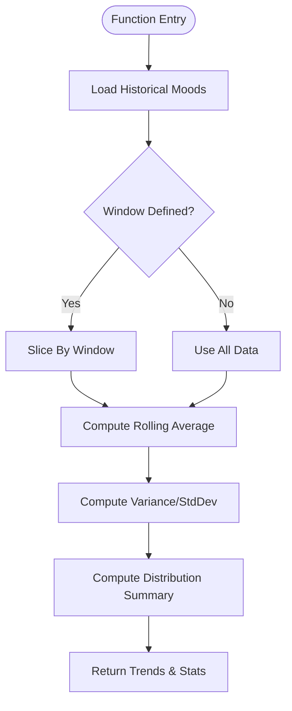

**Diagram sources**
- [journal-statistics.service.ts](file://apps/backend/src/journal/journal-statistics.service.ts)

**Section sources**
- [journal-statistics.service.ts](file://apps/backend/src/journal/journal-statistics.service.ts)

### Timeline Event Factory
Responsibilities:
- Creates timeline events triggered by emotional state changes.
- Encodes event type, timestamp, and associated context (e.g., media item, journal entry).

Behavior:
- Detects significant mood transitions and emits corresponding events.
- Enriches events with contextual metadata for downstream analytics.

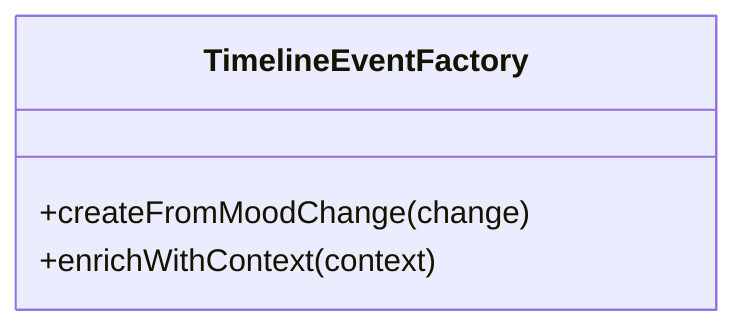

**Diagram sources**
- [timeline-event-factory.ts](file://apps/backend/src/journal/timeline-event-factory.ts)

**Section sources**
- [timeline-event-factory.ts](file://apps/backend/src/journal/timeline-event-factory.ts)

### Analytics Aggregation Service
Responsibilities:
- Aggregates mood and interaction data across timeframes.
- Supports dashboard-level summaries and insight generation.

Key operations:
- Aggregates mood scores by day/week/month.
- Correlates mood with media consumption metrics.

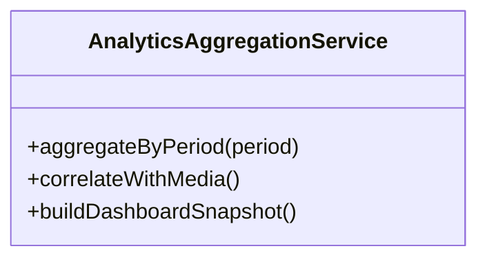

**Diagram sources**
- [analytics-aggregation.service.ts](file://apps/backend/src/analytics/analytics-aggregation.service.ts)

**Section sources**
- [analytics-aggregation.service.ts](file://apps/backend/src/analytics/analytics-aggregation.service.ts)

### Dashboard Service
Responsibilities:
- Composes dashboard-level mood summaries and trends.
- Provides quick-glance metrics for users.

Operations:
- Retrieves latest mood state and recent trends.
- Integrates streak information for engagement insights.

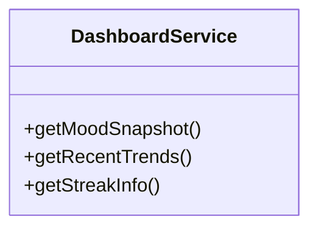

**Diagram sources**
- [dashboard.service.ts](file://apps/backend/src/analytics/dashboard.service.ts)

**Section sources**
- [dashboard.service.ts](file://apps/backend/src/analytics/dashboard.service.ts)

### Insights Service
Responsibilities:
- Derives actionable insights from mood and media correlations.
- Identifies patterns such as mood shifts after specific genres or sessions.

Operations:
- Analyzes correlations between media attributes and mood changes.
- Generates narrative insights for users.

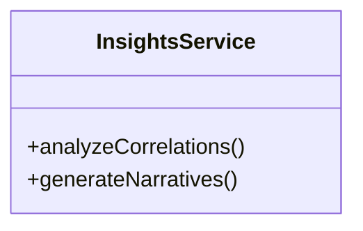

**Diagram sources**
- [insights.service.ts](file://apps/backend/src/analytics/insights.service.ts)

**Section sources**
- [insights.service.ts](file://apps/backend/src/analytics/insights.service.ts)

### Streak Service
Responsibilities:
- Tracks streaks related to journaling or mood consistency.
- Updates streak counters based on daily activity.

Operations:
- Increments streaks on successful journal entries.
- Resets streaks on missed days.

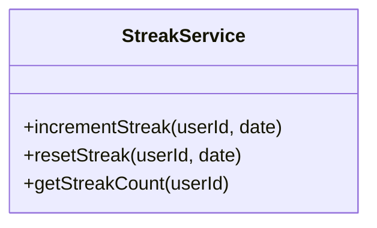

**Diagram sources**
- [streak.service.ts](file://apps/backend/src/analytics/streak.service.ts)

**Section sources**
- [streak.service.ts](file://apps/backend/src/analytics/streak.service.ts)

### Database Schema (Prisma)
Responsibilities:
- Defines entities for journal entries, mood scores, and related metadata.
- Ensures referential integrity and indexing for performance.

Key entities:
- JournalEntry: stores text, mood score, timestamps, and associations.
- MoodScore: numeric representation of emotional state.
- TimelineEvent: records emotional change events with context.

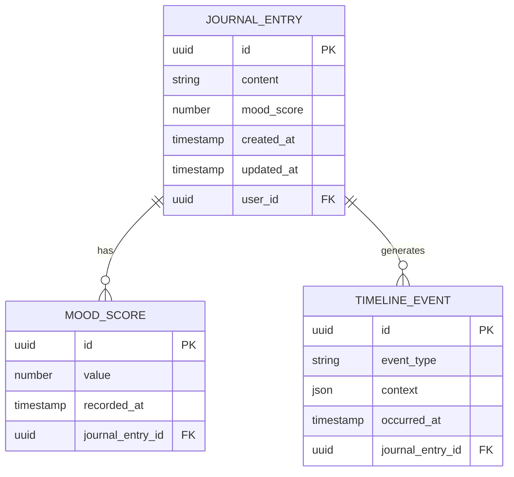

**Diagram sources**
- [schema.prisma](file://apps/backend/prisma/schema.prisma)

**Section sources**
- [schema.prisma](file://apps/backend/prisma/schema.prisma)

### Frontend Components
- MoodChart: renders mood trends over time using aggregated data.
- EmotionJourney: maps emotional changes alongside media consumption.
- DashboardMood: displays current mood snapshot and recent trends.
- MemoryJourney: visualizes memory-related emotional arcs.

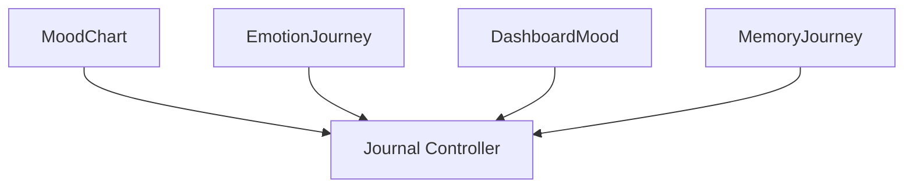

**Diagram sources**
- [MoodChart.tsx](file://src/components/journal/MoodChart.tsx)
- [EmotionJourney.tsx](file://src/components/media/EmotionJourney.tsx)
- [DashboardMood.tsx](file://src/components/dashboard/DashboardMood.tsx)
- [MemoryJourney.tsx](file://src/components/memory/MemoryJourney.tsx)
- [journal.controller.ts](file://apps/backend/src/journal/journal.controller.ts)

**Section sources**
- [MoodChart.tsx](file://src/components/journal/MoodChart.tsx)
- [EmotionJourney.tsx](file://src/components/media/EmotionJourney.tsx)
- [DashboardMood.tsx](file://src/components/dashboard/DashboardMood.tsx)
- [MemoryJourney.tsx](file://src/components/memory/MemoryJourney.tsx)
- [journal.controller.ts](file://apps/backend/src/journal/journal.controller.ts)

## Dependency Analysis
The journal module depends on analytics and statistics services to compute trends and insights. The frontend components depend on controller endpoints to fetch mood data and timeline events.

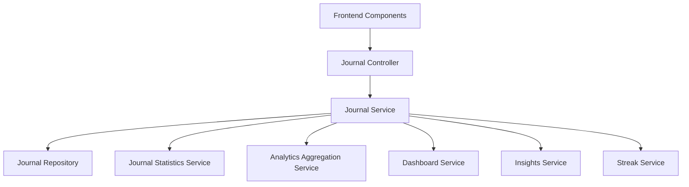

**Diagram sources**
- [journal.controller.ts](file://apps/backend/src/journal/journal.controller.ts)
- [journal.service.ts](file://apps/backend/src/journal/journal.service.ts)
- [journal.repository.ts](file://apps/backend/src/journal/journal.repository.ts)
- [journal-statistics.service.ts](file://apps/backend/src/journal/journal-statistics.service.ts)
- [analytics-aggregation.service.ts](file://apps/backend/src/analytics/analytics-aggregation.service.ts)
- [dashboard.service.ts](file://apps/backend/src/analytics/dashboard.service.ts)
- [insights.service.ts](file://apps/backend/src/analytics/insights.service.ts)
- [streak.service.ts](file://apps/backend/src/analytics/streak.service.ts)

**Section sources**
- [journal.controller.ts](file://apps/backend/src/journal/journal.controller.ts)
- [journal.service.ts](file://apps/backend/src/journal/journal.service.ts)
- [journal.repository.ts](file://apps/backend/src/journal/journal.repository.ts)
- [journal-statistics.service.ts](file://apps/backend/src/journal/journal-statistics.service.ts)
- [analytics-aggregation.service.ts](file://apps/backend/src/analytics/analytics-aggregation.service.ts)
- [dashboard.service.ts](file://apps/backend/src/analytics/dashboard.service.ts)
- [insights.service.ts](file://apps/backend/src/analytics/insights.service.ts)
- [streak.service.ts](file://apps/backend/src/analytics/streak.service.ts)

## Performance Considerations
- Caching: Cache frequent mood snapshots and trend calculations to reduce database load.
- Pagination: Implement pagination for large datasets when fetching historical moods.
- Indexing: Ensure indexes on timestamps and user IDs for efficient queries.
- Batch Processing: Aggregate analytics in batch jobs during off-peak hours.
- Streaming: Stream timeline events for real-time updates where applicable.

[No sources needed since this section provides general guidance]

## Troubleshooting Guide
Common issues:
- Missing mood scores: Validate input payloads and ensure sentiment parsing succeeds.
- Incorrect trends: Verify window sizes and data ordering in statistical calculations.
- Timeline gaps: Check event generation triggers and ensure consistent timestamping.
- Slow queries: Review database indexes and optimize aggregation queries.

Debugging steps:
- Inspect journal entry creation logs for errors.
- Validate mood score computation with sample texts.
- Confirm timeline event creation on mood transitions.
- Monitor analytics aggregation job outputs.

**Section sources**
- [journal.service.ts](file://apps/backend/src/journal/journal.service.ts)
- [journal-statistics.service.ts](file://apps/backend/src/journal/journal-statistics.service.ts)
- [timeline-event-factory.ts](file://apps/backend/src/journal/timeline-event-factory.ts)
- [analytics-aggregation.service.ts](file://apps/backend/src/analytics/analytics-aggregation.service.ts)

## Conclusion
The emotional tracking and mood analysis system integrates journaling, sentiment analysis, and analytics to provide comprehensive mood insights. It captures emotional states, computes trends, generates timeline events, and correlates mood with media consumption. Frontend components visualize these insights effectively, enabling users to understand their emotional journeys over time.

[No sources needed since this section summarizes without analyzing specific files]

## Appendices
- Example mood visualization: Use MoodChart to display rolling averages and volatility.
- Emotional journey mapping: Use EmotionJourney to correlate mood changes with media items.
- Dashboard overview: Use DashboardMood for quick access to current mood and recent trends.
- Memory arcs: Use MemoryJourney to explore emotional patterns tied to memories.

[No sources needed since this section provides general guidance]