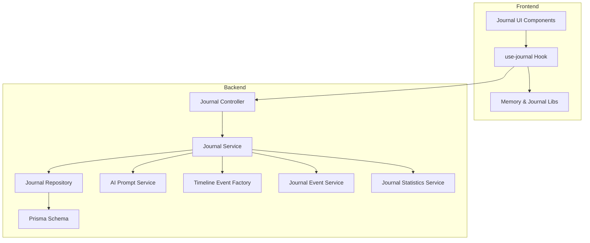
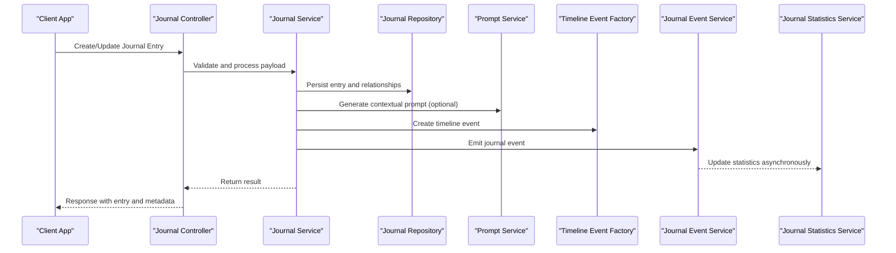
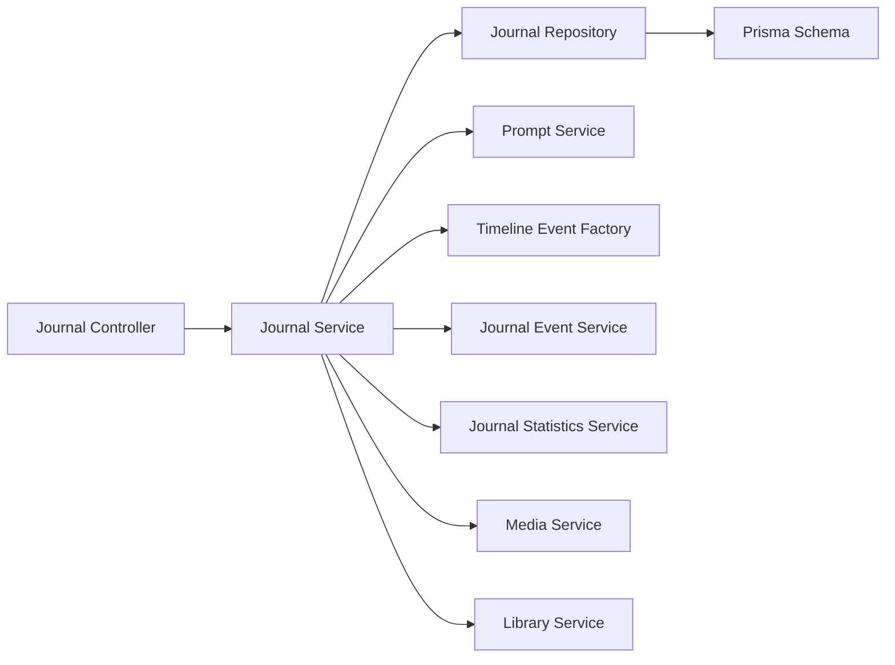

# Journal & Memory System

<cite>
**Referenced Files in This Document**
- [journal.controller.ts](file://apps/backend/src/journal/journal.controller.ts)
- [journal.service.ts](file://apps/backend/src/journal/journal.service.ts)
- [journal.repository.ts](file://apps/backend/src/journal/journal.repository.ts)
- [journal.module.ts](file://apps/backend/src/journal/journal.module.ts)
- [prompt.service.ts](file://apps/backend/src/journal/prompt.service.ts)
- [timeline-event-factory.ts](file://apps/backend/src/journal/timeline-event-factory.ts)
- [journal-event.service.ts](file://apps/backend/src/journal/journal-event.service.ts)
- [journal-statistics.service.ts](file://apps/backend/src/journal/journal-statistics.service.ts)
- [schema.prisma](file://apps/backend/prisma/schema.prisma)
- [use-journal.ts](file://src/hooks/use-journal.ts)
- [JournalEntryCard.tsx](file://src/components/journal/JournalEntryCard.tsx)
- [JournalHero.tsx](file://src/components/journal/JournalHero.tsx)
- [JournalPrompt.tsx](file://src/components/journal/JournalPrompt.tsx)
- [MoodChart.tsx](file://src/components/journal/MoodChart.tsx)
- [WriteOverlay.tsx](file://src/components/journal/WriteOverlay.tsx)
- [memory.ts](file://src/lib/memory.ts)
- [memoryInsights.ts](file://src/lib/memoryInsights.ts)
- [memoryJournal.ts](file://src/lib/memoryJournal.ts)
- [media.service.ts](file://apps/backend/src/media/media.service.ts)
- [library.service.ts](file://apps/backend/src/library/library.service.ts)
</cite>

## Table of Contents
1. [Introduction](#introduction)
2. [Project Structure](#project-structure)
3. [Core Components](#core-components)
4. [Architecture Overview](#architecture-overview)
5. [Detailed Component Analysis](#detailed-component-analysis)
6. [Dependency Analysis](#dependency-analysis)
7. [Performance Considerations](#performance-considerations)
8. [Troubleshooting Guide](#troubleshooting-guide)
9. [Conclusion](#conclusion)

## Introduction
This document explains the journal and memory tracking system, focusing on rich text editing support, emotional state tracking, timeline-based memory organization, and AI-powered prompt generation. It covers the journal entry lifecycle, mood analysis algorithms, integration with media items, event-driven architecture for updates, statistics calculation, and relationship mapping between memories and media content. The goal is to provide both a high-level understanding and code-level insights for developers and product stakeholders.

## Project Structure
The journal and memory system spans backend NestJS modules and frontend React components:
- Backend module under apps/backend/src/journal provides controllers, services, repositories, events, statistics, and prompt generation utilities.
- Frontend components under src/components/journal implement rich text editing, mood visualization, prompts, and overlay interactions.
- Hooks under src/hooks use-journal.ts encapsulate client-side data fetching and mutations.
- Utilities under src/lib handle memory insights, journal operations, and memory-related logic.
- Database schema under apps/backend/prisma/schema.prisma defines entities and relationships used by the journal and related features.

**Diagram sources**
- [journal.controller.ts](file://apps/backend/src/journal/journal.controller.ts)
- [journal.service.ts](file://apps/backend/src/journal/journal.service.ts)
- [journal.repository.ts](file://apps/backend/src/journal/journal.repository.ts)
- [prompt.service.ts](file://apps/backend/src/journal/prompt.service.ts)
- [timeline-event-factory.ts](file://apps/backend/src/journal/timeline-event-factory.ts)
- [journal-event.service.ts](file://apps/backend/src/journal/journal-event.service.ts)
- [journal-statistics.service.ts](file://apps/backend/src/journal/journal-statistics.service.ts)
- [schema.prisma](file://apps/backend/prisma/schema.prisma)
- [use-journal.ts](file://src/hooks/use-journal.ts)
- [JournalEntryCard.tsx](file://src/components/journal/JournalEntryCard.tsx)
- [JournalHero.tsx](file://src/components/journal/JournalHero.tsx)
- [JournalPrompt.tsx](file://src/components/journal/JournalPrompt.tsx)
- [MoodChart.tsx](file://src/components/journal/MoodChart.tsx)
- [WriteOverlay.tsx](file://src/components/journal/WriteOverlay.tsx)
- [memory.ts](file://src/lib/memory.ts)
- [memoryInsights.ts](file://src/lib/memoryInsights.ts)
- [memoryJournal.ts](file://src/lib/memoryJournal.ts)

**Section sources**
- [journal.controller.ts](file://apps/backend/src/journal/journal.controller.ts)
- [journal.service.ts](file://apps/backend/src/journal/journal.service.ts)
- [journal.repository.ts](file://apps/backend/src/journal/journal.repository.ts)
- [journal.module.ts](file://apps/backend/src/journal/journal.module.ts)
- [prompt.service.ts](file://apps/backend/src/journal/prompt.service.ts)
- [timeline-event-factory.ts](file://apps/backend/src/journal/timeline-event-factory.ts)
- [journal-event.service.ts](file://apps/backend/src/journal/journal-event.service.ts)
- [journal-statistics.service.ts](file://apps/backend/src/journal/journal-statistics.service.ts)
- [schema.prisma](file://apps/backend/prisma/schema.prisma)
- [use-journal.ts](file://src/hooks/use-journal.ts)
- [JournalEntryCard.tsx](file://src/components/journal/JournalEntryCard.tsx)
- [JournalHero.tsx](file://src/components/journal/JournalHero.tsx)
- [JournalPrompt.tsx](file://src/components/journal/JournalPrompt.tsx)
- [MoodChart.tsx](file://src/components/journal/MoodChart.tsx)
- [WriteOverlay.tsx](file://src/components/journal/WriteOverlay.tsx)
- [memory.ts](file://src/lib/memory.ts)
- [memoryInsights.ts](file://src/lib/memoryInsights.ts)
- [memoryJournal.ts](file://src/lib/memoryJournal.ts)

## Core Components
- Journal Controller: Exposes REST endpoints for creating, reading, updating, and deleting journal entries; integrates with services for business logic and event emission.
- Journal Service: Orchestrates journal operations, including validation, persistence, timeline event creation, statistics updates, and AI prompt generation.
- Journal Repository: Data access layer for journal entries, queries, and relationships with media and collections.
- Prompt Service: Generates contextual AI prompts based on user history, recent media, and mood patterns.
- Timeline Event Factory: Produces timeline events from journal entries and media interactions to build a unified memory timeline.
- Journal Event Service: Emits domain events (e.g., entry created, updated, deleted) to decouple downstream processing like notifications and analytics.
- Journal Statistics Service: Calculates metrics such as streaks, mood distributions, writing frequency, and correlations with media consumption.

Key responsibilities:
- Rich text editing support via structured content models and storage.
- Emotional state tracking through mood fields and derived insights.
- Timeline-based memory organization using time-stamped events.
- AI-powered prompt generation tailored to context and user preferences.

**Section sources**
- [journal.controller.ts](file://apps/backend/src/journal/journal.controller.ts)
- [journal.service.ts](file://apps/backend/src/journal/journal.service.ts)
- [journal.repository.ts](file://apps/backend/src/journal/journal.repository.ts)
- [prompt.service.ts](file://apps/backend/src/journal/prompt.service.ts)
- [timeline-event-factory.ts](file://apps/backend/src/journal/timeline-event-factory.ts)
- [journal-event.service.ts](file://apps/backend/src/journal/journal-event.service.ts)
- [journal-statistics.service.ts](file://apps/backend/src/journal/journal-statistics.service.ts)

## Architecture Overview
The system follows an event-driven architecture with clear separation between controller, service, repository, and auxiliary services. Journal entries trigger events that propagate to statistics, timeline, and notification systems. Media integration ensures memories are linked to consumed or bookmarked media items.

**Diagram sources**
- [journal.controller.ts](file://apps/backend/src/journal/journal.controller.ts)
- [journal.service.ts](file://apps/backend/src/journal/journal.service.ts)
- [journal.repository.ts](file://apps/backend/src/journal/journal.repository.ts)
- [prompt.service.ts](file://apps/backend/src/journal/prompt.service.ts)
- [timeline-event-factory.ts](file://apps/backend/src/journal/timeline-event-factory.ts)
- [journal-event.service.ts](file://apps/backend/src/journal/journal-event.service.ts)
- [journal-statistics.service.ts](file://apps/backend/src/journal/journal-statistics.service.ts)

## Detailed Component Analysis

### Journal Controller
Responsibilities:
- Define API endpoints for journal CRUD operations.
- Parse and validate request payloads.
- Delegate business logic to Journal Service.
- Return standardized responses and errors.

Integration points:
- Uses DTOs for input validation.
- Leverages guards/decorators for authentication and authorization.
- Emits events indirectly via service methods.

**Section sources**
- [journal.controller.ts](file://apps/backend/src/journal/journal.controller.ts)

### Journal Service
Responsibilities:
- Orchestrate journal entry lifecycle: create, update, delete, retrieve.
- Enforce business rules (e.g., required fields, mood constraints).
- Manage relationships with media items and collections.
- Trigger timeline event creation and statistics updates.
- Coordinate AI prompt generation when requested.

Data flow:
- Validates inputs and maps to domain models.
- Persists via repository with transactional boundaries.
- Publishes events for side effects (notifications, analytics).

Error handling:
- Centralized exception mapping and domain-specific error types.
- Graceful fallbacks for AI prompt failures.

**Section sources**
- [journal.service.ts](file://apps/backend/src/journal/journal.service.ts)
- [journal.repository.ts](file://apps/backend/src/journal/journal.repository.ts)

### Journal Repository
Responsibilities:
- Provide data access methods for journal entries and relationships.
- Execute efficient queries for timelines, filters, and aggregations.
- Maintain referential integrity with media and collections.

Optimizations:
- Batch operations for bulk updates.
- Indexed queries for date ranges and mood filters.

**Section sources**
- [journal.repository.ts](file://apps/backend/src/journal/journal.repository.ts)
- [schema.prisma](file://apps/backend/prisma/schema.prisma)

### Prompt Service
Responsibilities:
- Generate contextual prompts based on user history, recent media, and mood trends.
- Support multiple prompt strategies (random, thematic, reflective).
- Cache frequently used prompts to reduce latency.

Algorithm highlights:
- Contextual weighting using recency and relevance scores.
- Fallback to generic prompts when insufficient context exists.

**Section sources**
- [prompt.service.ts](file://apps/backend/src/journal/prompt.service.ts)

### Timeline Event Factory
Responsibilities:
- Convert journal entries and media interactions into timeline events.
- Normalize timestamps and categorize events (write, reflect, connect).
- Ensure consistent event structure for rendering and analytics.

Design patterns:
- Factory pattern for event instantiation.
- Strategy pattern for different event types.

**Section sources**
- [timeline-event-factory.ts](file://apps/backend/src/journal/timeline-event-factory.ts)

### Journal Event Service
Responsibilities:
- Emit domain events upon journal changes.
- Decouple downstream consumers (statistics, notifications, search indexing).
- Provide retry mechanisms and dead-letter handling for reliability.

Event types:
- JournalEntryCreated
- JournalEntryUpdated
- JournalEntryDeleted
- MoodChanged

**Section sources**
- [journal-event.service.ts](file://apps/backend/src/journal/journal-event.service.ts)

### Journal Statistics Service
Responsibilities:
- Calculate writing streaks, frequency, and mood distributions.
- Aggregate correlations between journaling and media consumption.
- Expose metrics for dashboards and insights.

Metrics:
- Daily/weekly/monthly counts.
- Mood sentiment trends.
- Top themes and keywords.

**Section sources**
- [journal-statistics.service.ts](file://apps/backend/src/journal/journal-statistics.service.ts)

### Frontend Journal Components
- JournalEntryCard: Displays individual entries with mood indicators and media links.
- JournalHero: Provides overview stats and quick actions.
- JournalPrompt: Renders AI-generated prompts and handles user selection.
- MoodChart: Visualizes mood trends over time.
- WriteOverlay: Rich text editor interface for composing entries.

Rich text editing:
- Supports structured content blocks, formatting, and embedded media.
- Autosave and conflict resolution for collaborative scenarios.

Emotional state tracking:
- Mood selection integrated with entry creation/update.
- Historical mood visualization and insights.

**Section sources**
- [JournalEntryCard.tsx](file://src/components/journal/JournalEntryCard.tsx)
- [JournalHero.tsx](file://src/components/journal/JournalHero.tsx)
- [JournalPrompt.tsx](file://src/components/journal/JournalPrompt.tsx)
- [MoodChart.tsx](file://src/components/journal/MoodChart.tsx)
- [WriteOverlay.tsx](file://src/components/journal/WriteOverlay.tsx)

### Hooks and Libraries
- use-journal.ts: Encapsulates API calls, caching, and optimistic updates for journal operations.
- memory.ts: Utilities for memory manipulation, tagging, and retrieval.
- memoryInsights.ts: Algorithms for deriving insights from memory data.
- memoryJournal.ts: Bridges journal entries with memory concepts and relationships.

**Section sources**
- [use-journal.ts](file://src/hooks/use-journal.ts)
- [memory.ts](file://src/lib/memory.ts)
- [memoryInsights.ts](file://src/lib/memoryInsights.ts)
- [memoryJournal.ts](file://src/lib/memoryJournal.ts)

### Media Integration
- Journal entries can be linked to media items (books, movies, shows) to enrich context.
- Relationships enable cross-referencing between reflections and consumed content.
- Media metadata enhances timeline events and insights.

**Section sources**
- [media.service.ts](file://apps/backend/src/media/media.service.ts)
- [library.service.ts](file://apps/backend/src/library/library.service.ts)

## Dependency Analysis
The journal module depends on core infrastructure (events, transactions, storage) and collaborates with media and library modules. Coupling is minimized through interfaces and event-driven communication.

**Diagram sources**
- [journal.controller.ts](file://apps/backend/src/journal/journal.controller.ts)
- [journal.service.ts](file://apps/backend/src/journal/journal.service.ts)
- [journal.repository.ts](file://apps/backend/src/journal/journal.repository.ts)
- [prompt.service.ts](file://apps/backend/src/journal/prompt.service.ts)
- [timeline-event-factory.ts](file://apps/backend/src/journal/timeline-event-factory.ts)
- [journal-event.service.ts](file://apps/backend/src/journal/journal-event.service.ts)
- [journal-statistics.service.ts](file://apps/backend/src/journal/journal-statistics.service.ts)
- [schema.prisma](file://apps/backend/prisma/schema.prisma)
- [media.service.ts](file://apps/backend/src/media/media.service.ts)
- [library.service.ts](file://apps/backend/src/library/library.service.ts)

**Section sources**
- [journal.module.ts](file://apps/backend/src/journal/journal.module.ts)

## Performance Considerations
- Use batch operations for bulk updates to reduce database round trips.
- Cache AI prompts and frequently accessed statistics to minimize latency.
- Index timestamp and mood fields for efficient timeline queries.
- Implement pagination and lazy loading for large timelines.
- Optimize rich text serialization to avoid large payloads.

[No sources needed since this section provides general guidance]

## Troubleshooting Guide
Common issues and resolutions:
- Validation errors: Ensure DTOs match expected schemas and required fields are present.
- Event delivery failures: Check event queue health and retry policies.
- Prompt generation timeouts: Implement fallback prompts and monitor external API limits.
- Timeline inconsistencies: Verify event ordering and idempotency keys.
- Media linkage problems: Confirm foreign key constraints and referential integrity.

Debugging tips:
- Enable detailed logging for journal operations.
- Inspect Prisma query logs for slow queries.
- Use observability tools to trace event flows.

**Section sources**
- [journal.service.ts](file://apps/backend/src/journal/journal.service.ts)
- [journal-event.service.ts](file://apps/backend/src/journal/journal-event.service.ts)
- [journal-statistics.service.ts](file://apps/backend/src/journal/journal-statistics.service.ts)

## Conclusion
The journal and memory system combines robust backend services with intuitive frontend components to deliver a comprehensive reflection and memory tracking experience. Its event-driven architecture ensures scalability and maintainability, while AI-powered prompts and mood analysis enhance user engagement. Tight integration with media content creates meaningful connections between personal reflections and consumed experiences.

[No sources needed since this section summarizes without analyzing specific files]