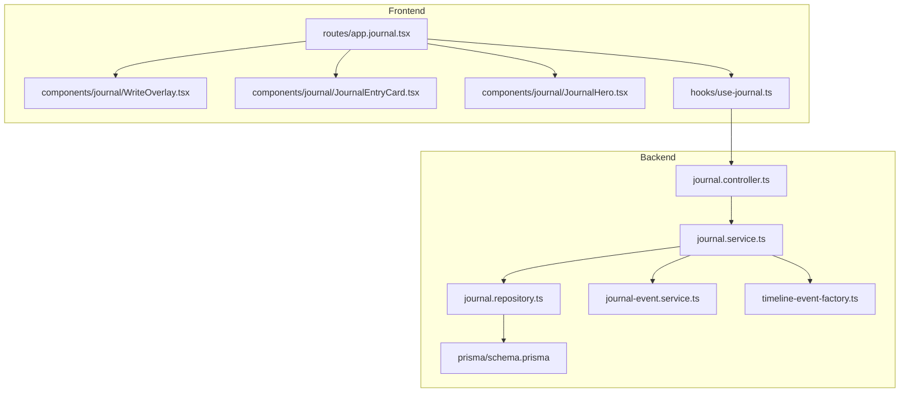
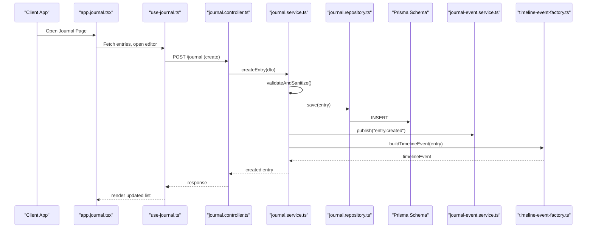
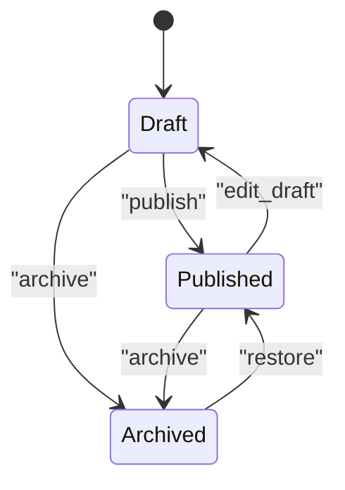
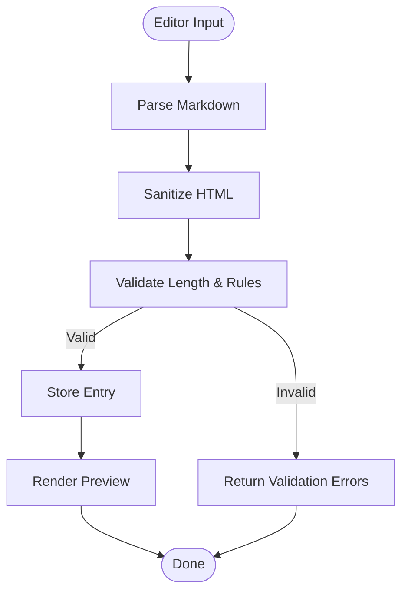
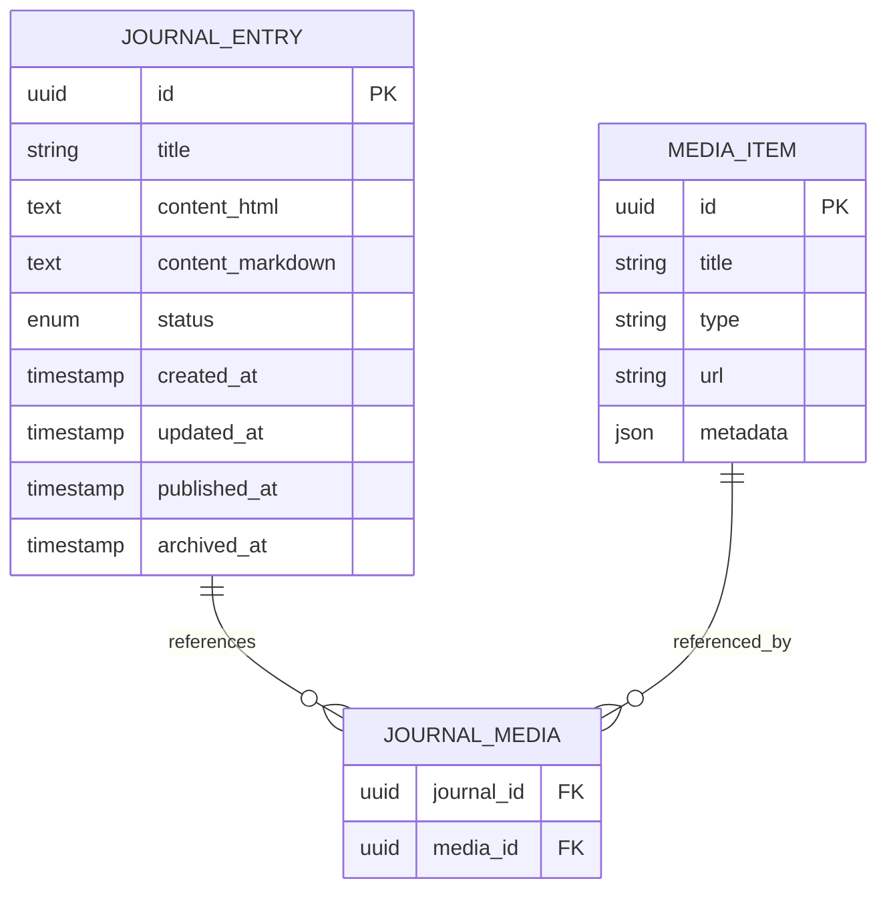
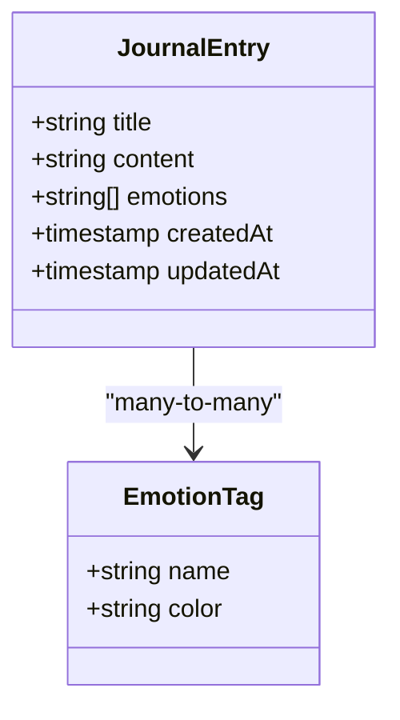
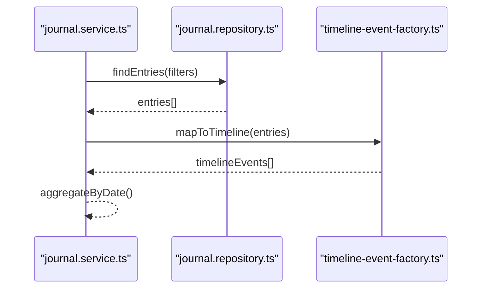
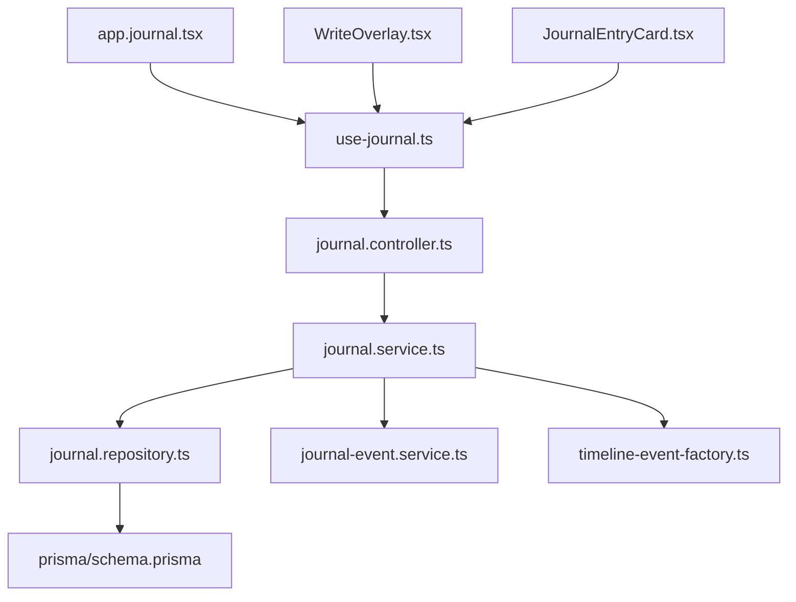

# Journal Entries & Rich Text Editing

<cite>
**Referenced Files in This Document**
- [journal.controller.ts](file://apps/backend/src/journal/journal.controller.ts)
- [journal.service.ts](file://apps/backend/src/journal/journal.service.ts)
- [journal.repository.ts](file://apps/backend/src/journal/journal.repository.ts)
- [journal.module.ts](file://apps/backend/src/journal/journal.module.ts)
- [journal-event.service.ts](file://apps/backend/src/journal/journal-event.service.ts)
- [timeline-event-factory.ts](file://apps/backend/src/journal/timeline-event-factory.ts)
- [prompt.service.ts](file://apps/backend/src/journal/prompt.service.ts)
- [schema.prisma](file://apps/backend/prisma/schema.prisma)
- [use-journal.ts](file://src/hooks/use-journal.ts)
- [JournalEntryCard.tsx](file://src/components/journal/JournalEntryCard.tsx)
- [WriteOverlay.tsx](file://src/components/journal/WriteOverlay.tsx)
- [JournalHero.tsx](file://src/components/journal/JournalHero.tsx)
- [Page.tsx](file://src/components/journal/Page.tsx)
- [app.journal.tsx](file://src/routes/app.journal.tsx)
</cite>

## Table of Contents
1. [Introduction](#introduction)
2. [Project Structure](#project-structure)
3. [Core Components](#core-components)
4. [Architecture Overview](#architecture-overview)
5. [Detailed Component Analysis](#detailed-component-analysis)
6. [Dependency Analysis](#dependency-analysis)
7. [Performance Considerations](#performance-considerations)
8. [Troubleshooting Guide](#troubleshooting-guide)
9. [Conclusion](#conclusion)
10. [Appendices](#appendices)

## Introduction
This document explains the journal entries system, focusing on rich text editing capabilities, markdown support, content structure, and the full lifecycle from creation to archival. It also covers validation rules, formatting options, storage mechanisms, relationships with media items and emotional states, and timeline positioning. Practical examples for creating, updating, and querying journal entries with metadata are included.

## Project Structure
The journal feature is implemented as a NestJS module on the backend and supported by React components and hooks on the frontend. The key backend files include controllers, services, repositories, event handling, and Prisma schema definitions. Frontend components provide the editor UI, entry cards, and page orchestration.

**Diagram sources**
- [journal.controller.ts](file://apps/backend/src/journal/journal.controller.ts)
- [journal.service.ts](file://apps/backend/src/journal/journal.service.ts)
- [journal.repository.ts](file://apps/backend/src/journal/journal.repository.ts)
- [journal-event.service.ts](file://apps/backend/src/journal/journal-event.service.ts)
- [timeline-event-factory.ts](file://apps/backend/src/journal/timeline-event-factory.ts)
- [schema.prisma](file://apps/backend/prisma/schema.prisma)
- [app.journal.tsx](file://src/routes/app.journal.tsx)
- [WriteOverlay.tsx](file://src/components/journal/WriteOverlay.tsx)
- [JournalEntryCard.tsx](file://src/components/journal/JournalEntryCard.tsx)
- [JournalHero.tsx](file://src/components/journal/JournalHero.tsx)
- [use-journal.ts](file://src/hooks/use-journal.ts)

**Section sources**
- [journal.controller.ts](file://apps/backend/src/journal/journal.controller.ts)
- [journal.service.ts](file://apps/backend/src/journal/journal.service.ts)
- [journal.repository.ts](file://apps/backend/src/journal/journal.repository.ts)
- [journal.module.ts](file://apps/backend/src/journal/journal.module.ts)
- [app.journal.tsx](file://src/routes/app.journal.tsx)
- [WriteOverlay.tsx](file://src/components/journal/WriteOverlay.tsx)
- [JournalEntryCard.tsx](file://src/components/journal/JournalEntryCard.tsx)
- [JournalHero.tsx](file://src/components/journal/JournalHero.tsx)
- [use-journal.ts](file://src/hooks/use-journal.ts)

## Core Components
- Backend Controller: Exposes REST endpoints for journal operations (create, update, delete, list, search).
- Service Layer: Orchestrates business logic, validates inputs, manages relationships with media and emotions, emits events, and coordinates timeline updates.
- Repository Layer: Persists data via Prisma, handles queries, transactions, and indexing.
- Event Service: Publishes domain events for auditability and downstream processing.
- Timeline Factory: Converts journal entries into timeline events for unified chronological views.
- Prompt Service: Provides writing prompts to assist users during composition.
- Frontend Editor: Rich text editor with markdown support, integrated into WriteOverlay and Page components.
- Hooks and Routes: use-journal hook encapsulates API calls; app.journal route orchestrates the journal page.

Key responsibilities:
- Validation and sanitization of rich text/markdown content.
- Association with media items and emotional state tags.
- Lifecycle transitions (draft → published → archived).
- Efficient querying and pagination for timelines and lists.

**Section sources**
- [journal.controller.ts](file://apps/backend/src/journal/journal.controller.ts)
- [journal.service.ts](file://apps/backend/src/journal/journal.service.ts)
- [journal.repository.ts](file://apps/backend/src/journal/journal.repository.ts)
- [journal-event.service.ts](file://apps/backend/src/journal/journal-event.service.ts)
- [timeline-event-factory.ts](file://apps/backend/src/journal/timeline-event-factory.ts)
- [prompt.service.ts](file://apps/backend/src/journal/prompt.service.ts)
- [use-journal.ts](file://src/hooks/use-journal.ts)
- [WriteOverlay.tsx](file://src/components/journal/WriteOverlay.tsx)
- [JournalEntryCard.tsx](file://src/components/journal/JournalEntryCard.tsx)
- [Page.tsx](file://src/components/journal/Page.tsx)
- [app.journal.tsx](file://src/routes/app.journal.tsx)

## Architecture Overview
The journal system follows a layered architecture:
- Presentation layer (React components and routes) renders the editor and displays entries.
- API layer (NestJS controller) receives requests, delegates to service.
- Business layer (service) enforces rules, composes operations, and emits events.
- Data layer (repository + Prisma) persists entities and relationships.
- Cross-cutting concerns include event publishing, timeline generation, and prompt assistance.

**Diagram sources**
- [app.journal.tsx](file://src/routes/app.journal.tsx)
- [use-journal.ts](file://src/hooks/use-journal.ts)
- [journal.controller.ts](file://apps/backend/src/journal/journal.controller.ts)
- [journal.service.ts](file://apps/backend/src/journal/journal.service.ts)
- [journal.repository.ts](file://apps/backend/src/journal/journal.repository.ts)
- [journal-event.service.ts](file://apps/backend/src/journal/journal-event.service.ts)
- [timeline-event-factory.ts](file://apps/backend/src/journal/timeline-event-factory.ts)
- [schema.prisma](file://apps/backend/prisma/schema.prisma)

## Detailed Component Analysis

### Journal Entry Model and Lifecycle
- Lifecycle states: draft, published, archived.
- Transitions:
  - Create: draft → published or draft only.
  - Update: modify content, metadata, associations.
  - Archive: published → archived.
- Validation:
  - Content length limits and allowed markdown syntax.
  - Required fields for title and timestamp.
  - Optional associations: media IDs, emotion tags.
- Storage:
  - Rich text stored as sanitized HTML or structured JSON depending on implementation.
  - Markdown preserved for export and rendering pipeline.
- Relationships:
  - Many-to-many with media items.
  - One-to-many with emotion tags.
- Timeline positioning:
  - Entries appear in chronological order based on timestamps.
  - Timeline events generated upon creation/update.

**Diagram sources**
- [schema.prisma](file://apps/backend/prisma/schema.prisma)
- [journal.service.ts](file://apps/backend/src/journal/journal.service.ts)

**Section sources**
- [journal.service.ts](file://apps/backend/src/journal/journal.service.ts)
- [journal.repository.ts](file://apps/backend/src/journal/journal.repository.ts)
- [schema.prisma](file://apps/backend/prisma/schema.prisma)

### Rich Text Editing and Markdown Support
- Editor features:
  - Inline formatting (bold, italic, code).
  - Block elements (headings, lists, quotes).
  - Links and embedded media references.
  - Markdown parsing and preview.
- Sanitization:
  - Strip unsafe HTML tags and attributes.
  - Normalize whitespace and line breaks.
- Rendering:
  - Convert markdown to HTML for display.
  - Preserve structure for search indexing.

**Diagram sources**
- [WriteOverlay.tsx](file://src/components/journal/WriteOverlay.tsx)
- [journal.service.ts](file://apps/backend/src/journal/journal.service.ts)

**Section sources**
- [WriteOverlay.tsx](file://src/components/journal/WriteOverlay.tsx)
- [Page.tsx](file://src/components/journal/Page.tsx)
- [journal.service.ts](file://apps/backend/src/journal/journal.service.ts)

### Media Items Relationship
- Associations:
  - Journal entries can reference multiple media items.
  - Media metadata (title, type, URL) is linked but not duplicated.
- Operations:
  - Attach/detach media during entry creation/update.
  - Cascade behavior defined in schema for integrity.
- Display:
  - Media thumbnails and links shown within entry previews.

**Diagram sources**
- [schema.prisma](file://apps/backend/prisma/schema.prisma)

**Section sources**
- [journal.service.ts](file://apps/backend/src/journal/journal.service.ts)
- [journal.repository.ts](file://apps/backend/src/journal/journal.repository.ts)
- [schema.prisma](file://apps/backend/prisma/schema.prisma)

### Emotional State Associations
- Emotion tagging:
  - Entries can be tagged with one or more emotions.
  - Emotions enable mood analytics and filtering.
- Integration:
  - Emotion selection UI in editor.
  - Stored alongside entry metadata.

**Diagram sources**
- [schema.prisma](file://apps/backend/prisma/schema.prisma)

**Section sources**
- [journal.service.ts](file://apps/backend/src/journal/journal.service.ts)
- [schema.prisma](file://apps/backend/prisma/schema.prisma)

### Timeline Positioning
- Chronological ordering:
  - Entries sorted by published_at or created_at.
  - Filters for date ranges and statuses.
- Timeline events:
  - Generated when entries change state or content significantly.
  - Unified view across media and journal activities.

**Diagram sources**
- [journal.service.ts](file://apps/backend/src/journal/journal.service.ts)
- [journal.repository.ts](file://apps/backend/src/journal/journal.repository.ts)
- [timeline-event-factory.ts](file://apps/backend/src/journal/timeline-event-factory.ts)

**Section sources**
- [journal.service.ts](file://apps/backend/src/journal/journal.service.ts)
- [timeline-event-factory.ts](file://apps/backend/src/journal/timeline-event-factory.ts)

### Creating, Updating, and Querying Journal Entries
- Create:
  - Submit title, content (markdown), optional media IDs, emotion tags.
  - Returns created entry with status draft or published.
- Update:
  - Modify content, associations, and status transitions.
  - Validates changes and re-generates timeline events if needed.
- Query:
  - List entries with pagination, sorting, and filters.
  - Search by title, content snippets, tags, and dates.

Examples:
- Create entry:
  - Endpoint: POST /journal
  - Payload: { title, content_markdown, media_ids[], emotions[] }
  - Response: { id, title, status, created_at }
- Update entry:
  - Endpoint: PATCH /journal/:id
  - Payload: { title?, content_markdown?, media_ids?[], emotions?[], status? }
  - Response: { id, title, status, updated_at }
- Query entries:
  - Endpoint: GET /journal?status=published&date_from=...&date_to=...
  - Response: { entries[], total, page, per_page }

**Section sources**
- [journal.controller.ts](file://apps/backend/src/journal/journal.controller.ts)
- [journal.service.ts](file://apps/backend/src/journal/journal.service.ts)
- [journal.repository.ts](file://apps/backend/src/journal/journal.repository.ts)

## Dependency Analysis
The journal module depends on core services for events, timeline generation, and database access. Frontend components depend on the use-journal hook for API interactions.

**Diagram sources**
- [journal.controller.ts](file://apps/backend/src/journal/journal.controller.ts)
- [journal.service.ts](file://apps/backend/src/journal/journal.service.ts)
- [journal.repository.ts](file://apps/backend/src/journal/journal.repository.ts)
- [journal-event.service.ts](file://apps/backend/src/journal/journal-event.service.ts)
- [timeline-event-factory.ts](file://apps/backend/src/journal/timeline-event-factory.ts)
- [schema.prisma](file://apps/backend/prisma/schema.prisma)
- [use-journal.ts](file://src/hooks/use-journal.ts)
- [app.journal.tsx](file://src/routes/app.journal.tsx)
- [WriteOverlay.tsx](file://src/components/journal/WriteOverlay.tsx)
- [JournalEntryCard.tsx](file://src/components/journal/JournalEntryCard.tsx)

**Section sources**
- [journal.module.ts](file://apps/backend/src/journal/journal.module.ts)
- [journal.controller.ts](file://apps/backend/src/journal/journal.controller.ts)
- [journal.service.ts](file://apps/backend/src/journal/journal.service.ts)
- [journal.repository.ts](file://apps/backend/src/journal/journal.repository.ts)
- [journal-event.service.ts](file://apps/backend/src/journal/journal-event.service.ts)
- [timeline-event-factory.ts](file://apps/backend/src/journal/timeline-event-factory.ts)
- [schema.prisma](file://apps/backend/prisma/schema.prisma)
- [use-journal.ts](file://src/hooks/use-journal.ts)
- [app.journal.tsx](file://src/routes/app.journal.tsx)
- [WriteOverlay.tsx](file://src/components/journal/WriteOverlay.tsx)
- [JournalEntryCard.tsx](file://src/components/journal/JournalEntryCard.tsx)

## Performance Considerations
- Indexing:
  - Add indexes on frequently queried fields (status, created_at, published_at).
- Pagination:
  - Use cursor-based pagination for large datasets.
- Caching:
  - Cache timeline events and popular queries.
- Sanitization:
  - Optimize markdown parsing and HTML sanitization pipelines.
- Transactions:
  - Group related writes to ensure consistency and reduce lock contention.

[No sources needed since this section provides general guidance]

## Troubleshooting Guide
Common issues and resolutions:
- Validation errors:
  - Ensure content length and required fields are met.
  - Check markdown syntax and allowed tags.
- Media association failures:
  - Verify media IDs exist and permissions allow linking.
- Timeline inconsistencies:
  - Rebuild timeline events after bulk updates.
- Performance bottlenecks:
  - Profile slow queries and add appropriate indexes.
- Event delivery:
  - Monitor event queues and retry failed deliveries.

**Section sources**
- [journal.service.ts](file://apps/backend/src/journal/journal.service.ts)
- [journal.repository.ts](file://apps/backend/src/journal/journal.repository.ts)
- [journal-event.service.ts](file://apps/backend/src/journal/journal-event.service.ts)

## Conclusion
The journal entries system provides a robust platform for rich text editing with markdown support, comprehensive lifecycle management, and strong integration with media and emotional states. Its layered architecture ensures scalability, maintainability, and performance. Proper validation, sanitization, and indexing contribute to reliability and user experience.

[No sources needed since this section summarizes without analyzing specific files]

## Appendices

### Example Workflows
- Create a new journal entry:
  - Open WriteOverlay, compose content, attach media, select emotions, publish.
- Update an existing entry:
  - Edit content, adjust associations, transition status if needed.
- Query entries for timeline:
  - Filter by date range and status, paginate results, render timeline.

[No sources needed since this section provides conceptual guidance]