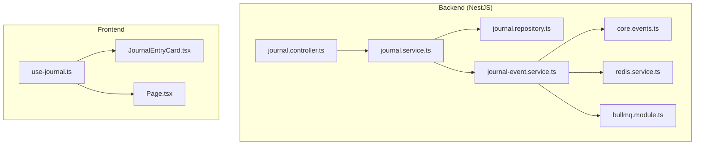
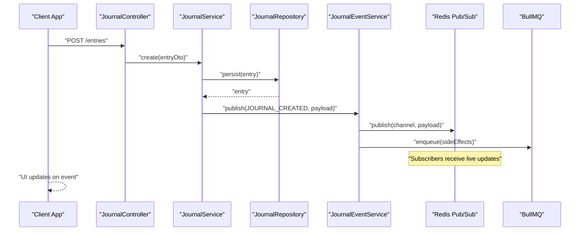
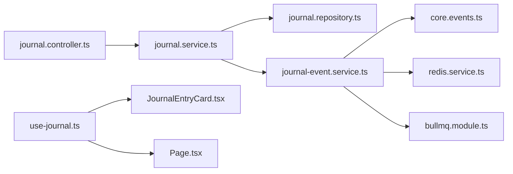

# Journal Events & Real-time Updates

<cite>
**Referenced Files in This Document**
- [journal-event.service.ts](file://apps/backend/src/journal/journal-event.service.ts)
- [journal.controller.ts](file://apps/backend/src/journal/journal.controller.ts)
- [journal.service.ts](file://apps/backend/src/journal/journal.service.ts)
- [journal.repository.ts](file://apps/backend/src/journal/journal.repository.ts)
- [journal.module.ts](file://apps/backend/src/journal/journal.module.ts)
- [core.events.ts](file://apps/backend/src/core/events/index.ts)
- [redis.service.ts](file://apps/backend/src/redis/redis.service.ts)
- [bullmq.module.ts](file://apps/backend/src/bullmq/bullmq.module.ts)
- [use-journal.ts](file://src/hooks/use-journal.ts)
- [JournalEntryCard.tsx](file://src/components/journal/JournalEntryCard.tsx)
- [Page.tsx](file://src/components/journal/Page.tsx)
</cite>

## Table of Contents
1. [Introduction](#introduction)
2. [Project Structure](#project-structure)
3. [Core Components](#core-components)
4. [Architecture Overview](#architecture-overview)
5. [Detailed Component Analysis](#detailed-component-analysis)
6. [Dependency Analysis](#dependency-analysis)
7. [Performance Considerations](#performance-considerations)
8. [Troubleshooting Guide](#troubleshooting-guide)
9. [Conclusion](#conclusion)
10. [Appendices](#appendices)

## Introduction
This document explains the journal event system and real-time updates for journal modifications, including creation, updates, deletions, and emotional state changes. It covers the event-driven architecture, publishing mechanism, subscriber patterns, WebSocket integration, payload structure, error handling strategies, and performance considerations for high-frequency updates. It also provides examples for subscribing to journal events and implementing real-time UI updates.

## Project Structure
The journal feature is implemented as a NestJS module with dedicated service, controller, repository, and event service layers. The core eventing infrastructure lives under the core module, while Redis and BullMQ modules provide pub/sub and background processing capabilities. On the frontend, hooks and components consume real-time updates to keep the UI consistent.

**Diagram sources**
- [journal.controller.ts](file://apps/backend/src/journal/journal.controller.ts)
- [journal.service.ts](file://apps/backend/src/journal/journal.service.ts)
- [journal.repository.ts](file://apps/backend/src/journal/journal.repository.ts)
- [journal-event.service.ts](file://apps/backend/src/journal/journal-event.service.ts)
- [core.events.ts](file://apps/backend/src/core/events/index.ts)
- [redis.service.ts](file://apps/backend/src/redis/redis.service.ts)
- [bullmq.module.ts](file://apps/backend/src/bullmq/bullmq.module.ts)
- [use-journal.ts](file://src/hooks/use-journal.ts)
- [JournalEntryCard.tsx](file://src/components/journal/JournalEntryCard.tsx)
- [Page.tsx](file://src/components/journal/Page.tsx)

**Section sources**
- [journal.module.ts](file://apps/backend/src/journal/journal.module.ts)
- [journal.controller.ts](file://apps/backend/src/journal/journal.controller.ts)
- [journal.service.ts](file://apps/backend/src/journal/journal.service.ts)
- [journal-event.service.ts](file://apps/backend/src/journal/journal-event.service.ts)
- [core.events.ts](file://apps/backend/src/core/events/index.ts)
- [redis.service.ts](file://apps/backend/src/redis/redis.service.ts)
- [bullmq.module.ts](file://apps/backend/src/bullmq/bullmq.module.ts)
- [use-journal.ts](file://src/hooks/use-journal.ts)
- [JournalEntryCard.tsx](file://src/components/journal/JournalEntryCard.tsx)
- [Page.tsx](file://src/components/journal/Page.tsx)

## Core Components
- Journal Controller: Exposes REST endpoints for creating, updating, and deleting journal entries and emotional states.
- Journal Service: Orchestrates business logic, persists data via the repository, and publishes domain events after mutations.
- Journal Repository: Data access layer for journal entities.
- Journal Event Service: Centralized publisher for journal-related events; integrates with Redis pub/sub and optional message queues.
- Core Events: Shared event definitions and utilities used across the application.
- Redis Service: Pub/Sub channel management for real-time broadcasting.
- BullMQ Module: Background job queue integration for offloading heavy or non-critical work.
- Frontend Hook and Components: Subscribe to events and update UI reactively.

**Section sources**
- [journal.controller.ts](file://apps/backend/src/journal/journal.controller.ts)
- [journal.service.ts](file://apps/backend/src/journal/journal.service.ts)
- [journal.repository.ts](file://apps/backend/src/journal/journal.repository.ts)
- [journal-event.service.ts](file://apps/backend/src/journal/journal-event.service.ts)
- [core.events.ts](file://apps/backend/src/core/events/index.ts)
- [redis.service.ts](file://apps/backend/src/redis/redis.service.ts)
- [bullmq.module.ts](file://apps/backend/src/bullmq/bullmq.module.ts)
- [use-journal.ts](file://src/hooks/use-journal.ts)
- [JournalEntryCard.tsx](file://src/components/journal/JournalEntryCard.tsx)
- [Page.tsx](file://src/components/journal/Page.tsx)

## Architecture Overview
The journal event system follows an event-driven pattern:
- Controllers accept requests and delegate to services.
- Services perform persistence and then publish domain events.
- The event service uses Redis pub/sub to broadcast events to subscribers.
- Optional background jobs can be enqueued for side effects.
- Frontend subscribes to channels and updates local state and UI.

**Diagram sources**
- [journal.controller.ts](file://apps/backend/src/journal/journal.controller.ts)
- [journal.service.ts](file://apps/backend/src/journal/journal.service.ts)
- [journal.repository.ts](file://apps/backend/src/journal/journal.repository.ts)
- [journal-event.service.ts](file://apps/backend/src/journal/journal-event.service.ts)
- [redis.service.ts](file://apps/backend/src/redis/redis.service.ts)
- [bullmq.module.ts](file://apps/backend/src/bullmq/bullmq.module.ts)

## Detailed Component Analysis

### Journal Controller
- Responsibilities:
  - Define REST endpoints for journal entry CRUD and emotional state operations.
  - Validate inputs and map DTOs to service calls.
  - Return standardized responses and handle errors at the boundary.

- Key behaviors:
  - Create entry: validates payload, delegates to service, returns created resource.
  - Update entry: supports partial updates and optimistic concurrency if applicable.
  - Delete entry: removes entry and triggers deletion event.
  - Emotional state: records mood/emotion linked to an entry or timeline.

**Section sources**
- [journal.controller.ts](file://apps/backend/src/journal/journal.controller.ts)

### Journal Service
- Responsibilities:
  - Orchestrate journal operations and enforce business rules.
  - Persist changes through the repository.
  - Publish events after successful mutations.
  - Coordinate with background tasks for non-blocking side effects.

- Event publishing:
  - After create/update/delete/state change, publish corresponding domain events with enriched payloads.
  - Ensure idempotency where needed to avoid duplicate processing.

**Section sources**
- [journal.service.ts](file://apps/backend/src/journal/journal.service.ts)

### Journal Repository
- Responsibilities:
  - Provide data access methods for journal entries and related entities.
  - Handle transactions and query optimizations.
  - Map between domain models and persistence schema.

**Section sources**
- [journal.repository.ts](file://apps/backend/src/journal/journal.repository.ts)

### Journal Event Service
- Responsibilities:
  - Centralize event publishing for all journal-related actions.
  - Serialize payloads consistently and attach metadata (e.g., userId, timestamp).
  - Integrate with Redis pub/sub for real-time distribution.
  - Optionally enqueue background jobs for analytics, notifications, or indexing.

- Subscriber patterns:
  - Channels are scoped by user or global scope depending on visibility.
  - Subscribers can filter by event type and entity IDs.

**Section sources**
- [journal-event.service.ts](file://apps/backend/src/journal/journal-event.service.ts)
- [core.events.ts](file://apps/backend/src/core/events/index.ts)
- [redis.service.ts](file://apps/backend/src/redis/redis.service.ts)
- [bullmq.module.ts](file://apps/backend/src/bullmq/bullmq.module.ts)

### Frontend Integration
- use-journal hook:
  - Establishes connection to real-time channels.
  - Subscribes to journal events and updates local store/state.
  - Provides helpers to dispatch optimistic updates and reconcile server state.

- Components:
  - JournalEntryCard: reacts to event updates to reflect changes without full reload.
  - Page: manages subscriptions and orchestrates UI transitions based on events.

**Section sources**
- [use-journal.ts](file://src/hooks/use-journal.ts)
- [JournalEntryCard.tsx](file://src/components/journal/JournalEntryCard.tsx)
- [Page.tsx](file://src/components/journal/Page.tsx)

## Dependency Analysis
The journal module depends on core eventing, Redis for pub/sub, and optionally BullMQ for background processing. The frontend depends on the hook for real-time subscription and components for rendering.

**Diagram sources**
- [journal.controller.ts](file://apps/backend/src/journal/journal.controller.ts)
- [journal.service.ts](file://apps/backend/src/journal/journal.service.ts)
- [journal.repository.ts](file://apps/backend/src/journal/journal.repository.ts)
- [journal-event.service.ts](file://apps/backend/src/journal/journal-event.service.ts)
- [core.events.ts](file://apps/backend/src/core/events/index.ts)
- [redis.service.ts](file://apps/backend/src/redis/redis.service.ts)
- [bullmq.module.ts](file://apps/backend/src/bullmq/bullmq.module.ts)
- [use-journal.ts](file://src/hooks/use-journal.ts)
- [JournalEntryCard.tsx](file://src/components/journal/JournalEntryCard.tsx)
- [Page.tsx](file://src/components/journal/Page.tsx)

**Section sources**
- [journal.module.ts](file://apps/backend/src/journal/journal.module.ts)

## Performance Considerations
- Event batching:
  - Coalesce multiple rapid updates into a single event when appropriate to reduce network overhead.
- Channel scoping:
  - Use per-user channels to limit fan-out and memory usage.
- Backpressure:
  - Implement rate limiting and throttling on publishers and subscribers.
- Idempotency:
  - Deduplicate events using correlation IDs to prevent duplicate UI updates.
- Optimistic UI:
  - Apply immediate client-side updates and reconcile with server state upon confirmation.
- Background processing:
  - Offload heavy tasks (analytics, notifications) to queues to keep request latency low.
- Connection resilience:
  - Reconnect with exponential backoff and maintain message ordering where required.

[No sources needed since this section provides general guidance]

## Troubleshooting Guide
- Missing events:
  - Verify Redis connectivity and channel names.
  - Check that the event service publishes after successful persistence.
- Duplicate updates:
  - Ensure idempotency keys are included and handled by subscribers.
- High CPU/memory:
  - Inspect event volume and consider batching or filtering.
- UI desynchronization:
  - Compare client optimistic state with server response; implement reconciliation logic.
- Queue failures:
  - Monitor BullMQ worker health and retry policies.

**Section sources**
- [journal-event.service.ts](file://apps/backend/src/journal/journal-event.service.ts)
- [redis.service.ts](file://apps/backend/src/redis/redis.service.ts)
- [bullmq.module.ts](file://apps/backend/src/bullmq/bullmq.module.ts)
- [use-journal.ts](file://src/hooks/use-journal.ts)

## Conclusion
The journal event system provides a robust, scalable foundation for real-time updates. By decoupling controllers, services, and repositories from event distribution, it enables flexible subscribers and resilient scaling. Proper payload design, idempotency, and performance tuning ensure smooth high-frequency updates and responsive UIs.

[No sources needed since this section summarizes without analyzing specific files]

## Appendices

### Event Payload Structure
- Common fields:
  - eventType: string identifying the action (e.g., JOURNAL_ENTRY_CREATED, JOURNAL_ENTRY_UPDATED, JOURNAL_ENTRY_DELETED, EMOTION_STATE_CHANGED).
  - entityId: unique identifier of the affected journal entry.
  - userId: owner of the entry.
  - timestamp: ISO timestamp of the event.
  - payload: operation-specific data (e.g., updated fields, emotion values).
- Example categories:
  - Creation: includes initial content and metadata.
  - Update: includes diff or full updated object.
  - Deletion: includes only identifiers and timestamps.
  - Emotional state: includes emotion label/value and associated entry ID.

[No sources needed since this section describes conceptual payload structure]

### WebSocket Integration Pattern
- Server:
  - Maintain per-user channels and broadcast events via Redis pub/sub.
  - Authenticate connections and authorize channel access.
- Client:
  - Connect to WebSocket endpoint, subscribe to relevant channels.
  - Handle reconnection and message ordering.
  - Update local state and trigger UI refreshes.

[No sources needed since this section outlines conceptual integration]

### Examples: Subscribing to Journal Events and Updating UI
- Subscribe to creation and update events:
  - Listen for JOURNAL_ENTRY_CREATED and JOURNAL_ENTRY_UPDATED.
  - Insert new items or merge updates into local collections.
- Handle deletions:
  - Remove entries by entityId from local state.
- React to emotional state changes:
  - Update mood indicators and charts based on EMOTION_STATE_CHANGED events.
- Optimistic updates:
  - Immediately reflect user actions locally and reconcile on confirmation.

[No sources needed since this section provides conceptual examples]