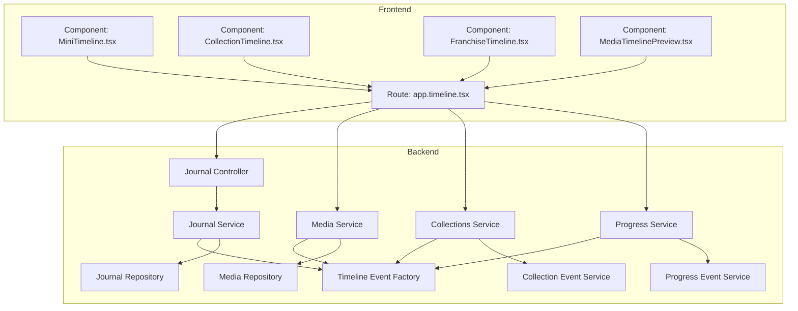
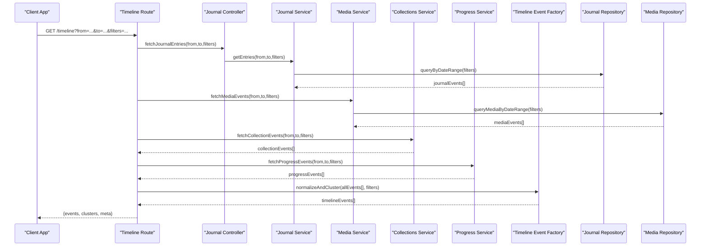
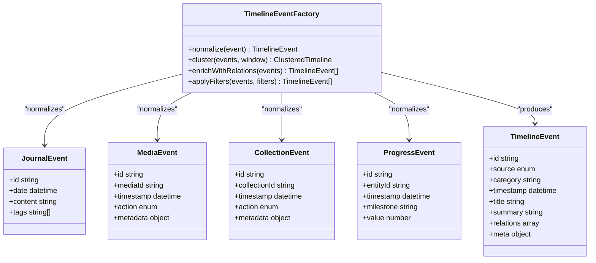
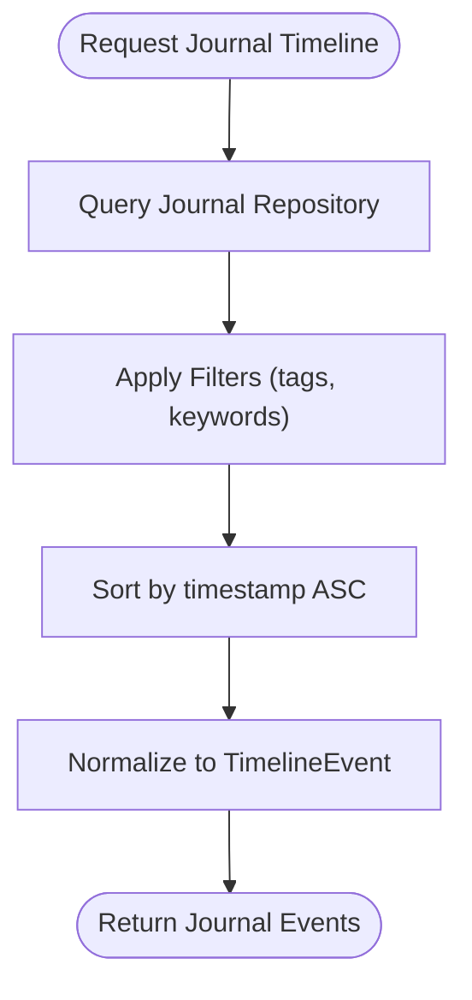
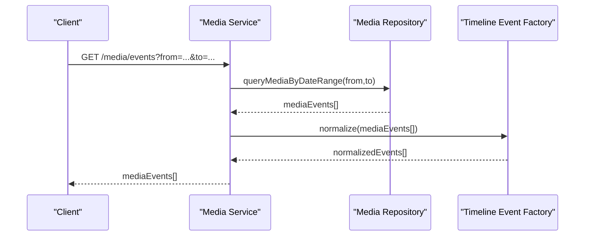
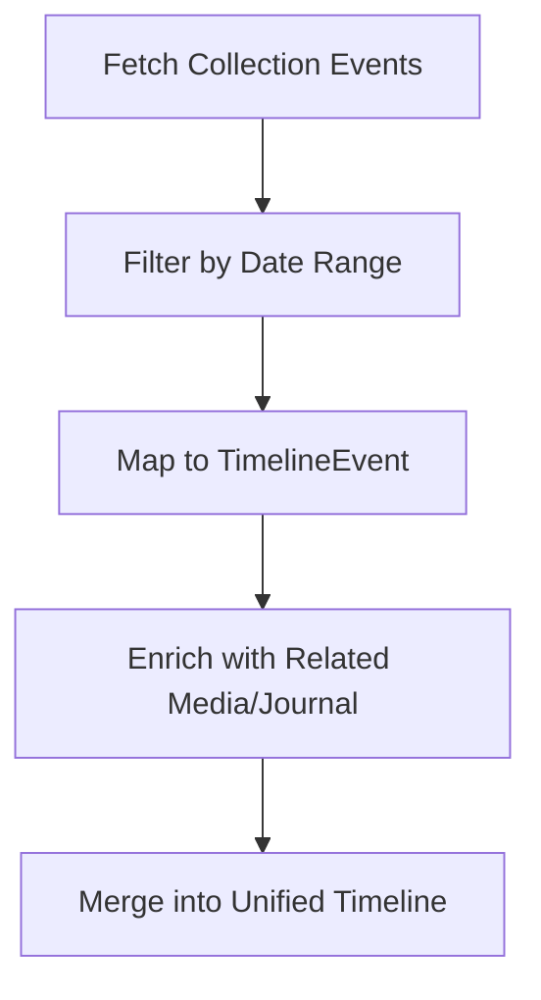
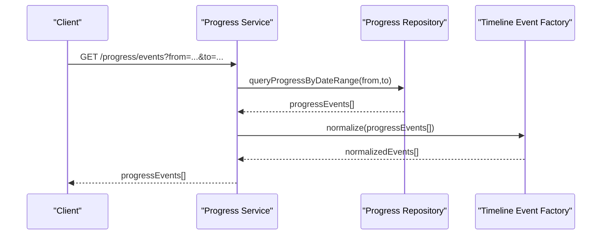
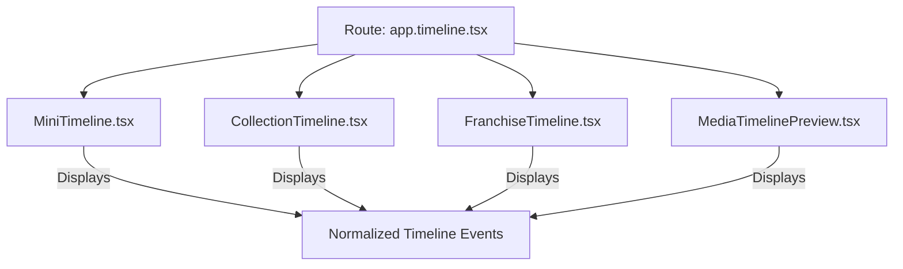
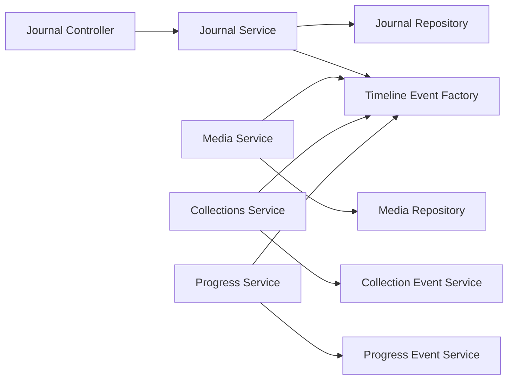
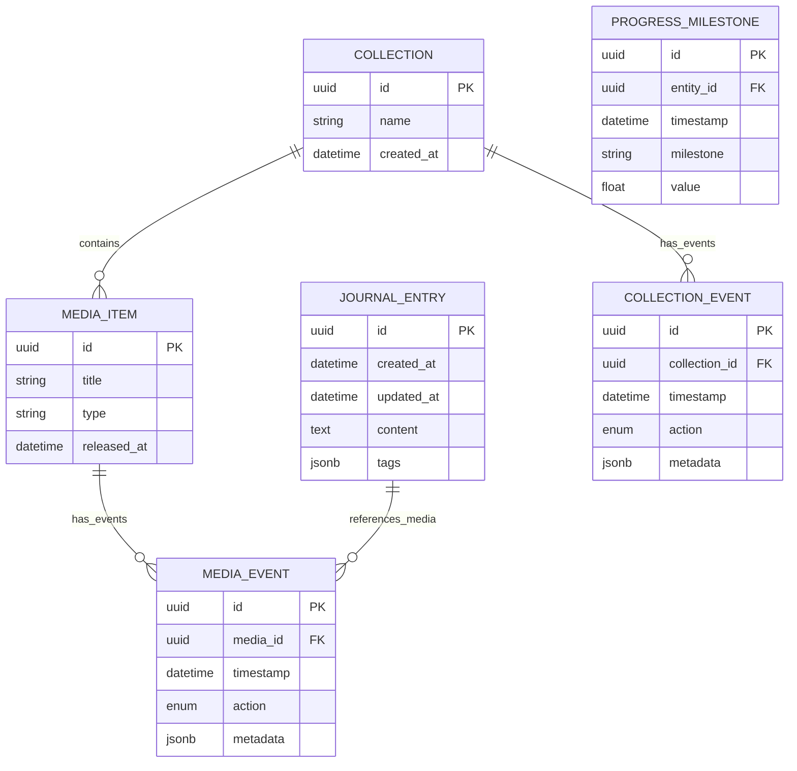

# Timeline Generation & Memory Organization

<cite>
**Referenced Files in This Document**
- [timeline-event-factory.ts](file://apps/backend/src/journal/timeline-event-factory.ts)
- [journal.service.ts](file://apps/backend/src/journal/journal.service.ts)
- [journal.controller.ts](file://apps/backend/src/journal/journal.controller.ts)
- [journal.repository.ts](file://apps/backend/src/journal/journal.repository.ts)
- [media.service.ts](file://apps/backend/src/media/media.service.ts)
- [media.repository.ts](file://apps/backend/src/media/media.repository.ts)
- [collections.service.ts](file://apps/backend/src/collections/collections.service.ts)
- [collection-event.service.ts](file://apps/backend/src/collections/collection-event.service.ts)
- [progress.service.ts](file://apps/backend/src/progress/progress.service.ts)
- [progress-event.service.ts](file://apps/backend/src/progress/progress-event.service.ts)
- [app.timeline.tsx](file://src/routes/app.timeline.tsx)
- [MiniTimeline.tsx](file://src/components/dashboard/MiniTimeline.tsx)
- [CollectionTimeline.tsx](file://src/components/collections/CollectionTimeline.tsx)
- [FranchiseTimeline.tsx](file://src/components/franchise/FranchiseTimeline.tsx)
- [MediaTimelinePreview.tsx](file://src/components/media-detail/MediaTimelinePreview.tsx)
- [schema.prisma](file://apps/backend/prisma/schema.prisma)
</cite>

## Table of Contents
1. [Introduction](#introduction)
2. [Project Structure](#project-structure)
3. [Core Components](#core-components)
4. [Architecture Overview](#architecture-overview)
5. [Detailed Component Analysis](#detailed-component-analysis)
6. [Dependency Analysis](#dependency-analysis)
7. [Performance Considerations](#performance-considerations)
8. [Troubleshooting Guide](#troubleshooting-guide)
9. [Conclusion](#conclusion)
10. [Appendices](#appendices)

## Introduction
This document explains how the system generates interactive timelines by organizing journal entries, media events, and life milestones into a unified chronological view. It covers the timeline event factory pattern, date-based clustering strategies, visual representation approaches, and the relationship mapping between memories, media items, and life events. It also provides examples of timeline queries, filtering options, and customization features used across the application.

## Project Structure
The timeline feature spans both backend services (NestJS modules) and frontend components (React). The backend is responsible for aggregating data from multiple domains (journal, media, collections, progress), while the frontend renders interactive timelines with filtering and customization.

**Diagram sources**
- [journal.controller.ts](file://apps/backend/src/journal/journal.controller.ts)
- [journal.service.ts](file://apps/backend/src/journal/journal.service.ts)
- [journal.repository.ts](file://apps/backend/src/journal/journal.repository.ts)
- [media.service.ts](file://apps/backend/src/media/media.service.ts)
- [media.repository.ts](file://apps/backend/src/media/media.repository.ts)
- [collections.service.ts](file://apps/backend/src/collections/collections.service.ts)
- [collection-event.service.ts](file://apps/backend/src/collections/collection-event.service.ts)
- [progress.service.ts](file://apps/backend/src/progress/progress.service.ts)
- [progress-event.service.ts](file://apps/backend/src/progress/progress-event.service.ts)
- [timeline-event-factory.ts](file://apps/backend/src/journal/timeline-event-factory.ts)
- [app.timeline.tsx](file://src/routes/app.timeline.tsx)
- [MiniTimeline.tsx](file://src/components/dashboard/MiniTimeline.tsx)
- [CollectionTimeline.tsx](file://src/components/collections/CollectionTimeline.tsx)
- [FranchiseTimeline.tsx](file://src/components/franchise/FranchiseTimeline.tsx)
- [MediaTimelinePreview.tsx](file://src/components/media-detail/MediaTimelinePreview.tsx)

**Section sources**
- [journal.controller.ts](file://apps/backend/src/journal/journal.controller.ts)
- [journal.service.ts](file://apps/backend/src/journal/journal.service.ts)
- [media.service.ts](file://apps/backend/src/media/media.service.ts)
- [collections.service.ts](file://apps/backend/src/collections/collections.service.ts)
- [progress.service.ts](file://apps/backend/src/progress/progress.service.ts)
- [timeline-event-factory.ts](file://apps/backend/src/journal/timeline-event-factory.ts)
- [app.timeline.tsx](file://src/routes/app.timeline.tsx)
- [MiniTimeline.tsx](file://src/components/dashboard/MiniTimeline.tsx)
- [CollectionTimeline.tsx](file://src/components/collections/CollectionTimeline.tsx)
- [FranchiseTimeline.tsx](file://src/components/franchise/FranchiseTimeline.tsx)
- [MediaTimelinePreview.tsx](file://src/components/media-detail/MediaTimelinePreview.tsx)

## Core Components
- Journal domain: Provides user-written entries with timestamps that anchor personal reflections to specific dates.
- Media domain: Tracks media consumption events (start, pause, resume, complete) with precise timestamps.
- Collections domain: Groups related media and notes into collections; collection-level events can be surfaced on timelines.
- Progress domain: Captures learning or reading progress milestones that enrich the timeline narrative.
- Timeline Event Factory: Normalizes heterogeneous events into a unified timeline event model, enabling consistent sorting, clustering, and rendering.

Key responsibilities:
- Aggregation: Pulls events from journal, media, collections, and progress services.
- Normalization: Converts diverse event types into a common schema with stable identifiers, timestamps, categories, and metadata.
- Clustering: Groups nearby events by date windows (e.g., daily, weekly) to reduce noise and improve readability.
- Enrichment: Adds contextual labels and relationships (e.g., linking a journal entry to a media item).

**Section sources**
- [journal.service.ts](file://apps/backend/src/journal/journal.service.ts)
- [media.service.ts](file://apps/backend/src/media/media.service.ts)
- [collections.service.ts](file://apps/backend/src/collections/collections.service.ts)
- [progress.service.ts](file://apps/backend/src/progress/progress.service.ts)
- [timeline-event-factory.ts](file://apps/backend/src/journal/timeline-event-factory.ts)

## Architecture Overview
The timeline pipeline follows a clear separation of concerns: controllers expose endpoints, services orchestrate domain logic, repositories access persistence, and a factory normalizes events for presentation.

**Diagram sources**
- [journal.controller.ts](file://apps/backend/src/journal/journal.controller.ts)
- [journal.service.ts](file://apps/backend/src/journal/journal.service.ts)
- [journal.repository.ts](file://apps/backend/src/journal/journal.repository.ts)
- [media.service.ts](file://apps/backend/src/media/media.service.ts)
- [media.repository.ts](file://apps/backend/src/media/media.repository.ts)
- [collections.service.ts](file://apps/backend/src/collections/collections.service.ts)
- [progress.service.ts](file://apps/backend/src/progress/progress.service.ts)
- [timeline-event-factory.ts](file://apps/backend/src/journal/timeline-event-factory.ts)
- [app.timeline.tsx](file://src/routes/app.timeline.tsx)

## Detailed Component Analysis

### Timeline Event Factory Pattern
The factory centralizes normalization and clustering, ensuring all event sources conform to a shared structure. It supports:
- Type discrimination: Identifies event source (journal, media, collection, progress).
- Timestamp canonicalization: Ensures consistent timezone handling and precision.
- Category tagging: Assigns semantic categories for filtering and visualization.
- Relationship mapping: Links related entities (e.g., a journal entry referencing a media item).
- Date-based clustering: Groups events within configurable time windows.

**Diagram sources**
- [timeline-event-factory.ts](file://apps/backend/src/journal/timeline-event-factory.ts)

**Section sources**
- [timeline-event-factory.ts](file://apps/backend/src/journal/timeline-event-factory.ts)

### Journal Entries Chronology
Journal entries are anchored to creation or modification timestamps. The service retrieves entries within a date range, applies filters (tags, keywords), and returns them sorted chronologically. Entries may include references to media items, which are later linked during enrichment.

**Diagram sources**
- [journal.service.ts](file://apps/backend/src/journal/journal.service.ts)
- [journal.repository.ts](file://apps/backend/src/journal/journal.repository.ts)

**Section sources**
- [journal.service.ts](file://apps/backend/src/journal/journal.service.ts)
- [journal.repository.ts](file://apps/backend/src/journal/journal.repository.ts)

### Media Events Integration
Media events capture lifecycle actions (start, pause, resume, complete) with precise timestamps. These events are merged with journal entries based on temporal proximity and optional explicit relationships (e.g., a journal entry explicitly referencing a media item).

**Diagram sources**
- [media.service.ts](file://apps/backend/src/media/media.service.ts)
- [media.repository.ts](file://apps/backend/src/media/media.repository.ts)
- [timeline-event-factory.ts](file://apps/backend/src/journal/timeline-event-factory.ts)

**Section sources**
- [media.service.ts](file://apps/backend/src/media/media.service.ts)
- [media.repository.ts](file://apps/backend/src/media/media.repository.ts)

### Collections and Life Events
Collections group related media and notes. Collection-level events (creation, updates, milestones) are surfaced alongside journal and media events to provide context-rich timelines.

**Diagram sources**
- [collections.service.ts](file://apps/backend/src/collections/collections.service.ts)
- [collection-event.service.ts](file://apps/backend/src/collections/collection-event.service.ts)
- [timeline-event-factory.ts](file://apps/backend/src/journal/timeline-event-factory.ts)

**Section sources**
- [collections.service.ts](file://apps/backend/src/collections/collections.service.ts)
- [collection-event.service.ts](file://apps/backend/src/collections/collection-event.service.ts)

### Progress Milestones
Progress events capture learning or reading milestones, adding depth to the timeline narrative. They are normalized and merged with other events to show personal growth alongside media consumption and reflections.

**Diagram sources**
- [progress.service.ts](file://apps/backend/src/progress/progress.service.ts)
- [progress-event.service.ts](file://apps/backend/src/progress/progress-event.service.ts)
- [timeline-event-factory.ts](file://apps/backend/src/journal/timeline-event-factory.ts)

**Section sources**
- [progress.service.ts](file://apps/backend/src/progress/progress.service.ts)
- [progress-event.service.ts](file://apps/backend/src/progress/progress-event.service.ts)

### Frontend Timeline Rendering
Multiple components render timelines at different scopes:
- MiniTimeline: Compact overview for dashboards.
- CollectionTimeline: Focused timeline for a specific collection.
- FranchiseTimeline: Timeline spanning franchise-related media and notes.
- MediaTimelinePreview: Contextual timeline around a media item.

These components consume normalized timeline events and apply client-side filters and customizations.

**Diagram sources**
- [app.timeline.tsx](file://src/routes/app.timeline.tsx)
- [MiniTimeline.tsx](file://src/components/dashboard/MiniTimeline.tsx)
- [CollectionTimeline.tsx](file://src/components/collections/CollectionTimeline.tsx)
- [FranchiseTimeline.tsx](file://src/components/franchise/FranchiseTimeline.tsx)
- [MediaTimelinePreview.tsx](file://src/components/media-detail/MediaTimelinePreview.tsx)

**Section sources**
- [app.timeline.tsx](file://src/routes/app.timeline.tsx)
- [MiniTimeline.tsx](file://src/components/dashboard/MiniTimeline.tsx)
- [CollectionTimeline.tsx](file://src/components/collections/CollectionTimeline.tsx)
- [FranchiseTimeline.tsx](file://src/components/franchise/FranchiseTimeline.tsx)
- [MediaTimelinePreview.tsx](file://src/components/media-detail/MediaTimelinePreview.tsx)

## Dependency Analysis
The timeline system depends on multiple domain services and repositories. The factory decouples normalization from data sources, reducing coupling and improving testability.

**Diagram sources**
- [journal.controller.ts](file://apps/backend/src/journal/journal.controller.ts)
- [journal.service.ts](file://apps/backend/src/journal/journal.service.ts)
- [journal.repository.ts](file://apps/backend/src/journal/journal.repository.ts)
- [media.service.ts](file://apps/backend/src/media/media.service.ts)
- [media.repository.ts](file://apps/backend/src/media/media.repository.ts)
- [collections.service.ts](file://apps/backend/src/collections/collections.service.ts)
- [collection-event.service.ts](file://apps/backend/src/collections/collection-event.service.ts)
- [progress.service.ts](file://apps/backend/src/progress/progress.service.ts)
- [progress-event.service.ts](file://apps/backend/src/progress/progress-event.service.ts)
- [timeline-event-factory.ts](file://apps/backend/src/journal/timeline-event-factory.ts)

**Section sources**
- [journal.controller.ts](file://apps/backend/src/journal/journal.controller.ts)
- [journal.service.ts](file://apps/backend/src/journal/journal.service.ts)
- [media.service.ts](file://apps/backend/src/media/media.service.ts)
- [collections.service.ts](file://apps/backend/src/collections/collections.service.ts)
- [progress.service.ts](file://apps/backend/src/progress/progress.service.ts)
- [timeline-event-factory.ts](file://apps/backend/src/journal/timeline-event-factory.ts)

## Performance Considerations
- Pagination and slicing: Apply server-side pagination for large date ranges to avoid payload bloat.
- Indexing: Ensure database indexes on timestamp fields and foreign keys for efficient queries.
- Caching: Cache frequently accessed timeline segments (e.g., last 30 days) with invalidation on writes.
- Lazy loading: Defer heavy enrichment until needed (e.g., expand relations on demand).
- Batch normalization: Normalize events in batches to minimize memory spikes.

[No sources needed since this section provides general guidance]

## Troubleshooting Guide
Common issues and resolutions:
- Missing events: Verify date range filters and timezone settings; ensure repositories return expected records.
- Duplicate events: Check normalization logic for idempotency and deduplication keys.
- Slow queries: Inspect database indexes and consider pre-aggregating popular time windows.
- Inconsistent categories: Validate category assignment rules in the factory and update mappings as new event types emerge.

**Section sources**
- [journal.service.ts](file://apps/backend/src/journal/journal.service.ts)
- [media.service.ts](file://apps/backend/src/media/media.service.ts)
- [collections.service.ts](file://apps/backend/src/collections/collections.service.ts)
- [progress.service.ts](file://apps/backend/src/progress/progress.service.ts)
- [timeline-event-factory.ts](file://apps/backend/src/journal/timeline-event-factory.ts)

## Conclusion
The timeline generation system unifies journal entries, media events, collections, and progress milestones into a coherent chronological narrative. The timeline event factory ensures consistency and scalability, while frontend components deliver interactive experiences. By applying robust filtering, clustering, and enrichment strategies, users gain meaningful insights into their media journey and personal reflections.

[No sources needed since this section summarizes without analyzing specific files]

## Appendices

### Data Model Relationships
The following diagram outlines core entities involved in timeline generation and their relationships.

**Diagram sources**
- [schema.prisma](file://apps/backend/prisma/schema.prisma)

**Section sources**
- [schema.prisma](file://apps/backend/prisma/schema.prisma)

### Example Timeline Queries and Filtering
- Basic date-range query: Retrieve events between two timestamps.
- Tag-based filtering: Narrow journal entries by tags or keywords.
- Media-centric filtering: Focus on specific media items or types.
- Collection scope: Limit events to a particular collection.
- Progress milestones: Include only significant milestones above a threshold.

Examples of usage patterns:
- Dashboard mini-timeline: Last 7 days, grouped by day, showing top 10 events.
- Collection deep dive: Full year, filtered by collection, enriched with related media.
- Media reflection: Around a specific media item’s completion date, merge journal entries and progress milestones.

[No sources needed since this section provides general guidance]

### Customization Features
- Time window selection: Daily, weekly, monthly, yearly views.
- Event type toggles: Show/hide journal, media, collection, progress events.
- Visual themes: Color coding by category, iconography per event type.
- Interaction modes: Expandable details, relation links, search within timeline.

[No sources needed since this section provides general guidance]