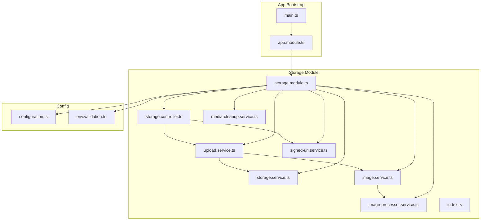
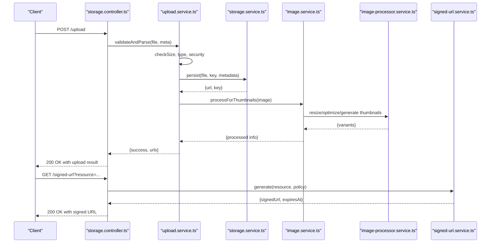
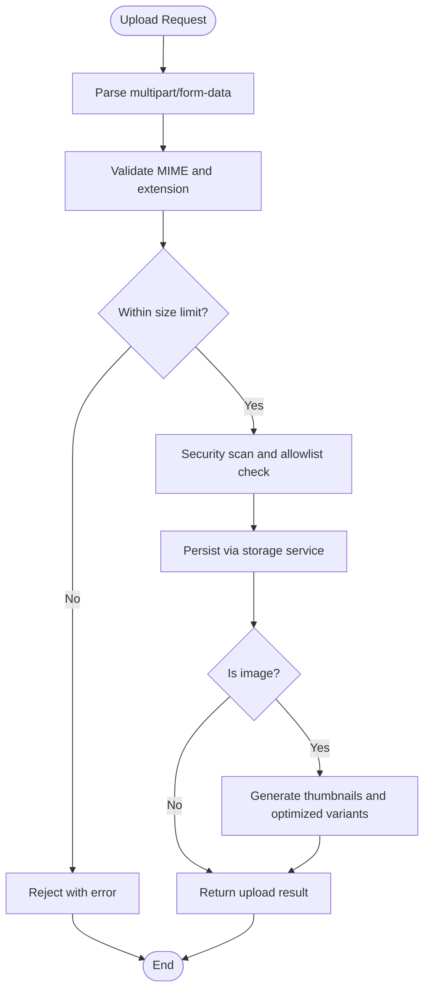
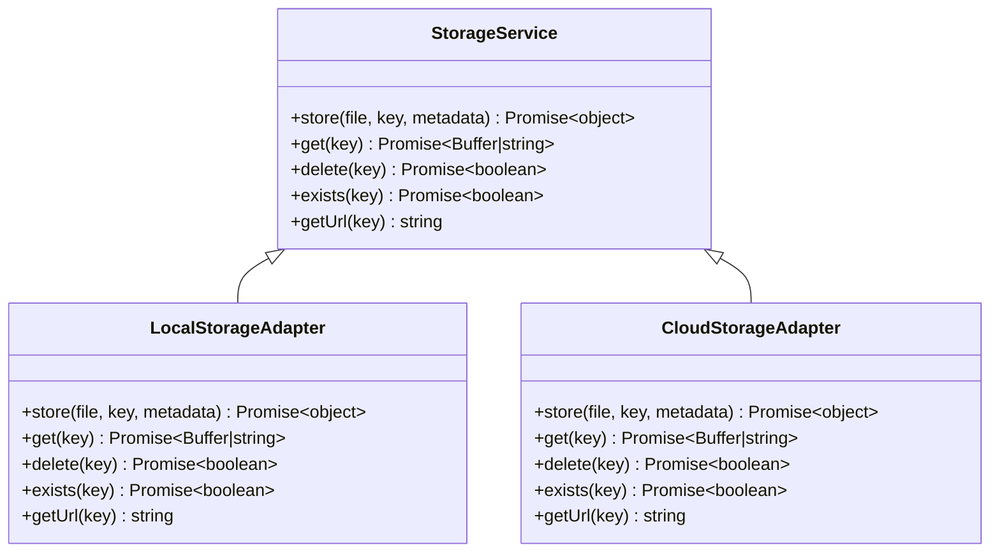
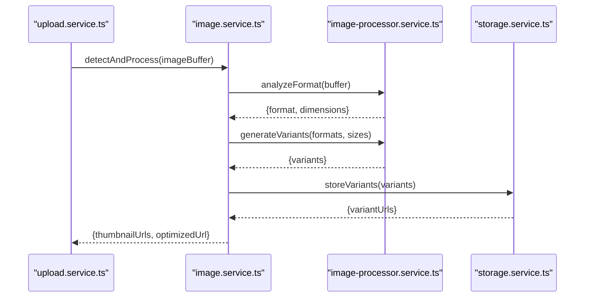
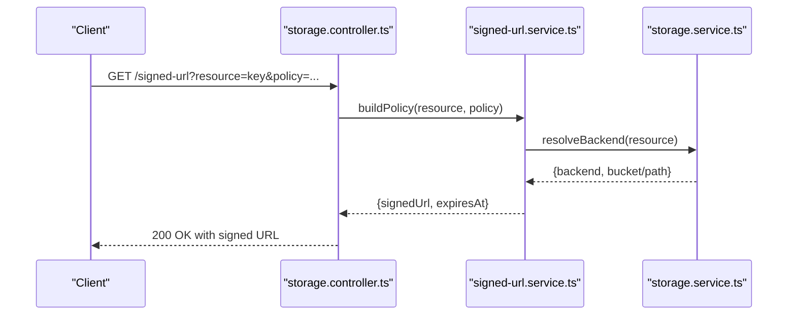
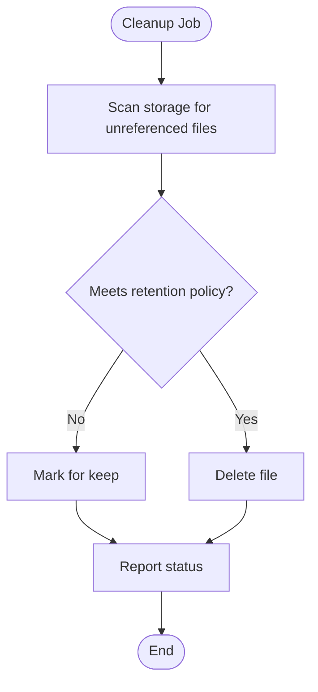
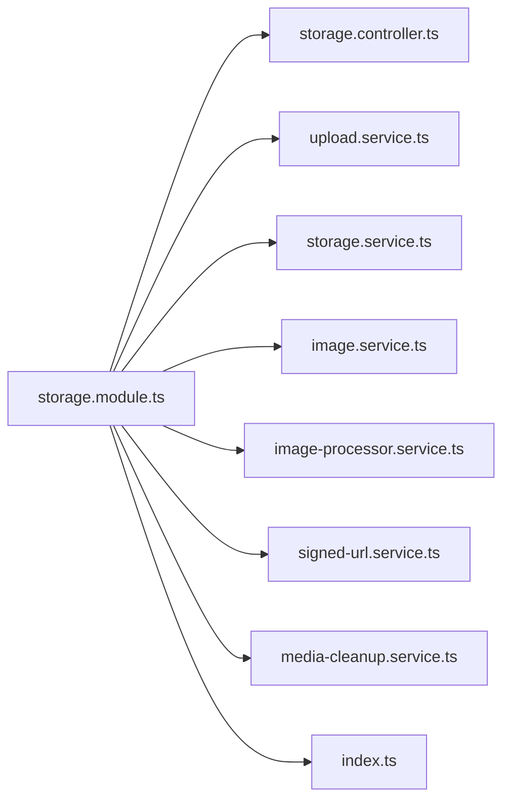
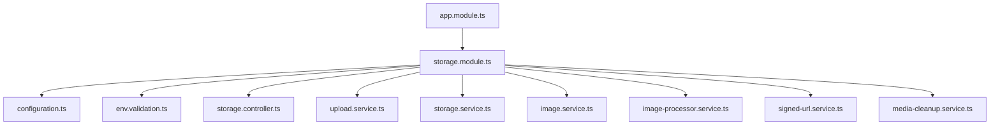

# File Upload & Storage

<cite>
**Referenced Files in This Document**
- [storage.controller.ts](file://apps/backend/src/storage/storage.controller.ts)
- [upload.service.ts](file://apps/backend/src/storage/upload.service.ts)
- [storage.service.ts](file://apps/backend/src/storage/storage.service.ts)
- [image.service.ts](file://apps/backend/src/storage/image.service.ts)
- [image-processor.service.ts](file://apps/backend/src/storage/image-processor.service.ts)
- [signed-url.service.ts](file://apps/backend/src/storage/signed-url.service.ts)
- [media-cleanup.service.ts](file://apps/backend/src/storage/media-cleanup.service.ts)
- [storage.module.ts](file://apps/backend/src/storage/storage.module.ts)
- [index.ts](file://apps/backend/src/storage/index.ts)
- [configuration.ts](file://apps/backend/src/config/configuration.ts)
- [env.validation.ts](file://apps/backend/src/config/env.validation.ts)
- [app.module.ts](file://apps/backend/src/app.module.ts)
- [main.ts](file://apps/backend/src/main.ts)
</cite>

## Table of Contents
1. [Introduction](#introduction)
2. [Project Structure](#project-structure)
3. [Core Components](#core-components)
4. [Architecture Overview](#architecture-overview)
5. [Detailed Component Analysis](#detailed-component-analysis)
6. [Dependency Analysis](#dependency-analysis)
7. [Performance Considerations](#performance-considerations)
8. [Troubleshooting Guide](#troubleshooting-guide)
9. [Conclusion](#conclusion)
10. [Appendices](#appendices)

## Introduction
This document explains the file upload and storage system implemented in the backend application. It covers the end-to-end workflow from client submission to server processing, including validation, size limits, security checks, storage abstraction for local filesystem and cloud providers (e.g., S3), image transformation pipelines, thumbnail generation, signed URL generation for secure access, CDN integration patterns, and migration strategies between storage backends. Configuration guidance and troubleshooting tips are included to help operators deploy and maintain a robust media pipeline.

## Project Structure
The upload and storage functionality is encapsulated within the storage module under apps/backend/src/storage. The module exposes controllers, services, and processors that coordinate request handling, validation, persistence, transformations, and access control. Configuration is centralized under apps/backend/src/config.

**Diagram sources**
- [storage.controller.ts](file://apps/backend/src/storage/storage.controller.ts)
- [upload.service.ts](file://apps/backend/src/storage/upload.service.ts)
- [storage.service.ts](file://apps/backend/src/storage/storage.service.ts)
- [image.service.ts](file://apps/backend/src/storage/image.service.ts)
- [image-processor.service.ts](file://apps/backend/src/storage/image-processor.service.ts)
- [signed-url.service.ts](file://apps/backend/src/storage/signed-url.service.ts)
- [media-cleanup.service.ts](file://apps/backend/src/storage/media-cleanup.service.ts)
- [storage.module.ts](file://apps/backend/src/storage/storage.module.ts)
- [index.ts](file://apps/backend/src/storage/index.ts)
- [configuration.ts](file://apps/backend/src/config/configuration.ts)
- [env.validation.ts](file://apps/backend/src/config/env.validation.ts)
- [app.module.ts](file://apps/backend/src/app.module.ts)
- [main.ts](file://apps/backend/src/main.ts)

**Section sources**
- [storage.controller.ts](file://apps/backend/src/storage/storage.controller.ts)
- [storage.module.ts](file://apps/backend/src/storage/storage.module.ts)
- [configuration.ts](file://apps/backend/src/config/configuration.ts)
- [env.validation.ts](file://apps/backend/src/config/env.validation.ts)
- [app.module.ts](file://apps/backend/src/app.module.ts)
- [main.ts](file://apps/backend/src/main.ts)

## Core Components
- Controller: Handles HTTP endpoints for upload operations and signed URL requests.
- Upload Service: Orchestrates validation, parsing multipart payloads, size/type checks, and delegates to storage and image services.
- Storage Service: Abstracts persistence across local filesystem and cloud providers; manages paths, keys, and metadata.
- Image Service: Coordinates image transformations, thumbnails, and optimization steps.
- Image Processor: Implements heavy image processing tasks (resize, format conversion, quality tuning).
- Signed URL Service: Generates time-bound, scoped URLs for secure direct access or CDN delivery.
- Media Cleanup Service: Manages orphaned files, retention policies, and background cleanup jobs.
- Module and Index: Wires dependencies and exports public APIs.

Key responsibilities and interactions:
- Validation and security checks occur early in the upload flow to reject malicious or oversized files.
- Storage abstraction ensures consistent behavior regardless of backend.
- Image processing is decoupled to avoid blocking upload responses when possible.
- Signed URLs provide secure, temporary access without exposing credentials.

**Section sources**
- [storage.controller.ts](file://apps/backend/src/storage/storage.controller.ts)
- [upload.service.ts](file://apps/backend/src/storage/upload.service.ts)
- [storage.service.ts](file://apps/backend/src/storage/storage.service.ts)
- [image.service.ts](file://apps/backend/src/storage/image.service.ts)
- [image-processor.service.ts](file://apps/backend/src/storage/image-processor.service.ts)
- [signed-url.service.ts](file://apps/backend/src/storage/signed-url.service.ts)
- [media-cleanup.service.ts](file://apps/backend/src/storage/media-cleanup.service.ts)
- [storage.module.ts](file://apps/backend/src/storage/storage.module.ts)
- [index.ts](file://apps/backend/src/storage/index.ts)

## Architecture Overview
The upload architecture follows a layered approach:
- API Layer: Controllers expose REST endpoints for uploads and signed URL retrieval.
- Application Layer: Services orchestrate workflows, enforce business rules, and handle errors.
- Infrastructure Layer: Storage service abstracts different backends; image processor handles CPU-intensive work.

**Diagram sources**
- [storage.controller.ts](file://apps/backend/src/storage/storage.controller.ts)
- [upload.service.ts](file://apps/backend/src/storage/upload.service.ts)
- [storage.service.ts](file://apps/backend/src/storage/storage.service.ts)
- [image.service.ts](file://apps/backend/src/storage/image.service.ts)
- [image-processor.service.ts](file://apps/backend/src/storage/image-processor.service.ts)
- [signed-url.service.ts](file://apps/backend/src/storage/signed-url.service.ts)

## Detailed Component Analysis

### Upload Workflow and Validation
- Input validation includes MIME type verification, extension checks, and size limits.
- Security checks scan for malicious content and enforce allowed formats.
- Multipart parsing extracts file streams and metadata.
- On success, the upload service persists the file via the storage abstraction and triggers image processing.

**Diagram sources**
- [upload.service.ts](file://apps/backend/src/storage/upload.service.ts)
- [storage.service.ts](file://apps/backend/src/storage/storage.service.ts)
- [image.service.ts](file://apps/backend/src/storage/image.service.ts)
- [image-processor.service.ts](file://apps/backend/src/storage/image-processor.service.ts)

**Section sources**
- [upload.service.ts](file://apps/backend/src/storage/upload.service.ts)

### Storage Abstraction Layer
- Provides a unified interface for writing and reading files.
- Supports local filesystem and cloud storage backends (e.g., S3-compatible).
- Normalizes paths and keys, handles region/bucket configuration, and returns consistent results.
- Enables switching backends via configuration without changing application logic.

**Diagram sources**
- [storage.service.ts](file://apps/backend/src/storage/storage.service.ts)

**Section sources**
- [storage.service.ts](file://apps/backend/src/storage/storage.service.ts)

### Image Transformation Pipeline
- Detects image types and applies appropriate transformations.
- Generates thumbnails at multiple sizes and optimized variants (e.g., WebP, AVIF).
- Uses an image processor service to perform CPU-intensive operations asynchronously where possible.
- Stores processed variants alongside originals for efficient serving.

**Diagram sources**
- [image.service.ts](file://apps/backend/src/storage/image.service.ts)
- [image-processor.service.ts](file://apps/backend/src/storage/image-processor.service.ts)
- [storage.service.ts](file://apps/backend/src/storage/storage.service.ts)

**Section sources**
- [image.service.ts](file://apps/backend/src/storage/image.service.ts)
- [image-processor.service.ts](file://apps/backend/src/storage/image-processor.service.ts)

### Signed URL Generation and Secure Access
- Produces time-bound, scoped URLs for accessing stored files securely.
- Supports optional IP restrictions, user scoping, and expiration policies.
- Integrates with CDN providers by returning pre-signed URLs that bypass application servers.

**Diagram sources**
- [storage.controller.ts](file://apps/backend/src/storage/storage.controller.ts)
- [signed-url.service.ts](file://apps/backend/src/storage/signed-url.service.ts)
- [storage.service.ts](file://apps/backend/src/storage/storage.service.ts)

**Section sources**
- [signed-url.service.ts](file://apps/backend/src/storage/signed-url.service.ts)

### Media Cleanup and Retention
- Identifies orphaned files not referenced by database records.
- Enforces retention policies and schedules periodic cleanup jobs.
- Ensures storage hygiene and prevents disk bloat over time.

**Diagram sources**
- [media-cleanup.service.ts](file://apps/backend/src/storage/media-cleanup.service.ts)

**Section sources**
- [media-cleanup.service.ts](file://apps/backend/src/storage/media-cleanup.service.ts)

### Module Wiring and Exports
- The storage module wires controllers, services, and processors into the NestJS dependency injection container.
- Public APIs are exported through index.ts for use by other modules.

**Diagram sources**
- [storage.module.ts](file://apps/backend/src/storage/storage.module.ts)
- [index.ts](file://apps/backend/src/storage/index.ts)

**Section sources**
- [storage.module.ts](file://apps/backend/src/storage/storage.module.ts)
- [index.ts](file://apps/backend/src/storage/index.ts)

## Dependency Analysis
The storage module depends on configuration for provider settings and environment validation. It integrates with the application bootstrap to register routes and services.

**Diagram sources**
- [app.module.ts](file://apps/backend/src/app.module.ts)
- [storage.module.ts](file://apps/backend/src/storage/storage.module.ts)
- [configuration.ts](file://apps/backend/src/config/configuration.ts)
- [env.validation.ts](file://apps/backend/src/config/env.validation.ts)

**Section sources**
- [app.module.ts](file://apps/backend/src/app.module.ts)
- [storage.module.ts](file://apps/backend/src/storage/storage.module.ts)
- [configuration.ts](file://apps/backend/src/config/configuration.ts)
- [env.validation.ts](file://apps/backend/src/config/env.validation.ts)

## Performance Considerations
- Offload image processing to workers or queues to avoid blocking upload endpoints.
- Use streaming uploads to reduce memory pressure for large files.
- Cache signed URLs and frequently accessed assets via CDN.
- Implement chunked uploads for resilience and progress tracking.
- Optimize storage I/O by batching writes and using appropriate buffer sizes.
- Monitor CPU usage during image transformations and scale horizontally if needed.

[No sources needed since this section provides general guidance]

## Troubleshooting Guide
Common issues and resolutions:
- Upload fails due to size limits: Verify configured maximum payload size and adjust client-side chunking.
- Invalid MIME type errors: Ensure correct Content-Type headers and server-side allowlists.
- Permission denied on storage: Check filesystem permissions or cloud provider IAM policies.
- Slow image processing: Scale worker instances or optimize image pipeline parameters.
- Expired signed URLs: Adjust expiration policies and ensure clients refresh tokens appropriately.
- Orphaned files accumulating: Run cleanup jobs more frequently and review retention policies.

**Section sources**
- [upload.service.ts](file://apps/backend/src/storage/upload.service.ts)
- [storage.service.ts](file://apps/backend/src/storage/storage.service.ts)
- [image-processor.service.ts](file://apps/backend/src/storage/image-processor.service.ts)
- [signed-url.service.ts](file://apps/backend/src/storage/signed-url.service.ts)
- [media-cleanup.service.ts](file://apps/backend/src/storage/media-cleanup.service.ts)

## Conclusion
The storage module provides a robust, extensible foundation for file uploads and media management. By separating concerns across validation, storage abstraction, image processing, and secure access, it supports scalable deployments across local and cloud environments. Operators can configure providers, tune performance, and implement migration strategies while maintaining security and reliability.

[No sources needed since this section summarizes without analyzing specific files]

## Appendices

### Configuration Examples
- Local filesystem: Configure base path, permissions, and URL prefix for served assets.
- S3-compatible: Set bucket name, region, credentials, and CDN domain for signed URLs.
- Environment variables: Define provider selection, size limits, and retention policies via env validation.

[No sources needed since this section provides general guidance]

### Migration Strategies
- Dual-write strategy: Write to both old and new backends during transition.
- Backfill job: Copy existing objects to the new backend and update references.
- Rollback plan: Maintain read-only access to the old backend until stability is confirmed.
- Consistency checks: Validate checksums and metadata after migration.

[No sources needed since this section provides general guidance]