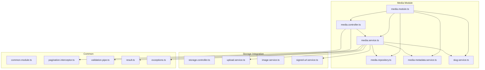
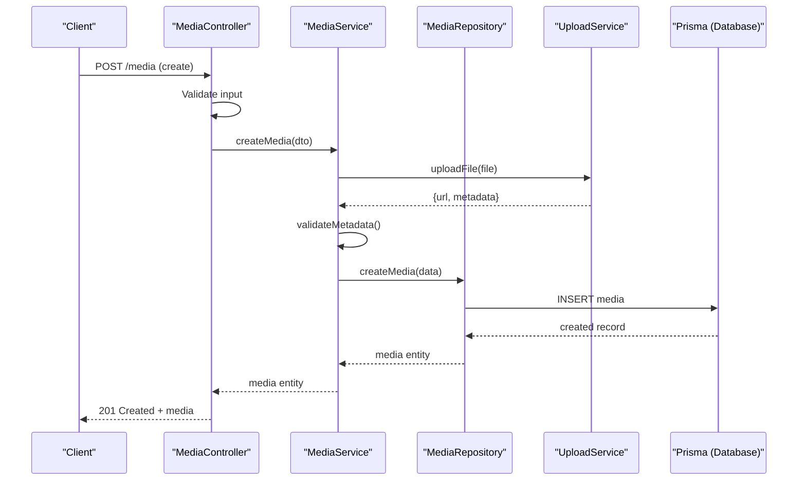
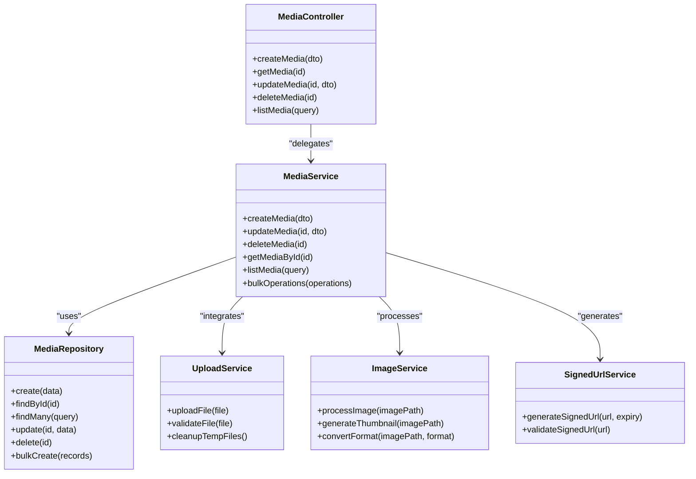
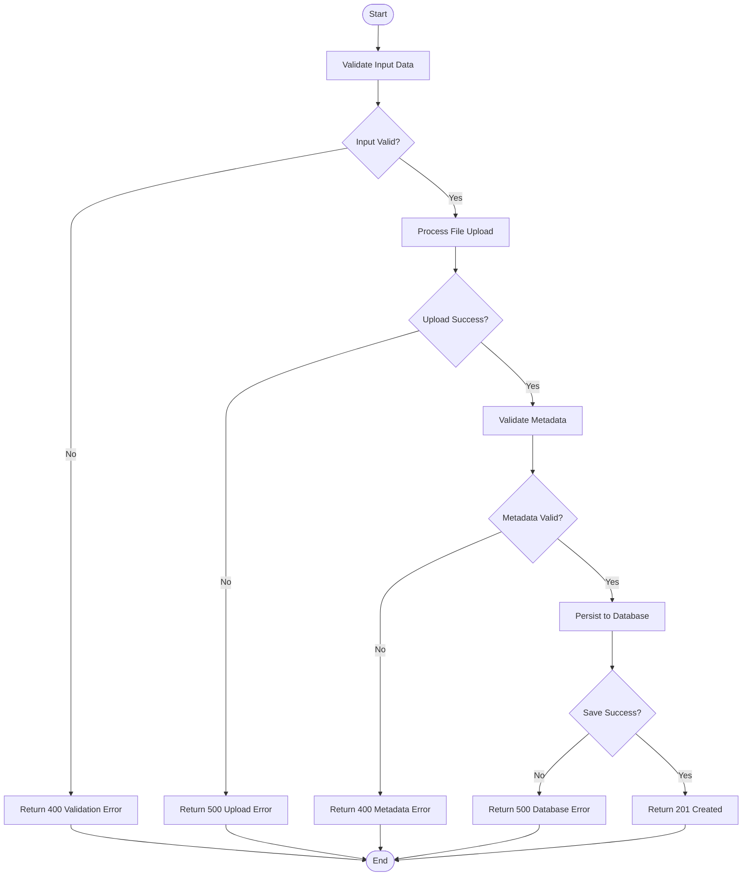
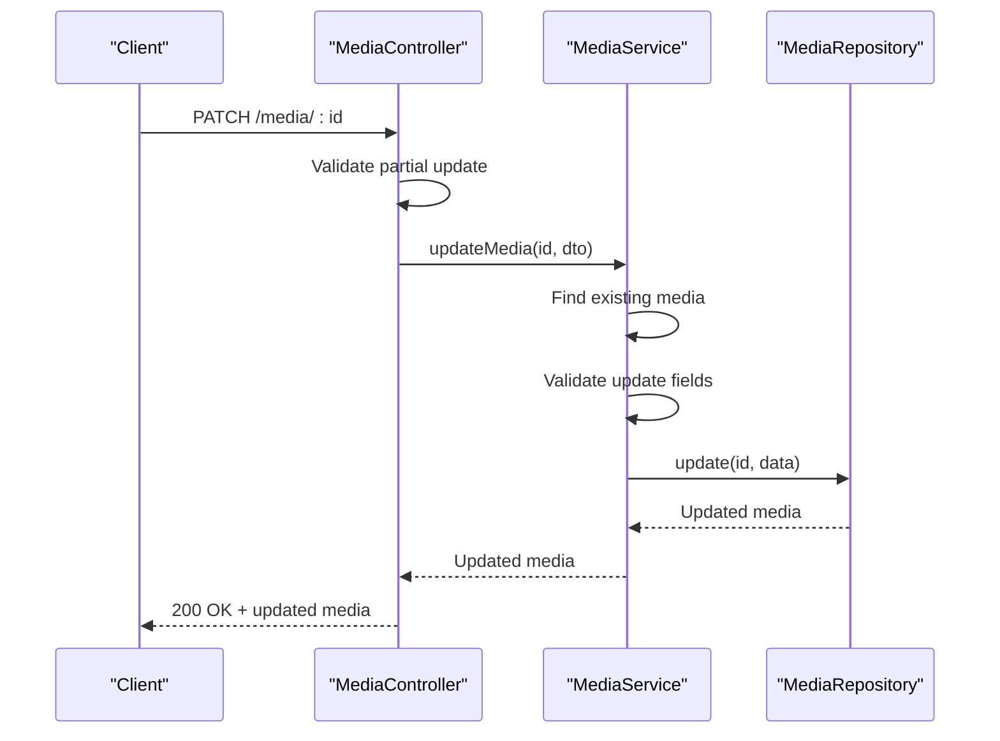

# Media CRUD Operations

<cite>
**Referenced Files in This Document**
- [media.controller.ts](file://apps/backend/src/media/media.controller.ts)
- [media.service.ts](file://apps/backend/src/media/media.service.ts)
- [media.repository.ts](file://apps/backend/src/media/media.repository.ts)
- [media-metadata.service.ts](file://apps/backend/src/media/media-metadata.service.ts)
- [slug.service.ts](file://apps/backend/src/media/slug.service.ts)
- [media.module.ts](file://apps/backend/src/media/media.module.ts)
- [schema.prisma](file://apps/backend/prisma/schema.prisma)
- [20260721005559_fix_media_cascade_restrict/migration.sql](file://apps/backend/prisma/migrations/20260721005559_fix_media_cascade_restrict/migration.sql)
- [storage.controller.ts](file://apps/backend/src/storage/storage.controller.ts)
- [upload.service.ts](file://apps/backend/src/storage/upload.service.ts)
- [image.service.ts](file://apps/backend/src/storage/image.service.ts)
- [signed-url.service.ts](file://apps/backend/src/storage/signed-url.service.ts)
- [common.module.ts](file://apps/backend/src/common/common.module.ts)
- [pagination.interceptor.ts](file://apps/backend/src/common/pagination/pagination.interceptor.ts)
- [validation.pipe.ts](file://apps/backend/src/common/pipes/validation.pipe.ts)
- [result.ts](file://apps/backend/src/common/result/result.ts)
- [exceptions.ts](file://apps/backend/src/common/exceptions/exceptions.ts)
</cite>

## Table of Contents
1. [Introduction](#introduction)
2. [Project Structure](#project-structure)
3. [Core Components](#core-components)
4. [Architecture Overview](#architecture-overview)
5. [Detailed Component Analysis](#detailed-component-analysis)
6. [Dependency Analysis](#dependency-analysis)
7. [Performance Considerations](#performance-considerations)
8. [Troubleshooting Guide](#troubleshooting-guide)
9. [Conclusion](#conclusion)
10. [Appendices](#appendices)

## Introduction
This document provides comprehensive documentation for media CRUD operations in the backend service. It covers RESTful API endpoints, request/response schemas, validation rules, error handling patterns, and the service layer business logic for creating, reading, updating, and deleting media items. It also details the repository pattern implementation for database operations, query optimization techniques, transaction handling, and practical examples for common operations such as adding new media entries, updating metadata, and bulk operations.

## Project Structure
The media feature is implemented under the media module with a clear separation of concerns:
- Controller exposes REST endpoints for media resources
- Service encapsulates business logic including workflows and validations
- Repository abstracts data access using Prisma
- Metadata and slug services support enrichment and URL-friendly identifiers
- Storage integration handles uploads, image processing, and signed URLs

**Diagram sources**
- [media.controller.ts](file://apps/backend/src/media/media.controller.ts)
- [media.service.ts](file://apps/backend/src/media/media.service.ts)
- [media.repository.ts](file://apps/backend/src/media/media.repository.ts)
- [media-metadata.service.ts](file://apps/backend/src/media/media-metadata.service.ts)
- [slug.service.ts](file://apps/backend/src/media/slug.service.ts)
- [media.module.ts](file://apps/backend/src/media/media.module.ts)
- [storage.controller.ts](file://apps/backend/src/storage/storage.controller.ts)
- [upload.service.ts](file://apps/backend/src/storage/upload.service.ts)
- [image.service.ts](file://apps/backend/src/storage/image.service.ts)
- [signed-url.service.ts](file://apps/backend/src/storage/signed-url.service.ts)
- [common.module.ts](file://apps/backend/src/common/common.module.ts)
- [pagination.interceptor.ts](file://apps/backend/src/common/pagination/pagination.interceptor.ts)
- [validation.pipe.ts](file://apps/backend/src/common/pipes/validation.pipe.ts)
- [result.ts](file://apps/backend/src/common/result/result.ts)
- [exceptions.ts](file://apps/backend/src/common/exceptions/exceptions.ts)

**Section sources**
- [media.controller.ts](file://apps/backend/src/media/media.controller.ts)
- [media.service.ts](file://apps/backend/src/media/media.service.ts)
- [media.repository.ts](file://apps/backend/src/media/media.repository.ts)
- [media-metadata.service.ts](file://apps/backend/src/media/media-metadata.service.ts)
- [slug.service.ts](file://apps/backend/src/media/slug.service.ts)
- [media.module.ts](file://apps/backend/src/media/media.module.ts)
- [storage.controller.ts](file://apps/backend/src/storage/storage.controller.ts)
- [upload.service.ts](file://apps/backend/src/storage/upload.service.ts)
- [image.service.ts](file://apps/backend/src/storage/image.service.ts)
- [signed-url.service.ts](file://apps/backend/src/storage/signed-url.service.ts)
- [common.module.ts](file://apps/backend/src/common/common.module.ts)
- [pagination.interceptor.ts](file://apps/backend/src/common/pagination/pagination.interceptor.ts)
- [validation.pipe.ts](file://apps/backend/src/common/pipes/validation.pipe.ts)
- [result.ts](file://apps/backend/src/common/result/result.ts)
- [exceptions.ts](file://apps/backend/src/common/exceptions/exceptions.ts)

## Core Components
- Media Controller: Defines REST endpoints for media CRUD operations, input validation, and response formatting.
- Media Service: Implements business logic for media creation workflows, metadata validation, relationship management, and orchestration of storage operations.
- Media Repository: Encapsulates Prisma-based data access, query building, pagination, and transactions.
- Metadata Service: Handles media metadata enrichment and validation.
- Slug Service: Generates and manages URL-friendly slugs for media items.
- Storage Services: Handle file uploads, image processing, and secure signed URL generation.

Key responsibilities:
- Input validation via pipes and DTOs
- Business rule enforcement in service layer
- Data persistence through repository with Prisma
- Error handling and consistent result shapes

**Section sources**
- [media.controller.ts](file://apps/backend/src/media/media.controller.ts)
- [media.service.ts](file://apps/backend/src/media/media.service.ts)
- [media.repository.ts](file://apps/backend/src/media/media.repository.ts)
- [media-metadata.service.ts](file://apps/backend/src/media/media-metadata.service.ts)
- [slug.service.ts](file://apps/backend/src/media/slug.service.ts)
- [storage.controller.ts](file://apps/backend/src/storage/storage.controller.ts)
- [upload.service.ts](file://apps/backend/src/storage/upload.service.ts)
- [image.service.ts](file://apps/backend/src/storage/image.service.ts)
- [signed-url.service.ts](file://apps/backend/src/storage/signed-url.service.ts)

## Architecture Overview
The media CRUD flow follows a layered architecture:
- HTTP requests enter the controller, which validates inputs and delegates to the service
- The service orchestrates business logic, metadata validation, and storage interactions
- The repository performs database operations using Prisma with optimized queries and transactions
- Responses are formatted consistently and errors are handled uniformly

**Diagram sources**
- [media.controller.ts](file://apps/backend/src/media/media.controller.ts)
- [media.service.ts](file://apps/backend/src/media/media.service.ts)
- [media.repository.ts](file://apps/backend/src/media/media.repository.ts)
- [upload.service.ts](file://apps/backend/src/storage/upload.service.ts)
- [schema.prisma](file://apps/backend/prisma/schema.prisma)

## Detailed Component Analysis

### Media Controller Endpoints
RESTful endpoints exposed by the media controller include:
- Create media: POST /media
- Read media: GET /media/:id
- Update media: PATCH /media/:id
- Delete media: DELETE /media/:id
- List media: GET /media (with pagination and filters)
- Bulk operations: POST /media/bulk (create/update/delete)

Request/response schemas:
- Create request body includes title, type, sourceUrl, and optional metadata fields
- Response returns the created media entity with generated id, timestamps, and relationships
- Update request supports partial updates for metadata fields
- Delete responses confirm deletion or return appropriate status codes

Validation rules:
- Required fields enforced via validation pipes
- Type constraints validated against allowed values
- URL formats validated for source links
- Metadata schema validated before persistence

Error handling patterns:
- Validation errors return 400 with structured error messages
- Not found errors return 404 with resource identifiers
- Conflict errors return 409 for duplicate keys or state conflicts
- Internal server errors return 500 with sanitized messages

**Section sources**
- [media.controller.ts](file://apps/backend/src/media/media.controller.ts)
- [validation.pipe.ts](file://apps/backend/src/common/pipes/validation.pipe.ts)
- [exceptions.ts](file://apps/backend/src/common/exceptions/exceptions.ts)

### Media Service Business Logic
The media service implements core business logic:
- Creation workflow: validates input, processes metadata, handles storage integration, and persists data
- Metadata validation: enforces schema rules, normalizes values, and enriches with derived fields
- Relationship management: maintains associations with collections, tags, and user ownership
- Transaction handling: ensures atomicity for multi-step operations involving multiple entities

Key methods:
- createMedia(dto): orchestrates full creation process
- updateMedia(id, dto): handles partial updates with validation
- deleteMedia(id): removes media and cleans up related data
- getMediaById(id): retrieves single media with relationships
- listMedia(query): paginated listing with filtering and sorting
- bulkOperations(operations): batch processing with rollback on failure

Complexity analysis:
- Creation operations involve I/O with storage and database, typically O(n) for n relationships
- Update operations are O(1) for single entity updates
- Listing operations use indexed queries with pagination, O(log n) for sorted results
- Bulk operations scale linearly with operation count but maintain transactional integrity

**Section sources**
- [media.service.ts](file://apps/backend/src/media/media.service.ts)
- [media-metadata.service.ts](file://apps/backend/src/media/media-metadata.service.ts)
- [result.ts](file://apps/backend/src/common/result/result.ts)

### Media Repository Implementation
The repository pattern abstracts database operations using Prisma:
- Query optimization: uses selective field projection, proper indexing, and efficient joins
- Transaction handling: wraps multi-step operations in database transactions
- Pagination: implements cursor-based and offset-based pagination strategies
- Relationship management: handles foreign key constraints and cascade behaviors

Data access methods:
- create(data): inserts new media records
- findById(id): retrieves media by primary key with optional relations
- findMany(query): complex queries with filtering, sorting, and pagination
- update(id, data): partial updates with validation
- delete(id): soft or hard deletes based on configuration
- bulkCreate(records): batch insertions with error handling

Query optimization techniques:
- Selective field selection to reduce payload size
- Proper index usage through Prisma schema definitions
- Connection pooling and query caching where applicable
- Batch operations to minimize round trips

**Section sources**
- [media.repository.ts](file://apps/backend/src/media/media.repository.ts)
- [schema.prisma](file://apps/backend/prisma/schema.prisma)

### Storage Integration
Storage services handle file operations and media processing:
- Upload service: manages file uploads, validation, and temporary storage
- Image service: processes images for thumbnails, resizing, and format conversion
- Signed URL service: generates secure, time-limited download URLs

Integration points:
- File upload validation (size, type, security checks)
- Asynchronous processing for heavy operations
- Error handling for network failures and storage limits
- Cleanup of temporary files and failed uploads

**Section sources**
- [upload.service.ts](file://apps/backend/src/storage/upload.service.ts)
- [image.service.ts](file://apps/backend/src/storage/image.service.ts)
- [signed-url.service.ts](file://apps/backend/src/storage/signed-url.service.ts)

### Database Schema and Relationships
The Prisma schema defines the media model and its relationships:
- Media entity with fields for title, type, source URL, and metadata
- Relationships with users, collections, and other domain entities
- Constraints ensuring data integrity and referential actions

Migration history shows evolution of media schema with cascade restrictions and constraint fixes.

**Section sources**
- [schema.prisma](file://apps/backend/prisma/schema.prisma)
- [20260721005559_fix_media_cascade_restrict/migration.sql](file://apps/backend/prisma/migrations/20260721005559_fix_media_cascade_restrict/migration.sql)

## Dependency Analysis
The media module has well-defined dependencies:
- Controller depends on service for business logic
- Service depends on repository for data access and storage services for file operations
- Repository depends on Prisma client for database operations
- Common modules provide shared functionality like validation and pagination

**Diagram sources**
- [media.controller.ts](file://apps/backend/src/media/media.controller.ts)
- [media.service.ts](file://apps/backend/src/media/media.service.ts)
- [media.repository.ts](file://apps/backend/src/media/media.repository.ts)
- [upload.service.ts](file://apps/backend/src/storage/upload.service.ts)
- [image.service.ts](file://apps/backend/src/storage/image.service.ts)
- [signed-url.service.ts](file://apps/backend/src/storage/signed-url.service.ts)

**Section sources**
- [media.module.ts](file://apps/backend/src/media/media.module.ts)
- [common.module.ts](file://apps/backend/src/common/common.module.ts)

## Performance Considerations
- Use pagination for large datasets to prevent memory issues
- Implement selective field projection to reduce payload sizes
- Leverage database indexes for frequently queried fields
- Cache frequently accessed data at appropriate layers
- Use connection pooling for database operations
- Process heavy operations asynchronously when possible
- Monitor query performance and optimize slow queries
- Implement proper error boundaries to prevent cascading failures

## Troubleshooting Guide
Common issues and solutions:
- Validation errors: Check input schemas and validation rules
- Database constraints: Verify foreign key relationships and unique constraints
- Storage failures: Ensure proper credentials and available storage space
- Performance issues: Analyze query execution plans and add appropriate indexes
- Transaction failures: Review rollback scenarios and implement retry logic

Debugging utilities:
- Structured logging for all operations
- Request correlation IDs for tracing
- Health check endpoints for system monitoring
- Metrics collection for performance analysis

**Section sources**
- [exceptions.ts](file://apps/backend/src/common/exceptions/exceptions.ts)
- [result.ts](file://apps/backend/src/common/result/result.ts)

## Conclusion
The media CRUD operations are implemented following best practices for RESTful API design, service-oriented architecture, and repository pattern. The system provides robust validation, error handling, and performance optimizations while maintaining clean separation of concerns. The modular design allows for easy extension and maintenance of media-related functionality.

## Appendices

### Practical Examples

#### Creating a New Media Entry

**Diagram sources**
- [media.controller.ts](file://apps/backend/src/media/media.controller.ts)
- [media.service.ts](file://apps/backend/src/media/media.service.ts)
- [upload.service.ts](file://apps/backend/src/storage/upload.service.ts)

#### Updating Media Metadata

**Diagram sources**
- [media.controller.ts](file://apps/backend/src/media/media.controller.ts)
- [media.service.ts](file://apps/backend/src/media/media.service.ts)
- [media.repository.ts](file://apps/backend/src/media/media.repository.ts)

#### Bulk Operations
Bulk operations support batch processing of multiple media items:
- Bulk create: Add multiple media entries in a single request
- Bulk update: Update metadata for multiple media items
- Bulk delete: Remove multiple media entries atomically

Implementation considerations:
- Transactional integrity across all operations
- Partial success handling with detailed error reporting
- Rate limiting to prevent abuse
- Progress tracking for long-running operations

**Section sources**
- [media.service.ts](file://apps/backend/src/media/media.service.ts)
- [media.repository.ts](file://apps/backend/src/media/media.repository.ts)