# Media Management System

<cite>
**Referenced Files in This Document**
- [media.controller.ts](file://apps/backend/src/media/media.controller.ts)
- [media.service.ts](file://apps/backend/src/media/media.service.ts)
- [media.repository.ts](file://apps/backend/src/media/media.repository.ts)
- [media-metadata.service.ts](file://apps/backend/src/media/media-metadata.service.ts)
- [slug.service.ts](file://apps/backend/src/media/slug.service.ts)
- [storage.controller.ts](file://apps/backend/src/storage/storage.controller.ts)
- [upload.service.ts](file://apps/backend/src/storage/upload.service.ts)
- [storage.service.ts](file://apps/backend/src/storage/storage.service.ts)
- [image.service.ts](file://apps/backend/src/storage/image.service.ts)
- [image-processor.service.ts](file://apps/backend/src/storage/image-processor.service.ts)
- [signed-url.service.ts](file://apps/backend/src/storage/signed-url.service.ts)
- [media-cleanup.service.ts](file://apps/backend/src/storage/media-cleanup.service.ts)
- [schema.prisma](file://apps/backend/prisma/schema.prisma)
- [app.module.ts](file://apps/backend/src/app.module.ts)
- [core.storage.index.ts](file://apps/backend/src/core/storage/index.ts)
</cite>

## Table of Contents
1. [Introduction](#introduction)
2. [Project Structure](#project-structure)
3. [Core Components](#core-components)
4. [Architecture Overview](#architecture-overview)
5. [Detailed Component Analysis](#detailed-component-analysis)
6. [Dependency Analysis](#dependency-analysis)
7. [Performance Considerations](#performance-considerations)
8. [Troubleshooting Guide](#troubleshooting-guide)
9. [Conclusion](#conclusion)
10. [Appendices](#appendices)

## Introduction
This document provides comprehensive documentation for the media management system within the backend application. It covers CRUD operations for media items, metadata extraction and processing, image optimization workflows, CDN integration patterns, file upload handling, storage abstraction supporting local and cloud backends, media transformation pipelines, repository pattern implementation for data access, search and filtering capabilities, and performance optimizations for large media libraries.

## Project Structure
The media subsystem is implemented as a NestJS module with clear separation of concerns:
- Controllers expose HTTP endpoints for media and storage operations.
- Services encapsulate business logic for media lifecycle, metadata extraction, and transformations.
- Repositories abstract database interactions using Prisma.
- Storage services provide an abstraction layer over different backends (local filesystem and cloud object storage).
- Image processors handle optimization and format conversions.
- Signed URL service enables secure CDN access.

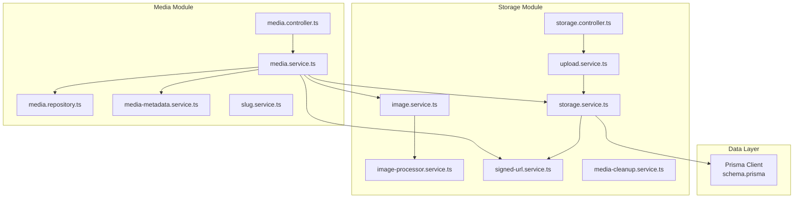

**Diagram sources**
- [media.controller.ts](file://apps/backend/src/media/media.controller.ts)
- [media.service.ts](file://apps/backend/src/media/media.service.ts)
- [media.repository.ts](file://apps/backend/src/media/media.repository.ts)
- [media-metadata.service.ts](file://apps/backend/src/media/media-metadata.service.ts)
- [slug.service.ts](file://apps/backend/src/media/slug.service.ts)
- [storage.controller.ts](file://apps/backend/src/storage/storage.controller.ts)
- [upload.service.ts](file://apps/backend/src/storage/upload.service.ts)
- [storage.service.ts](file://apps/backend/src/storage/storage.service.ts)
- [image.service.ts](file://apps/backend/src/storage/image.service.ts)
- [image-processor.service.ts](file://apps/backend/src/storage/image-processor.service.ts)
- [signed-url.service.ts](file://apps/backend/src/storage/signed-url.service.ts)
- [media-cleanup.service.ts](file://apps/backend/src/storage/media-cleanup.service.ts)
- [schema.prisma](file://apps/backend/prisma/schema.prisma)

**Section sources**
- [app.module.ts](file://apps/backend/src/app.module.ts)
- [core.storage.index.ts](file://apps/backend/src/core/storage/index.ts)

## Core Components
- Media Controller: Defines REST endpoints for creating, reading, updating, deleting, and listing media items; integrates with upload and storage services.
- Media Service: Orchestrates media lifecycle, coordinates metadata extraction, triggers image optimization, manages URLs, and delegates persistence to the repository.
- Media Repository: Encapsulates Prisma queries for media entities, including filtering, pagination, and relationships.
- Metadata Service: Extracts and normalizes metadata from uploaded files (e.g., dimensions, duration, MIME type).
- Slug Service: Generates URL-friendly slugs for media identifiers.
- Upload Service: Handles multipart uploads, validates payloads, and routes to storage backends.
- Storage Service: Abstracts storage operations across local filesystem and cloud providers; manages paths, permissions, and cleanup.
- Image Service: Provides image-specific operations like resizing, cropping, and format conversion.
- Image Processor: Executes heavy image transformations asynchronously or synchronously depending on configuration.
- Signed URL Service: Generates time-limited signed URLs for secure CDN delivery.
- Media Cleanup Service: Removes orphaned files and enforces retention policies.

**Section sources**
- [media.controller.ts](file://apps/backend/src/media/media.controller.ts)
- [media.service.ts](file://apps/backend/src/media/media.service.ts)
- [media.repository.ts](file://apps/backend/src/media/media.repository.ts)
- [media-metadata.service.ts](file://apps/backend/src/media/media-metadata.service.ts)
- [slug.service.ts](file://apps/backend/src/media/slug.service.ts)
- [upload.service.ts](file://apps/backend/src/storage/upload.service.ts)
- [storage.service.ts](file://apps/backend/src/storage/storage.service.ts)
- [image.service.ts](file://apps/backend/src/storage/image.service.ts)
- [image-processor.service.ts](file://apps/backend/src/storage/image-processor.service.ts)
- [signed-url.service.ts](file://apps/backend/src/storage/signed-url.service.ts)
- [media-cleanup.service.ts](file://apps/backend/src/storage/media-cleanup.service.ts)

## Architecture Overview
The media management system follows a layered architecture:
- Presentation Layer: Controllers handle HTTP requests and responses.
- Application Layer: Services implement use cases and orchestrate domain logic.
- Domain Layer: Entities and value objects represent media concepts and rules.
- Infrastructure Layer: Repositories interact with databases; storage services abstract file systems and cloud providers.

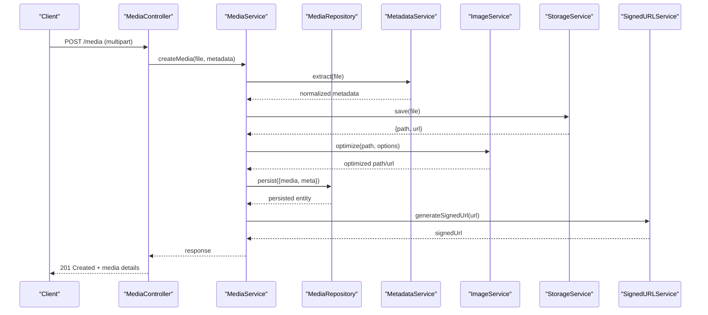

**Diagram sources**
- [media.controller.ts](file://apps/backend/src/media/media.controller.ts)
- [media.service.ts](file://apps/backend/src/media/media.service.ts)
- [media.repository.ts](file://apps/backend/src/media/media.repository.ts)
- [media-metadata.service.ts](file://apps/backend/src/media/media-metadata.service.ts)
- [image.service.ts](file://apps/backend/src/storage/image.service.ts)
- [storage.service.ts](file://apps/backend/src/storage/storage.service.ts)
- [signed-url.service.ts](file://apps/backend/src/storage/signed-url.service.ts)

## Detailed Component Analysis

### Media CRUD Operations
- Create: Accepts multipart form data, validates file types and sizes, extracts metadata, persists media record, optimizes images, and returns canonical URLs.
- Read: Retrieves media by ID or slug, supports include/exclude fields, and returns enriched metadata.
- Update: Updates metadata fields and optional reprocessing flags; prevents direct file replacement unless explicitly allowed.
- Delete: Soft deletes media records and optionally removes associated files based on policy.
- List: Supports pagination, sorting, and filtering by type, tags, dates, and user ownership.

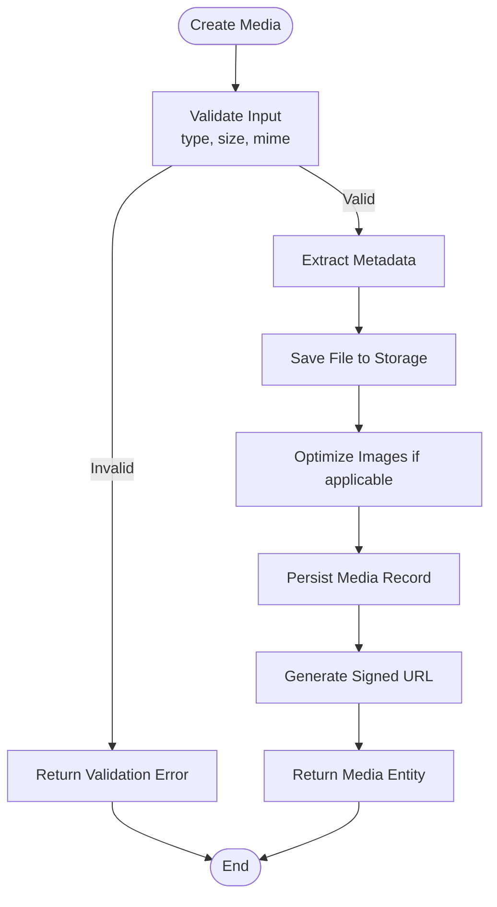

**Diagram sources**
- [media.controller.ts](file://apps/backend/src/media/media.controller.ts)
- [media.service.ts](file://apps/backend/src/media/media.service.ts)
- [media-metadata.service.ts](file://apps/backend/src/media/media-metadata.service.ts)
- [storage.service.ts](file://apps/backend/src/storage/storage.service.ts)
- [image.service.ts](file://apps/backend/src/storage/image.service.ts)
- [signed-url.service.ts](file://apps/backend/src/storage/signed-url.service.ts)

**Section sources**
- [media.controller.ts](file://apps/backend/src/media/media.controller.ts)
- [media.service.ts](file://apps/backend/src/media/media.service.ts)
- [media.repository.ts](file://apps/backend/src/media/media.repository.ts)

### Metadata Extraction and Processing
- Supported formats: images (JPEG, PNG, WebP), videos (MP4, MOV), audio (MP3, AAC).
- Extracted properties: width, height, duration, bitrate, codec, color space, EXIF/IPTC where available.
- Normalization: Converts units, maps vendor-specific fields to canonical schema, handles missing values gracefully.
- Caching: Stores extracted metadata to avoid repeated expensive reads.

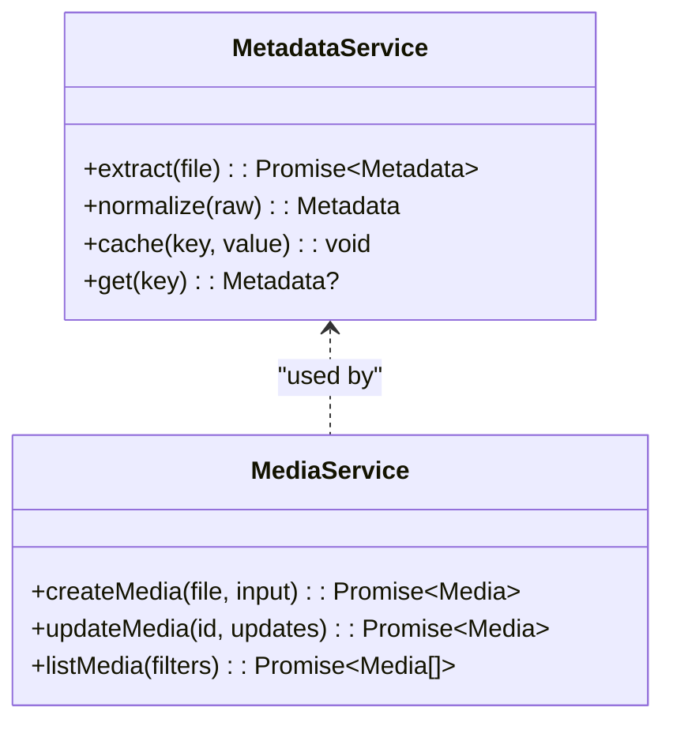

**Diagram sources**
- [media-metadata.service.ts](file://apps/backend/src/media/media-metadata.service.ts)
- [media.service.ts](file://apps/backend/src/media/media.service.ts)

**Section sources**
- [media-metadata.service.ts](file://apps/backend/src/media/media-metadata.service.ts)
- [media.service.ts](file://apps/backend/src/media/media.service.ts)

### Image Optimization Workflows
- Pipeline stages: validation, thumbnail generation, responsive variants, format conversion (e.g., WebP), quality tuning, and caching.
- Async processing: Heavy transformations are queued or executed off the critical path when configured.
- Output control: Configurable resolution limits, aspect ratio preservation, and progressive encoding.

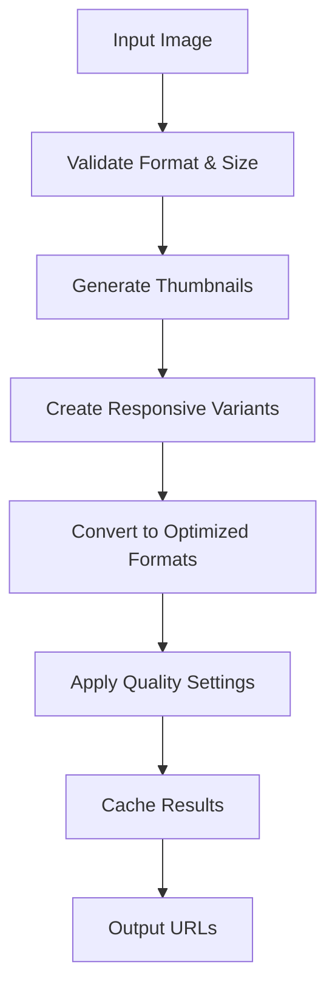

**Diagram sources**
- [image.service.ts](file://apps/backend/src/storage/image.service.ts)
- [image-processor.service.ts](file://apps/backend/src/storage/image-processor.service.ts)

**Section sources**
- [image.service.ts](file://apps/backend/src/storage/image.service.ts)
- [image-processor.service.ts](file://apps/backend/src/storage/image-processor.service.ts)

### CDN Integration Patterns
- Signed URLs: Time-limited tokens ensure secure access to private assets.
- Cache-Control: Headers set for optimal browser and CDN caching behavior.
- Fallback: Direct storage URLs used when CDN is unavailable or disabled.
- Region routing: Optional CDN edge selection based on client location.

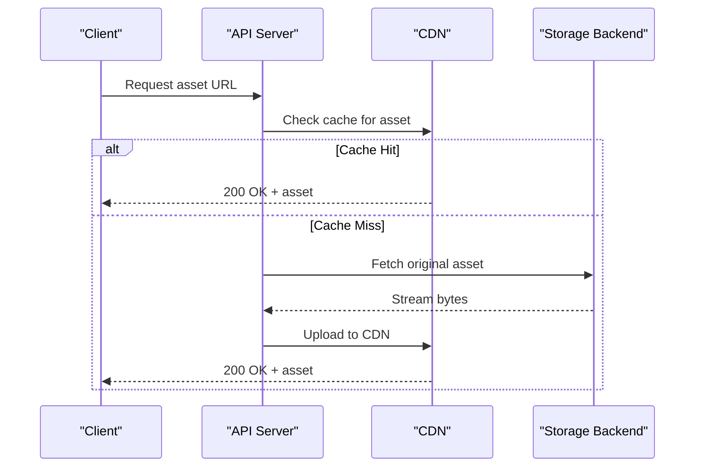

**Diagram sources**
- [signed-url.service.ts](file://apps/backend/src/storage/signed-url.service.ts)
- [storage.service.ts](file://apps/backend/src/storage/storage.service.ts)

**Section sources**
- [signed-url.service.ts](file://apps/backend/src/storage/signed-url.service.ts)
- [storage.service.ts](file://apps/backend/src/storage/storage.service.ts)

### File Upload Handling
- Multipart parsing: Validates content-type, size limits, and field presence.
- Temporary storage: Writes to temp directory before finalizing to storage backend.
- Deduplication: Optional hash-based deduplication to prevent duplicate uploads.
- Progress tracking: Streams progress events for large uploads.

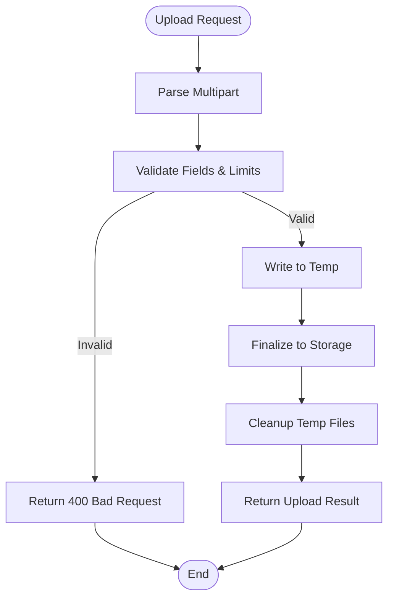

**Diagram sources**
- [upload.service.ts](file://apps/backend/src/storage/upload.service.ts)
- [storage.controller.ts](file://apps/backend/src/storage/storage.controller.ts)

**Section sources**
- [upload.service.ts](file://apps/backend/src/storage/upload.service.ts)
- [storage.controller.ts](file://apps/backend/src/storage/storage.controller.ts)

### Storage Abstraction Layer
- Backends: Local filesystem and cloud object storage (e.g., S3-compatible).
- Path strategy: Consistent key naming, versioning, and folder organization.
- Operations: put, get, delete, list, exists, copy, move.
- Configuration: Environment-driven selection and credentials management.

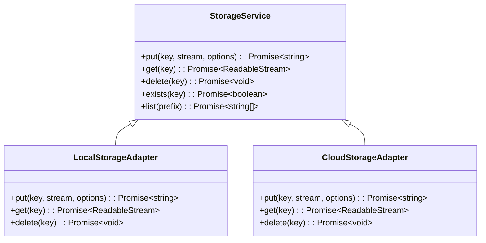

**Diagram sources**
- [storage.service.ts](file://apps/backend/src/storage/storage.service.ts)
- [core.storage.index.ts](file://apps/backend/src/core/storage/index.ts)

**Section sources**
- [storage.service.ts](file://apps/backend/src/storage/storage.service.ts)
- [core.storage.index.ts](file://apps/backend/src/core/storage/index.ts)

### Media Transformation Pipelines
- Pipeline definition: Chain of processors applied in order (e.g., resize, watermark, compress).
- Parallelism: Independent steps executed concurrently where possible.
- Error resilience: Retries and fallback strategies per step.
- Observability: Metrics and logs for each stage.

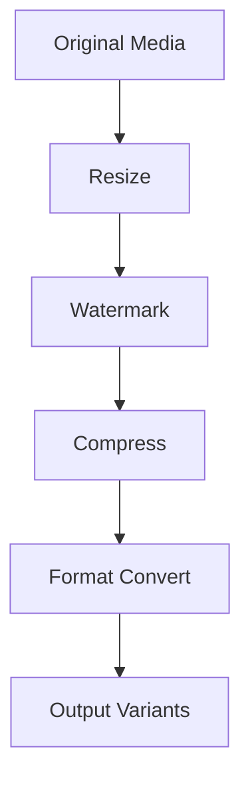

[No sources needed since this diagram shows conceptual workflow, not actual code structure]

**Section sources**
- [image-processor.service.ts](file://apps/backend/src/storage/image-processor.service.ts)
- [image.service.ts](file://apps/backend/src/storage/image.service.ts)

### Repository Pattern Implementation
- Data Access: Encapsulates all Prisma queries for media entities.
- Query Building: Composes filters, sorts, and includes dynamically.
- Transactions: Ensures consistency for multi-step operations.
- Caching: Optional read-through cache for frequent queries.

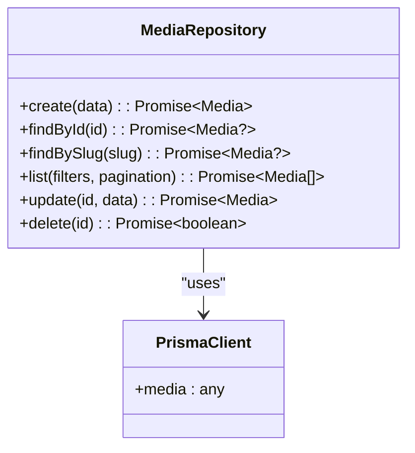

**Diagram sources**
- [media.repository.ts](file://apps/backend/src/media/media.repository.ts)
- [schema.prisma](file://apps/backend/prisma/schema.prisma)

**Section sources**
- [media.repository.ts](file://apps/backend/src/media/media.repository.ts)
- [schema.prisma](file://apps/backend/prisma/schema.prisma)

### Search and Filtering Capabilities
- Filters: Type, tags, date ranges, ownership, status, and custom attributes.
- Sorting: By created date, popularity, relevance, and custom metrics.
- Pagination: Cursor-based or offset-based with consistent ordering.
- Full-text: Optional text search on titles and descriptions.

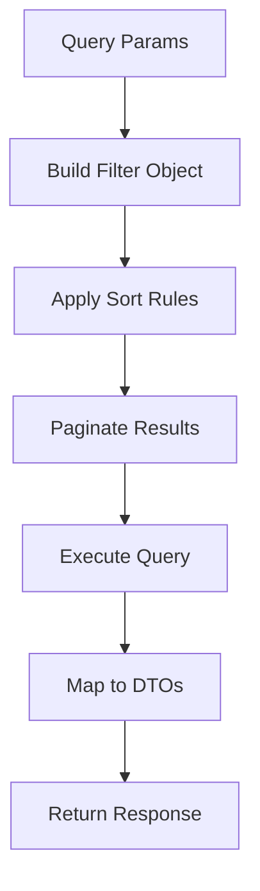

**Diagram sources**
- [media.repository.ts](file://apps/backend/src/media/media.repository.ts)
- [media.service.ts](file://apps/backend/src/media/media.service.ts)

**Section sources**
- [media.repository.ts](file://apps/backend/src/media/media.repository.ts)
- [media.service.ts](file://apps/backend/src/media/media.service.ts)

### Performance Optimizations for Large Libraries
- Indexing: Database indexes on frequently queried columns (type, owner_id, created_at).
- Lazy Loading: Avoid eager loading large binary fields; fetch on demand.
- Streaming: Stream uploads and downloads to reduce memory footprint.
- Caching: Cache metadata and computed URLs; invalidate on changes.
- Batch Operations: Use bulk inserts/updates for migrations and imports.

**Section sources**
- [schema.prisma](file://apps/backend/prisma/schema.prisma)
- [media.repository.ts](file://apps/backend/src/media/media.repository.ts)
- [storage.service.ts](file://apps/backend/src/storage/storage.service.ts)

## Dependency Analysis
The media module depends on storage, metadata, and repository layers. The storage module abstracts backends and integrates with CDN via signed URLs.

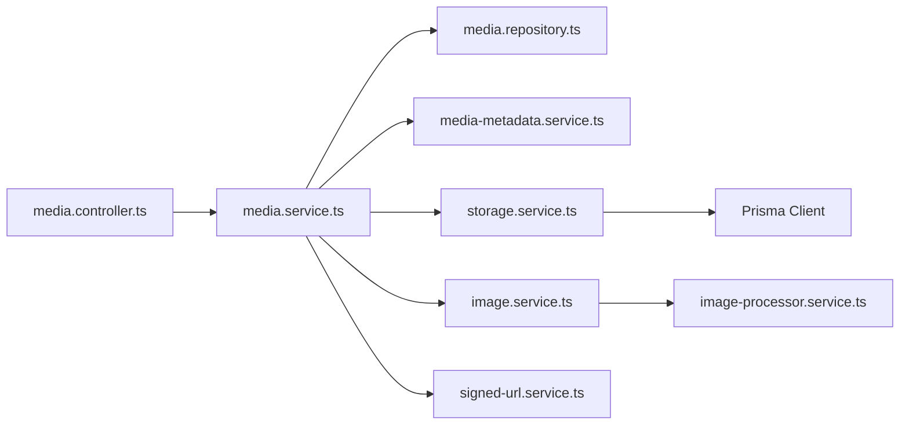

**Diagram sources**
- [media.controller.ts](file://apps/backend/src/media/media.controller.ts)
- [media.service.ts](file://apps/backend/src/media/media.service.ts)
- [media.repository.ts](file://apps/backend/src/media/media.repository.ts)
- [media-metadata.service.ts](file://apps/backend/src/media/media-metadata.service.ts)
- [storage.service.ts](file://apps/backend/src/storage/storage.service.ts)
- [image.service.ts](file://apps/backend/src/storage/image.service.ts)
- [image-processor.service.ts](file://apps/backend/src/storage/image-processor.service.ts)
- [signed-url.service.ts](file://apps/backend/src/storage/signed-url.service.ts)
- [schema.prisma](file://apps/backend/prisma/schema.prisma)

**Section sources**
- [app.module.ts](file://apps/backend/src/app.module.ts)

## Performance Considerations
- Prefer streaming for large files to minimize memory usage.
- Use cursor-based pagination for stable result sets at scale.
- Cache metadata aggressively and invalidate on updates.
- Offload heavy transformations to background jobs when possible.
- Tune database indexes based on query patterns and monitor slow queries.

[No sources needed since this section provides general guidance]

## Troubleshooting Guide
- Upload failures: Validate multipart parsing, check size limits, and inspect temporary storage permissions.
- Metadata errors: Ensure supported formats and handle missing EXIF/IPTC gracefully.
- Storage issues: Verify backend credentials, network connectivity, and bucket/container permissions.
- CDN problems: Confirm signed URL expiration, CORS settings, and cache invalidation policies.
- Cleanup tasks: Run periodic cleanup to remove orphaned files and enforce retention.

**Section sources**
- [media-cleanup.service.ts](file://apps/backend/src/storage/media-cleanup.service.ts)
- [upload.service.ts](file://apps/backend/src/storage/upload.service.ts)
- [storage.service.ts](file://apps/backend/src/storage/storage.service.ts)
- [signed-url.service.ts](file://apps/backend/src/storage/signed-url.service.ts)

## Conclusion
The media management system provides a robust, extensible foundation for handling media assets across diverse storage backends. Its layered design, strong abstraction over storage, and comprehensive metadata and optimization pipelines enable scalable performance and reliable CDN integration. Proper indexing, caching, and streaming strategies ensure efficient operation even with large media libraries.

[No sources needed since this section summarizes without analyzing specific files]

## Appendices
- API Endpoints: Refer to controllers for endpoint definitions and request/response schemas.
- Configuration: Review environment variables for storage backends and CDN settings.
- Migrations: Inspect Prisma schema for entity definitions and relationships.

[No sources needed since this section provides general guidance]