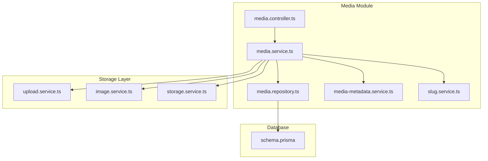
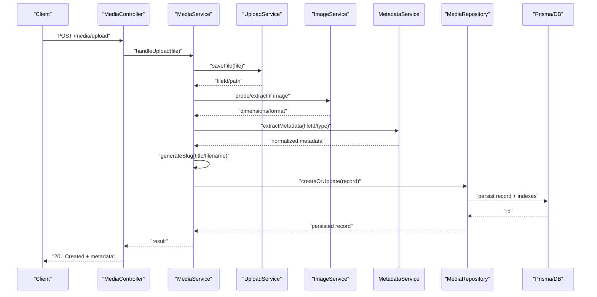
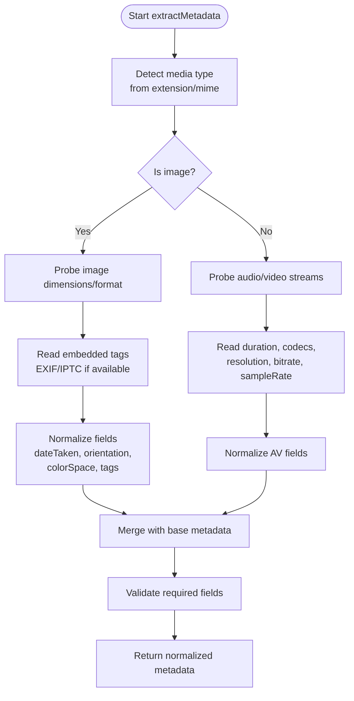
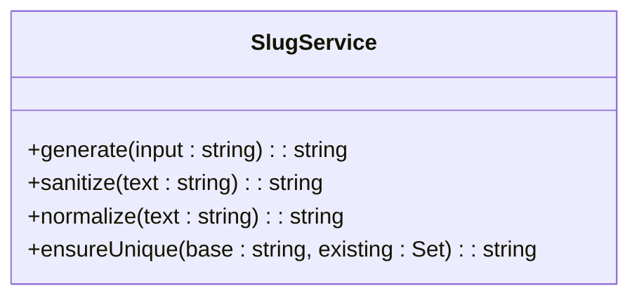
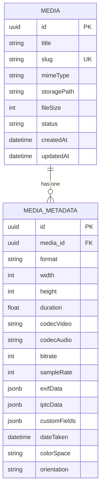
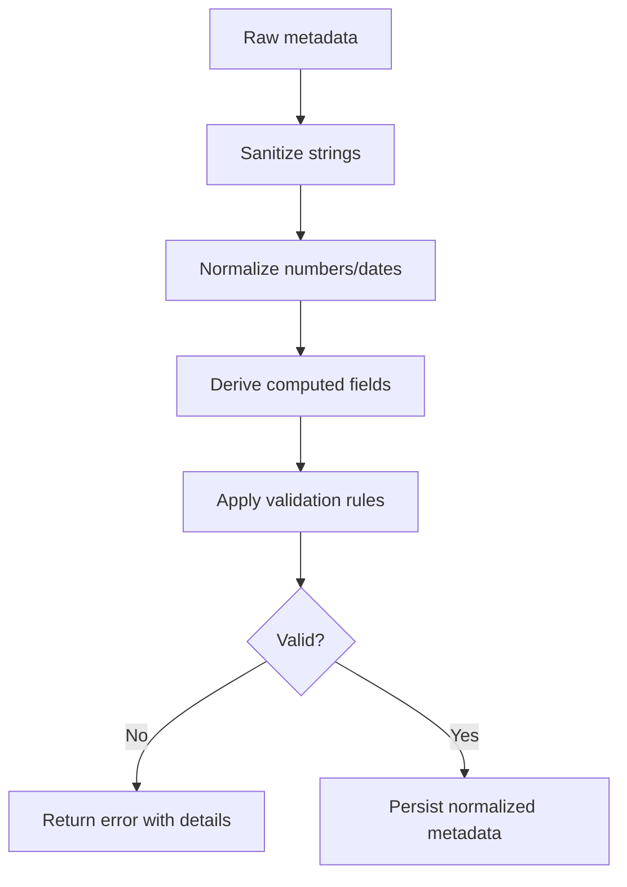
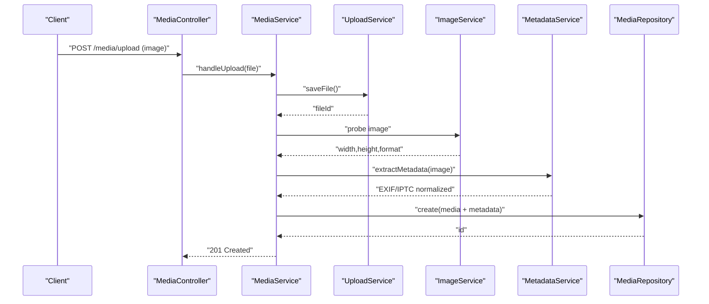
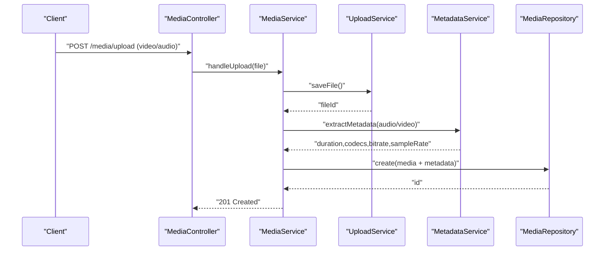
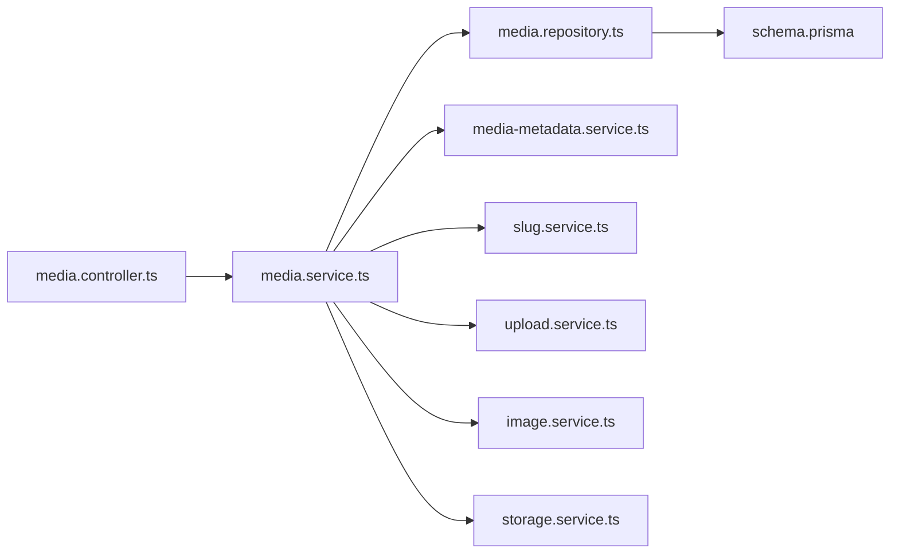

# Metadata Processing

<cite>
**Referenced Files in This Document**
- [media-metadata.service.ts](file://apps/backend/src/media/media-metadata.service.ts)
- [slug.service.ts](file://apps/backend/src/media/slug.service.ts)
- [media.controller.ts](file://apps/backend/src/media/media.controller.ts)
- [media.service.ts](file://apps/backend/src/media/media.service.ts)
- [media.repository.ts](file://apps/backend/src/media/media.repository.ts)
- [schema.prisma](file://apps/backend/prisma/schema.prisma)
- [image.service.ts](file://apps/backend/src/storage/image.service.ts)
- [upload.service.ts](file://apps/backend/src/storage/upload.service.ts)
- [storage.service.ts](file://apps/backend/src/storage/storage.service.ts)
</cite>

## Table of Contents
1. [Introduction](#introduction)
2. [Project Structure](#project-structure)
3. [Core Components](#core-components)
4. [Architecture Overview](#architecture-overview)
5. [Detailed Component Analysis](#detailed-component-analysis)
6. [Dependency Analysis](#dependency-analysis)
7. [Performance Considerations](#performance-considerations)
8. [Troubleshooting Guide](#troubleshooting-guide)
9. [Conclusion](#conclusion)
10. [Appendices](#appendices)

## Introduction
This document explains the media metadata processing capabilities implemented in the backend, focusing on automatic extraction from images, videos, and audio files; generation of SEO-friendly slugs; schema design for efficient storage and search; custom metadata field support; validation rules; and data transformation pipelines. It also provides examples of processing different media types and handling malformed or missing metadata gracefully.

## Project Structure
The media metadata functionality is primarily implemented under the media module and integrates with storage services for file access and image processing. The database schema defines how metadata is persisted and indexed.

**Diagram sources**
- [media.controller.ts](file://apps/backend/src/media/media.controller.ts)
- [media.service.ts](file://apps/backend/src/media/media.service.ts)
- [media.repository.ts](file://apps/backend/src/media/media.repository.ts)
- [media-metadata.service.ts](file://apps/backend/src/media/media-metadata.service.ts)
- [slug.service.ts](file://apps/backend/src/media/slug.service.ts)
- [upload.service.ts](file://apps/backend/src/storage/upload.service.ts)
- [image.service.ts](file://apps/backend/src/storage/image.service.ts)
- [storage.service.ts](file://apps/backend/src/storage/storage.service.ts)
- [schema.prisma](file://apps/backend/prisma/schema.prisma)

**Section sources**
- [media.controller.ts](file://apps/backend/src/media/media.controller.ts)
- [media.service.ts](file://apps/backend/src/media/media.service.ts)
- [media.repository.ts](file://apps/backend/src/media/media.repository.ts)
- [media-metadata.service.ts](file://apps/backend/src/media/media-metadata.service.ts)
- [slug.service.ts](file://apps/backend/src/media/slug.service.ts)
- [upload.service.ts](file://apps/backend/src/storage/upload.service.ts)
- [image.service.ts](file://apps/backend/src/storage/image.service.ts)
- [storage.service.ts](file://apps/backend/src/storage/storage.service.ts)
- [schema.prisma](file://apps/backend/prisma/schema.prisma)

## Core Components
- Media Controller: Exposes endpoints to upload media and retrieve metadata.
- Media Service: Orchestrates upload, metadata extraction, slug generation, persistence, and search indexing.
- Media Repository: Persists and queries media records via Prisma.
- Metadata Service: Extracts technical specs and embedded metadata (EXIF/IPTC when available).
- Slug Service: Generates SEO-friendly identifiers from titles or filenames.
- Storage Services: Handle uploads, image processing, and signed URLs.
- Database Schema: Defines entities, fields, and indexes for efficient querying.

Key responsibilities:
- Validate inputs and file types.
- Extract metadata robustly across formats.
- Normalize and transform metadata into a consistent model.
- Generate unique, human-readable slugs.
- Persist metadata with appropriate indexes.
- Provide search-friendly representations.

**Section sources**
- [media.controller.ts](file://apps/backend/src/media/media.controller.ts)
- [media.service.ts](file://apps/backend/src/media/media.service.ts)
- [media.repository.ts](file://apps/backend/src/media/media.repository.ts)
- [media-metadata.service.ts](file://apps/backend/src/media/media-metadata.service.ts)
- [slug.service.ts](file://apps/backend/src/media/slug.service.ts)
- [upload.service.ts](file://apps/backend/src/storage/upload.service.ts)
- [image.service.ts](file://apps/backend/src/storage/image.service.ts)
- [storage.service.ts](file://apps/backend/src/storage/storage.service.ts)
- [schema.prisma](file://apps/backend/prisma/schema.prisma)

## Architecture Overview
The metadata pipeline follows a clear sequence from upload to persistence and search readiness.

**Diagram sources**
- [media.controller.ts](file://apps/backend/src/media/media.controller.ts)
- [media.service.ts](file://apps/backend/src/media/media.service.ts)
- [upload.service.ts](file://apps/backend/src/storage/upload.service.ts)
- [image.service.ts](file://apps/backend/src/storage/image.service.ts)
- [media-metadata.service.ts](file://apps/backend/src/media/media-metadata.service.ts)
- [media.repository.ts](file://apps/backend/src/media/media.repository.ts)
- [schema.prisma](file://apps/backend/prisma/schema.prisma)

## Detailed Component Analysis

### Metadata Extraction Pipeline
The metadata service extracts technical specifications and embedded tags where supported. For images, it can read EXIF/IPTC-like fields when present. For video/audio, it reads duration, codec, resolution, bitrate, and sample rate.

**Diagram sources**
- [media-metadata.service.ts](file://apps/backend/src/media/media-metadata.service.ts)
- [image.service.ts](file://apps/backend/src/storage/image.service.ts)
- [upload.service.ts](file://apps/backend/src/storage/upload.service.ts)

**Section sources**
- [media-metadata.service.ts](file://apps/backend/src/media/media-metadata.service.ts)
- [image.service.ts](file://apps/backend/src/storage/image.service.ts)
- [upload.service.ts](file://apps/backend/src/storage/upload.service.ts)

### Slug Generation Service
The slug service creates SEO-friendly identifiers from titles or filenames. It normalizes characters, removes special symbols, ensures uniqueness, and enforces length constraints.

**Diagram sources**
- [slug.service.ts](file://apps/backend/src/media/slug.service.ts)

**Section sources**
- [slug.service.ts](file://apps/backend/src/media/slug.service.ts)

### Schema Design for Media Metadata
The database schema defines core entities and relationships for media items and their metadata. Indexes are applied to frequently queried fields to optimize search performance.

Indexing strategy highlights:
- Unique index on slug for fast URL lookups.
- Index on mimeType for filtering by type.
- Partial or functional indexes on JSONB fields for common queries (e.g., dateTaken).
- Composite indexes for frequent filter combinations (e.g., mimeType + status).

**Diagram sources**
- [schema.prisma](file://apps/backend/prisma/schema.prisma)

**Section sources**
- [schema.prisma](file://apps/backend/prisma/schema.prisma)

### Custom Metadata Fields
Custom fields are stored in a flexible JSONB column to support extensibility without schema migrations. Validation rules ensure type safety and consistency at write time.

Key behaviors:
- Accept a map of key-value pairs for custom attributes.
- Validate presence and types of required custom fields.
- Transform values to canonical forms (e.g., normalize booleans, coerce numbers).
- Reject invalid payloads early with descriptive errors.

**Section sources**
- [media-metadata.service.ts](file://apps/backend/src/media/media-metadata.service.ts)
- [schema.prisma](file://apps/backend/prisma/schema.prisma)

### Data Transformation Pipelines
Transformation steps include:
- Type detection from MIME and file signatures.
- Normalization of dates, durations, and numeric units.
- Sanitization of text fields (trimming, lowercasing, removing control characters).
- Enrichment with derived fields (e.g., aspect ratio, thumbnail hints).
- Fallback defaults for missing or malformed values.

**Diagram sources**
- [media-metadata.service.ts](file://apps/backend/src/media/media-metadata.service.ts)
- [media.service.ts](file://apps/backend/src/media/media.service.ts)

**Section sources**
- [media-metadata.service.ts](file://apps/backend/src/media/media-metadata.service.ts)
- [media.service.ts](file://apps/backend/src/media/media.service.ts)

### Handling Malformed or Missing Metadata
Robustness strategies:
- Graceful fallbacks: set sensible defaults when probes fail.
- Partial success: persist what is available and mark fields as unknown.
- Error classification: distinguish between unsupported formats and transient failures.
- Retry policies: reattempt probe operations with backoff for flaky I/O.

Examples:
- If EXIF is absent, leave dateTaken null and skip orientation normalization.
- If video probe fails, store mime type and size only, mark duration as unknown.
- If filename contains non-ASCII characters, sanitize before slug generation.

**Section sources**
- [media-metadata.service.ts](file://apps/backend/src/media/media-metadata.service.ts)
- [media.service.ts](file://apps/backend/src/media/media.service.ts)

### End-to-End Example Flows

#### Image Upload and Metadata Extraction

**Diagram sources**
- [media.controller.ts](file://apps/backend/src/media/media.controller.ts)
- [media.service.ts](file://apps/backend/src/media/media.service.ts)
- [upload.service.ts](file://apps/backend/src/storage/upload.service.ts)
- [image.service.ts](file://apps/backend/src/storage/image.service.ts)
- [media-metadata.service.ts](file://apps/backend/src/media/media-metadata.service.ts)
- [media.repository.ts](file://apps/backend/src/media/media.repository.ts)

#### Video/Audio Upload and Technical Specs

**Diagram sources**
- [media.controller.ts](file://apps/backend/src/media/media.controller.ts)
- [media.service.ts](file://apps/backend/src/media/media.service.ts)
- [upload.service.ts](file://apps/backend/src/storage/upload.service.ts)
- [media-metadata.service.ts](file://apps/backend/src/media/media-metadata.service.ts)
- [media.repository.ts](file://apps/backend/src/media/media.repository.ts)

## Dependency Analysis
The media module depends on storage and database layers, while the slug service is a pure utility used during creation/update flows.

**Diagram sources**
- [media.controller.ts](file://apps/backend/src/media/media.controller.ts)
- [media.service.ts](file://apps/backend/src/media/media.service.ts)
- [media.repository.ts](file://apps/backend/src/media/media.repository.ts)
- [media-metadata.service.ts](file://apps/backend/src/media/media-metadata.service.ts)
- [slug.service.ts](file://apps/backend/src/media/slug.service.ts)
- [upload.service.ts](file://apps/backend/src/storage/upload.service.ts)
- [image.service.ts](file://apps/backend/src/storage/image.service.ts)
- [storage.service.ts](file://apps/backend/src/storage/storage.service.ts)
- [schema.prisma](file://apps/backend/prisma/schema.prisma)

**Section sources**
- [media.controller.ts](file://apps/backend/src/media/media.controller.ts)
- [media.service.ts](file://apps/backend/src/media/media.service.ts)
- [media.repository.ts](file://apps/backend/src/media/media.repository.ts)
- [media-metadata.service.ts](file://apps/backend/src/media/media-metadata.service.ts)
- [slug.service.ts](file://apps/backend/src/media/slug.service.ts)
- [upload.service.ts](file://apps/backend/src/storage/upload.service.ts)
- [image.service.ts](file://apps/backend/src/storage/image.service.ts)
- [storage.service.ts](file://apps/backend/src/storage/storage.service.ts)
- [schema.prisma](file://apps/backend/prisma/schema.prisma)

## Performance Considerations
- Use streaming uploads to avoid loading large files into memory.
- Cache probe results for repeated operations on the same file.
- Apply selective indexing on high-cardinality and frequently filtered columns.
- Defer heavy transformations to background jobs if needed.
- Batch database writes when processing multiple assets.

[No sources needed since this section provides general guidance]

## Troubleshooting Guide
Common issues and resolutions:
- Unsupported format: Ensure MIME detection aligns with actual content; add handlers for new types.
- Missing EXIF/IPTC: Some cameras/apps strip metadata; rely on file timestamps or user-provided fields.
- Invalid slug conflicts: Implement uniqueness checks and suffixing logic.
- Slow metadata extraction: Profile probe libraries and consider caching or async processing.
- Inconsistent date formats: Normalize to ISO 8601 and validate ranges.

**Section sources**
- [media-metadata.service.ts](file://apps/backend/src/media/media-metadata.service.ts)
- [media.service.ts](file://apps/backend/src/media/media.service.ts)
- [slug.service.ts](file://apps/backend/src/media/slug.service.ts)

## Conclusion
The media metadata system provides a robust, extensible pipeline for extracting, validating, transforming, and storing rich metadata across images, videos, and audio. With a flexible schema, strong slug generation, and resilient error handling, it supports scalable search and presentation needs while accommodating evolving metadata requirements through custom fields.

[No sources needed since this section summarizes without analyzing specific files]

## Appendices

### API Surface Summary
- Upload endpoint: POST /media/upload
  - Input: multipart form with file and optional title/custom fields
  - Output: created media record with normalized metadata and slug
- Retrieve metadata: GET /media/:id/metadata
  - Output: normalized metadata including EXIF/IPTC when available

[No sources needed since this section provides general guidance]