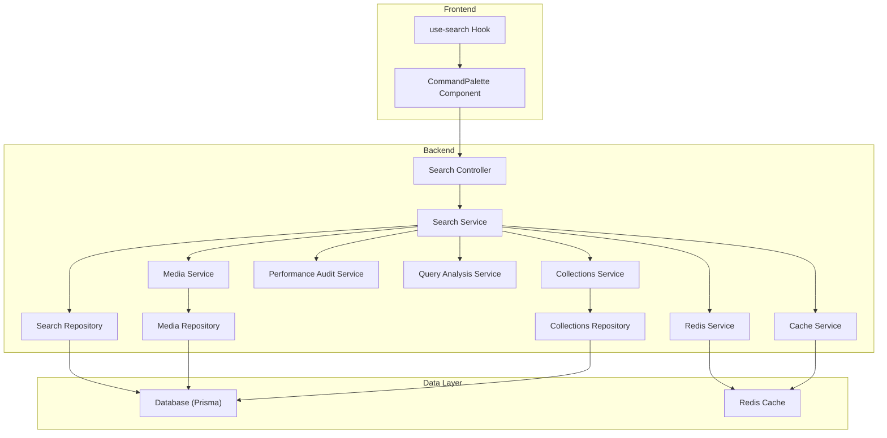
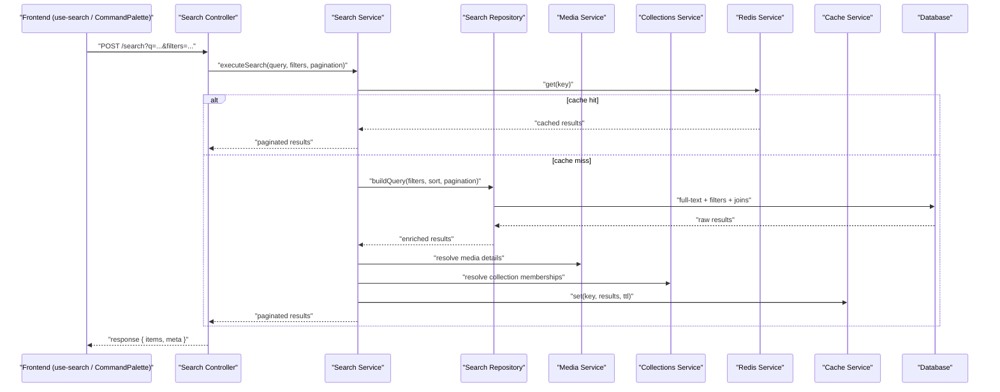
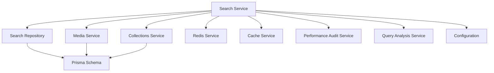

# Search & Filtering

<cite>
**Referenced Files in This Document**
- [search.controller.ts](file://apps/backend/src/search/search.controller.ts)
- [search.service.ts](file://apps/backend/src/search/search.service.ts)
- [search.repository.ts](file://apps/backend/src/search/search.repository.ts)
- [search.module.ts](file://apps/backend/src/search/search.module.ts)
- [search-statistics.service.ts](file://apps/backend/src/search/search-statistics.service.ts)
- [search-suggestion.service.ts](file://apps/backend/src/search/search-suggestion.service.ts)
- [media.controller.ts](file://apps/backend/src/media/media.controller.ts)
- [media.service.ts](file://apps/backend/src/media/media.service.ts)
- [media.repository.ts](file://apps/backend/src/media/media.repository.ts)
- [collections.controller.ts](file://apps/backend/src/collections/collections.controller.ts)
- [collections.service.ts](file://apps/backend/src/collections/collections.service.ts)
- [collections.repository.ts](file://apps/backend/src/collections/collections.repository.ts)
- [pagination/index.ts](file://apps/backend/src/common/pagination/index.ts)
- [redis.service.ts](file://apps/backend/src/redis/redis.service.ts)
- [cache.service.ts](file://apps/backend/src/hardening/cache.service.ts)
- [performance-audit.service.ts](file://apps/backend/src/hardening/performance-audit.service.ts)
- [query-analysis.service.ts](file://apps/backend/src/hardening/query-analysis.service.ts)
- [app.module.ts](file://apps/backend/src/app.module.ts)
- [configuration.ts](file://apps/backend/src/config/configuration.ts)
- [env.validation.ts](file://apps/backend/src/config/env.validation.ts)
- [schema.prisma](file://apps/backend/prisma/schema.prisma)
- [use-search.ts](file://src/hooks/use-search.ts)
- [CommandPalette.tsx](file://src/components/search/CommandPalette.tsx)
</cite>

## Table of Contents
1. [Introduction](#introduction)
2. [Project Structure](#project-structure)
3. [Core Components](#core-components)
4. [Architecture Overview](#architecture-overview)
5. [Detailed Component Analysis](#detailed-component-analysis)
6. [Dependency Analysis](#dependency-analysis)
7. [Performance Considerations](#performance-considerations)
8. [Troubleshooting Guide](#troubleshooting-guide)
9. [Conclusion](#conclusion)
10. [Appendices](#appendices)

## Introduction
This document explains the media search and filtering capabilities implemented in the backend and how they integrate with the frontend. It covers full-text search across titles, descriptions, tags, and custom metadata; advanced filters such as date ranges, media types, collection membership, and custom attributes; pagination strategies for large result sets; sorting mechanisms; performance optimizations; caching strategies; faceted search support; and practical examples of common search patterns and query construction techniques.

## Project Structure
The search feature is primarily implemented under the backend search module, with supporting services for statistics and suggestions. Media and collections modules provide domain data used by search queries. Pagination utilities are shared across the application. Caching and Redis integration are provided by dedicated services. Configuration and environment validation ensure proper runtime settings. The frontend exposes a command palette hook and component to build and execute searches.

**Diagram sources**
- [search.controller.ts](file://apps/backend/src/search/search.controller.ts)
- [search.service.ts](file://apps/backend/src/search/search.service.ts)
- [search.repository.ts](file://apps/backend/src/search/search.repository.ts)
- [media.service.ts](file://apps/backend/src/media/media.service.ts)
- [media.repository.ts](file://apps/backend/src/media/media.repository.ts)
- [collections.service.ts](file://apps/backend/src/collections/collections.service.ts)
- [collections.repository.ts](file://apps/backend/src/collections/collections.repository.ts)
- [redis.service.ts](file://apps/backend/src/redis/redis.service.ts)
- [cache.service.ts](file://apps/backend/src/hardening/cache.service.ts)
- [performance-audit.service.ts](file://apps/backend/src/hardening/performance-audit.service.ts)
- [query-analysis.service.ts](file://apps/backend/src/hardening/query-analysis.service.ts)
- [use-search.ts](file://src/hooks/use-search.ts)
- [CommandPalette.tsx](file://src/components/search/CommandPalette.tsx)

**Section sources**
- [search.module.ts](file://apps/backend/src/search/search.module.ts)
- [app.module.ts](file://apps/backend/src/app.module.ts)

## Core Components
- Search Controller: Exposes HTTP endpoints for search queries, aggregating results and returning paginated responses.
- Search Service: Orchestrates search logic, composes filters, applies sorting, and integrates with caching and analytics.
- Search Repository: Builds database queries using Prisma, supports full-text search and complex filter conditions.
- Media and Collections Services/Repositories: Provide domain entities and relationships used by search queries.
- Redis and Cache Services: Implement caching strategies for frequent or expensive queries.
- Performance and Query Analysis Services: Monitor and optimize slow queries and heavy operations.
- Frontend Hooks and Components: Build search queries from user input and render results efficiently.

**Section sources**
- [search.controller.ts](file://apps/backend/src/search/search.controller.ts)
- [search.service.ts](file://apps/backend/src/search/search.service.ts)
- [search.repository.ts](file://apps/backend/src/search/search.repository.ts)
- [media.service.ts](file://apps/backend/src/media/media.service.ts)
- [media.repository.ts](file://apps/backend/src/media/media.repository.ts)
- [collections.service.ts](file://apps/backend/src/collections/collections.service.ts)
- [collections.repository.ts](file://apps/backend/src/collections/collections.repository.ts)
- [redis.service.ts](file://apps/backend/src/redis/redis.service.ts)
- [cache.service.ts](file://apps/backend/src/hardening/cache.service.ts)
- [performance-audit.service.ts](file://apps/backend/src/hardening/performance-audit.service.ts)
- [query-analysis.service.ts](file://apps/backend/src/hardening/query-analysis.service.ts)
- [use-search.ts](file://src/hooks/use-search.ts)
- [CommandPalette.tsx](file://src/components/search/CommandPalette.tsx)

## Architecture Overview
The search architecture follows a layered approach:
- API Layer: Controllers receive requests, validate inputs, and return standardized responses.
- Service Layer: Business logic composes filters, sorts, and aggregates results; interacts with caches and analytics.
- Repository Layer: Data access layer builds efficient Prisma queries and handles joins across media and collections.
- External Integrations: Redis for caching; optional external search engines can be integrated via repository/service abstractions.
- Frontend Integration: Hooks and components construct queries and manage UI state for search experiences.

**Diagram sources**
- [search.controller.ts](file://apps/backend/src/search/search.controller.ts)
- [search.service.ts](file://apps/backend/src/search/search.service.ts)
- [search.repository.ts](file://apps/backend/src/search/search.repository.ts)
- [media.service.ts](file://apps/backend/src/media/media.service.ts)
- [collections.service.ts](file://apps/backend/src/collections/collections.service.ts)
- [redis.service.ts](file://apps/backend/src/redis/redis.service.ts)
- [cache.service.ts](file://apps/backend/src/hardening/cache.service.ts)

## Detailed Component Analysis

### Search Controller
- Responsibilities:
  - Accepts search parameters including query text, filters, sorting, and pagination.
  - Validates inputs and delegates execution to the search service.
  - Returns standardized paginated responses with metadata.
- Key behaviors:
  - Input normalization for query strings and filter objects.
  - Error handling for invalid parameters and upstream failures.
  - Optional correlation IDs for observability.

**Section sources**
- [search.controller.ts](file://apps/backend/src/search/search.controller.ts)

### Search Service
- Responsibilities:
  - Composes search queries from controller inputs.
  - Applies full-text search across title, description, tags, and custom metadata fields.
  - Implements advanced filters: date ranges, media types, collection membership, and custom attributes.
  - Handles sorting mechanisms and pagination strategies.
  - Integrates with caching and analytics services.
- Advanced filtering:
  - Date ranges: start/end timestamps for creation/update dates.
  - Media types: video, image, audio, document, etc.
  - Collection membership: one or multiple collection IDs.
  - Custom attributes: key-value pairs stored in JSON metadata.
- Sorting:
  - Supports relevance scoring, date-based ordering, popularity metrics, and custom field sorting.
- Pagination:
  - Cursor-based or offset-based pagination depending on dataset size and performance requirements.
- Caching:
  - Uses Redis for frequently accessed queries with TTL-based expiration.
  - Cache keys derived from normalized query parameters.
- Faceted search:
  - Aggregates counts for facets like media type, collection, tag, and date buckets.
- Performance:
  - Delegates heavy computations to repository layer with optimized Prisma queries.
  - Integrates with performance audit and query analysis services.

**Section sources**
- [search.service.ts](file://apps/backend/src/search/search.service.ts)
- [search-statistics.service.ts](file://apps/backend/src/search/search-statistics.service.ts)
- [search-suggestion.service.ts](file://apps/backend/src/search/search-suggestion.service.ts)

### Search Repository
- Responsibilities:
  - Builds Prisma queries for full-text search and complex filters.
  - Joins media and collections tables to resolve membership and relationships.
  - Optimizes queries with selective projections and indexed fields.
- Full-text search:
  - Searches across title, description, tags, and custom metadata fields.
  - Uses database-specific full-text capabilities where available.
- Filters:
  - Date range filters with indexed timestamp columns.
  - Media type filters with enum constraints.
  - Collection membership filters with foreign key joins.
  - Custom attribute filters using JSON path queries.
- Sorting and pagination:
  - Efficient ordering with indexed columns.
  - Cursor-based pagination for large datasets.

**Section sources**
- [search.repository.ts](file://apps/backend/src/search/search.repository.ts)
- [media.repository.ts](file://apps/backend/src/media/media.repository.ts)
- [collections.repository.ts](file://apps/backend/src/collections/collections.repository.ts)
- [schema.prisma](file://apps/backend/prisma/schema.prisma)

### Media and Collections Integration
- Media Service/Repository:
  - Provides media entity details and relationships.
  - Supports metadata enrichment for search results.
- Collections Service/Repository:
  - Resolves collection membership and smart collection rules.
  - Enables filtering by collection IDs and dynamic criteria.

**Section sources**
- [media.service.ts](file://apps/backend/src/media/media.service.ts)
- [media.repository.ts](file://apps/backend/src/media/media.repository.ts)
- [collections.service.ts](file://apps/backend/src/collections/collections.service.ts)
- [collections.repository.ts](file://apps/backend/src/collections/collections.repository.ts)

### Caching and Redis Integration
- Redis Service:
  - Manages connection and operations for caching search results.
  - Supports TTL configuration and key serialization.
- Cache Service:
  - Implements high-level caching strategies with fallback mechanisms.
  - Handles cache invalidation on media updates or collection changes.

**Section sources**
- [redis.service.ts](file://apps/backend/src/redis/redis.service.ts)
- [cache.service.ts](file://apps/backend/src/hardening/cache.service.ts)

### Performance and Query Analysis
- Performance Audit Service:
  - Monitors slow queries and resource usage.
  - Provides insights into bottlenecks during search operations.
- Query Analysis Service:
  - Analyzes query plans and suggests optimizations.
  - Tracks query frequency and impact on system performance.

**Section sources**
- [performance-audit.service.ts](file://apps/backend/src/hardening/performance-audit.service.ts)
- [query-analysis.service.ts](file://apps/backend/src/hardening/query-analysis.service.ts)

### Frontend Integration
- use-search Hook:
  - Constructs search queries from user input.
  - Manages loading states, error handling, and pagination.
- CommandPalette Component:
  - Provides a quick-access interface for search commands.
  - Integrates with backend search endpoints for real-time results.

**Section sources**
- [use-search.ts](file://src/hooks/use-search.ts)
- [CommandPalette.tsx](file://src/components/search/CommandPalette.tsx)

## Dependency Analysis
The search module depends on several core services and repositories:
- Direct dependencies:
  - Media and Collections services for domain data.
  - Redis and Cache services for caching.
  - Performance and Query Analysis services for optimization.
- Indirect dependencies:
  - Database schema defined in Prisma.
  - Configuration and environment validation for runtime settings.

**Diagram sources**
- [search.service.ts](file://apps/backend/src/search/search.service.ts)
- [search.repository.ts](file://apps/backend/src/search/search.repository.ts)
- [media.service.ts](file://apps/backend/src/media/media.service.ts)
- [collections.service.ts](file://apps/backend/src/collections/collections.service.ts)
- [redis.service.ts](file://apps/backend/src/redis/redis.service.ts)
- [cache.service.ts](file://apps/backend/src/hardening/cache.service.ts)
- [performance-audit.service.ts](file://apps/backend/src/hardening/performance-audit.service.ts)
- [query-analysis.service.ts](file://apps/backend/src/hardening/query-analysis.service.ts)
- [schema.prisma](file://apps/backend/prisma/schema.prisma)
- [configuration.ts](file://apps/backend/src/config/configuration.ts)

**Section sources**
- [search.module.ts](file://apps/backend/src/search/search.module.ts)
- [app.module.ts](file://apps/backend/src/app.module.ts)

## Performance Considerations
- Indexing:
  - Ensure indexes on frequently filtered columns (dates, media types, collection IDs).
  - Use full-text indexes for searchable fields (title, description, tags).
- Query Optimization:
  - Select only necessary fields to reduce payload size.
  - Use cursor-based pagination for large datasets to avoid offset penalties.
- Caching Strategy:
  - Cache frequent queries with appropriate TTLs.
  - Invalidate cache on media updates or collection changes.
- Monitoring:
  - Track slow queries and resource usage with performance audit services.
  - Analyze query plans to identify bottlenecks.
- External Search Engines:
  - Consider integrating with specialized search engines for complex full-text queries.
  - Use repository abstraction to switch implementations without changing business logic.

[No sources needed since this section provides general guidance]

## Troubleshooting Guide
- Common Issues:
  - Slow queries: Check indexing and query plans using query analysis services.
  - Cache misses: Verify cache key generation and TTL settings.
  - Invalid filters: Validate input parameters and handle edge cases.
- Debugging Steps:
  - Enable detailed logging for search operations.
  - Monitor Redis connectivity and cache hit rates.
  - Review performance audit reports for bottlenecks.
- Error Handling:
  - Implement retry mechanisms for transient failures.
  - Provide meaningful error messages for invalid queries.

**Section sources**
- [performance-audit.service.ts](file://apps/backend/src/hardening/performance-audit.service.ts)
- [query-analysis.service.ts](file://apps/backend/src/hardening/query-analysis.service.ts)
- [redis.service.ts](file://apps/backend/src/redis/redis.service.ts)
- [cache.service.ts](file://apps/backend/src/hardening/cache.service.ts)

## Conclusion
The search and filtering system provides comprehensive capabilities for media discovery through full-text search, advanced filtering, pagination, sorting, and caching. The modular architecture enables easy integration with external search engines and robust performance monitoring. Proper indexing, caching strategies, and query optimization ensure efficient operation even with large datasets.

[No sources needed since this section summarizes without analyzing specific files]

## Appendices

### Practical Examples of Search Patterns
- Full-text search across titles and descriptions:
  - Construct queries with keyword matching and relevance scoring.
- Date range filtering:
  - Filter media created or updated within specific time periods.
- Collection membership filtering:
  - Narrow results to media belonging to specific collections.
- Custom attribute filtering:
  - Search based on key-value metadata pairs.
- Faceted search:
  - Aggregate results by media type, collection, tags, and date buckets.

[No sources needed since this section provides conceptual examples]

### Query Construction Techniques
- Parameter normalization:
  - Standardize input formats for consistent query building.
- Filter composition:
  - Combine multiple filters with logical operators.
- Sorting strategies:
  - Prioritize relevance, recency, or popularity based on use cases.
- Pagination options:
  - Choose between offset and cursor-based pagination based on performance needs.

[No sources needed since this section provides conceptual guidance]