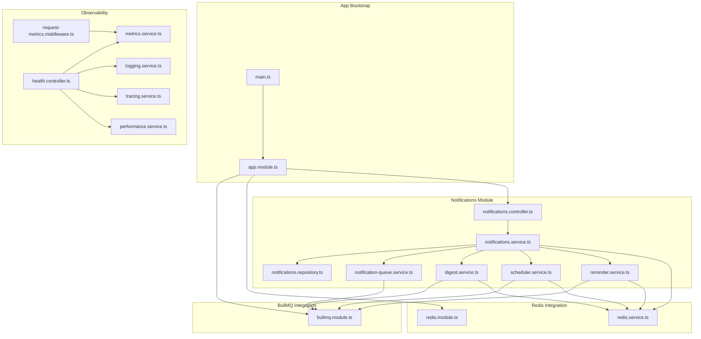
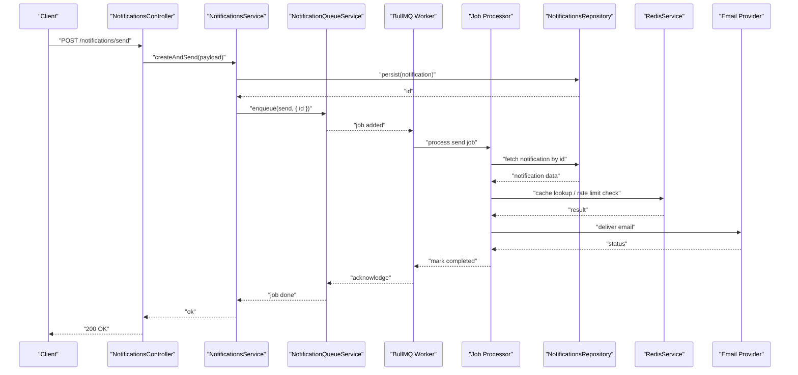
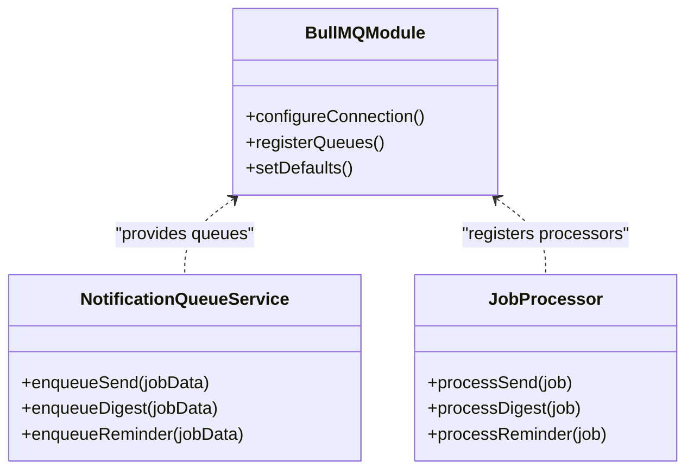
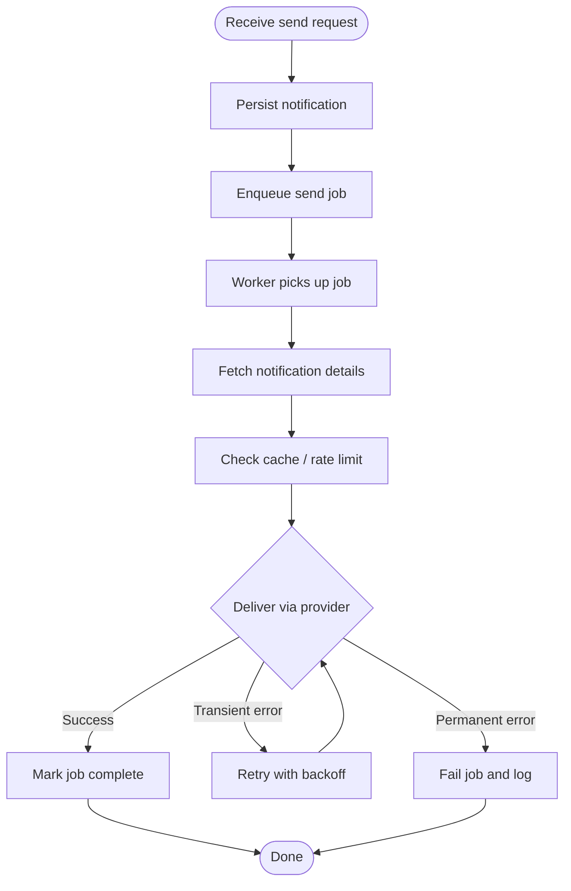
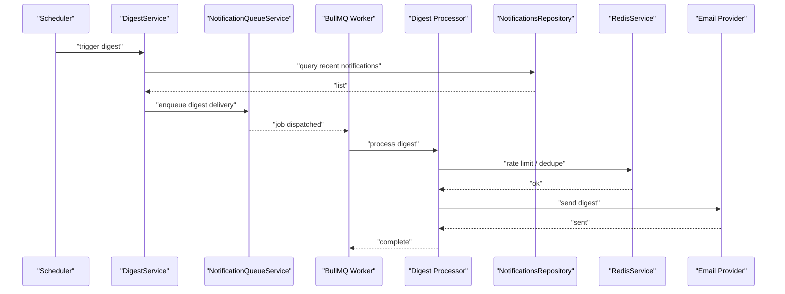
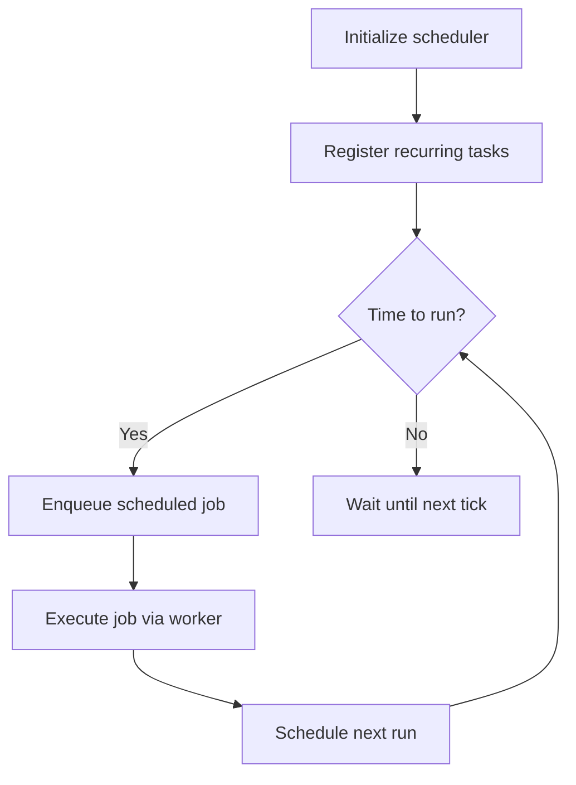
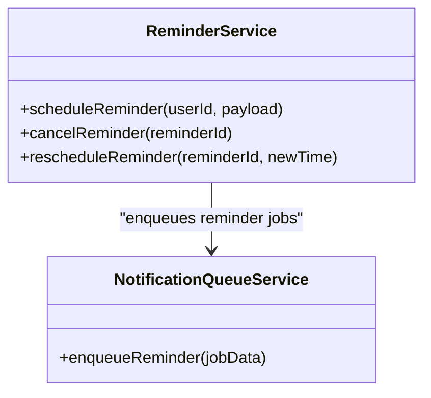
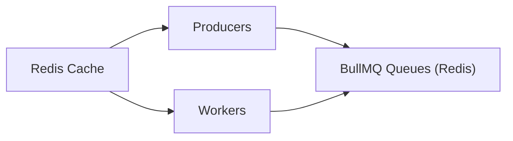
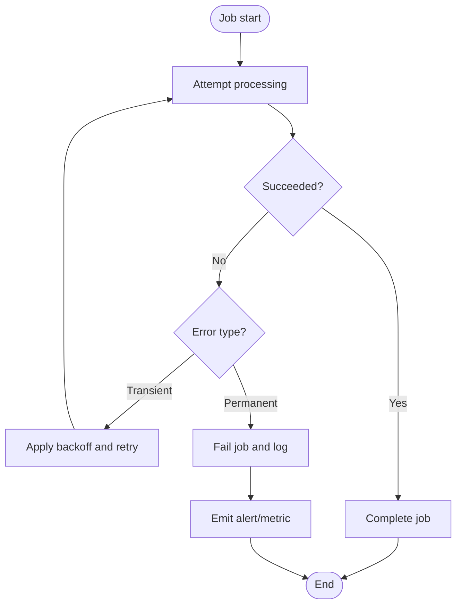
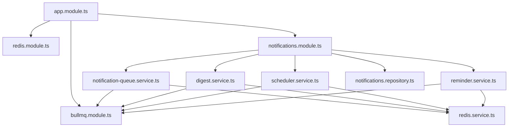

# Notifications & Background Processing

<cite>
**Referenced Files in This Document**
- [bullmq.module.ts](file://apps/backend/src/bullmq/bullmq.module.ts)
- [notifications.module.ts](file://apps/backend/src/notifications/notifications.module.ts)
- [notification-queue.service.ts](file://apps/backend/src/notifications/notification-queue.service.ts)
- [digest.service.ts](file://apps/backend/src/notifications/digest.service.ts)
- [scheduler.service.ts](file://apps/backend/src/notifications/scheduler.service.ts)
- [reminder.service.ts](file://apps/backend/src/notifications/reminder.service.ts)
- [notifications.controller.ts](file://apps/backend/src/notifications/notifications.controller.ts)
- [notifications.service.ts](file://apps/backend/src/notifications/notifications.service.ts)
- [notifications.repository.ts](file://apps/backend/src/notifications/notifications.repository.ts)
- [redis.service.ts](file://apps/backend/src/redis/redis.service.ts)
- [redis.module.ts](file://apps/backend/src/redis/redis.module.ts)
- [app.module.ts](file://apps/backend/src/app.module.ts)
- [main.ts](file://apps/backend/src/main.ts)
- [configuration.ts](file://apps/backend/src/config/configuration.ts)
- [env.validation.ts](file://apps/backend/src/config/env.validation.ts)
- [health.controller.ts](file://apps/backend/src/health/health.controller.ts)
- [metrics.service.ts](file://apps/backend/src/observability/metrics.service.ts)
- [logging.service.ts](file://apps/backend/src/observability/logging.service.ts)
- [tracing.service.ts](file://apps/backend/src/observability/tracing.service.ts)
- [performance.service.ts](file://apps/backend/src/observability/performance.service.ts)
- [request-metrics.middleware.ts](file://apps/backend/src/observability/request-metrics.middleware.ts)
</cite>

## Table of Contents
1. [Introduction](#introduction)
2. [Project Structure](#project-structure)
3. [Core Components](#core-components)
4. [Architecture Overview](#architecture-overview)
5. [Detailed Component Analysis](#detailed-component-analysis)
6. [Dependency Analysis](#dependency-analysis)
7. [Performance Considerations](#performance-considerations)
8. [Troubleshooting Guide](#troubleshooting-guide)
9. [Conclusion](#conclusion)
10. [Appendices](#appendices)

## Introduction
This document explains the notifications and background processing system, focusing on BullMQ integration for job queuing, notification delivery mechanisms, digest processing, processor architecture, error handling strategies, retry policies, Redis usage for caching and queue management, email templates, scheduled task execution, and monitoring/debugging approaches for background jobs. It is intended to be accessible to both technical and non-technical readers while providing code-level references for deeper investigation.

## Project Structure
The backend organizes background processing under a dedicated notifications module with supporting modules for BullMQ and Redis. Key responsibilities:
- Queue orchestration and job lifecycle via BullMQ
- Notification creation, persistence, and delivery coordination
- Digest aggregation and scheduling
- Scheduled reminders and periodic tasks
- Redis-backed caching and queue storage
- Observability hooks for metrics, logging, and tracing

**Diagram sources**
- [main.ts](file://apps/backend/src/main.ts)
- [app.module.ts](file://apps/backend/src/app.module.ts)
- [bullmq.module.ts](file://apps/backend/src/bullmq/bullmq.module.ts)
- [redis.module.ts](file://apps/backend/src/redis/redis.module.ts)
- [notifications.controller.ts](file://apps/backend/src/notifications/notifications.controller.ts)
- [notifications.service.ts](file://apps/backend/src/notifications/notifications.service.ts)
- [notifications.repository.ts](file://apps/backend/src/notifications/notifications.repository.ts)
- [notification-queue.service.ts](file://apps/backend/src/notifications/notification-queue.service.ts)
- [digest.service.ts](file://apps/backend/src/notifications/digest.service.ts)
- [scheduler.service.ts](file://apps/backend/src/notifications/scheduler.service.ts)
- [reminder.service.ts](file://apps/backend/src/notifications/reminder.service.ts)
- [redis.service.ts](file://apps/backend/src/redis/redis.service.ts)
- [health.controller.ts](file://apps/backend/src/health/health.controller.ts)
- [metrics.service.ts](file://apps/backend/src/observability/metrics.service.ts)
- [logging.service.ts](file://apps/backend/src/observability/logging.service.ts)
- [tracing.service.ts](file://apps/backend/src/observability/tracing.service.ts)
- [performance.service.ts](file://apps/backend/src/observability/performance.service.ts)
- [request-metrics.middleware.ts](file://apps/backend/src/observability/request-metrics.middleware.ts)

**Section sources**
- [app.module.ts](file://apps/backend/src/app.module.ts)
- [main.ts](file://apps/backend/src/main.ts)

## Core Components
- BullMQ module configures queues, workers, and shared options such as connection settings and default concurrency.
- Notification queue service enqueues jobs for sending notifications, batching, and digest generation.
- Digest service aggregates notifications into periodic summaries and schedules their dispatch.
- Scheduler service manages cron-like or recurring tasks (e.g., daily digests).
- Reminder service handles time-based reminders and follow-ups.
- Redis service provides caching and shared state used by processors and schedulers.
- Observability services expose metrics, logs, traces, and performance signals for debugging background jobs.

**Section sources**
- [bullmq.module.ts](file://apps/backend/src/bullmq/bullmq.module.ts)
- [notification-queue.service.ts](file://apps/backend/src/notifications/notification-queue.service.ts)
- [digest.service.ts](file://apps/backend/src/notifications/digest.service.ts)
- [scheduler.service.ts](file://apps/backend/src/notifications/scheduler.service.ts)
- [reminder.service.ts](file://apps/backend/src/notifications/reminder.service.ts)
- [redis.service.ts](file://apps/backend/src/redis/redis.service.ts)
- [metrics.service.ts](file://apps/backend/src/observability/metrics.service.ts)
- [logging.service.ts](file://apps/backend/src/observability/logging.service.ts)
- [tracing.service.ts](file://apps/backend/src/observability/tracing.service.ts)
- [performance.service.ts](file://apps/backend/src/observability/performance.service.ts)

## Architecture Overview
The system uses a producer-consumer pattern:
- Controllers and services enqueue jobs (send, digest, schedule, reminder).
- BullMQ workers process jobs asynchronously using Redis as the broker.
- Processors coordinate with repositories and external services (e.g., email providers).
- Redis is also used for caching and distributed locks where needed.
- Observability layers capture metrics, structured logs, and traces across the pipeline.

**Diagram sources**
- [notifications.controller.ts](file://apps/backend/src/notifications/notifications.controller.ts)
- [notifications.service.ts](file://apps/backend/src/notifications/notifications.service.ts)
- [notification-queue.service.ts](file://apps/backend/src/notifications/notification-queue.service.ts)
- [bullmq.module.ts](file://apps/backend/src/bullmq/bullmq.module.ts)
- [notifications.repository.ts](file://apps/backend/src/notifications/notifications.repository.ts)
- [redis.service.ts](file://apps/backend/src/redis/redis.service.ts)

## Detailed Component Analysis

### BullMQ Integration
- Purpose: Configure queues, define job types, set concurrency limits, and connect to Redis.
- Responsibilities:
  - Provide typed access to queues for producers.
  - Manage worker lifecycle and processor registration.
  - Centralize retry/backoff policies and failure handling defaults.
- Typical configuration points:
  - Connection URL and credentials from environment.
  - Default job options (attempts, backoff strategy).
  - Queue names for distinct work streams (e.g., send, digest, reminder).

**Diagram sources**
- [bullmq.module.ts](file://apps/backend/src/bullmq/bullmq.module.ts)
- [notification-queue.service.ts](file://apps/backend/src/notifications/notification-queue.service.ts)

**Section sources**
- [bullmq.module.ts](file://apps/backend/src/bullmq/bullmq.module.ts)
- [notification-queue.service.ts](file://apps/backend/src/notifications/notification-queue.service.ts)

### Notification Delivery Mechanism
- Producers:
  - Notifications controller accepts requests to create and send notifications.
  - Notifications service persists the notification and enqueues a send job.
- Consumers:
  - A processor fetches the persisted notification, applies caching/rate limiting via Redis, and delivers via an email provider.
- Error handling:
  - Transient failures trigger retries with exponential backoff.
  - Permanent failures are logged and surfaced through observability endpoints.

**Diagram sources**
- [notifications.controller.ts](file://apps/backend/src/notifications/notifications.controller.ts)
- [notifications.service.ts](file://apps/backend/src/notifications/notifications.service.ts)
- [notification-queue.service.ts](file://apps/backend/src/notifications/notification-queue.service.ts)
- [redis.service.ts](file://apps/backend/src/redis/redis.service.ts)

**Section sources**
- [notifications.controller.ts](file://apps/backend/src/notifications/notifications.controller.ts)
- [notifications.service.ts](file://apps/backend/src/notifications/notifications.service.ts)
- [notifications.repository.ts](file://apps/backend/src/notifications/notifications.repository.ts)
- [notification-queue.service.ts](file://apps/backend/src/notifications/notification-queue.service.ts)
- [redis.service.ts](file://apps/backend/src/redis/redis.service.ts)

### Digest Processing
- Purpose: Aggregate multiple notifications into a single summary and deliver at a defined cadence.
- Flow:
  - Scheduler triggers a digest job periodically.
  - Digest service queries recent notifications, groups them by user or topic, and enqueues a delivery job.
  - Processor renders the digest content and sends it via the chosen channel.

**Diagram sources**
- [digest.service.ts](file://apps/backend/src/notifications/digest.service.ts)
- [scheduler.service.ts](file://apps/backend/src/notifications/scheduler.service.ts)
- [notification-queue.service.ts](file://apps/backend/src/notifications/notification-queue.service.ts)
- [notifications.repository.ts](file://apps/backend/src/notifications/notifications.repository.ts)
- [redis.service.ts](file://apps/backend/src/redis/redis.service.ts)

**Section sources**
- [digest.service.ts](file://apps/backend/src/notifications/digest.service.ts)
- [scheduler.service.ts](file://apps/backend/src/notifications/scheduler.service.ts)
- [notification-queue.service.ts](file://apps/backend/src/notifications/notification-queue.service.ts)
- [notifications.repository.ts](file://apps/backend/src/notifications/notifications.repository.ts)
- [redis.service.ts](file://apps/backend/src/redis/redis.service.ts)

### Scheduled Task Execution
- The scheduler service defines recurring tasks (e.g., daily digest, cleanup, reminders).
- Tasks are backed by BullMQ’s repeatable jobs or a compatible scheduler abstraction.
- Configuration includes cron expressions, timezone, and concurrency controls.

**Diagram sources**
- [scheduler.service.ts](file://apps/backend/src/notifications/scheduler.service.ts)
- [bullmq.module.ts](file://apps/backend/src/bullmq/bullmq.module.ts)

**Section sources**
- [scheduler.service.ts](file://apps/backend/src/notifications/scheduler.service.ts)
- [bullmq.module.ts](file://apps/backend/src/bullmq/bullmq.module.ts)

### Reminder Service
- Handles time-bound reminders and follow-up actions.
- Uses queued jobs to ensure reliable delivery even under load.
- Integrates with Redis for throttling and deduplication.

**Diagram sources**
- [reminder.service.ts](file://apps/backend/src/notifications/reminder.service.ts)
- [notification-queue.service.ts](file://apps/backend/src/notifications/notification-queue.service.ts)

**Section sources**
- [reminder.service.ts](file://apps/backend/src/notifications/reminder.service.ts)
- [notification-queue.service.ts](file://apps/backend/src/notifications/notification-queue.service.ts)

### Redis Integration for Caching and Queue Management
- Queue storage: BullMQ uses Redis as the durable queue backend.
- Caching: Used for rate limiting, deduplication, and short-lived lookups during job processing.
- Shared state: Coordination between processors and schedulers (e.g., locks, counters).

**Diagram sources**
- [redis.service.ts](file://apps/backend/src/redis/redis.service.ts)
- [redis.module.ts](file://apps/backend/src/redis/redis.module.ts)
- [bullmq.module.ts](file://apps/backend/src/bullmq/bullmq.module.ts)

**Section sources**
- [redis.service.ts](file://apps/backend/src/redis/redis.service.ts)
- [redis.module.ts](file://apps/backend/src/redis/redis.module.ts)
- [bullmq.module.ts](file://apps/backend/src/bullmq/bullmq.module.ts)

### Email Notification Templates
- Templates are rendered per notification type (e.g., immediate send, digest, reminder).
- Variables include user context, notification content, and links.
- Template selection is driven by job metadata and configuration.

[No sources needed since this section describes conceptual template usage without analyzing specific files]

### Error Handling Strategies and Retry Policies
- Retry policy:
  - Exponential backoff for transient errors.
  - Maximum attempts to prevent infinite loops.
  - Dead-lettering or alerting for persistent failures.
- Failure classification:
  - Transient (network timeouts, provider throttling) vs permanent (invalid data, auth failures).
- Observability:
  - Structured logs with correlation IDs.
  - Metrics for success/failure rates and latency.
  - Traces spanning producer to consumer.

**Diagram sources**
- [bullmq.module.ts](file://apps/backend/src/bullmq/bullmq.module.ts)
- [notification-queue.service.ts](file://apps/backend/src/notifications/notification-queue.service.ts)

**Section sources**
- [bullmq.module.ts](file://apps/backend/src/bullmq/bullmq.module.ts)
- [notification-queue.service.ts](file://apps/backend/src/notifications/notification-queue.service.ts)

## Dependency Analysis
- Module composition:
  - App module wires core modules including BullMQ, Redis, and Notifications.
  - Notifications module depends on repository, queue, digest, scheduler, and reminder services.
- External dependencies:
  - Redis for queues and caching.
  - Email provider for delivery.
  - Database via Prisma for persistence.

**Diagram sources**
- [app.module.ts](file://apps/backend/src/app.module.ts)
- [bullmq.module.ts](file://apps/backend/src/bullmq/bullmq.module.ts)
- [redis.module.ts](file://apps/backend/src/redis/redis.module.ts)
- [notifications.module.ts](file://apps/backend/src/notifications/notifications.module.ts)
- [notification-queue.service.ts](file://apps/backend/src/notifications/notification-queue.service.ts)
- [digest.service.ts](file://apps/backend/src/notifications/digest.service.ts)
- [scheduler.service.ts](file://apps/backend/src/notifications/scheduler.service.ts)
- [reminder.service.ts](file://apps/backend/src/notifications/reminder.service.ts)
- [notifications.repository.ts](file://apps/backend/src/notifications/notifications.repository.ts)
- [redis.service.ts](file://apps/backend/src/redis/redis.service.ts)

**Section sources**
- [app.module.ts](file://apps/backend/src/app.module.ts)
- [notifications.module.ts](file://apps/backend/src/notifications/notifications.module.ts)

## Performance Considerations
- Concurrency:
  - Tune worker concurrency per queue to match CPU and I/O characteristics.
- Batching:
  - Batch small notifications into digests to reduce overhead.
- Caching:
  - Use Redis for rate limiting and deduplication to avoid redundant work.
- Backpressure:
  - Monitor queue lengths and adjust producers/consumers accordingly.
- Database:
  - Optimize queries used by repositories; paginate large result sets.

[No sources needed since this section provides general guidance]

## Troubleshooting Guide
- Health checks:
  - Use health endpoints to verify Redis connectivity and queue status.
- Metrics:
  - Inspect job success/failure rates, latency percentiles, and queue depths.
- Logging:
  - Correlate logs across producer and consumer using correlation IDs.
- Tracing:
  - Follow spans from request entry to job completion.
- Common issues:
  - Stuck jobs: inspect failed queue and retry policies.
  - High latency: check Redis performance and provider response times.
  - Duplicate deliveries: verify idempotency keys and deduplication logic.

**Section sources**
- [health.controller.ts](file://apps/backend/src/health/health.controller.ts)
- [metrics.service.ts](file://apps/backend/src/observability/metrics.service.ts)
- [logging.service.ts](file://apps/backend/src/observability/logging.service.ts)
- [tracing.service.ts](file://apps/backend/src/observability/tracing.service.ts)
- [performance.service.ts](file://apps/backend/src/observability/performance.service.ts)
- [request-metrics.middleware.ts](file://apps/backend/src/observability/request-metrics.middleware.ts)

## Conclusion
The notifications and background processing system leverages BullMQ and Redis to provide reliable, scalable, and observable job processing. Clear separation of concerns between producers, processors, and schedulers enables maintainability and extensibility. Robust error handling, retry policies, and observability tools support operational stability and rapid troubleshooting.

[No sources needed since this section summarizes without analyzing specific files]

## Appendices

### Configuration and Environment
- Environment variables:
  - Redis connection string and credentials.
  - BullMQ queue names and concurrency settings.
  - Email provider credentials and template paths.
- Validation:
  - Centralized env validation ensures required settings are present.

**Section sources**
- [configuration.ts](file://apps/backend/src/config/configuration.ts)
- [env.validation.ts](file://apps/backend/src/config/env.validation.ts)