# Search & Discovery

<cite>
**Referenced Files in This Document**
- [search.controller.ts](file://apps/backend/src/search/search.controller.ts)
- [search.service.ts](file://apps/backend/src/search/search.service.ts)
- [search.repository.ts](file://apps/backend/src/search/search.repository.ts)
- [search-suggestion.service.ts](file://apps/backend/src/search/search-suggestion.service.ts)
- [search-statistics.service.ts](file://apps/backend/src/search/search-statistics.service.ts)
- [search.module.ts](file://apps/backend/src/search/search.module.ts)
- [use-search.ts](file://src/hooks/use-search.ts)
- [CommandPalette.tsx](file://src/components/search/CommandPalette.tsx)
- [app.search.tsx](file://src/routes/app.search.tsx)
- [media-metadata.service.ts](file://apps/backend/src/media/media-metadata.service.ts)
- [collections.service.ts](file://apps/backend/src/collections/collections.service.ts)
- [analytics.service.ts](file://apps/backend/src/analytics/analytics.service.ts)
- [dashboard.service.ts](file://apps/backend/src/analytics/dashboard.service.ts)
- [insights.service.ts](file://apps/backend/src/analytics/insights.service.ts)
</cite>

## Table of Contents
1. [Introduction](#introduction)
2. [Project Structure](#project-structure)
3. [Core Components](#core-components)
4. [Architecture Overview](#architecture-overview)
5. [Detailed Component Analysis](#detailed-component-analysis)
6. [Dependency Analysis](#dependency-analysis)
7. [Performance Considerations](#performance-considerations)
8. [Troubleshooting Guide](#troubleshooting-guide)
9. [Conclusion](#conclusion)
10. [Appendices](#appendices)

## Introduction
This document explains the search and discovery system implemented in the application. It covers full-text search, suggestion algorithms, content discovery mechanisms, indexing strategy, query optimization, relevance ranking, integration with media metadata and collections, personalized recommendations, and search analytics including popular queries tracking. The goal is to provide both a high-level understanding and detailed technical insights for developers and product stakeholders.

## Project Structure
The search and discovery functionality spans backend modules (NestJS), frontend hooks and components, and analytics services:

- Backend search module provides controllers, services, and repositories for querying and suggestions.
- Frontend exposes a command palette and search route that consume backend APIs.
- Media metadata and collections are integrated into search results and discovery.
- Analytics captures search events and aggregates popular queries.

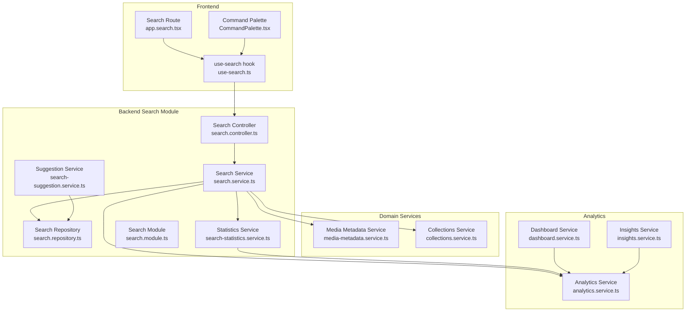

**Diagram sources**
- [search.controller.ts](file://apps/backend/src/search/search.controller.ts)
- [search.service.ts](file://apps/backend/src/search/search.service.ts)
- [search.repository.ts](file://apps/backend/src/search/search.repository.ts)
- [search-suggestion.service.ts](file://apps/backend/src/search/search-suggestion.service.ts)
- [search-statistics.service.ts](file://apps/backend/src/search/search-statistics.service.ts)
- [search.module.ts](file://apps/backend/src/search/search.module.ts)
- [use-search.ts](file://src/hooks/use-search.ts)
- [CommandPalette.tsx](file://src/components/search/CommandPalette.tsx)
- [app.search.tsx](file://src/routes/app.search.tsx)
- [media-metadata.service.ts](file://apps/backend/src/media/media-metadata.service.ts)
- [collections.service.ts](file://apps/backend/src/collections/collections.service.ts)
- [analytics.service.ts](file://apps/backend/src/analytics/analytics.service.ts)
- [dashboard.service.ts](file://apps/backend/src/analytics/dashboard.service.ts)
- [insights.service.ts](file://apps/backend/src/analytics/insights.service.ts)

**Section sources**
- [search.controller.ts](file://apps/backend/src/search/search.controller.ts)
- [search.service.ts](file://apps/backend/src/search/search.service.ts)
- [search.repository.ts](file://apps/backend/src/search/search.repository.ts)
- [search-suggestion.service.ts](file://apps/backend/src/search/search-suggestion.service.ts)
- [search-statistics.service.ts](file://apps/backend/src/search/search-statistics.service.ts)
- [search.module.ts](file://apps/backend/src/search/search.module.ts)
- [use-search.ts](file://src/hooks/use-search.ts)
- [CommandPalette.tsx](file://src/components/search/CommandPalette.tsx)
- [app.search.tsx](file://src/routes/app.search.tsx)
- [media-metadata.service.ts](file://apps/backend/src/media/media-metadata.service.ts)
- [collections.service.ts](file://apps/backend/src/collections/collections.service.ts)
- [analytics.service.ts](file://apps/backend/src/analytics/analytics.service.ts)
- [dashboard.service.ts](file://apps/backend/src/analytics/dashboard.service.ts)
- [insights.service.ts](file://apps/backend/src/analytics/insights.service.ts)

## Core Components
- Search Controller: Exposes endpoints for full-text search and suggestions, validates inputs, and returns paginated results.
- Search Service: Orchestrates queries across media and collections, applies filters, scoring, and enrichment with metadata.
- Search Repository: Implements data access patterns for search indexes or database-backed full-text queries.
- Suggestion Service: Generates autocomplete and trending suggestions based on recent queries and popularity signals.
- Statistics Service: Tracks search events, aggregates popular queries, and exposes metrics for dashboards.
- Frontend Hook and UI: use-search hook encapsulates API calls; CommandPalette and search route provide user interactions.

Key responsibilities:
- Full-text search across titles, descriptions, tags, and metadata fields.
- Suggestion generation with fuzzy matching and popularity weighting.
- Collection-aware search with smart collection filtering.
- Personalized ranking using user history and preferences.
- Analytics capture for search events and popular queries.

**Section sources**
- [search.controller.ts](file://apps/backend/src/search/search.controller.ts)
- [search.service.ts](file://apps/backend/src/search/search.service.ts)
- [search.repository.ts](file://apps/backend/src/search/search.repository.ts)
- [search-suggestion.service.ts](file://apps/backend/src/search/search-suggestion.service.ts)
- [search-statistics.service.ts](file://apps/backend/src/search/search-statistics.service.ts)
- [use-search.ts](file://src/hooks/use-search.ts)
- [CommandPalette.tsx](file://src/components/search/CommandPalette.tsx)
- [app.search.tsx](file://src/routes/app.search.tsx)

## Architecture Overview
The search architecture follows a layered approach:
- Presentation layer (frontend) interacts via REST endpoints.
- Controller layer handles request validation and response formatting.
- Service layer implements business logic, combining multiple data sources.
- Repository layer abstracts persistence and search index operations.
- Cross-cutting concerns include analytics, caching, and rate limiting.

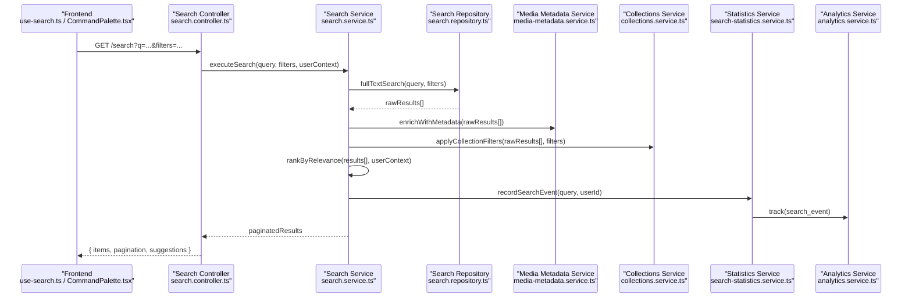

**Diagram sources**
- [search.controller.ts](file://apps/backend/src/search/search.controller.ts)
- [search.service.ts](file://apps/backend/src/search/search.service.ts)
- [search.repository.ts](file://apps/backend/src/search/search.repository.ts)
- [media-metadata.service.ts](file://apps/backend/src/media/media-metadata.service.ts)
- [collections.service.ts](file://apps/backend/src/collections/collections.service.ts)
- [search-statistics.service.ts](file://apps/backend/src/search/search-statistics.service.ts)
- [analytics.service.ts](file://apps/backend/src/analytics/analytics.service.ts)
- [use-search.ts](file://src/hooks/use-search.ts)
- [CommandPalette.tsx](file://src/components/search/CommandPalette.tsx)

## Detailed Component Analysis

### Full-Text Search Implementation
- Query parsing normalizes input, tokenizes terms, and builds search predicates.
- Indexing strategy supports multi-field full-text search across title, description, tags, and metadata attributes.
- Filtering supports categories, dates, status, and collection membership.
- Pagination ensures efficient result delivery.

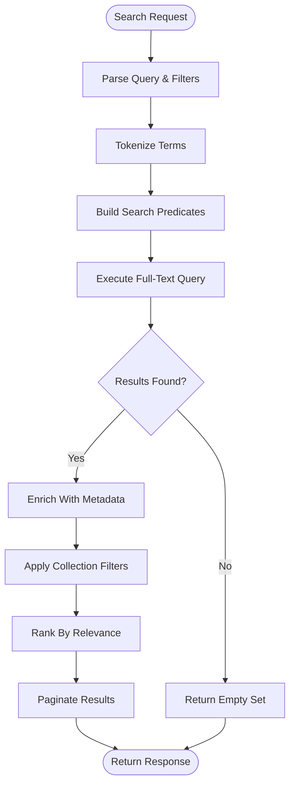

**Diagram sources**
- [search.service.ts](file://apps/backend/src/search/search.service.ts)
- [search.repository.ts](file://apps/backend/src/search/search.repository.ts)
- [media-metadata.service.ts](file://apps/backend/src/media/media-metadata.service.ts)
- [collections.service.ts](file://apps/backend/src/collections/collections.service.ts)

**Section sources**
- [search.service.ts](file://apps/backend/src/search/search.service.ts)
- [search.repository.ts](file://apps/backend/src/search/search.repository.ts)

### Suggestion Algorithms
- Autocomplete leverages prefix matching and fuzzy search over titles and tags.
- Trending suggestions incorporate recent query frequency and recency decay.
- Personalization weights suggestions by user’s historical interactions.

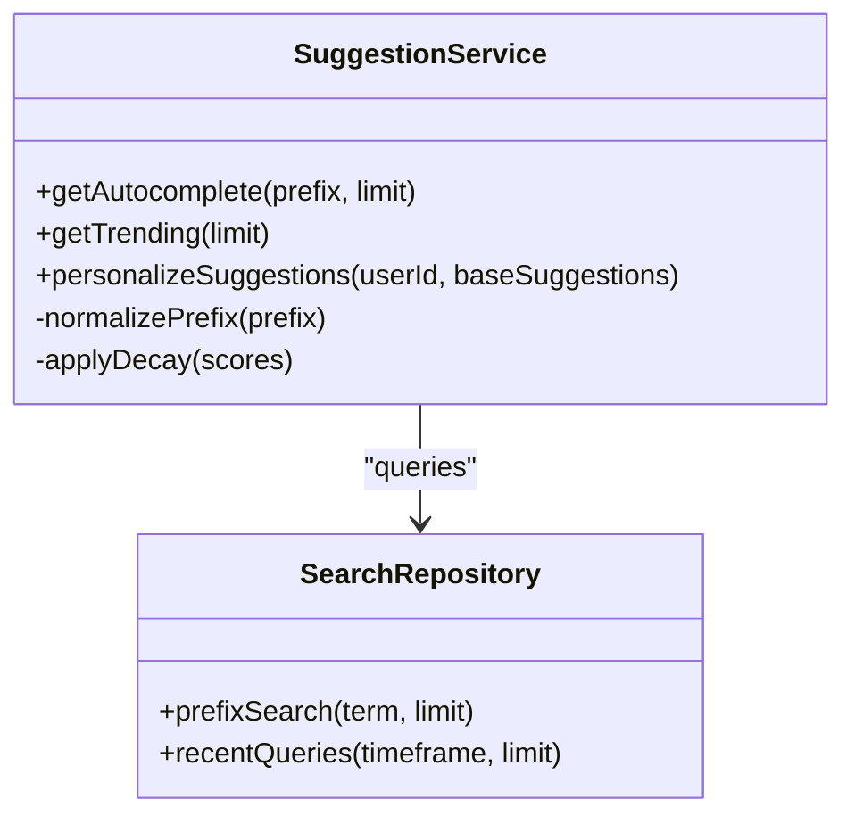

**Diagram sources**
- [search-suggestion.service.ts](file://apps/backend/src/search/search-suggestion.service.ts)
- [search.repository.ts](file://apps/backend/src/search/search.repository.ts)

**Section sources**
- [search-suggestion.service.ts](file://apps/backend/src/search/search-suggestion.service.ts)

### Content Discovery Mechanisms
- Discovery combines search results with related content from collections and metadata relationships.
- Smart collections enable dynamic grouping and filtering for curated experiences.
- Recommendations integrate user progress, favorites, and completion states.

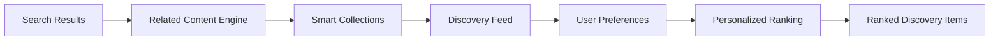

**Diagram sources**
- [collections.service.ts](file://apps/backend/src/collections/collections.service.ts)
- [search.service.ts](file://apps/backend/src/search/search.service.ts)

**Section sources**
- [collections.service.ts](file://apps/backend/src/collections/collections.service.ts)
- [search.service.ts](file://apps/backend/src/search/search.service.ts)

### Integration With Media Metadata
- Metadata enrichment adds genres, creators, release dates, and other attributes to search results.
- Faceted search uses metadata fields for filtering and sorting.
- Media-specific boosts improve relevance for exact matches and strong signals.

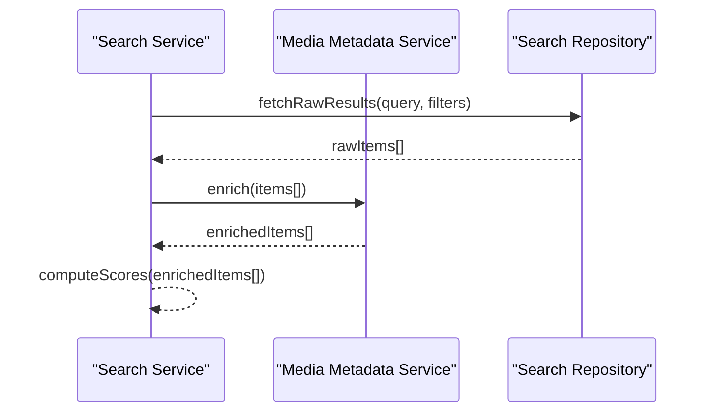

**Diagram sources**
- [search.service.ts](file://apps/backend/src/search/search.service.ts)
- [media-metadata.service.ts](file://apps/backend/src/media/media-metadata.service.ts)
- [search.repository.ts](file://apps/backend/src/search/search.repository.ts)

**Section sources**
- [media-metadata.service.ts](file://apps/backend/src/media/media-metadata.service.ts)
- [search.service.ts](file://apps/backend/src/search/search.service.ts)

### Collection Searches
- Collection-aware queries restrict results to specific collections or filter by collection properties.
- Smart collections dynamically update based on rules and user activity.
- Aggregation surfaces collection-level statistics alongside search results.

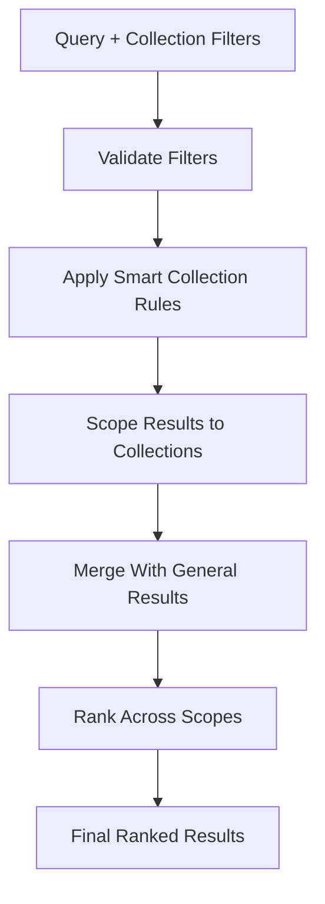

**Diagram sources**
- [collections.service.ts](file://apps/backend/src/collections/collections.service.ts)
- [search.service.ts](file://apps/backend/src/search/search.service.ts)

**Section sources**
- [collections.service.ts](file://apps/backend/src/collections/collections.service.ts)

### Personalized Recommendation Engines
- Personalization factors include watch/read history, bookmarks, ratings, and time spent.
- Recency and decay functions ensure fresh recommendations.
- Diversity constraints prevent repetitive suggestions.

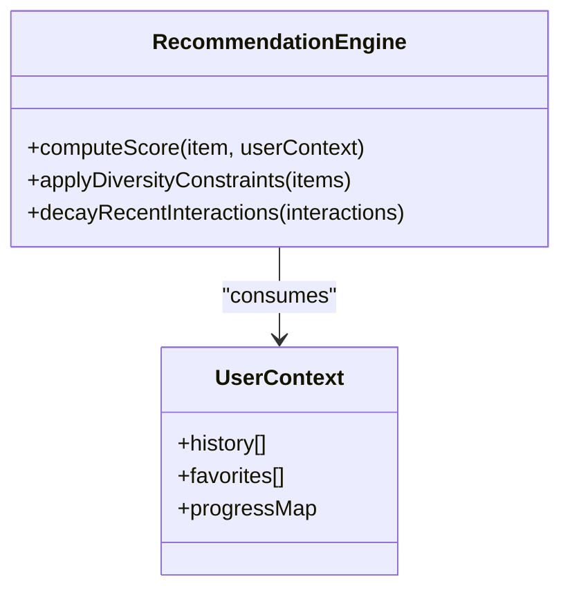

**Diagram sources**
- [search.service.ts](file://apps/backend/src/search/search.service.ts)

**Section sources**
- [search.service.ts](file://apps/backend/src/search/search.service.ts)

### Search Analytics and Popular Queries Tracking
- Search events are recorded with query text, user ID, timestamp, and result counts.
- Popular queries are aggregated over time windows with decay.
- Dashboard and insights services expose metrics for monitoring and reporting.

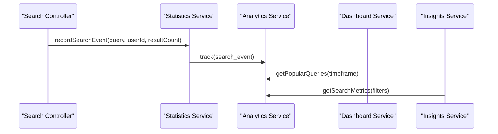

**Diagram sources**
- [search-statistics.service.ts](file://apps/backend/src/search/search-statistics.service.ts)
- [analytics.service.ts](file://apps/backend/src/analytics/analytics.service.ts)
- [dashboard.service.ts](file://apps/backend/src/analytics/dashboard.service.ts)
- [insights.service.ts](file://apps/backend/src/analytics/insights.service.ts)

**Section sources**
- [search-statistics.service.ts](file://apps/backend/src/search/search-statistics.service.ts)
- [analytics.service.ts](file://apps/backend/src/analytics/analytics.service.ts)
- [dashboard.service.ts](file://apps/backend/src/analytics/dashboard.service.ts)
- [insights.service.ts](file://apps/backend/src/analytics/insights.service.ts)

### Frontend Integration
- use-search hook centralizes search requests, caching, and error handling.
- CommandPalette provides quick access to search and suggestions.
- app.search.tsx renders search results and integrates with navigation.

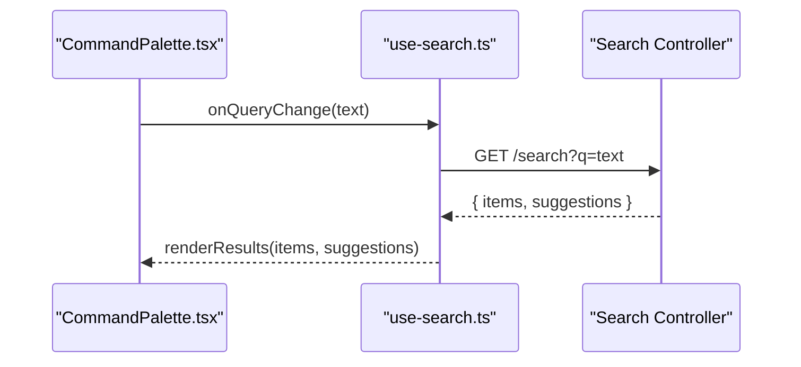

**Diagram sources**
- [CommandPalette.tsx](file://src/components/search/CommandPalette.tsx)
- [use-search.ts](file://src/hooks/use-search.ts)
- [search.controller.ts](file://apps/backend/src/search/search.controller.ts)

**Section sources**
- [use-search.ts](file://src/hooks/use-search.ts)
- [CommandPalette.tsx](file://src/components/search/CommandPalette.tsx)
- [app.search.tsx](file://src/routes/app.search.tsx)

## Dependency Analysis
The search module depends on domain services for metadata and collections, and on analytics for event tracking. The frontend depends on the search controller endpoints and the use-search hook.

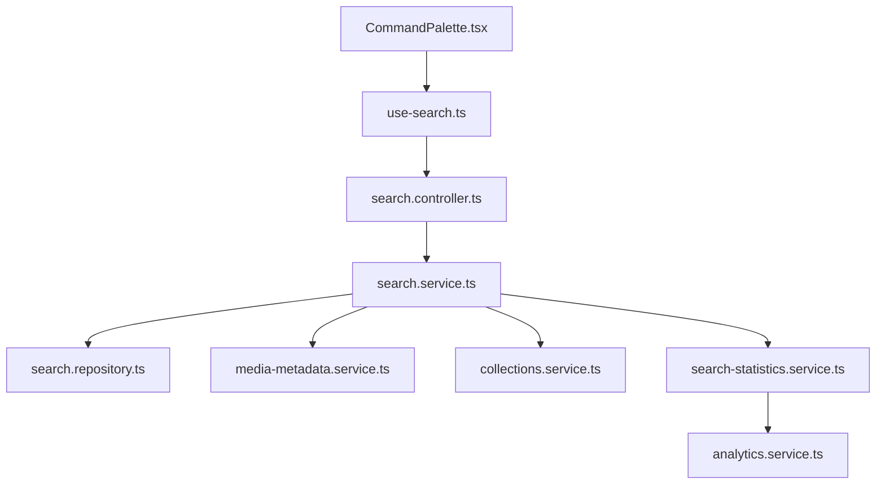

**Diagram sources**
- [search.controller.ts](file://apps/backend/src/search/search.controller.ts)
- [search.service.ts](file://apps/backend/src/search/search.service.ts)
- [search.repository.ts](file://apps/backend/src/search/search.repository.ts)
- [media-metadata.service.ts](file://apps/backend/src/media/media-metadata.service.ts)
- [collections.service.ts](file://apps/backend/src/collections/collections.service.ts)
- [search-statistics.service.ts](file://apps/backend/src/search/search-statistics.service.ts)
- [analytics.service.ts](file://apps/backend/src/analytics/analytics.service.ts)
- [use-search.ts](file://src/hooks/use-search.ts)
- [CommandPalette.tsx](file://src/components/search/CommandPalette.tsx)

**Section sources**
- [search.module.ts](file://apps/backend/src/search/search.module.ts)
- [search.controller.ts](file://apps/backend/src/search/search.controller.ts)
- [search.service.ts](file://apps/backend/src/search/search.service.ts)

## Performance Considerations
- Indexing: Use full-text indexes on frequently searched fields; consider composite indexes for common filter combinations.
- Caching: Cache frequent queries and suggestions with TTL; invalidate on content updates.
- Pagination: Implement cursor-based pagination for large result sets.
- Query Optimization: Avoid N+1 queries by batching metadata enrichment; use projections to minimize payload size.
- Rate Limiting: Protect endpoints against abuse and reduce load spikes.
- Asynchronous Processing: Offload heavy computations (e.g., personalization scoring) to background jobs where feasible.

[No sources needed since this section provides general guidance]

## Troubleshooting Guide
Common issues and resolutions:
- No results returned: Verify query normalization and tokenization; check index coverage for fields.
- Slow queries: Analyze execution plans; add or adjust indexes; paginate aggressively.
- Stale suggestions: Ensure cache invalidation on content changes; refresh trending queries periodically.
- Incorrect personalization: Validate user context propagation and interaction logs ingestion.
- Analytics gaps: Confirm event tracking is enabled and payloads are complete.

**Section sources**
- [search.service.ts](file://apps/backend/src/search/search.service.ts)
- [search-suggestion.service.ts](file://apps/backend/src/search/search-suggestion.service.ts)
- [search-statistics.service.ts](file://apps/backend/src/search/search-statistics.service.ts)
- [analytics.service.ts](file://apps/backend/src/analytics/analytics.service.ts)

## Conclusion
The search and discovery system integrates full-text search, suggestions, metadata enrichment, collection filtering, and personalized ranking within a modular NestJS architecture. Analytics capture enables continuous improvement through popular queries and performance metrics. Proper indexing, caching, and query optimization are essential for scalability and responsiveness.

[No sources needed since this section summarizes without analyzing specific files]

## Appendices
- API Endpoints: Refer to search.controller.ts for endpoint definitions and request/response shapes.
- Data Models: See search.repository.ts and domain services for entity structures used in search.
- Configuration: Review search.module.ts for dependency injection and feature flags.

**Section sources**
- [search.controller.ts](file://apps/backend/src/search/search.controller.ts)
- [search.repository.ts](file://apps/backend/src/search/search.repository.ts)
- [search.module.ts](file://apps/backend/src/search/search.module.ts)