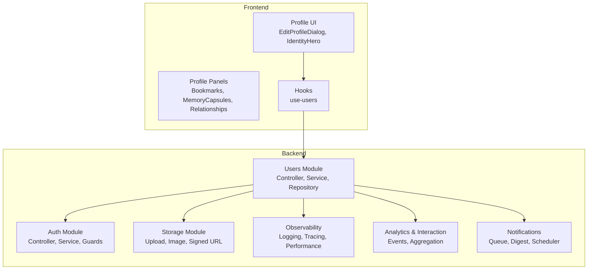
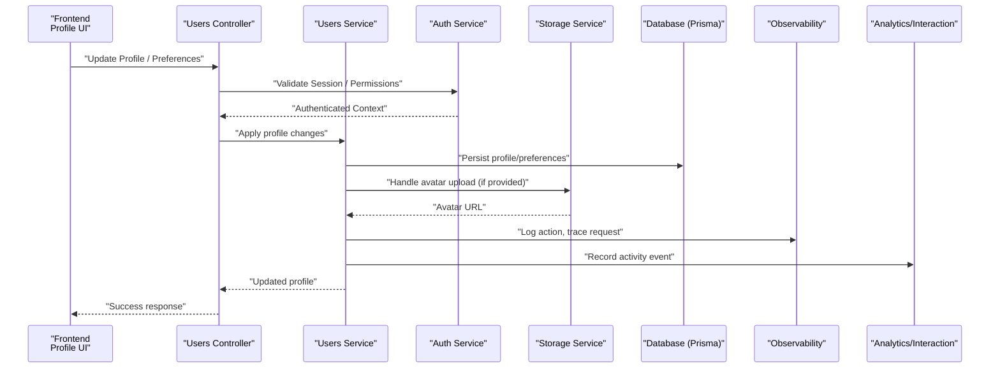
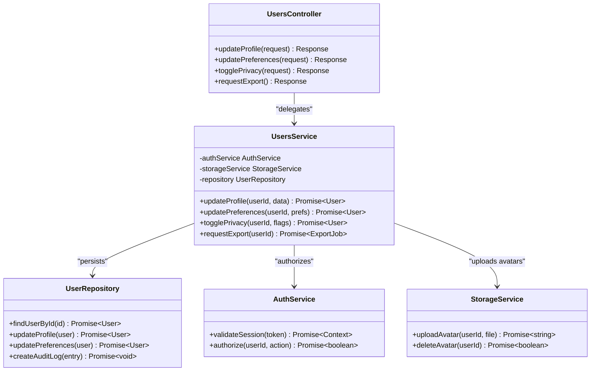
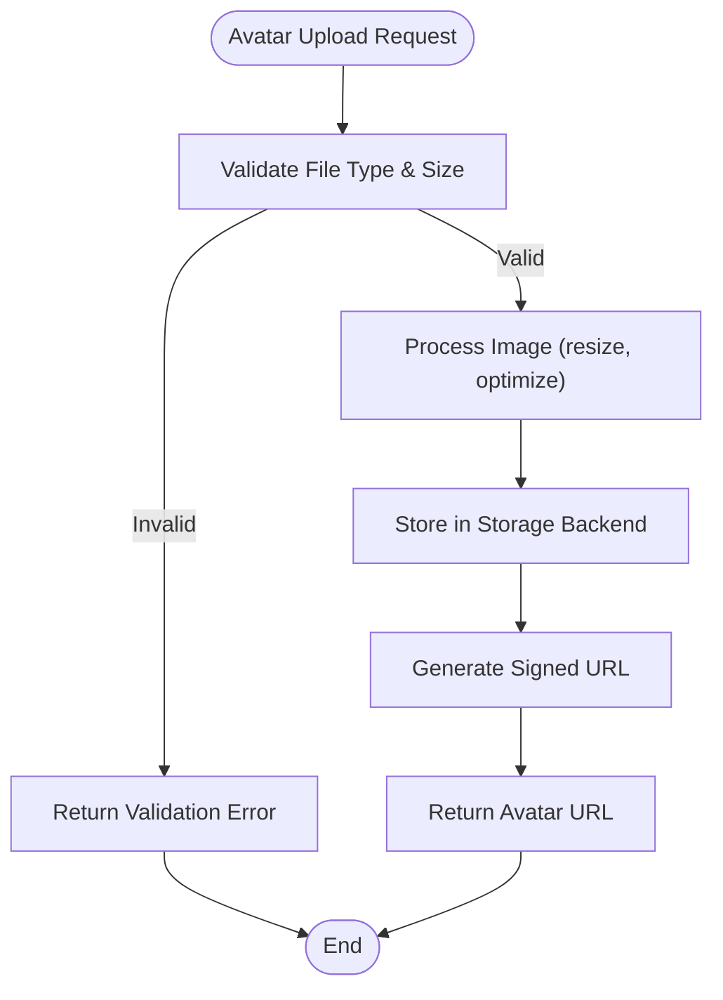
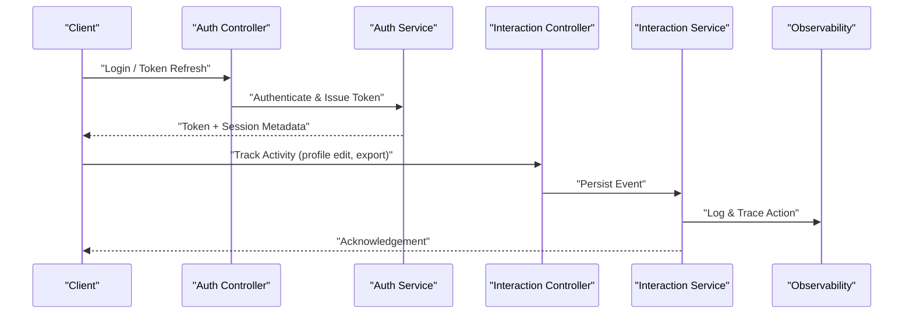
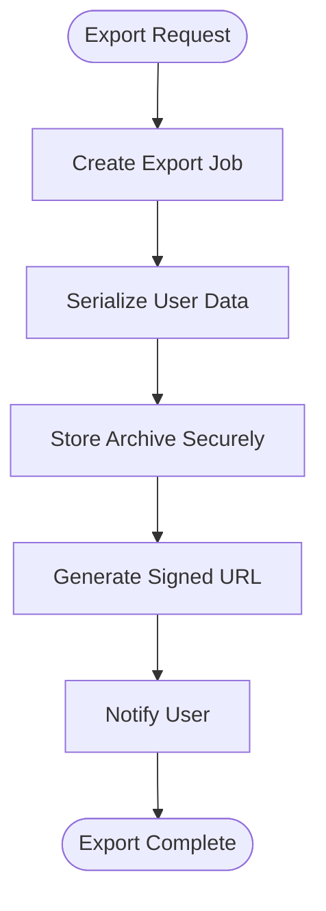
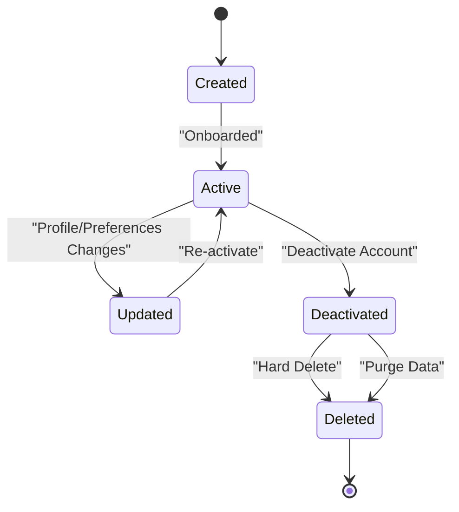
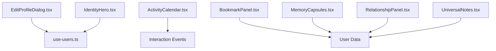
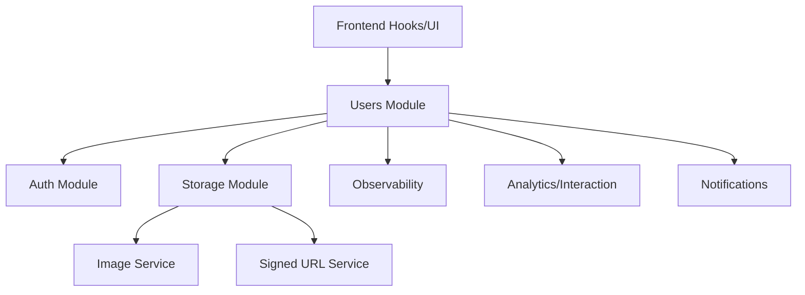

# User Management & Profiles

<cite>
**Referenced Files in This Document**
- [users.controller.ts](file://apps/backend/src/users/users.controller.ts)
- [users.service.ts](file://apps/backend/src/users/users.service.ts)
- [users.repository.ts](file://apps/backend/src/users/users.repository.ts)
- [users.module.ts](file://apps/backend/src/users/users.module.ts)
- [users.types.ts](file://apps/backend/src/users/users.types.ts)
- [auth.controller.ts](file://apps/backend/src/auth/auth.controller.ts)
- [auth.service.ts](file://apps/backend/src/auth/auth.service.ts)
- [auth.module.ts](file://apps/backend/src/auth/auth.module.ts)
- [storage.controller.ts](file://apps/backend/src/storage/storage.controller.ts)
- [storage.service.ts](file://apps/backend/src/storage/storage.service.ts)
- [image.service.ts](file://apps/backend/src/storage/image.service.ts)
- [upload.service.ts](file://apps/backend/src/storage/upload.service.ts)
- [signed-url.service.ts](file://apps/backend/src/storage/signed-url.service.ts)
- [media-cleanup.service.ts](file://apps/backend/src/storage/media-cleanup.service.ts)
- [schema.prisma](file://apps/backend/prisma/schema.prisma)
- [app.module.ts](file://apps/backend/src/app.module.ts)
- [main.ts](file://apps/backend/src/main.ts)
- [use-users.ts](file://src/hooks/use-users.ts)
- [EditProfileDialog.tsx](file://src/components/profile/EditProfileDialog.tsx)
- [IdentityHero.tsx](file://src/components/profile/IdentityHero.tsx)
- [ActivityCalendar.tsx](file://src/components/profile/ActivityCalendar.tsx)
- [BookmarkPanel.tsx](file://src/components/profile/BookmarkPanel.tsx)
- [MemoryCapsules.tsx](file://src/components/profile/MemoryCapsules.tsx)
- [RelationshipPanel.tsx](file://src/components/profile/RelationshipPanel.tsx)
- [UniversalNotes.tsx](file://src/components/profile/UniversalNotes.tsx)
- [analytics.controller.ts](file://apps/backend/src/analytics/analytics.controller.ts)
- [analytics.service.ts](file://apps/backend/src/analytics/analytics.service.ts)
- [interaction.controller.ts](file://apps/backend/src/interaction/interaction.controller.ts)
- [interaction.service.ts](file://apps/backend/src/interaction/interaction.service.ts)
- [notifications.controller.ts](file://apps/backend/src/notifications/notifications.controller.ts)
- [notifications.service.ts](file://apps/backend/src/notifications/notifications.service.ts)
- [logging.service.ts](file://apps/backend/src/observability/logging.service.ts)
- [tracing.service.ts](file://apps/backend/src/observability/tracing.service.ts)
- [performance.service.ts](file://apps/backend/src/observability/performance.service.ts)
</cite>

## Table of Contents
1. [Introduction](#introduction)
2. [Project Structure](#project-structure)
3. [Core Components](#core-components)
4. [Architecture Overview](#architecture-overview)
5. [Detailed Component Analysis](#detailed-component-analysis)
6. [Dependency Analysis](#dependency-analysis)
7. [Performance Considerations](#performance-considerations)
8. [Troubleshooting Guide](#troubleshooting-guide)
9. [Conclusion](#conclusion)
10. [Appendices](#appendices)

## Introduction
This document provides comprehensive documentation for the user management system, focusing on user profile management, preferences, privacy controls, audit logging, avatar management, session tracking, activity monitoring, data export, privacy compliance, and user data lifecycle management. It synthesizes backend services, controllers, repositories, storage integrations, observability, and frontend components to present a cohesive view of how users are created, authenticated, profiled, monitored, and managed throughout their lifecycle.

## Project Structure
The user management system spans multiple modules:
- Users module: Controllers, services, repositories, types, and DTOs for user operations.
- Auth module: Authentication endpoints, guards, strategies, and session handling.
- Storage module: Image processing, uploads, signed URLs, and media cleanup.
- Observability: Logging, tracing, and performance metrics.
- Analytics and Interaction: Activity tracking and event aggregation.
- Notifications: User notifications and digesting.
- Frontend hooks and UI components: Profile editing, identity display, bookmarks, memory capsules, relationships, and notes.

**Diagram sources**
- [users.controller.ts](file://apps/backend/src/users/users.controller.ts)
- [users.service.ts](file://apps/backend/src/users/users.service.ts)
- [users.repository.ts](file://apps/backend/src/users/users.repository.ts)
- [auth.controller.ts](file://apps/backend/src/auth/auth.controller.ts)
- [auth.service.ts](file://apps/backend/src/auth/auth.service.ts)
- [storage.controller.ts](file://apps/backend/src/storage/storage.controller.ts)
- [storage.service.ts](file://apps/backend/src/storage/storage.service.ts)
- [image.service.ts](file://apps/backend/src/storage/image.service.ts)
- [upload.service.ts](file://apps/backend/src/storage/upload.service.ts)
- [signed-url.service.ts](file://apps/backend/src/storage/signed-url.service.ts)
- [logging.service.ts](file://apps/backend/src/observability/logging.service.ts)
- [tracing.service.ts](file://apps/backend/src/observability/tracing.service.ts)
- [performance.service.ts](file://apps/backend/src/observability/performance.service.ts)
- [analytics.controller.ts](file://apps/backend/src/analytics/analytics.controller.ts)
- [interaction.controller.ts](file://apps/backend/src/interaction/interaction.controller.ts)
- [notifications.controller.ts](file://apps/backend/src/notifications/notifications.controller.ts)
- [EditProfileDialog.tsx](file://src/components/profile/EditProfileDialog.tsx)
- [IdentityHero.tsx](file://src/components/profile/IdentityHero.tsx)
- [use-users.ts](file://src/hooks/use-users.ts)

**Section sources**
- [users.module.ts](file://apps/backend/src/users/users.module.ts)
- [app.module.ts](file://apps/backend/src/app.module.ts)
- [main.ts](file://apps/backend/src/main.ts)

## Core Components
- Users Controller: Exposes endpoints for profile CRUD, preferences, privacy toggles, and export requests.
- Users Service: Orchestrates business logic, integrates with auth, storage, analytics, and observability.
- Users Repository: Data access layer for user entities, profiles, preferences, and related records.
- Auth Service: Handles authentication flows, token issuance, session validation, and integration points.
- Storage Services: Manage avatar uploads, image processing, signed URL generation, and cleanup.
- Observability: Centralized logging, tracing, and performance measurement for user actions.
- Analytics & Interaction: Record user activities, aggregate insights, and support dashboards.
- Notifications: Deliver user-centric alerts and digests.
- Frontend Hooks and UI: Provide profile editing experiences, preference panels, and activity views.

**Section sources**
- [users.controller.ts](file://apps/backend/src/users/users.controller.ts)
- [users.service.ts](file://apps/backend/src/users/users.service.ts)
- [users.repository.ts](file://apps/backend/src/users/users.repository.ts)
- [auth.controller.ts](file://apps/backend/src/auth/auth.controller.ts)
- [auth.service.ts](file://apps/backend/src/auth/auth.service.ts)
- [storage.controller.ts](file://apps/backend/src/storage/storage.controller.ts)
- [storage.service.ts](file://apps/backend/src/storage/storage.service.ts)
- [image.service.ts](file://apps/backend/src/storage/image.service.ts)
- [upload.service.ts](file://apps/backend/src/storage/upload.service.ts)
- [signed-url.service.ts](file://apps/backend/src/storage/signed-url.service.ts)
- [logging.service.ts](file://apps/backend/src/observability/logging.service.ts)
- [tracing.service.ts](file://apps/backend/src/observability/tracing.service.ts)
- [performance.service.ts](file://apps/backend/src/observability/performance.service.ts)
- [analytics.controller.ts](file://apps/backend/src/analytics/analytics.controller.ts)
- [interaction.controller.ts](file://apps/backend/src/interaction/interaction.controller.ts)
- [notifications.controller.ts](file://apps/backend/src/notifications/notifications.controller.ts)
- [EditProfileDialog.tsx](file://src/components/profile/EditProfileDialog.tsx)
- [IdentityHero.tsx](file://src/components/profile/IdentityHero.tsx)
- [use-users.ts](file://src/hooks/use-users.ts)

## Architecture Overview
The user management architecture follows a layered approach:
- Presentation Layer (Frontend): React components and hooks manage user interactions and state.
- API Layer (NestJS Controllers): Validate inputs, enforce authorization, and delegate to services.
- Business Logic (Services): Implement domain rules, orchestrate cross-cutting concerns (auth, storage, analytics).
- Data Access (Repositories): Encapsulate persistence via Prisma ORM.
- Cross-Cutting Concerns: Observability (logging, tracing), security (guards, decorators), caching, transactions.

**Diagram sources**
- [users.controller.ts](file://apps/backend/src/users/users.controller.ts)
- [users.service.ts](file://apps/backend/src/users/users.service.ts)
- [auth.service.ts](file://apps/backend/src/auth/auth.service.ts)
- [storage.service.ts](file://apps/backend/src/storage/storage.service.ts)
- [image.service.ts](file://apps/backend/src/storage/image.service.ts)
- [upload.service.ts](file://apps/backend/src/storage/upload.service.ts)
- [logging.service.ts](file://apps/backend/src/observability/logging.service.ts)
- [tracing.service.ts](file://apps/backend/src/observability/tracing.service.ts)
- [analytics.controller.ts](file://apps/backend/src/analytics/analytics.controller.ts)
- [interaction.controller.ts](file://apps/backend/src/interaction/interaction.controller.ts)
- [schema.prisma](file://apps/backend/prisma/schema.prisma)

## Detailed Component Analysis

### Users Module: Profile Management, Preferences, Privacy Controls
- Responsibilities:
  - Profile CRUD: Update name, bio, timezone, language, and other profile fields.
  - Preferences: Manage feature flags, notification settings, theme, and privacy toggles.
  - Privacy Controls: Toggle visibility of profile elements, control data sharing, and consent flags.
  - Export Requests: Initiate data export workflows for GDPR/CCPA compliance.
- Integration Points:
  - Auth service for authorization and context.
  - Storage service for avatar updates.
  - Observability for audit logging and tracing.
  - Analytics/Interaction for activity recording.
- Data Model:
  - User entity with profile attributes, preferences object, privacy flags, and timestamps.
  - Related tables for sessions, audit logs, and export jobs.

**Diagram sources**
- [users.controller.ts](file://apps/backend/src/users/users.controller.ts)
- [users.service.ts](file://apps/backend/src/users/users.service.ts)
- [users.repository.ts](file://apps/backend/src/users/users.repository.ts)
- [auth.service.ts](file://apps/backend/src/auth/auth.service.ts)
- [storage.service.ts](file://apps/backend/src/storage/storage.service.ts)

**Section sources**
- [users.controller.ts](file://apps/backend/src/users/users.controller.ts)
- [users.service.ts](file://apps/backend/src/users/users.service.ts)
- [users.repository.ts](file://apps/backend/src/users/users.repository.ts)
- [users.types.ts](file://apps/backend/src/users/users.types.ts)

### Avatar Management System
- Upload Flow:
  - Client sends multipart form or base64 payload.
  - Storage controller validates and delegates to upload service.
  - Image service processes/resizes images and stores them.
  - Signed URL service generates secure temporary links for retrieval.
- Cleanup:
  - Media cleanup service removes orphaned files and enforces retention policies.

**Diagram sources**
- [storage.controller.ts](file://apps/backend/src/storage/storage.controller.ts)
- [upload.service.ts](file://apps/backend/src/storage/upload.service.ts)
- [image.service.ts](file://apps/backend/src/storage/image.service.ts)
- [signed-url.service.ts](file://apps/backend/src/storage/signed-url.service.ts)
- [media-cleanup.service.ts](file://apps/backend/src/storage/media-cleanup.service.ts)

**Section sources**
- [storage.controller.ts](file://apps/backend/src/storage/storage.controller.ts)
- [storage.service.ts](file://apps/backend/src/storage/storage.service.ts)
- [image.service.ts](file://apps/backend/src/storage/image.service.ts)
- [upload.service.ts](file://apps/backend/src/storage/upload.service.ts)
- [signed-url.service.ts](file://apps/backend/src/storage/signed-url.service.ts)
- [media-cleanup.service.ts](file://apps/backend/src/storage/media-cleanup.service.ts)

### Session Tracking and User Activity Monitoring
- Session Tracking:
  - Auth service issues tokens and maintains session metadata.
  - Guards validate tokens and attach context to requests.
- Activity Monitoring:
  - Interaction controller captures events (profile views, edits, exports).
  - Analytics service aggregates events into insights and dashboards.
  - Observability services log and trace user actions for auditing.

**Diagram sources**
- [auth.controller.ts](file://apps/backend/src/auth/auth.controller.ts)
- [auth.service.ts](file://apps/backend/src/auth/auth.service.ts)
- [interaction.controller.ts](file://apps/backend/src/interaction/interaction.controller.ts)
- [interaction.service.ts](file://apps/backend/src/interaction/interaction.service.ts)
- [logging.service.ts](file://apps/backend/src/observability/logging.service.ts)
- [tracing.service.ts](file://apps/backend/src/observability/tracing.service.ts)

**Section sources**
- [auth.controller.ts](file://apps/backend/src/auth/auth.controller.ts)
- [auth.service.ts](file://apps/backend/src/auth/auth.service.ts)
- [interaction.controller.ts](file://apps/backend/src/interaction/interaction.controller.ts)
- [interaction.service.ts](file://apps/backend/src/interaction/interaction.service.ts)
- [logging.service.ts](file://apps/backend/src/observability/logging.service.ts)
- [tracing.service.ts](file://apps/backend/src/observability/tracing.service.ts)

### Data Export Capabilities and Privacy Compliance
- Export Workflow:
  - Users request export via profile endpoint.
  - Service creates an export job, serializes user data, and stores artifacts securely.
  - Signed URLs provide time-limited access to exported archives.
- Privacy Controls:
  - Preference toggles for data sharing, analytics participation, and notification channels.
  - Consent flags recorded in user profile and audit logs.
- Compliance:
  - Audit trails capture all export requests and access.
  - Retention policies ensure timely deletion upon request.

**Diagram sources**
- [users.controller.ts](file://apps/backend/src/users/users.controller.ts)
- [users.service.ts](file://apps/backend/src/users/users.service.ts)
- [signed-url.service.ts](file://apps/backend/src/storage/signed-url.service.ts)
- [logging.service.ts](file://apps/backend/src/observability/logging.service.ts)

**Section sources**
- [users.controller.ts](file://apps/backend/src/users/users.controller.ts)
- [users.service.ts](file://apps/backend/src/users/users.service.ts)
- [signed-url.service.ts](file://apps/backend/src/storage/signed-url.service.ts)
- [logging.service.ts](file://apps/backend/src/observability/logging.service.ts)

### User Data Lifecycle Management
- Creation:
  - Onboarding flow creates user, initializes default preferences, and sets privacy defaults.
- Updates:
  - Profile and preference updates are validated and persisted with audit entries.
- Deactivation:
  - Soft-delete or deactivation flags prevent active usage while preserving history.
- Deletion:
  - Hard delete purges personal data, revokes sessions, and cleans up storage artifacts.
- Retention:
  - Policies govern archival and deletion timelines based on compliance requirements.

**Diagram sources**
- [users.service.ts](file://apps/backend/src/users/users.service.ts)
- [users.repository.ts](file://apps/backend/src/users/users.repository.ts)
- [schema.prisma](file://apps/backend/prisma/schema.prisma)

**Section sources**
- [users.service.ts](file://apps/backend/src/users/users.service.ts)
- [users.repository.ts](file://apps/backend/src/users/users.repository.ts)
- [schema.prisma](file://apps/backend/prisma/schema.prisma)

### Frontend Profile Customization Options
- Edit Profile Dialog:
  - Allows users to update name, bio, timezone, language, and avatar.
  - Integrates with use-users hook for optimistic updates and error handling.
- Identity Hero:
  - Displays current profile summary and quick actions.
- Activity Calendar:
  - Visualizes user activity over time using interaction events.
- Bookmark Panel:
  - Manages saved items and quick access lists.
- Memory Capsules:
  - Curated collections of memories tied to user timeline.
- Relationship Panel:
  - Shows connections between users and entities.
- Universal Notes:
  - Personal notes attached to profile or specific items.

**Diagram sources**
- [EditProfileDialog.tsx](file://src/components/profile/EditProfileDialog.tsx)
- [use-users.ts](file://src/hooks/use-users.ts)
- [IdentityHero.tsx](file://src/components/profile/IdentityHero.tsx)
- [ActivityCalendar.tsx](file://src/components/profile/ActivityCalendar.tsx)
- [BookmarkPanel.tsx](file://src/components/profile/BookmarkPanel.tsx)
- [MemoryCapsules.tsx](file://src/components/profile/MemoryCapsules.tsx)
- [RelationshipPanel.tsx](file://src/components/profile/RelationshipPanel.tsx)
- [UniversalNotes.tsx](file://src/components/profile/UniversalNotes.tsx)

**Section sources**
- [EditProfileDialog.tsx](file://src/components/profile/EditProfileDialog.tsx)
- [use-users.ts](file://src/hooks/use-users.ts)
- [IdentityHero.tsx](file://src/components/profile/IdentityHero.tsx)
- [ActivityCalendar.tsx](file://src/components/profile/ActivityCalendar.tsx)
- [BookmarkPanel.tsx](file://src/components/profile/BookmarkPanel.tsx)
- [MemoryCapsules.tsx](file://src/components/profile/MemoryCapsules.tsx)
- [RelationshipPanel.tsx](file://src/components/profile/RelationshipPanel.tsx)
- [UniversalNotes.tsx](file://src/components/profile/UniversalNotes.tsx)

## Dependency Analysis
Key dependencies and relationships:
- Users module depends on Auth, Storage, Observability, Analytics, and Notification modules.
- Storage module depends on image processing and signed URL generation utilities.
- Observability services are used across controllers and services for consistent logging and tracing.
- Frontend hooks depend on backend APIs exposed by controllers.

**Diagram sources**
- [users.module.ts](file://apps/backend/src/users/users.module.ts)
- [auth.module.ts](file://apps/backend/src/auth/auth.module.ts)
- [storage.module.ts](file://apps/backend/src/storage/storage.module.ts)
- [app.module.ts](file://apps/backend/src/app.module.ts)

**Section sources**
- [users.module.ts](file://apps/backend/src/users/users.module.ts)
- [auth.module.ts](file://apps/backend/src/auth/auth.module.ts)
- [storage.module.ts](file://apps/backend/src/storage/storage.module.ts)
- [app.module.ts](file://apps/backend/src/app.module.ts)

## Performance Considerations
- Avatar Processing:
  - Use async queues for heavy image processing to avoid blocking requests.
  - Cache generated thumbnails and signed URLs where appropriate.
- Database Queries:
  - Optimize profile reads/writes with selective field projection and indexes.
  - Batch preference updates to reduce transaction overhead.
- Observability Overhead:
  - Sample logs and traces for high-frequency events to minimize impact.
- Export Jobs:
  - Offload serialization and archive creation to background workers.
  - Stream large datasets to avoid memory spikes.

[No sources needed since this section provides general guidance]

## Troubleshooting Guide
Common issues and resolutions:
- Profile Update Failures:
  - Validate input schemas and check authorization context.
  - Inspect database constraints and unique indexes.
- Avatar Upload Errors:
  - Verify file type and size limits; check storage backend connectivity.
  - Review image processing logs for unsupported formats.
- Export Job Delays:
  - Check queue health and worker availability.
  - Monitor disk space and storage quotas.
- Activity Tracking Gaps:
  - Ensure interaction events are emitted consistently.
  - Validate observability pipelines for dropped logs.

**Section sources**
- [users.controller.ts](file://apps/backend/src/users/users.controller.ts)
- [users.service.ts](file://apps/backend/src/users/users.service.ts)
- [storage.controller.ts](file://apps/backend/src/storage/storage.controller.ts)
- [logging.service.ts](file://apps/backend/src/observability/logging.service.ts)
- [tracing.service.ts](file://apps/backend/src/observability/tracing.service.ts)

## Conclusion
The user management system provides robust profile management, preference handling, privacy controls, and comprehensive audit logging. It integrates seamlessly with authentication, storage, observability, analytics, and notifications to deliver a secure and compliant user experience. The modular architecture supports scalability, maintainability, and extensibility for future enhancements.

[No sources needed since this section summarizes without analyzing specific files]

## Appendices
- Data Model Reference:
  - User, Profile, Preferences, PrivacyFlags, Sessions, AuditLogs, ExportJobs.
- API Endpoints:
  - Profile CRUD, Preferences Update, Privacy Toggles, Export Requests.
- Security Practices:
  - Token-based authentication, role-based authorization, input validation, and secure storage.

[No sources needed since this section provides general reference material]