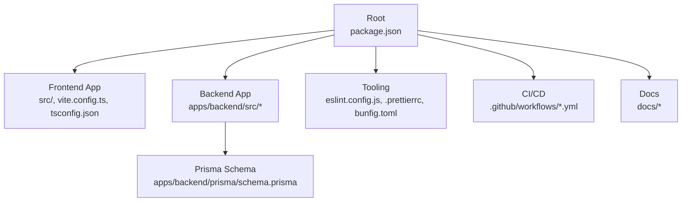
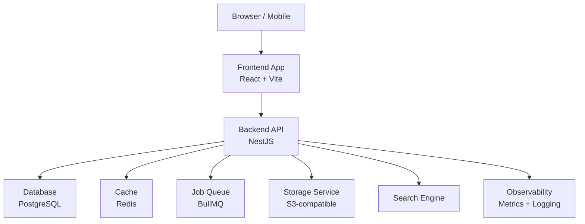
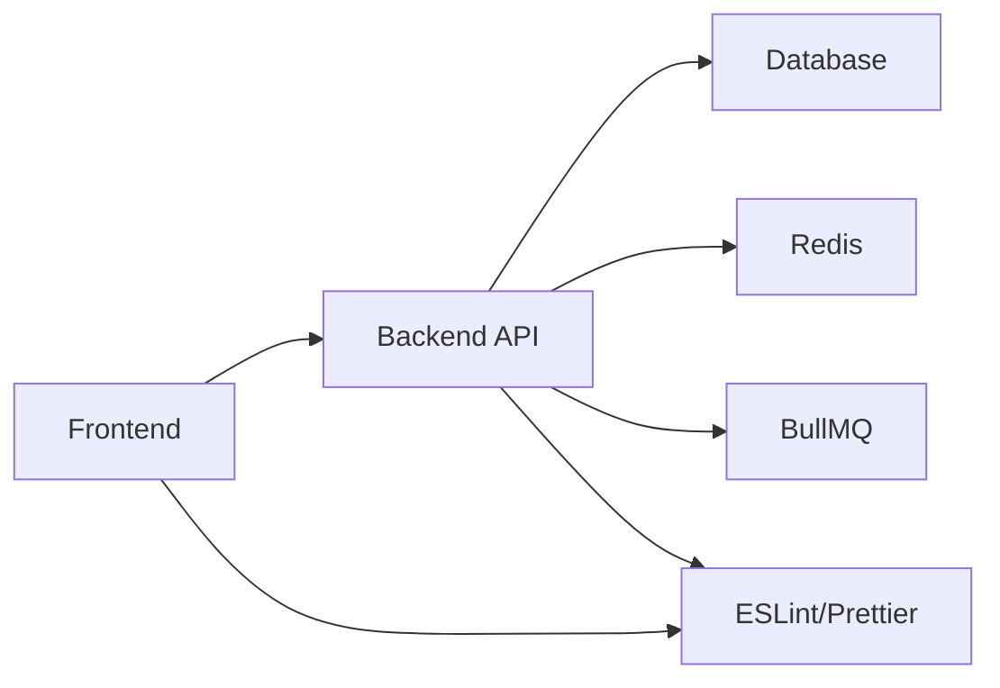

# Contributing Guide

<cite>
**Referenced Files in This Document**
- [README.md](file://README.md)
- [package.json](file://package.json)
- [eslint.config.js](file://eslint.config.js)
- [.prettierrc](file://.prettierrc)
- [.prettierignore](file://.prettierignore)
- [apps/backend/package.json](file://apps/backend/package.json)
- [apps/backend/eslint.config.mjs](file://apps/backend/eslint.config.mjs)
- [apps/backend/.prettierrc](file://apps/backend/.prettierrc)
- [apps/backend/lint-staged.config.mjs](file://apps/backend/lint-staged.config.mjs)
- [tsconfig.json](file://tsconfig.json)
- [bunfig.toml](file://bunfig.toml)
- [.github/workflows/ci.yml](file://.github/workflows/ci.yml)
- [.github/workflows/release.yml](file://.github/workflows/release.yml)
- [DEPLOYMENT-GUIDE.md](file://DEPLOYMENT-GUIDE.md)
- [docs/README.md](file://docs/README.md)
- [docs/SECURITY.md](file://docs/SECURITY.md)
- [tests/e2e.test.ts](file://tests/e2e.test.ts)
- [tests/setup.ts](file://tests/setup.ts)
- [apps/backend/prisma/schema.prisma](file://apps/backend/prisma/schema.prisma)
</cite>

## Table of Contents
1. [Introduction](#introduction)
2. [Project Structure](#project-structure)
3. [Core Components](#core-components)
4. [Architecture Overview](#architecture-overview)
5. [Detailed Component Analysis](#detailed-component-analysis)
6. [Dependency Analysis](#dependency-analysis)
7. [Performance Considerations](#performance-considerations)
8. [Troubleshooting Guide](#troubleshooting-guide)
9. [Conclusion](#conclusion)
10. [Appendices](#appendices)

## Introduction
This Contributing Guide explains how to set up the development environment, follow coding standards with ESLint and Prettier, use Git workflows and branching strategies, write commits and pull requests, perform code reviews, run tests, and maintain documentation. It also provides templates for issues and pull requests and guidance for reporting bugs and requesting features.

## Project Structure
Chronicle Your Media Story is a monorepo with:
- Root frontend application (Vite + React + TypeScript)
- Backend NestJS application under apps/backend
- Shared tooling at the root (ESLint, Prettier, Bun config, TS config)
- GitHub Actions CI/CD under .github/workflows
- Documentation under docs

**Diagram sources**
- [package.json](file://package.json)
- [eslint.config.js](file://eslint.config.js)
- [.prettierrc](file://.prettierrc)
- [bunfig.toml](file://bunfig.toml)
- [.github/workflows/ci.yml](file://.github/workflows/ci.yml)
- [apps/backend/package.json](file://apps/backend/package.json)
- [apps/backend/eslint.config.mjs](file://apps/backend/eslint.config.mjs)
- [apps/backend/.prettierrc](file://apps/backend/.prettierrc)
- [apps/backend/prisma/schema.prisma](file://apps/backend/prisma/schema.prisma)

**Section sources**
- [README.md](file://README.md)
- [package.json](file://package.json)
- [docs/README.md](file://docs/README.md)

## Core Components
- Frontend: Vite-based React app with TypeScript, organized by feature directories under src/components, src/routes, src/hooks, src/lib.
- Backend: NestJS application with modules per domain (auth, media, collections, etc.), Prisma ORM, BullMQ queues, Redis caching, and observability services.
- Tooling: ESLint and Prettier configured at both root and backend; lint-staged hooks in backend; Bun runtime configuration.
- CI/CD: GitHub Actions for continuous integration and release automation.

Key responsibilities:
- Frontend handles UI, routing, state hooks, API integrations, and analytics.
- Backend exposes REST APIs, manages data via Prisma, processes background jobs, and integrates with storage and search.
- Shared tooling enforces consistent code style and quality across the repo.

**Section sources**
- [package.json](file://package.json)
- [apps/backend/package.json](file://apps/backend/package.json)
- [eslint.config.js](file://eslint.config.js)
- [apps/backend/eslint.config.mjs](file://apps/backend/eslint.config.mjs)
- [.prettierrc](file://.prettierrc)
- [apps/backend/.prettierrc](file://apps/backend/.prettierrc)

## Architecture Overview
High-level architecture shows client-server interaction, background processing, and persistence layers.

[No sources needed since this diagram shows conceptual workflow, not actual code structure]

## Detailed Component Analysis

### Development Environment Setup
- Install dependencies using the project’s package manager as defined in the root package.json scripts.
- Configure the runtime environment using bunfig.toml and TypeScript settings from tsconfig.json.
- For the backend, initialize the database schema using Prisma and ensure environment variables are set as required by the NestJS configuration.

Recommended steps:
- Install dependencies at the root and in apps/backend.
- Start the dev server for the frontend and backend concurrently if supported by scripts.
- Ensure local services like Redis and PostgreSQL are running or use provided Docker Compose files.

**Section sources**
- [package.json](file://package.json)
- [bunfig.toml](file://bunfig.toml)
- [tsconfig.json](file://tsconfig.json)
- [apps/backend/package.json](file://apps/backend/package.json)
- [apps/backend/prisma/schema.prisma](file://apps/backend/prisma/schema.prisma)

### Coding Standards and Style Guidelines
- Linting: ESLint is configured at the root and in the backend. Use the provided configs to enforce consistent rules across the codebase.
- Formatting: Prettier is configured at the root and in the backend. Run formatting before committing changes.
- Hooks: The backend includes lint-staged configuration to automatically format and lint staged files.

Guidelines:
- Always run linters and formatters locally before pushing.
- Follow TypeScript best practices and strict mode where applicable.
- Keep imports organized and avoid circular dependencies.

**Section sources**
- [eslint.config.js](file://eslint.config.js)
- [apps/backend/eslint.config.mjs](file://apps/backend/eslint.config.mjs)
- [.prettierrc](file://.prettierrc)
- [apps/backend/.prettierrc](file://apps/backend/.prettierrc)
- [apps/backend/lint-staged.config.mjs](file://apps/backend/lint-staged.config.mjs)

### Git Workflow and Branching Strategy
- Main branch: Protect main/master; all changes go through pull requests.
- Feature branches: Create feature/<short-description> branches for new functionality.
- Bug fixes: Use fix/<short-description> branches.
- Releases: Tag releases following semantic versioning; automate via CI/CD.

Commit conventions:
- Use conventional commits (feat:, fix:, chore:, docs:, refactor:, test:).
- Keep commits atomic and descriptive.

Pull request process:
- Open PRs against main with clear descriptions and linked issues.
- Require passing CI checks and at least one review.
- Squash and merge after approval.

**Section sources**
- [.github/workflows/ci.yml](file://.github/workflows/ci.yml)
- [.github/workflows/release.yml](file://.github/workflows/release.yml)

### Code Review Procedures
- Reviewers should verify correctness, performance, security, and adherence to standards.
- Request changes when necessary; approve only when confident.
- Address feedback promptly and update PRs accordingly.

Best practices:
- Keep PRs small and focused.
- Provide context and rationale in PR descriptions.
- Link related issues and tests.

[No sources needed since this section doesn't analyze specific files]

### Testing Requirements
- Unit tests: Write tests for services, utilities, and components as appropriate.
- Integration tests: Validate API endpoints and database interactions.
- End-to-end tests: Use Playwright or similar tools for critical user flows.
- Visual regression tests: Baseline images under tests/visual/baselines can be used to detect UI changes.

Test execution:
- Run unit and integration tests via npm/yarn/pnpm scripts defined in package.json.
- Run e2e tests using the provided script in tests/e2e.test.ts.

**Section sources**
- [tests/e2e.test.ts](file://tests/e2e.test.ts)
- [tests/setup.ts](file://tests/setup.ts)
- [package.json](file://package.json)

### Documentation Standards
- Update README and relevant docs when adding features or changing behavior.
- Maintain inline comments for complex logic.
- Keep API contracts and data models documented alongside Prisma schemas.

**Section sources**
- [docs/README.md](file://docs/README.md)
- [apps/backend/prisma/schema.prisma](file://apps/backend/prisma/schema.prisma)

### Adding New Features
Steps:
- Create a feature branch from main.
- Implement changes with tests and updated documentation.
- Ensure linting, formatting, and tests pass.
- Submit a PR with a clear description and screenshots if applicable.

Backward compatibility:
- Avoid breaking API changes unless planned for a major version.
- Use migrations for database schema changes and ensure rollback plans.

**Section sources**
- [apps/backend/prisma/schema.prisma](file://apps/backend/prisma/schema.prisma)

### Modifying Existing Functionality
- Identify affected modules and update tests accordingly.
- Verify no regressions in dependent features.
- Document deprecations and migration paths.

[No sources needed since this section doesn't analyze specific files]

### Maintaining Backward Compatibility
- Prefer additive changes over destructive ones.
- Introduce feature flags for risky changes.
- Provide deprecation notices and timelines.

[No sources needed since this section doesn't analyze specific files]

### Reporting Bugs and Requesting Features
- Use the issue template to report bugs with steps to reproduce, expected vs actual behavior, and environment details.
- For feature requests, describe the problem, proposed solution, and benefits.

Security concerns:
- Refer to SECURITY.md for responsible disclosure procedures.

**Section sources**
- [docs/SECURITY.md](file://docs/SECURITY.md)

### Templates

Issue Report Template:
- Title: Clear and concise summary
- Description: What happened and what you expected
- Steps to Reproduce: Numbered list
- Environment: OS, browser, Node/Bun version
- Logs/Screenshots: Attach relevant artifacts

Pull Request Template:
- Title: feat/fix/chore: short description
- Changes: Bullet points of modifications
- Tests: How to run and verify
- Breaking Changes: Yes/No with details
- Related Issues: Links to issues

[No sources needed since this section doesn't analyze specific files]

## Dependency Analysis
The repository uses a layered dependency model:
- Frontend depends on backend APIs and shared libraries.
- Backend depends on Prisma, Redis, and external services.
- Tooling dependencies are centralized at the root and mirrored in the backend.

**Diagram sources**
- [package.json](file://package.json)
- [apps/backend/package.json](file://apps/backend/package.json)
- [eslint.config.js](file://eslint.config.js)
- [apps/backend/eslint.config.mjs](file://apps/backend/eslint.config.mjs)

**Section sources**
- [package.json](file://package.json)
- [apps/backend/package.json](file://apps/backend/package.json)

## Performance Considerations
- Optimize frontend bundle size and lazy-load routes.
- Use caching strategies in the backend for frequently accessed data.
- Profile database queries and add indexes where necessary.
- Monitor metrics and logs to identify bottlenecks.

[No sources needed since this section provides general guidance]

## Troubleshooting Guide
Common issues:
- Linting/formatting failures: Re-run formatters and resolve rule violations.
- Database migration errors: Check Prisma schema and migration history.
- Test failures: Inspect logs and environment setup.

Debugging tips:
- Enable verbose logging in development.
- Use Docker Compose for consistent local environments.
- Consult DEPLOYMENT-GUIDE.md for operational procedures.

**Section sources**
- [DEPLOYMENT-GUIDE.md](file://DEPLOYMENT-GUIDE.md)

## Conclusion
By following this guide, contributors can set up the environment, adhere to coding standards, collaborate effectively using Git workflows, and maintain high-quality code through testing and documentation. Consistent practices ensure a smooth development experience and reliable releases.

[No sources needed since this section summarizes without analyzing specific files]

## Appendices

### Quick Commands
- Install dependencies: See scripts in package.json
- Run linter: See scripts in package.json
- Format code: See scripts in package.json
- Run tests: See scripts in package.json
- Start backend: See scripts in apps/backend/package.json

**Section sources**
- [package.json](file://package.json)
- [apps/backend/package.json](file://apps/backend/package.json)