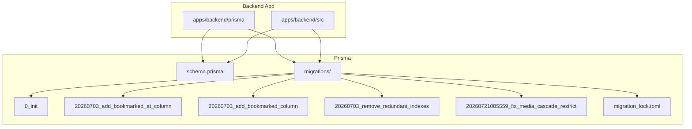
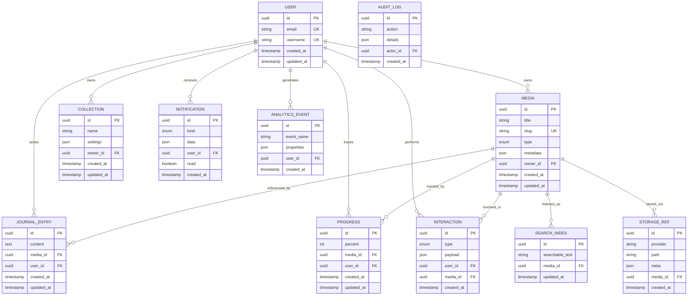
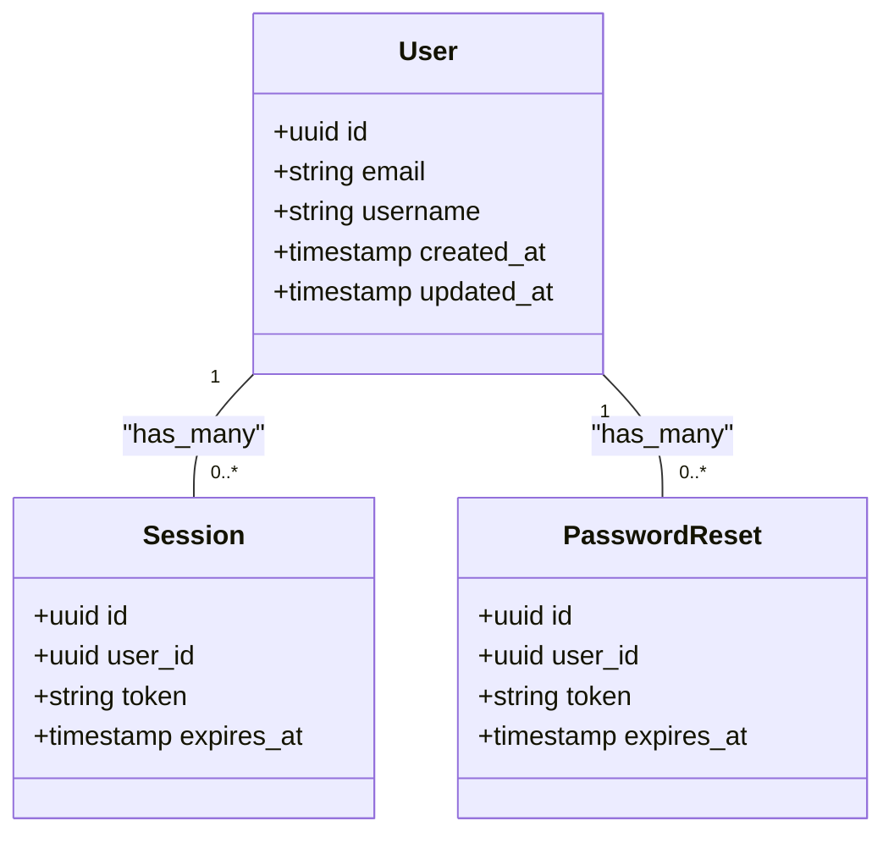
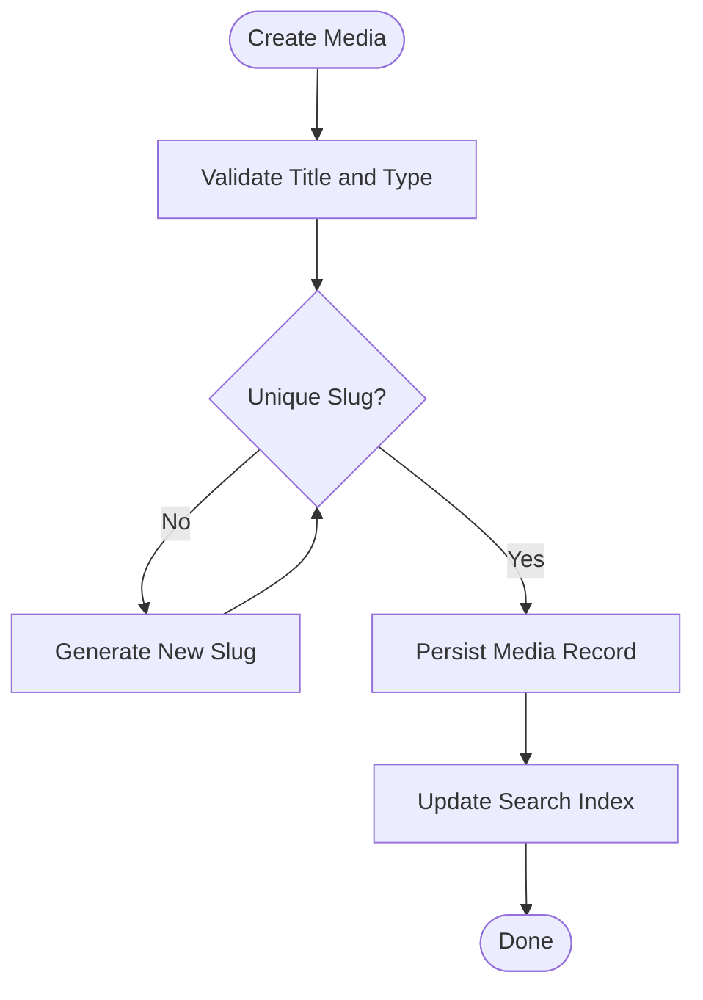
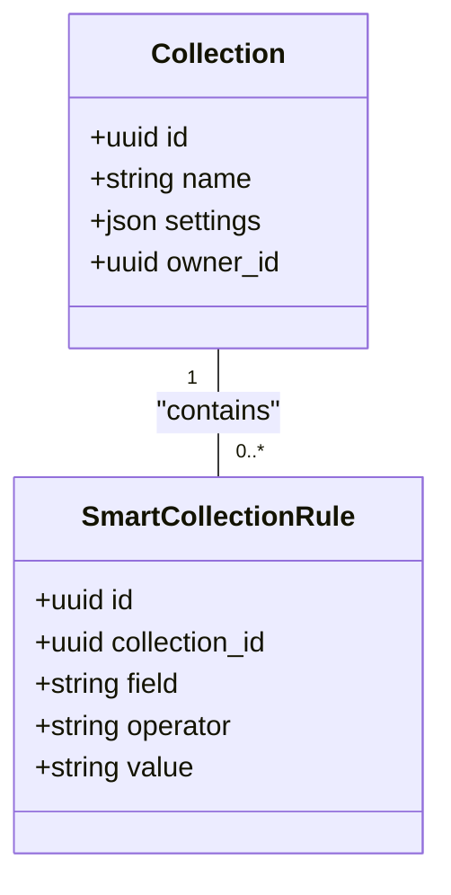
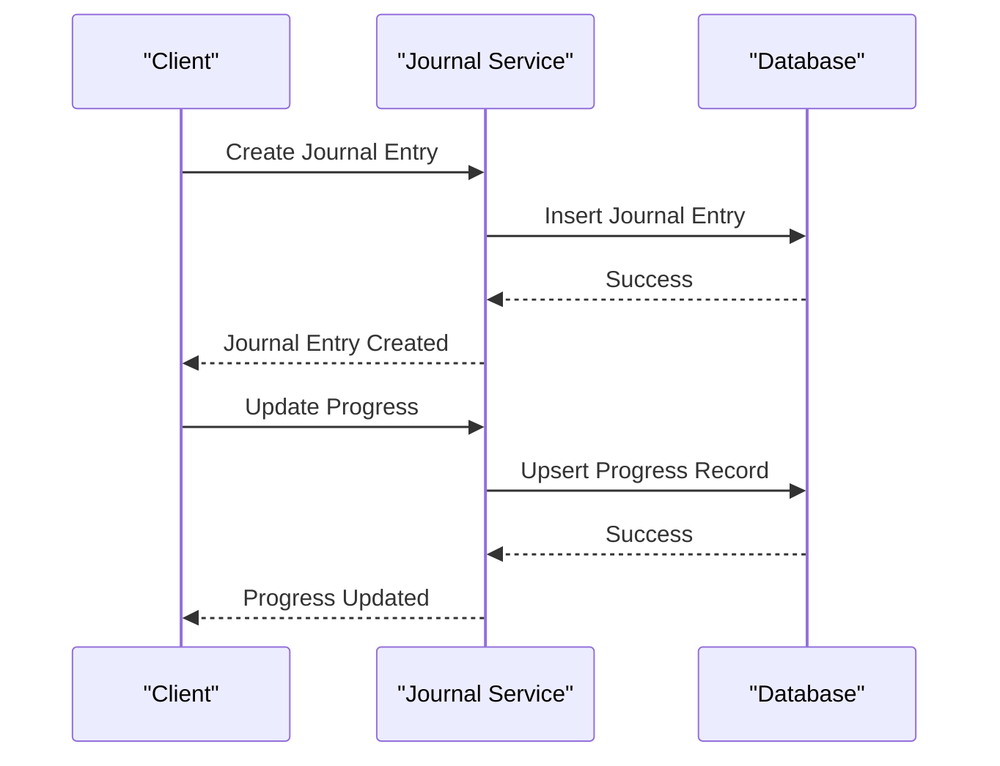
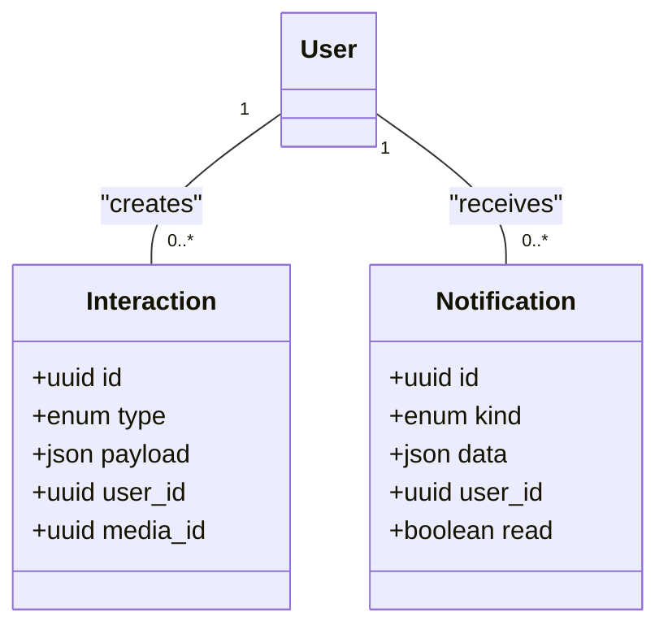
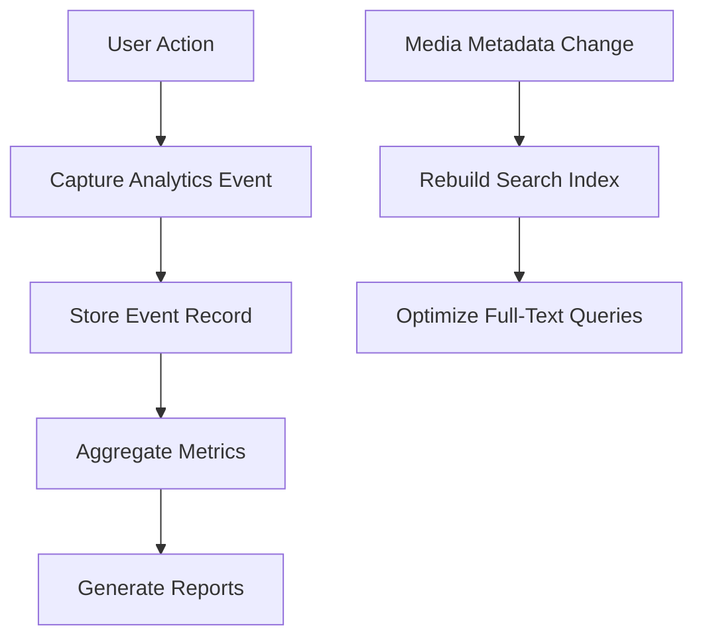
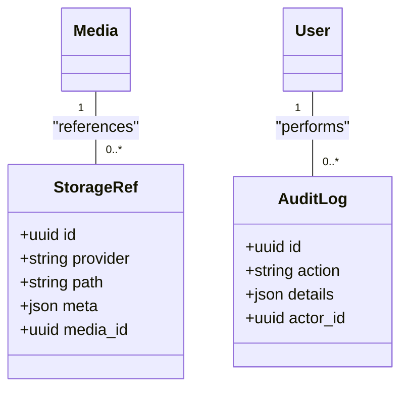
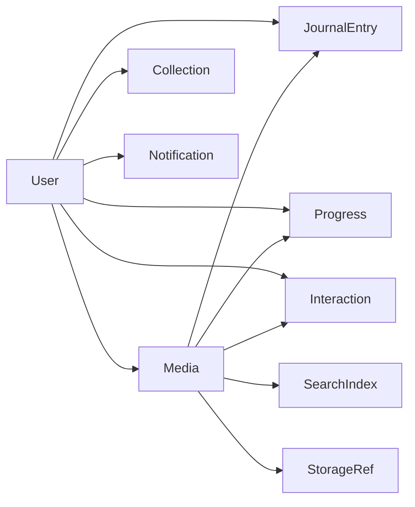

# Database Schema

<cite>
**Referenced Files in This Document**
- [schema.prisma](file://apps/backend/prisma/schema.prisma)
- [migration_lock.toml](file://apps/backend/prisma/migrations/migration_lock.toml)
- [0_init](file://apps/backend/prisma/migrations/0_init)
- [20260703_add_bookmarked_at_column](file://apps/backend/prisma/migrations/20260703_add_bookmarked_at_column)
- [20260703_add_bookmarked_column](file://apps/backend/prisma/migrations/20260703_add_bookmarked_column)
- [20260703_remove_redundant_indexes](file://apps/backend/prisma/migrations/20260703_remove_redundant_indexes)
- [20260721005559_fix_media_cascade_restrict](file://apps/backend/prisma/migrations/20260721005559_fix_media_cascade_restrict)
</cite>

## Table of Contents
1. [Introduction](#introduction)
2. [Project Structure](#project-structure)
3. [Core Components](#core-components)
4. [Architecture Overview](#architecture-overview)
5. [Detailed Component Analysis](#detailed-component-analysis)
6. [Dependency Analysis](#dependency-analysis)
7. [Performance Considerations](#performance-considerations)
8. [Troubleshooting Guide](#troubleshooting-guide)
9. [Conclusion](#conclusion)
10. [Appendices](#appendices)

## Introduction
This document provides comprehensive database schema documentation for the Prisma ORM model used by the application. It covers entity relationships, field definitions, data types, constraints, primary and foreign key relationships, indexes, query optimization strategies, migration strategy, version management, data lifecycle policies, sample queries, performance considerations, validation rules, business constraints, and security considerations including encryption and access control patterns.

## Project Structure
The database schema is defined using Prisma in a single schema file under the backend application. Migrations are stored in a dedicated directory with timestamped folders representing each schema change. The migration lock file ensures deterministic dependency resolution across environments.

**Diagram sources**
- [schema.prisma](file://apps/backend/prisma/schema.prisma)
- [migration_lock.toml](file://apps/backend/prisma/migrations/migration_lock.toml)
- [0_init](file://apps/backend/prisma/migrations/0_init)
- [20260703_add_bookmarked_at_column](file://apps/backend/prisma/migrations/20260703_add_bookmarked_at_column)
- [20260703_add_bookmarked_column](file://apps/backend/prisma/migrations/20260703_add_bookmarked_column)
- [20260703_remove_redundant_indexes](file://apps/backend/prisma/migrations/20260703_remove_redundant_indexes)
- [20260721005559_fix_media_cascade_restrict](file://apps/backend/prisma/migrations/20260721005559_fix_media_cascade_restrict)

**Section sources**
- [schema.prisma](file://apps/backend/prisma/schema.prisma)
- [migration_lock.toml](file://apps/backend/prisma/migrations/migration_lock.toml)

## Core Components
The Prisma schema defines the core entities that represent users, authentication artifacts, media items, collections, journal entries, progress tracking, interactions, notifications, analytics, search indices, storage references, and system metadata. Each entity includes:
- Primary keys (typically UUIDs)
- Timestamps for creation and updates
- Optional fields for soft deletes or flags
- Relationships to other entities via foreign keys
- Indexes on frequently queried columns
- Validation attributes enforced at the ORM layer

Key components include:
- User and Auth entities for identity and session management
- Media and Library entities for content cataloging
- Collections and Smart Collections for grouping and automation
- Journal and Progress for user engagement and state
- Interactions and Notifications for activity and messaging
- Analytics and Search for insights and discovery
- Storage and Audit for operational concerns

**Section sources**
- [schema.prisma](file://apps/backend/prisma/schema.prisma)

## Architecture Overview
The database architecture centers around a normalized relational model with clear ownership and association boundaries. Entities are linked through well-defined foreign keys, and indexes are strategically placed to support common query patterns such as filtering by user, status, timestamps, and search terms.

**Diagram sources**
- [schema.prisma](file://apps/backend/prisma/schema.prisma)

## Detailed Component Analysis

### Users and Authentication
- User entity stores identity information and links to all user-owned resources.
- Authentication-related models manage sessions, tokens, and password resets.
- Constraints ensure unique emails/usernames and enforce referential integrity.

**Diagram sources**
- [schema.prisma](file://apps/backend/prisma/schema.prisma)

**Section sources**
- [schema.prisma](file://apps/backend/prisma/schema.prisma)

### Media and Library
- Media represents individual content items with metadata and ownership.
- Library aggregates media by status and user context.
- Slug uniqueness supports SEO-friendly URLs and fast lookups.

**Diagram sources**
- [schema.prisma](file://apps/backend/prisma/schema.prisma)

**Section sources**
- [schema.prisma](file://apps/backend/prisma/schema.prisma)

### Collections and Smart Collections
- Collections group media with custom settings and ownership.
- Smart collections apply automated rules based on metadata and tags.

**Diagram sources**
- [schema.prisma](file://apps/backend/prisma/schema.prisma)

**Section sources**
- [schema.prisma](file://apps/backend/prisma/schema.prisma)

### Journal and Progress
- Journal entries capture reflections tied to media and users.
- Progress tracks completion percentages per user-media pair.

**Diagram sources**
- [schema.prisma](file://apps/backend/prisma/schema.prisma)

**Section sources**
- [schema.prisma](file://apps/backend/prisma/schema.prisma)

### Interactions and Notifications
- Interactions log user activities like bookmarks, ratings, and comments.
- Notifications deliver alerts and reminders to users.

**Diagram sources**
- [schema.prisma](file://apps/backend/prisma/schema.prisma)

**Section sources**
- [schema.prisma](file://apps/backend/prisma/schema.prisma)

### Analytics and Search
- Analytics events capture user behavior for insights.
- Search index maintains optimized text for full-text queries.

**Diagram sources**
- [schema.prisma](file://apps/backend/prisma/schema.prisma)

**Section sources**
- [schema.prisma](file://apps/backend/prisma/schema.prisma)

### Storage and Audit
- Storage references track external asset locations and metadata.
- Audit logs record critical actions for compliance and debugging.

**Diagram sources**
- [schema.prisma](file://apps/backend/prisma/schema.prisma)

**Section sources**
- [schema.prisma](file://apps/backend/prisma/schema.prisma)

## Dependency Analysis
The schema exhibits low coupling between major domains while maintaining strong cohesion within entities. Foreign key relationships enforce data integrity, and indexes optimize common query paths.

**Diagram sources**
- [schema.prisma](file://apps/backend/prisma/schema.prisma)

**Section sources**
- [schema.prisma](file://apps/backend/prisma/schema.prisma)

## Performance Considerations
- Indexes are applied to frequently filtered columns such as user_id, media_id, status, and timestamps.
- Composite indexes support multi-column queries like user+media combinations.
- Full-text search is offloaded to a dedicated index table to avoid heavy joins.
- Pagination uses cursor-based techniques to minimize offset costs.
- Batch operations reduce round-trips for bulk inserts and updates.

[No sources needed since this section provides general guidance]

## Troubleshooting Guide
Common issues and resolutions:
- Migration conflicts: Review migration order and dependencies in migration_lock.toml.
- Constraint violations: Verify foreign key relationships and unique constraints before inserts.
- Slow queries: Analyze execution plans and add missing indexes.
- Data consistency: Use transactions for multi-step operations involving multiple tables.

**Section sources**
- [migration_lock.toml](file://apps/backend/prisma/migrations/migration_lock.toml)

## Conclusion
The Prisma schema provides a robust, scalable foundation for the application’s data layer. Clear entity relationships, strategic indexing, and disciplined migration practices ensure reliability and performance. Adhering to validation rules and security patterns further strengthens data integrity and protection.

[No sources needed since this section summarizes without analyzing specific files]

## Appendices

### Migration Strategy and Version Management
- Migrations are timestamped and ordered chronologically.
- Each migration folder contains SQL statements for forward and rollback operations.
- The migration lock file ensures consistent dependency resolution across environments.
- Recommended workflow: create migrations via Prisma CLI, review generated SQL, apply in staging, then production.

**Section sources**
- [0_init](file://apps/backend/prisma/migrations/0_init)
- [20260703_add_bookmarked_at_column](file://apps/backend/prisma/migrations/20260703_add_bookmarked_at_column)
- [20260703_add_bookmarked_column](file://apps/backend/prisma/migrations/20260703_add_bookmarked_column)
- [20260703_remove_redundant_indexes](file://apps/backend/prisma/migrations/20260703_remove_redundant_indexes)
- [20260721005559_fix_media_cascade_restrict](file://apps/backend/prisma/migrations/20260721005559_fix_media_cascade_restrict)
- [migration_lock.toml](file://apps/backend/prisma/migrations/migration_lock.toml)

### Sample Queries
- Find all media owned by a user with pagination.
- Retrieve journal entries for a specific media item.
- Update progress percentage for a user-media pair.
- Fetch unread notifications for a user.
- Search media by keyword using full-text index.

[No sources needed since this section provides general guidance]

### Data Validation Rules and Business Constraints
- Unique constraints on email and username prevent duplicates.
- Foreign key constraints maintain referential integrity.
- Enum fields restrict values to predefined sets.
- Timestamps enforce creation and update tracking.
- Optional fields allow flexible data modeling.

**Section sources**
- [schema.prisma](file://apps/backend/prisma/schema.prisma)

### Security Considerations
- Encrypt sensitive fields at rest using application-level encryption.
- Implement row-level security policies where supported by the database.
- Use parameterized queries to prevent SQL injection.
- Apply least privilege principles for database access.
- Audit critical operations via audit logs.

[No sources needed since this section provides general guidance]