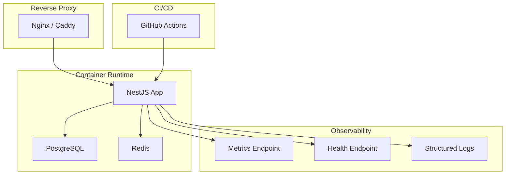
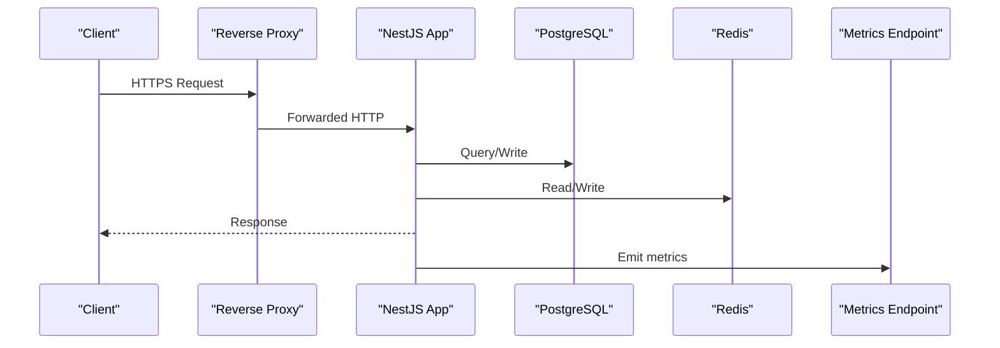
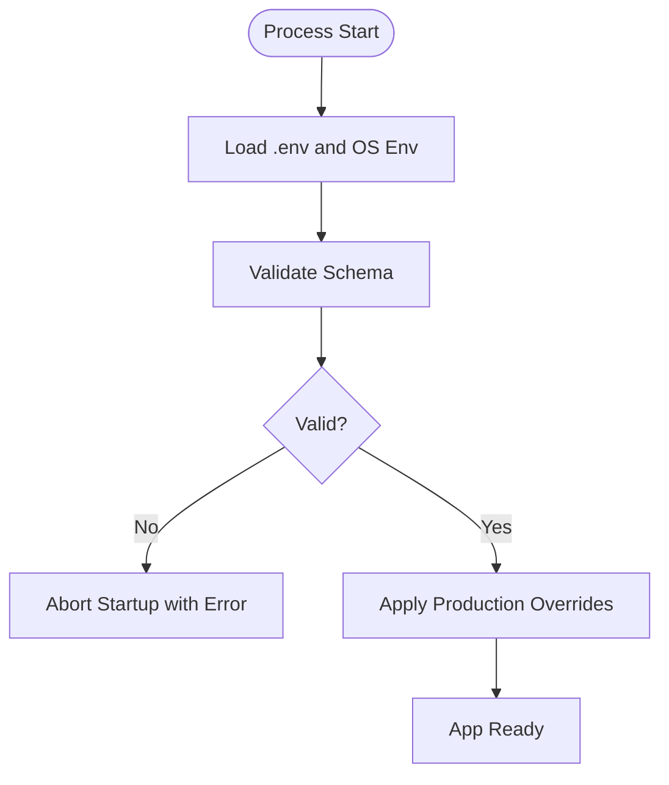
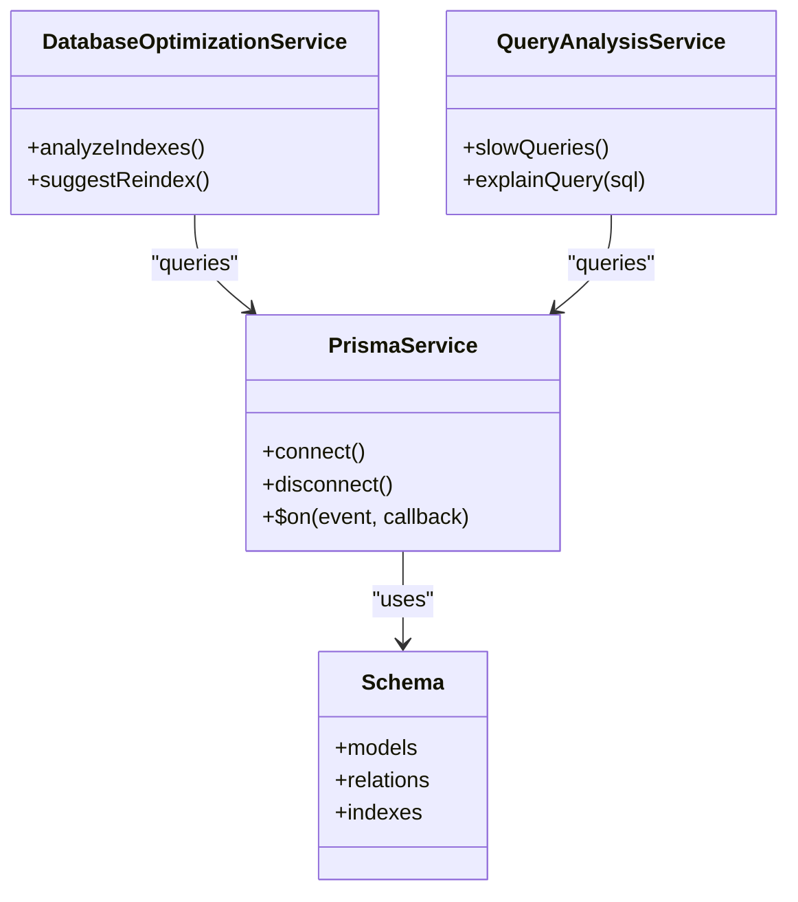
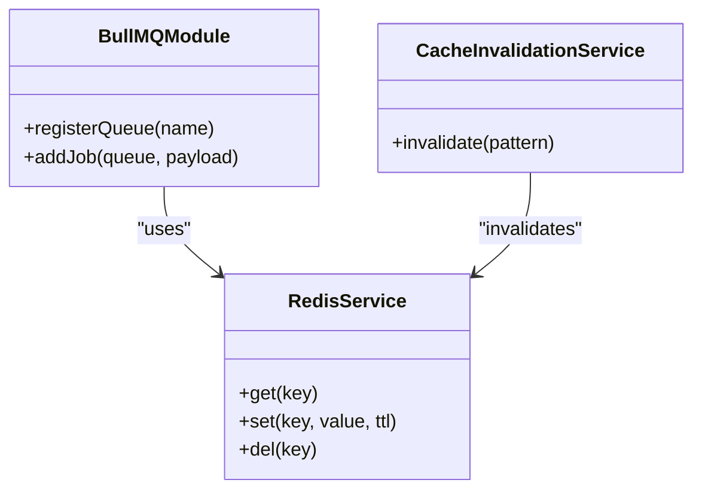
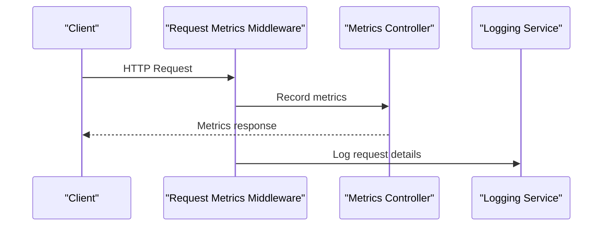
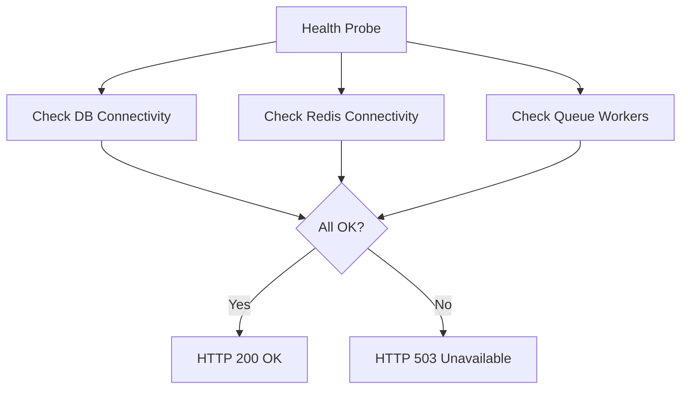
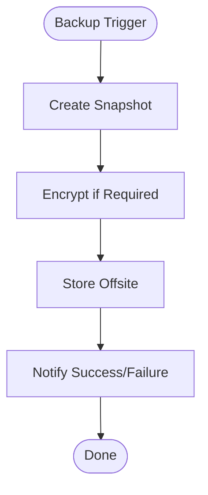
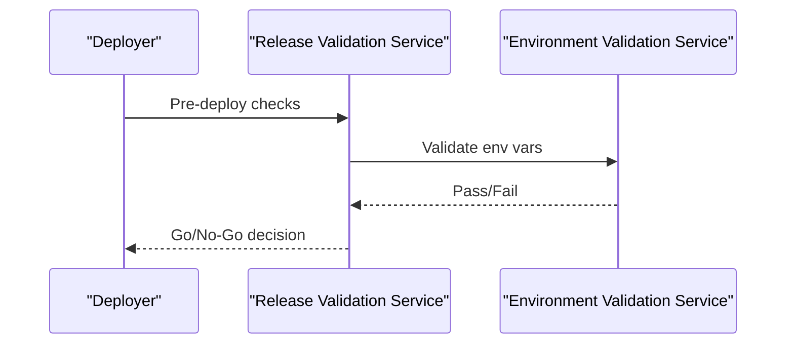
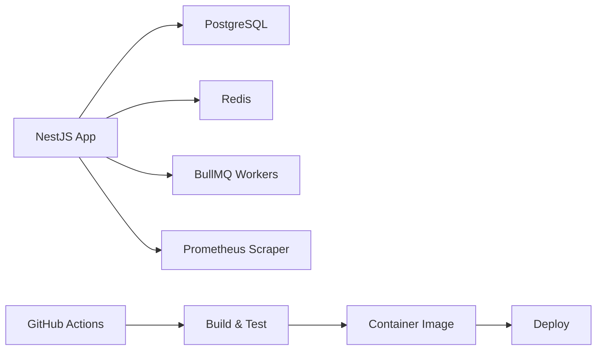

# Deployment & Production

<cite>
**Referenced Files in This Document**
- [DEPLOYMENT.md](file://docs/DEPLOYMENT.md)
- [PRODUCTION.md](file://docs/PRODUCTION.md)
- [BACKUP.md](file://docs/BACKUP.md)
- [DISASTER_RECOVERY.md](file://docs/DISASTER_RECOVERY.md)
- [OPERATIONS.md](file://docs/OPERATIONS.md)
- [RUNBOOK.md](file://docs/RUNBOOK.md)
- [SECURITY.md](file://docs/SECURITY.md)
- [docker-compose.prod.yml](file://apps/backend/docker-compose.prod.yml)
- [docker-compose.dev.yml](file://apps/backend/docker-compose.dev.yml)
- [Dockerfile](file://apps/backend/Dockerfile)
- [Dockerfile.dev](file://apps/backend/Dockerfile.dev)
- [package.json](file://apps/backend/package.json)
- [configuration.ts](file://apps/backend/src/config/configuration.ts)
- [env.validation.ts](file://apps/backend/src/config/env.validation.ts)
- [main.ts](file://apps/backend/src/main.ts)
- [app.module.ts](file://apps/backend/src/app.module.ts)
- [prisma.service.ts](file://apps/backend/src/prisma/prisma.service.ts)
- [redis.service.ts](file://apps/backend/src/redis/redis.service.ts)
- [backup.service.ts](file://apps/backend/src/deployment/backup.service.ts)
- [restore.service.ts](file://apps/backend/src/deployment/restore.service.ts)
- [deployment-health.service.ts](file://apps/backend/src/deployment/deployment-health.service.ts)
- [environment-validation.service.ts](file://apps/backend/src/deployment/environment-validation.service.ts)
- [production-configuration.service.ts](file://apps/backend/src/deployment/production-configuration.service.ts)
- [release-validation.service.ts](file://apps/backend/src/deployment/release-validation.service.ts)
- [health.controller.ts](file://apps/backend/src/health/health.controller.ts)
- [metrics.controller.ts](file://apps/backend/src/observability/metrics.controller.ts)
- [logging.service.ts](file://apps/backend/src/observability/logging.service.ts)
- [metrics.service.ts](file://apps/backend/src/observability/metrics.service.ts)
- [performance.service.ts](file://apps/backend/src/observability/performance.service.ts)
- [tracing.service.ts](file://apps/backend/src/observability/tracing.service.ts)
- [request-metrics.middleware.ts](file://apps/backend/src/observability/request-metrics.middleware.ts)
- [database-optimization.service.ts](file://apps/backend/src/hardening/database-optimization.service.ts)
- [query-analysis.service.ts](file://apps/backend/src/hardening/query-analysis.service.ts)
- [rate-limit-audit.service.ts](file://apps/backend/src/hardening/rate-limit-audit.service.ts)
- [cache-invalidation.service.ts](file://apps/backend/src/hardening/cache-invalidation.service.ts)
- [schema.prisma](file://apps/backend/prisma/schema.prisma)
- [migration_lock.toml](file://apps/backend/prisma/migrations/migration_lock.toml)
- [ci.yml](file://.github/workflows/ci.yml)
- [release.yml](file://.github/workflows/release.yml)
- [load.yml](file://apps/backend/loadtests/artillery/load.yml)
- [smoke.yml](file://apps/backend/loadtests/artillery/smoke.yml)
- [load.js](file://apps/backend/loadtests/k6/load.js)
- [smoke.js](file://apps/backend/loadtests/k6/smoke.js)
- [soak.js](file://apps/backend/loadtests/k6/soak.js)
- [spike.js](file://apps/backend/loadtests/k6/spike.js)
- [stress.js](file://apps/backend/loadtests/k6/stress.js)
- [scripts/backup.sh](file://apps/backend/scripts/backup.sh)
</cite>

## Table of Contents
1. [Introduction](#introduction)
2. [Project Structure](#project-structure)
3. [Core Components](#core-components)
4. [Architecture Overview](#architecture-overview)
5. [Detailed Component Analysis](#detailed-component-analysis)
6. [Dependency Analysis](#dependency-analysis)
7. [Performance Considerations](#performance-considerations)
8. [Troubleshooting Guide](#troubleshooting-guide)
9. [Conclusion](#conclusion)
10. [Appendices](#appendices)

## Introduction
This document provides comprehensive deployment and production guidance for Chronicle Your Media Story. It covers server requirements, database configuration, environment variable management, Docker-based deployment, reverse proxy and SSL setup, monitoring and logging, error tracking, alerting, backup and disaster recovery, database maintenance, performance monitoring, scaling strategies, load balancing, high availability, and operational runbooks. The content is grounded in the repository’s deployment artifacts, services, and documentation.

## Project Structure
The backend application is a NestJS service with Prisma for data access, Redis for caching and queues, and BullMQ for job processing. Production readiness includes health checks, metrics endpoints, validation services, and observability modules. Deployment is containerized via Docker Compose with separate development and production configurations. CI/CD pipelines are defined under GitHub Actions. Load testing suites exist for both Artillery and k6.

**Diagram sources**
- [docker-compose.prod.yml](file://apps/backend/docker-compose.prod.yml)
- [main.ts](file://apps/backend/src/main.ts)
- [metrics.controller.ts](file://apps/backend/src/observability/metrics.controller.ts)
- [health.controller.ts](file://apps/backend/src/health/health.controller.ts)

**Section sources**
- [docker-compose.prod.yml](file://apps/backend/docker-compose.prod.yml)
- [docker-compose.dev.yml](file://apps/backend/docker-compose.dev.yml)
- [Dockerfile](file://apps/backend/Dockerfile)
- [Dockerfile.dev](file://apps/backend/Dockerfile.dev)
- [package.json](file://apps/backend/package.json)
- [ci.yml](file://.github/workflows/ci.yml)
- [release.yml](file://.github/workflows/release.yml)

## Core Components
- Application bootstrap and module composition: main entrypoint wires global interceptors, guards, and middleware; app module registers feature modules.
- Configuration and environment validation: centralized config loader with strict env schema validation to fail fast on misconfiguration.
- Data layer: Prisma service manages connection lifecycle and migrations; schema defines entities and relations.
- Caching and queues: Redis service integration; BullMQ module enables background jobs.
- Observability: structured logging, request metrics middleware, Prometheus-compatible metrics endpoint, tracing hooks, and performance utilities.
- Health and readiness: dedicated health controller and indicators (e.g., Prisma health).
- Deployment hardening: environment validation, production configuration adjustments, release validation, and deployment health checks.
- Backup and restore: services and scripts to back up and restore critical data.

**Section sources**
- [main.ts](file://apps/backend/src/main.ts)
- [app.module.ts](file://apps/backend/src/app.module.ts)
- [configuration.ts](file://apps/backend/src/config/configuration.ts)
- [env.validation.ts](file://apps/backend/src/config/env.validation.ts)
- [prisma.service.ts](file://apps/backend/src/prisma/prisma.service.ts)
- [schema.prisma](file://apps/backend/prisma/schema.prisma)
- [redis.service.ts](file://apps/backend/src/redis/redis.service.ts)
- [bullmq.module.ts](file://apps/backend/src/bullmq/bullmq.module.ts)
- [logging.service.ts](file://apps/backend/src/observability/logging.service.ts)
- [metrics.controller.ts](file://apps/backend/src/observability/metrics.controller.ts)
- [metrics.service.ts](file://apps/backend/src/observability/metrics.service.ts)
- [performance.service.ts](file://apps/backend/src/observability/performance.service.ts)
- [tracing.service.ts](file://apps/backend/src/observability/tracing.service.ts)
- [request-metrics.middleware.ts](file://apps/backend/src/observability/request-metrics.middleware.ts)
- [health.controller.ts](file://apps/backend/src/health/health.controller.ts)
- [deployment-health.service.ts](file://apps/backend/src/deployment/deployment-health.service.ts)
- [environment-validation.service.ts](file://apps/backend/src/deployment/environment-validation.service.ts)
- [production-configuration.service.ts](file://apps/backend/src/deployment/production-configuration.service.ts)
- [release-validation.service.ts](file://apps/backend/src/deployment/release-validation.service.ts)
- [backup.service.ts](file://apps/backend/src/deployment/backup.service.ts)
- [restore.service.ts](file://apps/backend/src/deployment/restore.service.ts)

## Architecture Overview
The production architecture uses a reverse proxy to terminate TLS and route traffic to one or more NestJS instances. A managed PostgreSQL instance stores relational data, while Redis provides caching and queue backing. Observability is exposed via HTTP endpoints and structured logs. CI/CD automates builds, tests, and releases.

**Diagram sources**
- [docker-compose.prod.yml](file://apps/backend/docker-compose.prod.yml)
- [metrics.controller.ts](file://apps/backend/src/observability/metrics.controller.ts)
- [prisma.service.ts](file://apps/backend/src/prisma/prisma.service.ts)
- [redis.service.ts](file://apps/backend/src/redis/redis.service.ts)

## Detailed Component Analysis

### Environment Variables and Configuration
- Centralized configuration loader reads environment variables and exposes typed configuration.
- Strict environment validation ensures required keys exist and conform to expected types before startup.
- Production configuration service applies runtime optimizations and feature flags suitable for production.

**Diagram sources**
- [configuration.ts](file://apps/backend/src/config/configuration.ts)
- [env.validation.ts](file://apps/backend/src/config/env.validation.ts)
- [production-configuration.service.ts](file://apps/backend/src/deployment/production-configuration.service.ts)

**Section sources**
- [configuration.ts](file://apps/backend/src/config/configuration.ts)
- [env.validation.ts](file://apps/backend/src/config/env.validation.ts)
- [production-configuration.service.ts](file://apps/backend/src/deployment/production-configuration.service.ts)

### Database Setup and Migrations
- Prisma service initializes the client and handles lifecycle events.
- Schema defines models, relations, and indexes.
- Migration lock file ensures deterministic migration ordering.
- Database optimization and query analysis services support performance tuning.

**Diagram sources**
- [prisma.service.ts](file://apps/backend/src/prisma/prisma.service.ts)
- [schema.prisma](file://apps/backend/prisma/schema.prisma)
- [database-optimization.service.ts](file://apps/backend/src/hardening/database-optimization.service.ts)
- [query-analysis.service.ts](file://apps/backend/src/hardening/query-analysis.service.ts)
- [migration_lock.toml](file://apps/backend/prisma/migrations/migration_lock.toml)

**Section sources**
- [prisma.service.ts](file://apps/backend/src/prisma/prisma.service.ts)
- [schema.prisma](file://apps/backend/prisma/schema.prisma)
- [database-optimization.service.ts](file://apps/backend/src/hardening/database-optimization.service.ts)
- [query-analysis.service.ts](file://apps/backend/src/hardening/query-analysis.service.ts)
- [migration_lock.toml](file://apps/backend/prisma/migrations/migration_lock.toml)

### Caching and Queues
- Redis service encapsulates connection and operations.
- BullMQ module integrates job queues for background tasks.
- Cache invalidation service helps maintain consistency across cache layers.

**Diagram sources**
- [redis.service.ts](file://apps/backend/src/redis/redis.service.ts)
- [bullmq.module.ts](file://apps/backend/src/bullmq/bullmq.module.ts)
- [cache-invalidation.service.ts](file://apps/backend/src/hardening/cache-invalidation.service.ts)

**Section sources**
- [redis.service.ts](file://apps/backend/src/redis/redis.service.ts)
- [bullmq.module.ts](file://apps/backend/src/bullmq/bullmq.module.ts)
- [cache-invalidation.service.ts](file://apps/backend/src/hardening/cache-invalidation.service.ts)

### Observability and Monitoring
- Structured logging service standardizes log format and levels.
- Request metrics middleware captures latency, status codes, and throughput.
- Metrics controller exposes Prometheus-compatible endpoints.
- Performance and tracing services provide profiling and distributed tracing hooks.

**Diagram sources**
- [request-metrics.middleware.ts](file://apps/backend/src/observability/request-metrics.middleware.ts)
- [metrics.controller.ts](file://apps/backend/src/observability/metrics.controller.ts)
- [logging.service.ts](file://apps/backend/src/observability/logging.service.ts)
- [performance.service.ts](file://apps/backend/src/observability/performance.service.ts)
- [tracing.service.ts](file://apps/backend/src/observability/tracing.service.ts)

**Section sources**
- [logging.service.ts](file://apps/backend/src/observability/logging.service.ts)
- [metrics.controller.ts](file://apps/backend/src/observability/metrics.controller.ts)
- [metrics.service.ts](file://apps/backend/src/observability/metrics.service.ts)
- [performance.service.ts](file://apps/backend/src/observability/performance.service.ts)
- [tracing.service.ts](file://apps/backend/src/observability/tracing.service.ts)
- [request-metrics.middleware.ts](file://apps/backend/src/observability/request-metrics.middleware.ts)

### Health Checks and Readiness
- Health controller aggregates component health indicators.
- Prisma health indicator validates database connectivity.
- Deployment health service verifies runtime prerequisites.

**Diagram sources**
- [health.controller.ts](file://apps/backend/src/health/health.controller.ts)
- [deployment-health.service.ts](file://apps/backend/src/deployment/deployment-health.service.ts)

**Section sources**
- [health.controller.ts](file://apps/backend/src/health/health.controller.ts)
- [deployment-health.service.ts](file://apps/backend/src/deployment/deployment-health.service.ts)

### Backup and Restore
- Backup service orchestrates logical backups of critical data.
- Restore service supports restoring from snapshots.
- Shell script complements programmatic backup workflows.

**Diagram sources**
- [backup.service.ts](file://apps/backend/src/deployment/backup.service.ts)
- [restore.service.ts](file://apps/backend/src/deployment/restore.service.ts)
- [scripts/backup.sh](file://apps/backend/scripts/backup.sh)

**Section sources**
- [backup.service.ts](file://apps/backend/src/deployment/backup.service.ts)
- [restore.service.ts](file://apps/backend/src/deployment/restore.service.ts)
- [scripts/backup.sh](file://apps/backend/scripts/backup.sh)

### Release Validation and Environment Checks
- Release validation service ensures compatibility and preconditions before rollout.
- Environment validation service enforces configuration correctness at startup.

**Diagram sources**
- [release-validation.service.ts](file://apps/backend/src/deployment/release-validation.service.ts)
- [environment-validation.service.ts](file://apps/backend/src/deployment/environment-validation.service.ts)

**Section sources**
- [release-validation.service.ts](file://apps/backend/src/deployment/release-validation.service.ts)
- [environment-validation.service.ts](file://apps/backend/src/deployment/environment-validation.service.ts)

## Dependency Analysis
Production dependencies include the NestJS application, PostgreSQL, Redis, and optional external services. Container orchestration is handled by Docker Compose for local and staging environments, with CI/CD pipelines automating builds and releases.

**Diagram sources**
- [docker-compose.prod.yml](file://apps/backend/docker-compose.prod.yml)
- [ci.yml](file://.github/workflows/ci.yml)
- [release.yml](file://.github/workflows/release.yml)

**Section sources**
- [docker-compose.prod.yml](file://apps/backend/docker-compose.prod.yml)
- [ci.yml](file://.github/workflows/ci.yml)
- [release.yml](file://.github/workflows/release.yml)

## Performance Considerations
- Use database indexing and query analysis to identify slow queries and suggest reindexing.
- Enable Redis caching for hot paths and implement cache invalidation strategies.
- Monitor request latency and throughput via metrics endpoints and structured logs.
- Conduct load testing using provided Artillery and k6 suites to validate capacity and stability.

[No sources needed since this section provides general guidance]

## Troubleshooting Guide
Common production issues and resolutions:
- Startup failures due to missing or invalid environment variables: verify env schema and required keys.
- Database connectivity errors: check credentials, network policies, and Prisma connection pool settings.
- Redis connection timeouts: ensure Redis is reachable and credentials match.
- High memory usage: review worker concurrency, cache sizes, and long-running jobs.
- Slow responses: analyze slow queries, enable query analysis, and optimize indexes.

Operational references:
- Runbook for incident response and escalation procedures.
- Security guidelines for secrets management and access controls.
- Operations guide covering routine tasks and maintenance windows.

**Section sources**
- [RUNBOOK.md](file://docs/RUNBOOK.md)
- [SECURITY.md](file://docs/SECURITY.md)
- [OPERATIONS.md](file://docs/OPERATIONS.md)

## Conclusion
This deployment and production guide consolidates the essential steps and best practices for running Chronicle Your Media Story reliably in production. By following the outlined environment configuration, containerization, reverse proxy and SSL setup, observability, backup and disaster recovery, and scaling strategies, teams can achieve a robust and maintainable deployment.

[No sources needed since this section summarizes without analyzing specific files]

## Appendices

### Server Requirements
- CPU and memory sizing based on expected concurrent users and workload profile.
- Disk I/O performance for database and storage backends.
- Network bandwidth and latency considerations for media handling.

[No sources needed since this section provides general guidance]

### Reverse Proxy and SSL
- Terminate TLS at the reverse proxy and forward HTTP to the application.
- Configure headers for security (HSTS, CSP, X-Frame-Options).
- Use automated certificate provisioning where possible.

[No sources needed since this section provides general guidance]

### Scaling and High Availability
- Horizontal scaling of application instances behind a load balancer.
- Statelessness of application processes to enable easy scaling.
- Database read replicas and connection pooling for increased throughput.
- Redis clustering or sentinel for high availability.

[No sources needed since this section provides general guidance]

### Monitoring and Alerting
- Expose metrics endpoints and scrape with Prometheus.
- Aggregate logs centrally and set alerts on error rates and latency thresholds.
- Implement health probes for liveness and readiness.

[No sources needed since this section provides general guidance]

### Backup and Disaster Recovery
- Schedule regular backups and store offsite securely.
- Test restore procedures periodically to ensure RTO/RPO targets.
- Maintain runbooks for disaster recovery scenarios.

**Section sources**
- [BACKUP.md](file://docs/BACKUP.md)
- [DISASTER_RECOVERY.md](file://docs/DISASTER_RECOVERY.md)

### Load Testing
- Use Artillery and k6 suites to simulate realistic traffic patterns.
- Validate performance under load, spike, and soak conditions.

**Section sources**
- [load.yml](file://apps/backend/loadtests/artillery/load.yml)
- [smoke.yml](file://apps/backend/loadtests/artillery/smoke.yml)
- [load.js](file://apps/backend/loadtests/k6/load.js)
- [smoke.js](file://apps/backend/loadtests/k6/smoke.js)
- [soak.js](file://apps/backend/loadtests/k6/soak.js)
- [spike.js](file://apps/backend/loadtests/k6/spike.js)
- [stress.js](file://apps/backend/loadtests/k6/stress.js)