# Analytics & Insights Engine

<cite>
**Referenced Files in This Document**
- [analytics.controller.ts](file://apps/backend/src/analytics/analytics.controller.ts)
- [analytics.service.ts](file://apps/backend/src/analytics/analytics.service.ts)
- [analytics-aggregation.service.ts](file://apps/backend/src/analytics/analytics-aggregation.service.ts)
- [analytics.repository.ts](file://apps/backend/src/analytics/analytics.repository.ts)
- [dashboard.service.ts](file://apps/backend/src/analytics/dashboard.service.ts)
- [insights.service.ts](file://apps/backend/src/analytics/insights.service.ts)
- [streak.service.ts](file://apps/backend/src/analytics/streak.service.ts)
- [analytics.module.ts](file://apps/backend/src/analytics/analytics.module.ts)
- [index.ts](file://apps/backend/src/analytics/index.ts)
- [dto files](file://apps/backend/src/analytics/dto)
- [app.module.ts](file://apps/backend/src/app.module.ts)
- [main.ts](file://apps/backend/src/main.ts)
- [prisma.schema](file://apps/backend/prisma/schema.prisma)
- [analytics-tracker.ts](file://src/lib/analytics-tracker.ts)
- [analytics.ts](file://src/lib/analytics.ts)
- [use-analytics.ts](file://src/hooks/use-analytics.ts)
- [AnalyticsKit.tsx](file://src/components/analytics/AnalyticsKit.tsx)
- [ChartStory.tsx](file://src/components/analytics/ChartStory.tsx)
- [MediaConstellation.tsx](file://src/components/analytics/MediaConstellation.tsx)
- [__app.analytics-page.tsx](file://src/routes/__app.analytics-page.tsx)
- [app.analytics.tsx](file://src/routes/app.analytics.tsx)
</cite>

## Table of Contents
1. [Introduction](#introduction)
2. [Project Structure](#project-structure)
3. [Core Components](#core-components)
4. [Architecture Overview](#architecture-overview)
5. [Detailed Component Analysis](#detailed-component-analysis)
6. [Dependency Analysis](#dependency-analysis)
7. [Performance Considerations](#performance-considerations)
8. [Troubleshooting Guide](#troubleshooting-guide)
9. [Conclusion](#conclusion)
10. [Appendices](#appendices)

## Introduction
This document describes the Analytics & Insights Engine that powers consumption pattern analysis, emotional journey mapping, achievement tracking, and performance metrics. It explains how data is aggregated, processed for real-time analytics, and analyzed for historical trends. It also covers dashboard metrics, report generation, visualization data preparation, recommendation algorithms, personal insights, predictive analytics, and privacy and compliance considerations.

## Project Structure
The analytics engine spans backend services, repositories, controllers, DTOs, and frontend components:
- Backend module exposes REST endpoints and orchestrates aggregation, insights, streaks, and dashboards.
- Frontend provides analytics UI components, hooks, and client-side tracking utilities.

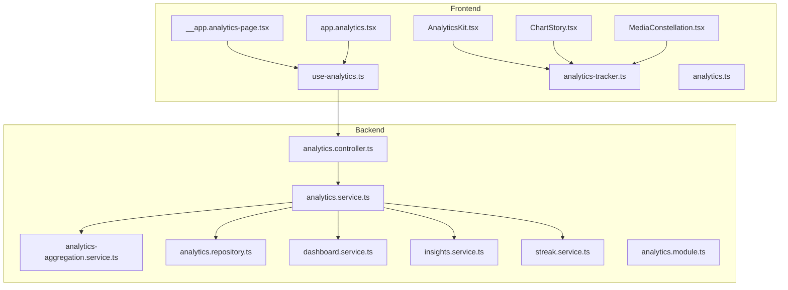

**Diagram sources**
- [analytics.controller.ts](file://apps/backend/src/analytics/analytics.controller.ts)
- [analytics.service.ts](file://apps/backend/src/analytics/analytics.service.ts)
- [analytics-aggregation.service.ts](file://apps/backend/src/analytics/analytics-aggregation.service.ts)
- [analytics.repository.ts](file://apps/backend/src/analytics/analytics.repository.ts)
- [dashboard.service.ts](file://apps/backend/src/analytics/dashboard.service.ts)
- [insights.service.ts](file://apps/backend/src/analytics/insights.service.ts)
- [streak.service.ts](file://apps/backend/src/analytics/streak.service.ts)
- [analytics.module.ts](file://apps/backend/src/analytics/analytics.module.ts)
- [use-analytics.ts](file://src/hooks/use-analytics.ts)
- [analytics-tracker.ts](file://src/lib/analytics-tracker.ts)
- [analytics.ts](file://src/lib/analytics.ts)
- [AnalyticsKit.tsx](file://src/components/analytics/AnalyticsKit.tsx)
- [ChartStory.tsx](file://src/components/analytics/ChartStory.tsx)
- [MediaConstellation.tsx](file://src/components/analytics/MediaConstellation.tsx)
- [__app.analytics-page.tsx](file://src/routes/__app.analytics-page.tsx)
- [app.analytics.tsx](file://src/routes/app.analytics.tsx)

**Section sources**
- [analytics.controller.ts](file://apps/backend/src/analytics/analytics.controller.ts)
- [analytics.service.ts](file://apps/backend/src/analytics/analytics.service.ts)
- [analytics-aggregation.service.ts](file://apps/backend/src/analytics/analytics-aggregation.service.ts)
- [analytics.repository.ts](file://apps/backend/src/analytics/analytics.repository.ts)
- [dashboard.service.ts](file://apps/backend/src/analytics/dashboard.service.ts)
- [insights.service.ts](file://apps/backend/src/analytics/insights.service.ts)
- [streak.service.ts](file://apps/backend/src/analytics/streak.service.ts)
- [analytics.module.ts](file://apps/backend/src/analytics/analytics.module.ts)
- [use-analytics.ts](file://src/hooks/use-analytics.ts)
- [analytics-tracker.ts](file://src/lib/analytics-tracker.ts)
- [analytics.ts](file://src/lib/analytics.ts)
- [AnalyticsKit.tsx](file://src/components/analytics/AnalyticsKit.tsx)
- [ChartStory.tsx](file://src/components/analytics/ChartStory.tsx)
- [MediaConstellation.tsx](file://src/components/analytics/MediaConstellation.tsx)
- [__app.analytics-page.tsx](file://src/routes/__app.analytics-page.tsx)
- [app.analytics.tsx](file://src/routes/app.analytics.tsx)

## Core Components
- Controller layer exposes analytics endpoints for dashboards, insights, streaks, and aggregated metrics.
- Service layer coordinates business logic: aggregation pipelines, insight computation, streak calculation, and dashboard assembly.
- Repository layer abstracts data access to persistent storage (Prisma).
- DTOs define request/response contracts for analytics queries and responses.
- Frontend hooks and trackers capture user interactions and render analytics visualizations.

Key responsibilities:
- Consumption pattern analysis: aggregate views, reads, completions over time windows.
- Emotional journey mapping: correlate journal entries or mood signals with media interactions.
- Achievement tracking: compute milestones based on activity thresholds and streaks.
- Performance metrics: latency, throughput, error rates, and resource usage.

**Section sources**
- [analytics.controller.ts](file://apps/backend/src/analytics/analytics.controller.ts)
- [analytics.service.ts](file://apps/backend/src/analytics/analytics.service.ts)
- [analytics-aggregation.service.ts](file://apps/backend/src/analytics/analytics-aggregation.service.ts)
- [analytics.repository.ts](file://apps/backend/src/analytics/analytics.repository.ts)
- [dashboard.service.ts](file://apps/backend/src/analytics/dashboard.service.ts)
- [insights.service.ts](file://apps/backend/src/analytics/insights.service.ts)
- [streak.service.ts](file://apps/backend/src/analytics/streak.service.ts)
- [index.ts](file://apps/backend/src/analytics/index.ts)
- [dto files](file://apps/backend/src/analytics/dto)

## Architecture Overview
The analytics pipeline ingests interaction events, aggregates them into time-series and summary metrics, computes insights and streaks, and serves dashboard-ready payloads. Real-time updates are supported via event-driven processing and caching where applicable. Historical trend analysis leverages grouped aggregations across configurable windows.

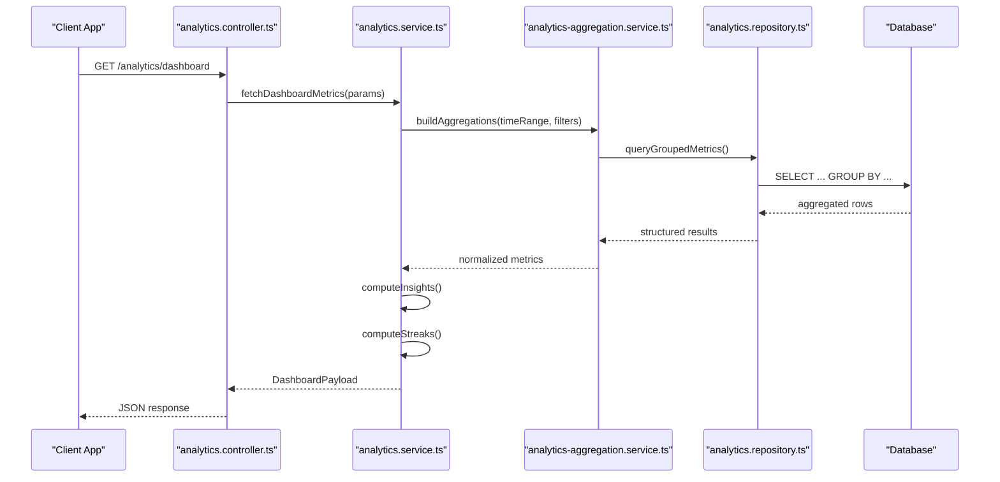

**Diagram sources**
- [analytics.controller.ts](file://apps/backend/src/analytics/analytics.controller.ts)
- [analytics.service.ts](file://apps/backend/src/analytics/analytics.service.ts)
- [analytics-aggregation.service.ts](file://apps/backend/src/analytics/analytics-aggregation.service.ts)
- [analytics.repository.ts](file://apps/backend/src/analytics/analytics.repository.ts)
- [prisma.schema](file://apps/backend/prisma/schema.prisma)

## Detailed Component Analysis

### Analytics Controller
- Exposes endpoints for dashboard metrics, insights, streaks, and raw analytics queries.
- Validates inputs using DTOs and delegates to service layer.
- Returns standardized responses suitable for dashboard rendering.

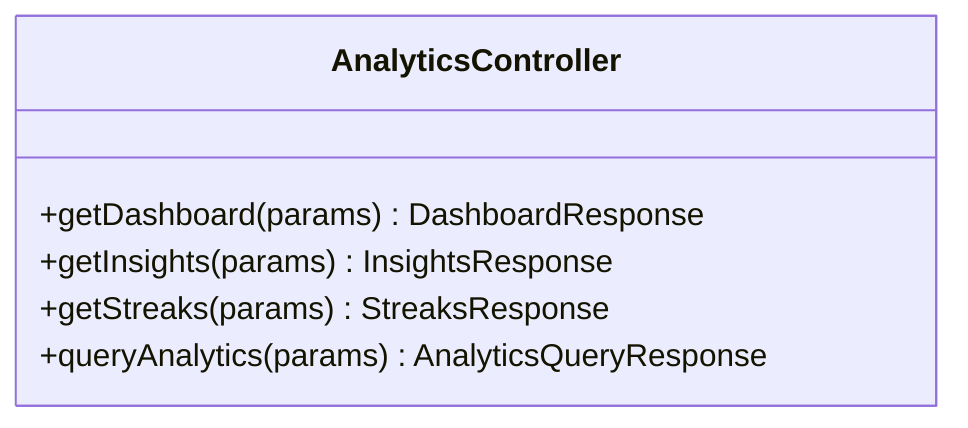

**Diagram sources**
- [analytics.controller.ts](file://apps/backend/src/analytics/analytics.controller.ts)

**Section sources**
- [analytics.controller.ts](file://apps/backend/src/analytics/analytics.controller.ts)
- [dto files](file://apps/backend/src/analytics/dto)

### Analytics Service
- Orchestrates aggregation, insights, streaks, and dashboard composition.
- Coordinates calls to aggregation service, repository, and auxiliary services.
- Applies filters, time windowing, and normalization before returning results.

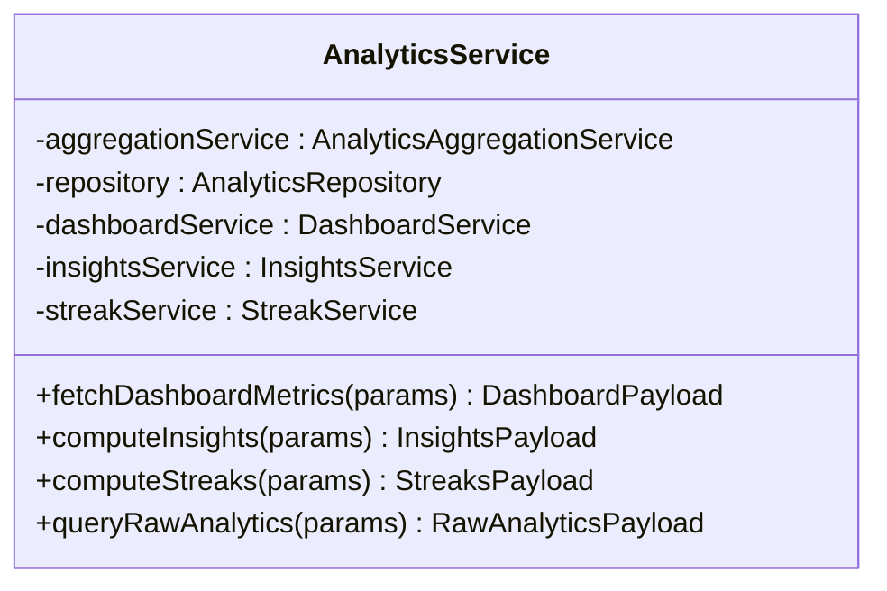

**Diagram sources**
- [analytics.service.ts](file://apps/backend/src/analytics/analytics.service.ts)
- [analytics-aggregation.service.ts](file://apps/backend/src/analytics/analytics-aggregation.service.ts)
- [analytics.repository.ts](file://apps/backend/src/analytics/analytics.repository.ts)
- [dashboard.service.ts](file://apps/backend/src/analytics/dashboard.service.ts)
- [insights.service.ts](file://apps/backend/src/analytics/insights.service.ts)
- [streak.service.ts](file://apps/backend/src/analytics/streak.service.ts)

**Section sources**
- [analytics.service.ts](file://apps/backend/src/analytics/analytics.service.ts)

### Aggregation Service
- Builds time-series and summary aggregations from raw interaction logs.
- Supports grouping by dimensions such as date, media type, genre, and collection.
- Optimizes queries for large datasets and supports incremental updates.

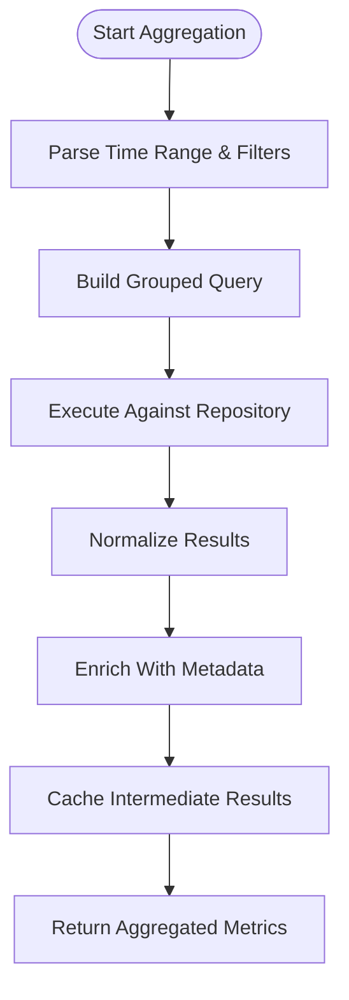

**Diagram sources**
- [analytics-aggregation.service.ts](file://apps/backend/src/analytics/analytics-aggregation.service.ts)
- [analytics.repository.ts](file://apps/backend/src/analytics/analytics.repository.ts)

**Section sources**
- [analytics-aggregation.service.ts](file://apps/backend/src/analytics/analytics-aggregation.service.ts)

### Dashboard Service
- Composes dashboard-ready payloads combining multiple metrics.
- Ensures consistent schema for frontend consumption.
- Handles fallbacks and defaults when data is sparse.

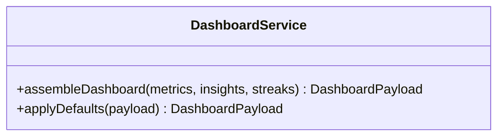

**Diagram sources**
- [dashboard.service.ts](file://apps/backend/src/analytics/dashboard.service.ts)

**Section sources**
- [dashboard.service.ts](file://apps/backend/src/analytics/dashboard.service.ts)

### Insights Service
- Computes personalized insights based on consumption patterns and journal/mood signals.
- Identifies trends, anomalies, and correlations across media categories.
- Generates narrative summaries and actionable recommendations.

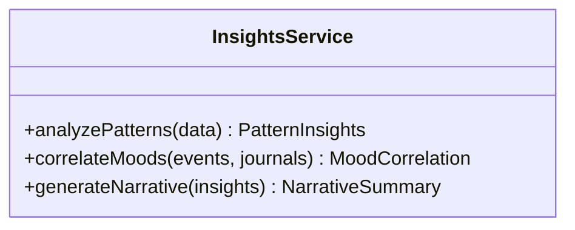

**Diagram sources**
- [insights.service.ts](file://apps/backend/src/analytics/insights.service.ts)

**Section sources**
- [insights.service.ts](file://apps/backend/src/analytics/insights.service.ts)

### Streak Service
- Calculates activity streaks based on daily or weekly engagement thresholds.
- Tracks achievements tied to consecutive activity and milestone completion.
- Integrates with achievement tracking to unlock badges and rewards.

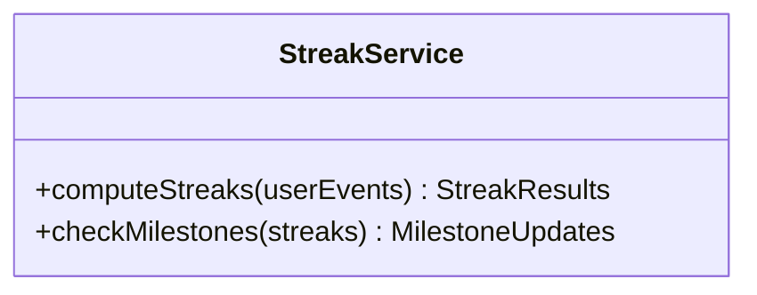

**Diagram sources**
- [streak.service.ts](file://apps/backend/src/analytics/streak.service.ts)

**Section sources**
- [streak.service.ts](file://apps/backend/src/analytics/streak.service.ts)

### Repository Layer
- Abstracts database operations for analytics queries.
- Uses Prisma for typed queries and migrations.
- Provides methods for grouped aggregations, filtering, and pagination.

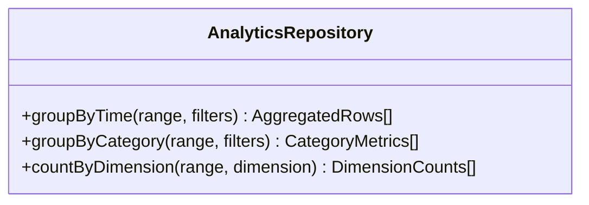

**Diagram sources**
- [analytics.repository.ts](file://apps/backend/src/analytics/analytics.repository.ts)
- [prisma.schema](file://apps/backend/prisma/schema.prisma)

**Section sources**
- [analytics.repository.ts](file://apps/backend/src/analytics/analytics.repository.ts)
- [prisma.schema](file://apps/backend/prisma/schema.prisma)

### Frontend Analytics Integration
- use-analytics hook centralizes fetching and caching of analytics data.
- analytics-tracker captures user interactions and emits events for backend ingestion.
- analytics utility functions format payloads and handle retries.
- AnalyticsKit, ChartStory, and MediaConstellation render charts, timelines, and constellation maps.
- Routes __app.analytics-page.tsx and app.analytics.tsx host analytics pages.

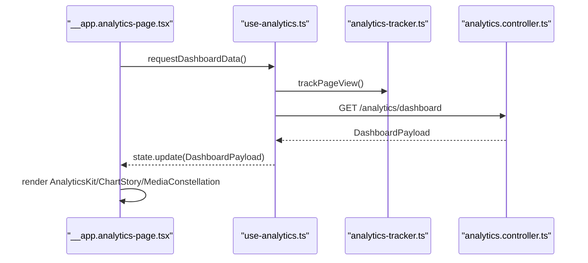

**Diagram sources**
- [__app.analytics-page.tsx](file://src/routes/__app.analytics-page.tsx)
- [app.analytics.tsx](file://src/routes/app.analytics.tsx)
- [use-analytics.ts](file://src/hooks/use-analytics.ts)
- [analytics-tracker.ts](file://src/lib/analytics-tracker.ts)
- [analytics.ts](file://src/lib/analytics.ts)
- [AnalyticsKit.tsx](file://src/components/analytics/AnalyticsKit.tsx)
- [ChartStory.tsx](file://src/components/analytics/ChartStory.tsx)
- [MediaConstellation.tsx](file://src/components/analytics/MediaConstellation.tsx)
- [analytics.controller.ts](file://apps/backend/src/analytics/analytics.controller.ts)

**Section sources**
- [use-analytics.ts](file://src/hooks/use-analytics.ts)
- [analytics-tracker.ts](file://src/lib/analytics-tracker.ts)
- [analytics.ts](file://src/lib/analytics.ts)
- [AnalyticsKit.tsx](file://src/components/analytics/AnalyticsKit.tsx)
- [ChartStory.tsx](file://src/components/analytics/ChartStory.tsx)
- [MediaConstellation.tsx](file://src/components/analytics/MediaConstellation.tsx)
- [__app.analytics-page.tsx](file://src/routes/__app.analytics-page.tsx)
- [app.analytics.tsx](file://src/routes/app.analytics.tsx)

## Dependency Analysis
The analytics module integrates with core modules and external systems:
- Prisma for data persistence and migrations.
- BullMQ for background jobs (e.g., periodic aggregation or insight generation).
- Redis for caching frequently accessed metrics.
- Observability services for logging, tracing, and metrics.

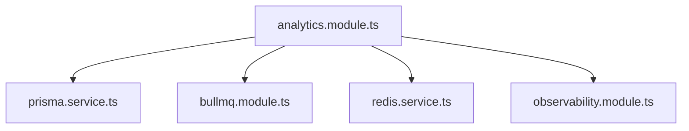

**Diagram sources**
- [analytics.module.ts](file://apps/backend/src/analytics/analytics.module.ts)
- [app.module.ts](file://apps/backend/src/app.module.ts)
- [main.ts](file://apps/backend/src/main.ts)

**Section sources**
- [analytics.module.ts](file://apps/backend/src/analytics/analytics.module.ts)
- [app.module.ts](file://apps/backend/src/app.module.ts)
- [main.ts](file://apps/backend/src/main.ts)

## Performance Considerations
- Use indexed columns for frequent filter fields (user_id, created_at, media_type).
- Implement materialized views or precomputed tables for heavy aggregations.
- Cache dashboard payloads with short TTLs to reduce database load.
- Paginate large result sets and limit time ranges for interactive queries.
- Batch writes for interaction events to minimize transaction overhead.
- Monitor query execution plans and optimize slow queries.

[No sources needed since this section provides general guidance]

## Troubleshooting Guide
Common issues and resolutions:
- Missing or inconsistent timestamps: ensure timezone normalization and validate event ingestion order.
- Empty dashboard metrics: verify filters, time range, and user context; check cache invalidation.
- Slow aggregation queries: add indexes, partition data by date, or switch to precomputed tables.
- Insight anomalies: review correlation logic and input data quality; add validation and outlier detection.
- Streak breaks: confirm threshold definitions and event deduplication.

**Section sources**
- [analytics-aggregation.service.ts](file://apps/backend/src/analytics/analytics-aggregation.service.ts)
- [insights.service.ts](file://apps/backend/src/analytics/insights.service.ts)
- [streak.service.ts](file://apps/backend/src/analytics/streak.service.ts)

## Conclusion
The Analytics & Insights Engine delivers a robust foundation for consumption pattern analysis, emotional journey mapping, achievement tracking, and performance metrics. Its modular architecture enables real-time analytics, historical trend analysis, and scalable dashboard reporting. By adhering to privacy and compliance best practices and optimizing performance, the system provides reliable, actionable insights for users and administrators.

[No sources needed since this section summarizes without analyzing specific files]

## Appendices

### Data Privacy, Anonymization, and Compliance
- Minimize personally identifiable information (PII) in analytics events; prefer hashed identifiers.
- Apply data retention policies and allow user data deletion requests.
- Anonymize or pseudonymize sensitive attributes before aggregation.
- Ensure consent management and transparent data usage disclosures.
- Audit access logs and enforce role-based permissions for analytics endpoints.

[No sources needed since this section provides general guidance]

### Recommendation Algorithms and Predictive Analytics
- Collaborative filtering based on similar user behavior patterns.
- Content-based filtering using media metadata and tags.
- Hybrid models combining collaborative and content signals.
- Predictive scoring for next likely media or reading sessions.
- Continuous model evaluation and retraining pipelines.

[No sources needed since this section provides general guidance]