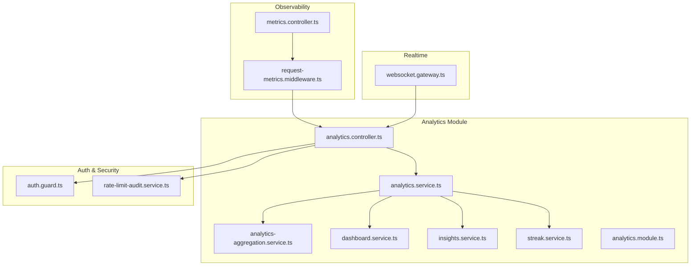
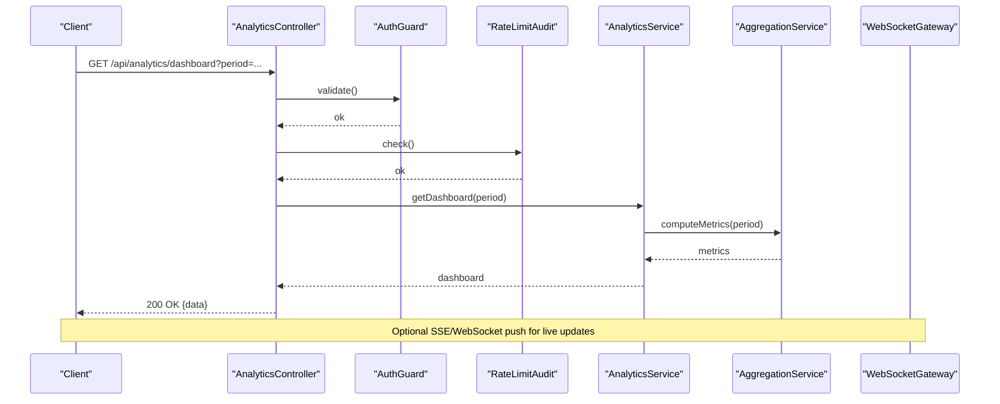
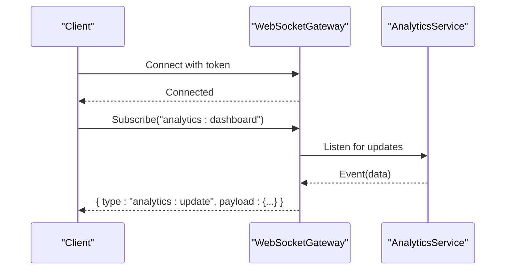
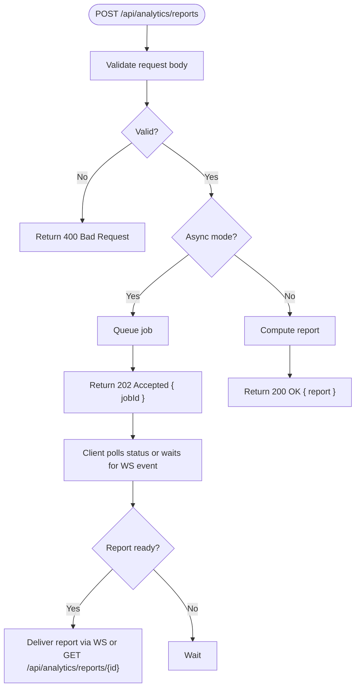
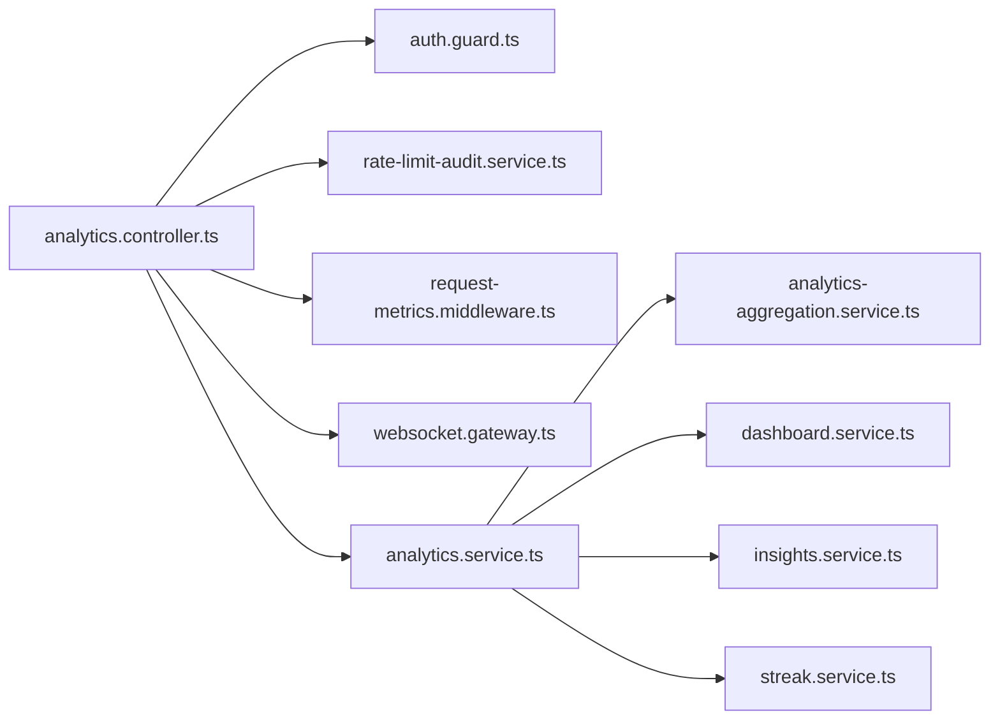

# Analytics API Endpoints

<cite>
**Referenced Files in This Document**
- [analytics.controller.ts](file://apps/backend/src/analytics/analytics.controller.ts)
- [analytics.service.ts](file://apps/backend/src/analytics/analytics.service.ts)
- [analytics-aggregation.service.ts](file://apps/backend/src/analytics/analytics-aggregation.service.ts)
- [dashboard.service.ts](file://apps/backend/src/analytics/dashboard.service.ts)
- [insights.service.ts](file://apps/backend/src/analytics/insights.service.ts)
- [streak.service.ts](file://apps/backend/src/analytics/streak.service.ts)
- [analytics.module.ts](file://apps/backend/src/analytics/analytics.module.ts)
- [index.ts](file://apps/backend/src/analytics/index.ts)
- [auth.guard.ts](file://apps/backend/src/auth/guards/auth.guard.ts)
- [rate-limit-audit.service.ts](file://apps/backend/src/hardening/rate-limit-audit.service.ts)
- [request-metrics.middleware.ts](file://apps/backend/src/observability/request-metrics.middleware.ts)
- [metrics.controller.ts](file://apps/backend/src/observability/metrics.controller.ts)
- [websocket.gateway.ts](file://apps/backend/src/common/websocket.gateway.ts)
</cite>

## Table of Contents
1. [Introduction](#introduction)
2. [Project Structure](#project-structure)
3. [Core Components](#core-components)
4. [Architecture Overview](#architecture-overview)
5. [Detailed Component Analysis](#detailed-component-analysis)
6. [Dependency Analysis](#dependency-analysis)
7. [Performance Considerations](#performance-considerations)
8. [Troubleshooting Guide](#troubleshooting-guide)
9. [Conclusion](#conclusion)
10. [Appendices](#appendices)

## Introduction
This document provides comprehensive API documentation for analytics endpoints exposed by the backend service. It covers RESTful endpoints for retrieving analytics data, generating reports, and accessing insights, including HTTP methods, URL patterns, request/response schemas, authentication requirements, rate limiting, pagination, error responses, and examples. It also documents WebSocket endpoints for real-time analytics updates and event-driven notifications.

## Project Structure
The analytics feature is implemented as a NestJS module under apps/backend/src/analytics. The controller exposes HTTP routes, services encapsulate business logic (aggregations, dashboards, insights, streaks), and the module wires dependencies together. Observability and hardening modules provide metrics, request tracing, and rate-limit auditing.

**Diagram sources**
- [analytics.controller.ts](file://apps/backend/src/analytics/analytics.controller.ts)
- [analytics.service.ts](file://apps/backend/src/analytics/analytics.service.ts)
- [analytics-aggregation.service.ts](file://apps/backend/src/analytics/analytics-aggregation.service.ts)
- [dashboard.service.ts](file://apps/backend/src/analytics/dashboard.service.ts)
- [insights.service.ts](file://apps/backend/src/analytics/insights.service.ts)
- [streak.service.ts](file://apps/backend/src/analytics/streak.service.ts)
- [analytics.module.ts](file://apps/backend/src/analytics/analytics.module.ts)
- [auth.guard.ts](file://apps/backend/src/auth/guards/auth.guard.ts)
- [rate-limit-audit.service.ts](file://apps/backend/src/hardening/rate-limit-audit.service.ts)
- [request-metrics.middleware.ts](file://apps/backend/src/observability/request-metrics.middleware.ts)
- [metrics.controller.ts](file://apps/backend/src/observability/metrics.controller.ts)
- [websocket.gateway.ts](file://apps/backend/src/common/websocket.gateway.ts)

**Section sources**
- [analytics.module.ts](file://apps/backend/src/analytics/analytics.module.ts)
- [index.ts](file://apps/backend/src/analytics/index.ts)

## Core Components
- Controller: Exposes REST endpoints for analytics queries, report generation, and insight retrieval. Applies authentication guards and integrates with rate-limit auditing.
- Services:
  - Aggregation Service: Computes time-series and categorical aggregates used by dashboards and charts.
  - Dashboard Service: Composes high-level dashboard metrics and summaries.
  - Insights Service: Derives actionable insights from aggregated data.
  - Streak Service: Calculates user activity streaks and milestones.
- Observability: Request metrics middleware captures latency and throughput; metrics controller exposes Prometheus-compatible metrics.
- Realtime: WebSocket gateway emits live analytics events to subscribed clients.

**Section sources**
- [analytics.controller.ts](file://apps/backend/src/analytics/analytics.controller.ts)
- [analytics.service.ts](file://apps/backend/src/analytics/analytics.service.ts)
- [analytics-aggregation.service.ts](file://apps/backend/src/analytics/analytics-aggregation.service.ts)
- [dashboard.service.ts](file://apps/backend/src/analytics/dashboard.service.ts)
- [insights.service.ts](file://apps/backend/src/analytics/insights.service.ts)
- [streak.service.ts](file://apps/backend/src/analytics/streak.service.ts)
- [request-metrics.middleware.ts](file://apps/backend/src/observability/request-metrics.middleware.ts)
- [metrics.controller.ts](file://apps/backend/src/observability/metrics.controller.ts)
- [websocket.gateway.ts](file://apps/backend/src/common/websocket.gateway.ts)

## Architecture Overview
The analytics API follows a layered architecture:
- HTTP Layer: Controllers handle routing, validation, and response formatting.
- Service Layer: Business logic for aggregation, insights, and reporting.
- Data Layer: Repositories and databases are accessed via services.
- Cross-cutting: Authentication, rate limiting, observability, and WebSockets.

**Diagram sources**
- [analytics.controller.ts](file://apps/backend/src/analytics/analytics.controller.ts)
- [auth.guard.ts](file://apps/backend/src/auth/guards/auth.guard.ts)
- [rate-limit-audit.service.ts](file://apps/backend/src/hardening/rate-limit-audit.service.ts)
- [analytics.service.ts](file://apps/backend/src/analytics/analytics.service.ts)
- [analytics-aggregation.service.ts](file://apps/backend/src/analytics/analytics-aggregation.service.ts)
- [websocket.gateway.ts](file://apps/backend/src/common/websocket.gateway.ts)

## Detailed Component Analysis

### REST API: Analytics Endpoints
- Base path: /api/analytics
- Authentication: Bearer token required via AuthGuard.
- Rate Limiting: Enforced per endpoint; consult rate-limit audit service configuration.
- Pagination: Standardized query parameters where applicable.

Endpoints overview:
- GET /api/analytics/dashboard
  - Purpose: Retrieve aggregated dashboard metrics for a given period.
  - Query params: period (e.g., day, week, month, year), timezone, filters.
  - Response: Dashboard summary with counts, trends, and top items.
  - Example:
    - Request: GET /api/analytics/dashboard?period=week&timezone=UTC
    - Response: 200 OK { dashboard: {...}, meta: { period, generatedAt } }

- GET /api/analytics/trends
  - Purpose: Time-series trends for key metrics.
  - Query params: metric, granularity, start, end, filters.
  - Response: Array of time points with values.
  - Example:
    - Request: GET /api/analytics/trends?metric=views&granularity=day&start=2024-01-01&end=2024-01-31
    - Response: 200 OK { series: [{ timestamp, value }] }

- GET /api/analytics/insights
  - Purpose: Actionable insights derived from analytics data.
  - Query params: category, limit, context.
  - Response: List of insights with confidence scores and references.
  - Example:
    - Request: GET /api/analytics/insights?category=engagement&limit=5
    - Response: 200 OK { insights: [...] }

- POST /api/analytics/reports
  - Purpose: Generate custom reports based on filters and aggregations.
  - Body: Filters, grouping, metrics, output format.
  - Response: Report payload or job id for async generation.
  - Example:
    - Request: POST /api/analytics/reports { filters: {...}, metrics: ["views","likes"], groupBy: "genre" }
    - Response: 202 Accepted { jobId: "..." } or 200 OK { report: {...} }

- GET /api/analytics/streaks
  - Purpose: User activity streaks and milestones.
  - Query params: userId, type, window.
  - Response: Streak details and history.
  - Example:
    - Request: GET /api/analytics/streaks?userId=abc&type=journal&window=30d
    - Response: 200 OK { streak: { current, longest, history: [...] } }

- GET /api/analytics/export
  - Purpose: Export analytics data in CSV/JSON.
  - Query params: format, scope, dateRange.
  - Response: File stream or download link.
  - Example:
    - Request: GET /api/analytics/export?format=csv&scope=all&dateRange=last_30_days
    - Response: 200 OK { url: "https://...", expiresAt: "..." }

Error responses:
- 401 Unauthorized: Missing or invalid token.
- 403 Forbidden: Insufficient permissions.
- 400 Bad Request: Invalid parameters.
- 429 Too Many Requests: Rate limit exceeded.
- 500 Internal Server Error: Unexpected failure.

Pagination:
- Supported via standard query parameters: page, pageSize, cursor.
- Responses include metadata: total, hasNext, hasPrev, nextCursor.

Authentication:
- Bearer token required in Authorization header.
- Token validated by AuthGuard before controller execution.

Rate Limiting:
- Per-user and per-endpoint limits enforced.
- Headers may include X-RateLimit-Limit, X-RateLimit-Remaining, X-RateLimit-Reset.

Examples:
- cURL:
  - curl -H "Authorization: Bearer YOUR_TOKEN" "https://api.example.com/api/analytics/dashboard?period=week"
- JavaScript fetch:
  - fetch("/api/analytics/dashboard?period=week", { headers: { Authorization: "Bearer YOUR_TOKEN" } })

**Section sources**
- [analytics.controller.ts](file://apps/backend/src/analytics/analytics.controller.ts)
- [auth.guard.ts](file://apps/backend/src/auth/guards/auth.guard.ts)
- [rate-limit-audit.service.ts](file://apps/backend/src/hardening/rate-limit-audit.service.ts)

### WebSocket: Real-Time Analytics Updates
- Endpoint: ws://api.example.com/ws/analytics
- Events:
  - analytics:update: Pushed dashboard updates when underlying data changes.
  - analytics:insight:new: New insights available.
  - analytics:report:ready: Async report generation complete.
- Subscription model:
  - Clients subscribe to channels scoped by userId or role.
- Message schema:
  - { type, payload, timestamp, correlationId }
- Reconnection:
  - Exponential backoff recommended on disconnect.
- Authentication:
  - JWT passed in query param or handshake message.

Example flow:

**Diagram sources**
- [websocket.gateway.ts](file://apps/backend/src/common/websocket.gateway.ts)
- [analytics.service.ts](file://apps/backend/src/analytics/analytics.service.ts)

**Section sources**
- [websocket.gateway.ts](file://apps/backend/src/common/websocket.gateway.ts)

### Reporting Workflow
Custom report generation can be synchronous or asynchronous:
- Synchronous: Immediate response with computed report.
- Asynchronous: Job queued; client polls or receives WebSocket notification upon completion.

**Diagram sources**
- [analytics.controller.ts](file://apps/backend/src/analytics/analytics.controller.ts)
- [analytics.service.ts](file://apps/backend/src/analytics/analytics.service.ts)

**Section sources**
- [analytics.controller.ts](file://apps/backend/src/analytics/analytics.controller.ts)
- [analytics.service.ts](file://apps/backend/src/analytics/analytics.service.ts)

## Dependency Analysis
The analytics module depends on:
- Auth guards for request authorization.
- Rate-limit audit service for throttling and monitoring.
- Observability middleware for request metrics and tracing.
- WebSocket gateway for real-time event distribution.

**Diagram sources**
- [analytics.controller.ts](file://apps/backend/src/analytics/analytics.controller.ts)
- [auth.guard.ts](file://apps/backend/src/auth/guards/auth.guard.ts)
- [rate-limit-audit.service.ts](file://apps/backend/src/hardening/rate-limit-audit.service.ts)
- [request-metrics.middleware.ts](file://apps/backend/src/observability/request-metrics.middleware.ts)
- [websocket.gateway.ts](file://apps/backend/src/common/websocket.gateway.ts)
- [analytics.service.ts](file://apps/backend/src/analytics/analytics.service.ts)
- [analytics-aggregation.service.ts](file://apps/backend/src/analytics/analytics-aggregation.service.ts)
- [dashboard.service.ts](file://apps/backend/src/analytics/dashboard.service.ts)
- [insights.service.ts](file://apps/backend/src/analytics/insights.service.ts)
- [streak.service.ts](file://apps/backend/src/analytics/streak.service.ts)

**Section sources**
- [analytics.module.ts](file://apps/backend/src/analytics/analytics.module.ts)

## Performance Considerations
- Caching: Cache frequent dashboard queries with TTL aligned to update frequency.
- Aggregation: Use precomputed materialized views for heavy aggregations.
- Pagination: Always paginate large datasets to reduce payload size.
- Async Reports: Offload long-running computations to background jobs.
- Metrics: Monitor latency and throughput via observability middleware and metrics controller.

[No sources needed since this section provides general guidance]

## Troubleshooting Guide
Common issues and resolutions:
- 401 Unauthorized: Ensure valid Bearer token is present and not expired.
- 403 Forbidden: Verify user roles and permissions for requested endpoints.
- 429 Too Many Requests: Reduce request frequency or upgrade rate-limit tier.
- 500 Internal Server Error: Check server logs and database connectivity.
- WebSocket disconnects: Implement reconnection with exponential backoff.

Diagnostic endpoints:
- Health checks: /health
- Metrics: /metrics (Prometheus format)

**Section sources**
- [metrics.controller.ts](file://apps/backend/src/observability/metrics.controller.ts)
- [request-metrics.middleware.ts](file://apps/backend/src/observability/request-metrics.middleware.ts)

## Conclusion
The analytics API provides robust REST endpoints for dashboard metrics, trends, insights, reports, and streaks, secured by authentication and rate limiting. Real-time updates are delivered via WebSocket events. Observability tools enable performance monitoring and troubleshooting. Follow the documented schemas and examples for reliable integration.

[No sources needed since this section summarizes without analyzing specific files]

## Appendices

### Request/Response Schemas
- Dashboard:
  - Fields: period, metrics, topItems, trends, generatedAt
- Trends:
  - Fields: series[{ timestamp, value }], filters
- Insights:
  - Fields: insights[{ id, category, text, confidence, references }]
- Reports:
  - Input: filters, metrics, groupBy, format
  - Output: report or jobId
- Streaks:
  - Fields: current, longest, history[{ date, count }]

### Error Codes
- 400: Bad Request
- 401: Unauthorized
- 403: Forbidden
- 404: Not Found
- 429: Too Many Requests
- 500: Internal Server Error

### Pagination Parameters
- page: integer
- pageSize: integer
- cursor: string
- Response meta: total, hasNext, hasPrev, nextCursor

[No sources needed since this section provides general guidance]