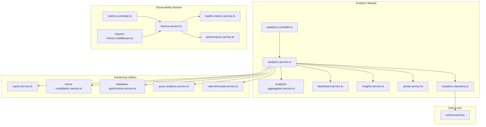
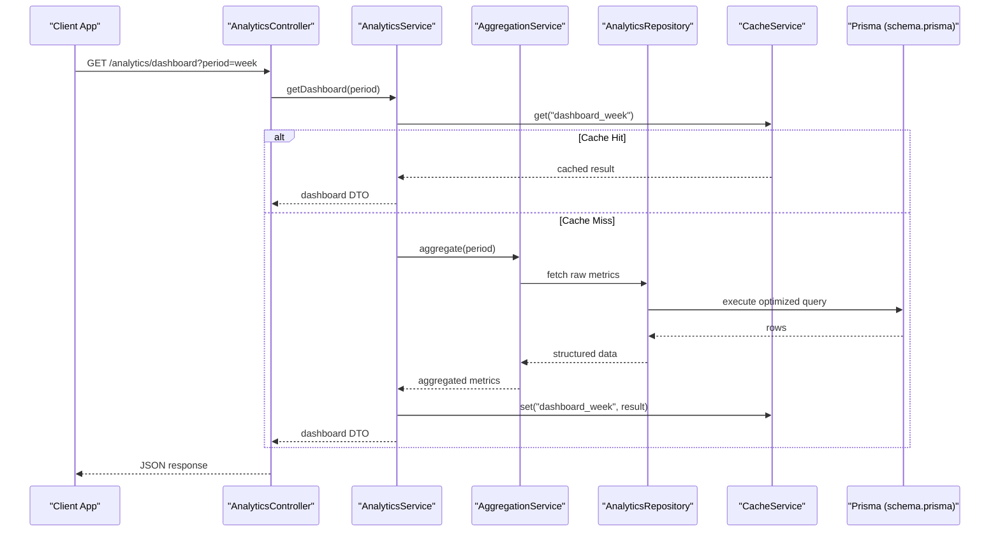
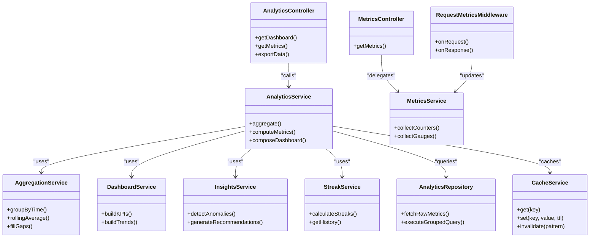

# Dashboard & Metrics System

<cite>
**Referenced Files in This Document**
- [analytics.controller.ts](file://apps/backend/src/analytics/analytics.controller.ts)
- [analytics.service.ts](file://apps/backend/src/analytics/analytics.service.ts)
- [analytics-aggregation.service.ts](file://apps/backend/src/analytics/analytics-aggregation.service.ts)
- [dashboard.service.ts](file://apps/backend/src/analytics/dashboard.service.ts)
- [insights.service.ts](file://apps/backend/src/analytics/insights.service.ts)
- [streak.service.ts](file://apps/backend/src/analytics/streak.service.ts)
- [analytics.repository.ts](file://apps/backend/src/analytics/analytics.repository.ts)
- [metrics.controller.ts](file://apps/backend/src/observability/metrics.controller.ts)
- [metrics.service.ts](file://apps/backend/src/observability/metrics.service.ts)
- [health-metrics.service.ts](file://apps/backend/src/observability/health-metrics.service.ts)
- [performance.service.ts](file://apps/backend/src/observability/performance.service.ts)
- [request-metrics.middleware.ts](file://apps/backend/src/observability/request-metrics.middleware.ts)
- [cache.service.ts](file://apps/backend/src/hardening/cache.service.ts)
- [cache-invalidation.service.ts](file://apps/backend/src/hardening/cache-invalidation.service.ts)
- [database-optimization.service.ts](file://apps/backend/src/hardening/database-optimization.service.ts)
- [query-analysis.service.ts](file://apps/backend/src/hardening/query-analysis.service.ts)
- [rate-limit-audit.service.ts](file://apps/backend/src/hardening/rate-limit-audit.service.ts)
- [schema.prisma](file://apps/backend/prisma/schema.prisma)
- [app.module.ts](file://apps/backend/src/app.module.ts)
- [main.ts](file://apps/backend/src/main.ts)
</cite>

## Table of Contents
1. [Introduction](#introduction)
2. [Project Structure](#project-structure)
3. [Core Components](#core-components)
4. [Architecture Overview](#architecture-overview)
5. [Detailed Component Analysis](#detailed-component-analysis)
6. [Dependency Analysis](#dependency-analysis)
7. [Performance Considerations](#performance-considerations)
8. [Troubleshooting Guide](#troubleshooting-guide)
9. [Conclusion](#conclusion)
10. [Appendices](#appendices)

## Introduction
This document explains the dashboard and metrics system that powers analytics dashboards, metric calculations, and API endpoints for analytics data. It covers how dashboard data is aggregated, how metrics are computed, DTO structures and response formats, caching strategies, real-time updates, data export capabilities, and custom report generation. The goal is to make the system understandable for both technical and non-technical readers while providing concrete references to source files.

## Project Structure
The dashboard and metrics functionality is implemented primarily under the backend analytics module and observability modules:
- Analytics module provides controllers, services, repositories, DTOs, and aggregation logic for dashboard data.
- Observability module exposes metrics endpoints and performance instrumentation.
- Hardening utilities provide caching, cache invalidation, database optimization, query analysis, and rate limiting.
- Prisma schema defines the underlying data model used by analytics queries.

**Diagram sources**
- [analytics.controller.ts](file://apps/backend/src/analytics/analytics.controller.ts)
- [analytics.service.ts](file://apps/backend/src/analytics/analytics.service.ts)
- [analytics-aggregation.service.ts](file://apps/backend/src/analytics/analytics-aggregation.service.ts)
- [dashboard.service.ts](file://apps/backend/src/analytics/dashboard.service.ts)
- [insights.service.ts](file://apps/backend/src/analytics/insights.service.ts)
- [streak.service.ts](file://apps/backend/src/analytics/streak.service.ts)
- [analytics.repository.ts](file://apps/backend/src/analytics/analytics.repository.ts)
- [metrics.controller.ts](file://apps/backend/src/observability/metrics.controller.ts)
- [metrics.service.ts](file://apps/backend/src/observability/metrics.service.ts)
- [health-metrics.service.ts](file://apps/backend/src/observability/health-metrics.service.ts)
- [performance.service.ts](file://apps/backend/src/observability/performance.service.ts)
- [request-metrics.middleware.ts](file://apps/backend/src/observability/request-metrics.middleware.ts)
- [cache.service.ts](file://apps/backend/src/hardening/cache.service.ts)
- [cache-invalidation.service.ts](file://apps/backend/src/hardening/cache-invalidation.service.ts)
- [database-optimization.service.ts](file://apps/backend/src/hardening/database-optimization.service.ts)
- [query-analysis.service.ts](file://apps/backend/src/hardening/query-analysis.service.ts)
- [rate-limit-audit.service.ts](file://apps/backend/src/hardening/rate-limit-audit.service.ts)
- [schema.prisma](file://apps/backend/prisma/schema.prisma)

**Section sources**
- [app.module.ts](file://apps/backend/src/app.module.ts)
- [main.ts](file://apps/backend/src/main.ts)

## Core Components
- Analytics Controller: Exposes REST endpoints for dashboard and analytics queries.
- Analytics Service: Orchestrates aggregation, metric computation, and response formatting.
- Aggregation Service: Performs grouped aggregations (e.g., time-series, counts).
- Dashboard Service: Composes dashboard-specific views and KPIs.
- Insights Service: Derives insights from aggregated data.
- Streak Service: Computes streak-based metrics (e.g., consecutive activity days).
- Analytics Repository: Data access layer for analytics queries against Prisma.
- Metrics Controller and Service: Expose runtime metrics and health indicators.
- Performance and Request Metrics: Instrument request lifecycle and measure performance.
- Caching and Invalidation: Cache frequently accessed dashboard data and invalidate on writes.
- Database Optimization and Query Analysis: Optimize queries and analyze execution plans.
- Rate Limit Audit: Protect endpoints from abuse and monitor usage patterns.

**Section sources**
- [analytics.controller.ts](file://apps/backend/src/analytics/analytics.controller.ts)
- [analytics.service.ts](file://apps/backend/src/analytics/analytics.service.ts)
- [analytics-aggregation.service.ts](file://apps/backend/src/analytics/analytics-aggregation.service.ts)
- [dashboard.service.ts](file://apps/backend/src/analytics/dashboard.service.ts)
- [insights.service.ts](file://apps/backend/src/analytics/insights.service.ts)
- [streak.service.ts](file://apps/backend/src/analytics/streak.service.ts)
- [analytics.repository.ts](file://apps/backend/src/analytics/analytics.repository.ts)
- [metrics.controller.ts](file://apps/backend/src/observability/metrics.controller.ts)
- [metrics.service.ts](file://apps/backend/src/observability/metrics.service.ts)
- [health-metrics.service.ts](file://apps/backend/src/observability/health-metrics.service.ts)
- [performance.service.ts](file://apps/backend/src/observability/performance.service.ts)
- [request-metrics.middleware.ts](file://apps/backend/src/observability/request-metrics.middleware.ts)
- [cache.service.ts](file://apps/backend/src/hardening/cache.service.ts)
- [cache-invalidation.service.ts](file://apps/backend/src/hardening/cache-invalidation.service.ts)
- [database-optimization.service.ts](file://apps/backend/src/hardening/database-optimization.service.ts)
- [query-analysis.service.ts](file://apps/backend/src/hardening/query-analysis.service.ts)
- [rate-limit-audit.service.ts](file://apps/backend/src/hardening/rate-limit-audit.service.ts)

## Architecture Overview
The dashboard and metrics system follows a layered architecture:
- Controllers handle HTTP requests and map them to service methods.
- Services implement business logic, orchestrate aggregations, and compute metrics.
- Repositories encapsulate data access via Prisma.
- Caching layers store precomputed results to reduce DB load.
- Observability components expose metrics and performance data.

**Diagram sources**
- [analytics.controller.ts](file://apps/backend/src/analytics/analytics.controller.ts)
- [analytics.service.ts](file://apps/backend/src/analytics/analytics.service.ts)
- [analytics-aggregation.service.ts](file://apps/backend/src/analytics/analytics-aggregation.service.ts)
- [analytics.repository.ts](file://apps/backend/src/analytics/analytics.repository.ts)
- [cache.service.ts](file://apps/backend/src/hardening/cache.service.ts)
- [schema.prisma](file://apps/backend/prisma/schema.prisma)

## Detailed Component Analysis

### Analytics Controller
Responsibilities:
- Define endpoints for dashboard queries, metrics retrieval, and exports.
- Validate query parameters and map to service calls.
- Return standardized responses with consistent DTO shapes.

Key behaviors:
- Parameter validation for time windows (day/week/month/year).
- Pagination and filtering support where applicable.
- Integration with caching headers and ETag strategies.

Example endpoint flow:
- GET /analytics/dashboard returns aggregated dashboard data.
- GET /analytics/metrics returns specific metric series.
- POST /analytics/export triggers export jobs or returns CSV/JSON payloads.

**Section sources**
- [analytics.controller.ts](file://apps/backend/src/analytics/analytics.controller.ts)

### Analytics Service
Responsibilities:
- Orchestrate dashboard data aggregation across multiple dimensions.
- Compute derived metrics (totals, averages, growth rates).
- Coordinate caching and fallback to repository when needed.

Processing logic:
- Normalize input parameters (time ranges, filters).
- Call aggregation service for grouped computations.
- Apply transformations to produce DTOs for clients.
- Update cache with TTL based on volatility of data.

Complexity considerations:
- Time-series aggregation typically O(n log n) due to sorting/grouping.
- Caching reduces repeated computations and DB pressure.

**Section sources**
- [analytics.service.ts](file://apps/backend/src/analytics/analytics.service.ts)

### Aggregation Service
Responsibilities:
- Perform grouped aggregations over time windows and categories.
- Compute rolling metrics (moving averages, cumulative sums).
- Handle edge cases like missing intervals and zero-filling.

Algorithm highlights:
- Group-by operations on timestamps and attributes.
- Window functions for rolling calculations.
- Efficient batching to minimize round-trips.

Optimization opportunities:
- Precompute common aggregates at ingestion time.
- Use materialized views for heavy queries.

**Section sources**
- [analytics-aggregation.service.ts](file://apps/backend/src/analytics/analytics-aggregation.service.ts)

### Dashboard Service
Responsibilities:
- Compose dashboard-specific views combining multiple metrics.
- Provide KPI summaries, trend lines, and top-level insights.
- Ensure consistent response structure for UI consumption.

Data composition:
- Merge counts, durations, and categorical breakdowns.
- Generate summary cards and chart-ready arrays.

**Section sources**
- [dashboard.service.ts](file://apps/backend/src/analytics/dashboard.service.ts)

### Insights Service
Responsibilities:
- Derive actionable insights from aggregated data.
- Identify anomalies, trends, and notable events.
- Surface recommendations for users.

Insight generation:
- Threshold-based alerts and pattern detection.
- Correlation between different metric sets.

**Section sources**
- [insights.service.ts](file://apps/backend/src/analytics/insights.service.ts)

### Streak Service
Responsibilities:
- Calculate streaks (consecutive active days/weeks).
- Maintain state transitions for streak continuity.
- Provide streak history and current status.

Streak algorithm:
- Sort events chronologically.
- Detect gaps and reset counters accordingly.
- Output streak segments and totals.

**Section sources**
- [streak.service.ts](file://apps/backend/src/analytics/streak.service.ts)

### Analytics Repository
Responsibilities:
- Encapsulate Prisma queries for analytics data.
- Implement efficient joins, filters, and aggregations.
- Provide typed results for services.

Query patterns:
- Time-range filters with indexed columns.
- Grouped counts and sums.
- Pagination and ordering optimizations.

**Section sources**
- [analytics.repository.ts](file://apps/backend/src/analytics/analytics.repository.ts)
- [schema.prisma](file://apps/backend/prisma/schema.prisma)

### Metrics Controller and Service
Responsibilities:
- Expose runtime metrics (latency, throughput, error rates).
- Aggregate health metrics and performance indicators.
- Support Prometheus-style scraping or JSON endpoints.

Metrics collection:
- Middleware captures request timings and status codes.
- Service aggregates counters and gauges.

**Section sources**
- [metrics.controller.ts](file://apps/backend/src/observability/metrics.controller.ts)
- [metrics.service.ts](file://apps/backend/src/observability/metrics.service.ts)
- [health-metrics.service.ts](file://apps/backend/src/observability/health-metrics.service.ts)
- [performance.service.ts](file://apps/backend/src/observability/performance.service.ts)
- [request-metrics.middleware.ts](file://apps/backend/src/observability/request-metrics.middleware.ts)

### Caching and Invalidation
Responsibilities:
- Cache dashboard and metrics responses to reduce latency.
- Invalidate caches on data mutations or scheduled refreshes.
- Manage TTL policies per endpoint type.

Caching strategy:
- Key includes query parameters and user context.
- Write-through or write-behind depending on consistency needs.

**Section sources**
- [cache.service.ts](file://apps/backend/src/hardening/cache.service.ts)
- [cache-invalidation.service.ts](file://apps/backend/src/hardening/cache-invalidation.service.ts)

### Database Optimization and Query Analysis
Responsibilities:
- Analyze slow queries and suggest indexes.
- Optimize joins and filter conditions.
- Monitor query execution plans.

Optimization techniques:
- Add composite indexes for frequent filters.
- Use covering indexes where possible.
- Batch updates to reduce contention.

**Section sources**
- [database-optimization.service.ts](file://apps/backend/src/hardening/database-optimization.service.ts)
- [query-analysis.service.ts](file://apps/backend/src/hardening/query-analysis.service.ts)

### Rate Limit Audit
Responsibilities:
- Enforce rate limits on analytics endpoints.
- Track usage patterns and detect anomalies.
- Provide audit logs for compliance.

Rate limiting approach:
- Token bucket or sliding window algorithms.
- Per-user or per-tenant quotas.

**Section sources**
- [rate-limit-audit.service.ts](file://apps/backend/src/hardening/rate-limit-audit.service.ts)

## Dependency Analysis
The analytics system depends on several internal modules and shared utilities:
- Controllers depend on services for business logic.
- Services depend on repositories for data access.
- Caching and hardening utilities are integrated into services.
- Observability components instrument requests and metrics.

**Diagram sources**
- [analytics.controller.ts](file://apps/backend/src/analytics/analytics.controller.ts)
- [analytics.service.ts](file://apps/backend/src/analytics/analytics.service.ts)
- [analytics-aggregation.service.ts](file://apps/backend/src/analytics/analytics-aggregation.service.ts)
- [dashboard.service.ts](file://apps/backend/src/analytics/dashboard.service.ts)
- [insights.service.ts](file://apps/backend/src/analytics/insights.service.ts)
- [streak.service.ts](file://apps/backend/src/analytics/streak.service.ts)
- [analytics.repository.ts](file://apps/backend/src/analytics/analytics.repository.ts)
- [cache.service.ts](file://apps/backend/src/hardening/cache.service.ts)
- [metrics.controller.ts](file://apps/backend/src/observability/metrics.controller.ts)
- [metrics.service.ts](file://apps/backend/src/observability/metrics.service.ts)
- [request-metrics.middleware.ts](file://apps/backend/src/observability/request-metrics.middleware.ts)

**Section sources**
- [app.module.ts](file://apps/backend/src/app.module.ts)

## Performance Considerations
- Caching: Use short TTLs for volatile metrics and longer TTLs for stable aggregates.
- Indexing: Ensure time-range filters use appropriate indexes.
- Batching: Combine related queries to reduce round-trips.
- Streaming: For large exports, stream responses to avoid memory spikes.
- Real-time updates: Prefer WebSocket or Server-Sent Events for live dashboards.
- Backpressure: Implement queueing for high-volume ingestion.

[No sources needed since this section provides general guidance]

## Troubleshooting Guide
Common issues and resolutions:
- Slow dashboard queries: Check query plans and add indexes; consider precomputing aggregates.
- Cache misses: Verify key generation and TTL settings; ensure invalidation on writes.
- Rate limit errors: Adjust quotas and monitor usage patterns.
- Metric inconsistencies: Validate aggregation logic and time zone handling.
- Export failures: Stream large datasets and handle backpressure gracefully.

**Section sources**
- [query-analysis.service.ts](file://apps/backend/src/hardening/query-analysis.service.ts)
- [cache-invalidation.service.ts](file://apps/backend/src/hardening/cache-invalidation.service.ts)
- [rate-limit-audit.service.ts](file://apps/backend/src/hardening/rate-limit-audit.service.ts)

## Conclusion
The dashboard and metrics system combines robust aggregation, caching, and observability to deliver responsive analytics. By leveraging efficient queries, strategic caching, and clear DTO contracts, it supports real-time updates, exports, and custom reports. Continuous optimization through query analysis and indexing ensures scalability and reliability.

[No sources needed since this section summarizes without analyzing specific files]

## Appendices

### DTO Structures and Response Formats
- Dashboard response includes KPIs, time-series arrays, and categorical breakdowns.
- Metrics response provides counters, gauges, and histograms with labels.
- Export responses support CSV and JSON formats with headers and metadata.

[No sources needed since this section describes conceptual formats]

### Example Dashboard Queries
- Retrieve weekly dashboard: GET /analytics/dashboard?period=week
- Fetch daily metrics: GET /analytics/metrics?granularity=day&range=30d
- Trigger export: POST /analytics/export?format=csv

[No sources needed since this section lists example endpoints]

### Real-Time Updates
- Use WebSocket channels for live dashboard updates.
- Publish metric changes via event bus to subscribers.
- Debounce updates to prevent UI thrashing.

[No sources needed since this section outlines conceptual approaches]

### Data Export Capabilities
- Asynchronous job queue for large exports.
- Chunked streaming to manage memory usage.
- Secure download links with expiration.

[No sources needed since this section describes conceptual features]

### Custom Report Generation
- Allow users to define dimensions and metrics.
- Render templates with dynamic filters.
- Schedule recurring reports and email delivery.

[No sources needed since this section outlines conceptual capabilities]