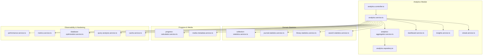
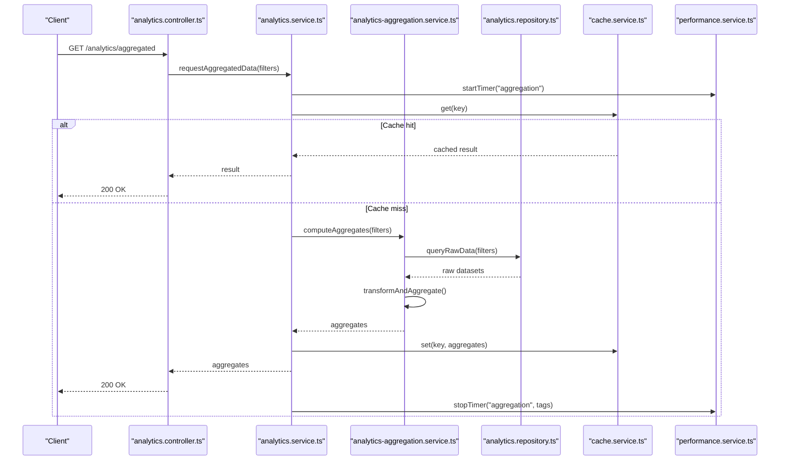
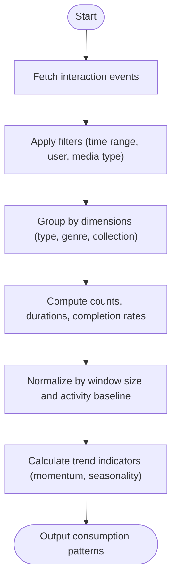
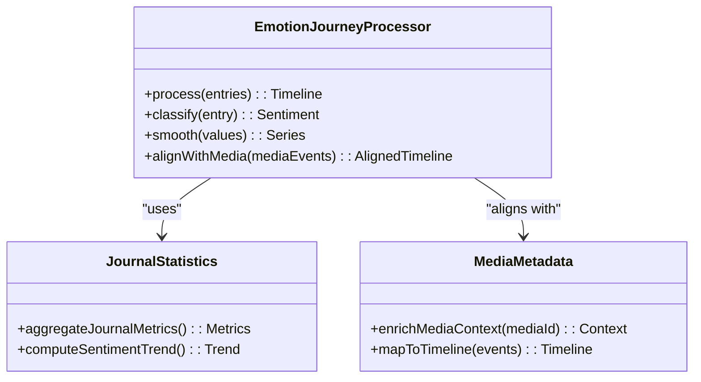
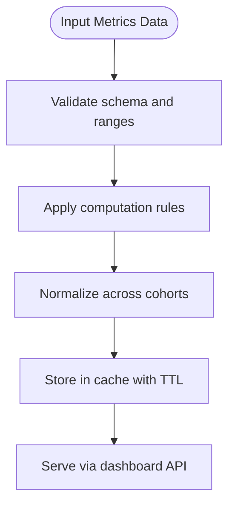
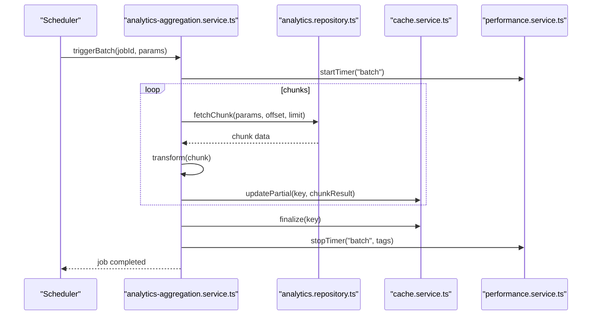
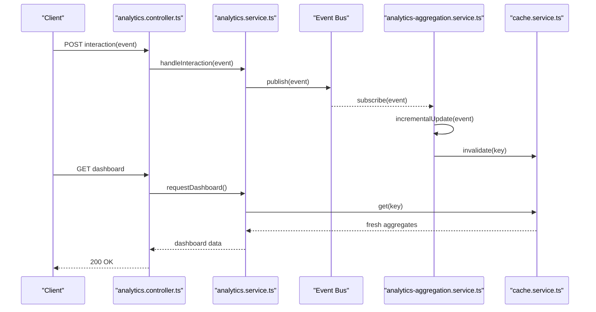
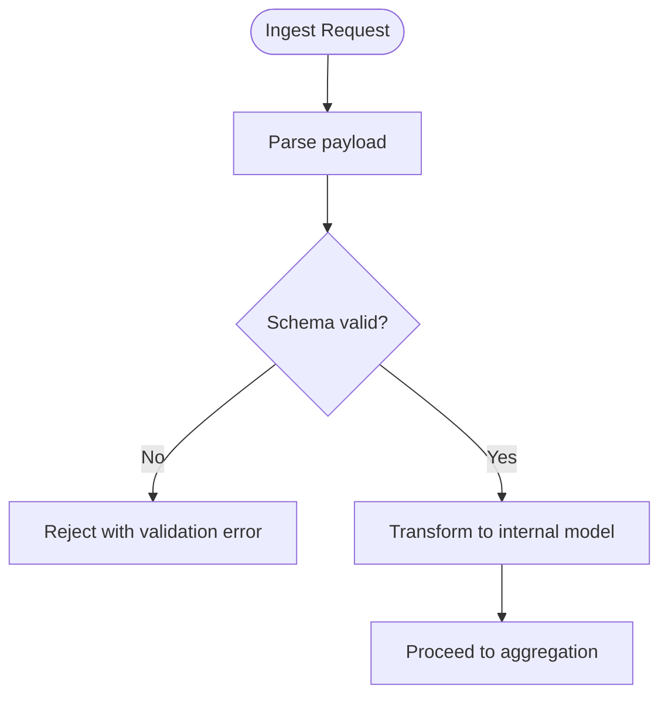
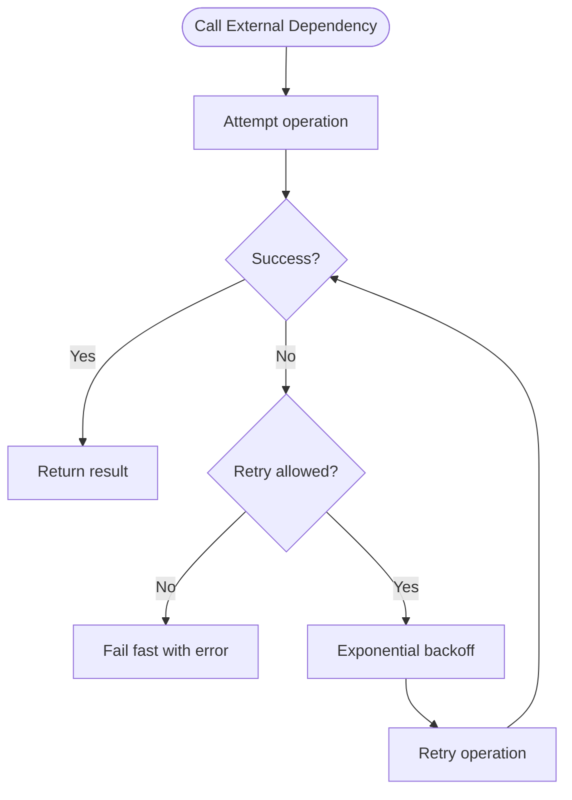
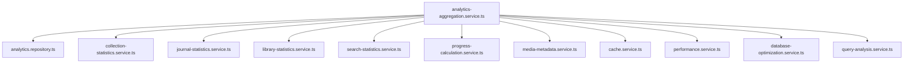

# Data Aggregation & Processing

<cite>
**Referenced Files in This Document**
- [analytics-aggregation.service.ts](file://apps/backend/src/analytics/analytics-aggregation.service.ts)
- [analytics.service.ts](file://apps/backend/src/analytics/analytics.service.ts)
- [dashboard.service.ts](file://apps/backend/src/analytics/dashboard.service.ts)
- [insights.service.ts](file://apps/backend/src/analytics/insights.service.ts)
- [streak.service.ts](file://apps/backend/src/analytics/streak.service.ts)
- [analytics.controller.ts](file://apps/backend/src/analytics/analytics.controller.ts)
- [analytics.repository.ts](file://apps/backend/src/analytics/analytics.repository.ts)
- [analytics.module.ts](file://apps/backend/src/analytics/analytics.module.ts)
- [index.ts](file://apps/backend/src/analytics/index.ts)
- [collection-statistics.service.ts](file://apps/backend/src/collections/collection-statistics.service.ts)
- [journal-statistics.service.ts](file://apps/backend/src/journal/journal-statistics.service.ts)
- [library-statistics.service.ts](file://apps/backend/src/library/library-statistics.service.ts)
- [search-statistics.service.ts](file://apps/backend/src/search/search-statistics.service.ts)
- [progress-calculation.service.ts](file://apps/backend/src/progress/progress-calculation.service.ts)
- [media-metadata.service.ts](file://apps/backend/src/media/media-metadata.service.ts)
- [performance.service.ts](file://apps/backend/src/observability/performance.service.ts)
- [metrics.service.ts](file://apps/backend/src/observability/metrics.service.ts)
- [database-optimization.service.ts](file://apps/backend/src/hardening/database-optimization.service.ts)
- [query-analysis.service.ts](file://apps/backend/src/hardening/query-analysis.service.ts)
- [cache.service.ts](file://apps/backend/src/hardening/cache.service.ts)
- [retry.interceptor.ts](file://apps/backend/src/common/retry/retry.interceptor.ts)
- [schema.prisma](file://apps/backend/prisma/schema.prisma)
</cite>

## Table of Contents
1. [Introduction](#introduction)
2. [Project Structure](#project-structure)
3. [Core Components](#core-components)
4. [Architecture Overview](#architecture-overview)
5. [Detailed Component Analysis](#detailed-component-analysis)
6. [Dependency Analysis](#dependency-analysis)
7. [Performance Considerations](#performance-considerations)
8. [Troubleshooting Guide](#troubleshooting-guide)
9. [Conclusion](#conclusion)
10. [Appendices](#appendices)

## Introduction
This document explains the data aggregation and processing layer that powers consumption pattern analysis, emotional journey processing, and metrics calculation across media, journaling, collections, search, and progress domains. It covers aggregation algorithms, transformation pipelines, batch strategies, real-time streaming patterns, validation, error handling, and retry mechanisms. The goal is to make the system understandable for both technical and non-technical readers while providing precise references to implementation files.

## Project Structure
The aggregation and processing logic is primarily implemented under the backend NestJS application:
- Analytics module: central aggregation services, controllers, repositories, and domain-specific insights
- Domain statistics services: per-domain aggregators (collections, journal, library, search)
- Progress calculations: derived metrics from user interactions
- Observability and hardening: performance measurement, caching, query optimization, and database tuning
- Common utilities: retry interceptors and shared infrastructure

**Diagram sources**
- [analytics.controller.ts](file://apps/backend/src/analytics/analytics.controller.ts)
- [analytics.service.ts](file://apps/backend/src/analytics/analytics.service.ts)
- [analytics-aggregation.service.ts](file://apps/backend/src/analytics/analytics-aggregation.service.ts)
- [analytics.repository.ts](file://apps/backend/src/analytics/analytics.repository.ts)
- [dashboard.service.ts](file://apps/backend/src/analytics/dashboard.service.ts)
- [insights.service.ts](file://apps/backend/src/analytics/insights.service.ts)
- [streak.service.ts](file://apps/backend/src/analytics/streak.service.ts)
- [collection-statistics.service.ts](file://apps/backend/src/collections/collection-statistics.service.ts)
- [journal-statistics.service.ts](file://apps/backend/src/journal/journal-statistics.service.ts)
- [library-statistics.service.ts](file://apps/backend/src/library/library-statistics.service.ts)
- [search-statistics.service.ts](file://apps/backend/src/search/search-statistics.service.ts)
- [progress-calculation.service.ts](file://apps/backend/src/progress/progress-calculation.service.ts)
- [media-metadata.service.ts](file://apps/backend/src/media/media-metadata.service.ts)
- [performance.service.ts](file://apps/backend/src/observability/performance.service.ts)
- [metrics.service.ts](file://apps/backend/src/observability/metrics.service.ts)
- [database-optimization.service.ts](file://apps/backend/src/hardening/database-optimization.service.ts)
- [query-analysis.service.ts](file://apps/backend/src/hardening/query-analysis.service.ts)
- [cache.service.ts](file://apps/backend/src/hardening/cache.service.ts)

**Section sources**
- [analytics.module.ts](file://apps/backend/src/analytics/analytics.module.ts)
- [index.ts](file://apps/backend/src/analytics/index.ts)

## Core Components
- analytics-aggregation.service.ts: Orchestrates cross-domain aggregation, computes composite metrics, and coordinates batch operations.
- analytics.service.ts: Exposes APIs for aggregated insights, composes domain statistics, and manages caching and performance instrumentation.
- dashboard.service.ts: Builds dashboard-ready summaries by combining multiple aggregation results into a single response shape.
- insights.service.ts: Derives higher-level insights (e.g., trends, anomalies, correlations) from raw aggregates.
- streak.service.ts: Calculates streaks and continuity metrics based on temporal sequences of events.
- analytics.repository.ts: Encapsulates low-level queries and data access patterns used by aggregation services.
- Domain statistics services: Provide focused aggregations per feature area (collections, journal, library, search).
- progress-calculation.service.ts: Computes derived progress metrics from interaction events.
- media-metadata.service.ts: Enriches media-related aggregates with metadata and normalization.
- Observability and hardening: Performance measurement, metrics collection, query analysis, cache management, and database optimization.

**Section sources**
- [analytics-aggregation.service.ts](file://apps/backend/src/analytics/analytics-aggregation.service.ts)
- [analytics.service.ts](file://apps/backend/src/analytics/analytics.service.ts)
- [dashboard.service.ts](file://apps/backend/src/analytics/dashboard.service.ts)
- [insights.service.ts](file://apps/backend/src/analytics/insights.service.ts)
- [streak.service.ts](file://apps/backend/src/analytics/streak.service.ts)
- [analytics.repository.ts](file://apps/backend/src/analytics/analytics.repository.ts)
- [collection-statistics.service.ts](file://apps/backend/src/collections/collection-statistics.service.ts)
- [journal-statistics.service.ts](file://apps/backend/src/journal/journal-statistics.service.ts)
- [library-statistics.service.ts](file://apps/backend/src/library/library-statistics.service.ts)
- [search-statistics.service.ts](file://apps/backend/src/search/search-statistics.service.ts)
- [progress-calculation.service.ts](file://apps/backend/src/progress/progress-calculation.service.ts)
- [media-metadata.service.ts](file://apps/backend/src/media/media-metadata.service.ts)
- [performance.service.ts](file://apps/backend/src/observability/performance.service.ts)
- [metrics.service.ts](file://apps/backend/src/observability/metrics.service.ts)
- [database-optimization.service.ts](file://apps/backend/src/hardening/database-optimization.service.ts)
- [query-analysis.service.ts](file://apps/backend/src/hardening/query-analysis.service.ts)
- [cache.service.ts](file://apps/backend/src/hardening/cache.service.ts)

## Architecture Overview
The aggregation pipeline follows a layered approach:
- Controller layer exposes endpoints for aggregated data.
- Service layer orchestrates aggregation, composes domain statistics, and applies transformations.
- Repository layer performs optimized queries and data retrieval.
- Cross-cutting concerns include caching, performance measurement, and retry mechanisms.

**Diagram sources**
- [analytics.controller.ts](file://apps/backend/src/analytics/analytics.controller.ts)
- [analytics.service.ts](file://apps/backend/src/analytics/analytics.service.ts)
- [analytics-aggregation.service.ts](file://apps/backend/src/analytics/analytics-aggregation.service.ts)
- [analytics.repository.ts](file://apps/backend/src/analytics/analytics.repository.ts)
- [cache.service.ts](file://apps/backend/src/hardening/cache.service.ts)
- [performance.service.ts](file://apps/backend/src/observability/performance.service.ts)

## Detailed Component Analysis

### Consumption Pattern Analysis
Consumption patterns are computed by aggregating media interactions over time windows, grouping by media type, genre, or collection, and deriving frequency distributions and trend signals.

**Diagram sources**
- [analytics-aggregation.service.ts](file://apps/backend/src/analytics/analytics-aggregation.service.ts)
- [analytics.repository.ts](file://apps/backend/src/analytics/analytics.repository.ts)
- [library-statistics.service.ts](file://apps/backend/src/library/library-statistics.service.ts)
- [media-metadata.service.ts](file://apps/backend/src/media/media-metadata.service.ts)

**Section sources**
- [analytics-aggregation.service.ts](file://apps/backend/src/analytics/analytics-aggregation.service.ts)
- [library-statistics.service.ts](file://apps/backend/src/library/library-statistics.service.ts)
- [media-metadata.service.ts](file://apps/backend/src/media/media-metadata.service.ts)

### Emotional Journey Data Processing
Emotional journey processing transforms raw journal entries and media reflections into structured sentiment trajectories. It includes tokenization, emotion classification, smoothing, and alignment with media timeline events.

**Diagram sources**
- [journal-statistics.service.ts](file://apps/backend/src/journal/journal-statistics.service.ts)
- [media-metadata.service.ts](file://apps/backend/src/media/media-metadata.service.ts)
- [analytics-aggregation.service.ts](file://apps/backend/src/analytics/analytics-aggregation.service.ts)

**Section sources**
- [journal-statistics.service.ts](file://apps/backend/src/journal/journal-statistics.service.ts)
- [media-metadata.service.ts](file://apps/backend/src/media/media-metadata.service.ts)
- [analytics-aggregation.service.ts](file://apps/backend/src/analytics/analytics-aggregation.service.ts)

### Metrics Calculation
Metrics are calculated through deterministic formulas applied to normalized inputs, including completion rates, engagement scores, and streak continuity. Results are cached and exposed via dashboard endpoints.

**Diagram sources**
- [analytics.service.ts](file://apps/backend/src/analytics/analytics.service.ts)
- [dashboard.service.ts](file://apps/backend/src/analytics/dashboard.service.ts)
- [cache.service.ts](file://apps/backend/src/hardening/cache.service.ts)

**Section sources**
- [analytics.service.ts](file://apps/backend/src/analytics/analytics.service.ts)
- [dashboard.service.ts](file://apps/backend/src/analytics/dashboard.service.ts)
- [cache.service.ts](file://apps/backend/src/hardening/cache.service.ts)

### Batch Processing Strategies
Batch jobs aggregate large datasets using chunked processing, idempotent writes, and backpressure handling. Jobs are scheduled and monitored via observability services.

**Diagram sources**
- [analytics-aggregation.service.ts](file://apps/backend/src/analytics/analytics-aggregation.service.ts)
- [analytics.repository.ts](file://apps/backend/src/analytics/analytics.repository.ts)
- [cache.service.ts](file://apps/backend/src/hardening/cache.service.ts)
- [performance.service.ts](file://apps/backend/src/observability/performance.service.ts)

**Section sources**
- [analytics-aggregation.service.ts](file://apps/backend/src/analytics/analytics-aggregation.service.ts)
- [analytics.repository.ts](file://apps/backend/src/analytics/analytics.repository.ts)
- [cache.service.ts](file://apps/backend/src/hardening/cache.service.ts)
- [performance.service.ts](file://apps/backend/src/observability/performance.service.ts)

### Real-Time Data Streaming
Real-time streaming uses event-driven updates to refresh dashboards incrementally. Events are published when interactions occur, and subscribers recompute affected aggregates.

**Diagram sources**
- [analytics.controller.ts](file://apps/backend/src/analytics/analytics.controller.ts)
- [analytics.service.ts](file://apps/backend/src/analytics/analytics.service.ts)
- [analytics-aggregation.service.ts](file://apps/backend/src/analytics/analytics-aggregation.service.ts)
- [cache.service.ts](file://apps/backend/src/hardening/cache.service.ts)

**Section sources**
- [analytics.controller.ts](file://apps/backend/src/analytics/analytics.controller.ts)
- [analytics.service.ts](file://apps/backend/src/analytics/analytics.service.ts)
- [analytics-aggregation.service.ts](file://apps/backend/src/analytics/analytics-aggregation.service.ts)
- [cache.service.ts](file://apps/backend/src/hardening/cache.service.ts)

### Data Validation
Validation ensures input schemas match expected structures and constraints before aggregation. Invalid inputs are rejected early to prevent downstream errors.

**Diagram sources**
- [analytics.service.ts](file://apps/backend/src/analytics/analytics.service.ts)
- [analytics.controller.ts](file://apps/backend/src/analytics/analytics.controller.ts)

**Section sources**
- [analytics.service.ts](file://apps/backend/src/analytics/analytics.service.ts)
- [analytics.controller.ts](file://apps/backend/src/analytics/analytics.controller.ts)

### Error Handling and Retry Mechanisms
Errors are handled with structured exceptions and retry policies. Interceptors wrap calls to external dependencies and implement exponential backoff.

**Diagram sources**
- [retry.interceptor.ts](file://apps/backend/src/common/retry/retry.interceptor.ts)
- [analytics.service.ts](file://apps/backend/src/analytics/analytics.service.ts)

**Section sources**
- [retry.interceptor.ts](file://apps/backend/src/common/retry/retry.interceptor.ts)
- [analytics.service.ts](file://apps/backend/src/analytics/analytics.service.ts)

## Dependency Analysis
Aggregation services depend on domain statistics, repository layers, and observability utilities. Caching and performance measurement are cross-cutting concerns.

**Diagram sources**
- [analytics-aggregation.service.ts](file://apps/backend/src/analytics/analytics-aggregation.service.ts)
- [analytics.repository.ts](file://apps/backend/src/analytics/analytics.repository.ts)
- [collection-statistics.service.ts](file://apps/backend/src/collections/collection-statistics.service.ts)
- [journal-statistics.service.ts](file://apps/backend/src/journal/journal-statistics.service.ts)
- [library-statistics.service.ts](file://apps/backend/src/library/library-statistics.service.ts)
- [search-statistics.service.ts](file://apps/backend/src/search/search-statistics.service.ts)
- [progress-calculation.service.ts](file://apps/backend/src/progress/progress-calculation.service.ts)
- [media-metadata.service.ts](file://apps/backend/src/media/media-metadata.service.ts)
- [cache.service.ts](file://apps/backend/src/hardening/cache.service.ts)
- [performance.service.ts](file://apps/backend/src/observability/performance.service.ts)
- [database-optimization.service.ts](file://apps/backend/src/hardening/database-optimization.service.ts)
- [query-analysis.service.ts](file://apps/backend/src/hardening/query-analysis.service.ts)

**Section sources**
- [analytics-aggregation.service.ts](file://apps/backend/src/analytics/analytics-aggregation.service.ts)
- [analytics.repository.ts](file://apps/backend/src/analytics/analytics.repository.ts)
- [collection-statistics.service.ts](file://apps/backend/src/collections/collection-statistics.service.ts)
- [journal-statistics.service.ts](file://apps/backend/src/journal/journal-statistics.service.ts)
- [library-statistics.service.ts](file://apps/backend/src/library/library-statistics.service.ts)
- [search-statistics.service.ts](file://apps/backend/src/search/search-statistics.service.ts)
- [progress-calculation.service.ts](file://apps/backend/src/progress/progress-calculation.service.ts)
- [media-metadata.service.ts](file://apps/backend/src/media/media-metadata.service.ts)
- [cache.service.ts](file://apps/backend/src/hardening/cache.service.ts)
- [performance.service.ts](file://apps/backend/src/observability/performance.service.ts)
- [database-optimization.service.ts](file://apps/backend/src/hardening/database-optimization.service.ts)
- [query-analysis.service.ts](file://apps/backend/src/hardening/query-analysis.service.ts)

## Performance Considerations
- Query optimization: Use targeted indexes and avoid N+1 queries; leverage query analysis services to identify bottlenecks.
- Caching: Apply appropriate TTLs and invalidation strategies to reduce recomputation.
- Batch processing: Chunk large datasets and use idempotent operations to ensure reliability.
- Real-time updates: Incremental aggregation minimizes full recomputation costs.
- Monitoring: Track latency and throughput via performance services and metrics collectors.

[No sources needed since this section provides general guidance]

## Troubleshooting Guide
Common issues and resolutions:
- Stale cache data: Invalidate keys after updates and verify TTL settings.
- Slow queries: Analyze execution plans and add missing indexes.
- Retry storms: Tune backoff parameters and circuit breakers.
- Validation failures: Ensure DTO schemas match incoming payloads.

**Section sources**
- [cache.service.ts](file://apps/backend/src/hardening/cache.service.ts)
- [query-analysis.service.ts](file://apps/backend/src/hardening/query-analysis.service.ts)
- [retry.interceptor.ts](file://apps/backend/src/common/retry/retry.interceptor.ts)
- [analytics.service.ts](file://apps/backend/src/analytics/analytics.service.ts)

## Conclusion
The data aggregation and processing layer combines robust aggregation algorithms, efficient transformation pipelines, and strong observability to deliver accurate consumption patterns, emotional journey insights, and reliable metrics. By leveraging caching, batch strategies, and real-time streaming, the system scales effectively while maintaining responsiveness and correctness.

[No sources needed since this section summarizes without analyzing specific files]

## Appendices
- Schema reference: See Prisma schema for entity definitions and relationships.
- API endpoints: Refer to analytics controller for available routes and request/response shapes.

**Section sources**
- [schema.prisma](file://apps/backend/prisma/schema.prisma)
- [analytics.controller.ts](file://apps/backend/src/analytics/analytics.controller.ts)