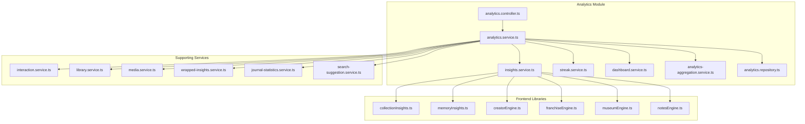
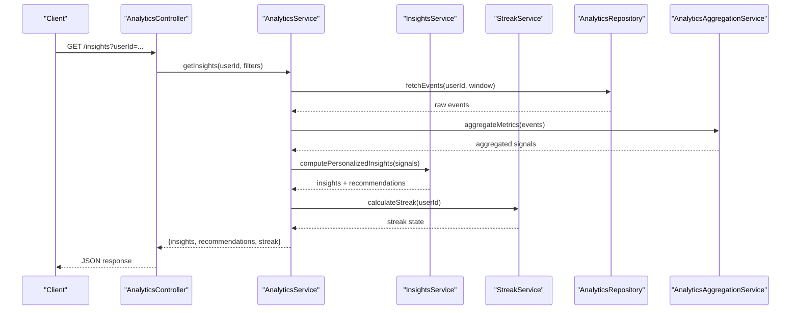
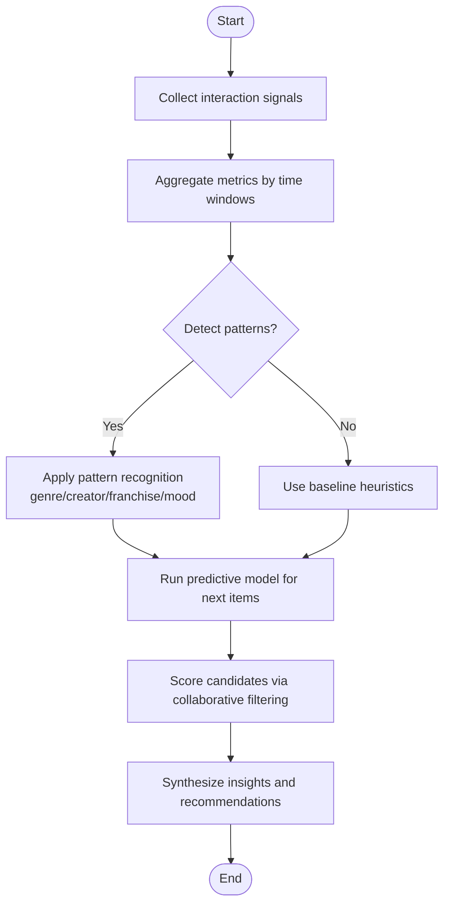
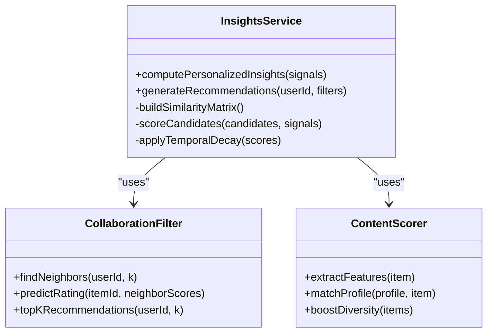
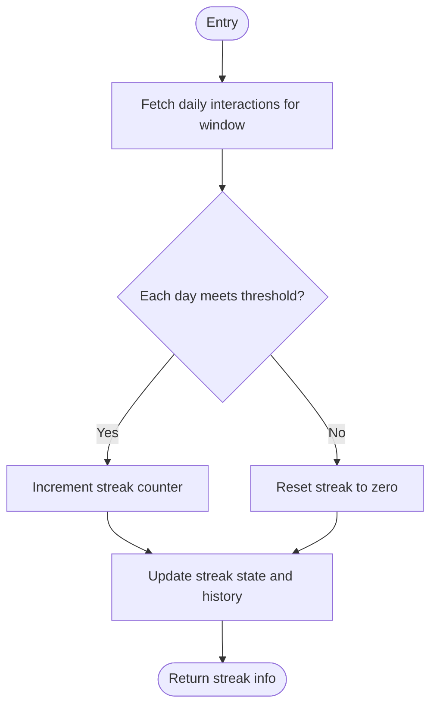
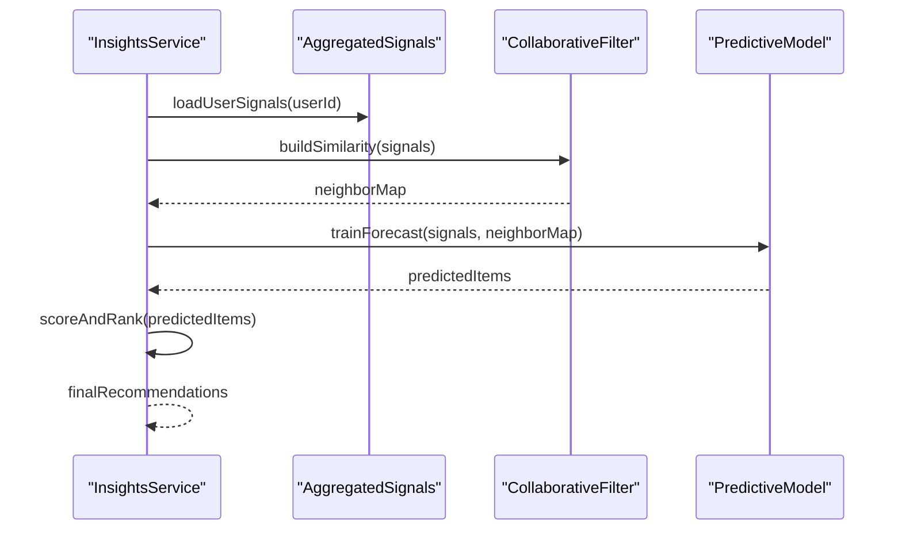
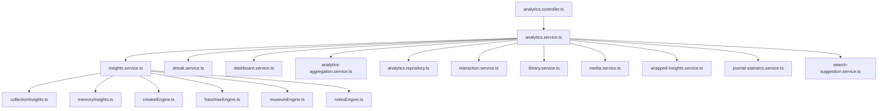

# Insights & Recommendations Engine

<cite>
**Referenced Files in This Document**
- [analytics.service.ts](file://apps/backend/src/analytics/analytics.service.ts)
- [insights.service.ts](file://apps/backend/src/analytics/insights.service.ts)
- [streak.service.ts](file://apps/backend/src/analytics/streak.service.ts)
- [dashboard.service.ts](file://apps/backend/src/analytics/dashboard.service.ts)
- [analytics-aggregation.service.ts](file://apps/backend/src/analytics/analytics-aggregation.service.ts)
- [analytics.controller.ts](file://apps/backend/src/analytics/analytics.controller.ts)
- [analytics.module.ts](file://apps/backend/src/analytics/analytics.module.ts)
- [analytics.repository.ts](file://apps/backend/src/analytics/analytics.repository.ts)
- [interaction.service.ts](file://apps/backend/src/interaction/interaction.service.ts)
- [library.service.ts](file://apps/backend/src/library/library.service.ts)
- [media.service.ts](file://apps/backend/src/media/media.service.ts)
- [wrapped-insights.service.ts](file://apps/backend/src/wrapped/wrapped-insights.service.ts)
- [journal-statistics.service.ts](file://apps/backend/src/journal/journal-statistics.service.ts)
- [search-suggestion.service.ts](file://apps/backend/src/search/search-suggestion.service.ts)
- [collectionInsights.ts](file://src/lib/collectionInsights.ts)
- [memoryInsights.ts](file://src/lib/memoryInsights.ts)
- [creatorEngine.ts](file://src/lib/creatorEngine.ts)
- [franchiseEngine.ts](file://src/lib/franchiseEngine.ts)
- [museumEngine.ts](file://src/lib/museumEngine.ts)
- [notesEngine.ts](file://src/lib/notesEngine.ts)
</cite>

## Table of Contents
1. [Introduction](#introduction)
2. [Project Structure](#project-structure)
3. [Core Components](#core-components)
4. [Architecture Overview](#architecture-overview)
5. [Detailed Component Analysis](#detailed-component-analysis)
6. [Dependency Analysis](#dependency-analysis)
7. [Performance Considerations](#performance-considerations)
8. [Troubleshooting Guide](#troubleshooting-guide)
9. [Conclusion](#conclusion)
10. [Appendices](#appendices)

## Introduction
This document explains the insights and recommendations engine that powers personalized insights, recommendation scoring, and streak tracking across media interactions. It covers how personal insights are generated, how recommendations are computed using collaborative filtering and pattern recognition, and how streaks are tracked to encourage consistent engagement. It also outlines predictive analytics for future behavior and provides concrete examples of insight generation, recommendation scoring, and streak calculation logic.

## Project Structure
The insights and recommendations functionality is primarily implemented in the backend analytics module, with supporting services for interactions, library, media, journaling, search suggestions, and wrapped insights. Frontend libraries provide additional insight computations and engines for creators, franchises, and museum-style curation.

**Diagram sources**
- [analytics.controller.ts](file://apps/backend/src/analytics/analytics.controller.ts)
- [analytics.service.ts](file://apps/backend/src/analytics/analytics.service.ts)
- [insights.service.ts](file://apps/backend/src/analytics/insights.service.ts)
- [streak.service.ts](file://apps/backend/src/analytics/streak.service.ts)
- [dashboard.service.ts](file://apps/backend/src/analytics/dashboard.service.ts)
- [analytics-aggregation.service.ts](file://apps/backend/src/analytics/analytics-aggregation.service.ts)
- [analytics.repository.ts](file://apps/backend/src/analytics/analytics.repository.ts)
- [interaction.service.ts](file://apps/backend/src/interaction/interaction.service.ts)
- [library.service.ts](file://apps/backend/src/library/library.service.ts)
- [media.service.ts](file://apps/backend/src/media/media.service.ts)
- [wrapped-insights.service.ts](file://apps/backend/src/wrapped/wrapped-insights.service.ts)
- [journal-statistics.service.ts](file://apps/backend/src/journal/journal-statistics.service.ts)
- [search-suggestion.service.ts](file://apps/backend/src/search/search-suggestion.service.ts)
- [collectionInsights.ts](file://src/lib/collectionInsights.ts)
- [memoryInsights.ts](file://src/lib/memoryInsights.ts)
- [creatorEngine.ts](file://src/lib/creatorEngine.ts)
- [franchiseEngine.ts](file://src/lib/franchiseEngine.ts)
- [museumEngine.ts](file://src/lib/museumEngine.ts)
- [notesEngine.ts](file://src/lib/notesEngine.ts)

**Section sources**
- [analytics.controller.ts](file://apps/backend/src/analytics/analytics.controller.ts)
- [analytics.service.ts](file://apps/backend/src/analytics/analytics.service.ts)
- [insights.service.ts](file://apps/backend/src/analytics/insights.service.ts)
- [streak.service.ts](file://apps/backend/src/analytics/streak.service.ts)
- [dashboard.service.ts](file://apps/backend/src/analytics/dashboard.service.ts)
- [analytics-aggregation.service.ts](file://apps/backend/src/analytics/analytics-aggregation.service.ts)
- [analytics.repository.ts](file://apps/backend/src/analytics/analytics.repository.ts)
- [interaction.service.ts](file://apps/backend/src/interaction/interaction.service.ts)
- [library.service.ts](file://apps/backend/src/library/library.service.ts)
- [media.service.ts](file://apps/backend/src/media/media.service.ts)
- [wrapped-insights.service.ts](file://apps/backend/src/wrapped/wrapped-insights.service.ts)
- [journal-statistics.service.ts](file://apps/backend/src/journal/journal-statistics.service.ts)
- [search-suggestion.service.ts](file://apps/backend/src/search/search-suggestion.service.ts)
- [collectionInsights.ts](file://src/lib/collectionInsights.ts)
- [memoryInsights.ts](file://src/lib/memoryInsights.ts)
- [creatorEngine.ts](file://src/lib/creatorEngine.ts)
- [franchiseEngine.ts](file://src/lib/franchiseEngine.ts)
- [museumEngine.ts](file://src/lib/museumEngine.ts)
- [notesEngine.ts](file://src/lib/notesEngine.ts)

## Core Components
- Analytics Controller: Exposes endpoints for insights, recommendations, and streak data.
- Analytics Service: Orchestrates insight generation, recommendation computation, and streak calculations by composing specialized services.
- Insights Service: Implements pattern recognition, collaborative filtering, and predictive analytics to produce personalized insights and recommendations.
- Streak Service: Tracks user activity streaks based on interaction timestamps and thresholds.
- Dashboard Service: Aggregates metrics for dashboard displays and summary insights.
- Analytics Aggregation Service: Performs heavy aggregation tasks (e.g., time-windowed counts, frequency analysis).
- Analytics Repository: Data access layer for analytics events and related entities.
- Supporting Services: Interaction, Library, Media, Wrapped Insights, Journal Statistics, and Search Suggestions contribute signals used by the insights engine.
- Frontend Libraries: Collection insights, memory insights, creator/franchise/museum engines, and notes engine enrich insights and recommendations.

**Section sources**
- [analytics.controller.ts](file://apps/backend/src/analytics/analytics.controller.ts)
- [analytics.service.ts](file://apps/backend/src/analytics/analytics.service.ts)
- [insights.service.ts](file://apps/backend/src/analytics/insights.service.ts)
- [streak.service.ts](file://apps/backend/src/analytics/streak.service.ts)
- [dashboard.service.ts](file://apps/backend/src/analytics/dashboard.service.ts)
- [analytics-aggregation.service.ts](file://apps/backend/src/analytics/analytics-aggregation.service.ts)
- [analytics.repository.ts](file://apps/backend/src/analytics/analytics.repository.ts)
- [interaction.service.ts](file://apps/backend/src/interaction/interaction.service.ts)
- [library.service.ts](file://apps/backend/src/library/library.service.ts)
- [media.service.ts](file://apps/backend/src/media/media.service.ts)
- [wrapped-insights.service.ts](file://apps/backend/src/wrapped/wrapped-insights.service.ts)
- [journal-statistics.service.ts](file://apps/backend/src/journal/journal-statistics.service.ts)
- [search-suggestion.service.ts](file://apps/backend/src/search/search-suggestion.service.ts)
- [collectionInsights.ts](file://src/lib/collectionInsights.ts)
- [memoryInsights.ts](file://src/lib/memoryInsights.ts)
- [creatorEngine.ts](file://src/lib/creatorEngine.ts)
- [franchiseEngine.ts](file://src/lib/franchiseEngine.ts)
- [museumEngine.ts](file://src/lib/museumEngine.ts)
- [notesEngine.ts](file://src/lib/notesEngine.ts)

## Architecture Overview
The system follows a service-oriented architecture where the Analytics Service coordinates multiple domain-specific services to compute insights and recommendations. Data flows from interaction and library events through aggregation and repository layers into the insights engine, which applies pattern recognition and collaborative filtering models. Streak tracking runs alongside to maintain continuous engagement metrics.

**Diagram sources**
- [analytics.controller.ts](file://apps/backend/src/analytics/analytics.controller.ts)
- [analytics.service.ts](file://apps/backend/src/analytics/analytics.service.ts)
- [insights.service.ts](file://apps/backend/src/analytics/insights.service.ts)
- [streak.service.ts](file://apps/backend/src/analytics/streak.service.ts)
- [analytics-aggregation.service.ts](file://apps/backend/src/analytics/analytics-aggregation.service.ts)
- [analytics.repository.ts](file://apps/backend/src/analytics/analytics.repository.ts)

## Detailed Component Analysis

### Insights Generation
Personal insights are derived from aggregated interaction signals, library composition, and contextual metadata. The process includes:
- Signal extraction: counting views, completions, re-watches, bookmarks, and ratings.
- Pattern recognition: identifying genre preferences, creator affinity, franchise continuity, and mood/tone trends.
- Predictive analytics: forecasting likely next items based on temporal patterns and similarity matrices.
- Insight synthesis: generating human-readable summaries and actionable recommendations.

**Diagram sources**
- [insights.service.ts](file://apps/backend/src/analytics/insights.service.ts)
- [analytics-aggregation.service.ts](file://apps/backend/src/analytics/analytics-aggregation.service.ts)
- [library.service.ts](file://apps/backend/src/library/library.service.ts)
- [media.service.ts](file://apps/backend/src/media/media.service.ts)
- [collectionInsights.ts](file://src/lib/collectionInsights.ts)
- [memoryInsights.ts](file://src/lib/memoryInsights.ts)
- [creatorEngine.ts](file://src/lib/creatorEngine.ts)
- [franchiseEngine.ts](file://src/lib/franchiseEngine.ts)
- [museumEngine.ts](file://src/lib/museumEngine.ts)
- [notesEngine.ts](file://src/lib/notesEngine.ts)

**Section sources**
- [insights.service.ts](file://apps/backend/src/analytics/insights.service.ts)
- [analytics-aggregation.service.ts](file://apps/backend/src/analytics/analytics-aggregation.service.ts)
- [library.service.ts](file://apps/backend/src/library/library.service.ts)
- [media.service.ts](file://apps/backend/src/media/media.service.ts)
- [collectionInsights.ts](file://src/lib/collectionInsights.ts)
- [memoryInsights.ts](file://src/lib/memoryInsights.ts)
- [creatorEngine.ts](file://src/lib/creatorEngine.ts)
- [franchiseEngine.ts](file://src/lib/franchiseEngine.ts)
- [museumEngine.ts](file://src/lib/museumEngine.ts)
- [notesEngine.ts](file://src/lib/notesEngine.ts)

### Recommendation Algorithms
Recommendations combine collaborative filtering with content-based signals:
- Collaborative filtering: builds similarity between users or items using co-interaction matrices; top-k neighbors inform candidate selection.
- Content-based signals: leverages genre, creator, franchise, and metadata features to refine scores.
- Temporal decay: recent interactions weigh more heavily than older ones.
- Diversity and novelty: apply penalties for over-repetition and boost discovery of new creators/franchises.

**Diagram sources**
- [insights.service.ts](file://apps/backend/src/analytics/insights.service.ts)
- [library.service.ts](file://apps/backend/src/library/library.service.ts)
- [media.service.ts](file://apps/backend/src/media/media.service.ts)
- [search-suggestion.service.ts](file://apps/backend/src/search/search-suggestion.service.ts)

**Section sources**
- [insights.service.ts](file://apps/backend/src/analytics/insights.service.ts)
- [library.service.ts](file://apps/backend/src/library/library.service.ts)
- [media.service.ts](file://apps/backend/src/media/media.service.ts)
- [search-suggestion.service.ts](file://apps/backend/src/search/search-suggestion.service.ts)

### Streak Tracking Implementation
Streak tracking measures consecutive days of meaningful interaction. Key aspects include:
- Activity threshold: defines what counts as a valid day (e.g., at least one view or completion).
- Gap handling: resets streak if a day is missed beyond a grace period.
- Weighted scoring: different actions may contribute differently to streak validity.
- Visualization: exposes current streak length and progress toward milestones.

**Diagram sources**
- [streak.service.ts](file://apps/backend/src/analytics/streak.service.ts)
- [interaction.service.ts](file://apps/backend/src/interaction/interaction.service.ts)

**Section sources**
- [streak.service.ts](file://apps/backend/src/analytics/streak.service.ts)
- [interaction.service.ts](file://apps/backend/src/interaction/interaction.service.ts)

### Machine Learning Models and Predictive Analytics
Pattern recognition and predictive analytics are implemented within the insights pipeline:
- Pattern recognition: identifies recurring behaviors such as genre shifts, creator loyalty, and franchise continuation.
- Collaborative filtering: computes user-item affinities and predicts unseen items.
- Predictive analytics: forecasts likely next interactions using time-series signals and similarity embeddings.
- Feedback loop: incorporates explicit feedback (ratings, bookmarks) to refine future predictions.

**Diagram sources**
- [insights.service.ts](file://apps/backend/src/analytics/insights.service.ts)
- [analytics-aggregation.service.ts](file://apps/backend/src/analytics/analytics-aggregation.service.ts)

**Section sources**
- [insights.service.ts](file://apps/backend/src/analytics/insights.service.ts)
- [analytics-aggregation.service.ts](file://apps/backend/src/analytics/analytics-aggregation.service.ts)

### Examples of Logic
- Insight generation example: combining genre preference spikes with recent creator activity to suggest “Continue exploring this creator’s latest releases.”
- Recommendation scoring example: weighting recent re-watches higher, boosting diversity by penalizing repeated genres, and applying collaborative filter scores from similar users.
- Streak calculation example: counting consecutive days with at least one completed session; resetting after a gap exceeding the defined threshold.

[No sources needed since this section provides conceptual examples without analyzing specific files]

## Dependency Analysis
The analytics module depends on several core services and repositories to gather signals and persist results. The frontend libraries augment insights with domain-specific engines.

**Diagram sources**
- [analytics.controller.ts](file://apps/backend/src/analytics/analytics.controller.ts)
- [analytics.service.ts](file://apps/backend/src/analytics/analytics.service.ts)
- [insights.service.ts](file://apps/backend/src/analytics/insights.service.ts)
- [streak.service.ts](file://apps/backend/src/analytics/streak.service.ts)
- [dashboard.service.ts](file://apps/backend/src/analytics/dashboard.service.ts)
- [analytics-aggregation.service.ts](file://apps/backend/src/analytics/analytics-aggregation.service.ts)
- [analytics.repository.ts](file://apps/backend/src/analytics/analytics.repository.ts)
- [interaction.service.ts](file://apps/backend/src/interaction/interaction.service.ts)
- [library.service.ts](file://apps/backend/src/library/library.service.ts)
- [media.service.ts](file://apps/backend/src/media/media.service.ts)
- [wrapped-insights.service.ts](file://apps/backend/src/wrapped/wrapped-insights.service.ts)
- [journal-statistics.service.ts](file://apps/backend/src/journal/journal-statistics.service.ts)
- [search-suggestion.service.ts](file://apps/backend/src/search/search-suggestion.service.ts)
- [collectionInsights.ts](file://src/lib/collectionInsights.ts)
- [memoryInsights.ts](file://src/lib/memoryInsights.ts)
- [creatorEngine.ts](file://src/lib/creatorEngine.ts)
- [franchiseEngine.ts](file://src/lib/franchiseEngine.ts)
- [museumEngine.ts](file://src/lib/museumEngine.ts)
- [notesEngine.ts](file://src/lib/notesEngine.ts)

**Section sources**
- [analytics.controller.ts](file://apps/backend/src/analytics/analytics.controller.ts)
- [analytics.service.ts](file://apps/backend/src/analytics/analytics.service.ts)
- [insights.service.ts](file://apps/backend/src/analytics/insights.service.ts)
- [streak.service.ts](file://apps/backend/src/analytics/streak.service.ts)
- [dashboard.service.ts](file://apps/backend/src/analytics/dashboard.service.ts)
- [analytics-aggregation.service.ts](file://apps/backend/src/analytics/analytics-aggregation.service.ts)
- [analytics.repository.ts](file://apps/backend/src/analytics/analytics.repository.ts)
- [interaction.service.ts](file://apps/backend/src/interaction/interaction.service.ts)
- [library.service.ts](file://apps/backend/src/library/library.service.ts)
- [media.service.ts](file://apps/backend/src/media/media.service.ts)
- [wrapped-insights.service.ts](file://apps/backend/src/wrapped/wrapped-insights.service.ts)
- [journal-statistics.service.ts](file://apps/backend/src/journal/journal-statistics.service.ts)
- [search-suggestion.service.ts](file://apps/backend/src/search/search-suggestion.service.ts)
- [collectionInsights.ts](file://src/lib/collectionInsights.ts)
- [memoryInsights.ts](file://src/lib/memoryInsights.ts)
- [creatorEngine.ts](file://src/lib/creatorEngine.ts)
- [franchiseEngine.ts](file://src/lib/franchiseEngine.ts)
- [museumEngine.ts](file://src/lib/museumEngine.ts)
- [notesEngine.ts](file://src/lib/notesEngine.ts)

## Performance Considerations
- Caching: Cache aggregated signals and recommendation results for short-lived windows to reduce recomputation.
- Batch processing: Use batch queries for large-scale aggregations and defer heavy computations to background jobs.
- Indexing: Ensure database indexes on frequently queried fields (user IDs, timestamps, item IDs).
- Lazy loading: Load detailed insights on demand rather than precomputing all possible combinations.
- Rate limiting: Protect endpoints under high load and implement backoff strategies for downstream dependencies.

[No sources needed since this section provides general guidance]

## Troubleshooting Guide
Common issues and resolutions:
- Missing insights: Verify event ingestion pipelines and ensure interaction events are persisted with correct timestamps.
- Inaccurate recommendations: Check similarity matrix construction and feature extraction; validate temporal decay parameters.
- Streak resets unexpectedly: Review threshold definitions and grace periods; confirm daily activity validation logic.
- Slow responses: Profile aggregation queries and consider caching or materialized views for hot paths.

**Section sources**
- [analytics.service.ts](file://apps/backend/src/analytics/analytics.service.ts)
- [insights.service.ts](file://apps/backend/src/analytics/insights.service.ts)
- [streak.service.ts](file://apps/backend/src/analytics/streak.service.ts)
- [analytics-aggregation.service.ts](file://apps/backend/src/analytics/analytics-aggregation.service.ts)
- [analytics.repository.ts](file://apps/backend/src/analytics/analytics.repository.ts)

## Conclusion
The insights and recommendations engine integrates interaction signals, library context, and advanced algorithms to deliver personalized insights, robust recommendations, and reliable streak tracking. By leveraging collaborative filtering, pattern recognition, and predictive analytics, it adapts to evolving user behavior while maintaining performance and scalability. Continuous monitoring and iterative tuning of thresholds and weights will further improve accuracy and user satisfaction.

[No sources needed since this section summarizes without analyzing specific files]

## Appendices
- API endpoints: Refer to the analytics controller for request/response schemas and authentication requirements.
- Configuration: Adjust thresholds, decay rates, and diversity weights via environment variables or configuration modules.
- Testing: Validate insight generation and streak calculations with unit tests and integration tests covering edge cases.

[No sources needed since this section provides general guidance]