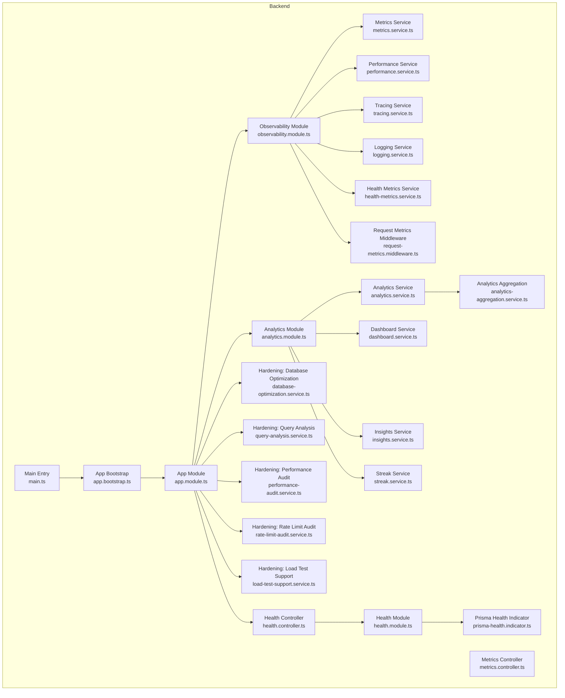
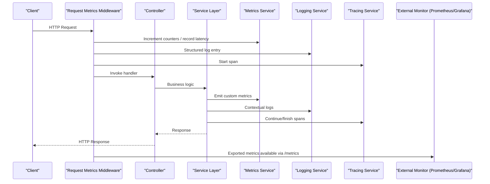
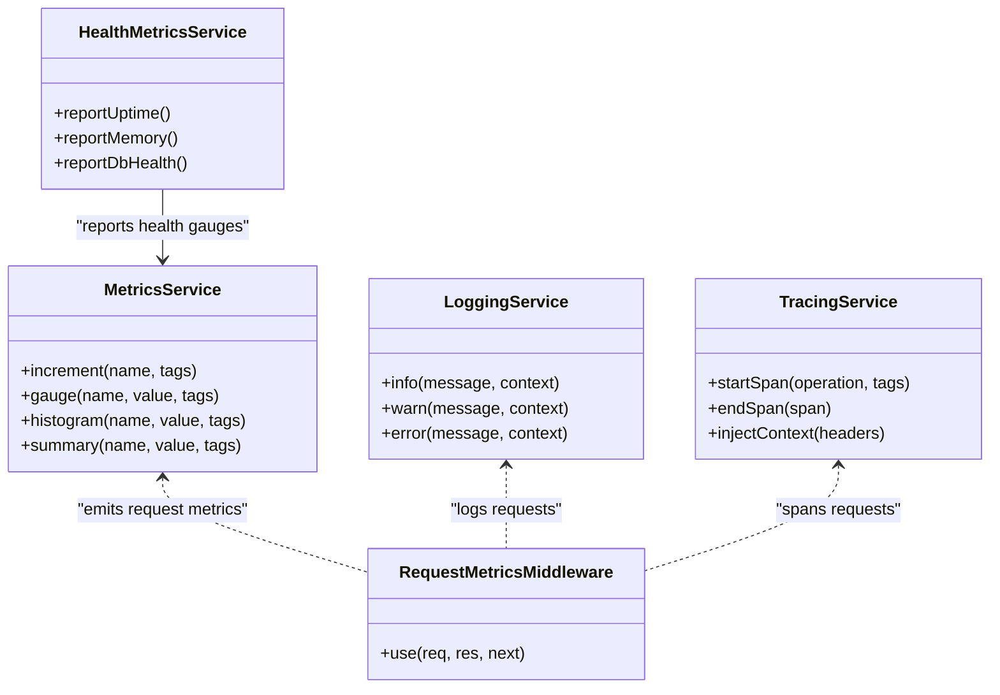
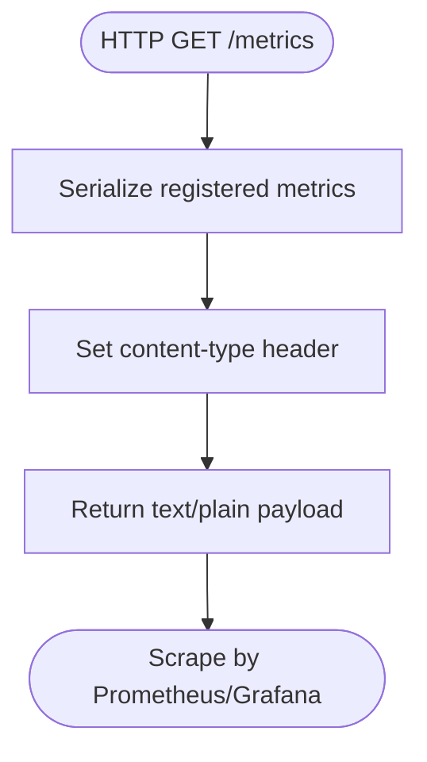
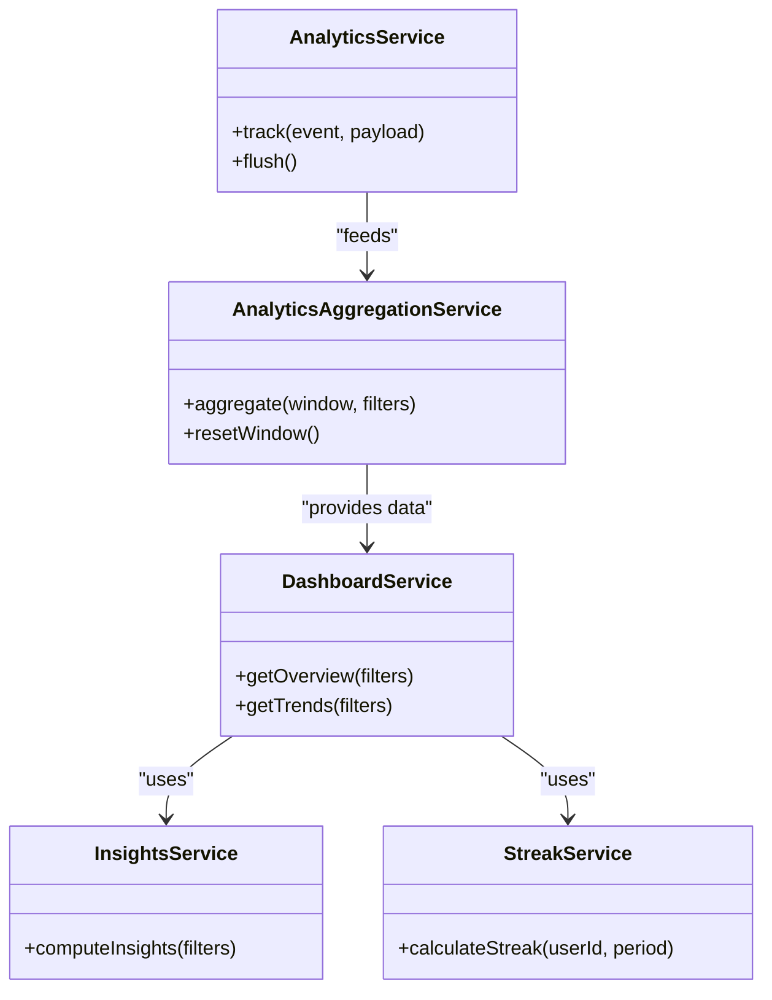
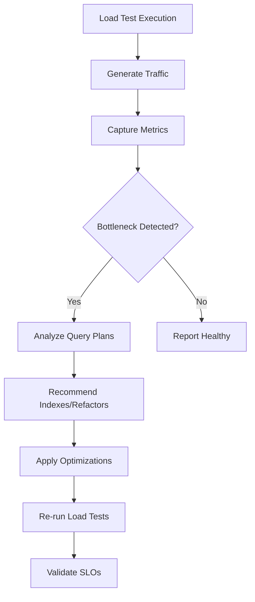
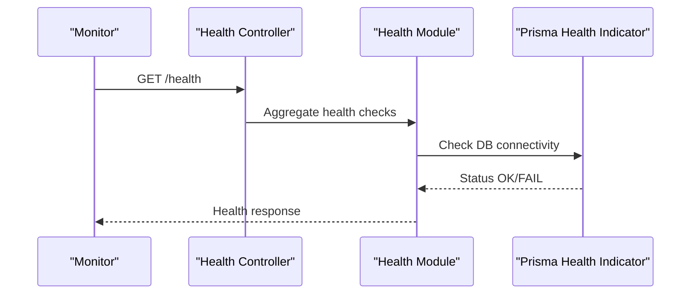
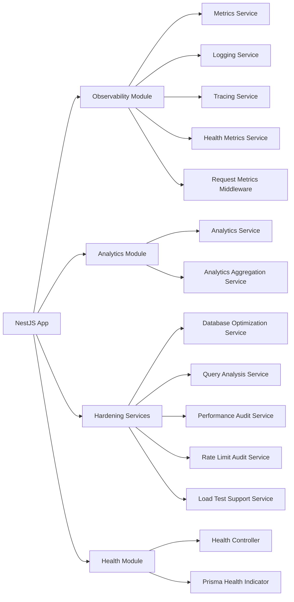
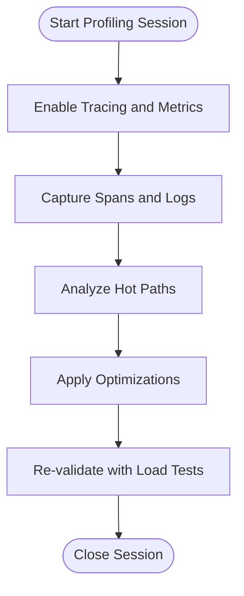

# Performance Monitoring & Analytics

<cite>
**Referenced Files in This Document**
- [app.bootstrap.ts](file://apps/backend/src/app.bootstrap.ts)
- [app.module.ts](file://apps/backend/src/app.module.ts)
- [main.ts](file://apps/backend/src/main.ts)
- [observability.module.ts](file://apps/backend/src/observability/observability.module.ts)
- [metrics.service.ts](file://apps/backend/src/observability/metrics.service.ts)
- [metrics.controller.ts](file://apps/backend/src/observability/metrics.controller.ts)
- [performance.service.ts](file://apps/backend/src/observability/performance.service.ts)
- [tracing.service.ts](file://apps/backend/src/observability/tracing.service.ts)
- [logging.service.ts](file://apps/backend/src/observability/logging.service.ts)
- [health-metrics.service.ts](file://apps/backend/src/observability/health-metrics.service.ts)
- [request-metrics.middleware.ts](file://apps/backend/src/observability/request-metrics.middleware.ts)
- [analytics.module.ts](file://apps/backend/src/analytics/analytics.module.ts)
- [analytics.service.ts](file://apps/backend/src/analytics/analytics.service.ts)
- [analytics-aggregation.service.ts](file://apps/backend/src/analytics/analytics-aggregation.service.ts)
- [dashboard.service.ts](file://apps/backend/src/analytics/dashboard.service.ts)
- [insights.service.ts](file://apps/backend/src/analytics/insights.service.ts)
- [streak.service.ts](file://apps/backend/src/analytics/streak.service.ts)
- [database-optimization.service.ts](file://apps/backend/src/hardening/database-optimization.service.ts)
- [query-analysis.service.ts](file://apps/backend/src/hardening/query-analysis.service.ts)
- [performance-audit.service.ts](file://apps/backend/src/hardening/performance-audit.service.ts)
- [rate-limit-audit.service.ts](file://apps/backend/src/hardening/rate-limit-audit.service.ts)
- [load-test-support.service.ts](file://apps/backend/src/hardening/load-test-support.service.ts)
- [prisma-health.indicator.ts](file://apps/backend/src/health/prisma-health.indicator.ts)
- [health.controller.ts](file://apps/backend/src/health/health.controller.ts)
- [health.module.ts](file://apps/backend/src/health/health.module.ts)
- [load.yml](file://apps/backend/loadtests/artillery/load.yml)
- [smoke.yml](file://apps/backend/loadtests/artillery/smoke.yml)
- [load.js](file://apps/backend/loadtests/k6/load.js)
- [smoke.js](file://apps/backend/loadtests/k6/smoke.js)
- [soak.js](file://apps/backend/loadtests/k6/soak.js)
- [spike.js](file://apps/backend/loadtests/k6/spike.js)
- [stress.js](file://apps/backend/loadtests/k6/stress.js)
</cite>

## Table of Contents
1. [Introduction](#introduction)
2. [Project Structure](#project-structure)
3. [Core Components](#core-components)
4. [Architecture Overview](#architecture-overview)
5. [Detailed Component Analysis](#detailed-component-analysis)
6. [Dependency Analysis](#dependency-analysis)
7. [Performance Considerations](#performance-considerations)
8. [Troubleshooting Guide](#troubleshooting-guide)
9. [Conclusion](#conclusion)
10. [Appendices](#appendices)

## Introduction
This document explains how performance monitoring and analytics are implemented across the application. It covers how metrics are collected, how bottlenecks are identified, and how the observability stack integrates with external tools. It also includes guidance for profiling, memory analysis, database query optimization, and alerting strategies.

## Project Structure
The backend is a NestJS application with dedicated modules for observability, analytics, hardening (performance), health checks, and load testing. The frontend exposes analytics UI components and hooks but this document focuses on backend telemetry and analytics services.

**Diagram sources**
- [app.bootstrap.ts](file://apps/backend/src/app.bootstrap.ts)
- [app.module.ts](file://apps/backend/src/app.module.ts)
- [main.ts](file://apps/backend/src/main.ts)
- [observability.module.ts](file://apps/backend/src/observability/observability.module.ts)
- [metrics.service.ts](file://apps/backend/src/observability/metrics.service.ts)
- [metrics.controller.ts](file://apps/backend/src/observability/metrics.controller.ts)
- [performance.service.ts](file://apps/backend/src/observability/performance.service.ts)
- [tracing.service.ts](file://apps/backend/src/observability/tracing.service.ts)
- [logging.service.ts](file://apps/backend/src/observability/logging.service.ts)
- [health-metrics.service.ts](file://apps/backend/src/observability/health-metrics.service.ts)
- [request-metrics.middleware.ts](file://apps/backend/src/observability/request-metrics.middleware.ts)
- [analytics.module.ts](file://apps/backend/src/analytics/analytics.module.ts)
- [analytics.service.ts](file://apps/backend/src/analytics/analytics.service.ts)
- [analytics-aggregation.service.ts](file://apps/backend/src/analytics/analytics-aggregation.service.ts)
- [dashboard.service.ts](file://apps/backend/src/analytics/dashboard.service.ts)
- [insights.service.ts](file://apps/backend/src/analytics/insights.service.ts)
- [streak.service.ts](file://apps/backend/src/analytics/streak.service.ts)
- [database-optimization.service.ts](file://apps/backend/src/hardening/database-optimization.service.ts)
- [query-analysis.service.ts](file://apps/backend/src/hardening/query-analysis.service.ts)
- [performance-audit.service.ts](file://apps/backend/src/hardening/performance-audit.service.ts)
- [rate-limit-audit.service.ts](file://apps/backend/src/hardening/rate-limit-audit.service.ts)
- [load-test-support.service.ts](file://apps/backend/src/hardening/load-test-support.service.ts)
- [health.controller.ts](file://apps/backend/src/health/health.controller.ts)
- [health.module.ts](file://apps/backend/src/health/health.module.ts)
- [prisma-health.indicator.ts](file://apps/backend/src/health/prisma-health.indicator.ts)

**Section sources**
- [app.bootstrap.ts](file://apps/backend/src/app.bootstrap.ts)
- [app.module.ts](file://apps/backend/src/app.module.ts)
- [main.ts](file://apps/backend/src/main.ts)

## Core Components
- Observability module centralizes metrics, tracing, logging, and health metrics collection.
- Metrics controller exposes an endpoint to export metrics in a standard format for scraping by external systems.
- Request metrics middleware captures per-request latency and status codes.
- Analytics module provides business-level event tracking, aggregation, dashboards, insights, and streaks.
- Hardening services provide database optimization, query analysis, performance audits, rate limit auditing, and load test support utilities.
- Health endpoints expose readiness/liveness and database connectivity indicators.

**Section sources**
- [observability.module.ts](file://apps/backend/src/observability/observability.module.ts)
- [metrics.controller.ts](file://apps/backend/src/observability/metrics.controller.ts)
- [request-metrics.middleware.ts](file://apps/backend/src/observability/request-metrics.middleware.ts)
- [analytics.module.ts](file://apps/backend/src/analytics/analytics.module.ts)
- [database-optimization.service.ts](file://apps/backend/src/hardening/database-optimization.service.ts)
- [query-analysis.service.ts](file://apps/backend/src/hardening/query-analysis.service.ts)
- [performance-audit.service.ts](file://apps/backend/src/hardening/performance-audit.service.ts)
- [rate-limit-audit.service.ts](file://apps/backend/src/hardening/rate-limit-audit.service.ts)
- [load-test-support.service.ts](file://apps/backend/src/hardening/load-test-support.service.ts)
- [health.controller.ts](file://apps/backend/src/health/health.controller.ts)
- [health.module.ts](file://apps/backend/src/health/health.module.ts)
- [prisma-health.indicator.ts](file://apps/backend/src/health/prisma-health.indicator.ts)

## Architecture Overview
The observability architecture layers request instrumentation, service-level metrics, and business analytics together. External monitoring tools can scrape metrics via the exposed controller, while logs and traces are emitted through centralized services.

**Diagram sources**
- [request-metrics.middleware.ts](file://apps/backend/src/observability/request-metrics.middleware.ts)
- [metrics.service.ts](file://apps/backend/src/observability/metrics.service.ts)
- [logging.service.ts](file://apps/backend/src/observability/logging.service.ts)
- [tracing.service.ts](file://apps/backend/src/observability/tracing.service.ts)
- [metrics.controller.ts](file://apps/backend/src/observability/metrics.controller.ts)

## Detailed Component Analysis

### Observability Stack
- Metrics Service: Centralized metric emission for counters, gauges, histograms, and summaries.
- Logging Service: Structured logging with correlation IDs and contextual fields.
- Tracing Service: Distributed tracing spans around critical operations.
- Health Metrics Service: Aggregates system and dependency health signals into metrics.
- Request Metrics Middleware: Captures request lifecycle timing and status distribution.

**Diagram sources**
- [metrics.service.ts](file://apps/backend/src/observability/metrics.service.ts)
- [logging.service.ts](file://apps/backend/src/observability/logging.service.ts)
- [tracing.service.ts](file://apps/backend/src/observability/tracing.service.ts)
- [health-metrics.service.ts](file://apps/backend/src/observability/health-metrics.service.ts)
- [request-metrics.middleware.ts](file://apps/backend/src/observability/request-metrics.middleware.ts)

**Section sources**
- [metrics.service.ts](file://apps/backend/src/observability/metrics.service.ts)
- [logging.service.ts](file://apps/backend/src/observability/logging.service.ts)
- [tracing.service.ts](file://apps/backend/src/observability/tracing.service.ts)
- [health-metrics.service.ts](file://apps/backend/src/observability/health-metrics.service.ts)
- [request-metrics.middleware.ts](file://apps/backend/src/observability/request-metrics.middleware.ts)

### Metrics Export and Scraping
- Metrics Controller exposes an endpoint that serializes current metrics for Prometheus or compatible scrapers.
- Ensure the endpoint is secured appropriately in production and only exposed within your monitoring network.

**Diagram sources**
- [metrics.controller.ts](file://apps/backend/src/observability/metrics.controller.ts)

**Section sources**
- [metrics.controller.ts](file://apps/backend/src/observability/metrics.controller.ts)

### Analytics Services
- Analytics Service: Emits domain events and tracks user interactions.
- Analytics Aggregation Service: Computes aggregates over time windows for dashboards.
- Dashboard Service: Provides aggregated views for UI consumption.
- Insights Service: Derives actionable insights from analytics data.
- Streak Service: Tracks consecutive activity patterns.

**Diagram sources**
- [analytics.service.ts](file://apps/backend/src/analytics/analytics.service.ts)
- [analytics-aggregation.service.ts](file://apps/backend/src/analytics/analytics-aggregation.service.ts)
- [dashboard.service.ts](file://apps/backend/src/analytics/dashboard.service.ts)
- [insights.service.ts](file://apps/backend/src/analytics/insights.service.ts)
- [streak.service.ts](file://apps/backend/src/analytics/streak.service.ts)

**Section sources**
- [analytics.module.ts](file://apps/backend/src/analytics/analytics.module.ts)
- [analytics.service.ts](file://apps/backend/src/analytics/analytics.service.ts)
- [analytics-aggregation.service.ts](file://apps/backend/src/analytics/analytics-aggregation.service.ts)
- [dashboard.service.ts](file://apps/backend/src/analytics/dashboard.service.ts)
- [insights.service.ts](file://apps/backend/src/analytics/insights.service.ts)
- [streak.service.ts](file://apps/backend/src/analytics/streak.service.ts)

### Hardening and Performance Tools
- Database Optimization Service: Identifies slow queries and suggests indexes or refactors.
- Query Analysis Service: Inspects query plans and execution stats.
- Performance Audit Service: Periodic audits of hot paths and resource usage.
- Rate Limit Audit Service: Reviews rate limiting effectiveness and abuse patterns.
- Load Test Support Service: Utilities to simulate traffic and measure SLOs.

**Diagram sources**
- [database-optimization.service.ts](file://apps/backend/src/hardening/database-optimization.service.ts)
- [query-analysis.service.ts](file://apps/backend/src/hardening/query-analysis.service.ts)
- [performance-audit.service.ts](file://apps/backend/src/hardening/performance-audit.service.ts)
- [rate-limit-audit.service.ts](file://apps/backend/src/hardening/rate-limit-audit.service.ts)
- [load-test-support.service.ts](file://apps/backend/src/hardening/load-test-support.service.ts)

**Section sources**
- [database-optimization.service.ts](file://apps/backend/src/hardening/database-optimization.service.ts)
- [query-analysis.service.ts](file://apps/backend/src/hardening/query-analysis.service.ts)
- [performance-audit.service.ts](file://apps/backend/src/hardening/performance-audit.service.ts)
- [rate-limit-audit.service.ts](file://apps/backend/src/hardening/rate-limit-audit.service.ts)
- [load-test-support.service.ts](file://apps/backend/src/hardening/load-test-support.service.ts)

### Health Checks and Readiness
- Health Controller exposes readiness/liveness endpoints.
- Prisma Health Indicator verifies database connectivity and basic operations.

**Diagram sources**
- [health.controller.ts](file://apps/backend/src/health/health.controller.ts)
- [health.module.ts](file://apps/backend/src/health/health.module.ts)
- [prisma-health.indicator.ts](file://apps/backend/src/health/prisma-health.indicator.ts)

**Section sources**
- [health.controller.ts](file://apps/backend/src/health/health.controller.ts)
- [health.module.ts](file://apps/backend/src/health/health.module.ts)
- [prisma-health.indicator.ts](file://apps/backend/src/health/prisma-health.indicator.ts)

## Dependency Analysis
Key dependencies include NestJS core, Prisma ORM, Redis, BullMQ queues, and optional external telemetry backends. The observability module depends on metrics, logging, and tracing services; analytics depends on storage and aggregation services; hardening services depend on database introspection and runtime profiling.

**Diagram sources**
- [app.module.ts](file://apps/backend/src/app.module.ts)
- [observability.module.ts](file://apps/backend/src/observability/observability.module.ts)
- [analytics.module.ts](file://apps/backend/src/analytics/analytics.module.ts)
- [database-optimization.service.ts](file://apps/backend/src/hardening/database-optimization.service.ts)
- [query-analysis.service.ts](file://apps/backend/src/hardening/query-analysis.service.ts)
- [performance-audit.service.ts](file://apps/backend/src/hardening/performance-audit.service.ts)
- [rate-limit-audit.service.ts](file://apps/backend/src/hardening/rate-limit-audit.service.ts)
- [load-test-support.service.ts](file://apps/backend/src/hardening/load-test-support.service.ts)
- [health.controller.ts](file://apps/backend/src/health/health.controller.ts)
- [health.module.ts](file://apps/backend/src/health/health.module.ts)
- [prisma-health.indicator.ts](file://apps/backend/src/health/prisma-health.indicator.ts)

**Section sources**
- [app.module.ts](file://apps/backend/src/app.module.ts)

## Performance Considerations
- Instrumentation overhead: Keep histogram buckets and sampling rates tuned to avoid high cardinality and CPU overhead.
- Memory profiling: Use periodic heap snapshots and monitor RSS/heap used via OS and Node metrics.
- Database optimization: Leverage query analysis to identify N+1 queries and missing indexes; use connection pooling and read replicas where applicable.
- Caching strategy: Cache expensive aggregations and frequently accessed entities; implement cache invalidation policies.
- Queue backpressure: Monitor queue depth and consumer lag; scale workers based on throughput and latency SLOs.
- Load testing: Run k6 and Artillery suites regularly to validate capacity and regressions.

[No sources needed since this section provides general guidance]

## Troubleshooting Guide
- High latency spikes: Correlate request metrics with tracing spans to isolate slow endpoints and downstream calls.
- Memory growth: Track heap and RSS trends; analyze GC pauses and long-lived references.
- Database slowdowns: Review query analysis reports; add indexes or rewrite queries; check lock contention.
- Alert fatigue: Tune thresholds and grouping rules; ensure alerts are actionable and routed correctly.
- Health check failures: Inspect Prisma health indicator and dependency statuses; verify environment variables and connectivity.

**Section sources**
- [metrics.service.ts](file://apps/backend/src/observability/metrics.service.ts)
- [tracing.service.ts](file://apps/backend/src/observability/tracing.service.ts)
- [logging.service.ts](file://apps/backend/src/observability/logging.service.ts)
- [query-analysis.service.ts](file://apps/backend/src/hardening/query-analysis.service.ts)
- [health.controller.ts](file://apps/backend/src/health/health.controller.ts)
- [prisma-health.indicator.ts](file://apps/backend/src/health/prisma-health.indicator.ts)

## Conclusion
The observability and analytics stack provides comprehensive visibility into application performance and business metrics. By combining request-level instrumentation, structured logging, distributed tracing, and robust analytics services, teams can quickly detect and resolve bottlenecks. Integrating with external monitoring tools and running regular load tests ensures sustained reliability and performance under load.

[No sources needed since this section summarizes without analyzing specific files]

## Appendices

### Example: Performance Profiling Workflow

[No sources needed since this diagram shows conceptual workflow, not actual code structure]

### Example: Memory Usage Analysis
- Collect Node.js process metrics (RSS, heap total/used).
- Take periodic heap snapshots during load tests.
- Identify large object retention and memory leaks using snapshot diffs.

[No sources needed since this section provides general guidance]

### Example: Database Query Optimization
- Use query analysis to find slow queries and missing indexes.
- Refactor N+1 patterns into batched queries or joins.
- Add appropriate indexes and review query plans after changes.

[No sources needed since this section provides general guidance]

### Integration with External Monitoring Tools
- Scrape metrics via the metrics controller endpoint.
- Configure Prometheus to discover and scrape the endpoint periodically.
- Visualize metrics in Grafana with dashboards for latency, error rates, and resource usage.
- Forward logs to a centralized log aggregator (e.g., Loki, ELK) using structured JSON.

[No sources needed since this section provides general guidance]

### Alerting Rules
- Define thresholds for latency percentiles, error rates, and resource saturation.
- Group alerts by service and environment to reduce noise.
- Route alerts to incident channels with runbooks for quick resolution.

[No sources needed since this section provides general guidance]

### Load Testing Suites
- Artillery scenarios for smoke and load tests.
- k6 scripts for load, soak, spike, and stress testing.

**Section sources**
- [load.yml](file://apps/backend/loadtests/artillery/load.yml)
- [smoke.yml](file://apps/backend/loadtests/artillery/smoke.yml)
- [load.js](file://apps/backend/loadtests/k6/load.js)
- [smoke.js](file://apps/backend/loadtests/k6/smoke.js)
- [soak.js](file://apps/backend/loadtests/k6/soak.js)
- [spike.js](file://apps/backend/loadtests/k6/spike.js)
- [stress.js](file://apps/backend/loadtests/k6/stress.js)