# Authentication & Authorization

<cite>
**Referenced Files in This Document**
- [auth.module.ts](file://apps/backend/src/auth/auth.module.ts)
- [auth.controller.ts](file://apps/backend/src/auth/auth.controller.ts)
- [auth.service.ts](file://apps/backend/src/auth/auth.service.ts)
- [auth.repository.ts](file://apps/backend/src/auth/auth.repository.ts)
- [index.ts](file://apps/backend/src/auth/index.ts)
- [controllers/auth.controller.ts](file://apps/backend/src/auth/controllers/auth.controller.ts)
- [controllers/oauth.controller.ts](file://apps/backend/src/auth/controllers/oauth.controller.ts)
- [controllers/email.controller.ts](file://apps/backend/src/auth/controllers/email.controller.ts)
- [guards/jwt.guard.ts](file://apps/backend/src/auth/guards/jwt.guard.ts)
- [guards/roles.guard.ts](file://apps/backend/src/auth/guards/roles.guard.ts)
- [decorators/current-user.decorator.ts](file://apps/backend/src/auth/decorators/current-user.decorator.ts)
- [decorators/roles.decorator.ts](file://apps/backend/src/auth/decorators/roles.decorator.ts)
- [strategies/jwt.strategy.ts](file://apps/backend/src/auth/strategies/jwt.strategy.ts)
- [strategies/google.strategy.ts](file://apps/backend/src/auth/strategies/google.strategy.ts)
- [dto/login.dto.ts](file://apps/backend/src/auth/dto/login.dto.ts)
- [dto/register.dto.ts](file://apps/backend/src/auth/dto/register.dto.ts)
- [dto/reset-password.dto.ts](file://apps/backend/src/auth/dto/reset-password.dto.ts)
- [dto/refresh-token.dto.ts](file://apps/backend/src/auth/dto/refresh-token.dto.ts)
- [services/user.service.ts](file://apps/backend/src/auth/services/user.service.ts)
- [services/token.service.ts](file://apps/backend/src/auth/services/token.service.ts)
- [services/password.service.ts](file://apps/backend/src/auth/services/password.service.ts)
- [services/email.service.ts](file://apps/backend/src/auth/services/email.service.ts)
- [services/oauth.service.ts](file://apps/backend/src/auth/services/oauth.service.ts)
- [services/session.service.ts](file://apps/backend/src/auth/services/session.service.ts)
- [services/rate-limit.service.ts](file://apps/backend/src/auth/services/rate-limit.service.ts)
- [services/csrf.service.ts](file://apps/backend/src/auth/services/csrf.service.ts)
- [core/hash/bcrypt.service.ts](file://apps/backend/src/core/hash/bcrypt.service.ts)
- [core/events/event-emitter.service.ts](file://apps/backend/src/core/events/event-emitter.service.ts)
- [config/configuration.ts](file://apps/backend/src/config/configuration.ts)
- [app.module.ts](file://apps/backend/src/app.module.ts)
- [main.ts](file://apps/backend/src/main.ts)
</cite>

## Table of Contents
1. [Introduction](#introduction)
2. [Project Structure](#project-structure)
3. [Core Components](#core-components)
4. [Architecture Overview](#architecture-overview)
5. [Detailed Component Analysis](#detailed-component-analysis)
6. [Dependency Analysis](#dependency-analysis)
7. [Performance Considerations](#performance-considerations)
8. [Troubleshooting Guide](#troubleshooting-guide)
9. [Conclusion](#conclusion)
10. [Appendices](#appendices)

## Introduction
This document explains the authentication and authorization system implemented in the backend module. It covers JWT token lifecycle, role-based access control (RBAC), OAuth integration with Google, email verification workflows, session handling, and security hardening measures such as password hashing, rate limiting, and CSRF protection. It also documents all authentication endpoints, protected route patterns, guard usage, custom decorators, roles and permissions, and audit logging for security events.

## Project Structure
The authentication subsystem is organized under apps/backend/src/auth with clear separation of concerns:
- Controllers expose HTTP endpoints for login, registration, password reset, refresh tokens, and OAuth flows.
- Guards enforce authentication and authorization at route level.
- Decorators inject user context and role metadata into controllers.
- Strategies implement Passport strategies for JWT and Google OAuth.
- Services encapsulate business logic for users, tokens, passwords, email, OAuth, sessions, and rate limiting.
- Repositories handle data persistence for auth-related entities.
- DTOs define request/response validation schemas.

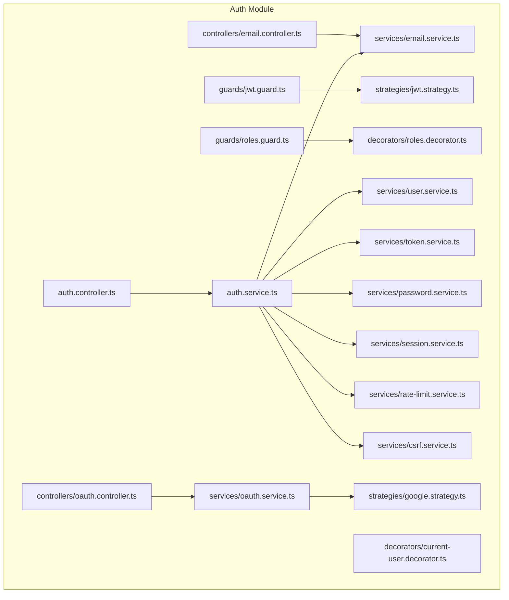

**Diagram sources**
- [auth.controller.ts](file://apps/backend/src/auth/auth.controller.ts)
- [controllers/oauth.controller.ts](file://apps/backend/src/auth/controllers/oauth.controller.ts)
- [controllers/email.controller.ts](file://apps/backend/src/auth/controllers/email.controller.ts)
- [guards/jwt.guard.ts](file://apps/backend/src/auth/guards/jwt.guard.ts)
- [guards/roles.guard.ts](file://apps/backend/src/auth/guards/roles.guard.ts)
- [decorators/current-user.decorator.ts](file://apps/backend/src/auth/decorators/current-user.decorator.ts)
- [decorators/roles.decorator.ts](file://apps/backend/src/auth/decorators/roles.decorator.ts)
- [strategies/jwt.strategy.ts](file://apps/backend/src/auth/strategies/jwt.strategy.ts)
- [strategies/google.strategy.ts](file://apps/backend/src/auth/strategies/google.strategy.ts)
- [auth.service.ts](file://apps/backend/src/auth/auth.service.ts)
- [services/user.service.ts](file://apps/backend/src/auth/services/user.service.ts)
- [services/token.service.ts](file://apps/backend/src/auth/services/token.service.ts)
- [services/password.service.ts](file://apps/backend/src/auth/services/password.service.ts)
- [services/email.service.ts](file://apps/backend/src/auth/services/email.service.ts)
- [services/oauth.service.ts](file://apps/backend/src/auth/services/oauth.service.ts)
- [services/session.service.ts](file://apps/backend/src/auth/services/session.service.ts)
- [services/rate-limit.service.ts](file://apps/backend/src/auth/services/rate-limit.service.ts)
- [services/csrf.service.ts](file://apps/backend/src/auth/services/csrf.service.ts)

**Section sources**
- [auth.module.ts](file://apps/backend/src/auth/auth.module.ts)
- [index.ts](file://apps/backend/src/auth/index.ts)

## Core Components
- Controllers:
  - Auth controller exposes login, register, password reset, and token refresh endpoints.
  - OAuth controller handles Google OAuth callbacks and token exchange.
  - Email controller manages verification link generation and confirmation.
- Guards:
  - JWT guard validates bearer tokens using Passport strategy.
  - Roles guard enforces RBAC by checking user roles against allowed values.
- Decorators:
  - Current user decorator extracts authenticated user from request context.
  - Roles decorator declares required roles for a route.
- Strategies:
  - JWT strategy validates and deserializes tokens to attach user to request.
  - Google strategy integrates with Google OAuth provider for sign-in/sign-up.
- Services:
  - User service manages user creation, lookup, and profile updates.
  - Token service issues and verifies JWTs and refresh tokens.
  - Password service hashes and compares passwords securely.
  - Email service sends verification and reset emails.
  - OAuth service orchestrates Google OAuth flow and user provisioning.
  - Session service manages server-side sessions if used alongside JWT.
  - Rate limit service throttles sensitive endpoints.
  - CSRF service generates and validates CSRF tokens for state-changing requests.
- Repositories:
  - Persist users, tokens, sessions, and audit logs.

Security highlights:
- Password hashing via bcrypt-compatible implementation.
- Rate limiting on login, registration, and password reset.
- CSRF protection for forms and token exchanges.
- Secure cookie configuration for refresh tokens when applicable.

**Section sources**
- [auth.controller.ts](file://apps/backend/src/auth/auth.controller.ts)
- [controllers/oauth.controller.ts](file://apps/backend/src/auth/controllers/oauth.controller.ts)
- [controllers/email.controller.ts](file://apps/backend/src/auth/controllers/email.controller.ts)
- [guards/jwt.guard.ts](file://apps/backend/src/auth/guards/jwt.guard.ts)
- [guards/roles.guard.ts](file://apps/backend/src/auth/guards/roles.guard.ts)
- [decorators/current-user.decorator.ts](file://apps/backend/src/auth/decorators/current-user.decorator.ts)
- [decorators/roles.decorator.ts](file://apps/backend/src/auth/decorators/roles.decorator.ts)
- [strategies/jwt.strategy.ts](file://apps/backend/src/auth/strategies/jwt.strategy.ts)
- [strategies/google.strategy.ts](file://apps/backend/src/auth/strategies/google.strategy.ts)
- [services/user.service.ts](file://apps/backend/src/auth/services/user.service.ts)
- [services/token.service.ts](file://apps/backend/src/auth/services/token.service.ts)
- [services/password.service.ts](file://apps/backend/src/auth/services/password.service.ts)
- [services/email.service.ts](file://apps/backend/src/auth/services/email.service.ts)
- [services/oauth.service.ts](file://apps/backend/src/auth/services/oauth.service.ts)
- [services/session.service.ts](file://apps/backend/src/auth/services/session.service.ts)
- [services/rate-limit.service.ts](file://apps/backend/src/auth/services/rate-limit.service.ts)
- [services/csrf.service.ts](file://apps/backend/src/auth/services/csrf.service.ts)
- [core/hash/bcrypt.service.ts](file://apps/backend/src/core/hash/bcrypt.service.ts)

## Architecture Overview
The authentication architecture follows a layered approach:
- Entry points are NestJS controllers that validate inputs via DTOs.
- Controllers delegate to services for business logic.
- Services interact with repositories for persistence and external providers (Google).
- Guards and strategies integrate with Passport for request-level security.
- Security utilities provide hashing, rate limiting, and CSRF protection.
- Audit events are emitted for key security actions.

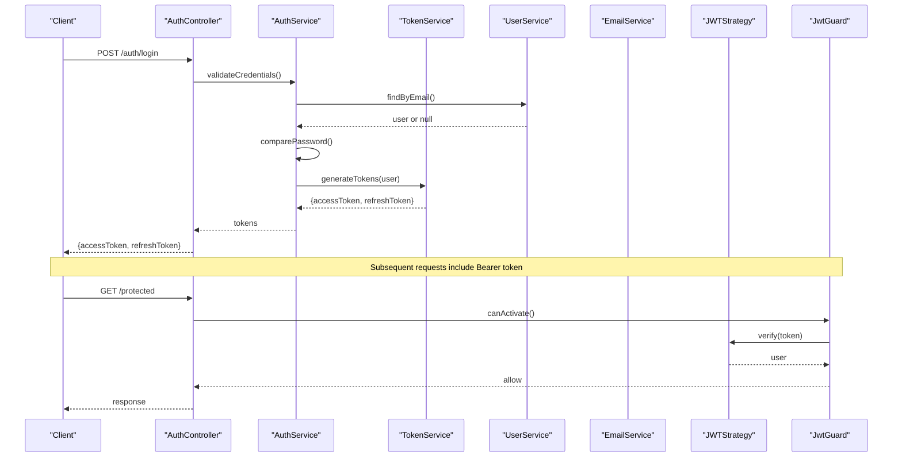

**Diagram sources**
- [auth.controller.ts](file://apps/backend/src/auth/auth.controller.ts)
- [auth.service.ts](file://apps/backend/src/auth/auth.service.ts)
- [services/token.service.ts](file://apps/backend/src/auth/services/token.service.ts)
- [services/user.service.ts](file://apps/backend/src/auth/services/user.service.ts)
- [services/email.service.ts](file://apps/backend/src/auth/services/email.service.ts)
- [strategies/jwt.strategy.ts](file://apps/backend/src/auth/strategies/jwt.strategy.ts)
- [guards/jwt.guard.ts](file://apps/backend/src/auth/guards/jwt.guard.ts)

## Detailed Component Analysis

### JWT Token Management
- Access tokens are short-lived and included in Authorization headers.
- Refresh tokens are long-lived and stored securely (cookie or server-side store).
- Token rotation can be supported by invalidating old refresh tokens upon use.
- Token payload includes minimal claims (e.g., user id, roles).

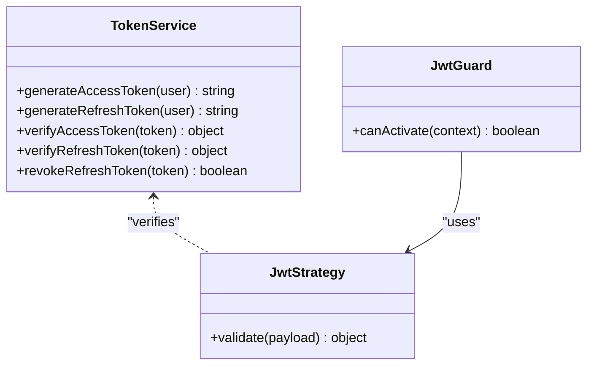

**Diagram sources**
- [services/token.service.ts](file://apps/backend/src/auth/services/token.service.ts)
- [strategies/jwt.strategy.ts](file://apps/backend/src/auth/strategies/jwt.strategy.ts)
- [guards/jwt.guard.ts](file://apps/backend/src/auth/guards/jwt.guard.ts)

**Section sources**
- [services/token.service.ts](file://apps/backend/src/auth/services/token.service.ts)
- [strategies/jwt.strategy.ts](file://apps/backend/src/auth/strategies/jwt.strategy.ts)
- [guards/jwt.guard.ts](file://apps/backend/src/auth/guards/jwt.guard.ts)

### Role-Based Access Control (RBAC)
- Roles are attached to user profiles and validated by the roles guard.
- Routes declare required roles via the roles decorator.
- The current user decorator provides access to the authenticated user’s roles.

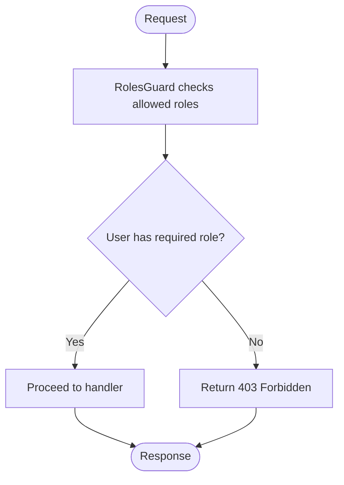

**Diagram sources**
- [guards/roles.guard.ts](file://apps/backend/src/auth/guards/roles.guard.ts)
- [decorators/roles.decorator.ts](file://apps/backend/src/auth/decorators/roles.decorator.ts)
- [decorators/current-user.decorator.ts](file://apps/backend/src/auth/decorators/current-user.decorator.ts)

**Section sources**
- [guards/roles.guard.ts](file://apps/backend/src/auth/guards/roles.guard.ts)
- [decorators/roles.decorator.ts](file://apps/backend/src/auth/decorators/roles.decorator.ts)
- [decorators/current-user.decorator.ts](file://apps/backend/src/auth/decorators/current-user.decorator.ts)

### OAuth Integration with Google
- Google OAuth flow redirects users to Google for consent.
- On callback, the Google strategy validates the ID token and exchanges it for an access token.
- The OAuth service provisions or links the user account and returns JWT tokens.

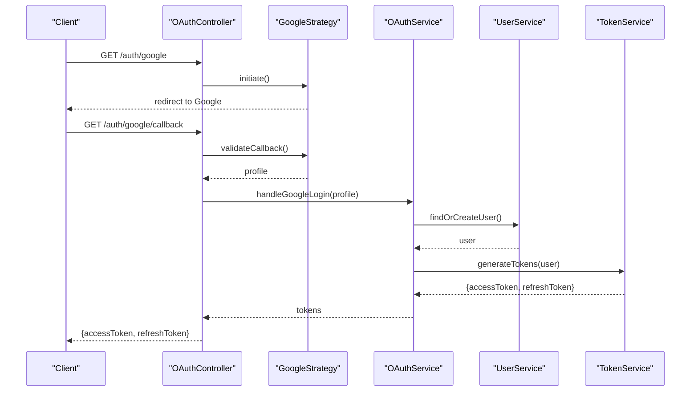

**Diagram sources**
- [controllers/oauth.controller.ts](file://apps/backend/src/auth/controllers/oauth.controller.ts)
- [strategies/google.strategy.ts](file://apps/backend/src/auth/strategies/google.strategy.ts)
- [services/oauth.service.ts](file://apps/backend/src/auth/services/oauth.service.ts)
- [services/user.service.ts](file://apps/backend/src/auth/services/user.service.ts)
- [services/token.service.ts](file://apps/backend/src/auth/services/token.service.ts)

**Section sources**
- [controllers/oauth.controller.ts](file://apps/backend/src/auth/controllers/oauth.controller.ts)
- [strategies/google.strategy.ts](file://apps/backend/src/auth/strategies/google.strategy.ts)
- [services/oauth.service.ts](file://apps/backend/src/auth/services/oauth.service.ts)

### Email Verification Workflow
- Registration triggers sending a verification email with a secure token.
- Users click the link; the email controller validates the token and marks the user verified.
- Protected routes may require verified status.

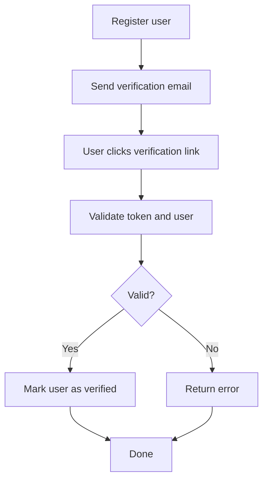

**Diagram sources**
- [controllers/email.controller.ts](file://apps/backend/src/auth/controllers/email.controller.ts)
- [services/email.service.ts](file://apps/backend/src/auth/services/email.service.ts)
- [services/user.service.ts](file://apps/backend/src/auth/services/user.service.ts)

**Section sources**
- [controllers/email.controller.ts](file://apps/backend/src/auth/controllers/email.controller.ts)
- [services/email.service.ts](file://apps/backend/src/auth/services/email.service.ts)
- [services/user.service.ts](file://apps/backend/src/auth/services/user.service.ts)

### Session Handling
- Sessions can be used alongside JWT for additional state management.
- Session service manages creation, storage, and cleanup.
- Sensitive operations may require active session validation.

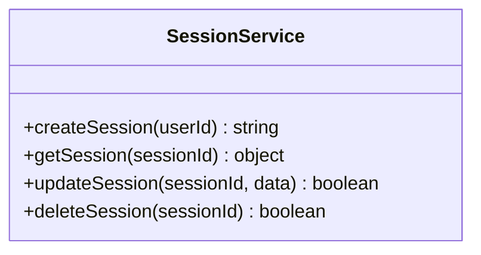

**Diagram sources**
- [services/session.service.ts](file://apps/backend/src/auth/services/session.service.ts)

**Section sources**
- [services/session.service.ts](file://apps/backend/src/auth/services/session.service.ts)

### Security Measures
- Password Hashing:
  - Use bcrypt-compatible hashing for storing passwords.
- Rate Limiting:
  - Apply per-IP and per-user limits on login, registration, and password reset.
- CSRF Protection:
  - Generate and validate CSRF tokens for state-changing endpoints.
- Secure Cookies:
  - Set HttpOnly, Secure, SameSite flags for refresh tokens.

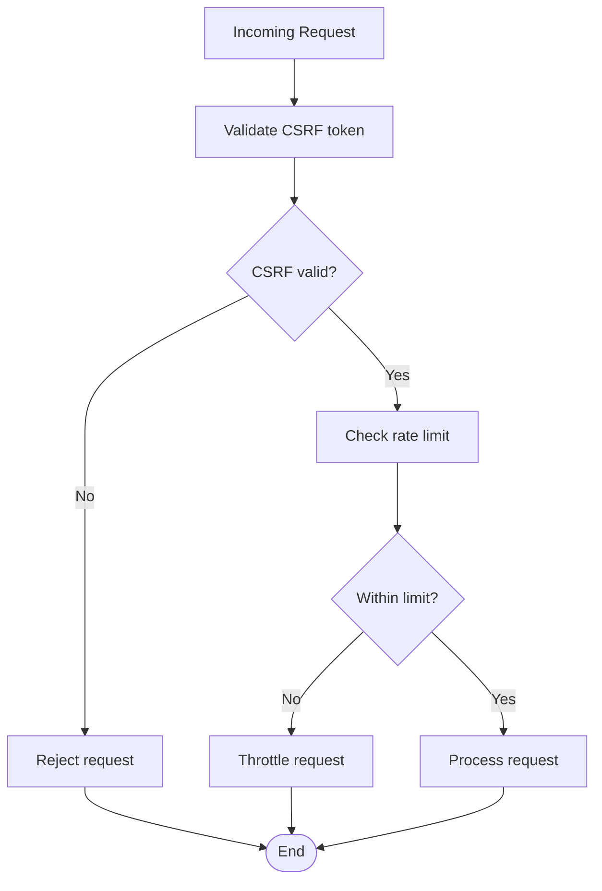

**Diagram sources**
- [services/csrf.service.ts](file://apps/backend/src/auth/services/csrf.service.ts)
- [services/rate-limit.service.ts](file://apps/backend/src/auth/services/rate-limit.service.ts)
- [core/hash/bcrypt.service.ts](file://apps/backend/src/core/hash/bcrypt.service.ts)

**Section sources**
- [services/csrf.service.ts](file://apps/backend/src/auth/services/csrf.service.ts)
- [services/rate-limit.service.ts](file://apps/backend/src/auth/services/rate-limit.service.ts)
- [core/hash/bcrypt.service.ts](file://apps/backend/src/core/hash/bcrypt.service.ts)

### Authentication Endpoints
- Login:
  - Validates credentials, returns access and refresh tokens.
- Registration:
  - Creates user, sends verification email, returns tokens after verification or pending state.
- Password Reset:
  - Generates reset token, sends email, allows setting new password.
- Token Refresh:
  - Accepts refresh token, issues new access token, rotates refresh token if configured.

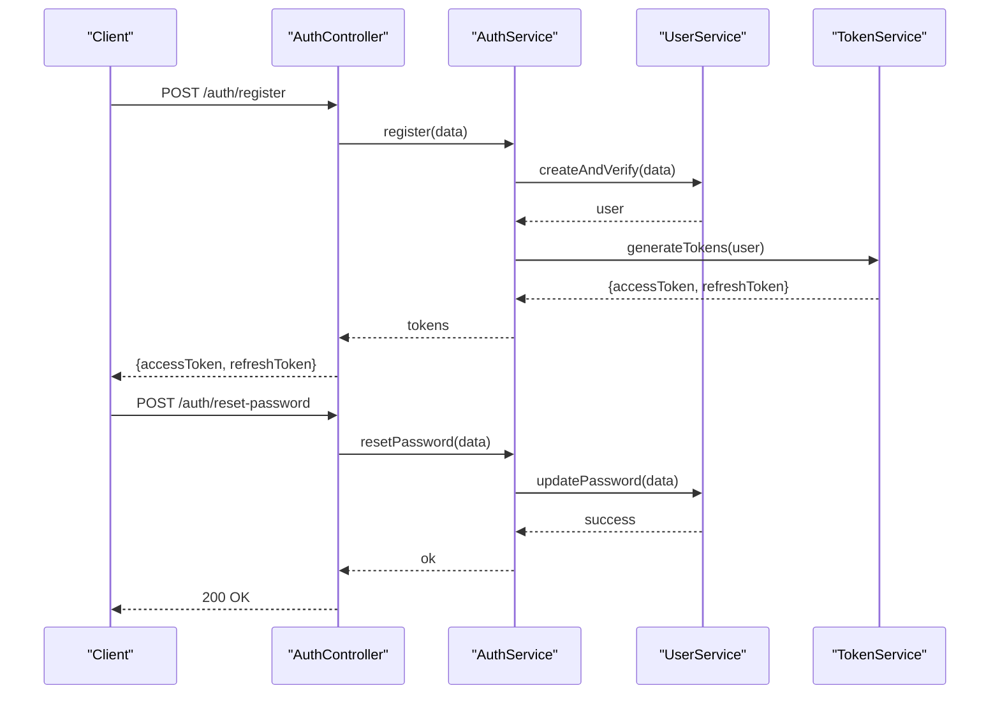

**Diagram sources**
- [auth.controller.ts](file://apps/backend/src/auth/auth.controller.ts)
- [auth.service.ts](file://apps/backend/src/auth/auth.service.ts)
- [services/user.service.ts](file://apps/backend/src/auth/services/user.service.ts)
- [services/token.service.ts](file://apps/backend/src/auth/services/token.service.ts)

**Section sources**
- [auth.controller.ts](file://apps/backend/src/auth/auth.controller.ts)
- [auth.service.ts](file://apps/backend/src/auth/auth.service.ts)

### Protected Routes and Guard Usage
- Apply JwtGuard to routes requiring authentication.
- Apply RolesGuard with Roles decorator to restrict by role.
- Use CurrentUser decorator to access user context in handlers.

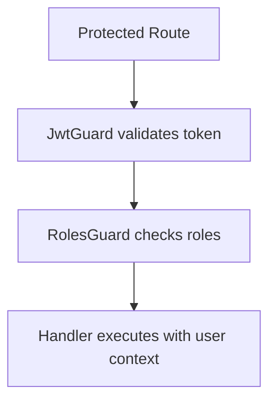

**Diagram sources**
- [guards/jwt.guard.ts](file://apps/backend/src/auth/guards/jwt.guard.ts)
- [guards/roles.guard.ts](file://apps/backend/src/auth/guards/roles.guard.ts)
- [decorators/current-user.decorator.ts](file://apps/backend/src/auth/decorators/current-user.decorator.ts)
- [decorators/roles.decorator.ts](file://apps/backend/src/auth/decorators/roles.decorator.ts)

**Section sources**
- [guards/jwt.guard.ts](file://apps/backend/src/auth/guards/jwt.guard.ts)
- [guards/roles.guard.ts](file://apps/backend/src/auth/guards/roles.guard.ts)
- [decorators/current-user.decorator.ts](file://apps/backend/src/auth/decorators/current-user.decorator.ts)
- [decorators/roles.decorator.ts](file://apps/backend/src/auth/decorators/roles.decorator.ts)

### User Roles and Permissions System
- Roles are defined per user and enforced by guards.
- Permissions can be derived from roles or managed separately.
- Audit logging records role changes and permission grants.

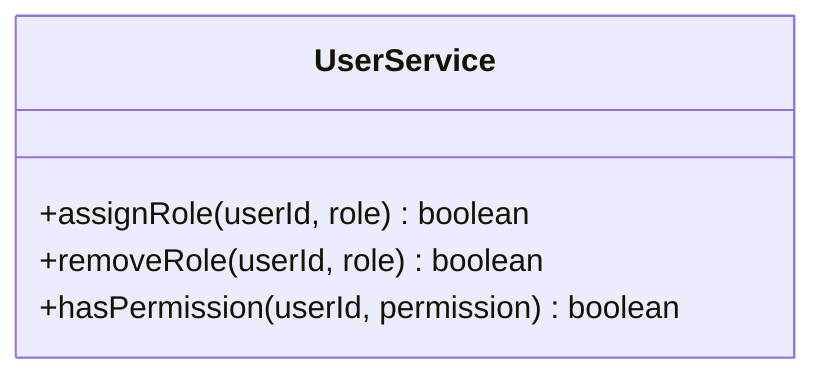

**Diagram sources**
- [services/user.service.ts](file://apps/backend/src/auth/services/user.service.ts)

**Section sources**
- [services/user.service.ts](file://apps/backend/src/auth/services/user.service.ts)

### Audit Logging for Security Events
- Emit events for login attempts, failures, password resets, and role changes.
- Centralized event emitter aggregates and persists audit logs.

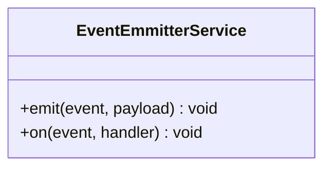

**Diagram sources**
- [core/events/event-emitter.service.ts](file://apps/backend/src/core/events/event-emitter.service.ts)

**Section sources**
- [core/events/event-emitter.service.ts](file://apps/backend/src/core/events/event-emitter.service.ts)

## Dependency Analysis
The auth module depends on core services and configuration:
- Configuration defines JWT secrets, OAuth settings, and rate limits.
- App module registers global guards, interceptors, and modules.
- Main entry configures CORS, helmet, and body parsing.

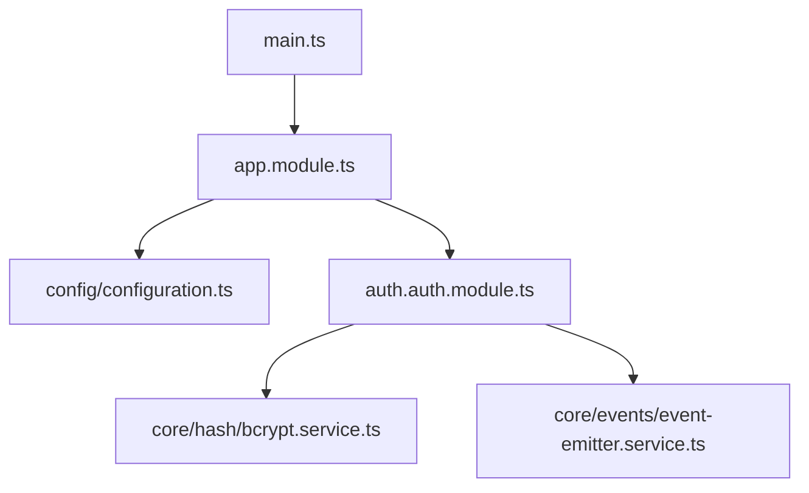

**Diagram sources**
- [app.module.ts](file://apps/backend/src/app.module.ts)
- [config/configuration.ts](file://apps/backend/src/config/configuration.ts)
- [auth.module.ts](file://apps/backend/src/auth/auth.module.ts)
- [main.ts](file://apps/backend/src/main.ts)
- [core/hash/bcrypt.service.ts](file://apps/backend/src/core/hash/bcrypt.service.ts)
- [core/events/event-emitter.service.ts](file://apps/backend/src/core/events/event-emitter.service.ts)

**Section sources**
- [app.module.ts](file://apps/backend/src/app.module.ts)
- [config/configuration.ts](file://apps/backend/src/config/configuration.ts)
- [auth.module.ts](file://apps/backend/src/auth/auth.module.ts)
- [main.ts](file://apps/backend/src/main.ts)

## Performance Considerations
- Keep JWT payloads small to reduce overhead.
- Cache frequent user lookups where appropriate.
- Use connection pooling for database interactions.
- Implement token blacklisting carefully to avoid memory growth.
- Monitor rate limiter counters and adjust thresholds based on traffic.

[No sources needed since this section provides general guidance]

## Troubleshooting Guide
Common issues and resolutions:
- Invalid token errors:
  - Verify secret configuration and token expiration settings.
- OAuth callback failures:
  - Ensure client IDs and secrets match provider configuration.
- Email delivery problems:
  - Check SMTP settings and queue processors.
- Rate limiting blocks legitimate users:
  - Adjust limits and whitelist trusted IPs if necessary.
- CSRF validation errors:
  - Confirm token generation and inclusion in requests.

**Section sources**
- [services/token.service.ts](file://apps/backend/src/auth/services/token.service.ts)
- [strategies/google.strategy.ts](file://apps/backend/src/auth/strategies/google.strategy.ts)
- [services/email.service.ts](file://apps/backend/src/auth/services/email.service.ts)
- [services/rate-limit.service.ts](file://apps/backend/src/auth/services/rate-limit.service.ts)
- [services/csrf.service.ts](file://apps/backend/src/auth/services/csrf.service.ts)

## Conclusion
The authentication and authorization system provides robust JWT-based security with role enforcement, OAuth integration, email verification, and comprehensive security hardening. By following the documented patterns for guards, decorators, and services, developers can implement secure, scalable, and maintainable authentication flows.

[No sources needed since this section summarizes without analyzing specific files]

## Appendices
- Example protected route usage:
  - Apply JwtGuard and RolesGuard to restrict access.
  - Use CurrentUser decorator to read user details.
- Custom decorators:
  - Roles decorator declares required roles.
  - Current user decorator injects authenticated user.
- Audit logging:
  - Emit events for security-sensitive actions.

[No sources needed since this section provides general guidance]