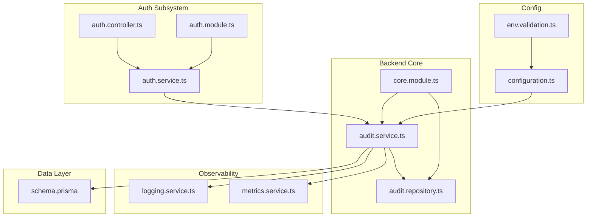
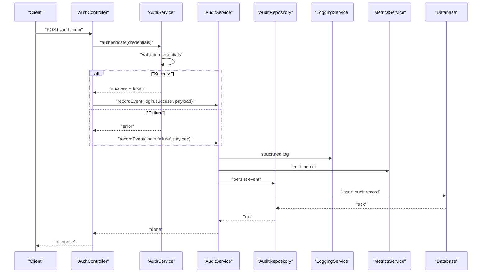
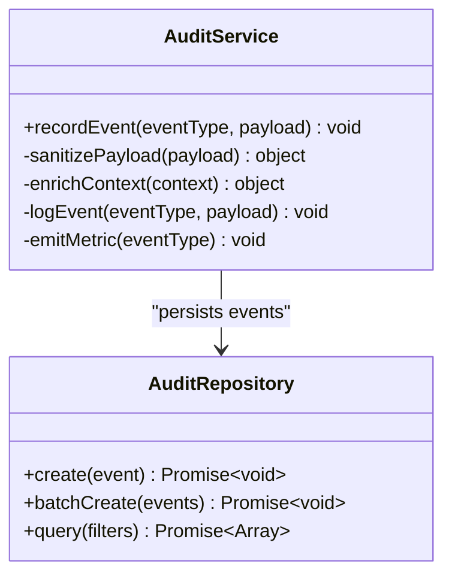
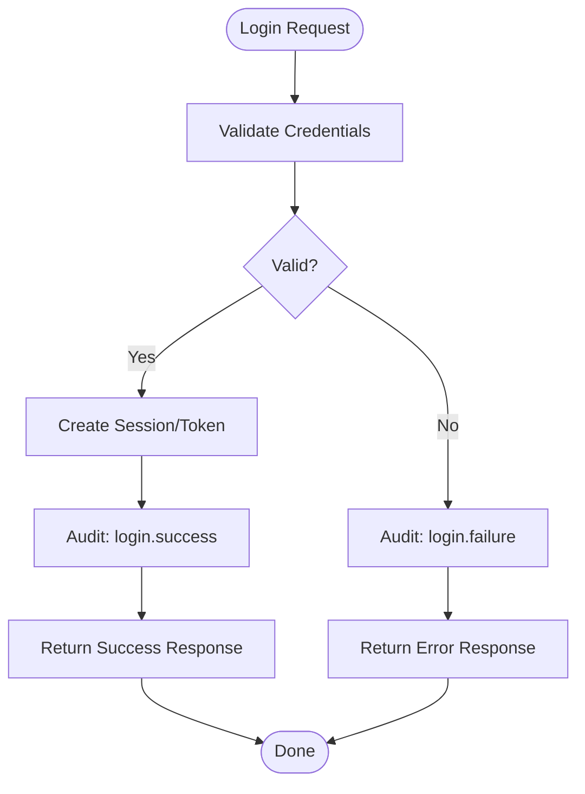
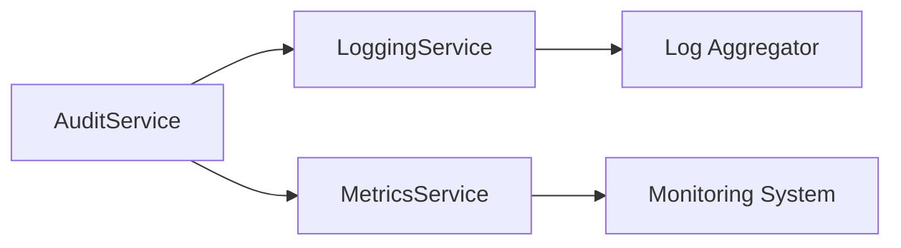
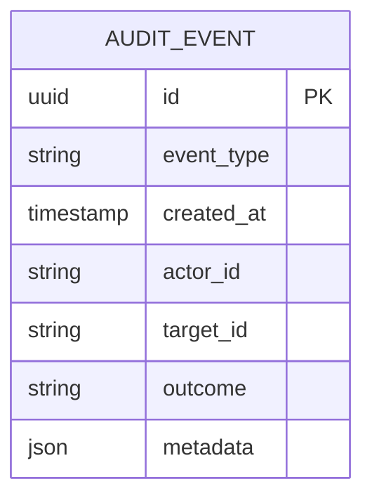
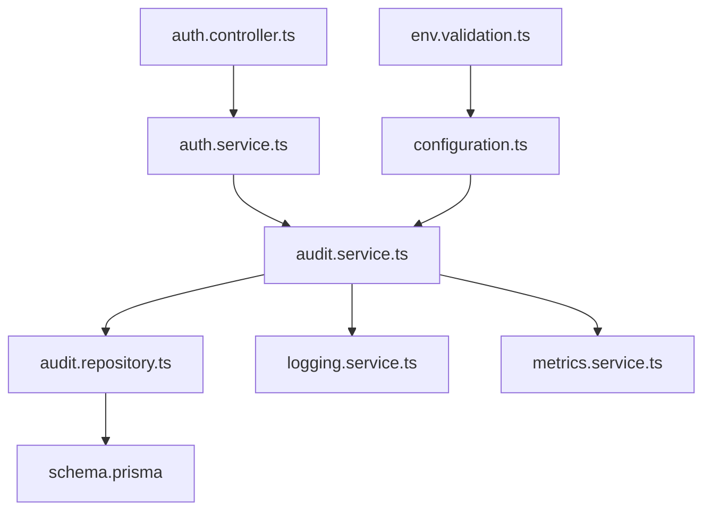

# Authentication Audit Logging

<cite>
**Referenced Files in This Document**
- [core.module.ts](file://apps/backend/src/core/core.module.ts)
- [audit.service.ts](file://apps/backend/src/core/audit/audit.service.ts)
- [audit.repository.ts](file://apps/backend/src/core/audit/audit.repository.ts)
- [auth.controller.ts](file://apps/backend/src/auth/auth.controller.ts)
- [auth.service.ts](file://apps/backend/src/auth/auth.service.ts)
- [auth.module.ts](file://apps/backend/src/auth/auth.module.ts)
- [logging.service.ts](file://apps/backend/src/observability/logging.service.ts)
- [metrics.service.ts](file://apps/backend/src/observability/metrics.service.ts)
- [configuration.ts](file://apps/backend/src/config/configuration.ts)
- [env.validation.ts](file://apps/backend/src/config/env.validation.ts)
- [schema.prisma](file://apps/backend/prisma/schema.prisma)
</cite>

## Table of Contents
1. [Introduction](#introduction)
2. [Project Structure](#project-structure)
3. [Core Components](#core-components)
4. [Architecture Overview](#architecture-overview)
5. [Detailed Component Analysis](#detailed-component-analysis)
6. [Dependency Analysis](#dependency-analysis)
7. [Performance Considerations](#performance-considerations)
8. [Troubleshooting Guide](#troubleshooting-guide)
9. [Conclusion](#conclusion)
10. [Appendices](#appendices)

## Introduction
This document provides comprehensive documentation for the authentication audit logging system. It explains how the system records and tracks security-related events such as login/logout, failed authentication attempts, privilege escalation, and administrative actions. It also covers log event types, query patterns for audit data, dashboarding and compliance reporting considerations, retention policies, privacy safeguards, and integration with external logging systems.

## Project Structure
The audit logging functionality is implemented within the backend application under the core module’s audit subsystem. The authentication subsystem emits or triggers audit events during key security operations. Observability services provide additional logging and metrics that can be correlated with audit logs. Configuration and environment validation ensure secure defaults and operational settings. Database schema defines storage structures used by audit and related features.

**Diagram sources**
- [core.module.ts](file://apps/backend/src/core/core.module.ts)
- [audit.service.ts](file://apps/backend/src/core/audit/audit.service.ts)
- [audit.repository.ts](file://apps/backend/src/core/audit/audit.repository.ts)
- [auth.controller.ts](file://apps/backend/src/auth/auth.controller.ts)
- [auth.service.ts](file://apps/backend/src/auth/auth.service.ts)
- [auth.module.ts](file://apps/backend/src/auth/auth.module.ts)
- [logging.service.ts](file://apps/backend/src/observability/logging.service.ts)
- [metrics.service.ts](file://apps/backend/src/observability/metrics.service.ts)
- [configuration.ts](file://apps/backend/src/config/configuration.ts)
- [env.validation.ts](file://apps/backend/src/config/env.validation.ts)
- [schema.prisma](file://apps/backend/prisma/schema.prisma)

**Section sources**
- [core.module.ts](file://apps/backend/src/core/core.module.ts)
- [auth.module.ts](file://apps/backend/src/auth/auth.module.ts)
- [configuration.ts](file://apps/backend/src/config/configuration.ts)
- [env.validation.ts](file://apps/backend/src/config/env.validation.ts)
- [schema.prisma](file://apps/backend/prisma/schema.prisma)

## Core Components
- Audit Service: Centralizes creation and persistence of audit events. It encapsulates event typing, payload construction, correlation context, and integration with observability (logging and metrics).
- Audit Repository: Handles low-level persistence of audit events to the database layer.
- Auth Controller and Service: Orchestrate authentication flows and trigger audit events for login success/failure, logout, and sensitive administrative actions.
- Observability Services: Provide structured logging and metrics emission to support monitoring and alerting alongside audit logs.
- Configuration and Environment Validation: Ensure secure defaults and feature toggles for audit logging behavior.
- Prisma Schema: Defines data models relevant to audit and related entities.

Key responsibilities:
- Standardize event types and payloads for consistent auditing.
- Enforce privacy by excluding sensitive fields from audit payloads.
- Correlate audit events with request context (e.g., user ID, session, IP).
- Emit metrics for high-frequency events without impacting performance.
- Persist audit records reliably and efficiently.

**Section sources**
- [audit.service.ts](file://apps/backend/src/core/audit/audit.service.ts)
- [audit.repository.ts](file://apps/backend/src/core/audit/audit.repository.ts)
- [auth.controller.ts](file://apps/backend/src/auth/auth.controller.ts)
- [auth.service.ts](file://apps/backend/src/auth/auth.service.ts)
- [logging.service.ts](file://apps/backend/src/observability/logging.service.ts)
- [metrics.service.ts](file://apps/backend/src/observability/metrics.service.ts)
- [configuration.ts](file://apps/backend/src/config/configuration.ts)
- [env.validation.ts](file://apps/backend/src/config/env.validation.ts)
- [schema.prisma](file://apps/backend/prisma/schema.prisma)

## Architecture Overview
The audit architecture follows a layered approach:
- Controllers invoke service methods for authentication operations.
- Services orchestrate business logic and emit audit events.
- Audit service standardizes event creation and delegates persistence to the repository.
- Observability services record structured logs and metrics for real-time monitoring.
- Database layer persists audit records according to schema definitions.

**Diagram sources**
- [auth.controller.ts](file://apps/backend/src/auth/auth.controller.ts)
- [auth.service.ts](file://apps/backend/src/auth/auth.service.ts)
- [audit.service.ts](file://apps/backend/src/core/audit/audit.service.ts)
- [audit.repository.ts](file://apps/backend/src/core/audit/audit.repository.ts)
- [logging.service.ts](file://apps/backend/src/observability/logging.service.ts)
- [metrics.service.ts](file://apps/backend/src/observability/metrics.service.ts)
- [schema.prisma](file://apps/backend/prisma/schema.prisma)

## Detailed Component Analysis

### Audit Service
Responsibilities:
- Define and normalize audit event types (e.g., login.success, login.failure, logout, privilege.escalation, admin.action).
- Construct secure payloads, stripping sensitive information and including correlation metadata.
- Integrate with logging and metrics for observability.
- Delegate persistence to the audit repository.

Implementation highlights:
- Event type enumeration ensures consistency across modules.
- Payload sanitization prevents accidental leakage of secrets.
- Context enrichment adds user identifiers, session IDs, and request metadata.
- Asynchronous persistence avoids blocking critical paths.

**Diagram sources**
- [audit.service.ts](file://apps/backend/src/core/audit/audit.service.ts)
- [audit.repository.ts](file://apps/backend/src/core/audit/audit.repository.ts)

**Section sources**
- [audit.service.ts](file://apps/backend/src/core/audit/audit.service.ts)
- [audit.repository.ts](file://apps/backend/src/core/audit/audit.repository.ts)

### Authentication Flow and Audit Events
Responsibilities:
- Handle login requests, validate credentials, and issue tokens.
- Trigger audit events for successful and failed login attempts.
- Record logout events when sessions terminate.
- Capture privilege escalation and administrative actions where applicable.

Flow overview:
- Login success: create session/token, record login.success.
- Login failure: log error details, record login.failure with reason codes.
- Logout: record logout with session context.
- Admin actions: record admin.action with actor, target, and outcome.

**Diagram sources**
- [auth.controller.ts](file://apps/backend/src/auth/auth.controller.ts)
- [auth.service.ts](file://apps/backend/src/auth/auth.service.ts)
- [audit.service.ts](file://apps/backend/src/core/audit/audit.service.ts)

**Section sources**
- [auth.controller.ts](file://apps/backend/src/auth/auth.controller.ts)
- [auth.service.ts](file://apps/backend/src/auth/auth.service.ts)
- [audit.service.ts](file://apps/backend/src/core/audit/audit.service.ts)

### Observability Integration
Responsibilities:
- Structured logging for audit events to support searchability and analysis.
- Metrics emission for high-volume events to enable dashboards and alerts.
- Correlation IDs to link audit logs with request traces.

Integration points:
- Audit service calls logging service to write structured logs.
- Audit service emits metrics counters/gauges for event counts and failure rates.
- Configuration controls verbosity and sampling strategies.

**Diagram sources**
- [audit.service.ts](file://apps/backend/src/core/audit/audit.service.ts)
- [logging.service.ts](file://apps/backend/src/observability/logging.service.ts)
- [metrics.service.ts](file://apps/backend/src/observability/metrics.service.ts)

**Section sources**
- [logging.service.ts](file://apps/backend/src/observability/logging.service.ts)
- [metrics.service.ts](file://apps/backend/src/observability/metrics.service.ts)
- [audit.service.ts](file://apps/backend/src/core/audit/audit.service.ts)

### Data Model and Persistence
Responsibilities:
- Define audit event schema with fields for event type, timestamp, actor, target, outcome, and metadata.
- Support efficient querying by time range, event type, and actor.
- Ensure indexes on frequently filtered columns.

Schema considerations:
- Event type enum for standardized categorization.
- Actor and target identifiers for traceability.
- Outcome and reason codes for failure analysis.
- Metadata JSON field for extensibility while maintaining queryability via indexed attributes.

**Diagram sources**
- [schema.prisma](file://apps/backend/prisma/schema.prisma)

**Section sources**
- [schema.prisma](file://apps/backend/prisma/schema.prisma)
- [audit.repository.ts](file://apps/backend/src/core/audit/audit.repository.ts)

### Configuration and Security Defaults
Responsibilities:
- Enable/disable audit logging per environment.
- Configure retention policies and sampling rates.
- Enforce privacy rules to exclude sensitive fields.

Configuration keys:
- Audit enabled flag.
- Log level and sampling strategy.
- Retention duration and archival settings.
- External logging endpoint configuration.

Validation:
- Environment variables validated at startup to prevent misconfiguration.
- Secure defaults applied when values are missing.

**Section sources**
- [configuration.ts](file://apps/backend/src/config/configuration.ts)
- [env.validation.ts](file://apps/backend/src/config/env.validation.ts)

## Dependency Analysis
The audit subsystem depends on:
- Auth services for triggering events.
- Observability services for logging and metrics.
- Database layer for persistence.
- Configuration for runtime behavior.

**Diagram sources**
- [auth.controller.ts](file://apps/backend/src/auth/auth.controller.ts)
- [auth.service.ts](file://apps/backend/src/auth/auth.service.ts)
- [audit.service.ts](file://apps/backend/src/core/audit/audit.service.ts)
- [audit.repository.ts](file://apps/backend/src/core/audit/audit.repository.ts)
- [logging.service.ts](file://apps/backend/src/observability/logging.service.ts)
- [metrics.service.ts](file://apps/backend/src/observability/metrics.service.ts)
- [schema.prisma](file://apps/backend/prisma/schema.prisma)
- [configuration.ts](file://apps/backend/src/config/configuration.ts)
- [env.validation.ts](file://apps/backend/src/config/env.validation.ts)

**Section sources**
- [auth.controller.ts](file://apps/backend/src/auth/auth.controller.ts)
- [auth.service.ts](file://apps/backend/src/auth/auth.service.ts)
- [audit.service.ts](file://apps/backend/src/core/audit/audit.service.ts)
- [audit.repository.ts](file://apps/backend/src/core/audit/audit.repository.ts)
- [logging.service.ts](file://apps/backend/src/observability/logging.service.ts)
- [metrics.service.ts](file://apps/backend/src/observability/metrics.service.ts)
- [schema.prisma](file://apps/backend/prisma/schema.prisma)
- [configuration.ts](file://apps/backend/src/config/configuration.ts)
- [env.validation.ts](file://apps/backend/src/config/env.validation.ts)

## Performance Considerations
- Asynchronous persistence: Use background jobs or queues to avoid blocking authentication flows.
- Sampling: Apply sampling for high-frequency events to reduce storage and I/O overhead.
- Indexing: Ensure indexes on event_type, created_at, actor_id, and outcome for fast queries.
- Batching: Batch writes to minimize database round-trips.
- Metrics decoupling: Emit lightweight metrics instead of heavy logging for hot paths.

[No sources needed since this section provides general guidance]

## Troubleshooting Guide
Common issues and resolutions:
- Missing audit events: Verify audit service initialization and module registration.
- Incomplete payloads: Check sanitization and context enrichment logic.
- High latency: Inspect persistence path; consider batching and async processing.
- Privacy violations: Review payload construction to ensure sensitive fields are excluded.
- Misconfiguration: Validate environment variables and configuration defaults.

Diagnostic steps:
- Inspect structured logs for event emission and errors.
- Query audit records for gaps or anomalies.
- Monitor metrics for spikes in failure rates.
- Correlate request IDs with audit entries.

**Section sources**
- [audit.service.ts](file://apps/backend/src/core/audit/audit.service.ts)
- [logging.service.ts](file://apps/backend/src/observability/logging.service.ts)
- [metrics.service.ts](file://apps/backend/src/observability/metrics.service.ts)
- [configuration.ts](file://apps/backend/src/config/configuration.ts)
- [env.validation.ts](file://apps/backend/src/config/env.validation.ts)

## Conclusion
The authentication audit logging system provides robust tracking of security-critical events through a well-structured service layer, standardized event types, and strong integration with observability tools. By enforcing privacy, enabling efficient queries, and supporting external integrations, it facilitates security monitoring, incident response, and compliance reporting. Proper configuration, retention policies, and performance optimizations ensure reliability and scalability.

[No sources needed since this section summarizes without analyzing specific files]

## Appendices

### Audit Event Types
- login.success: Successful authentication with actor, target, and session context.
- login.failure: Failed authentication attempt with reason code and source details.
- logout: Session termination with actor and session identifiers.
- privilege.escalation: Role or permission changes with actor, target, and outcome.
- admin.action: Administrative operations with actor, target, action type, and result.

[No sources needed since this section lists conceptual event types]

### Example Audit Log Queries
- Recent failed logins: Filter by event_type = "login.failure", sort by created_at descending.
- Privilege escalations: Filter by event_type = "privilege.escalation", include actor and target.
- Admin actions timeline: Filter by event_type = "admin.action", group by hour for trends.
- User activity summary: Group by actor_id and event_type to count activities over time.

[No sources needed since this section provides conceptual query examples]

### Security Monitoring Dashboards
- Real-time login success/failure rate chart.
- Alert thresholds for spike in failed logins.
- Privilege escalation frequency by actor and target.
- Admin action volume and outcomes over time.

[No sources needed since this section describes conceptual dashboards]

### Compliance Reporting
- Generate periodic reports of authentication events and administrative actions.
- Export audit trails for audits and investigations.
- Ensure retention policies align with regulatory requirements.
- Anonymize or redact sensitive data in exported reports.

[No sources needed since this section outlines conceptual reporting practices]

### Log Retention Policies
- Define retention periods based on compliance needs.
- Archive older records to cost-effective storage.
- Implement automated purging and archival workflows.
- Maintain integrity and immutability of audit records.

[No sources needed since this section provides general guidance]

### Privacy Considerations
- Exclude passwords, tokens, and personal identifiers from audit payloads.
- Hash or pseudonymize sensitive identifiers where necessary.
- Apply least-privilege access to audit data stores.
- Document data handling and retention practices.

[No sources needed since this section provides general guidance]

### Integration with External Logging Systems
- Configure endpoints for centralized log aggregation.
- Use structured formats compatible with SIEM platforms.
- Implement retry and backoff for reliable delivery.
- Monitor delivery health and alert on failures.

[No sources needed since this section provides general guidance]