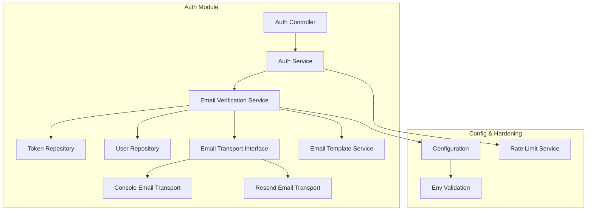
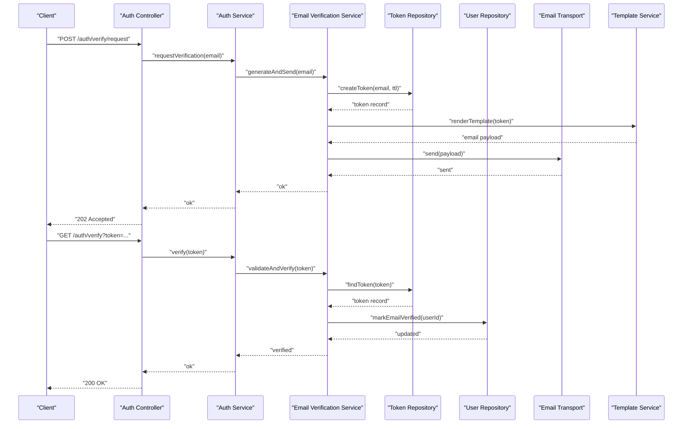
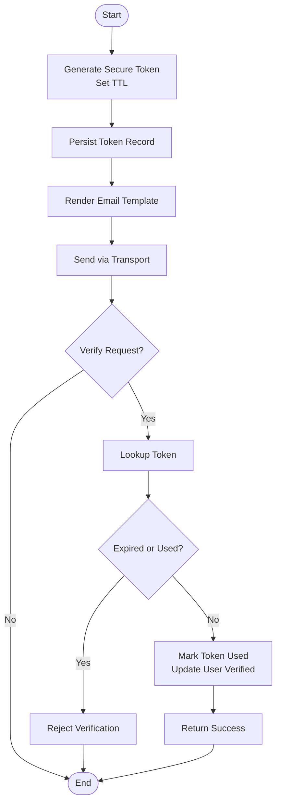
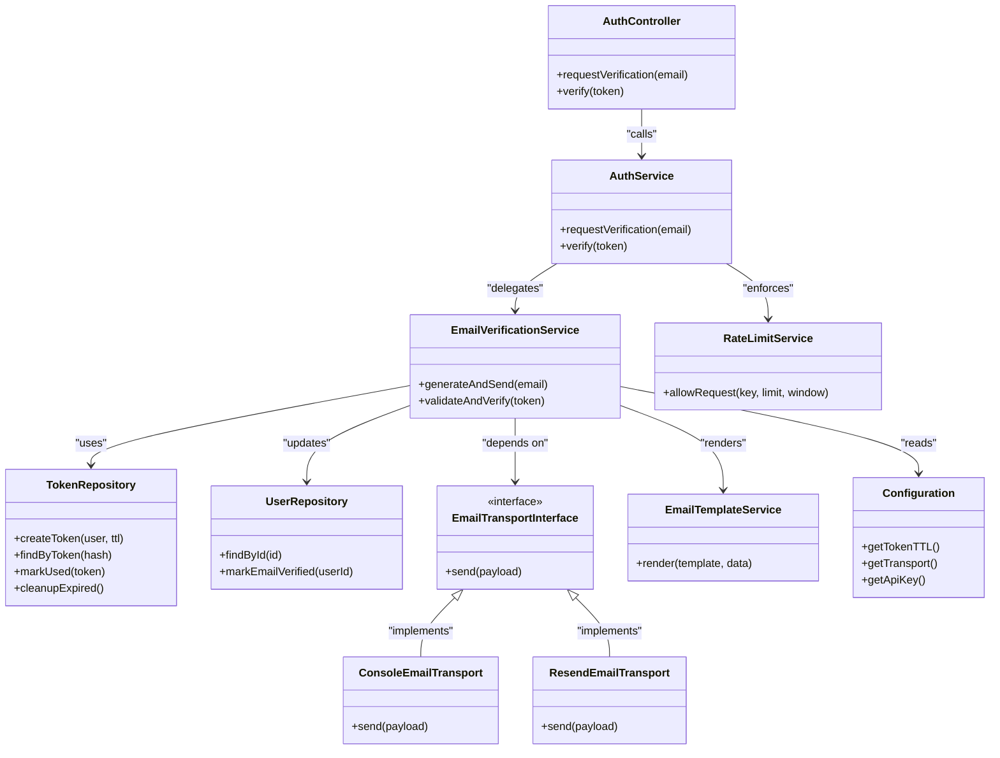

# Email Verification System

<cite>
**Referenced Files in This Document**
- [auth.module.ts](file://apps/backend/src/auth/auth.module.ts)
- [auth.controller.ts](file://apps/backend/src/auth/auth.controller.ts)
- [auth.service.ts](file://apps/backend/src/auth/auth.service.ts)
- [email-verification.service.ts](file://apps/backend/src/auth/services/email-verification.service.ts)
- [token.repository.ts](file://apps/backend/src/auth/repositories/token.repository.ts)
- [user.repository.ts](file://apps/backend/src/auth/repositories/user.repository.ts)
- [email-transport.interface.ts](file://apps/backend/src/auth/services/email-transport.interface.ts)
- [console-email-transport.ts](file://apps/backend/src/auth/services/console-email-transport.ts)
- [resend-email-transport.ts](file://apps/backend/src/auth/services/resend-email-transport.ts)
- [email-template.service.ts](file://apps/backend/src/auth/services/email-template.service.ts)
- [rate-limit.service.ts](file://apps/backend/src/hardening/rate-limit.service.ts)
- [configuration.ts](file://apps/backend/src/config/configuration.ts)
- [env.validation.ts](file://apps/backend/src/config/env.validation.ts)
</cite>

## Table of Contents
1. [Introduction](#introduction)
2. [Project Structure](#project-structure)
3. [Core Components](#core-components)
4. [Architecture Overview](#architecture-overview)
5. [Detailed Component Analysis](#detailed-component-analysis)
6. [Dependency Analysis](#dependency-analysis)
7. [Performance Considerations](#performance-considerations)
8. [Troubleshooting Guide](#troubleshooting-guide)
9. [Conclusion](#conclusion)

## Introduction
This document explains the email verification system implemented in the backend application. It covers how verification tokens are generated, stored, and validated; how emails are sent via pluggable transports (console logging and Resend); how verification endpoints handle requests; and how security measures such as token expiration, rate limiting, and abuse prevention are enforced. It also documents DTO structures, template customization, and state management for verification flows.

## Project Structure
The email verification feature is part of the authentication module and spans services, repositories, controllers, configuration, and hardening utilities:
- Services orchestrate verification workflows, token lifecycle, and email delivery.
- Repositories abstract persistence for users and verification tokens.
- Controllers expose HTTP endpoints for requesting and verifying emails.
- Configuration defines environment-driven settings for transport selection and token behavior.
- Hardening provides rate limiting and abuse prevention mechanisms.

**Diagram sources**
- [auth.controller.ts](file://apps/backend/src/auth/auth.controller.ts)
- [auth.service.ts](file://apps/backend/src/auth/auth.service.ts)
- [email-verification.service.ts](file://apps/backend/src/auth/services/email-verification.service.ts)
- [token.repository.ts](file://apps/backend/src/auth/repositories/token.repository.ts)
- [user.repository.ts](file://apps/backend/src/auth/repositories/user.repository.ts)
- [email-transport.interface.ts](file://apps/backend/src/auth/services/email-transport.interface.ts)
- [console-email-transport.ts](file://apps/backend/src/auth/services/console-email-transport.ts)
- [resend-email-transport.ts](file://apps/backend/src/auth/services/resend-email-transport.ts)
- [email-template.service.ts](file://apps/backend/src/auth/services/email-template.service.ts)
- [rate-limit.service.ts](file://apps/backend/src/hardening/rate-limit.service.ts)
- [configuration.ts](file://apps/backend/src/config/configuration.ts)
- [env.validation.ts](file://apps/backend/src/config/env.validation.ts)

**Section sources**
- [auth.module.ts](file://apps/backend/src/auth/auth.module.ts)
- [auth.controller.ts](file://apps/backend/src/auth/auth.controller.ts)
- [auth.service.ts](file://apps/backend/src/auth/auth.service.ts)
- [email-verification.service.ts](file://apps/backend/src/auth/services/email-verification.service.ts)
- [token.repository.ts](file://apps/backend/src/auth/repositories/token.repository.ts)
- [user.repository.ts](file://apps/backend/src/auth/repositories/user.repository.ts)
- [email-transport.interface.ts](file://apps/backend/src/auth/services/email-transport.interface.ts)
- [console-email-transport.ts](file://apps/backend/src/auth/services/console-email-transport.ts)
- [resend-email-transport.ts](file://apps/backend/src/auth/services/resend-email-transport.ts)
- [email-template.service.ts](file://apps/backend/src/auth/services/email-template.service.ts)
- [rate-limit.service.ts](file://apps/backend/src/hardening/rate-limit.service.ts)
- [configuration.ts](file://apps/backend/src/config/configuration.ts)
- [env.validation.ts](file://apps/backend/src/config/env.validation.ts)

## Core Components
- Email Verification Service: Orchestrates token generation, storage, email sending, and verification logic. Enforces token expiration and updates user verification state.
- Token Repository: Persists verification tokens with metadata such as expiry and usage status. Supports creation, lookup by token or user, and cleanup of expired entries.
- User Repository: Provides user retrieval and updates to mark an email as verified upon successful verification.
- Email Transport Interface: Defines a contract for sending verification emails. Implemented by console and Resend transports.
- Console Email Transport: Logs email content to the console for development.
- Resend Email Transport: Sends real emails using the Resend service.
- Email Template Service: Renders templates with dynamic data (e.g., verification link).
- Rate Limit Service: Protects endpoints from abuse by throttling requests per IP or user.
- Configuration: Centralizes environment variables for token TTL, allowed origins, and transport selection.

**Section sources**
- [email-verification.service.ts](file://apps/backend/src/auth/services/email-verification.service.ts)
- [token.repository.ts](file://apps/backend/src/auth/repositories/token.repository.ts)
- [user.repository.ts](file://apps/backend/src/auth/repositories/user.repository.ts)
- [email-transport.interface.ts](file://apps/backend/src/auth/services/email-transport.interface.ts)
- [console-email-transport.ts](file://apps/backend/src/auth/services/console-email-transport.ts)
- [resend-email-transport.ts](file://apps/backend/src/auth/services/resend-email-transport.ts)
- [email-template.service.ts](file://apps/backend/src/auth/services/email-template.service.ts)
- [rate-limit.service.ts](file://apps/backend/src/hardening/rate-limit.service.ts)
- [configuration.ts](file://apps/backend/src/config/configuration.ts)

## Architecture Overview
The verification flow integrates controller actions, service orchestration, repository operations, and pluggable email transports. Security controls like rate limiting and token expiration ensure robustness against abuse.

**Diagram sources**
- [auth.controller.ts](file://apps/backend/src/auth/auth.controller.ts)
- [auth.service.ts](file://apps/backend/src/auth/auth.service.ts)
- [email-verification.service.ts](file://apps/backend/src/auth/services/email-verification.service.ts)
- [token.repository.ts](file://apps/backend/src/auth/repositories/token.repository.ts)
- [user.repository.ts](file://apps/backend/src/auth/repositories/user.repository.ts)
- [email-transport.interface.ts](file://apps/backend/src/auth/services/email-transport.interface.ts)
- [console-email-transport.ts](file://apps/backend/src/auth/services/console-email-transport.ts)
- [resend-email-transport.ts](file://apps/backend/src/auth/services/resend-email-transport.ts)
- [email-template.service.ts](file://apps/backend/src/auth/services/email-template.service.ts)

## Detailed Component Analysis

### Email Verification Service
Responsibilities:
- Generate secure tokens with cryptographic randomness and set expiration based on configuration.
- Persist tokens via the token repository with metadata (expiry, usage flags).
- Render email templates with verification links and send via configured transport.
- Validate incoming verification tokens, enforce expiration, and update user verification state.
- Integrate rate limiting to prevent abuse during request and verify endpoints.

Key behaviors:
- Token generation uses strong random bytes and encodes them safely for URLs.
- Expiration is enforced at both validation and usage points.
- State transitions include creating a pending token, marking it used, and updating user email verified flag.

**Diagram sources**
- [email-verification.service.ts](file://apps/backend/src/auth/services/email-verification.service.ts)
- [token.repository.ts](file://apps/backend/src/auth/repositories/token.repository.ts)
- [user.repository.ts](file://apps/backend/src/auth/repositories/user.repository.ts)
- [email-template.service.ts](file://apps/backend/src/auth/services/email-template.service.ts)
- [email-transport.interface.ts](file://apps/backend/src/auth/services/email-transport.interface.ts)
- [console-email-transport.ts](file://apps/backend/src/auth/services/console-email-transport.ts)
- [resend-email-transport.ts](file://apps/backend/src/auth/services/resend-email-transport.ts)

**Section sources**
- [email-verification.service.ts](file://apps/backend/src/auth/services/email-verification.service.ts)

### Token Repository
Responsibilities:
- Create new verification tokens with associated user identifier and expiration timestamp.
- Retrieve tokens by token string or by user for deduplication and cleanup.
- Mark tokens as used and delete expired tokens to maintain integrity and performance.

Data model considerations:
- Token fields include unique identifier, hashed token value, user reference, created time, expiry time, and usage status.
- Indexes on token hash and user ID optimize lookups.

Complexity:
- Create: O(1) write.
- Lookup by token: O(log n) with index.
- Cleanup: Batch deletion of expired records.

**Section sources**
- [token.repository.ts](file://apps/backend/src/auth/repositories/token.repository.ts)

### User Repository
Responsibilities:
- Fetch user by ID or email for verification context.
- Update user record to mark email as verified after successful token validation.

State management:
- Ensures idempotency when marking email verified to avoid redundant writes.

**Section sources**
- [user.repository.ts](file://apps/backend/src/auth/repositories/user.repository.ts)

### Email Transport Interface and Implementations
Interface:
- Defines a single method to send an email payload containing recipient, subject, and body/template data.

Console Email Transport:
- Logs email details to the console for local development without external dependencies.

Resend Email Transport:
- Integrates with the Resend API to deliver production emails.
- Handles API responses and errors, mapping them to domain exceptions.

Custom Transports:
- Implement the interface to integrate other providers (e.g., SMTP, SES, Mailgun).
- Ensure consistent payload structure and error handling.

**Section sources**
- [email-transport.interface.ts](file://apps/backend/src/auth/services/email-transport.interface.ts)
- [console-email-transport.ts](file://apps/backend/src/auth/services/console-email-transport.ts)
- [resend-email-transport.ts](file://apps/backend/src/auth/services/resend-email-transport.ts)

### Email Template Service
Responsibilities:
- Render HTML/text templates with dynamic data such as verification link and user name.
- Support multiple locales and themes through template parameters.
- Provide fallbacks for missing data and sanitize outputs.

Customization:
- Extend templates to include branding, instructions, and security notices.
- Use environment variables to configure base URLs and link lifetimes.

**Section sources**
- [email-template.service.ts](file://apps/backend/src/auth/services/email-template.service.ts)

### Auth Controller and Endpoints
Endpoints:
- Request verification: Accepts user email, enforces rate limits, triggers token generation and email sending.
- Verify endpoint: Accepts token query parameter, validates token, updates user state, and returns success or error.

Security:
- Input validation ensures well-formed email and token values.
- Response codes differentiate between accepted processing and final verification results.

**Section sources**
- [auth.controller.ts](file://apps/backend/src/auth/auth.controller.ts)

### Auth Service
Responsibilities:
- Coordinates verification requests and verifications across services.
- Applies rate limiting before invoking email verification service.
- Maps service outcomes to standardized responses.

Integration:
- Depends on email verification service and rate limit service.
- Encapsulates business rules for verification workflow.

**Section sources**
- [auth.service.ts](file://apps/backend/src/auth/auth.service.ts)

### Configuration and Environment Validation
Configuration:
- Token TTL, allowed origins, transport selection, and API keys are loaded from environment variables.
- Defaults provide safe behavior in development.

Validation:
- Ensures required variables are present and correctly typed at startup.
- Fails fast if critical settings are missing.

**Section sources**
- [configuration.ts](file://apps/backend/src/config/configuration.ts)
- [env.validation.ts](file://apps/backend/src/config/env.validation.ts)

### Rate Limiting and Abuse Prevention
Mechanisms:
- Per-IP and per-user throttling on verification request and verify endpoints.
- Sliding window counters to limit burst attempts.
- Configurable thresholds and cooldown periods.

Integration:
- Applied in auth service and email verification service where appropriate.
- Returns specific error codes indicating rate limit exceeded.

**Section sources**
- [rate-limit.service.ts](file://apps/backend/src/hardening/rate-limit.service.ts)

## Dependency Analysis
The email verification system exhibits clear separation of concerns:
- Controllers depend on services for orchestration.
- Services depend on repositories for persistence and on transport interfaces for email delivery.
- Configuration drives runtime behavior and transport selection.
- Hardening utilities provide cross-cutting security features.

**Diagram sources**
- [auth.controller.ts](file://apps/backend/src/auth/auth.controller.ts)
- [auth.service.ts](file://apps/backend/src/auth/auth.service.ts)
- [email-verification.service.ts](file://apps/backend/src/auth/services/email-verification.service.ts)
- [token.repository.ts](file://apps/backend/src/auth/repositories/token.repository.ts)
- [user.repository.ts](file://apps/backend/src/auth/repositories/user.repository.ts)
- [email-transport.interface.ts](file://apps/backend/src/auth/services/email-transport.interface.ts)
- [console-email-transport.ts](file://apps/backend/src/auth/services/console-email-transport.ts)
- [resend-email-transport.ts](file://apps/backend/src/auth/services/resend-email-transport.ts)
- [email-template.service.ts](file://apps/backend/src/auth/services/email-template.service.ts)
- [rate-limit.service.ts](file://apps/backend/src/hardening/rate-limit.service.ts)
- [configuration.ts](file://apps/backend/src/config/configuration.ts)

**Section sources**
- [auth.module.ts](file://apps/backend/src/auth/auth.module.ts)

## Performance Considerations
- Token lookup should be indexed by hashed token and user ID to minimize latency.
- Batch cleanup of expired tokens reduces database growth and improves query performance.
- Template rendering should cache compiled templates to avoid repeated parsing.
- Email transport calls should be asynchronous where possible to avoid blocking request threads.
- Rate limiting counters should use efficient in-memory stores with periodic persistence.

[No sources needed since this section provides general guidance]

## Troubleshooting Guide
Common issues and resolutions:
- Missing environment variables: Validate configuration at startup and ensure all required keys are present.
- Email not delivered: Check transport logs; switch to console transport for development to inspect payloads.
- Token expired: Increase TTL in configuration or instruct users to request a new verification link.
- Rate limit exceeded: Adjust thresholds or investigate abuse patterns; implement CAPTCHA for high-risk scenarios.
- Template rendering errors: Validate template variables and ensure base URL configuration is correct.

**Section sources**
- [configuration.ts](file://apps/backend/src/config/configuration.ts)
- [env.validation.ts](file://apps/backend/src/config/env.validation.ts)
- [console-email-transport.ts](file://apps/backend/src/auth/services/console-email-transport.ts)
- [resend-email-transport.ts](file://apps/backend/src/auth/services/resend-email-transport.ts)
- [email-template.service.ts](file://apps/backend/src/auth/services/email-template.service.ts)
- [rate-limit.service.ts](file://apps/backend/src/hardening/rate-limit.service.ts)

## Conclusion
The email verification system is modular, secure, and extensible. It separates concerns across services, repositories, and transports while enforcing security through token expiration and rate limiting. Custom transports and templates allow flexible integration and branding. Proper configuration and monitoring ensure reliable operation in both development and production environments.

[No sources needed since this section summarizes without analyzing specific files]