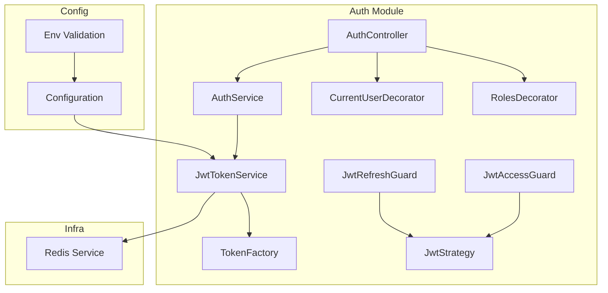
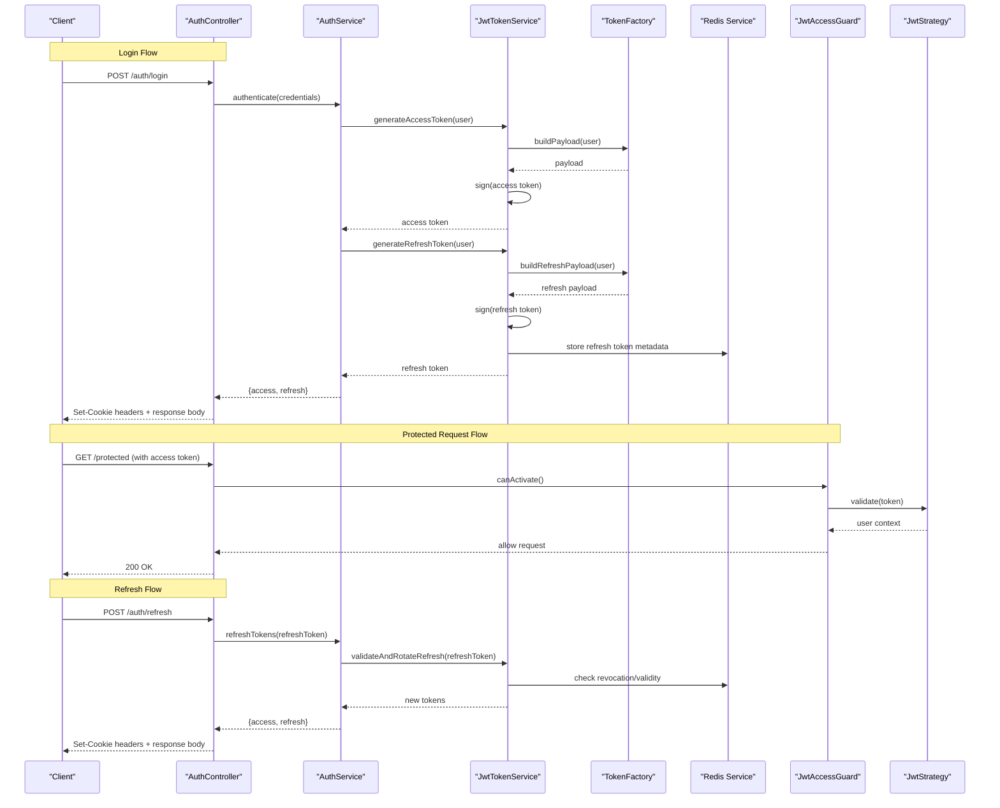
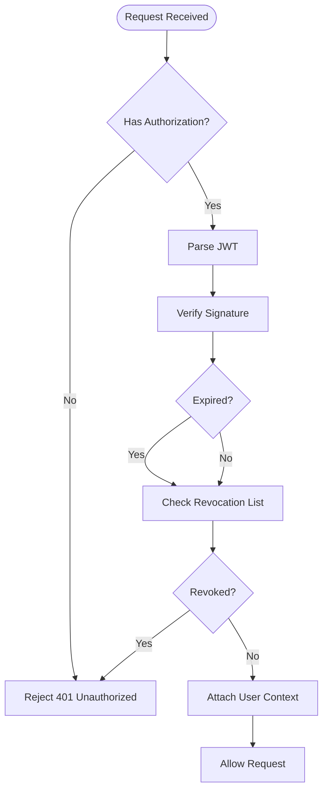
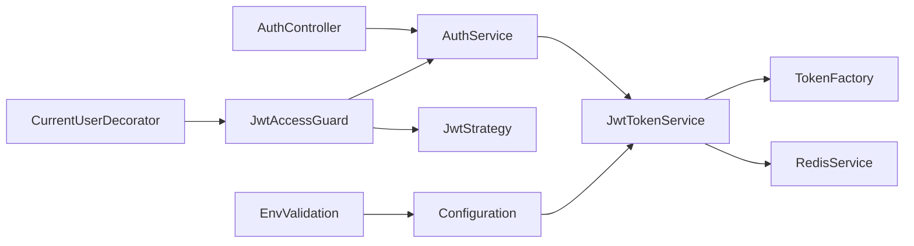

# JWT Authentication & Token Management

<cite>
**Referenced Files in This Document**
- [auth.module.ts](file://apps/backend/src/auth/auth.module.ts)
- [auth.controller.ts](file://apps/backend/src/auth/auth.controller.ts)
- [auth.service.ts](file://apps/backend/src/auth/auth.service.ts)
- [jwt.strategy.ts](file://apps/backend/src/auth/strategies/jwt.strategy.ts)
- [jwt-access.guard.ts](file://apps/backend/src/auth/guards/jwt-access.guard.ts)
- [jwt-refresh.guard.ts](file://apps/backend/src/auth/guards/jwt-refresh.guard.ts)
- [current-user.decorator.ts](file://apps/backend/src/auth/decorators/current-user.decorator.ts)
- [roles.decorator.ts](file://apps/backend/src/auth/decorators/roles.decorator.ts)
- [jwt-token.service.ts](file://apps/backend/src/auth/services/jwt-token.service.ts)
- [token-factory.ts](file://apps/backend/src/auth/services/token-factory.ts)
- [configuration.ts](file://apps/backend/src/config/configuration.ts)
- [env.validation.ts](file://apps/backend/src/config/env.validation.ts)
- [redis.service.ts](file://apps/backend/src/redis/redis.service.ts)
</cite>

## Table of Contents
1. [Introduction](#introduction)
2. [Project Structure](#project-structure)
3. [Core Components](#core-components)
4. [Architecture Overview](#architecture-overview)
5. [Detailed Component Analysis](#detailed-component-analysis)
6. [Dependency Analysis](#dependency-analysis)
7. [Performance Considerations](#performance-considerations)
8. [Troubleshooting Guide](#troubleshooting-guide)
9. [Conclusion](#conclusion)
10. [Appendices](#appendices)

## Introduction
This document explains the JWT authentication and token management system implemented in the backend. It covers the full lifecycle of access and refresh tokens, including generation, validation, rotation, and expiration handling. It also documents the JwtTokenService implementation, token factory patterns, guard mechanisms for protected routes, custom decorators for user context extraction, cookie-based session management, and security best practices.

## Project Structure
The authentication subsystem is organized under apps/backend/src/auth with clear separation of concerns:
- Controllers expose HTTP endpoints for login, logout, and token refresh
- Services encapsulate business logic for token issuance, validation, and revocation
- Guards enforce authorization on routes using JWT strategies
- Decorators simplify extracting authenticated user context into controllers
- Strategies define how JWTs are parsed and validated
- Configuration centralizes JWT settings and environment variables



**Diagram sources**
- [auth.controller.ts](file://apps/backend/src/auth/auth.controller.ts)
- [auth.service.ts](file://apps/backend/src/auth/auth.service.ts)
- [jwt-token.service.ts](file://apps/backend/src/auth/services/jwt-token.service.ts)
- [token-factory.ts](file://apps/backend/src/auth/services/token-factory.ts)
- [jwt-access.guard.ts](file://apps/backend/src/auth/guards/jwt-access.guard.ts)
- [jwt-refresh.guard.ts](file://apps/backend/src/auth/guards/jwt-refresh.guard.ts)
- [jwt.strategy.ts](file://apps/backend/src/auth/strategies/jwt.strategy.ts)
- [current-user.decorator.ts](file://apps/backend/src/auth/decorators/current-user.decorator.ts)
- [roles.decorator.ts](file://apps/backend/src/auth/decorators/roles.decorator.ts)
- [configuration.ts](file://apps/backend/src/config/configuration.ts)
- [env.validation.ts](file://apps/backend/src/config/env.validation.ts)
- [redis.service.ts](file://apps/backend/src/redis/redis.service.ts)

**Section sources**
- [auth.module.ts](file://apps/backend/src/auth/auth.module.ts)
- [auth.controller.ts](file://apps/backend/src/auth/auth.controller.ts)
- [auth.service.ts](file://apps/backend/src/auth/auth.service.ts)

## Core Components
- AuthController: Exposes endpoints for login, logout, and refresh flows; integrates guards and decorators to protect routes and inject user context.
- AuthService: Orchestrates authentication workflows, delegating token creation/validation to JwtTokenService and coordinating with Redis for revocation and rotation.
- JwtTokenService: Central service for generating, validating, refreshing, and revoking JWTs; coordinates with TokenFactory for payload construction and signing.
- TokenFactory: Encapsulates token payload building, claims mapping, and strategy-specific options (e.g., audience, issuer, expiry).
- JwtStrategy: Validates incoming JWTs against configuration and extracts user identity for downstream use.
- Guards: JwtAccessGuard protects resource routes; JwtRefreshGuard secures token refresh endpoints.
- Decorators: CurrentUserDecorator injects authenticated user; RolesDecorator enforces role-based access control.
- Configuration: Centralized JWT settings (signing keys, issuers, audiences, expirations) and environment validation.
- Redis Service: Used for token revocation lists, refresh token storage, and short-lived stateful checks.

**Section sources**
- [auth.controller.ts](file://apps/backend/src/auth/auth.controller.ts)
- [auth.service.ts](file://apps/backend/src/auth/auth.service.ts)
- [jwt-token.service.ts](file://apps/backend/src/auth/services/jwt-token.service.ts)
- [token-factory.ts](file://apps/backend/src/auth/services/token-factory.ts)
- [jwt.strategy.ts](file://apps/backend/src/auth/strategies/jwt.strategy.ts)
- [jwt-access.guard.ts](file://apps/backend/src/auth/guards/jwt-access.guard.ts)
- [jwt-refresh.guard.ts](file://apps/backend/src/auth/guards/jwt-refresh.guard.ts)
- [current-user.decorator.ts](file://apps/backend/src/auth/decorators/current-user.decorator.ts)
- [roles.decorator.ts](file://apps/backend/src/auth/decorators/roles.decorator.ts)
- [configuration.ts](file://apps/backend/src/config/configuration.ts)
- [env.validation.ts](file://apps/backend/src/config/env.validation.ts)
- [redis.service.ts](file://apps/backend/src/redis/redis.service.ts)

## Architecture Overview
The JWT architecture follows a layered approach:
- Controllers handle HTTP requests and responses
- Guards validate tokens at route boundaries
- Services implement business logic and orchestrate token operations
- Strategies parse and verify tokens based on configuration
- Redis provides stateful support for revocation and refresh token lifecycle



**Diagram sources**
- [auth.controller.ts](file://apps/backend/src/auth/auth.controller.ts)
- [auth.service.ts](file://apps/backend/src/auth/auth.service.ts)
- [jwt-token.service.ts](file://apps/backend/src/auth/services/jwt-token.service.ts)
- [token-factory.ts](file://apps/backend/src/auth/services/token-factory.ts)
- [jwt-access.guard.ts](file://apps/backend/src/auth/guards/jwt-access.guard.ts)
- [jwt-refresh.guard.ts](file://apps/backend/src/auth/guards/jwt-refresh.guard.ts)
- [jwt.strategy.ts](file://apps/backend/src/auth/strategies/jwt.strategy.ts)
- [redis.service.ts](file://apps/backend/src/redis/redis.service.ts)

## Detailed Component Analysis

### JwtTokenService
JwtTokenService is the core component responsible for:
- Generating short-lived access tokens
- Issuing long-lived refresh tokens
- Validating tokens against configuration and revocation lists
- Rotating refresh tokens securely
- Revoking tokens upon logout or security events

Key responsibilities:
- Access token generation with minimal claims and short TTL
- Refresh token generation with secure storage in Redis
- Validation pipeline that checks signature, expiry, and revocation
- Rotation flow that invalidates old refresh tokens and issues new ones

```mermaid
classDiagram
class JwtTokenService {
+generateAccessToken(user) string
+generateRefreshToken(user) string
+validateAccessToken(token) User
+validateRefreshToken(token) boolean
+rotateRefreshToken(oldRefresh) {access, refresh}
+revokeToken(token) void
-buildAccessPayload(user) object
-buildRefreshPayload(user) object
-verifySignature(token) boolean
-checkRevocation(tokenId) boolean
}
class TokenFactory {
+buildAccessPayload(user) object
+buildRefreshPayload(user) object
+setExpiry(options) object
+setAudienceIssuer(options) object
}
class RedisService {
+set(key, value, ttl) void
+get(key) string
+del(key) void
+exists(key) boolean
}
JwtTokenService --> TokenFactory : "uses"
JwtTokenService --> RedisService : "uses"
```

**Diagram sources**
- [jwt-token.service.ts](file://apps/backend/src/auth/services/jwt-token.service.ts)
- [token-factory.ts](file://apps/backend/src/auth/services/token-factory.ts)
- [redis.service.ts](file://apps/backend/src/redis/redis.service.ts)

**Section sources**
- [jwt-token.service.ts](file://apps/backend/src/auth/services/jwt-token.service.ts)
- [token-factory.ts](file://apps/backend/src/auth/services/token-factory.ts)
- [redis.service.ts](file://apps/backend/src/redis/redis.service.ts)

### Token Factory Pattern
TokenFactory abstracts payload construction and signing options:
- Builds standardized payloads for access and refresh tokens
- Applies consistent claims (sub, iat, exp, aud, iss)
- Configures algorithm and key selection from configuration
- Supports future extensions like token versioning or custom claims

Benefits:
- Centralized token structure ensures consistency
- Reduces duplication across services
- Simplifies testing by mocking payload builders

**Section sources**
- [token-factory.ts](file://apps/backend/src/auth/services/token-factory.ts)
- [configuration.ts](file://apps/backend/src/config/configuration.ts)

### Guards and Strategies
- JwtAccessGuard: Protects resource routes by validating access tokens via JwtStrategy
- JwtRefreshGuard: Secures refresh endpoints and validates refresh tokens
- JwtStrategy: Parses Authorization header or cookies, verifies signatures, and attaches user context



**Diagram sources**
- [jwt-access.guard.ts](file://apps/backend/src/auth/guards/jwt-access.guard.ts)
- [jwt-refresh.guard.ts](file://apps/backend/src/auth/guards/jwt-refresh.guard.ts)
- [jwt.strategy.ts](file://apps/backend/src/auth/strategies/jwt.strategy.ts)

**Section sources**
- [jwt-access.guard.ts](file://apps/backend/src/auth/guards/jwt-access.guard.ts)
- [jwt-refresh.guard.ts](file://apps/backend/src/auth/guards/jwt-refresh.guard.ts)
- [jwt.strategy.ts](file://apps/backend/src/auth/strategies/jwt.strategy.ts)

### Custom Decorators for User Context
- CurrentUserDecorator: Injects authenticated user into controller methods
- RolesDecorator: Enforces role-based access control on routes

Usage pattern:
- Apply @CurrentUser() to extract user from request context
- Apply @Roles('admin') to restrict access to specific roles
- Guards validate tokens before decorators execute

**Section sources**
- [current-user.decorator.ts](file://apps/backend/src/auth/decorators/current-user.decorator.ts)
- [roles.decorator.ts](file://apps/backend/src/auth/decorators/roles.decorator.ts)

### Protected Route Configuration
Protected routes are configured by applying guards and decorators:
- Use JwtAccessGuard for general protected endpoints
- Use JwtRefreshGuard for token refresh endpoints
- Combine with RolesDecorator for role-based restrictions

Example patterns:
- @UseGuards(JwtAccessGuard) on controller methods
- @Roles('user', 'admin') for role enforcement
- @CurrentUser() to access authenticated user data

**Section sources**
- [auth.controller.ts](file://apps/backend/src/auth/auth.controller.ts)
- [jwt-access.guard.ts](file://apps/backend/src/auth/guards/jwt-access.guard.ts)
- [jwt-refresh.guard.ts](file://apps/backend/src/auth/guards/jwt-refresh.guard.ts)
- [roles.decorator.ts](file://apps/backend/src/auth/decorators/roles.decorator.ts)

### Cookie-Based Session Management
Cookies are used for secure token storage:
- HttpOnly flags prevent client-side JavaScript access
- Secure flag ensures HTTPS-only transmission
- SameSite attribute mitigates CSRF attacks
- Path and Domain scoping limit exposure

Implementation considerations:
- Separate cookies for access and refresh tokens
- Short-lived access tokens stored in memory or lightweight storage
- Long-lived refresh tokens stored in HttpOnly cookies with secure flags
- Automatic cleanup of expired tokens via Redis TTL

**Section sources**
- [auth.controller.ts](file://apps/backend/src/auth/auth.controller.ts)
- [configuration.ts](file://apps/backend/src/config/configuration.ts)

### Token Security Best Practices
- Use short-lived access tokens (5-15 minutes)
- Implement refresh token rotation on each use
- Store refresh tokens in HttpOnly, Secure cookies
- Maintain token revocation lists in Redis with TTL
- Validate audience and issuer claims strictly
- Use strong signing algorithms (RS256/ES256)
- Rotate signing keys periodically
- Log authentication events for audit trails
- Implement rate limiting on auth endpoints
- Sanitize and validate all inputs

**Section sources**
- [jwt-token.service.ts](file://apps/backend/src/auth/services/jwt-token.service.ts)
- [configuration.ts](file://apps/backend/src/config/configuration.ts)
- [env.validation.ts](file://apps/backend/src/config/env.validation.ts)

## Dependency Analysis
The authentication system has clear dependency boundaries:
- Controllers depend on services for business logic
- Services depend on token utilities and infrastructure (Redis)
- Guards depend on strategies for token parsing
- Configuration drives behavior across all components



**Diagram sources**
- [auth.controller.ts](file://apps/backend/src/auth/auth.controller.ts)
- [auth.service.ts](file://apps/backend/src/auth/auth.service.ts)
- [jwt-token.service.ts](file://apps/backend/src/auth/services/jwt-token.service.ts)
- [token-factory.ts](file://apps/backend/src/auth/services/token-factory.ts)
- [jwt-access.guard.ts](file://apps/backend/src/auth/guards/jwt-access.guard.ts)
- [jwt.strategy.ts](file://apps/backend/src/auth/strategies/jwt.strategy.ts)
- [configuration.ts](file://apps/backend/src/config/configuration.ts)
- [env.validation.ts](file://apps/backend/src/config/env.validation.ts)
- [redis.service.ts](file://apps/backend/src/redis/redis.service.ts)

**Section sources**
- [auth.module.ts](file://apps/backend/src/auth/auth.module.ts)
- [auth.controller.ts](file://apps/backend/src/auth/auth.controller.ts)
- [auth.service.ts](file://apps/backend/src/auth/auth.service.ts)

## Performance Considerations
- Minimize token payload size to reduce network overhead
- Use Redis clustering for high-throughput token validation
- Implement caching for frequently accessed user profiles
- Batch token revocation operations during maintenance
- Monitor Redis latency and set appropriate timeouts
- Use connection pooling for database and Redis operations
- Profile token signing operations for CPU-intensive algorithms

[No sources needed since this section provides general guidance]

## Troubleshooting Guide
Common issues and resolutions:
- Invalid token signature: Verify signing keys and algorithms match configuration
- Token expired: Ensure clients handle refresh token flow correctly
- Redis connection failures: Check Redis availability and network connectivity
- Cookie not set: Verify domain, path, and security flags in browser settings
- Rate limiting errors: Adjust limits based on traffic patterns
- Memory leaks: Monitor Redis memory usage and implement proper cleanup

Debugging steps:
- Enable detailed logging for authentication flows
- Inspect token contents using JWT decoders (never in production)
- Test with curl or Postman to isolate client issues
- Check Redis keys for token revocation status
- Review server logs for error messages and stack traces

**Section sources**
- [auth.service.ts](file://apps/backend/src/auth/auth.service.ts)
- [jwt-token.service.ts](file://apps/backend/src/auth/services/jwt-token.service.ts)
- [redis.service.ts](file://apps/backend/src/redis/redis.service.ts)

## Conclusion
The JWT authentication system provides a robust, scalable solution for securing API endpoints. The modular design separates concerns between token management, validation, and business logic. Security best practices ensure tokens are handled safely while maintaining performance through efficient caching and Redis integration. The comprehensive guard and decorator system simplifies route protection and user context management.

[No sources needed since this section summarizes without analyzing specific files]

## Appendices

### Configuration Reference
JWT configuration includes:
- Signing algorithm and key management
- Token expiration times for access and refresh tokens
- Audience and issuer validation settings
- Redis connection parameters
- Cookie security flags and scoping

Environment validation ensures required configuration values are present and properly formatted.

**Section sources**
- [configuration.ts](file://apps/backend/src/config/configuration.ts)
- [env.validation.ts](file://apps/backend/src/config/env.validation.ts)

### API Endpoints Summary
Authentication endpoints include:
- POST /auth/login: Authenticate user and issue tokens
- POST /auth/logout: Revoke tokens and clear cookies
- POST /auth/refresh: Rotate refresh tokens and issue new access tokens
- Protected routes with @UseGuards(JwtAccessGuard) for resource access

Each endpoint returns appropriate HTTP status codes and handles errors consistently.

**Section sources**
- [auth.controller.ts](file://apps/backend/src/auth/auth.controller.ts)