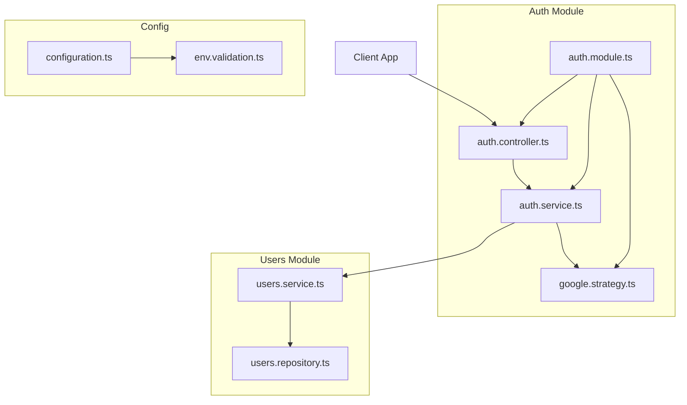
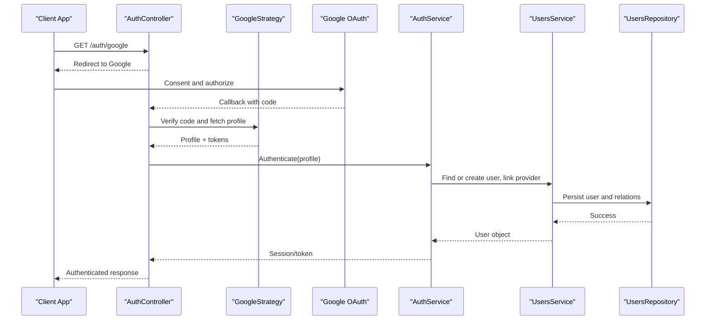
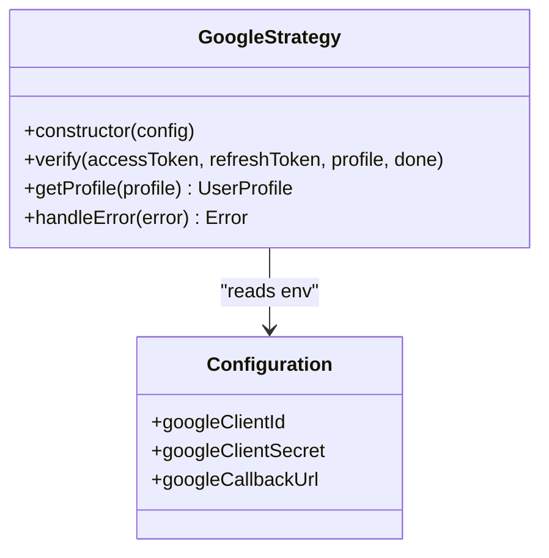
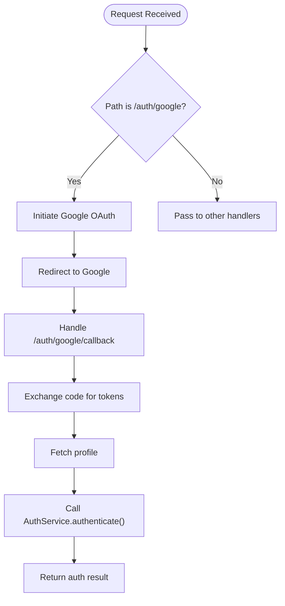
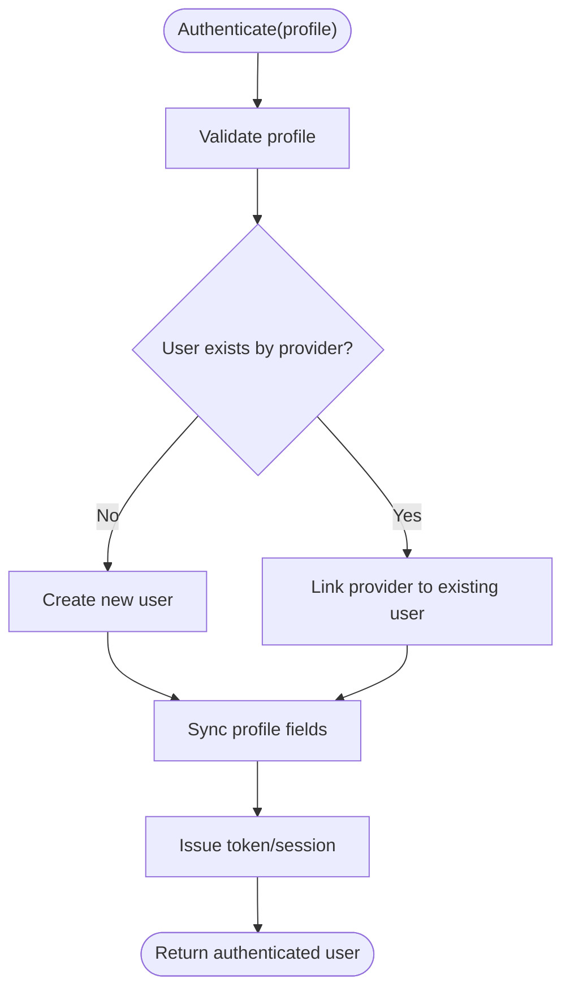
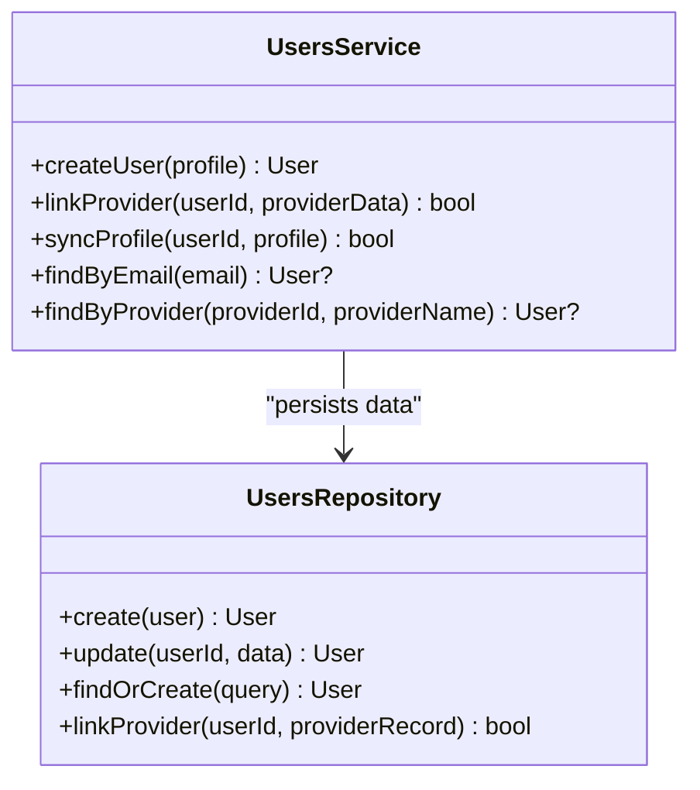
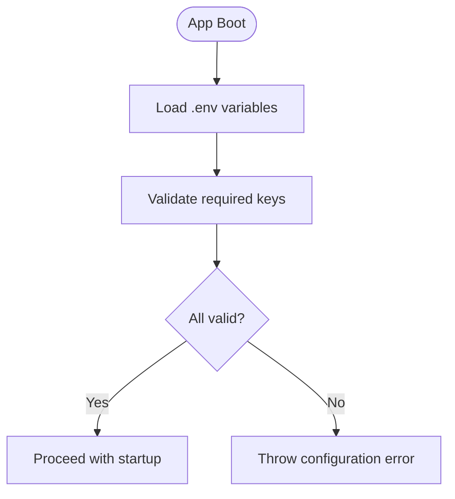
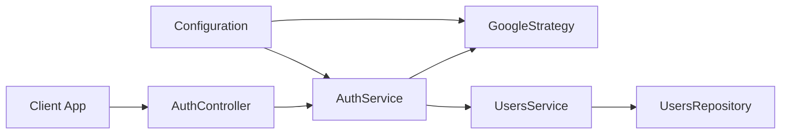

# OAuth Integration (Google)

<cite>
**Referenced Files in This Document**
- [auth.controller.ts](file://apps/backend/src/auth/auth.controller.ts)
- [auth.module.ts](file://apps/backend/src/auth/auth.module.ts)
- [auth.service.ts](file://apps/backend/src/auth/auth.service.ts)
- [google.strategy.ts](file://apps/backend/src/auth/strategies/google.strategy.ts)
- [users.service.ts](file://apps/backend/src/users/users.service.ts)
- [users.repository.ts](file://apps/backend/src/users/users.repository.ts)
- [configuration.ts](file://apps/backend/src/config/configuration.ts)
- [env.validation.ts](file://apps/backend/src/config/env.validation.ts)
- [auth.e2e.spec.ts](file://apps/backend/test/auth.e2e.spec.ts)
</cite>

## Table of Contents
1. [Introduction](#introduction)
2. [Project Structure](#project-structure)
3. [Core Components](#core-components)
4. [Architecture Overview](#architecture-overview)
5. [Detailed Component Analysis](#detailed-component-analysis)
6. [Dependency Analysis](#dependency-analysis)
7. [Performance Considerations](#performance-considerations)
8. [Troubleshooting Guide](#troubleshooting-guide)
9. [Conclusion](#conclusion)
10. [Appendices](#appendices)

## Introduction
This document explains the Google OAuth integration for the application, focusing on how users authenticate via Google, how profile data is retrieved and synchronized, and how accounts are created or linked to existing users. It covers the configuration of the GoogleStrategy, controller endpoints, service-layer logic, environment setup, error handling, and security best practices.

## Project Structure
The Google OAuth implementation resides primarily under the backend authentication module and user management services:
- Authentication module exposes HTTP endpoints and wires up Passport strategies.
- Strategy handles Google OAuth flows and maps provider profiles to application users.
- User services manage account creation, linking, and profile synchronization.
- Configuration validates environment variables required for OAuth.

**Diagram sources**
- [auth.controller.ts](file://apps/backend/src/auth/auth.controller.ts)
- [auth.module.ts](file://apps/backend/src/auth/auth.module.ts)
- [auth.service.ts](file://apps/backend/src/auth/auth.service.ts)
- [google.strategy.ts](file://apps/backend/src/auth/strategies/google.strategy.ts)
- [users.service.ts](file://apps/backend/src/users/users.service.ts)
- [users.repository.ts](file://apps/backend/src/users/users.repository.ts)
- [configuration.ts](file://apps/backend/src/config/configuration.ts)
- [env.validation.ts](file://apps/backend/src/config/env.validation.ts)

**Section sources**
- [auth.controller.ts](file://apps/backend/src/auth/auth.controller.ts)
- [auth.module.ts](file://apps/backend/src/auth/auth.module.ts)
- [auth.service.ts](file://apps/backend/src/auth/auth.service.ts)
- [google.strategy.ts](file://apps/backend/src/auth/strategies/google.strategy.ts)
- [users.service.ts](file://apps/backend/src/users/users.service.ts)
- [users.repository.ts](file://apps/backend/src/users/users.repository.ts)
- [configuration.ts](file://apps/backend/src/config/configuration.ts)
- [env.validation.ts](file://apps/backend/src/config/env.validation.ts)

## Core Components
- GoogleStrategy: Configures Google OAuth with Passport, defines scopes, and processes the callback to obtain a user profile.
- AuthController: Exposes endpoints to initiate Google OAuth and handle the callback flow.
- AuthService: Orchestrates login/signup, token issuance, and session management; coordinates with user services for account operations.
- UsersService: Manages user creation, linking provider accounts, and synchronizing profile attributes from Google.
- UsersRepository: Persists user records and relationships to the database.
- Configuration: Loads and validates environment variables such as client ID, secret, and redirect URLs.

Key responsibilities:
- Authorization code exchange occurs within the strategy/callback handler.
- Profile retrieval uses Google’s userinfo/profile endpoints.
- Account linking ensures that multiple provider identities can be associated with a single user.
- Profile synchronization updates fields like name, email, and avatar when they change upstream.

**Section sources**
- [google.strategy.ts](file://apps/backend/src/auth/strategies/google.strategy.ts)
- [auth.controller.ts](file://apps/backend/src/auth/auth.controller.ts)
- [auth.service.ts](file://apps/backend/src/auth/auth.service.ts)
- [users.service.ts](file://apps/backend/src/users/users.service.ts)
- [users.repository.ts](file://apps/backend/src/users/users.repository.ts)
- [configuration.ts](file://apps/backend/src/config/configuration.ts)
- [env.validation.ts](file://apps/backend/src/config/env.validation.ts)

## Architecture Overview
The Google OAuth flow follows these steps:
1. Client requests an authorization URL from the backend.
2. Backend redirects the user to Google’s consent screen.
3. Google redirects back with an authorization code.
4. Backend exchanges the code for tokens and fetches the user profile.
5. Backend creates or links the user account and issues an application token/session.

**Diagram sources**
- [auth.controller.ts](file://apps/backend/src/auth/auth.controller.ts)
- [google.strategy.ts](file://apps/backend/src/auth/strategies/google.strategy.ts)
- [auth.service.ts](file://apps/backend/src/auth/auth.service.ts)
- [users.service.ts](file://apps/backend/src/users/users.service.ts)
- [users.repository.ts](file://apps/backend/src/users/users.repository.ts)

## Detailed Component Analysis

### GoogleStrategy Configuration
- Purpose: Configure Passport’s Google OAuth strategy, define scopes, and implement profile parsing.
- Key behaviors:
  - Uses client ID and secret from environment configuration.
  - Requests appropriate scopes (e.g., profile and email).
  - On success, returns normalized profile data to the application.
  - On failure, propagates errors to the controller layer.

**Diagram sources**
- [google.strategy.ts](file://apps/backend/src/auth/strategies/google.strategy.ts)
- [configuration.ts](file://apps/backend/src/config/configuration.ts)

**Section sources**
- [google.strategy.ts](file://apps/backend/src/auth/strategies/google.strategy.ts)
- [configuration.ts](file://apps/backend/src/config/configuration.ts)
- [env.validation.ts](file://apps/backend/src/config/env.validation.ts)

### AuthController Endpoints
- Purpose: Provide HTTP endpoints to start Google OAuth and handle the callback.
- Typical endpoints:
  - Initiate Google OAuth: GET /auth/google
  - Handle callback: GET /auth/google/callback
- Responsibilities:
  - Validate request parameters.
  - Delegate authentication to AuthService.
  - Return standardized responses or errors.

**Diagram sources**
- [auth.controller.ts](file://apps/backend/src/auth/auth.controller.ts)
- [auth.service.ts](file://apps/backend/src/auth/auth.service.ts)

**Section sources**
- [auth.controller.ts](file://apps/backend/src/auth/auth.controller.ts)
- [auth.service.ts](file://apps/backend/src/auth/auth.service.ts)

### AuthService Logic
- Purpose: Orchestrate authentication, token issuance, and coordination with user services.
- Key behaviors:
  - Validates incoming profile data.
  - Determines whether to create a new user or link to an existing one.
  - Issues application tokens or sets sessions based on configuration.
  - Handles errors consistently and returns meaningful messages.

**Diagram sources**
- [auth.service.ts](file://apps/backend/src/auth/auth.service.ts)
- [users.service.ts](file://apps/backend/src/users/users.service.ts)

**Section sources**
- [auth.service.ts](file://apps/backend/src/auth/auth.service.ts)
- [users.service.ts](file://apps/backend/src/users/users.service.ts)

### UsersService and Repository
- Purpose: Manage user lifecycle, provider linking, and profile synchronization.
- Key behaviors:
  - Create users with unique identifiers and provider mappings.
  - Link additional providers to existing users safely.
  - Update profile fields from upstream providers (name, email, avatar).
  - Enforce uniqueness constraints and prevent duplicate accounts.

**Diagram sources**
- [users.service.ts](file://apps/backend/src/users/users.service.ts)
- [users.repository.ts](file://apps/backend/src/users/users.repository.ts)

**Section sources**
- [users.service.ts](file://apps/backend/src/users/users.service.ts)
- [users.repository.ts](file://apps/backend/src/users/users.repository.ts)

### Environment Configuration
- Purpose: Load and validate environment variables required for Google OAuth.
- Required variables typically include:
  - Google client ID
  - Google client secret
  - Callback URL
  - Application base URL and secure cookie settings
- Validation ensures the application fails fast if misconfigured.

**Diagram sources**
- [configuration.ts](file://apps/backend/src/config/configuration.ts)
- [env.validation.ts](file://apps/backend/src/config/env.validation.ts)

**Section sources**
- [configuration.ts](file://apps/backend/src/config/configuration.ts)
- [env.validation.ts](file://apps/backend/src/config/env.validation.ts)

## Dependency Analysis
The following diagram shows how components depend on each other during the OAuth flow:

**Diagram sources**
- [auth.controller.ts](file://apps/backend/src/auth/auth.controller.ts)
- [auth.service.ts](file://apps/backend/src/auth/auth.service.ts)
- [google.strategy.ts](file://apps/backend/src/auth/strategies/google.strategy.ts)
- [users.service.ts](file://apps/backend/src/users/users.service.ts)
- [users.repository.ts](file://apps/backend/src/users/users.repository.ts)
- [configuration.ts](file://apps/backend/src/config/configuration.ts)

**Section sources**
- [auth.controller.ts](file://apps/backend/src/auth/auth.controller.ts)
- [auth.service.ts](file://apps/backend/src/auth/auth.service.ts)
- [google.strategy.ts](file://apps/backend/src/auth/strategies/google.strategy.ts)
- [users.service.ts](file://apps/backend/src/users/users.service.ts)
- [users.repository.ts](file://apps/backend/src/users/users.repository.ts)
- [configuration.ts](file://apps/backend/src/config/configuration.ts)

## Performance Considerations
- Minimize network calls: Cache profile lookups where appropriate to reduce repeated Google API calls.
- Use efficient queries: Ensure repository methods use indexed fields for user lookup by email or provider IDs.
- Avoid redundant updates: Only update profile fields when upstream values change.
- Rate limiting: Apply rate limits on authentication endpoints to mitigate abuse.
- Connection pooling: Ensure database connections are pooled and reused efficiently.

[No sources needed since this section provides general guidance]

## Troubleshooting Guide
Common issues and resolutions:
- Invalid client ID or secret: Verify environment variables match Google Console credentials.
- Redirect URI mismatch: Ensure callback URL matches exactly what is configured in Google OAuth settings.
- Scope errors: Confirm requested scopes include profile and email access.
- Duplicate accounts: Check linking logic to ensure users are not created multiple times for the same provider identity.
- Profile sync failures: Inspect error handling in profile synchronization and retry mechanisms.

Use e2e tests to validate the full flow:
- The test suite exercises the Google OAuth endpoints and verifies expected outcomes.

**Section sources**
- [auth.e2e.spec.ts](file://apps/backend/test/auth.e2e.spec.ts)
- [configuration.ts](file://apps/backend/src/config/configuration.ts)
- [env.validation.ts](file://apps/backend/src/config/env.validation.ts)

## Conclusion
The Google OAuth integration is implemented through a clear separation of concerns: controllers expose endpoints, strategies handle provider-specific flows, services orchestrate business logic, and repositories persist data. Proper configuration, robust error handling, and careful account linking ensure a secure and reliable authentication experience. Following the setup instructions and security recommendations will help maintain a strong OAuth implementation.

[No sources needed since this section summarizes without analyzing specific files]

## Appendices

### Setup Instructions for Google OAuth Credentials
- Create a Google Cloud project and enable the Google+ API or relevant OAuth APIs.
- Configure OAuth consent screen and add authorized redirect URIs matching your callback URL.
- Generate client ID and client secret.
- Store credentials securely in environment variables and validate them at startup.

[No sources needed since this section provides general guidance]

### Security Considerations for OAuth Implementations
- Use HTTPS everywhere and enforce secure cookies.
- Validate state parameters to prevent CSRF attacks.
- Limit scopes to the minimum required.
- Rotate secrets regularly and store them securely.
- Monitor and log authentication events for anomalies.
- Implement rate limiting and account lockout policies.

[No sources needed since this section provides general guidance]