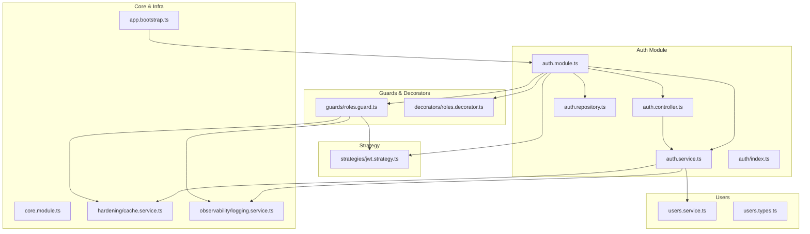
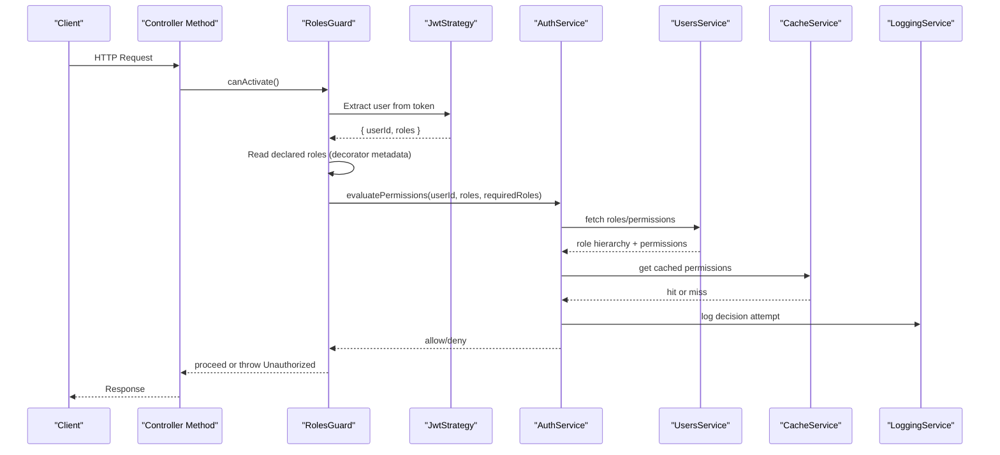
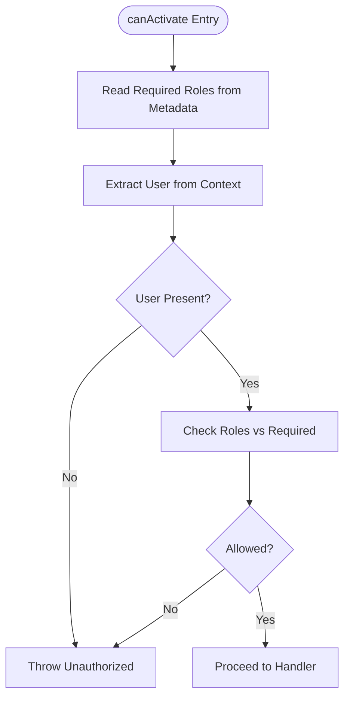
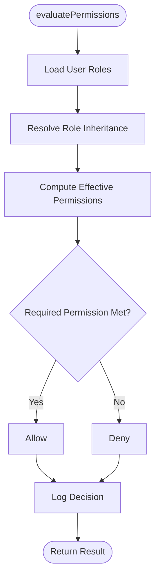
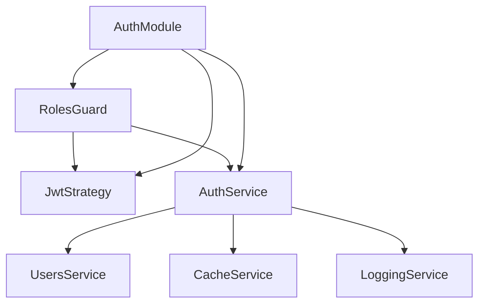

# Role-Based Access Control (RBAC)

<cite>
**Referenced Files in This Document**
- [auth.module.ts](file://apps/backend/src/auth/auth.module.ts)
- [auth.controller.ts](file://apps/backend/src/auth/auth.controller.ts)
- [auth.service.ts](file://apps/backend/src/auth/auth.service.ts)
- [auth.repository.ts](file://apps/backend/src/auth/auth.repository.ts)
- [index.ts](file://apps/backend/src/auth/index.ts)
- [guards/roles.guard.ts](file://apps/backend/src/auth/guards/roles.guard.ts)
- [decorators/roles.decorator.ts](file://apps/backend/src/auth/decorators/roles.decorator.ts)
- [strategies/jwt.strategy.ts](file://apps/backend/src/auth/strategies/jwt.strategy.ts)
- [users.service.ts](file://apps/backend/src/users/services/users.service.ts)
- [users.types.ts](file://apps/backend/src/users/users.types.ts)
- [core.module.ts](file://apps/backend/src/core/core.module.ts)
- [cache.service.ts](file://apps/backend/src/hardening/cache.service.ts)
- [logging.service.ts](file://apps/backend/src/observability/logging.service.ts)
- [app.bootstrap.ts](file://apps/backend/src/app.bootstrap.ts)
</cite>

## Table of Contents
1. [Introduction](#introduction)
2. [Project Structure](#project-structure)
3. [Core Components](#core-components)
4. [Architecture Overview](#architecture-overview)
5. [Detailed Component Analysis](#detailed-component-analysis)
6. [Dependency Analysis](#dependency-analysis)
7. [Performance Considerations](#performance-considerations)
8. [Troubleshooting Guide](#troubleshooting-guide)
9. [Conclusion](#conclusion)
10. [Appendices](#appendices)

## Introduction
This document explains the role-based access control (RBAC) implementation in the backend, focusing on:
- Roles guard mechanism for protecting routes
- Custom decorators for declaring role requirements
- Permission evaluation logic and hierarchy
- User role structure and dynamic assignment
- Route protection examples
- Fine-grained permissions
- Role inheritance patterns
- Permission caching strategies
- Audit logging for access control events

The goal is to provide both a conceptual overview and code-level guidance so that developers can secure endpoints consistently and extend the system as needed.

## Project Structure
RBAC-related components are primarily located under the auth module and integrate with users, core services, hardening utilities, and observability. The key areas include:
- Auth module wiring and exports
- Controllers handling authentication flows
- Services implementing business logic for roles and permissions
- Guards enforcing authorization at request time
- Decorators simplifying route protection declarations
- JWT strategy for extracting authenticated context
- Users service/types for role data models
- Caching and logging services for performance and audit

**Diagram sources**
- [auth.module.ts](file://apps/backend/src/auth/auth.module.ts)
- [auth.controller.ts](file://apps/backend/src/auth/auth.controller.ts)
- [auth.service.ts](file://apps/backend/src/auth/auth.service.ts)
- [auth.repository.ts](file://apps/backend/src/auth/auth.repository.ts)
- [index.ts](file://apps/backend/src/auth/index.ts)
- [guards/roles.guard.ts](file://apps/backend/src/auth/guards/roles.guard.ts)
- [decorators/roles.decorator.ts](file://apps/backend/src/auth/decorators/roles.decorator.ts)
- [strategies/jwt.strategy.ts](file://apps/backend/src/auth/strategies/jwt.strategy.ts)
- [users.service.ts](file://apps/backend/src/users/services/users.service.ts)
- [users.types.ts](file://apps/backend/src/users/users.types.ts)
- [core.module.ts](file://apps/backend/src/core/core.module.ts)
- [cache.service.ts](file://apps/backend/src/hardening/cache.service.ts)
- [logging.service.ts](file://apps/backend/src/observability/logging.service.ts)
- [app.bootstrap.ts](file://apps/backend/src/app.bootstrap.ts)

**Section sources**
- [auth.module.ts](file://apps/backend/src/auth/auth.module.ts)
- [auth.controller.ts](file://apps/backend/src/auth/auth.controller.ts)
- [auth.service.ts](file://apps/backend/src/auth/auth.service.ts)
- [auth.repository.ts](file://apps/backend/src/auth/auth.repository.ts)
- [index.ts](file://apps/backend/src/auth/index.ts)
- [guards/roles.guard.ts](file://apps/backend/src/auth/guards/roles.guard.ts)
- [decorators/roles.decorator.ts](file://apps/backend/src/auth/decorators/roles.decorator.ts)
- [strategies/jwt.strategy.ts](file://apps/backend/src/auth/strategies/jwt.strategy.ts)
- [users.service.ts](file://apps/backend/src/users/services/users.service.ts)
- [users.types.ts](file://apps/backend/src/users/users.types.ts)
- [core.module.ts](file://apps/backend/src/core/core.module.ts)
- [cache.service.ts](file://apps/backend/src/hardening/cache.service.ts)
- [logging.service.ts](file://apps/backend/src/observability/logging.service.ts)
- [app.bootstrap.ts](file://apps/backend/src/app.bootstrap.ts)

## Core Components
- Roles Guard: Enforces role requirements on controllers/methods by reading declared roles and validating against the current user’s roles.
- Roles Decorator: Declares required roles at controller or method level, enabling declarative security.
- JWT Strategy: Extracts and validates tokens, populating the request context with user identity and roles.
- Auth Service: Orchestrates authentication and authorization operations, including role checks and permission evaluations.
- Users Service/Types: Provides role definitions, hierarchies, and dynamic assignment capabilities.
- Cache Service: Caches role and permission lookups to reduce latency.
- Logging Service: Records access control decisions for auditing and compliance.

Key responsibilities:
- Centralize role and permission logic
- Provide reusable guards and decorators
- Integrate with token validation and user context
- Support fine-grained permissions and inheritance
- Ensure performance via caching
- Maintain audit trails

**Section sources**
- [guards/roles.guard.ts](file://apps/backend/src/auth/guards/roles.guard.ts)
- [decorators/roles.decorator.ts](file://apps/backend/src/auth/decorators/roles.decorator.ts)
- [strategies/jwt.strategy.ts](file://apps/backend/src/auth/strategies/jwt.strategy.ts)
- [auth.service.ts](file://apps/backend/src/auth/auth.service.ts)
- [users.service.ts](file://apps/backend/src/users/services/users.service.ts)
- [users.types.ts](file://apps/backend/src/users/users.types.ts)
- [cache.service.ts](file://apps/backend/src/hardening/cache.service.ts)
- [logging.service.ts](file://apps/backend/src/observability/logging.service.ts)

## Architecture Overview
RBAC integrates into the NestJS pipeline through guards and decorators, leveraging JWT for identity and a centralized service for policy evaluation. Caching reduces repeated role/permission checks, while logging ensures traceability.

**Diagram sources**
- [guards/roles.guard.ts](file://apps/backend/src/auth/guards/roles.guard.ts)
- [decorators/roles.decorator.ts](file://apps/backend/src/auth/decorators/roles.decorator.ts)
- [strategies/jwt.strategy.ts](file://apps/backend/src/auth/strategies/jwt.strategy.ts)
- [auth.service.ts](file://apps/backend/src/auth/auth.service.ts)
- [users.service.ts](file://apps/backend/src/users/services/users.service.ts)
- [cache.service.ts](file://apps/backend/src/hardening/cache.service.ts)
- [logging.service.ts](file://apps/backend/src/observability/logging.service.ts)

## Detailed Component Analysis

### Roles Guard Mechanism
The roles guard enforces authorization by:
- Reading decorator metadata to determine required roles
- Extracting the authenticated user from the request context via the JWT strategy
- Evaluating whether the user’s roles satisfy the required roles
- Optionally checking fine-grained permissions beyond roles
- Returning true to allow the request or throwing an unauthorized error

**Diagram sources**
- [guards/roles.guard.ts](file://apps/backend/src/auth/guards/roles.guard.ts)
- [strategies/jwt.strategy.ts](file://apps/backend/src/auth/strategies/jwt.strategy.ts)

**Section sources**
- [guards/roles.guard.ts](file://apps/backend/src/auth/guards/roles.guard.ts)

### Custom Roles Decorator
The roles decorator provides a declarative way to specify role requirements:
- Applied at controller or method level
- Stores metadata consumed by the roles guard
- Supports arrays of roles and optional flags for strictness

Usage pattern:
- Protect entire controllers by applying the decorator at class level
- Protect specific methods for finer control
- Combine with other decorators as needed

**Section sources**
- [decorators/roles.decorator.ts](file://apps/backend/src/auth/decorators/roles.decorator.ts)

### Permission Evaluation Logic
Permission evaluation extends beyond simple role matching:
- Resolves user roles and inherited roles
- Computes effective permissions based on role hierarchy
- Supports resource-scoped permissions (e.g., “media:write”)
- Integrates caching to avoid repeated computations
- Logs all decisions for auditability

**Diagram sources**
- [auth.service.ts](file://apps/backend/src/auth/auth.service.ts)
- [users.service.ts](file://apps/backend/src/users/services/users.service.ts)
- [cache.service.ts](file://apps/backend/src/hardening/cache.service.ts)
- [logging.service.ts](file://apps/backend/src/observability/logging.service.ts)

**Section sources**
- [auth.service.ts](file://apps/backend/src/auth/auth.service.ts)
- [users.service.ts](file://apps/backend/src/users/services/users.service.ts)
- [cache.service.ts](file://apps/backend/src/hardening/cache.service.ts)
- [logging.service.ts](file://apps/backend/src/observability/logging.service.ts)

### User Role Structure and Hierarchy
Role structure supports:
- Base roles (e.g., viewer, editor, admin)
- Hierarchical inheritance (e.g., editor inherits viewer permissions)
- Dynamic assignment via user profiles or membership
- Resource-scoped permissions for fine-grained control

Data model considerations:
- Role definitions with parent-child relationships
- User-role mappings with scopes
- Permission sets derived from roles

**Section sources**
- [users.types.ts](file://apps/backend/src/users/users.types.ts)
- [users.service.ts](file://apps/backend/src/users/services/users.service.ts)

### Dynamic Role Assignment
Dynamic assignment enables:
- Assigning roles at runtime based on organizational context
- Updating roles without restarting services
- Supporting temporary or conditional roles (e.g., project-based editors)

Implementation approach:
- Use users service to update role assignments
- Invalidate caches when roles change
- Trigger re-evaluation on next request

**Section sources**
- [users.service.ts](file://apps/backend/src/users/services/users.service.ts)
- [cache.service.ts](file://apps/backend/src/hardening/cache.service.ts)

### Route Protection Examples
Protecting routes:
- Apply roles decorator at controller level to protect all endpoints
- Apply roles decorator at method level for selective protection
- Combine with other guards if necessary

Examples:
- Require “admin” role for sensitive endpoints
- Require “editor” role for content modification endpoints
- Require “viewer” role for read-only endpoints

**Section sources**
- [decorators/roles.decorator.ts](file://apps/backend/src/auth/decorators/roles.decorator.ts)
- [guards/roles.guard.ts](file://apps/backend/src/auth/guards/roles.guard.ts)

### Fine-Grained Permissions
Fine-grained permissions enable:
- Resource-specific actions (e.g., “media:upload”, “collection:delete”)
- Conditional access based on ownership or context
- Policy evaluation beyond static roles

Integration points:
- Extend roles guard to check permissions after role checks
- Use auth service to compute effective permissions
- Cache permission results per user and resource scope

**Section sources**
- [auth.service.ts](file://apps/backend/src/auth/auth.service.ts)
- [users.service.ts](file://apps/backend/src/users/services/users.service.ts)

### Role Inheritance
Role inheritance allows:
- Child roles to inherit permissions from parent roles
- Simplified management of complex permission sets
- Clear hierarchy for readability and maintenance

Implementation:
- Define role hierarchy in users types
- Resolve inheritance during permission computation
- Cache resolved permissions to optimize performance

**Section sources**
- [users.types.ts](file://apps/backend/src/users/users.types.ts)
- [auth.service.ts](file://apps/backend/src/auth/auth.service.ts)

### Permission Caching
Caching strategy:
- Cache computed permissions per user and resource scope
- Invalidate cache on role changes or configuration updates
- Use TTL to balance freshness and performance

Benefits:
- Reduced database queries
- Lower latency for authorization checks
- Scalable under high load

**Section sources**
- [cache.service.ts](file://apps/backend/src/hardening/cache.service.ts)
- [auth.service.ts](file://apps/backend/src/auth/auth.service.ts)

### Audit Logging for Access Control Events
Audit logging captures:
- Successful and denied access attempts
- User identity and requested resources
- Decision rationale (role mismatch, missing permissions)
- Timestamps and correlation IDs for tracing

Integration:
- Log within roles guard and auth service
- Include contextual metadata for analysis
- Export logs to centralized systems for monitoring

**Section sources**
- [logging.service.ts](file://apps/backend/src/observability/logging.service.ts)
- [guards/roles.guard.ts](file://apps/backend/src/auth/guards/roles.guard.ts)
- [auth.service.ts](file://apps/backend/src/auth/auth.service.ts)

## Dependency Analysis
RBAC components depend on each other and external services:
- Roles guard depends on JWT strategy for user context
- Auth service depends on users service for role data
- Caching and logging services support performance and auditability
- Auth module wires everything together

**Diagram sources**
- [guards/roles.guard.ts](file://apps/backend/src/auth/guards/roles.guard.ts)
- [strategies/jwt.strategy.ts](file://apps/backend/src/auth/strategies/jwt.strategy.ts)
- [auth.service.ts](file://apps/backend/src/auth/auth.service.ts)
- [users.service.ts](file://apps/backend/src/users/services/users.service.ts)
- [cache.service.ts](file://apps/backend/src/hardening/cache.service.ts)
- [logging.service.ts](file://apps/backend/src/observability/logging.service.ts)
- [auth.module.ts](file://apps/backend/src/auth/auth.module.ts)

**Section sources**
- [auth.module.ts](file://apps/backend/src/auth/auth.module.ts)
- [guards/roles.guard.ts](file://apps/backend/src/auth/guards/roles.guard.ts)
- [auth.service.ts](file://apps/backend/src/auth/auth.service.ts)
- [users.service.ts](file://apps/backend/src/users/services/users.service.ts)
- [cache.service.ts](file://apps/backend/src/hardening/cache.service.ts)
- [logging.service.ts](file://apps/backend/src/observability/logging.service.ts)

## Performance Considerations
- Cache role and permission computations to minimize overhead
- Use short-lived tokens and validate efficiently
- Avoid heavy operations in guards; delegate to services
- Implement cache invalidation on role changes
- Monitor and log slow authorization paths

[No sources needed since this section provides general guidance]

## Troubleshooting Guide
Common issues and resolutions:
- Unauthorized errors: Verify roles decorator matches required roles
- Missing user context: Ensure JWT strategy is configured and token is valid
- Stale permissions: Invalidate cache after role updates
- Performance degradation: Check cache hits and query efficiency
- Audit gaps: Confirm logging is enabled and capturing decisions

**Section sources**
- [guards/roles.guard.ts](file://apps/backend/src/auth/guards/roles.guard.ts)
- [auth.service.ts](file://apps/backend/src/auth/auth.service.ts)
- [cache.service.ts](file://apps/backend/src/hardening/cache.service.ts)
- [logging.service.ts](file://apps/backend/src/observability/logging.service.ts)

## Conclusion
The RBAC implementation provides a robust, extensible foundation for securing endpoints through roles and permissions. By combining guards, decorators, caching, and audit logging, the system balances security, performance, and maintainability. Developers can protect routes easily, implement fine-grained permissions, and adapt role hierarchies as needs evolve.

[No sources needed since this section summarizes without analyzing specific files]

## Appendices

### Quick Reference: Protecting Routes
- Apply roles decorator at controller or method level
- Specify required roles as an array
- Combine with other guards if necessary
- Validate user context via JWT strategy

**Section sources**
- [decorators/roles.decorator.ts](file://apps/backend/src/auth/decorators/roles.decorator.ts)
- [guards/roles.guard.ts](file://apps/backend/src/auth/guards/roles.guard.ts)

### Quick Reference: Fine-Grained Permissions
- Define resource-scoped permissions in users types
- Evaluate permissions in auth service
- Cache results per user and resource
- Log decisions for audit

**Section sources**
- [users.types.ts](file://apps/backend/src/users/users.types.ts)
- [auth.service.ts](file://apps/backend/src/auth/auth.service.ts)
- [cache.service.ts](file://apps/backend/src/hardening/cache.service.ts)
- [logging.service.ts](file://apps/backend/src/observability/logging.service.ts)