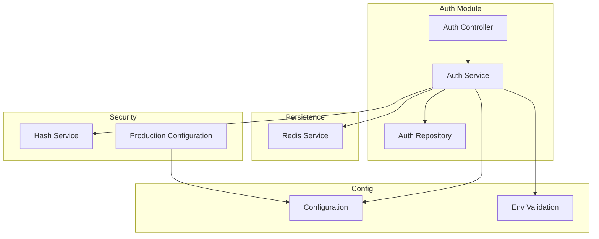
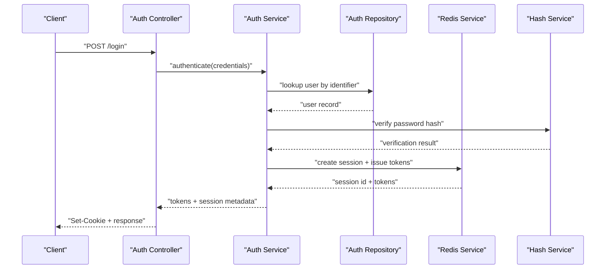
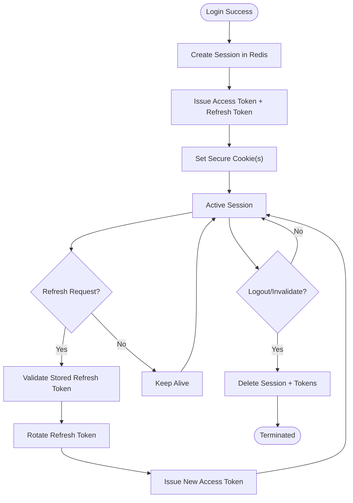
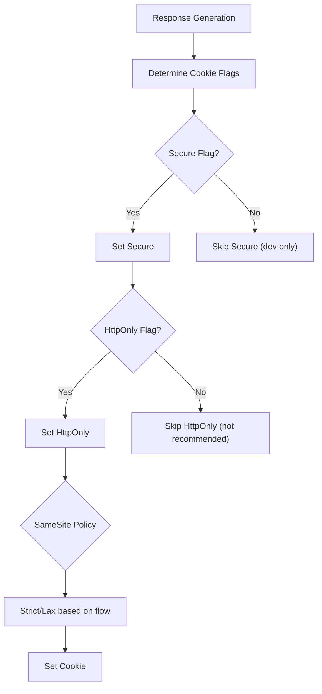
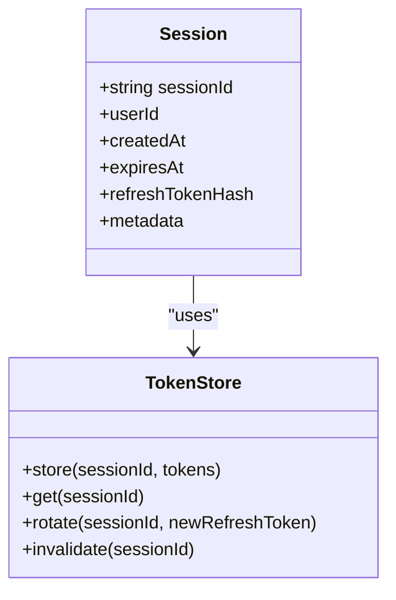
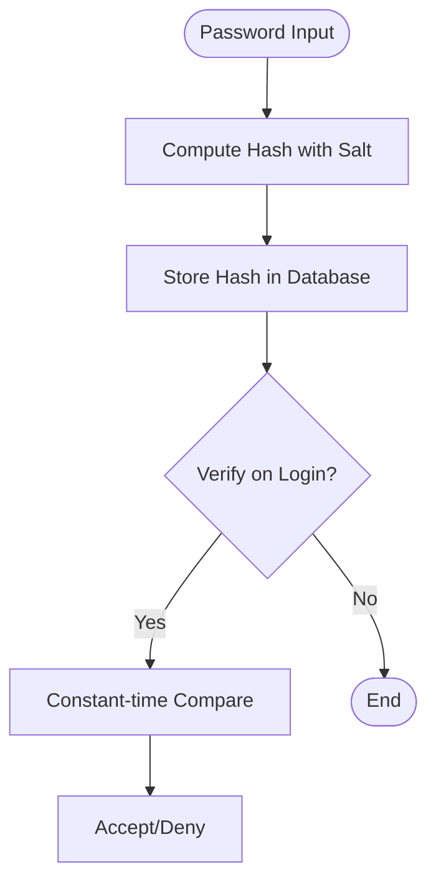
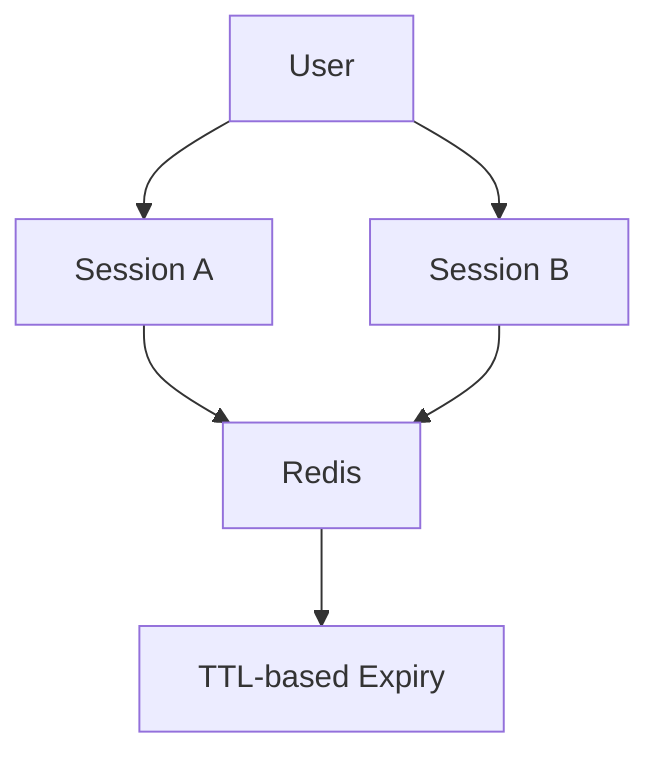
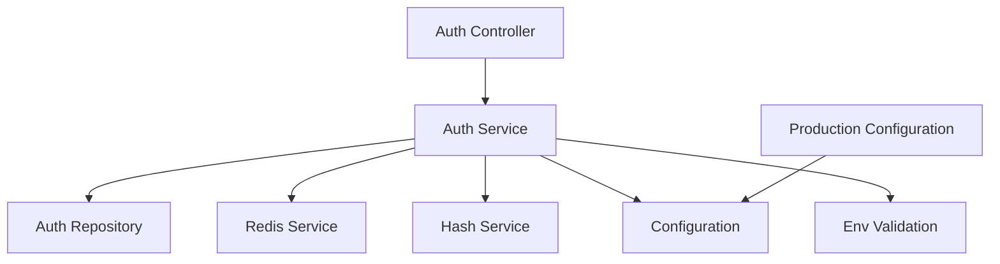

# Session Management & Security

<cite>
**Referenced Files in This Document**
- [auth.module.ts](file://apps/backend/src/auth/auth.module.ts)
- [auth.service.ts](file://apps/backend/src/auth/auth.service.ts)
- [auth.controller.ts](file://apps/backend/src/auth/auth.controller.ts)
- [auth.repository.ts](file://apps/backend/src/auth/auth.repository.ts)
- [configuration.ts](file://apps/backend/src/config/configuration.ts)
- [env.validation.ts](file://apps/backend/src/config/env.validation.ts)
- [redis.service.ts](file://apps/backend/src/redis/redis.service.ts)
- [core.hash.service.ts](file://apps/backend/src/core/hash/hash.service.ts)
- [production-configuration.service.ts](file://apps/backend/src/deployment/production-configuration.service.ts)
- [SECURITY.md](file://docs/SECURITY.md)
</cite>

## Table of Contents
1. [Introduction](#introduction)
2. [Project Structure](#project-structure)
3. [Core Components](#core-components)
4. [Architecture Overview](#architecture-overview)
5. [Detailed Component Analysis](#detailed-component-analysis)
6. [Dependency Analysis](#dependency-analysis)
7. [Performance Considerations](#performance-considerations)
8. [Troubleshooting Guide](#troubleshooting-guide)
9. [Conclusion](#conclusion)
10. [Appendices](#appendices)

## Introduction
This document explains the session management and security features implemented in the backend, focusing on:
- Session lifecycle management (creation, refresh, rotation, and termination)
- Cookie handling strategies for secure transport and storage
- Secure token storage and rotation mechanisms
- Password hashing implementation and validation rules
- Session persistence and concurrent session handling
- Production security best practices and configuration guidance

The goal is to provide both a high-level understanding and actionable details for developers and operators deploying this system securely.

## Project Structure
Session and security functionality is primarily located under the auth module, with supporting services for configuration, Redis-backed state, and hashing utilities. Key areas include:
- Authentication controllers and services that orchestrate login, token issuance, and session operations
- Configuration modules that enforce environment-based security settings
- Redis service used for session/state persistence where applicable
- Hashing utilities for password processing
- Deployment and production hardening services

**Diagram sources**
- [auth.controller.ts](file://apps/backend/src/auth/auth.controller.ts)
- [auth.service.ts](file://apps/backend/src/auth/auth.service.ts)
- [auth.repository.ts](file://apps/backend/src/auth/auth.repository.ts)
- [configuration.ts](file://apps/backend/src/config/configuration.ts)
- [env.validation.ts](file://apps/backend/src/config/env.validation.ts)
- [redis.service.ts](file://apps/backend/src/redis/redis.service.ts)
- [core.hash.service.ts](file://apps/backend/src/core/hash/hash.service.ts)
- [production-configuration.service.ts](file://apps/backend/src/deployment/production-configuration.service.ts)

**Section sources**
- [auth.module.ts](file://apps/backend/src/auth/auth.module.ts)
- [auth.controller.ts](file://apps/backend/src/auth/auth.controller.ts)
- [auth.service.ts](file://apps/backend/src/auth/auth.service.ts)
- [auth.repository.ts](file://apps/backend/src/auth/auth.repository.ts)
- [configuration.ts](file://apps/backend/src/config/configuration.ts)
- [env.validation.ts](file://apps/backend/src/config/env.validation.ts)
- [redis.service.ts](file://apps/backend/src/redis/redis.service.ts)
- [core.hash.service.ts](file://apps/backend/src/core/hash/hash.service.ts)
- [production-configuration.service.ts](file://apps/backend/src/deployment/production-configuration.service.ts)

## Core Components
- Auth Controller: Exposes endpoints for authentication flows, including login, token refresh, and logout/session termination. It validates requests and delegates business logic to the Auth Service.
- Auth Service: Orchestrates session creation, token issuance, refresh token rotation, and session invalidation. It coordinates with repositories, Redis, and hashing utilities.
- Auth Repository: Handles data access for user credentials and session-related records.
- Configuration: Centralizes environment-driven settings such as cookie flags, token lifetimes, and security policies.
- Env Validation: Enforces required environment variables and constraints at startup.
- Redis Service: Provides persistent, low-latency storage for sessions and tokens when needed.
- Hash Service: Implements secure password hashing and verification.
- Production Configuration: Applies hardened defaults and validations for production deployments.

**Section sources**
- [auth.controller.ts](file://apps/backend/src/auth/auth.controller.ts)
- [auth.service.ts](file://apps/backend/src/auth/auth.service.ts)
- [auth.repository.ts](file://apps/backend/src/auth/auth.repository.ts)
- [configuration.ts](file://apps/backend/src/config/configuration.ts)
- [env.validation.ts](file://apps/backend/src/config/env.validation.ts)
- [redis.service.ts](file://apps/backend/src/redis/redis.service.ts)
- [core.hash.service.ts](file://apps/backend/src/core/hash/hash.service.ts)
- [production-configuration.service.ts](file://apps/backend/src/deployment/production-configuration.service.ts)

## Architecture Overview
The authentication flow uses a layered approach:
- Controllers handle HTTP request/response and input validation
- Services implement business logic for session and token management
- Repositories abstract data access
- Redis provides stateful storage for sessions/tokens
- Configuration and env validation ensure secure defaults and runtime checks
- Hashing utilities protect sensitive data like passwords

**Diagram sources**
- [auth.controller.ts](file://apps/backend/src/auth/auth.controller.ts)
- [auth.service.ts](file://apps/backend/src/auth/auth.service.ts)
- [auth.repository.ts](file://apps/backend/src/auth/auth.repository.ts)
- [redis.service.ts](file://apps/backend/src/redis/redis.service.ts)
- [core.hash.service.ts](file://apps/backend/src/core/hash/hash.service.ts)

## Detailed Component Analysis

### Session Lifecycle Management
- Creation: On successful authentication, the service creates a session, stores it in Redis, and issues short-lived access tokens along with a refresh token. The refresh token is rotated on each use to mitigate replay attacks.
- Refresh: When an access token expires, the client presents the refresh token. The service validates the stored refresh token, rotates it, and issues a new access token without requiring re-authentication.
- Rotation: Each refresh triggers rotation of the refresh token value and updates the stored session state. Old tokens are invalidated immediately after rotation.
- Termination: Logout or explicit session invalidation removes the session from Redis and invalidates associated tokens.

**Diagram sources**
- [auth.service.ts](file://apps/backend/src/auth/auth.service.ts)
- [redis.service.ts](file://apps/backend/src/redis/redis.service.ts)

**Section sources**
- [auth.service.ts](file://apps/backend/src/auth/auth.service.ts)
- [redis.service.ts](file://apps/backend/src/redis/redis.service.ts)

### Cookie Handling Strategies
- Transport Security: Cookies should be set with secure flags (HTTPS-only), HttpOnly to prevent JavaScript access, and SameSite configured appropriately to mitigate CSRF risks.
- Scope and Path: Restrict cookies to necessary paths and domains to minimize exposure.
- Expiration: Use short-lived access tokens and longer-lived refresh tokens; rotate refresh tokens to limit window of compromise.
- Storage: Prefer server-side session storage (Redis) and store only opaque identifiers in cookies. Avoid storing sensitive payloads in cookies.

**Diagram sources**
- [configuration.ts](file://apps/backend/src/config/configuration.ts)
- [auth.controller.ts](file://apps/backend/src/auth/auth.controller.ts)

**Section sources**
- [configuration.ts](file://apps/backend/src/config/configuration.ts)
- [auth.controller.ts](file://apps/backend/src/auth/auth.controller.ts)

### Secure Token Storage and Rotation
- Access Tokens: Short-lived, signed tokens transmitted via headers or secure cookies; validated per request.
- Refresh Tokens: Long-lived but rotated on each use; stored server-side with cryptographic randomness and bound to session context.
- Rotation Strategy: Replace stored refresh token atomically; invalidate previous values immediately upon rotation.
- Revocation: Support immediate revocation by deleting session entries and marking tokens invalid.

**Diagram sources**
- [auth.service.ts](file://apps/backend/src/auth/auth.service.ts)
- [redis.service.ts](file://apps/backend/src/redis/redis.service.ts)

**Section sources**
- [auth.service.ts](file://apps/backend/src/auth/auth.service.ts)
- [redis.service.ts](file://apps/backend/src/redis/redis.service.ts)

### Password Hashing Implementation
- Algorithm: Use a modern, memory-hard hashing algorithm suitable for passwords.
- Parameters: Configure appropriate cost/salt parameters to balance security and performance.
- Verification: Constant-time comparison to prevent timing attacks.
- Migration: Support gradual migration to stronger parameters over time.

**Diagram sources**
- [core.hash.service.ts](file://apps/backend/src/core/hash/hash.service.ts)
- [auth.service.ts](file://apps/backend/src/auth/auth/service.ts)

**Section sources**
- [core.hash.service.ts](file://apps/backend/src/core/hash/hash.service.ts)
- [auth.service.ts](file://apps/backend/src/auth/auth.service.ts)

### Session Persistence and Concurrent Sessions
- Persistence: Sessions are persisted in Redis with TTLs aligned to expiration policies.
- Concurrency: Multiple active sessions per user are supported by associating tokens with distinct session IDs.
- Limits: Optionally enforce maximum concurrent sessions per user to reduce risk.
- Cleanup: Background jobs remove expired sessions and stale tokens.

**Diagram sources**
- [redis.service.ts](file://apps/backend/src/redis/redis.service.ts)
- [auth.service.ts](file://apps/backend/src/auth/auth.service.ts)

**Section sources**
- [redis.service.ts](file://apps/backend/src/redis/redis.service.ts)
- [auth.service.ts](file://apps/backend/src/auth/auth.service.ts)

### Security Best Practices for Production
- Enforce HTTPS everywhere; disable insecure cookie flags in production.
- Use strong, randomized secrets for signing tokens and hashing.
- Apply strict CORS policies and rate limiting.
- Monitor and alert on anomalies (failed logins, token misuse).
- Regularly rotate secrets and update hashing parameters.
- Validate all environment variables at startup and fail fast if misconfigured.

**Section sources**
- [production-configuration.service.ts](file://apps/backend/src/deployment/production-configuration.service.ts)
- [env.validation.ts](file://apps/backend/src/config/env.validation.ts)
- [SECURITY.md](file://docs/SECURITY.md)

## Dependency Analysis
The following diagram shows key dependencies between components involved in session management and security:

**Diagram sources**
- [auth.controller.ts](file://apps/backend/src/auth/auth.controller.ts)
- [auth.service.ts](file://apps/backend/src/auth/auth.service.ts)
- [auth.repository.ts](file://apps/backend/src/auth/auth.repository.ts)
- [redis.service.ts](file://apps/backend/src/redis/redis.service.ts)
- [core.hash.service.ts](file://apps/backend/src/core/hash/hash.service.ts)
- [configuration.ts](file://apps/backend/src/config/configuration.ts)
- [env.validation.ts](file://apps/backend/src/config/env.validation.ts)
- [production-configuration.service.ts](file://apps/backend/src/deployment/production-configuration.service.ts)

**Section sources**
- [auth.module.ts](file://apps/backend/src/auth/auth.module.ts)
- [auth.controller.ts](file://apps/backend/src/auth/auth.controller.ts)
- [auth.service.ts](file://apps/backend/src/auth/auth.service.ts)
- [auth.repository.ts](file://apps/backend/src/auth/auth.repository.ts)
- [redis.service.ts](file://apps/backend/src/redis/redis.service.ts)
- [core.hash.service.ts](file://apps/backend/src/core/hash/hash.service.ts)
- [configuration.ts](file://apps/backend/src/config/configuration.ts)
- [env.validation.ts](file://apps/backend/src/config/env.validation.ts)
- [production-configuration.service.ts](file://apps/backend/src/deployment/production-configuration.service.ts)

## Performance Considerations
- Minimize payload sizes: Keep cookies small and avoid storing sensitive data in them.
- Cache frequently accessed session metadata judiciously; rely on Redis for authoritative state.
- Use connection pooling for Redis and database connections.
- Implement efficient token validation with minimal overhead.
- Profile hashing costs and adjust parameters to meet latency targets while maintaining security.

[No sources needed since this section provides general guidance]

## Troubleshooting Guide
Common issues and resolutions:
- Invalid or expired refresh token: Ensure rotation occurs on every refresh and that old tokens are invalidated. Check Redis connectivity and TTL settings.
- Cookie not sent or rejected: Verify Secure, HttpOnly, and SameSite flags; confirm domain/path alignment and HTTPS usage.
- High CPU during login: Review hashing parameters; consider hardware acceleration or parameter tuning within acceptable security bounds.
- Session loss across restarts: Confirm Redis persistence configuration and backup strategy.

**Section sources**
- [auth.service.ts](file://apps/backend/src/auth/auth.service.ts)
- [redis.service.ts](file://apps/backend/src/redis/redis.service.ts)
- [configuration.ts](file://apps/backend/src/config/configuration.ts)

## Conclusion
This system implements robust session management and security controls through layered architecture, secure token handling, and hardened configuration. By adhering to the documented practices—secure cookies, token rotation, strong hashing, and production hardening—you can maintain a resilient and secure authentication experience.

[No sources needed since this section summarizes without analyzing specific files]

## Appendices

### Example Session Configuration Keys
- Cookie secure flag: Enable in production
- Cookie HttpOnly: Enable to prevent JS access
- Cookie SameSite: Strict or Lax depending on cross-site needs
- Token lifetimes: Short-lived access tokens; configurable refresh token rotation interval
- Redis TTL: Align with session expiration policy

**Section sources**
- [configuration.ts](file://apps/backend/src/config/configuration.ts)
- [env.validation.ts](file://apps/backend/src/config/env.validation.ts)

### Password Validation Rules
- Minimum length and complexity requirements
- Rejection of common/breached passwords
- Consistent error messages to avoid enumeration

**Section sources**
- [core.hash.service.ts](file://apps/backend/src/core/hash/hash.service.ts)
- [auth.service.ts](file://apps/backend/src/auth/auth.service.ts)