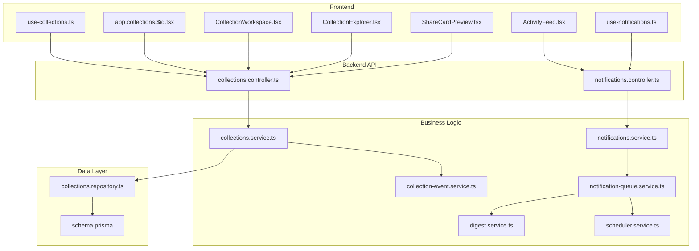
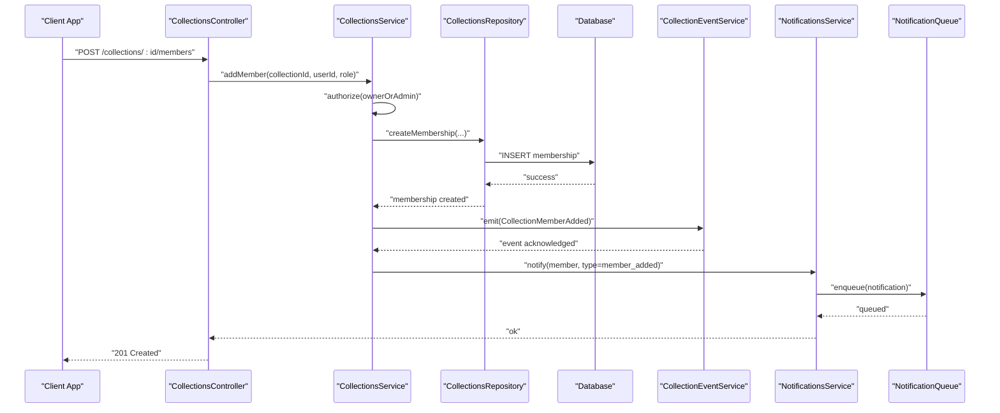
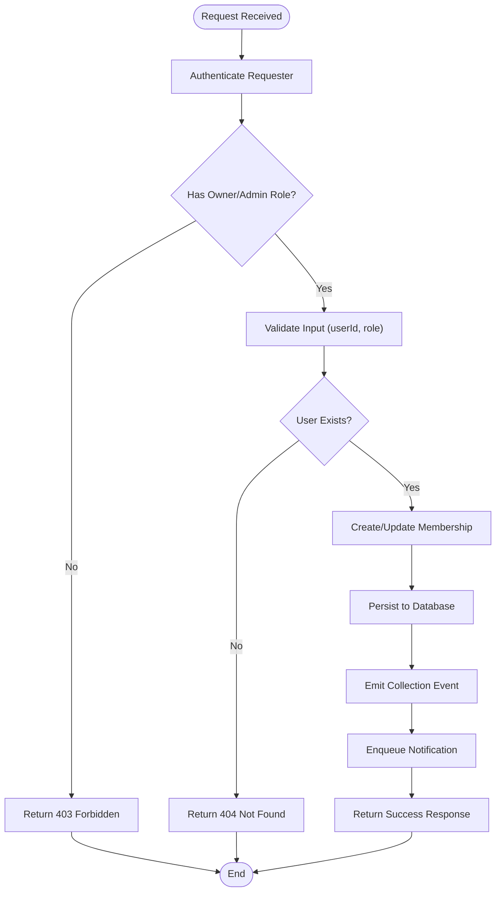
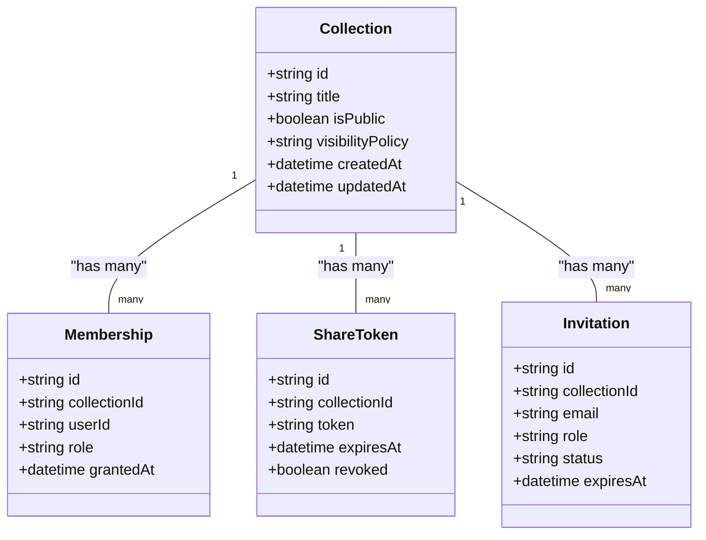
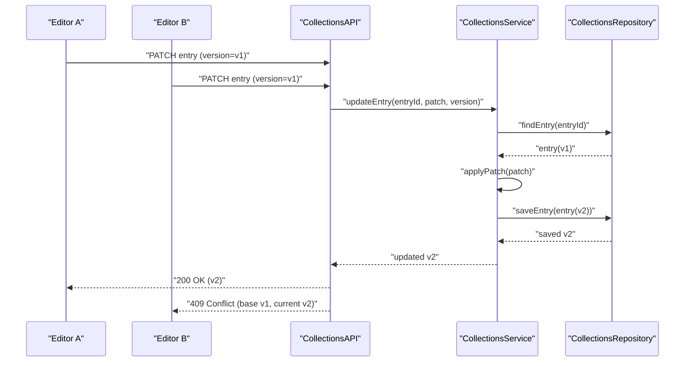
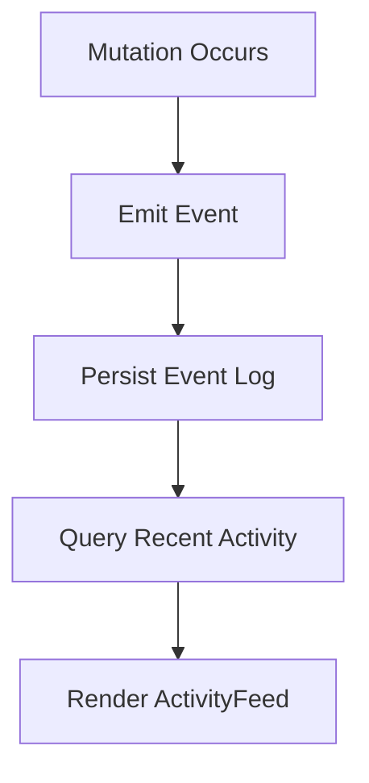
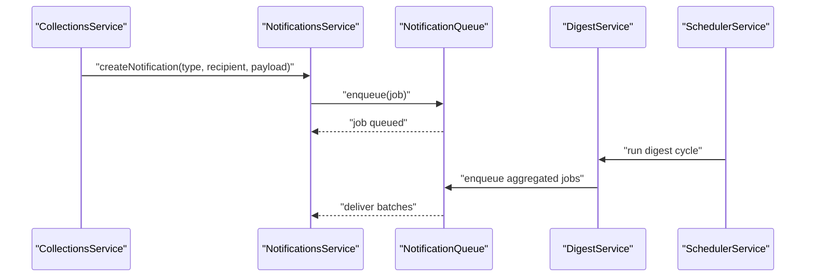
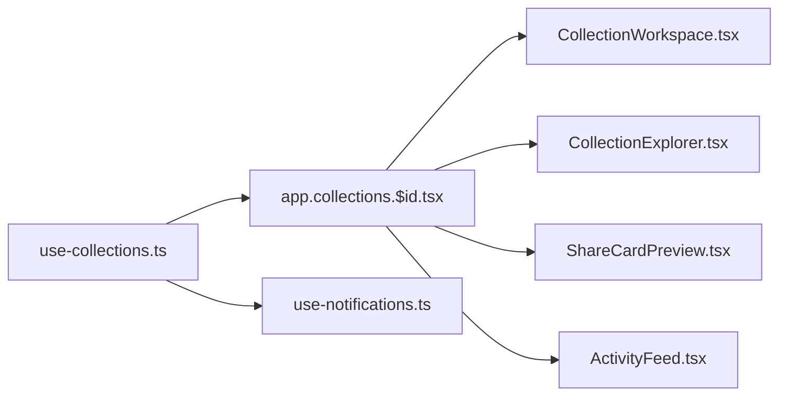
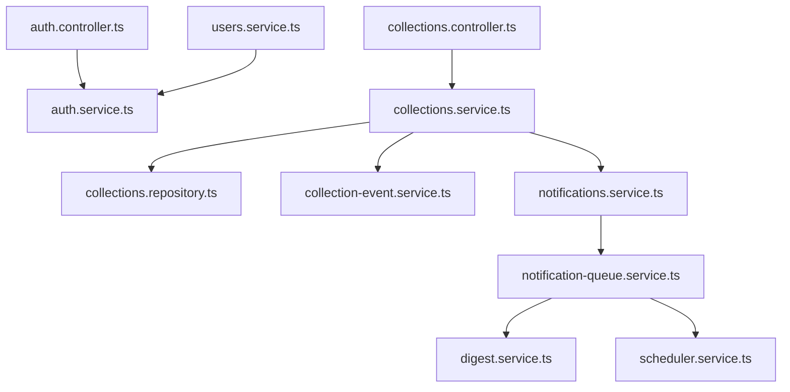

# Collaboration & Sharing

<cite>
**Referenced Files in This Document**
- [collections.controller.ts](file://apps/backend/src/collections/collections.controller.ts)
- [collections.service.ts](file://apps/backend/src/collections/collections.service.ts)
- [collections.repository.ts](file://apps/backend/src/collections/collections.repository.ts)
- [collection-event.service.ts](file://apps/backend/src/collections/collection-event.service.ts)
- [collections.module.ts](file://apps/backend/src/collections/collections.module.ts)
- [schema.prisma](file://apps/backend/src/prisma/schema.prisma)
- [notifications.controller.ts](file://apps/backend/src/notifications/notifications.controller.ts)
- [notifications.service.ts](file://apps/backend/src/notifications/notifications.service.ts)
- [notification-queue.service.ts](file://apps/backend/src/notifications/notification-queue.service.ts)
- [digest.service.ts](file://apps/backend/src/notifications/digest.service.ts)
- [scheduler.service.ts](file://apps/backend/src/notifications/scheduler.service.ts)
- [auth.controller.ts](file://apps/backend/src/auth/auth.controller.ts)
- [auth.service.ts](file://apps/backend/src/auth/auth.service.ts)
- [users.service.ts](file://apps/backend/src/users/users.service.ts)
- [use-collections.ts](file://src/hooks/use-collections.ts)
- [app.collections.$id.tsx](file://src/routes/app.collections.$id.tsx)
- [CollectionWorkspace.tsx](file://src/components/collections/CollectionWorkspace.tsx)
- [CollectionExplorer.tsx](file://src/components/collections/CollectionExplorer.tsx)
- [ShareCardPreview.tsx](file://src/components/share/ShareCardPreview.tsx)
- [ActivityFeed.tsx](file://src/components/common/ActivityFeed.tsx)
- [notifications.ts](file://src/hooks/use-notifications.ts)
</cite>

## Table of Contents
1. [Introduction](#introduction)
2. [Project Structure](#project-structure)
3. [Core Components](#core-components)
4. [Architecture Overview](#architecture-overview)
5. [Detailed Component Analysis](#detailed-component-analysis)
6. [Dependency Analysis](#dependency-analysis)
7. [Performance Considerations](#performance-considerations)
8. [Troubleshooting Guide](#troubleshooting-guide)
9. [Conclusion](#conclusion)
10. [Appendices](#appendices)

## Introduction
This document explains the collaboration and sharing features for collections, including member management, roles and permissions, access levels, public/private sharing mechanisms, collaborative editing patterns, conflict resolution strategies, activity tracking, notifications, and moderation considerations. It maps these capabilities to the backend modules (controllers, services, repositories), the notification system, and the frontend hooks and components that expose these features to users.

## Project Structure
The collaboration and sharing features span multiple layers:
- Backend API layer: controllers handle HTTP endpoints for collection operations and notifications.
- Business logic: services implement authorization checks, permission enforcement, event emission, and integration with storage/search.
- Data persistence: repository and Prisma schema define entities such as collections, members, roles, and events.
- Notifications: queue-based processing, digests, and scheduling support real-time and batched updates.
- Frontend: React hooks and components provide UI for managing collaborators, viewing activity, and sharing collections.

**Diagram sources**
- [collections.controller.ts](file://apps/backend/src/collections/collections.controller.ts)
- [collections.service.ts](file://apps/backend/src/collections/collections.service.ts)
- [collections.repository.ts](file://apps/backend/src/collections/collections.repository.ts)
- [collection-event.service.ts](file://apps/backend/src/collections/collection-event.service.ts)
- [notifications.controller.ts](file://apps/backend/src/notifications/notifications.controller.ts)
- [notifications.service.ts](file://apps/backend/src/notifications/notifications.service.ts)
- [notification-queue.service.ts](file://apps/backend/src/notifications/notification-queue.service.ts)
- [digest.service.ts](file://apps/backend/src/notifications/digest.service.ts)
- [scheduler.service.ts](file://apps/backend/src/notifications/scheduler.service.ts)
- [schema.prisma](file://apps/backend/src/prisma/schema.prisma)
- [use-collections.ts](file://src/hooks/use-collections.ts)
- [app.collections.$id.tsx](file://src/routes/app.collections.$id.tsx)
- [CollectionWorkspace.tsx](file://src/components/collections/CollectionWorkspace.tsx)
- [CollectionExplorer.tsx](file://src/components/collections/CollectionExplorer.tsx)
- [ShareCardPreview.tsx](file://src/components/share/ShareCardPreview.tsx)
- [ActivityFeed.tsx](file://src/components/common/ActivityFeed.tsx)
- [notifications.ts](file://src/hooks/use-notifications.ts)

**Section sources**
- [collections.controller.ts](file://apps/backend/src/collections/collections.controller.ts)
- [collections.service.ts](file://apps/backend/src/collections/collections.service.ts)
- [collections.repository.ts](file://apps/backend/src/collections/collections.repository.ts)
- [collection-event.service.ts](file://apps/backend/src/collections/collection-event.service.ts)
- [notifications.controller.ts](file://apps/backend/src/notifications/notifications.controller.ts)
- [notifications.service.ts](file://apps/backend/src/notifications/notifications.service.ts)
- [notification-queue.service.ts](file://apps/backend/src/notifications/notification-queue.service.ts)
- [digest.service.ts](file://apps/backend/src/notifications/digest.service.ts)
- [scheduler.service.ts](file://apps/backend/src/notifications/scheduler.service.ts)
- [schema.prisma](file://apps/backend/src/prisma/schema.prisma)
- [use-collections.ts](file://src/hooks/use-collections.ts)
- [app.collections.$id.tsx](file://src/routes/app.collections.$id.tsx)
- [CollectionWorkspace.tsx](file://src/components/collections/CollectionWorkspace.tsx)
- [CollectionExplorer.tsx](file://src/components/collections/CollectionExplorer.tsx)
- [ShareCardPreview.tsx](file://src/components/share/ShareCardPreview.tsx)
- [ActivityFeed.tsx](file://src/components/common/ActivityFeed.tsx)
- [notifications.ts](file://src/hooks/use-notifications.ts)

## Core Components
- Collections API: Endpoints for creating, updating, listing, and accessing collections; includes membership and role management.
- Collection Events: Domain events emitted on changes to support audit trails and downstream integrations.
- Notifications: Queued delivery of change, comment, and mention notifications with digesting and scheduling.
- Frontend Hooks and Pages: React hooks abstract API calls; routes and components render collaboration UIs.

Key responsibilities:
- Authorization and role checks are enforced at service level before data mutations.
- Event-driven architecture decouples side effects like notifications and analytics.
- Queue-based notifications ensure reliability and scalability.

**Section sources**
- [collections.controller.ts](file://apps/backend/src/collections/collections.controller.ts)
- [collections.service.ts](file://apps/backend/src/collections/collections.service.ts)
- [collection-event.service.ts](file://apps/backend/src/collections/collection-event.service.ts)
- [notifications.controller.ts](file://apps/backend/src/notifications/notifications.controller.ts)
- [notifications.service.ts](file://apps/backend/src/notifications/notifications.service.ts)
- [notification-queue.service.ts](file://apps/backend/src/notifications/notification-queue.service.ts)
- [digest.service.ts](file://apps/backend/src/notifications/digest.service.ts)
- [scheduler.service.ts](file://apps/backend/src/notifications/scheduler.service.ts)
- [use-collections.ts](file://src/hooks/use-collections.ts)
- [app.collections.$id.tsx](file://src/routes/app.collections.$id.tsx)

## Architecture Overview
Collaboration flows involve authenticated requests validated by guards, routed to controllers, processed by services with permission checks, persisted via repositories, and emitting events that trigger notifications.

**Diagram sources**
- [collections.controller.ts](file://apps/backend/src/collections/collections.controller.ts)
- [collections.service.ts](file://apps/backend/src/collections/collections.service.ts)
- [collections.repository.ts](file://apps/backend/src/collections/collections.repository.ts)
- [collection-event.service.ts](file://apps/backend/src/collections/collection-event.service.ts)
- [notifications.service.ts](file://apps/backend/src/notifications/notifications.service.ts)
- [notification-queue.service.ts](file://apps/backend/src/notifications/notification-queue.service.ts)

## Detailed Component Analysis

### Member Management and Roles
- Adding/removing collaborators is handled through dedicated endpoints that enforce ownership or admin privileges.
- Roles determine read/write capabilities and administrative actions within a collection.
- Access levels can be scoped per collection, enabling fine-grained control over who can view or edit content.

Operational flow:
- Validate requester identity and current role.
- Check target user existence and existing memberships.
- Create or revoke memberships with appropriate role assignment.
- Emit domain events and enqueue notifications for affected users.

**Diagram sources**
- [collections.controller.ts](file://apps/backend/src/collections/collections.controller.ts)
- [collections.service.ts](file://apps/backend/src/collections/collections.service.ts)
- [collections.repository.ts](file://apps/backend/src/collections/collections.repository.ts)
- [collection-event.service.ts](file://apps/backend/src/collections/collection-event.service.ts)
- [notifications.service.ts](file://apps/backend/src/notifications/notifications.service.ts)

**Section sources**
- [collections.controller.ts](file://apps/backend/src/collections/collections.controller.ts)
- [collections.service.ts](file://apps/backend/src/collections/collections.service.ts)
- [collections.repository.ts](file://apps/backend/src/collections/collections.repository.ts)
- [collection-event.service.ts](file://apps/backend/src/collections/collection-event.service.ts)
- [notifications.service.ts](file://apps/backend/src/notifications/notifications.service.ts)

### Sharing Mechanisms: Public, Private Links, Invitations
- Public collections: Allow anonymous or authenticated viewers based on configuration.
- Private links: Generate time-bound or scope-limited tokens for secure sharing without full membership.
- Invitation system: Send invitations via email or platform messages; recipients accept to become members with assigned roles.

Implementation highlights:
- Token generation and validation for private links.
- Invitation lifecycle: create, send, accept/reject, expire.
- Visibility controls integrated into collection metadata and access checks.

**Diagram sources**
- [schema.prisma](file://apps/backend/src/prisma/schema.prisma)

**Section sources**
- [schema.prisma](file://apps/backend/src/prisma/schema.prisma)
- [collections.service.ts](file://apps/backend/src/collections/collections.service.ts)
- [collections.controller.ts](file://apps/backend/src/collections/collections.controller.ts)

### Collaborative Editing and Conflict Resolution
- Concurrent edits are supported by optimistic updates on the client and server-side conflict detection.
- Conflict resolution strategies include last-write-wins with versioning or merge semantics for structured content.
- Activity tracking records who changed what and when, enabling rollback and auditability.

Recommended approach:
- Maintain versioned entries with authorship metadata.
- On write, validate against expected version; if mismatch, return conflict payload with base state.
- Client merges changes or prompts user to resolve conflicts.

**Diagram sources**
- [collections.controller.ts](file://apps/backend/src/collections/collections.controller.ts)
- [collections.service.ts](file://apps/backend/src/collections/collections.service.ts)
- [collections.repository.ts](file://apps/backend/src/collections/collections.repository.ts)

**Section sources**
- [collections.controller.ts](file://apps/backend/src/collections/collections.controller.ts)
- [collections.service.ts](file://apps/backend/src/collections/collections.service.ts)
- [collections.repository.ts](file://apps/backend/src/collections/collections.repository.ts)

### Activity Tracking
- All significant mutations emit events captured by the event service and stored for querying.
- Frontend displays an activity feed showing recent changes, comments, and mentions.
- Filters allow narrowing by user, action type, or time range.

**Diagram sources**
- [collection-event.service.ts](file://apps/backend/src/collections/collection-event.service.ts)
- [ActivityFeed.tsx](file://src/components/common/ActivityFeed.tsx)

**Section sources**
- [collection-event.service.ts](file://apps/backend/src/collections/collection-event.service.ts)
- [ActivityFeed.tsx](file://src/components/common/ActivityFeed.tsx)

### Notification System: Changes, Comments, Mentions
- Notifications are enqueued for asynchronous delivery, supporting in-app, email, and push channels.
- Digests aggregate notifications to reduce noise; schedulers manage periodic processing.
- Mention handling triggers targeted notifications to mentioned users.

**Diagram sources**
- [notifications.service.ts](file://apps/backend/src/notifications/notifications.service.ts)
- [notification-queue.service.ts](file://apps/backend/src/notifications/notification-queue.service.ts)
- [digest.service.ts](file://apps/backend/src/notifications/digest.service.ts)
- [scheduler.service.ts](file://apps/backend/src/notifications/scheduler.service.ts)

**Section sources**
- [notifications.controller.ts](file://apps/backend/src/notifications/notifications.controller.ts)
- [notifications.service.ts](file://apps/backend/src/notifications/notifications.service.ts)
- [notification-queue.service.ts](file://apps/backend/src/notifications/notification-queue.service.ts)
- [digest.service.ts](file://apps/backend/src/notifications/digest.service.ts)
- [scheduler.service.ts](file://apps/backend/src/notifications/scheduler.service.ts)

### Frontend Integration: Hooks, Routes, and Components
- use-collections.ts provides methods to fetch, update, and manage collections and memberships.
- app.collections.$id.tsx renders the collection page with collaboration features.
- CollectionWorkspace.tsx enables editing and collaboration workflows.
- CollectionExplorer.tsx supports discovery and sharing of collections.
- ShareCardPreview.tsx previews shareable cards for public or private links.
- ActivityFeed.tsx shows recent collaboration activity.
- use-notifications.ts manages fetching and displaying notifications.

**Diagram sources**
- [use-collections.ts](file://src/hooks/use-collections.ts)
- [app.collections.$id.tsx](file://src/routes/app.collections.$id.tsx)
- [CollectionWorkspace.tsx](file://src/components/collections/CollectionWorkspace.tsx)
- [CollectionExplorer.tsx](file://src/components/collections/CollectionExplorer.tsx)
- [ShareCardPreview.tsx](file://src/components/share/ShareCardPreview.tsx)
- [ActivityFeed.tsx](file://src/components/common/ActivityFeed.tsx)
- [notifications.ts](file://src/hooks/use-notifications.ts)

**Section sources**
- [use-collections.ts](file://src/hooks/use-collections.ts)
- [app.collections.$id.tsx](file://src/routes/app.collections.$id.tsx)
- [CollectionWorkspace.tsx](file://src/components/collections/CollectionWorkspace.tsx)
- [CollectionExplorer.tsx](file://src/components/collections/CollectionExplorer.tsx)
- [ShareCardPreview.tsx](file://src/components/share/ShareCardPreview.tsx)
- [ActivityFeed.tsx](file://src/components/common/ActivityFeed.tsx)
- [notifications.ts](file://src/hooks/use-notifications.ts)

## Dependency Analysis
The collaboration feature depends on authentication, user management, and the notification subsystem. Controllers orchestrate services; services coordinate repositories and event/notification pipelines.

**Diagram sources**
- [auth.controller.ts](file://apps/backend/src/auth/auth.controller.ts)
- [auth.service.ts](file://apps/backend/src/auth/auth.service.ts)
- [users.service.ts](file://apps/backend/src/users/users.service.ts)
- [collections.controller.ts](file://apps/backend/src/collections/collections.controller.ts)
- [collections.service.ts](file://apps/backend/src/collections/collections.service.ts)
- [collections.repository.ts](file://apps/backend/src/collections/collections.repository.ts)
- [collection-event.service.ts](file://apps/backend/src/collections/collection-event.service.ts)
- [notifications.service.ts](file://apps/backend/src/notifications/notifications.service.ts)
- [notification-queue.service.ts](file://apps/backend/src/notifications/notification-queue.service.ts)
- [digest.service.ts](file://apps/backend/src/notifications/digest.service.ts)
- [scheduler.service.ts](file://apps/backend/src/notifications/scheduler.service.ts)

**Section sources**
- [auth.controller.ts](file://apps/backend/src/auth/auth.controller.ts)
- [auth.service.ts](file://apps/backend/src/auth/auth.service.ts)
- [users.service.ts](file://apps/backend/src/users/users.service.ts)
- [collections.controller.ts](file://apps/backend/src/collections/collections.controller.ts)
- [collections.service.ts](file://apps/backend/src/collections/collections.service.ts)
- [collections.repository.ts](file://apps/backend/src/collections/collections.repository.ts)
- [collection-event.service.ts](file://apps/backend/src/collections/collection-event.service.ts)
- [notifications.service.ts](file://apps/backend/src/notifications/notifications.service.ts)
- [notification-queue.service.ts](file://apps/backend/src/notifications/notification-queue.service.ts)
- [digest.service.ts](file://apps/backend/src/notifications/digest.service.ts)
- [scheduler.service.ts](file://apps/backend/src/notifications/scheduler.service.ts)

## Performance Considerations
- Use pagination and filtering for large activity feeds and membership lists.
- Cache frequently accessed collection metadata and permissions where safe.
- Batch notifications using digests to reduce I/O and network overhead.
- Employ optimistic UI updates to improve perceived responsiveness during collaborative edits.
- Monitor queue backlogs and adjust worker concurrency accordingly.

[No sources needed since this section provides general guidance]

## Troubleshooting Guide
Common issues and resolutions:
- Permission denied errors: Verify requester’s role and ownership; check authorization logic in services.
- Duplicate memberships: Ensure idempotency checks before creating memberships.
- Notification delays: Inspect queue health and scheduler jobs; review digest intervals.
- Conflicts during edits: Handle 409 responses and present merge options to users.
- Public link access failures: Validate token expiration and revocation status.

**Section sources**
- [collections.service.ts](file://apps/backend/src/collections/collections.service.ts)
- [notifications.service.ts](file://apps/backend/src/notifications/notifications.service.ts)
- [notification-queue.service.ts](file://apps/backend/src/notifications/notification-queue.service.ts)
- [digest.service.ts](file://apps/backend/src/notifications/digest.service.ts)
- [scheduler.service.ts](file://apps/backend/src/notifications/scheduler.service.ts)

## Conclusion
The collaboration and sharing system combines robust authorization, event-driven design, and scalable notifications to support team workflows, shared project management, and community-driven collections. By enforcing role-based permissions, providing flexible sharing mechanisms, and tracking activities with actionable notifications, the platform enables secure and efficient collaboration.

[No sources needed since this section summarizes without analyzing specific files]

## Appendices

### Team Workflows Example
- Assign roles (owner, editor, viewer) to team members.
- Use private links for temporary access during reviews.
- Track changes via activity feed and resolve conflicts collaboratively.
- Receive notifications for comments and mentions to stay synchronized.

### Shared Project Management Example
- Create a collection per project; set visibility to private.
- Invite stakeholders with appropriate roles.
- Use workspace components for concurrent editing and versioning.
- Monitor progress through activity and notifications.

### Community-Driven Collections Example
- Publish collections publicly with curated moderation policies.
- Accept contributions via invitations or public submission workflows.
- Moderate content using role-based controls and audit logs.

### Security and Privacy Controls
- Enforce strict role checks for all mutations.
- Limit public exposure to read-only unless explicitly allowed.
- Rotate and revoke private links promptly after use.
- Audit membership changes and sensitive operations.

### Moderation Features for Public Collections
- Implement reporting and flagging workflows.
- Provide tools for owners to review and remove inappropriate content.
- Maintain logs for accountability and compliance.

[No sources needed since this section provides general guidance]