# Collection Analytics & Insights

<cite>
**Referenced Files in This Document**
- [analytics.controller.ts](file://apps/backend/src/analytics/analytics.controller.ts)
- [analytics.service.ts](file://apps/backend/src/analytics/analytics.service.ts)
- [analytics-aggregation.service.ts](file://apps/backend/src/analytics/analytics-aggregation.service.ts)
- [analytics.repository.ts](file://apps/backend/src/analytics/analytics.repository.ts)
- [dashboard.service.ts](file://apps/backend/src/analytics/dashboard.service.ts)
- [insights.service.ts](file://apps/backend/src/analytics/insights.service.ts)
- [streak.service.ts](file://apps/backend/src/analytics/streak.service.ts)
- [collection-statistics.service.ts](file://apps/backend/src/collections/collection-statistics.service.ts)
- [progress-calculation.service.ts](file://apps/backend/src/progress/progress-calculation.service.ts)
- [library-statistics.service.ts](file://apps/backend/src/library/library-statistics.service.ts)
- [search-statistics.service.ts](file://apps/backend/src/search/search-statistics.service.ts)
- [wrapped-generator.service.ts](file://apps/backend/src/wrapped/wrapped-generator.service.ts)
- [wrapped-insights.service.ts](file://apps/backend/src/wrapped/wrapped-insights.service.ts)
- [AnalyticsKit.tsx](file://src/components/analytics/AnalyticsKit.tsx)
- [ChartStory.tsx](file://src/components/analytics/ChartStory.tsx)
- [MediaConstellation.tsx](file://src/components/analytics/MediaConstellation.tsx)
- [CollectionInsights.tsx](file://src/components/collections/CollectionInsights.tsx)
- [CollectionStatistics.tsx](file://src/components/collections/CollectionStatistics.tsx)
- [MemoryStreaks.tsx](file://src/components/calendar/MemoryStreaks.tsx)
- [MediaHeatmap.tsx](file://src/components/calendar/MediaHeatmap.tsx)
- [YearOverview.tsx](file://src/components/calendar/YearOverview.tsx)
- [InsightCard.tsx](file://src/components/intelligence/InsightCard.tsx)
- [MediaEvolution.tsx](file://src/components/intelligence/MediaEvolution.tsx)
- [use-analytics.ts](file://src/hooks/use-analytics.ts)
- [analytics.ts](file://src/lib/analytics.ts)
- [analytics-tracker.ts](file://src/lib/analytics-tracker.ts)
- [collectionInsights.ts](file://src/lib/collectionInsights.ts)
- [memoryInsights.ts](file://src/lib/memoryInsights.ts)
</cite>

## Table of Contents
1. [Introduction](#introduction)
2. [Project Structure](#project-structure)
3. [Core Components](#core-components)
4. [Architecture Overview](#architecture-overview)
5. [Detailed Component Analysis](#detailed-component-analysis)
6. [Dependency Analysis](#dependency-analysis)
7. [Performance Considerations](#performance-considerations)
8. [Troubleshooting Guide](#troubleshooting-guide)
9. [Conclusion](#conclusion)
10. [Appendices](#appendices)

## Introduction
This document explains the collection analytics and insights generation system. It covers statistical calculations (completion rates, time tracking, engagement metrics), insight algorithms (consumption patterns, emotional journeys, personal growth indicators), visualization components (charts, graphs, progress indicators), report generation and export capabilities, and integration with dashboard displays. It also includes examples of meaningful insights such as “Most Productive Months,” “Genre Evolution,” and “Completion Streaks,” along with data aggregation strategies and performance optimization techniques for large datasets.

## Project Structure
The analytics subsystem spans backend services, repositories, controllers, and frontend components:
- Backend analytics module provides APIs, aggregation logic, dashboard data, and insight generation.
- Collections and library modules contribute statistics and progress calculations.
- Wrapped module generates periodic reports and shareable summaries.
- Frontend components render charts, heatmaps, streaks, and insight cards.
- Hooks and utilities handle client-side analytics tracking and local computations.

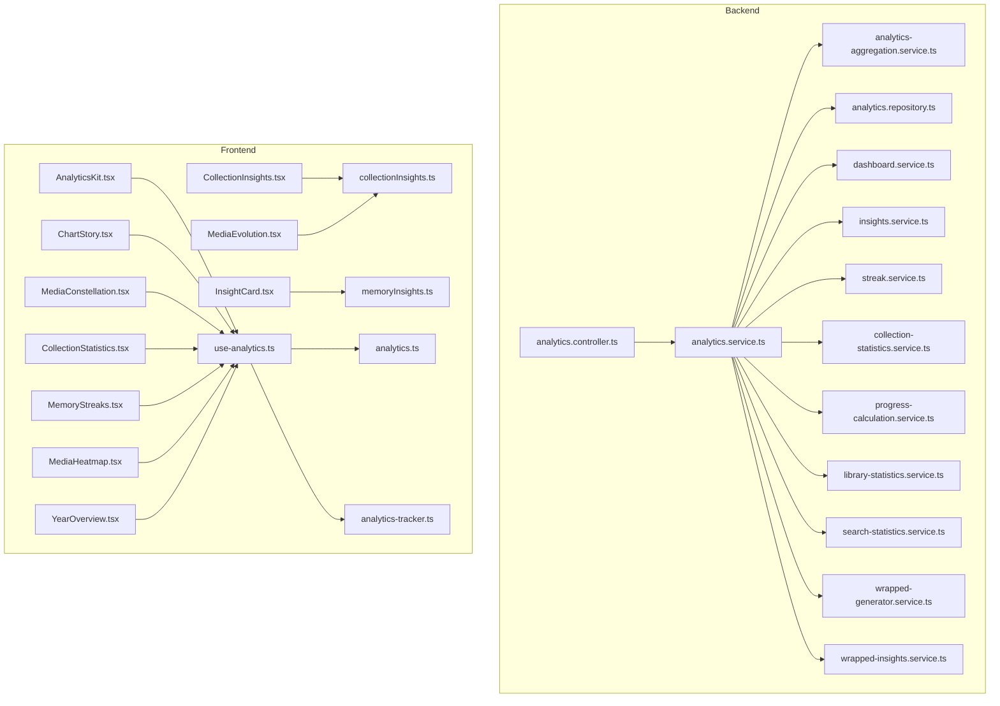

**Diagram sources**
- [analytics.controller.ts](file://apps/backend/src/analytics/analytics.controller.ts)
- [analytics.service.ts](file://apps/backend/src/analytics/analytics.service.ts)
- [analytics-aggregation.service.ts](file://apps/backend/src/analytics/analytics-aggregation.service.ts)
- [analytics.repository.ts](file://apps/backend/src/analytics/analytics.repository.ts)
- [dashboard.service.ts](file://apps/backend/src/analytics/dashboard.service.ts)
- [insights.service.ts](file://apps/backend/src/analytics/insights.service.ts)
- [streak.service.ts](file://apps/backend/src/analytics/streak.service.ts)
- [collection-statistics.service.ts](file://apps/backend/src/collections/collection-statistics.service.ts)
- [progress-calculation.service.ts](file://apps/backend/src/progress/progress-calculation.service.ts)
- [library-statistics.service.ts](file://apps/backend/src/library/library-statistics.service.ts)
- [search-statistics.service.ts](file://apps/backend/src/search/search-statistics.service.ts)
- [wrapped-generator.service.ts](file://apps/backend/src/wrapped/wrapped-generator.service.ts)
- [wrapped-insights.service.ts](file://apps/backend/src/wrapped/wrapped-insights.service.ts)
- [AnalyticsKit.tsx](file://src/components/analytics/AnalyticsKit.tsx)
- [ChartStory.tsx](file://src/components/analytics/ChartStory.tsx)
- [MediaConstellation.tsx](file://src/components/analytics/MediaConstellation.tsx)
- [CollectionInsights.tsx](file://src/components/collections/CollectionInsights.tsx)
- [CollectionStatistics.tsx](file://src/components/collections/CollectionStatistics.tsx)
- [MemoryStreaks.tsx](file://src/components/calendar/MemoryStreaks.tsx)
- [MediaHeatmap.tsx](file://src/components/calendar/MediaHeatmap.tsx)
- [YearOverview.tsx](file://src/components/calendar/YearOverview.tsx)
- [InsightCard.tsx](file://src/components/intelligence/InsightCard.tsx)
- [MediaEvolution.tsx](file://src/components/intelligence/MediaEvolution.tsx)
- [use-analytics.ts](file://src/hooks/use-analytics.ts)
- [analytics.ts](file://src/lib/analytics.ts)
- [analytics-tracker.ts](file://src/lib/analytics-tracker.ts)
- [collectionInsights.ts](file://src/lib/collectionInsights.ts)
- [memoryInsights.ts](file://src/lib/memoryInsights.ts)

**Section sources**
- [analytics.controller.ts](file://apps/backend/src/analytics/analytics.controller.ts)
- [analytics.service.ts](file://apps/backend/src/analytics/analytics.service.ts)
- [analytics-aggregation.service.ts](file://apps/backend/src/analytics/analytics-aggregation.service.ts)
- [analytics.repository.ts](file://apps/backend/src/analytics/analytics.repository.ts)
- [dashboard.service.ts](file://apps/backend/src/analytics/dashboard.service.ts)
- [insights.service.ts](file://apps/backend/src/analytics/insights.service.ts)
- [streak.service.ts](file://apps/backend/src/analytics/streak.service.ts)
- [collection-statistics.service.ts](file://apps/backend/src/collections/collection-statistics.service.ts)
- [progress-calculation.service.ts](file://apps/backend/src/progress/progress-calculation.service.ts)
- [library-statistics.service.ts](file://apps/backend/src/library/library-statistics.service.ts)
- [search-statistics.service.ts](file://apps/backend/src/search/search-statistics.service.ts)
- [wrapped-generator.service.ts](file://apps/backend/src/wrapped/wrapped-generator.service.ts)
- [wrapped-insights.service.ts](file://apps/backend/src/wrapped/wrapped-insights.service.ts)
- [AnalyticsKit.tsx](file://src/components/analytics/AnalyticsKit.tsx)
- [ChartStory.tsx](file://src/components/analytics/ChartStory.tsx)
- [MediaConstellation.tsx](file://src/components/analytics/MediaConstellation.tsx)
- [CollectionInsights.tsx](file://src/components/collections/CollectionInsights.tsx)
- [CollectionStatistics.tsx](file://src/components/collections/CollectionStatistics.tsx)
- [MemoryStreaks.tsx](file://src/components/calendar/MemoryStreaks.tsx)
- [MediaHeatmap.tsx](file://src/components/calendar/MediaHeatmap.tsx)
- [YearOverview.tsx](file://src/components/calendar/YearOverview.tsx)
- [InsightCard.tsx](file://src/components/intelligence/InsightCard.tsx)
- [MediaEvolution.tsx](file://src/components/intelligence/MediaEvolution.tsx)
- [use-analytics.ts](file://src/hooks/use-analytics.ts)
- [analytics.ts](file://src/lib/analytics.ts)
- [analytics-tracker.ts](file://src/lib/analytics-tracker.ts)
- [collectionInsights.ts](file://src/lib/collectionInsights.ts)
- [memoryInsights.ts](file://src/lib/memoryInsights.ts)

## Core Components
- Analytics Controller: Exposes endpoints for dashboard, insights, streaks, and aggregated metrics.
- Analytics Service: Orchestrates aggregation, insight computation, and report generation.
- Aggregation Service: Performs efficient rollups across media, progress, and interaction events.
- Repository: Data access layer for raw event and metadata queries.
- Dashboard Service: Composes dashboard-ready payloads combining multiple metrics.
- Insights Service: Applies algorithms to derive consumption patterns, emotional journey signals, and growth indicators.
- Streak Service: Computes completion streaks and activity continuity.
- Collection Statistics Service: Provides per-collection metrics like completion rate and time-on-task.
- Progress Calculation Service: Calculates completion percentages and session durations.
- Library Statistics Service: Aggregates library-wide stats (counts by status, genres, dates).
- Search Statistics Service: Tracks search usage and discovery patterns.
- Wrapped Generator/Insights: Produces periodic summaries and shareable insights.

Key responsibilities:
- Statistical calculations: completion rates, average session duration, total hours, genre distribution, monthly counts.
- Insight algorithms: trend detection, mood/emotion mapping from journal entries or ratings, growth indicators based on reading/watching diversity.
- Visualization support: structured outputs for charts, heatmaps, timelines, and progress bars.
- Report generation: periodic summaries, export formats, and dashboard widgets.

**Section sources**
- [analytics.controller.ts](file://apps/backend/src/analytics/analytics.controller.ts)
- [analytics.service.ts](file://apps/backend/src/analytics/analytics.service.ts)
- [analytics-aggregation.service.ts](file://apps/backend/src/analytics/analytics-aggregation.service.ts)
- [analytics.repository.ts](file://apps/backend/src/analytics/analytics.repository.ts)
- [dashboard.service.ts](file://apps/backend/src/analytics/dashboard.service.ts)
- [insights.service.ts](file://apps/backend/src/analytics/insights.service.ts)
- [streak.service.ts](file://apps/backend/src/analytics/streak.service.ts)
- [collection-statistics.service.ts](file://apps/backend/src/collections/collection-statistics.service.ts)
- [progress-calculation.service.ts](file://apps/backend/src/progress/progress-calculation.service.ts)
- [library-statistics.service.ts](file://apps/backend/src/library/library-statistics.service.ts)
- [search-statistics.service.ts](file://apps/backend/src/search/search-statistics.service.ts)
- [wrapped-generator.service.ts](file://apps/backend/src/wrapped/wrapped-generator.service.ts)
- [wrapped-insights.service.ts](file://apps/backend/src/wrapped/wrapped-insights.service.ts)

## Architecture Overview
The analytics pipeline follows a layered architecture:
- Controllers receive requests and delegate to services.
- Services orchestrate business logic and call aggregation and repository layers.
- Repositories query databases for raw data.
- Frontend hooks fetch data and render via chart components.

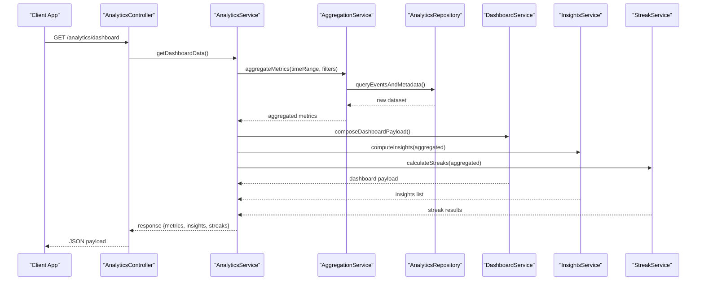

**Diagram sources**
- [analytics.controller.ts](file://apps/backend/src/analytics/analytics.controller.ts)
- [analytics.service.ts](file://apps/backend/src/analytics/analytics.service.ts)
- [analytics-aggregation.service.ts](file://apps/backend/src/analytics/analytics-aggregation.service.ts)
- [analytics.repository.ts](file://apps/backend/src/analytics/analytics.repository.ts)
- [dashboard.service.ts](file://apps/backend/src/analytics/dashboard.service.ts)
- [insights.service.ts](file://apps/backend/src/analytics/insights.service.ts)
- [streak.service.ts](file://apps/backend/src/analytics/streak.service.ts)

## Detailed Component Analysis

### Analytics Controller
- Purpose: Define API endpoints for dashboard, insights, streaks, and aggregated metrics.
- Responsibilities: Validate inputs, route to service methods, return standardized responses.
- Integration: Works with analytics service and DTOs for request/response shaping.

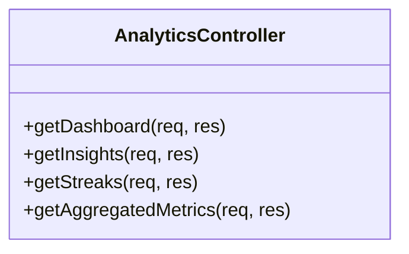

**Diagram sources**
- [analytics.controller.ts](file://apps/backend/src/analytics/analytics.controller.ts)

**Section sources**
- [analytics.controller.ts](file://apps/backend/src/analytics/analytics.controller.ts)

### Analytics Service
- Purpose: Orchestrate analytics computations and compose responses.
- Responsibilities: Call aggregation, dashboard composition, insight generation, and streak calculation; handle error cases and caching hints.
- Algorithms: Completion rate = completed items / total items; time tracking via session timestamps; engagement via frequency and recency.

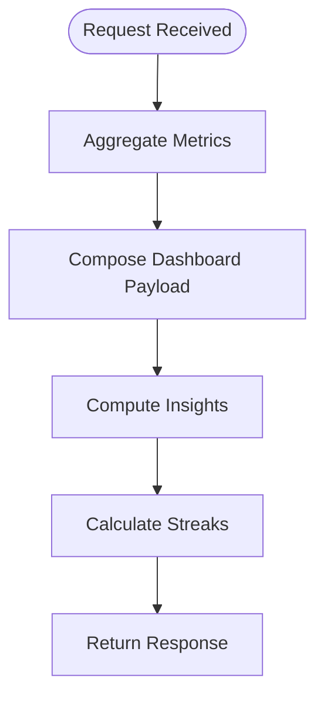

**Diagram sources**
- [analytics.service.ts](file://apps/backend/src/analytics/analytics.service.ts)
- [analytics-aggregation.service.ts](file://apps/backend/src/analytics/analytics-aggregation.service.ts)
- [dashboard.service.ts](file://apps/backend/src/analytics/dashboard.service.ts)
- [insights.service.ts](file://apps/backend/src/analytics/insights.service.ts)
- [streak.service.ts](file://apps/backend/src/analytics/streak.service.ts)

**Section sources**
- [analytics.service.ts](file://apps/backend/src/analytics/analytics.service.ts)
- [analytics-aggregation.service.ts](file://apps/backend/src/analytics/analytics-aggregation.service.ts)
- [dashboard.service.ts](file://apps/backend/src/analytics/dashboard.service.ts)
- [insights.service.ts](file://apps/backend/src/analytics/insights.service.ts)
- [streak.service.ts](file://apps/backend/src/analytics/streak.service.ts)

### Aggregation Service
- Purpose: Efficiently compute rollups over large datasets.
- Techniques: Time-bucketed aggregations, group-by operations, precomputed indexes where applicable.
- Outputs: Monthly counts, genre distributions, completion rates, average session durations.

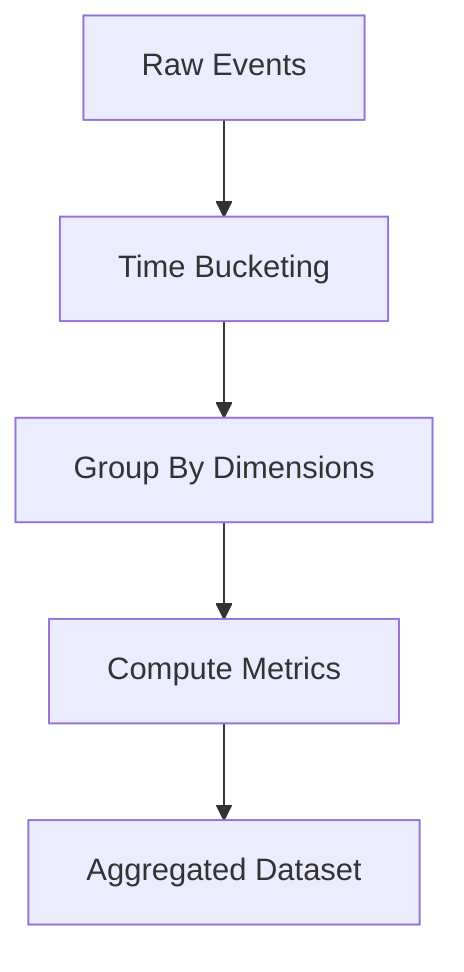

**Diagram sources**
- [analytics-aggregation.service.ts](file://apps/backend/src/analytics/analytics-aggregation.service.ts)
- [analytics.repository.ts](file://apps/backend/src/analytics/analytics.repository.ts)

**Section sources**
- [analytics-aggregation.service.ts](file://apps/backend/src/analytics/analytics-aggregation.service.ts)
- [analytics.repository.ts](file://apps/backend/src/analytics/analytics.repository.ts)

### Dashboard Service
- Purpose: Assemble dashboard-ready payloads combining multiple metrics.
- Composition: Merges library stats, collection stats, search stats, wrapped summaries, and streaks.
- Caching: Supports cache-friendly structures for frequent reads.

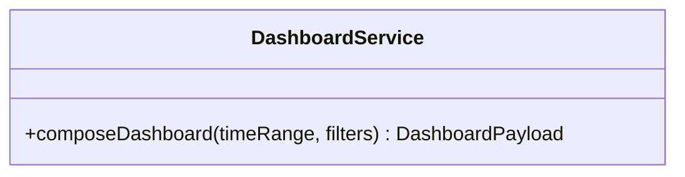

**Diagram sources**
- [dashboard.service.ts](file://apps/backend/src/analytics/dashboard.service.ts)

**Section sources**
- [dashboard.service.ts](file://apps/backend/src/analytics/dashboard.service.ts)

### Insights Service
- Purpose: Generate actionable insights from aggregated data.
- Algorithms:
  - Consumption patterns: Trend analysis, peak activity periods, genre shifts.
  - Emotional journeys: Mapping moods/emotions from journal entries or ratings to timeline segments.
  - Personal growth indicators: Diversity index, learning curve progression, consistency scores.
- Examples: “Most Productive Months,” “Genre Evolution,” “Completion Streaks.”

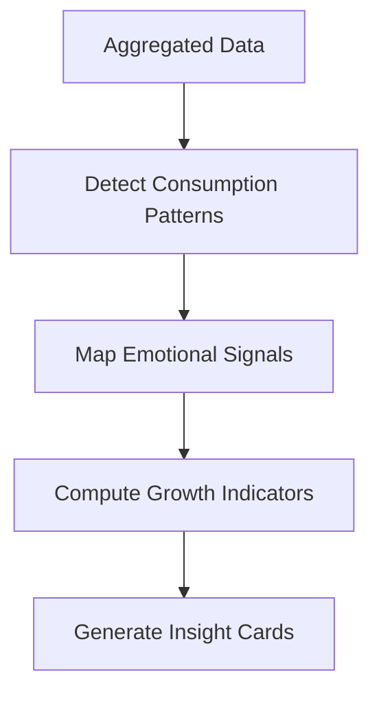

**Diagram sources**
- [insights.service.ts](file://apps/backend/src/analytics/insights.service.ts)
- [memoryInsights.ts](file://src/lib/memoryInsights.ts)
- [collectionInsights.ts](file://src/lib/collectionInsights.ts)

**Section sources**
- [insights.service.ts](file://apps/backend/src/analytics/insights.service.ts)
- [memoryInsights.ts](file://src/lib/memoryInsights.ts)
- [collectionInsights.ts](file://src/lib/collectionInsights.ts)

### Streak Service
- Purpose: Calculate completion streaks and activity continuity.
- Logic: Sequential day checks, gap handling, streak resets, longest streak tracking.
- Outputs: Current streak, longest streak, streak history.

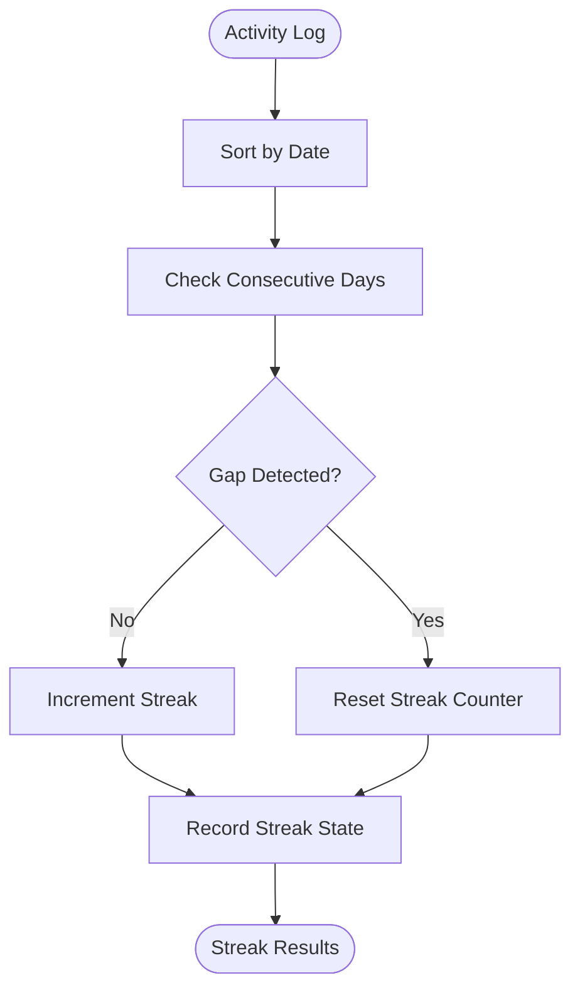

**Diagram sources**
- [streak.service.ts](file://apps/backend/src/analytics/streak.service.ts)

**Section sources**
- [streak.service.ts](file://apps/backend/src/analytics/streak.service.ts)

### Collection Statistics Service
- Purpose: Provide per-collection metrics including completion rate and time tracking.
- Metrics: Items completed, total items, average time per item, completion percentage, last active date.

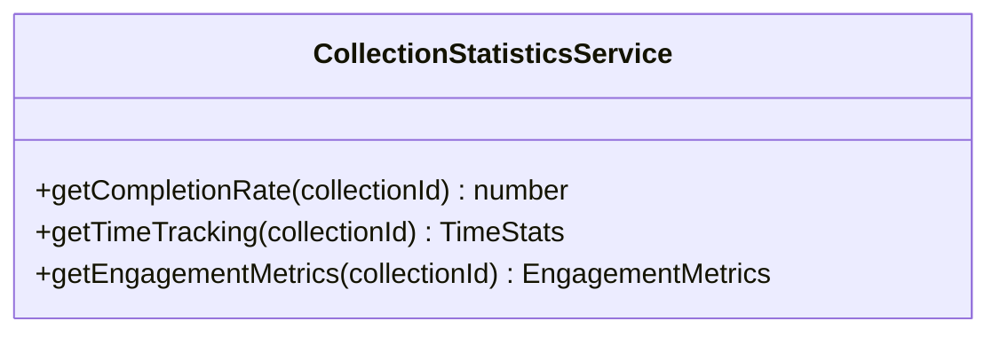

**Diagram sources**
- [collection-statistics.service.ts](file://apps/backend/src/collections/collection-statistics.service.ts)

**Section sources**
- [collection-statistics.service.ts](file://apps/backend/src/collections/collection-statistics.service.ts)

### Progress Calculation Service
- Purpose: Compute completion percentages and session durations.
- Methods: Session start/end detection, partial progress handling, weighted completion rules.

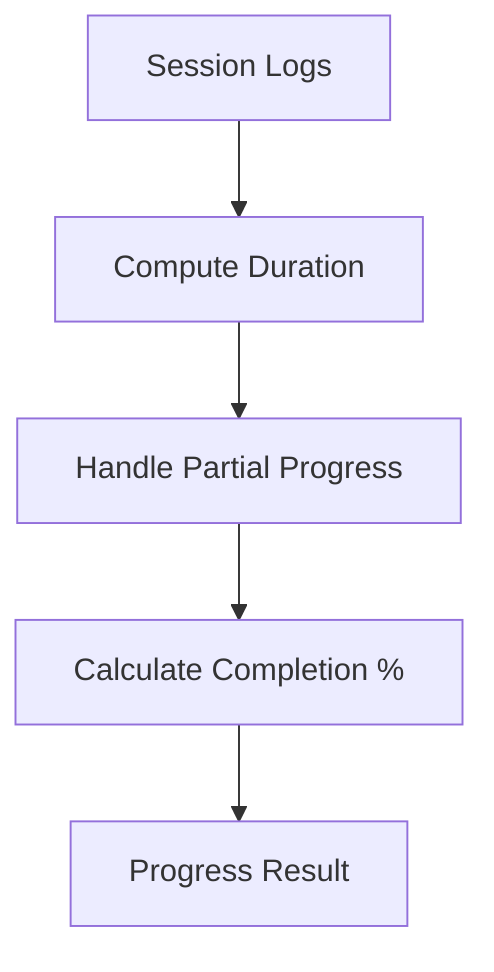

**Diagram sources**
- [progress-calculation.service.ts](file://apps/backend/src/progress/progress-calculation.service.ts)

**Section sources**
- [progress-calculation.service.ts](file://apps/backend/src/progress/progress-calculation.service.ts)

### Library Statistics Service
- Purpose: Aggregate library-wide metrics.
- Metrics: Counts by status (completed, in-progress, dropped), genre distribution, monthly trends.

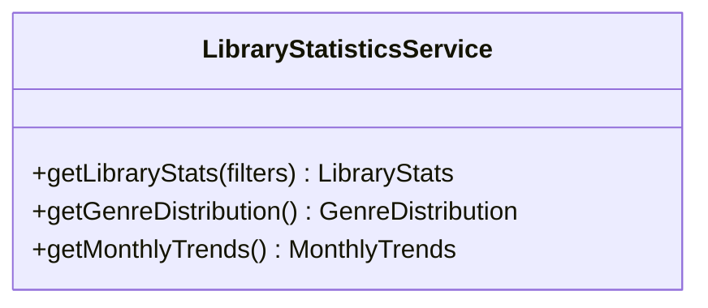

**Diagram sources**
- [library-statistics.service.ts](file://apps/backend/src/library/library-statistics.service.ts)

**Section sources**
- [library-statistics.service.ts](file://apps/backend/src/library/library-statistics.service.ts)

### Search Statistics Service
- Purpose: Track search usage and discovery patterns.
- Metrics: Query volume, popular terms, conversion to interactions.

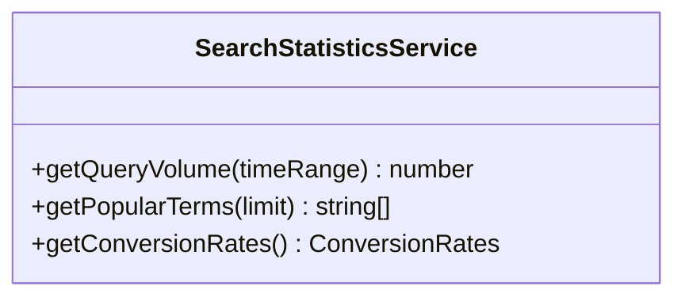

**Diagram sources**
- [search-statistics.service.ts](file://apps/backend/src/search/search-statistics.service.ts)

**Section sources**
- [search-statistics.service.ts](file://apps/backend/src/search/search-statistics.service.ts)

### Wrapped Generator and Insights
- Purpose: Produce periodic summaries and shareable insights.
- Features: Year/month summaries, top items, mood/emotion highlights, growth indicators.

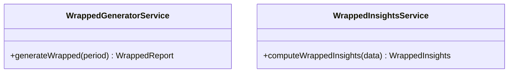

**Diagram sources**
- [wrapped-generator.service.ts](file://apps/backend/src/wrapped/wrapped-generator.service.ts)
- [wrapped-insights.service.ts](file://apps/backend/src/wrapped/wrapped-insights.service.ts)

**Section sources**
- [wrapped-generator.service.ts](file://apps/backend/src/wrapped/wrapped-generator.service.ts)
- [wrapped-insights.service.ts](file://apps/backend/src/wrapped/wrapped-insights.service.ts)

### Frontend Visualization Components
- AnalyticsKit: Centralized analytics UI container.
- ChartStory: Timeline-based storytelling with charts.
- MediaConstellation: Visual graph of media relationships and clusters.
- CollectionInsights: Per-collection insights and metrics.
- CollectionStatistics: Detailed statistics panel.
- MemoryStreaks: Streak visualization and history.
- MediaHeatmap: Heatmap of activity intensity over time.
- YearOverview: Annual summary view.
- InsightCard: Reusable card for displaying insights.
- MediaEvolution: Genre evolution and taste changes.

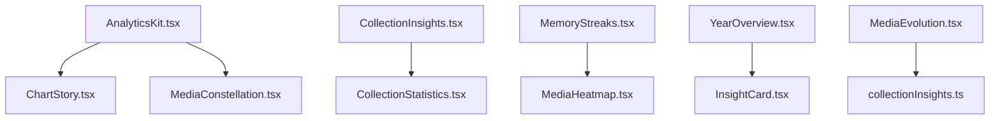

**Diagram sources**
- [AnalyticsKit.tsx](file://src/components/analytics/AnalyticsKit.tsx)
- [ChartStory.tsx](file://src/components/analytics/ChartStory.tsx)
- [MediaConstellation.tsx](file://src/components/analytics/MediaConstellation.tsx)
- [CollectionInsights.tsx](file://src/components/collections/CollectionInsights.tsx)
- [CollectionStatistics.tsx](file://src/components/collections/CollectionStatistics.tsx)
- [MemoryStreaks.tsx](file://src/components/calendar/MemoryStreaks.tsx)
- [MediaHeatmap.tsx](file://src/components/calendar/MediaHeatmap.tsx)
- [YearOverview.tsx](file://src/components/calendar/YearOverview.tsx)
- [InsightCard.tsx](file://src/components/intelligence/InsightCard.tsx)
- [MediaEvolution.tsx](file://src/components/intelligence/MediaEvolution.tsx)
- [collectionInsights.ts](file://src/lib/collectionInsights.ts)

**Section sources**
- [AnalyticsKit.tsx](file://src/components/analytics/AnalyticsKit.tsx)
- [ChartStory.tsx](file://src/components/analytics/ChartStory.tsx)
- [MediaConstellation.tsx](file://src/components/analytics/MediaConstellation.tsx)
- [CollectionInsights.tsx](file://src/components/collections/CollectionInsights.tsx)
- [CollectionStatistics.tsx](file://src/components/collections/CollectionStatistics.tsx)
- [MemoryStreaks.tsx](file://src/components/calendar/MemoryStreaks.tsx)
- [MediaHeatmap.tsx](file://src/components/calendar/MediaHeatmap.tsx)
- [YearOverview.tsx](file://src/components/calendar/YearOverview.tsx)
- [InsightCard.tsx](file://src/components/intelligence/InsightCard.tsx)
- [MediaEvolution.tsx](file://src/components/intelligence/MediaEvolution.tsx)
- [collectionInsights.ts](file://src/lib/collectionInsights.ts)

### Client-Side Analytics Hooks and Utilities
- use-analytics: Hook to fetch and manage analytics data.
- analytics: Utility functions for formatting and computing lightweight metrics.
- analytics-tracker: Client-side event tracking and logging.

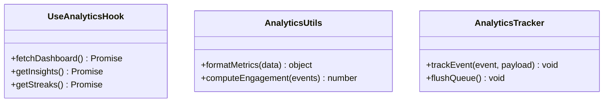

**Diagram sources**
- [use-analytics.ts](file://src/hooks/use-analytics.ts)
- [analytics.ts](file://src/lib/analytics.ts)
- [analytics-tracker.ts](file://src/lib/analytics-tracker.ts)

**Section sources**
- [use-analytics.ts](file://src/hooks/use-analytics.ts)
- [analytics.ts](file://src/lib/analytics.ts)
- [analytics-tracker.ts](file://src/lib/analytics-tracker.ts)

## Dependency Analysis
The analytics system exhibits clear separation of concerns:
- Controllers depend on services.
- Services depend on aggregation, repository, and specialized services (dashboard, insights, streaks).
- Frontend depends on hooks and utilities which consume backend APIs.

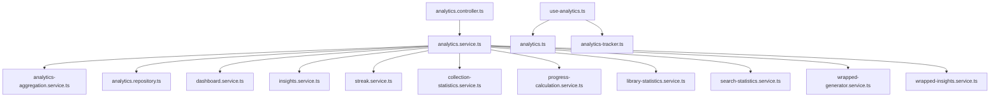

**Diagram sources**
- [analytics.controller.ts](file://apps/backend/src/analytics/analytics.controller.ts)
- [analytics.service.ts](file://apps/backend/src/analytics/analytics.service.ts)
- [analytics-aggregation.service.ts](file://apps/backend/src/analytics/analytics-aggregation.service.ts)
- [analytics.repository.ts](file://apps/backend/src/analytics/analytics.repository.ts)
- [dashboard.service.ts](file://apps/backend/src/analytics/dashboard.service.ts)
- [insights.service.ts](file://apps/backend/src/analytics/insights.service.ts)
- [streak.service.ts](file://apps/backend/src/analytics/streak.service.ts)
- [collection-statistics.service.ts](file://apps/backend/src/collections/collection-statistics.service.ts)
- [progress-calculation.service.ts](file://apps/backend/src/progress/progress-calculation.service.ts)
- [library-statistics.service.ts](file://apps/backend/src/library/library-statistics.service.ts)
- [search-statistics.service.ts](file://apps/backend/src/search/search-statistics.service.ts)
- [wrapped-generator.service.ts](file://apps/backend/src/wrapped/wrapped-generator.service.ts)
- [wrapped-insights.service.ts](file://apps/backend/src/wrapped/wrapped-insights.service.ts)
- [use-analytics.ts](file://src/hooks/use-analytics.ts)
- [analytics.ts](file://src/lib/analytics.ts)
- [analytics-tracker.ts](file://src/lib/analytics-tracker.ts)

**Section sources**
- [analytics.controller.ts](file://apps/backend/src/analytics/analytics.controller.ts)
- [analytics.service.ts](file://apps/backend/src/analytics/analytics.service.ts)
- [analytics-aggregation.service.ts](file://apps/backend/src/analytics/analytics-aggregation.service.ts)
- [analytics.repository.ts](file://apps/backend/src/analytics/analytics.repository.ts)
- [dashboard.service.ts](file://apps/backend/src/analytics/dashboard.service.ts)
- [insights.service.ts](file://apps/backend/src/analytics/insights.service.ts)
- [streak.service.ts](file://apps/backend/src/analytics/streak.service.ts)
- [collection-statistics.service.ts](file://apps/backend/src/collections/collection-statistics.service.ts)
- [progress-calculation.service.ts](file://apps/backend/src/progress/progress-calculation.service.ts)
- [library-statistics.service.ts](file://apps/backend/src/library/library-statistics.service.ts)
- [search-statistics.service.ts](file://apps/backend/src/search/search-statistics.service.ts)
- [wrapped-generator.service.ts](file://apps/backend/src/wrapped/wrapped-generator.service.ts)
- [wrapped-insights.service.ts](file://apps/backend/src/wrapped/wrapped-insights.service.ts)
- [use-analytics.ts](file://src/hooks/use-analytics.ts)
- [analytics.ts](file://src/lib/analytics.ts)
- [analytics-tracker.ts](file://src/lib/analytics-tracker.ts)

## Performance Considerations
- Data aggregation strategies:
  - Time bucketing reduces cardinality for large datasets.
  - Precomputing common rollups improves dashboard load times.
  - Indexing frequently queried dimensions (date, genre, status).
- Caching:
  - Cache dashboard payloads for short-lived intervals.
  - Memoize insight computations when inputs are unchanged.
- Streaming and pagination:
  - Stream aggregated results for large exports.
  - Paginate insight lists to avoid heavy payloads.
- Frontend optimizations:
  - Lazy-load chart components.
  - Debounce user interactions that trigger analytics updates.
  - Use virtualization for long lists in heatmaps and timelines.

[No sources needed since this section provides general guidance]

## Troubleshooting Guide
Common issues and resolutions:
- Missing data points: Ensure event ingestion pipelines are running and timestamps are consistent.
- Incorrect completion rates: Verify completion thresholds and partial progress handling.
- Slow dashboard loads: Check aggregation queries, add indexes, enable caching.
- Streak inaccuracies: Confirm timezone normalization and gap tolerance settings.
- Insight anomalies: Validate input data quality and algorithm parameters.

**Section sources**
- [analytics-aggregation.service.ts](file://apps/backend/src/analytics/analytics-aggregation.service.ts)
- [progress-calculation.service.ts](file://apps/backend/src/progress/progress-calculation.service.ts)
- [streak.service.ts](file://apps/backend/src/analytics/streak.service.ts)
- [insights.service.ts](file://apps/backend/src/analytics/insights.service.ts)

## Conclusion
The collection analytics and insights system provides robust statistical calculations, insightful algorithms, and rich visualizations. It integrates seamlessly with dashboards and supports exportable reports. With careful aggregation and caching strategies, it scales effectively for large datasets while delivering meaningful insights such as productivity peaks, genre evolution, and completion streaks.

[No sources needed since this section summarizes without analyzing specific files]

## Appendices

### Example Insights
- Most Productive Months: Identify months with highest activity and completion rates.
- Genre Evolution: Track shifts in preferred genres over time.
- Completion Streaks: Highlight longest and current streaks to encourage consistency.

[No sources needed since this section provides conceptual examples]