# Collections & Organization

<cite>
**Referenced Files in This Document**
- [collections.controller.ts](file://apps/backend/src/collections/collections.controller.ts)
- [collections.service.ts](file://apps/backend/src/collections/collections.service.ts)
- [collections.repository.ts](file://apps/backend/src/collections/collections.repository.ts)
- [collections.module.ts](file://apps/backend/src/collections/collections.module.ts)
- [collection-statistics.service.ts](file://apps/backend/src/collections/collection-statistics.service.ts)
- [smart-collection.service.ts](file://apps/backend/src/collections/smart-collection.service.ts)
- [collection-event.service.ts](file://apps/backend/src/collections/collection-event.service.ts)
- [analytics-aggregation.service.ts](file://apps/backend/src/analytics/analytics-aggregation.service.ts)
- [insights.service.ts](file://apps/backend/src/analytics/insights.service.ts)
- [dashboard.service.ts](file://apps/backend/src/analytics/dashboard.service.ts)
- [schema.prisma](file://apps/backend/prisma/schema.prisma)
- [use-collections.ts](file://src/hooks/use-collections.ts)
- [CollectionCard.tsx](file://src/components/collections/CollectionCard.tsx)
- [CreateCollectionModal.tsx](file://src/components/collections/CreateCollectionModal.tsx)
- [CollectionExplorer.tsx](file://src/components/collections/CollectionExplorer.tsx)
- [CollectionStatistics.tsx](file://src/components/collections/CollectionStatistics.tsx)
- [CollectionInsights.tsx](file://src/components/collections/CollectionInsights.tsx)
- [CollectionTimeline.tsx](file://src/components/collections/CollectionTimeline.tsx)
- [CollectionConnections.tsx](file://src/components/collections/CollectionConnections.tsx)
- [CompanionCollections.tsx](file://src/components/collections/CompanionCollections.tsx)
- [RelatedCollections.tsx](file://src/components/collections/RelatedCollections.tsx)
- [SmartCollectionSuggestions.tsx](file://src/components/collections/SmartCollectionSuggestions.tsx)
- [app.collections.index.tsx](file://src/routes/app.collections.index.tsx)
- [app.collections.$id.tsx](file://src/routes/app.collections.$id.tsx)
</cite>

## Table of Contents
1. [Introduction](#introduction)
2. [Project Structure](#project-structure)
3. [Core Components](#core-components)
4. [Architecture Overview](#architecture-overview)
5. [Detailed Component Analysis](#detailed-component-analysis)
6. [Dependency Analysis](#dependency-analysis)
7. [Performance Considerations](#performance-considerations)
8. [Troubleshooting Guide](#troubleshooting-guide)
9. [Conclusion](#conclusion)
10. [Appendices](#appendices)

## Introduction
This document explains the collections system for organizing media content into themed groups. It covers manual collection creation, smart collections with automatic rules, collaborative features, statistics and analytics, insights generation, relationships and cross-references, discovery features, sharing and visibility settings, community interactions, templates, bulk operations, and import/export capabilities. The goal is to provide both a high-level understanding and detailed technical references for developers and product users.

## Project Structure
The collections feature spans backend NestJS modules (controllers, services, repositories, DTOs), Prisma data models, and frontend React components and hooks that power the UI and user workflows.

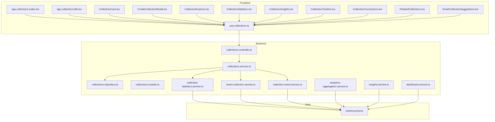

**Diagram sources**
- [collections.controller.ts](file://apps/backend/src/collections/collections.controller.ts)
- [collections.service.ts](file://apps/backend/src/collections/collections.service.ts)
- [collections.repository.ts](file://apps/backend/src/collections/collections.repository.ts)
- [collections.module.ts](file://apps/backend/src/collections/collections.module.ts)
- [collection-statistics.service.ts](file://apps/backend/src/collections/collection-statistics.service.ts)
- [smart-collection.service.ts](file://apps/backend/src/collections/smart-collection.service.ts)
- [collection-event.service.ts](file://apps/backend/src/collections/collection-event.service.ts)
- [analytics-aggregation.service.ts](file://apps/backend/src/analytics/analytics-aggregation.service.ts)
- [insights.service.ts](file://apps/backend/src/analytics/insights.service.ts)
- [dashboard.service.ts](file://apps/backend/src/analytics/dashboard.service.ts)
- [schema.prisma](file://apps/backend/prisma/schema.prisma)
- [use-collections.ts](file://src/hooks/use-collections.ts)
- [CollectionCard.tsx](file://src/components/collections/CollectionCard.tsx)
- [CreateCollectionModal.tsx](file://src/components/collections/CreateCollectionModal.tsx)
- [CollectionExplorer.tsx](file://src/components/collections/CollectionExplorer.tsx)
- [CollectionStatistics.tsx](file://src/components/collections/CollectionStatistics.tsx)
- [CollectionInsights.tsx](file://src/components/collections/CollectionInsights.tsx)
- [CollectionTimeline.tsx](file://src/components/collections/CollectionTimeline.tsx)
- [CollectionConnections.tsx](file://src/components/collections/CollectionConnections.tsx)
- [CompanionCollections.tsx](file://src/components/collections/CompanionCollections.tsx)
- [RelatedCollections.tsx](file://src/components/collections/RelatedCollections.tsx)
- [SmartCollectionSuggestions.tsx](file://src/components/collections/SmartCollectionSuggestions.tsx)
- [app.collections.index.tsx](file://src/routes/app.collections.index.tsx)
- [app.collections.$id.tsx](file://src/routes/app.collections.$id.tsx)

**Section sources**
- [collections.controller.ts](file://apps/backend/src/collections/collections.controller.ts)
- [collections.service.ts](file://apps/backend/src/collections/collections.service.ts)
- [collections.repository.ts](file://apps/backend/src/collections/collections.repository.ts)
- [collections.module.ts](file://apps/backend/src/collections/collections.module.ts)
- [collection-statistics.service.ts](file://apps/backend/src/collections/collection-statistics.service.ts)
- [smart-collection.service.ts](file://apps/backend/src/collections/smart-collection.service.ts)
- [collection-event.service.ts](file://apps/backend/src/collections/collection-event.service.ts)
- [analytics-aggregation.service.ts](file://apps/backend/src/analytics/analytics-aggregation.service.ts)
- [insights.service.ts](file://apps/backend/src/analytics/insights.service.ts)
- [dashboard.service.ts](file://apps/backend/src/analytics/dashboard.service.ts)
- [schema.prisma](file://apps/backend/prisma/schema.prisma)
- [use-collections.ts](file://src/hooks/use-collections.ts)
- [CollectionCard.tsx](file://src/components/collections/CollectionCard.tsx)
- [CreateCollectionModal.tsx](file://src/components/collections/CreateCollectionModal.tsx)
- [CollectionExplorer.tsx](file://src/components/collections/CollectionExplorer.tsx)
- [CollectionStatistics.tsx](file://src/components/collections/CollectionStatistics.tsx)
- [CollectionInsights.tsx](file://src/components/collections/CollectionInsights.tsx)
- [CollectionTimeline.tsx](file://src/components/collections/CollectionTimeline.tsx)
- [CollectionConnections.tsx](file://src/components/collections/CollectionConnections.tsx)
- [CompanionCollections.tsx](file://src/components/collections/CompanionCollections.tsx)
- [RelatedCollections.tsx](file://src/components/collections/RelatedCollections.tsx)
- [SmartCollectionSuggestions.tsx](file://src/components/collections/SmartCollectionSuggestions.tsx)
- [app.collections.index.tsx](file://src/routes/app.collections.index.tsx)
- [app.collections.$id.tsx](file://src/routes/app.collections.$id.tsx)

## Core Components
- Collections Controller: Exposes REST endpoints for CRUD, membership management, sharing, and bulk actions.
- Collections Service: Orchestrates business logic for manual and smart collections, relationships, events, and collaboration.
- Collections Repository: Data access layer for collections, members, memberships, and relations.
- Collection Statistics Service: Aggregates counts, growth trends, and engagement metrics per collection.
- Smart Collection Service: Evaluates rule sets to auto-populate collections based on media attributes and user behavior.
- Collection Event Service: Emits and handles domain events for lifecycle changes and updates.
- Analytics Services: Provide aggregation, insights, and dashboard data used by collection analytics.
- Frontend Hooks and Components: Provide UI for creating, exploring, analyzing, and collaborating on collections.

**Section sources**
- [collections.controller.ts](file://apps/backend/src/collections/collections.controller.ts)
- [collections.service.ts](file://apps/backend/src/collections/collections.service.ts)
- [collections.repository.ts](file://apps/backend/src/collections/collections.repository.ts)
- [collection-statistics.service.ts](file://apps/backend/src/collections/collection-statistics.service.ts)
- [smart-collection.service.ts](file://apps/backend/src/collections/smart-collection.service.ts)
- [collection-event.service.ts](file://apps/backend/src/collections/collection-event.service.ts)
- [analytics-aggregation.service.ts](file://apps/backend/src/analytics/analytics-aggregation.service.ts)
- [insights.service.ts](file://apps/backend/src/analytics/insights.service.ts)
- [dashboard.service.ts](file://apps/backend/src/analytics/dashboard.service.ts)
- [use-collections.ts](file://src/hooks/use-collections.ts)
- [CollectionCard.tsx](file://src/components/collections/CollectionCard.tsx)
- [CreateCollectionModal.tsx](file://src/components/collections/CreateCollectionModal.tsx)
- [CollectionExplorer.tsx](file://src/components/collections/CollectionExplorer.tsx)
- [CollectionStatistics.tsx](file://src/components/collections/CollectionStatistics.tsx)
- [CollectionInsights.tsx](file://src/components/collections/CollectionInsights.tsx)
- [CollectionTimeline.tsx](file://src/components/collections/CollectionTimeline.tsx)
- [CollectionConnections.tsx](file://src/components/collections/CollectionConnections.tsx)
- [CompanionCollections.tsx](file://src/components/collections/CompanionCollections.tsx)
- [RelatedCollections.tsx](file://src/components/collections/RelatedCollections.tsx)
- [SmartCollectionSuggestions.tsx](file://src/components/collections/SmartCollectionSuggestions.tsx)
- [app.collections.index.tsx](file://src/routes/app.collections.index.tsx)
- [app.collections.$id.tsx](file://src/routes/app.collections.$id.tsx)

## Architecture Overview
The collections system follows a layered architecture:
- Presentation Layer: React routes and components render collection lists, details, analytics, and collaboration tools.
- API Layer: NestJS controller exposes endpoints for client requests.
- Business Layer: Services implement core logic for manual and smart collections, relationships, and collaboration.
- Data Layer: Repository abstracts database operations; Prisma schema defines entities and relations.
- Analytics Layer: Aggregation and insights services compute metrics and recommendations.

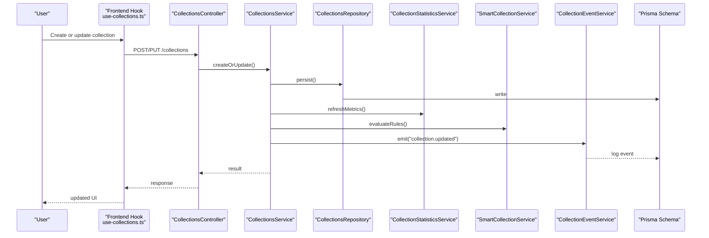

**Diagram sources**
- [collections.controller.ts](file://apps/backend/src/collections/collections.controller.ts)
- [collections.service.ts](file://apps/backend/src/collections/collections.service.ts)
- [collections.repository.ts](file://apps/backend/src/collections/collections.repository.ts)
- [collection-statistics.service.ts](file://apps/backend/src/collections/collection-statistics.service.ts)
- [smart-collection.service.ts](file://apps/backend/src/collections/smart-collection.service.ts)
- [collection-event.service.ts](file://apps/backend/src/collections/collection-event.service.ts)
- [schema.prisma](file://apps/backend/prisma/schema.prisma)
- [use-collections.ts](file://src/hooks/use-collections.ts)

## Detailed Component Analysis

### Manual Collection Creation and Management
Manual collections allow users to curate themed groups by adding/removing media items and setting metadata like title, description, tags, and visibility.

Key behaviors:
- Create/update/delete collections via API endpoints.
- Manage membership and roles for collaborators.
- Set public/private visibility and sharing links.
- Bulk add/remove media items.
- Templates for quick setup.

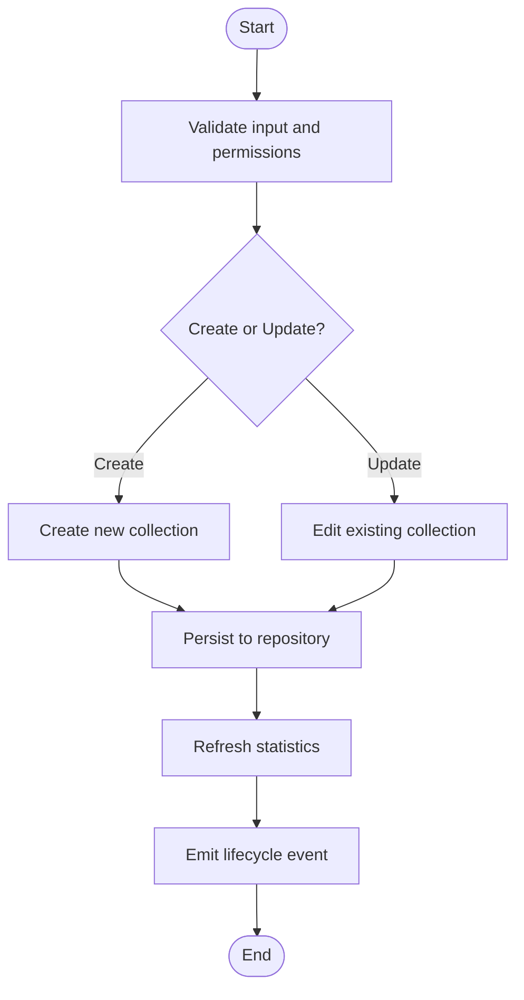

**Diagram sources**
- [collections.controller.ts](file://apps/backend/src/collections/collections.controller.ts)
- [collections.service.ts](file://apps/backend/src/collections/collections.service.ts)
- [collections.repository.ts](file://apps/backend/src/collections/collections.repository.ts)
- [collection-event.service.ts](file://apps/backend/src/collections/collection-event.service.ts)
- [collection-statistics.service.ts](file://apps/backend/src/collections/collection-statistics.service.ts)
- [schema.prisma](file://apps/backend/prisma/schema.prisma)

**Section sources**
- [collections.controller.ts](file://apps/backend/src/collections/collections.controller.ts)
- [collections.service.ts](file://apps/backend/src/collections/collections.service.ts)
- [collections.repository.ts](file://apps/backend/src/collections/collections.repository.ts)
- [collection-event.service.ts](file://apps/backend/src/collections/collection-event.service.ts)
- [collection-statistics.service.ts](file://apps/backend/src/collections/collection-statistics.service.ts)
- [schema.prisma](file://apps/backend/prisma/schema.prisma)
- [CreateCollectionModal.tsx](file://src/components/collections/CreateCollectionModal.tsx)
- [CollectionCard.tsx](file://src/components/collections/CollectionCard.tsx)
- [use-collections.ts](file://src/hooks/use-collections.ts)

### Smart Collections with Automatic Rules
Smart collections automatically populate based on rule sets defined by users or system heuristics. Rules can target media attributes, dates, genres, ratings, and interaction signals.

Key behaviors:
- Define rule expressions and conditions.
- Evaluate rules on schedule or on-demand.
- Auto-add/remove items when conditions change.
- Suggest rules based on user patterns.

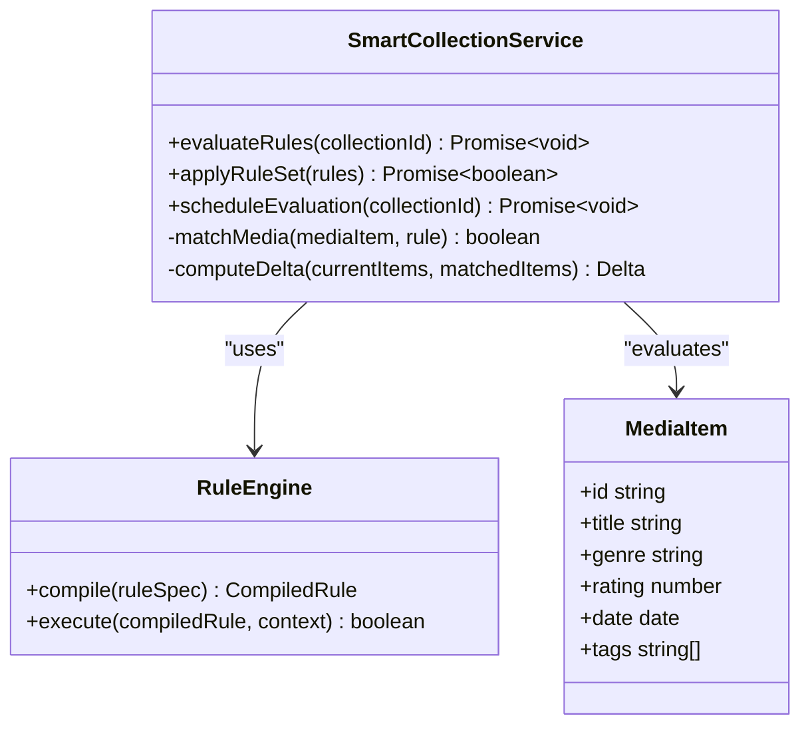

**Diagram sources**
- [smart-collection.service.ts](file://apps/backend/src/collections/smart-collection.service.ts)
- [schema.prisma](file://apps/backend/prisma/schema.prisma)

**Section sources**
- [smart-collection.service.ts](file://apps/backend/src/collections/smart-collection.service.ts)
- [SmartCollectionSuggestions.tsx](file://src/components/collections/SmartCollectionSuggestions.tsx)
- [use-collections.ts](file://src/hooks/use-collections.ts)

### Collaborative Features
Collaboration enables multiple users to contribute to a collection with role-based permissions.

Key behaviors:
- Invite collaborators and assign roles (owner, editor, viewer).
- Track activity and audit changes.
- Resolve conflicts and merge edits safely.
- Share publicly or privately with controlled access.

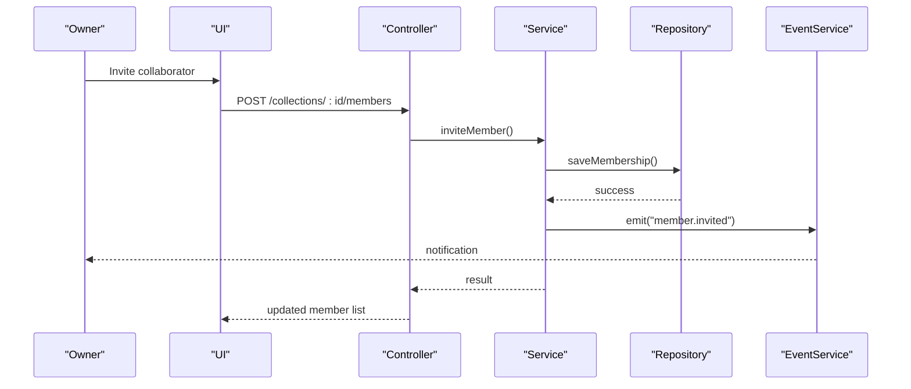

**Diagram sources**
- [collections.controller.ts](file://apps/backend/src/collections/collections.controller.ts)
- [collections.service.ts](file://apps/backend/src/collections/collections.service.ts)
- [collections.repository.ts](file://apps/backend/src/collections/collections.repository.ts)
- [collection-event.service.ts](file://apps/backend/src/collections/collection-event.service.ts)

**Section sources**
- [collections.controller.ts](file://apps/backend/src/collections/collections.controller.ts)
- [collections.service.ts](file://apps/backend/src/collections/collections.service.ts)
- [collections.repository.ts](file://apps/backend/src/collections/collections.repository.ts)
- [collection-event.service.ts](file://apps/backend/src/collections/collection-event.service.ts)

### Collection Statistics, Analytics, and Insights
Statistics and insights provide actionable data about collection growth, engagement, and composition.

Key behaviors:
- Aggregate item counts, growth rates, and time-series metrics.
- Compute insights such as top contributors, genre distribution, and temporal patterns.
- Surface dashboard summaries and trend lines.

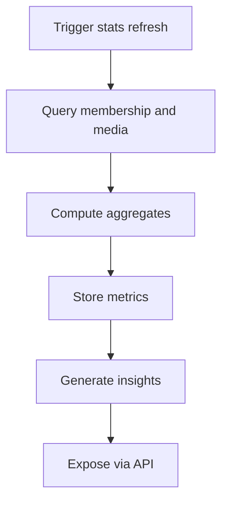

**Diagram sources**
- [collection-statistics.service.ts](file://apps/backend/src/collections/collection-statistics.service.ts)
- [analytics-aggregation.service.ts](file://apps/backend/src/analytics/analytics-aggregation.service.ts)
- [insights.service.ts](file://apps/backend/src/analytics/insights.service.ts)
- [dashboard.service.ts](file://apps/backend/src/analytics/dashboard.service.ts)
- [schema.prisma](file://apps/backend/prisma/schema.prisma)

**Section sources**
- [collection-statistics.service.ts](file://apps/backend/src/collections/collection-statistics.service.ts)
- [analytics-aggregation.service.ts](file://apps/backend/src/analytics/analytics-aggregation.service.ts)
- [insights.service.ts](file://apps/backend/src/analytics/insights.service.ts)
- [dashboard.service.ts](file://apps/backend/src/analytics/dashboard.service.ts)
- [CollectionStatistics.tsx](file://src/components/collections/CollectionStatistics.tsx)
- [CollectionInsights.tsx](file://src/components/collections/CollectionInsights.tsx)
- [use-collections.ts](file://src/hooks/use-collections.ts)

### Relationships, Cross-References, and Discovery
Collections can be related to other collections and media items, enabling discovery and navigation across themed groups.

Key behaviors:
- Define relationships between collections (e.g., companion, precursor, spin-off).
- Generate cross-links and suggestions.
- Discover related collections through similarity and shared tags.

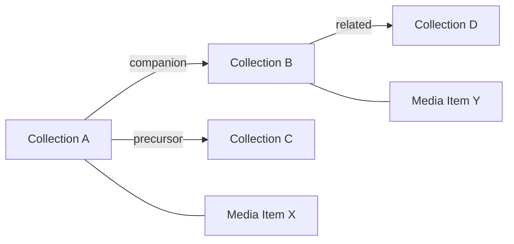

**Diagram sources**
- [collections.repository.ts](file://apps/backend/src/collections/collections.repository.ts)
- [schema.prisma](file://apps/backend/prisma/schema.prisma)
- [CollectionConnections.tsx](file://src/components/collections/CollectionConnections.tsx)
- [CompanionCollections.tsx](file://src/components/collections/CompanionCollections.tsx)
- [RelatedCollections.tsx](file://src/components/collections/RelatedCollections.tsx)

**Section sources**
- [collections.repository.ts](file://apps/backend/src/collections/collections.repository.ts)
- [schema.prisma](file://apps/backend/prisma/schema.prisma)
- [CollectionConnections.tsx](file://src/components/collections/CollectionConnections.tsx)
- [CompanionCollections.tsx](file://src/components/collections/CompanionCollections.tsx)
- [RelatedCollections.tsx](file://src/components/collections/RelatedCollections.tsx)

### Sharing, Public/Private Settings, and Community Features
Collections support visibility controls and sharing mechanisms to enable community exploration and collaboration.

Key behaviors:
- Toggle public/private visibility.
- Generate shareable links with read-only or edit access.
- Allow community comments, ratings, and contributions where permitted.

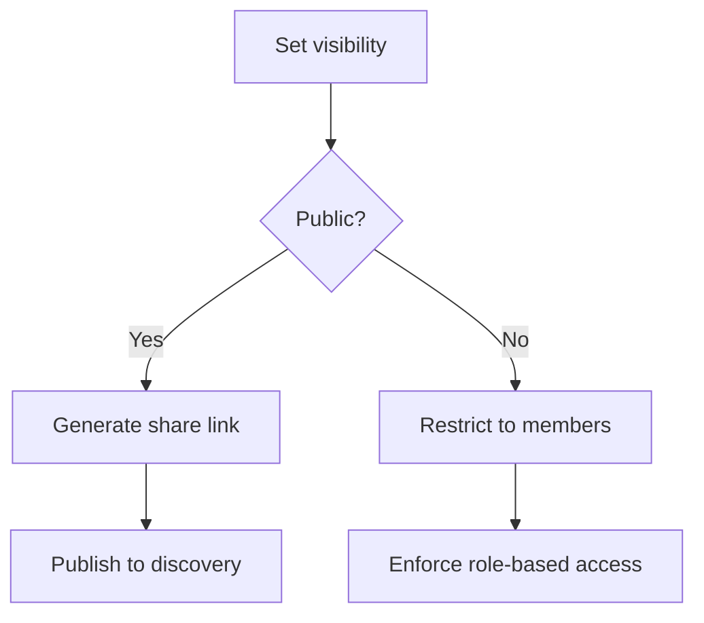

**Diagram sources**
- [collections.controller.ts](file://apps/backend/src/collections/collections.controller.ts)
- [collections.service.ts](file://apps/backend/src/collections/collections.service.ts)
- [collections.repository.ts](file://apps/backend/src/collections/collections.repository.ts)

**Section sources**
- [collections.controller.ts](file://apps/backend/src/collections/collections.controller.ts)
- [collections.service.ts](file://apps/backend/src/collections/collections.service.ts)
- [collections.repository.ts](file://apps/backend/src/collections/collections.repository.ts)

### Templates, Bulk Operations, and Import/Export
Templates streamline creation by providing preconfigured structures. Bulk operations improve efficiency for large-scale curation. Import/export supports migration and backup.

Key behaviors:
- Apply templates to quickly scaffold collections with default rules and metadata.
- Perform bulk add/remove of media items and batch updates.
- Export collection metadata and memberships; import from structured formats.

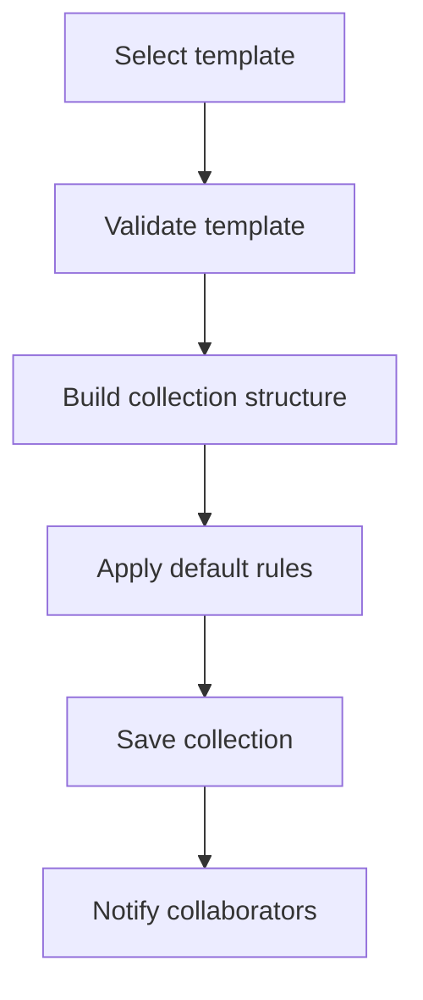

**Diagram sources**
- [collections.controller.ts](file://apps/backend/src/collections/collections.controller.ts)
- [collections.service.ts](file://apps/backend/src/collections/collections.service.ts)
- [collections.repository.ts](file://apps/backend/src/collections/collections.repository.ts)

**Section sources**
- [collections.controller.ts](file://apps/backend/src/collections/collections.controller.ts)
- [collections.service.ts](file://apps/backend/src/collections/collections.service.ts)
- [collections.repository.ts](file://apps/backend/src/collections/collections.repository.ts)

### Frontend User Flows
The frontend provides intuitive interfaces for managing collections, viewing analytics, and collaborating.

Key components:
- CollectionExplorer: Browse and filter collections.
- CollectionStatistics: Visualize metrics and trends.
- CollectionInsights: Display generated insights and recommendations.
- CollectionTimeline: View chronological organization of items.
- CollectionConnections: Explore relationships and cross-links.
- CompanionCollections and RelatedCollections: Discover adjacent themed groups.
- SmartCollectionSuggestions: Get rule suggestions for automation.

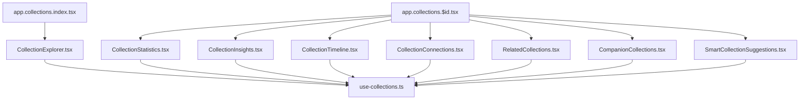

**Diagram sources**
- [app.collections.index.tsx](file://src/routes/app.collections.index.tsx)
- [app.collections.$id.tsx](file://src/routes/app.collections.$id.tsx)
- [CollectionExplorer.tsx](file://src/components/collections/CollectionExplorer.tsx)
- [CollectionStatistics.tsx](file://src/components/collections/CollectionStatistics.tsx)
- [CollectionInsights.tsx](file://src/components/collections/CollectionInsights.tsx)
- [CollectionTimeline.tsx](file://src/components/collections/CollectionTimeline.tsx)
- [CollectionConnections.tsx](file://src/components/collections/CollectionConnections.tsx)
- [CompanionCollections.tsx](file://src/components/collections/CompanionCollections.tsx)
- [RelatedCollections.tsx](file://src/components/collections/RelatedCollections.tsx)
- [SmartCollectionSuggestions.tsx](file://src/components/collections/SmartCollectionSuggestions.tsx)
- [use-collections.ts](file://src/hooks/use-collections.ts)

**Section sources**
- [app.collections.index.tsx](file://src/routes/app.collections.index.tsx)
- [app.collections.$id.tsx](file://src/routes/app.collections.$id.tsx)
- [CollectionExplorer.tsx](file://src/components/collections/CollectionExplorer.tsx)
- [CollectionStatistics.tsx](file://src/components/collections/CollectionStatistics.tsx)
- [CollectionInsights.tsx](file://src/components/collections/CollectionInsights.tsx)
- [CollectionTimeline.tsx](file://src/components/collections/CollectionTimeline.tsx)
- [CollectionConnections.tsx](file://src/components/collections/CollectionConnections.tsx)
- [CompanionCollections.tsx](file://src/components/collections/CompanionCollections.tsx)
- [RelatedCollections.tsx](file://src/components/collections/RelatedCollections.tsx)
- [SmartCollectionSuggestions.tsx](file://src/components/collections/SmartCollectionSuggestions.tsx)
- [use-collections.ts](file://src/hooks/use-collections.ts)

## Dependency Analysis
The collections module depends on analytics and insight services for metrics and recommendations, and on the repository layer for data persistence.

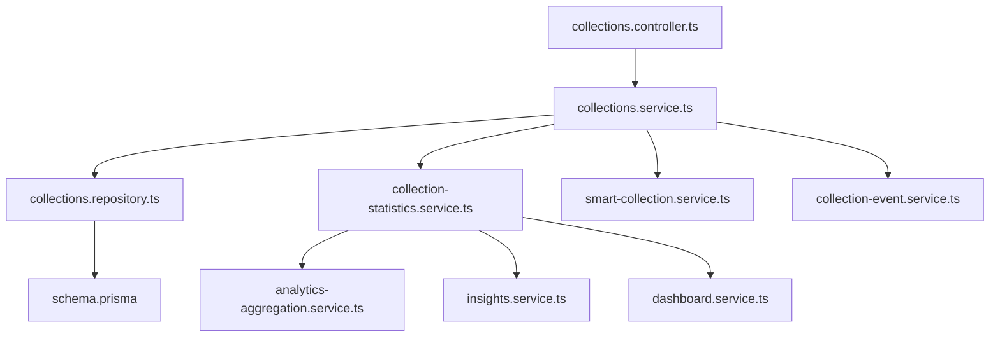

**Diagram sources**
- [collections.controller.ts](file://apps/backend/src/collections/collections.controller.ts)
- [collections.service.ts](file://apps/backend/src/collections/collections.service.ts)
- [collections.repository.ts](file://apps/backend/src/collections/collections.repository.ts)
- [collection-statistics.service.ts](file://apps/backend/src/collections/collection-statistics.service.ts)
- [smart-collection.service.ts](file://apps/backend/src/collections/smart-collection.service.ts)
- [collection-event.service.ts](file://apps/backend/src/collections/collection-event.service.ts)
- [analytics-aggregation.service.ts](file://apps/backend/src/analytics/analytics-aggregation.service.ts)
- [insights.service.ts](file://apps/backend/src/analytics/insights.service.ts)
- [dashboard.service.ts](file://apps/backend/src/analytics/dashboard.service.ts)
- [schema.prisma](file://apps/backend/prisma/schema.prisma)

**Section sources**
- [collections.controller.ts](file://apps/backend/src/collections/collections.controller.ts)
- [collections.service.ts](file://apps/backend/src/collections/collections.service.ts)
- [collections.repository.ts](file://apps/backend/src/collections/collections.repository.ts)
- [collection-statistics.service.ts](file://apps/backend/src/collections/collection-statistics.service.ts)
- [smart-collection.service.ts](file://apps/backend/src/collections/smart-collection.service.ts)
- [collection-event.service.ts](file://apps/backend/src/collections/collection-event.service.ts)
- [analytics-aggregation.service.ts](file://apps/backend/src/analytics/analytics-aggregation.service.ts)
- [insights.service.ts](file://apps/backend/src/analytics/insights.service.ts)
- [dashboard.service.ts](file://apps/backend/src/analytics/dashboard.service.ts)
- [schema.prisma](file://apps/backend/prisma/schema.prisma)

## Performance Considerations
- Batch operations: Use bulk endpoints for adding/removing media items to reduce round-trips.
- Lazy evaluation: Defer smart collection rule evaluation to off-peak hours or trigger on-demand.
- Caching: Cache frequently accessed collection metadata and statistics.
- Pagination: Implement pagination for large collection item lists.
- Indexing: Ensure database indexes on frequently queried fields (e.g., tags, dates, genres).

[No sources needed since this section provides general guidance]

## Troubleshooting Guide
Common issues and resolutions:
- Permission errors: Verify user roles and ownership before performing mutations.
- Rule evaluation failures: Inspect rule syntax and ensure referenced attributes exist.
- Stale statistics: Trigger manual refresh if metrics lag behind recent changes.
- Collaboration conflicts: Review audit logs and reconcile conflicting edits.

**Section sources**
- [collections.controller.ts](file://apps/backend/src/collections/collections.controller.ts)
- [collections.service.ts](file://apps/backend/src/collections/collections.service.ts)
- [collection-event.service.ts](file://apps/backend/src/collections/collection-event.service.ts)
- [collection-statistics.service.ts](file://apps/backend/src/collections/collection-statistics.service.ts)
- [smart-collection.service.ts](file://apps/backend/src/collections/smart-collection.service.ts)

## Conclusion
The collections system provides robust tools for organizing media into themed groups through manual curation and automated smart rules. It supports collaboration, rich analytics, insights, relationships, discovery, sharing, and community features. With templates, bulk operations, and import/export capabilities, it scales from personal use to team-driven projects. Proper performance tuning and error handling ensure reliability and responsiveness.

[No sources needed since this section summarizes without analyzing specific files]

## Appendices
- API Reference: See controllers for endpoint definitions and request/response shapes.
- Data Model: Refer to Prisma schema for entity definitions and relationships.
- Frontend Integration: Use the hook and components for seamless UI integration.

**Section sources**
- [collections.controller.ts](file://apps/backend/src/collections/collections.controller.ts)
- [schema.prisma](file://apps/backend/prisma/schema.prisma)
- [use-collections.ts](file://src/hooks/use-collections.ts)
- [CollectionCard.tsx](file://src/components/collections/CollectionCard.tsx)
- [CreateCollectionModal.tsx](file://src/components/collections/CreateCollectionModal.tsx)
- [CollectionExplorer.tsx](file://src/components/collections/CollectionExplorer.tsx)
- [CollectionStatistics.tsx](file://src/components/collections/CollectionStatistics.tsx)
- [CollectionInsights.tsx](file://src/components/collections/CollectionInsights.tsx)
- [CollectionTimeline.tsx](file://src/components/collections/CollectionTimeline.tsx)
- [CollectionConnections.tsx](file://src/components/collections/CollectionConnections.tsx)
- [CompanionCollections.tsx](file://src/components/collections/CompanionCollections.tsx)
- [RelatedCollections.tsx](file://src/components/collections/RelatedCollections.tsx)
- [SmartCollectionSuggestions.tsx](file://src/components/collections/SmartCollectionSuggestions.tsx)
- [app.collections.index.tsx](file://src/routes/app.collections.index.tsx)
- [app.collections.$id.tsx](file://src/routes/app.collections.$id.tsx)