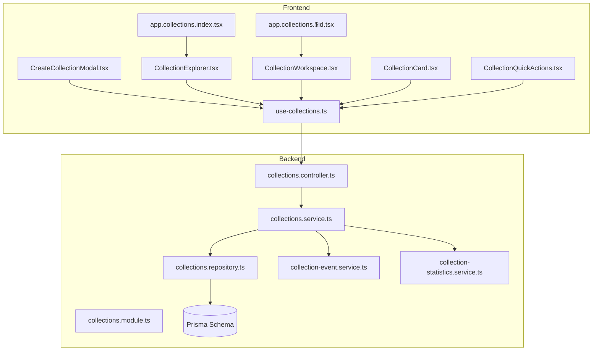
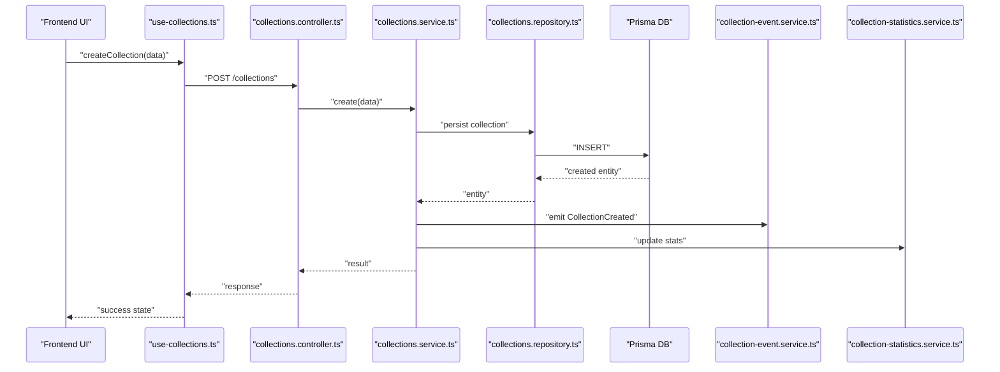
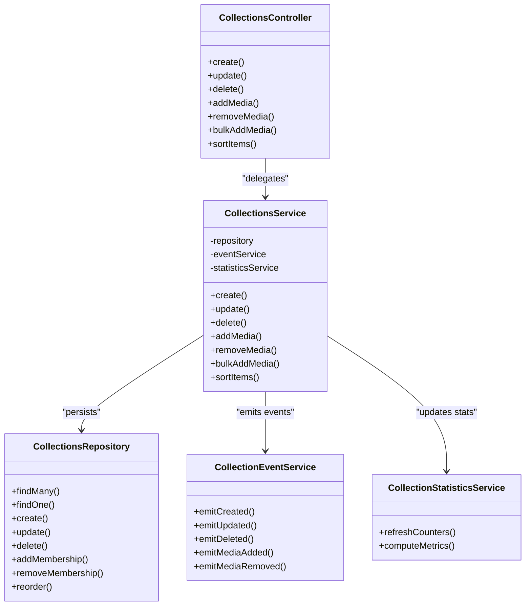
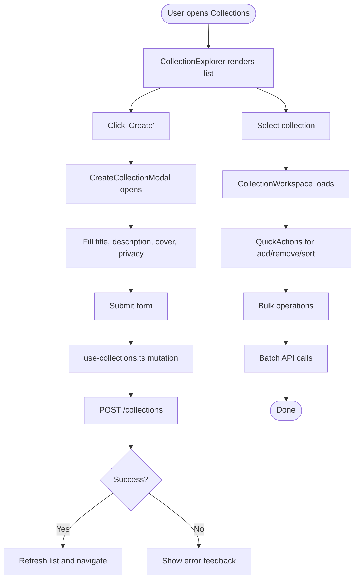
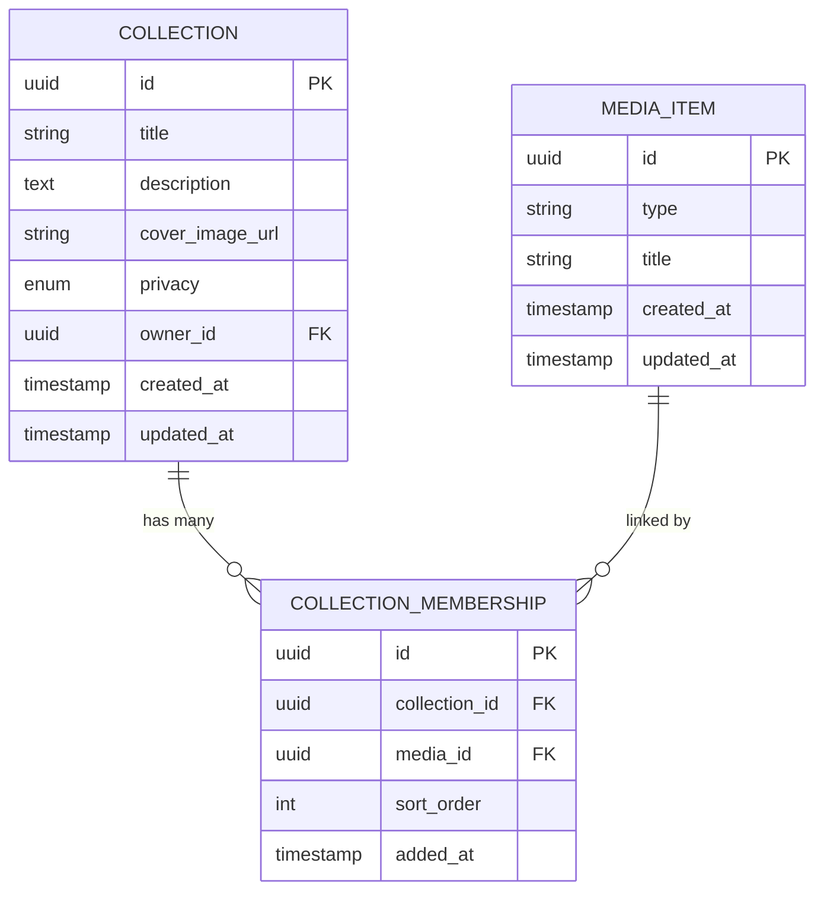
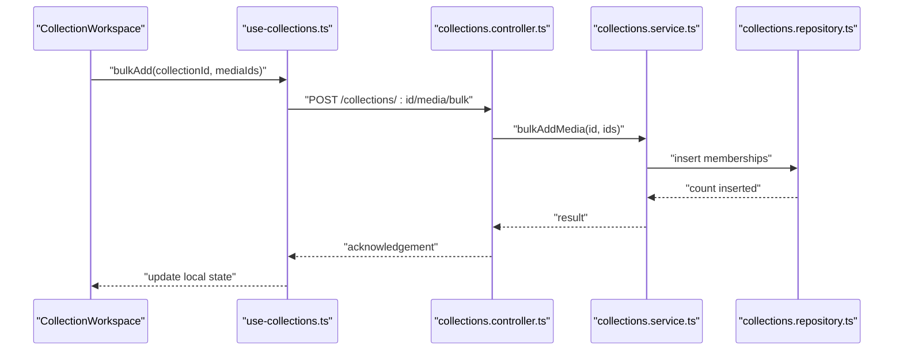
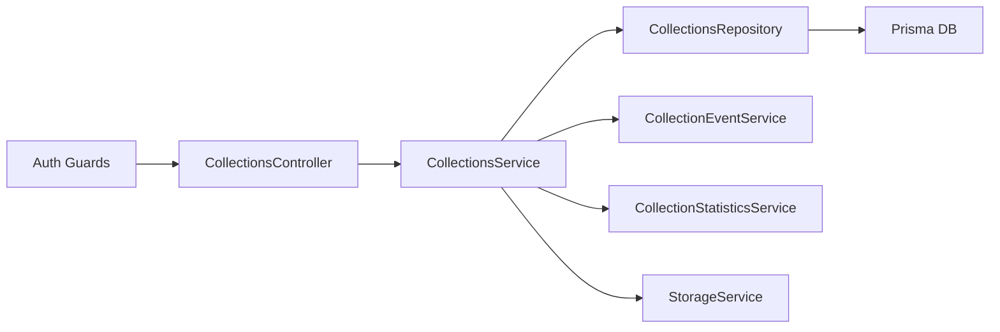

# Manual Collections

<cite>
**Referenced Files in This Document**
- [collections.controller.ts](file://apps/backend/src/collections/collections.controller.ts)
- [collections.service.ts](file://apps/backend/src/collections/collections.service.ts)
- [collections.repository.ts](file://apps/backend/src/collections/collections.repository.ts)
- [collections.module.ts](file://apps/backend/src/collections/collections.module.ts)
- [collection-event.service.ts](file://apps/backend/src/collections/collection-event.service.ts)
- [collection-statistics.service.ts](file://apps/backend/src/collections/collection-statistics.service.ts)
- [smart-collection.service.ts](file://apps/backend/src/collections/smart-collection.service.ts)
- [schema.prisma](file://apps/backend/prisma/schema.prisma)
- [CreateCollectionModal.tsx](file://src/components/collections/CreateCollectionModal.tsx)
- [CollectionCard.tsx](file://src/components/collections/CollectionCard.tsx)
- [CollectionExplorer.tsx](file://src/components/collections/CollectionExplorer.tsx)
- [CollectionWorkspace.tsx](file://src/components/collections/CollectionWorkspace.tsx)
- [CollectionQuickActions.tsx](file://src/components/collections/CollectionQuickActions.tsx)
- [use-collections.ts](file://src/hooks/use-collections.ts)
- [app.collections.index.tsx](file://src/routes/app.collections.index.tsx)
- [app.collections.$id.tsx](file://src/routes/app.collections.$id.tsx)
</cite>

## Table of Contents
1. [Introduction](#introduction)
2. [Project Structure](#project-structure)
3. [Core Components](#core-components)
4. [Architecture Overview](#architecture-overview)
5. [Detailed Component Analysis](#detailed-component-analysis)
6. [Dependency Analysis](#dependency-analysis)
7. [Performance Considerations](#performance-considerations)
8. [Troubleshooting Guide](#troubleshooting-guide)
9. [Conclusion](#conclusion)
10. [Appendices](#appendices)

## Introduction
This document explains manual collection management end-to-end: creating, editing, and deleting user-defined collections; managing metadata such as titles, descriptions, cover images, and privacy settings; adding or removing media items; performing bulk operations; and sorting capabilities. It also covers collection templates, naming conventions, organizational best practices, common patterns (Watchlist, Favorites, Genre-based, Personal Projects), permissions and sharing options, and access control mechanisms implemented by the system.

## Project Structure
Manual collections are implemented across backend NestJS modules and frontend React components with dedicated hooks and routes. The backend exposes REST endpoints for CRUD and membership operations, while the frontend provides UI for creation, editing, browsing, and workspace interactions.

**Diagram sources**
- [app.collections.index.tsx](file://src/routes/app.collections.index.tsx)
- [app.collections.$id.tsx](file://src/routes/app.collections.$id.tsx)
- [CreateCollectionModal.tsx](file://src/components/collections/CreateCollectionModal.tsx)
- [CollectionExplorer.tsx](file://src/components/collections/CollectionExplorer.tsx)
- [CollectionWorkspace.tsx](file://src/components/collections/CollectionWorkspace.tsx)
- [CollectionCard.tsx](file://src/components/collections/CollectionCard.tsx)
- [CollectionQuickActions.tsx](file://src/components/collections/CollectionQuickActions.tsx)
- [use-collections.ts](file://src/hooks/use-collections.ts)
- [collections.controller.ts](file://apps/backend/src/collections/collections.controller.ts)
- [collections.service.ts](file://apps/backend/src/collections/collections.service.ts)
- [collections.repository.ts](file://apps/backend/src/collections/collections.repository.ts)
- [collection-event.service.ts](file://apps/backend/src/collections/collection-event.service.ts)
- [collection-statistics.service.ts](file://apps/backend/src/collections/collection-statistics.service.ts)
- [schema.prisma](file://apps/backend/prisma/schema.prisma)

**Section sources**
- [collections.controller.ts](file://apps/backend/src/collections/collections.controller.ts)
- [collections.service.ts](file://apps/backend/src/collections/collections.service.ts)
- [collections.repository.ts](file://apps/backend/src/collections/collections.repository.ts)
- [collections.module.ts](file://apps/backend/src/collections/collections.module.ts)
- [CreateCollectionModal.tsx](file://src/components/collections/CreateCollectionModal.tsx)
- [CollectionExplorer.tsx](file://src/components/collections/CollectionExplorer.tsx)
- [CollectionWorkspace.tsx](file://src/components/collections/CollectionWorkspace.tsx)
- [CollectionCard.tsx](file://src/components/collections/CollectionCard.tsx)
- [CollectionQuickActions.tsx](file://src/components/collections/CollectionQuickActions.tsx)
- [use-collections.ts](file://src/hooks/use-collections.ts)
- [app.collections.index.tsx](file://src/routes/app.collections.index.tsx)
- [app.collections.$id.tsx](file://src/routes/app.collections.$id.tsx)
- [schema.prisma](file://apps/backend/prisma/schema.prisma)

## Core Components
- Backend Controller: Exposes REST endpoints for collection lifecycle and membership operations.
- Service Layer: Encapsulates business logic for create/update/delete, media membership, sorting, and statistics.
- Repository Layer: Handles persistence via Prisma ORM.
- Events and Statistics: Emits domain events and computes metrics per collection.
- Smart Collections: Provides rule-based collections alongside manual ones.
- Frontend Routes and Hooks: Manage routing and data fetching/mutation for collections.
- UI Components: Provide creation modal, explorer, workspace, cards, and quick actions.

Key responsibilities:
- Create/Edit/Delete collections with metadata (title, description, cover image, privacy).
- Add/remove media items to/from collections.
- Bulk add/remove and sort items within a collection.
- Track events and compute statistics.
- Enforce permissions and access control.

**Section sources**
- [collections.controller.ts](file://apps/backend/src/collections/collections.controller.ts)
- [collections.service.ts](file://apps/backend/src/collections/collections.service.ts)
- [collections.repository.ts](file://apps/backend/src/collections/collections.repository.ts)
- [collection-event.service.ts](file://apps/backend/src/collections/collection-event.service.ts)
- [collection-statistics.service.ts](file://apps/backend/src/collections/collection-statistics.service.ts)
- [smart-collection.service.ts](file://apps/backend/src/collections/smart-collection.service.ts)
- [use-collections.ts](file://src/hooks/use-collections.ts)
- [CreateCollectionModal.tsx](file://src/components/collections/CreateCollectionModal.tsx)
- [CollectionExplorer.tsx](file://src/components/collections/CollectionExplorer.tsx)
- [CollectionWorkspace.tsx](file://src/components/collections/CollectionWorkspace.tsx)
- [CollectionCard.tsx](file://src/components/collections/CollectionCard.tsx)
- [CollectionQuickActions.tsx](file://src/components/collections/CollectionQuickActions.tsx)

## Architecture Overview
The manual collections feature follows a layered architecture:
- API layer (Controller) validates requests and delegates to services.
- Business layer (Service) orchestrates operations, enforces rules, emits events, and updates statistics.
- Data layer (Repository) persists entities through Prisma.
- Frontend uses typed hooks and components to interact with APIs and render UI.

**Diagram sources**
- [collections.controller.ts](file://apps/backend/src/collections/collections.controller.ts)
- [collections.service.ts](file://apps/backend/src/collections/collections.service.ts)
- [collections.repository.ts](file://apps/backend/src/collections/collections.repository.ts)
- [collection-event.service.ts](file://apps/backend/src/collections/collection-event.service.ts)
- [collection-statistics.service.ts](file://apps/backend/src/collections/collection-statistics.service.ts)
- [use-collections.ts](file://src/hooks/use-collections.ts)

## Detailed Component Analysis

### Backend Collections Module
Responsibilities:
- Define endpoints for collection CRUD and membership operations.
- Validate inputs and map DTOs to service calls.
- Handle errors and responses consistently.

Key flows:
- Create collection: title, description, optional cover image URL, privacy setting.
- Update collection: partial updates for metadata.
- Delete collection: cascade handling for memberships.
- Membership operations: add/remove single or multiple media items.
- Sorting: reorder items within a collection.

**Diagram sources**
- [collections.controller.ts](file://apps/backend/src/collections/collections.controller.ts)
- [collections.service.ts](file://apps/backend/src/collections/collections.service.ts)
- [collections.repository.ts](file://apps/backend/src/collections/collections.repository.ts)
- [collection-event.service.ts](file://apps/backend/src/collections/collection-event.service.ts)
- [collection-statistics.service.ts](file://apps/backend/src/collections/collection-statistics.service.ts)

**Section sources**
- [collections.controller.ts](file://apps/backend/src/collections/collections.controller.ts)
- [collections.service.ts](file://apps/backend/src/collections/collections.service.ts)
- [collections.repository.ts](file://apps/backend/src/collections/collections.repository.ts)
- [collection-event.service.ts](file://apps/backend/src/collections/collection-event.service.ts)
- [collection-statistics.service.ts](file://apps/backend/src/collections/collection-statistics.service.ts)

### Frontend Collections UI
Responsibilities:
- Provide modal for creating collections with metadata fields.
- Render collection explorer and workspace for browsing and editing.
- Offer quick actions for adding/removing media and sorting.
- Use typed hooks for data fetching and mutations.

Key flows:
- Create collection via modal triggers hook mutation.
- Explorer lists collections with filters and sorting.
- Workspace shows collection details, members, and allows bulk operations.
- Quick actions enable fast add/remove and reorder.

**Diagram sources**
- [CreateCollectionModal.tsx](file://src/components/collections/CreateCollectionModal.tsx)
- [CollectionExplorer.tsx](file://src/components/collections/CollectionExplorer.tsx)
- [CollectionWorkspace.tsx](file://src/components/collections/CollectionWorkspace.tsx)
- [CollectionQuickActions.tsx](file://src/components/collections/CollectionQuickActions.tsx)
- [use-collections.ts](file://src/hooks/use-collections.ts)

**Section sources**
- [CreateCollectionModal.tsx](file://src/components/collections/CreateCollectionModal.tsx)
- [CollectionExplorer.tsx](file://src/components/collections/CollectionExplorer.tsx)
- [CollectionWorkspace.tsx](file://src/components/collections/CollectionWorkspace.tsx)
- [CollectionQuickActions.tsx](file://src/components/collections/CollectionQuickActions.tsx)
- [use-collections.ts](file://src/hooks/use-collections.ts)

### Data Model and Persistence
The schema defines core entities for collections and their relationships to media items. Typical fields include identifiers, timestamps, ownership, visibility, and ordering. Memberships link collections to media items and support sorting order.

**Diagram sources**
- [schema.prisma](file://apps/backend/prisma/schema.prisma)

**Section sources**
- [schema.prisma](file://apps/backend/prisma/schema.prisma)

### Permissions and Access Control
Access control is enforced at the controller/service level based on authenticated user context. Privacy settings determine visibility and editability:
- Private: only the owner can view/edit.
- Shared: specific users or roles have read/write access.
- Public: visible to all authenticated users; editing restricted to owner.

Operations protected:
- Creating collections requires authentication.
- Updating/deleting requires ownership or elevated permissions.
- Adding/removing media requires write permission on the collection.

**Section sources**
- [collections.controller.ts](file://apps/backend/src/collections/collections.controller.ts)
- [collections.service.ts](file://apps/backend/src/collections/collections.service.ts)

### Templates and Naming Conventions
Templates streamline creation:
- Watchlist: default privacy private, minimal metadata, quick-add enabled.
- Favorites: default privacy private, preconfigured sorting by rating/date.
- Genre-based: default privacy shared within group, tag-driven suggestions.
- Personal Projects: default privacy private, structured chapters and milestones.

Naming conventions:
- Use concise, descriptive titles.
- Avoid special characters that break URLs.
- Keep consistent capitalization and separators.

Organizational best practices:
- Group related collections under folders or tags where supported.
- Use consistent metadata fields across similar collections.
- Archive or rename outdated collections instead of deleting to preserve history.

**Section sources**
- [CreateCollectionModal.tsx](file://src/components/collections/CreateCollectionModal.tsx)
- [collections.service.ts](file://apps/backend/src/collections/collections.service.ts)

### Common Collection Patterns
- Watchlist: Curate upcoming or desired media; supports quick-add from library search.
- Favorites: High-signal personal highlights; supports rating and notes.
- Genre-based: Thematic grouping by genre, era, or style; benefits from smart suggestions.
- Personal Projects: Collaborative or solo projects with chapters, tasks, and progress tracking.

Usage tips:
- Leverage sorting by date added, rating, or custom order.
- Use bulk operations to populate large collections efficiently.
- Apply privacy settings to match collaboration needs.

**Section sources**
- [CollectionExplorer.tsx](file://src/components/collections/CollectionExplorer.tsx)
- [CollectionWorkspace.tsx](file://src/components/collections/CollectionWorkspace.tsx)
- [CollectionQuickActions.tsx](file://src/components/collections/CollectionQuickActions.tsx)

### Media Item Addition/Removal and Bulk Operations
Supported operations:
- Single add/remove: select a media item and toggle membership.
- Bulk add/remove: select multiple items and apply changes in one action.
- Reordering: drag-and-drop or numeric sort order updates.

Workflow:
- Open CollectionWorkspace.
- Use QuickActions to add/remove items.
- For bulk, use selection mode and batch submit.
- Confirm changes and refresh list.

**Diagram sources**
- [CollectionWorkspace.tsx](file://src/components/collections/CollectionWorkspace.tsx)
- [use-collections.ts](file://src/hooks/use-collections.ts)
- [collections.controller.ts](file://apps/backend/src/collections/collections.controller.ts)
- [collections.service.ts](file://apps/backend/src/collections/collections.service.ts)
- [collections.repository.ts](file://apps/backend/src/collections/collections.repository.ts)

**Section sources**
- [CollectionWorkspace.tsx](file://src/components/collections/CollectionWorkspace.tsx)
- [CollectionQuickActions.tsx](file://src/components/collections/CollectionQuickActions.tsx)
- [use-collections.ts](file://src/hooks/use-collections.ts)
- [collections.controller.ts](file://apps/backend/src/collections/collections.controller.ts)
- [collections.service.ts](file://apps/backend/src/collections/collections.service.ts)
- [collections.repository.ts](file://apps/backend/src/collections/collections.repository.ts)

### Sorting Capabilities
Sorting options:
- By date added (ascending/descending).
- By rating or score if available.
- Custom order maintained via sort_order field.

Implementation:
- Frontend exposes sort controls in explorer/workspace.
- Backend applies ORDER BY clauses and updates sort_order on reorder.

**Section sources**
- [CollectionExplorer.tsx](file://src/components/collections/CollectionExplorer.tsx)
- [CollectionWorkspace.tsx](file://src/components/collections/CollectionWorkspace.tsx)
- [collections.repository.ts](file://apps/backend/src/collections/collections.repository.ts)

## Dependency Analysis
The collections module depends on core infrastructure:
- Authentication and authorization guards ensure secure access.
- Event bus enables decoupled notifications and analytics.
- Statistics service maintains counters and insights.
- Storage service may handle cover image uploads and signed URLs.

**Diagram sources**
- [collections.controller.ts](file://apps/backend/src/collections/collections.controller.ts)
- [collections.service.ts](file://apps/backend/src/collections/collections.service.ts)
- [collections.repository.ts](file://apps/backend/src/collections/collections.repository.ts)
- [collection-event.service.ts](file://apps/backend/src/collections/collection-event.service.ts)
- [collection-statistics.service.ts](file://apps/backend/src/collections/collection-statistics.service.ts)

**Section sources**
- [collections.module.ts](file://apps/backend/src/collections/collections.module.ts)
- [collections.controller.ts](file://apps/backend/src/collections/collections.controller.ts)
- [collections.service.ts](file://apps/backend/src/collections/collections.service.ts)

## Performance Considerations
- Batch operations: Prefer bulk add/remove to reduce round trips.
- Pagination: Use cursor or offset pagination when listing collections or members.
- Indexing: Ensure indexes on foreign keys and frequently filtered fields (owner_id, privacy, sort_order).
- Caching: Cache read-heavy endpoints like collection lists and metadata.
- Lazy loading: Load collection members lazily to improve initial load times.

[No sources needed since this section provides general guidance]

## Troubleshooting Guide
Common issues and resolutions:
- Permission denied: Verify user role and collection privacy settings.
- Duplicate membership: Check uniqueness constraints before adding media.
- Sort order inconsistencies: Re-sync sort_order after bulk operations.
- Cover image upload failures: Validate file size, MIME type, and storage availability.

Debugging steps:
- Inspect API responses and error codes.
- Review event logs for collection lifecycle events.
- Validate Prisma queries and transactions for correctness.

**Section sources**
- [collections.controller.ts](file://apps/backend/src/collections/collections.controller.ts)
- [collections.service.ts](file://apps/backend/src/collections/collections.service.ts)
- [collection-event.service.ts](file://apps/backend/src/collections/collection-event.service.ts)

## Conclusion
Manual collections provide a flexible and powerful way to organize media content with rich metadata, robust access control, and efficient operations. By following the outlined patterns, naming conventions, and best practices, users can build meaningful collections tailored to their workflows. The layered architecture ensures scalability, maintainability, and extensibility for future enhancements.

[No sources needed since this section summarizes without analyzing specific files]

## Appendices

### API Endpoints Summary
- Create collection: POST /collections
- Update collection: PATCH /collections/:id
- Delete collection: DELETE /collections/:id
- Add media: POST /collections/:id/media
- Remove media: DELETE /collections/:id/media/:mediaId
- Bulk add media: POST /collections/:id/media/bulk
- Sort items: PATCH /collections/:id/sort

[No sources needed since this section provides general guidance]

### Frontend Integration Tips
- Use typed hooks for consistent data access.
- Debounce search and filter inputs in explorer.
- Implement optimistic updates for better UX during mutations.
- Provide clear error messages and recovery paths.

[No sources needed since this section provides general guidance]