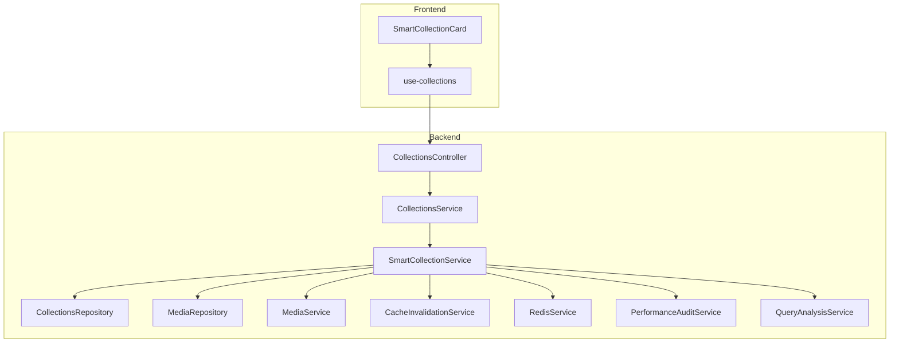
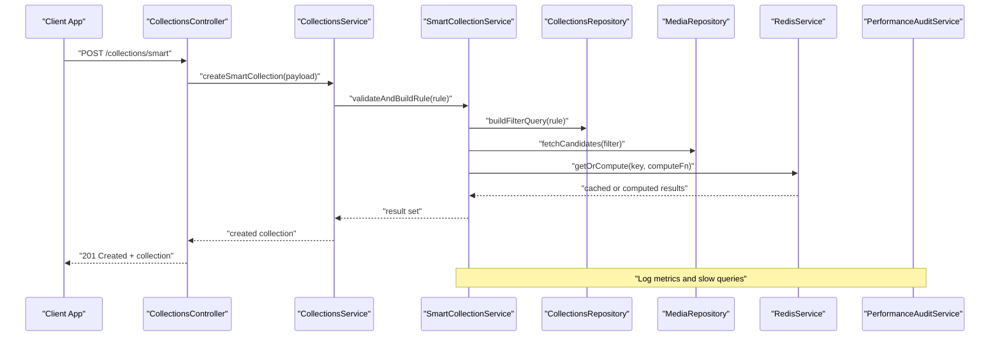
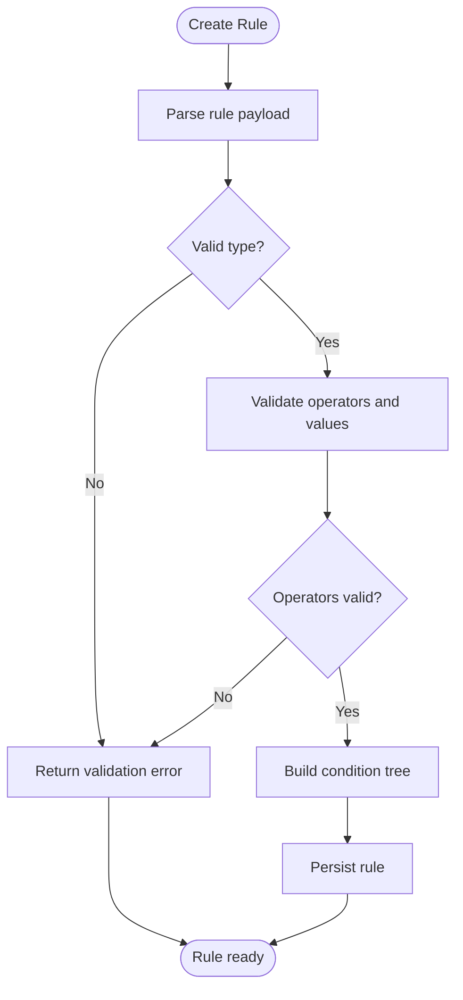
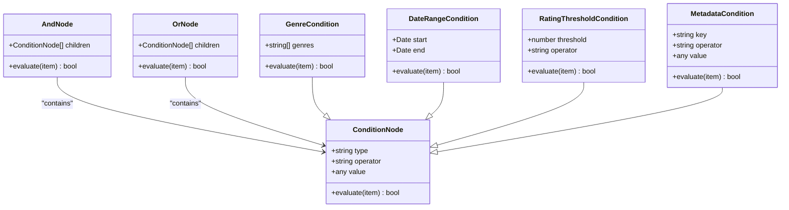
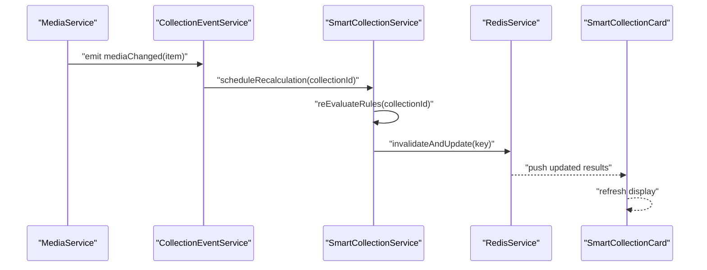
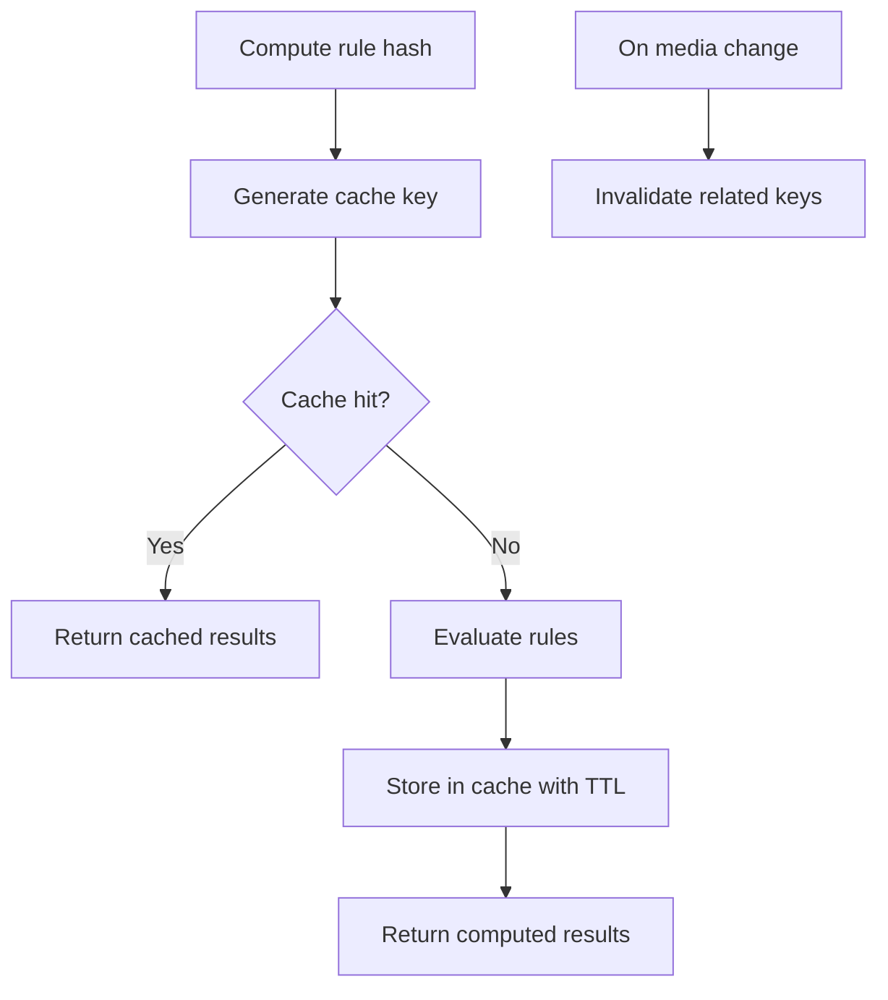
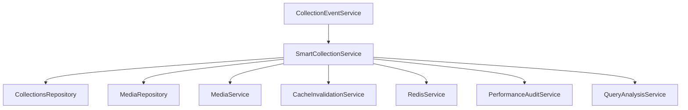

# Smart Collections

<cite>
**Referenced Files in This Document**
- [collections.service.ts](file://apps/backend/src/collections/collections.service.ts)
- [smart-collection.service.ts](file://apps/backend/src/collections/smart-collection.service.ts)
- [collections.controller.ts](file://apps/backend/src/collections/collections.controller.ts)
- [collections.module.ts](file://apps/backend/src/collections/collections.module.ts)
- [collections.repository.ts](file://apps/backend/src/collections/collections.repository.ts)
- [collection-event.service.ts](file://apps/backend/src/collections/collection-event.service.ts)
- [media.service.ts](file://apps/backend/src/media/media.service.ts)
- [media.repository.ts](file://apps/backend/src/media/media.repository.ts)
- [cache-invalidation.service.ts](file://apps/backend/src/hardening/cache-invalidation.service.ts)
- [performance-audit.service.ts](file://apps/backend/src/hardening/performance-audit.service.ts)
- [query-analysis.service.ts](file://apps/backend/src/hardening/query-analysis.service.ts)
- [redis.service.ts](file://apps/backend/src/redis/redis.service.ts)
- [SmartCollectionCard.tsx](file://src/components/collections/SmartCollectionCard.tsx)
- [use-collections.ts](file://src/hooks/use-collections.ts)
</cite>

## Table of Contents
1. [Introduction](#introduction)
2. [Project Structure](#project-structure)
3. [Core Components](#core-components)
4. [Architecture Overview](#architecture-overview)
5. [Detailed Component Analysis](#detailed-component-analysis)
6. [Dependency Analysis](#dependency-analysis)
7. [Performance Considerations](#performance-considerations)
8. [Troubleshooting Guide](#troubleshooting-guide)
9. [Conclusion](#conclusion)
10. [Appendices](#appendices)

## Introduction
This document explains smart collections with automatic rule-based organization. It covers how rules are created, how conditions are matched against media items, and how dynamic content updates occur when items change. Supported rule types include genre filters, date ranges, rating thresholds, and custom metadata conditions. The guide also documents the rule evaluation engine, performance considerations, caching strategies, complex rule combinations (nested conditions and logical operators), testing and debugging techniques, and real-time recalculation triggers.

## Project Structure
The smart collections feature spans backend services, repositories, event handling, caching, and frontend components:
- Backend service layer defines rule creation, evaluation, and integration with media data.
- Repository layer provides efficient queries for matching items based on rules.
- Event-driven mechanisms trigger recalculation when media changes.
- Caching and performance tools optimize query execution and result delivery.
- Frontend components expose smart collection cards and hooks to interact with the API.

**Diagram sources**
- [collections.controller.ts](file://apps/backend/src/collections/collections.controller.ts)
- [collections.service.ts](file://apps/backend/src/collections/collections.service.ts)
- [smart-collection.service.ts](file://apps/backend/src/collections/smart-collection.service.ts)
- [collections.repository.ts](file://apps/backend/src/collections/collections.repository.ts)
- [media.repository.ts](file://apps/backend/src/media/media.repository.ts)
- [media.service.ts](file://apps/backend/src/media/media.service.ts)
- [cache-invalidation.service.ts](file://apps/backend/src/hardening/cache-invalidation.service.ts)
- [redis.service.ts](file://apps/backend/src/redis/redis.service.ts)
- [performance-audit.service.ts](file://apps/backend/src/hardening/performance-audit.service.ts)
- [query-analysis.service.ts](file://apps/backend/src/hardening/query-analysis.service.ts)
- [SmartCollectionCard.tsx](file://src/components/collections/SmartCollectionCard.tsx)
- [use-collections.ts](file://src/hooks/use-collections.ts)

**Section sources**
- [collections.module.ts](file://apps/backend/src/collections/collections.module.ts)

## Core Components
- SmartCollectionService: Implements rule creation, validation, evaluation, and integration with media queries. It orchestrates condition matching and returns filtered results efficiently.
- CollectionsService: Manages collection lifecycle and exposes endpoints for creating and updating smart collections.
- CollectionsRepository: Provides optimized database queries for filtering media by rule conditions.
- MediaService/MediaRepository: Supply media metadata and support fast lookups for rule evaluation.
- CacheInvalidationService and RedisService: Manage cache invalidation and caching of computed results to reduce repeated evaluations.
- PerformanceAuditService and QueryAnalysisService: Monitor and analyze query performance to identify bottlenecks and suggest optimizations.
- CollectionEventService: Listens to media changes and triggers recalculation of affected smart collections.

Key responsibilities:
- Rule schema definition and validation.
- Condition tree parsing and evaluation.
- Batched querying and result aggregation.
- Cache key generation and invalidation.
- Real-time update propagation via events.

**Section sources**
- [smart-collection.service.ts](file://apps/backend/src/collections/smart-collection.service.ts)
- [collections.service.ts](file://apps/backend/src/collections/collections.service.ts)
- [collections.repository.ts](file://apps/backend/src/collections/collections.repository.ts)
- [media.service.ts](file://apps/backend/src/media/media.service.ts)
- [media.repository.ts](file://apps/backend/src/media/media.repository.ts)
- [cache-invalidation.service.ts](file://apps/backend/src/hardening/cache-invalidation.service.ts)
- [redis.service.ts](file://apps/backend/src/redis/redis.service.ts)
- [performance-audit.service.ts](file://apps/backend/src/hardening/performance-audit.service.ts)
- [query-analysis.service.ts](file://apps/backend/src/hardening/query-analysis.service.ts)
- [collection-event.service.ts](file://apps/backend/src/collections/collection-event.service.ts)

## Architecture Overview
Smart collections operate through a layered architecture:
- Controllers expose REST endpoints for creating and querying smart collections.
- Services implement business logic for rule evaluation and orchestration.
- Repositories perform efficient database operations tailored to rule conditions.
- Event-driven recalculation ensures results stay current when media changes.
- Caching reduces redundant computations and improves response times.

**Diagram sources**
- [collections.controller.ts](file://apps/backend/src/collections/collections.controller.ts)
- [collections.service.ts](file://apps/backend/src/collections/collections.service.ts)
- [smart-collection.service.ts](file://apps/backend/src/collections/smart-collection.service.ts)
- [collections.repository.ts](file://apps/backend/src/collections/collections.repository.ts)
- [media.repository.ts](file://apps/backend/src/media/media.repository.ts)
- [redis.service.ts](file://apps/backend/src/redis/redis.service.ts)
- [performance-audit.service.ts](file://apps/backend/src/hardening/performance-audit.service.ts)

## Detailed Component Analysis

### Rule Creation and Validation
- Rule schema includes fields for type, operator, value(s), and nested conditions.
- Supported rule types:
  - Genre filter: matches media genres against allowed values.
  - Date range: matches creation/update/release dates within specified bounds.
  - Rating threshold: matches numeric ratings above/below thresholds.
  - Custom metadata: matches arbitrary metadata keys/values using operators like equals, contains, startsWith, endsWith.
- Validation enforces required fields, correct operator usage per type, and safe value formats.

**Diagram sources**
- [smart-collection.service.ts](file://apps/backend/src/collections/smart-collection.service.ts)
- [collections.service.ts](file://apps/backend/src/collections/collections.service.ts)

**Section sources**
- [smart-collection.service.ts](file://apps/backend/src/collections/smart-collection.service.ts)
- [collections.service.ts](file://apps/backend/src/collections/collections.service.ts)

### Condition Matching Engine
- The engine evaluates a condition tree composed of:
  - Leaf conditions: single field comparisons (e.g., genre equals action).
  - Compound conditions: logical operators AND/OR combining multiple conditions.
  - Nested conditions: groups of conditions allowing complex expressions.
- Evaluation strategy:
  - Short-circuit evaluation for AND/OR where possible.
  - Batched queries to minimize database round-trips.
  - Field-level indexing hints for common filters (genre, date, rating).

**Diagram sources**
- [smart-collection.service.ts](file://apps/backend/src/collections/smart-collection.service.ts)

**Section sources**
- [smart-collection.service.ts](file://apps/backend/src/collections/smart-collection.service.ts)

### Dynamic Content Updates and Recalculation Triggers
- When a media item is created, updated, or deleted, an event is emitted.
- CollectionEventService listens to these events and identifies affected smart collections.
- Affected collections are queued for recalculation; results are recomputed and cached.
- Frontend components subscribe to updates and refresh UI accordingly.

**Diagram sources**
- [collection-event.service.ts](file://apps/backend/src/collections/collection-event.service.ts)
- [smart-collection.service.ts](file://apps/backend/src/collections/smart-collection.service.ts)
- [redis.service.ts](file://apps/backend/src/redis/redis.service.ts)
- [SmartCollectionCard.tsx](file://src/components/collections/SmartCollectionCard.tsx)

**Section sources**
- [collection-event.service.ts](file://apps/backend/src/collections/collection-event.service.ts)
- [smart-collection.service.ts](file://apps/backend/src/collections/smart-collection.service.ts)

### Supported Rule Types and Examples
- Genre filters: match one or more genres; supports exact match and exclusion.
- Date ranges: match creation, update, or release dates within inclusive/exclusive bounds.
- Rating thresholds: match numeric ratings with operators greater than, less than, equal.
- Custom metadata: match arbitrary metadata keys with flexible operators.

Examples of complex combinations:
- AND of genre equals action OR genre equals adventure, with rating >= 8, and release year between 2015 and 2023.
- NOT genre equals horror, AND metadata.customTag contains "recommended", AND date range includes last 30 days.

These combinations are represented as nested condition trees evaluated by the engine.

**Section sources**
- [smart-collection.service.ts](file://apps/backend/src/collections/smart-collection.service.ts)

### Caching Strategies
- Cache keys derived from rule hash and context (user, tenant, time window).
- TTL-based expiration for time-sensitive rules (e.g., recent releases).
- Invalidation triggered by media changes or explicit cache flush.
- Redis-backed storage for distributed caching across instances.

**Diagram sources**
- [smart-collection.service.ts](file://apps/backend/src/collections/smart-collection.service.ts)
- [redis.service.ts](file://apps/backend/src/redis/redis.service.ts)
- [cache-invalidation.service.ts](file://apps/backend/src/hardening/cache-invalidation.service.ts)

**Section sources**
- [smart-collection.service.ts](file://apps/backend/src/collections/smart-collection.service.ts)
- [redis.service.ts](file://apps/backend/src/redis/redis.service.ts)
- [cache-invalidation.service.ts](file://apps/backend/src/hardening/cache-invalidation.service.ts)

### Testing and Debugging Techniques
- Unit tests for rule validation and condition evaluation paths.
- Integration tests simulating media changes and verifying recalculation outcomes.
- Debug logging for rule evaluation steps, query plans, and cache hits/misses.
- Performance profiling to identify slow queries and optimize indexes.

Recommended practices:
- Use deterministic fixtures for media items covering edge cases.
- Assert both inclusion and exclusion results for negative scenarios.
- Measure evaluation latency and memory usage under load.

**Section sources**
- [smart-collection.service.ts](file://apps/backend/src/collections/smart-collection.service.ts)
- [performance-audit.service.ts](file://apps/backend/src/hardening/performance-audit.service.ts)
- [query-analysis.service.ts](file://apps/backend/src/hardening/query-analysis.service.ts)

### Optimization Techniques
- Indexing frequently filtered fields (genre, date, rating).
- Batched queries to reduce database round-trips.
- Lazy evaluation of expensive metadata checks.
- Precomputing common subsets (e.g., recent high-rated items) for popular rules.

**Section sources**
- [collections.repository.ts](file://apps/backend/src/collections/collections.repository.ts)
- [media.repository.ts](file://apps/backend/src/media/media.repository.ts)
- [performance-audit.service.ts](file://apps/backend/src/hardening/performance-audit.service.ts)
- [query-analysis.service.ts](file://apps/backend/src/hardening/query-analysis.service.ts)

## Dependency Analysis
Smart collections depend on media data, caching infrastructure, and event systems. The following diagram shows key dependencies:

**Diagram sources**
- [smart-collection.service.ts](file://apps/backend/src/collections/smart-collection.service.ts)
- [collections.repository.ts](file://apps/backend/src/collections/collections.repository.ts)
- [media.repository.ts](file://apps/backend/src/media/media.repository.ts)
- [media.service.ts](file://apps/backend/src/media/media.service.ts)
- [cache-invalidation.service.ts](file://apps/backend/src/hardening/cache-invalidation.service.ts)
- [redis.service.ts](file://apps/backend/src/redis/redis.service.ts)
- [performance-audit.service.ts](file://apps/backend/src/hardening/performance-audit.service.ts)
- [query-analysis.service.ts](file://apps/backend/src/hardening/query-analysis.service.ts)
- [collection-event.service.ts](file://apps/backend/src/collections/collection-event.service.ts)

**Section sources**
- [smart-collection.service.ts](file://apps/backend/src/collections/smart-collection.service.ts)
- [collections.repository.ts](file://apps/backend/src/collections/collections.repository.ts)
- [media.repository.ts](file://apps/backend/src/media/media.repository.ts)
- [media.service.ts](file://apps/backend/src/media/media.service.ts)
- [cache-invalidation.service.ts](file://apps/backend/src/hardening/cache-invalidation.service.ts)
- [redis.service.ts](file://apps/backend/src/redis/redis.service.ts)
- [performance-audit.service.ts](file://apps/backend/src/hardening/performance-audit.service.ts)
- [query-analysis.service.ts](file://apps/backend/src/hardening/query-analysis.service.ts)
- [collection-event.service.ts](file://apps/backend/src/collections/collection-event.service.ts)

## Performance Considerations
- Query complexity grows with nested conditions; prefer flattening where possible.
- Use selective field projection to reduce payload size.
- Leverage database indexes for commonly filtered fields.
- Cache hot results aggressively with appropriate TTLs.
- Monitor slow queries and adjust rule design to avoid full table scans.

[No sources needed since this section provides general guidance]

## Troubleshooting Guide
Common issues and resolutions:
- Rule validation errors: check operator compatibility and value formats.
- Stale results: verify cache invalidation triggers and TTL settings.
- Slow evaluations: inspect query plans and add missing indexes.
- Missing items: ensure event listeners are active and recalculation jobs run.

Debugging steps:
- Enable detailed logs for rule evaluation and cache operations.
- Reproduce with minimal fixtures to isolate problematic conditions.
- Use performance audit tools to capture timing and resource usage.

**Section sources**
- [smart-collection.service.ts](file://apps/backend/src/collections/smart-collection.service.ts)
- [cache-invalidation.service.ts](file://apps/backend/src/hardening/cache-invalidation.service.ts)
- [performance-audit.service.ts](file://apps/backend/src/hardening/performance-audit.service.ts)
- [query-analysis.service.ts](file://apps/backend/src/hardening/query-analysis.service.ts)

## Conclusion
Smart collections provide powerful, automated organization of media through flexible rule definitions and efficient evaluation. By leveraging nested conditions, logical operators, and robust caching, the system delivers responsive and accurate results. Proper indexing, monitoring, and testing ensure scalability and reliability. Real-time updates keep collections synchronized with media changes, enhancing user experience.

[No sources needed since this section summarizes without analyzing specific files]

## Appendices

### API Endpoints for Smart Collections
- Create smart collection: POST /collections/smart
- Update smart collection: PATCH /collections/{id}/smart
- Get smart collection results: GET /collections/{id}/items?ruleHash=...
- Invalidate cache: POST /collections/{id}/cache/invalidate

[No sources needed since this section lists conceptual endpoints]

### Example Rule Payloads
- Genre filter: { type: "genre", operator: "in", value: ["action", "adventure"] }
- Date range: { type: "dateRange", operator: "between", value: { start: "2020-01-01", end: "2023-12-31" } }
- Rating threshold: { type: "rating", operator: "gte", value: 8 }
- Custom metadata: { type: "metadata", operator: "contains", key: "customTag", value: "recommended" }

[No sources needed since this section provides conceptual examples]