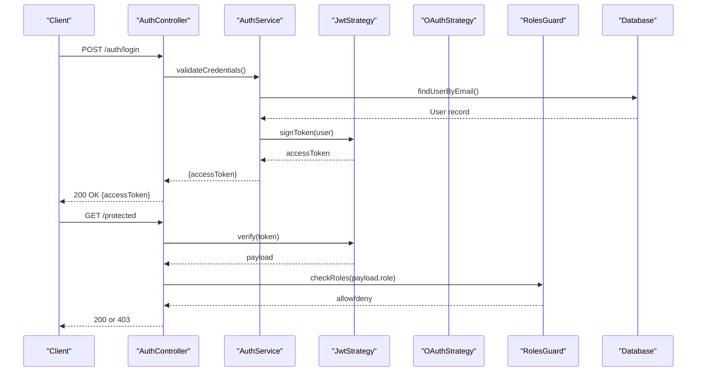
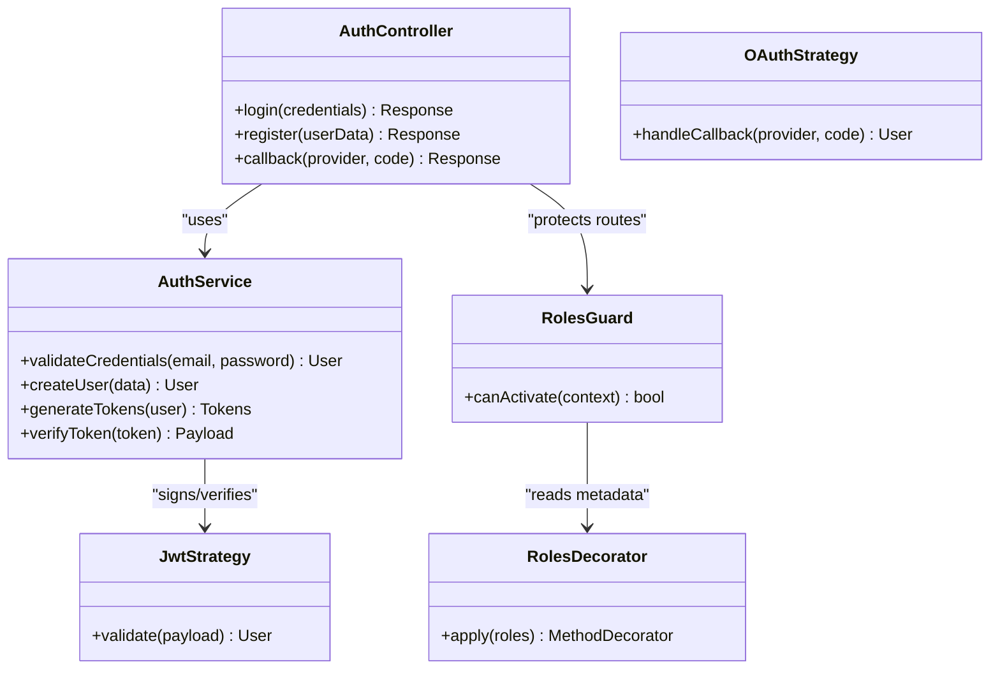
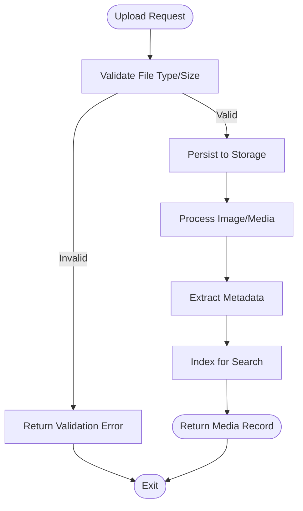
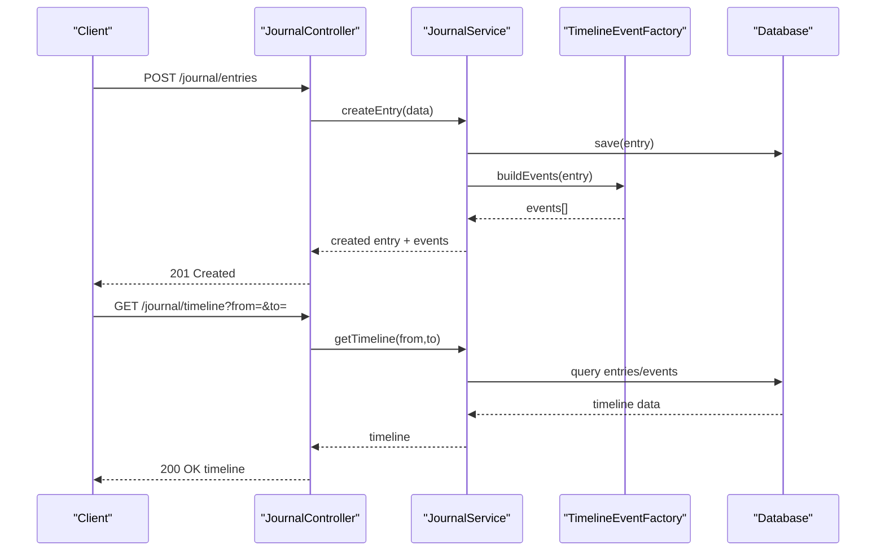
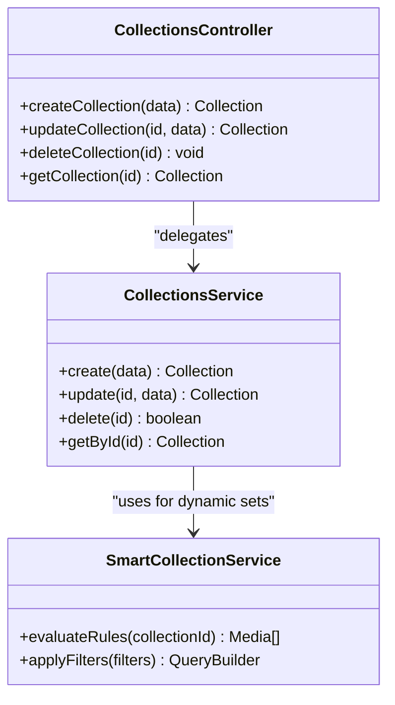
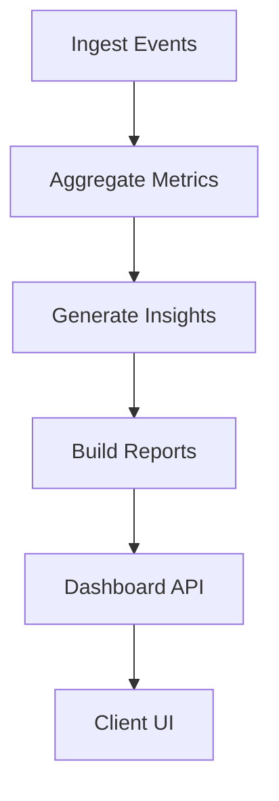
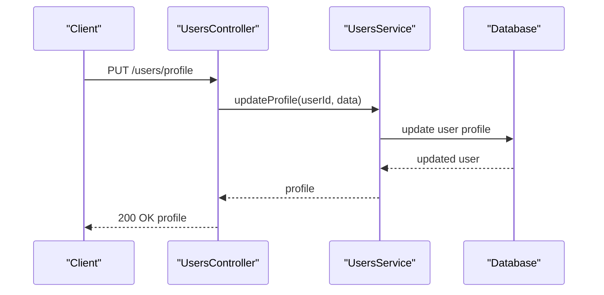
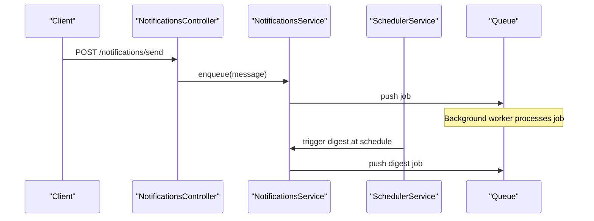
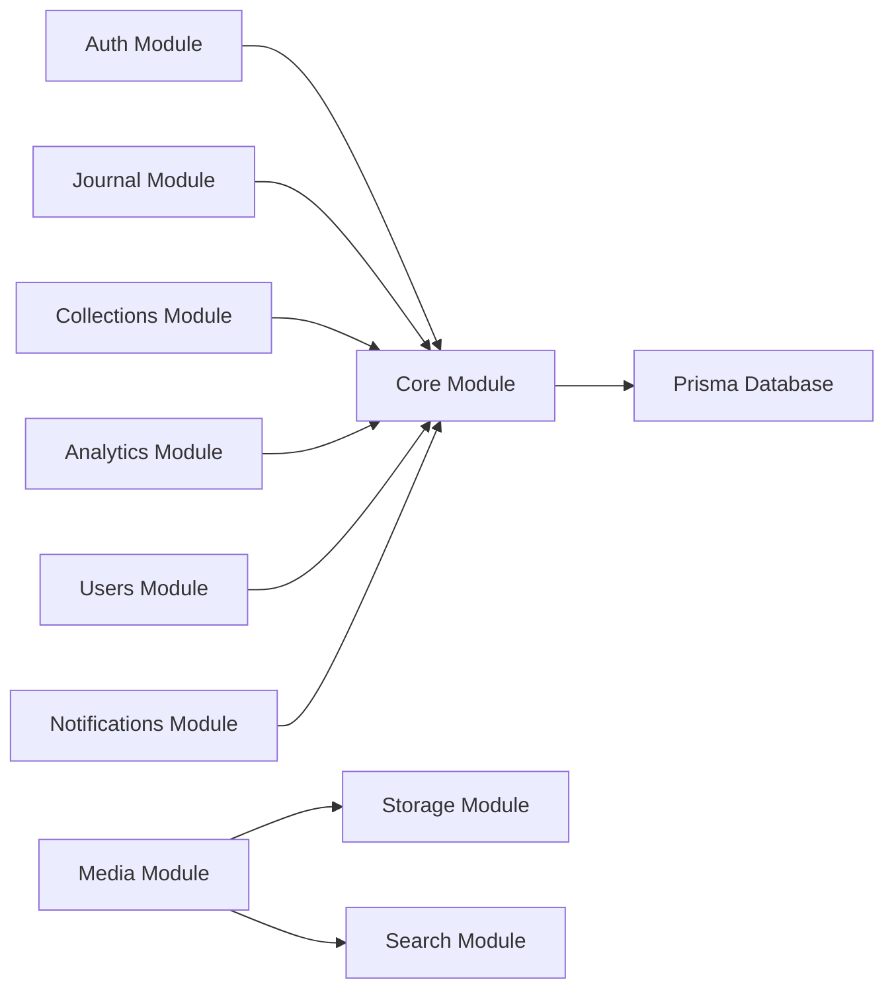

# Features & Modules

<cite>
**Referenced Files in This Document**
- [app.module.ts](file://apps/backend/src/app.module.ts)
- [auth.controller.ts](file://apps/backend/src/auth/auth.controller.ts)
- [auth.service.ts](file://apps/backend/src/auth/auth.service.ts)
- [auth.module.ts](file://apps/backend/src/auth/auth.module.ts)
- [jwt.strategy.ts](file://apps/backend/src/auth/strategies/jwt.strategy.ts)
- [oauth.strategy.ts](file://apps/backend/src/auth/strategies/oauth.strategy.ts)
- [roles.decorator.ts](file://apps/backend/src/auth/decorators/roles.decorator.ts)
- [roles.guard.ts](file://apps/backend/src/auth/guards/roles.guard.ts)
- [media.controller.ts](file://apps/backend/src/media/media.controller.ts)
- [media.service.ts](file://apps/backend/src/media/media.service.ts)
- [media-metadata.service.ts](file://apps/backend/src/media/media-metadata.service.ts)
- [upload.service.ts](file://apps/backend/src/storage/upload.service.ts)
- [image.service.ts](file://apps/backend/src/storage/image.service.ts)
- [search.controller.ts](file://apps/backend/src/search/search.controller.ts)
- [search.service.ts](file://apps/backend/src/search/search.service.ts)
- [journal.controller.ts](file://apps/backend/src/journal/journal.controller.ts)
- [journal.service.ts](file://apps/backend/src/journal/journal.service.ts)
- [timeline-event-factory.ts](file://apps/backend/src/journal/timeline-event-factory.ts)
- [collections.controller.ts](file://apps/backend/src/collections/collections.controller.ts)
- [collections.service.ts](file://apps/backend/src/collections/collections.service.ts)
- [smart-collection.service.ts](file://apps/backend/src/collections/smart-collection.service.ts)
- [analytics.controller.ts](file://apps/backend/src/analytics/analytics.controller.ts)
- [analytics.service.ts](file://apps/backend/src/analytics/analytics.service.ts)
- [insights.service.ts](file://apps/backend/src/analytics/insights.service.ts)
- [streak.service.ts](file://apps/backend/src/analytics/streak.service.ts)
- [users.controller.ts](file://apps/backend/src/users/users.controller.ts)
- [users.service.ts](file://apps/backend/src/users/users.service.ts)
- [notifications.controller.ts](file://apps/backend/src/notifications/notifications.controller.ts)
- [notifications.service.ts](file://apps/backend/src/notifications/notifications.service.ts)
- [scheduler.service.ts](file://apps/backend/src/notifications/scheduler.service.ts)
- [schema.prisma](file://apps/backend/prisma/schema.prisma)
</cite>

## Table of Contents
1. [Introduction](#introduction)
2. [Project Structure](#project-structure)
3. [Core Components](#core-components)
4. [Architecture Overview](#architecture-overview)
5. [Detailed Component Analysis](#detailed-component-analysis)
6. [Dependency Analysis](#dependency-analysis)
7. [Performance Considerations](#performance-considerations)
8. [Troubleshooting Guide](#troubleshooting-guide)
9. [Conclusion](#conclusion)

## Introduction
This document provides comprehensive feature documentation for Chronicle Your Media Story, focusing on the backend modules that power authentication, media management, journaling, collections, analytics, user management, and notifications. It explains how JWT-based authentication with role-based authorization and OAuth integration works, how media is uploaded and processed, how rich journal entries are managed with emotional tracking and timeline generation, how collections (including smart collections) are organized and shared, and how analytics and insights are generated from consumption patterns. It also covers user profile customization and notification scheduling.

## Project Structure
The application follows a modular NestJS architecture where each feature area is encapsulated in its own module with controllers, services, repositories, DTOs, and supporting utilities. Core cross-cutting concerns such as storage, caching, transactions, and observability are provided via shared modules. The Prisma schema defines the data model used across features.

```mermaid
graph TB
subgraph "Auth"
AC["auth.controller.ts"]
AS["auth.service.ts"]
AM["auth.module.ts"]
JWS["jwt.strategy.ts"]
OAS["oauth.strategy.ts"]
RG["roles.guard.ts"]
RD["roles.decorator.ts"]
end
subgraph "Media"
MC["media.controller.ts"]
MS["media.service.ts"]
MMS["media-metadata.service.ts"]
US["upload.service.ts"]
IS["image.service.ts"]
end
subgraph "Search"
SC["search.controller.ts"]
SS["search.service.ts"]
end
subgraph "Journal"
JC["journal.controller.ts"]
JS["journal.service.ts"]
TEF["timeline-event-factory.ts"]
end
subgraph "Collections"
CC["collections.controller.ts"]
CS["collections.service.ts"]
SCS["smart-collection.service.ts"]
end
subgraph "Analytics"
ALC["analytics.controller.ts"]
ALS["analytics.service.ts"]
INS["insights.service.ts"]
STR["streak.service.ts"]
end
subgraph "Users"
UC["users.controller.ts"]
USV["users.service.ts"]
end
subgraph "Notifications"
NC["notifications.controller.ts"]
NS["notifications.service.ts"]
SCH["scheduler.service.ts"]
end
DB["schema.prisma"]
AC --> AS
AS --> DB
MC --> MS
MS --> US
MS --> IS
MS --> MMS
SC --> SS
JC --> JS
JS --> TEF
CC --> CS
CS --> SCS
ALC --> ALS
ALS --> INS
ALS --> STR
UC --> USV
NC --> NS
NS --> SCH
```

**Diagram sources**
- [auth.controller.ts](file://apps/backend/src/auth/auth.controller.ts)
- [auth.service.ts](file://apps/backend/src/auth/auth.service.ts)
- [auth.module.ts](file://apps/backend/src/auth/auth.module.ts)
- [jwt.strategy.ts](file://apps/backend/src/auth/strategies/jwt.strategy.ts)
- [oauth.strategy.ts](file://apps/backend/src/auth/strategies/oauth.strategy.ts)
- [roles.guard.ts](file://apps/backend/src/auth/guards/roles.guard.ts)
- [roles.decorator.ts](file://apps/backend/src/auth/decorators/roles.decorator.ts)
- [media.controller.ts](file://apps/backend/src/media/media.controller.ts)
- [media.service.ts](file://apps/backend/src/media/media.service.ts)
- [media-metadata.service.ts](file://apps/backend/src/media/media-metadata.service.ts)
- [upload.service.ts](file://apps/backend/src/storage/upload.service.ts)
- [image.service.ts](file://apps/backend/src/storage/image.service.ts)
- [search.controller.ts](file://apps/backend/src/search/search.controller.ts)
- [search.service.ts](file://apps/backend/src/search/search.service.ts)
- [journal.controller.ts](file://apps/backend/src/journal/journal.controller.ts)
- [journal.service.ts](file://apps/backend/src/journal/journal.service.ts)
- [timeline-event-factory.ts](file://apps/backend/src/journal/timeline-event-factory.ts)
- [collections.controller.ts](file://apps/backend/src/collections/collections.controller.ts)
- [collections.service.ts](file://apps/backend/src/collections/collections.service.ts)
- [smart-collection.service.ts](file://apps/backend/src/collections/smart-collection.service.ts)
- [analytics.controller.ts](file://apps/backend/src/analytics/analytics.controller.ts)
- [analytics.service.ts](file://apps/backend/src/analytics/analytics.service.ts)
- [insights.service.ts](file://apps/backend/src/analytics/insights.service.ts)
- [streak.service.ts](file://apps/backend/src/analytics/streak.service.ts)
- [users.controller.ts](file://apps/backend/src/users/users.controller.ts)
- [users.service.ts](file://apps/backend/src/users/users.service.ts)
- [notifications.controller.ts](file://apps/backend/src/notifications/notifications.controller.ts)
- [notifications.service.ts](file://apps/backend/src/notifications/notifications.service.ts)
- [scheduler.service.ts](file://apps/backend/src/notifications/scheduler.service.ts)
- [schema.prisma](file://apps/backend/prisma/schema.prisma)

**Section sources**
- [app.module.ts](file://apps/backend/src/app.module.ts)
- [schema.prisma](file://apps/backend/prisma/schema.prisma)

## Core Components
- Authentication: JWT strategy, OAuth strategies, role-based guards and decorators, token issuance and validation.
- Media Management: Upload handling, image processing, metadata extraction, search indexing.
- Journal System: Entry creation/editing, emotion tracking, timeline event generation.
- Collections: CRUD, smart collection rules, collaboration permissions.
- Analytics: Consumption metrics, insights generation, streak tracking.
- Users: Profile management, preferences, settings.
- Notifications: Queued delivery, scheduling, digesting.

**Section sources**
- [auth.module.ts](file://apps/backend/src/auth/auth.module.ts)
- [media.service.ts](file://apps/backend/src/media/media.service.ts)
- [journal.service.ts](file://apps/backend/src/journal/journal.service.ts)
- [collections.service.ts](file://apps/backend/src/collections/collections.service.ts)
- [analytics.service.ts](file://apps/backend/src/analytics/analytics.service.ts)
- [users.service.ts](file://apps/backend/src/users/users.service.ts)
- [notifications.service.ts](file://apps/backend/src/notifications/notifications.service.ts)

## Architecture Overview
The system uses NestJS modules to encapsulate domain functionality. Controllers expose HTTP endpoints, services implement business logic, and repositories interact with the database via Prisma. Cross-cutting concerns like storage, caching, and queues are integrated through dedicated modules.

**Diagram sources**
- [auth.controller.ts](file://apps/backend/src/auth/auth.controller.ts)
- [auth.service.ts](file://apps/backend/src/auth/auth.service.ts)
- [jwt.strategy.ts](file://apps/backend/src/auth/strategies/jwt.strategy.ts)
- [oauth.strategy.ts](file://apps/backend/src/auth/strategies/oauth.strategy.ts)
- [roles.guard.ts](file://apps/backend/src/auth/guards/roles.guard.ts)

**Section sources**
- [auth.controller.ts](file://apps/backend/src/auth/auth.controller.ts)
- [auth.service.ts](file://apps/backend/src/auth/auth.service.ts)
- [jwt.strategy.ts](file://apps/backend/src/auth/strategies/jwt.strategy.ts)
- [oauth.strategy.ts](file://apps/backend/src/auth/strategies/oauth.strategy.ts)
- [roles.guard.ts](file://apps/backend/src/auth/guards/roles.guard.ts)

## Detailed Component Analysis

### Authentication System
- JWT tokens: Issued upon successful login; validated by a strategy that extracts and verifies tokens from requests.
- Role-based authorization: Guards enforce roles defined via decorators on controller methods.
- OAuth integration: Strategies support external providers; callbacks map provider responses to local user accounts.

**Diagram sources**
- [auth.controller.ts](file://apps/backend/src/auth/auth.controller.ts)
- [auth.service.ts](file://apps/backend/src/auth/auth.service.ts)
- [jwt.strategy.ts](file://apps/backend/src/auth/strategies/jwt.strategy.ts)
- [oauth.strategy.ts](file://apps/backend/src/auth/strategies/oauth.strategy.ts)
- [roles.guard.ts](file://apps/backend/src/auth/guards/roles.guard.ts)
- [roles.decorator.ts](file://apps/backend/src/auth/decorators/roles.decorator.ts)

**Section sources**
- [auth.controller.ts](file://apps/backend/src/auth/auth.controller.ts)
- [auth.service.ts](file://apps/backend/src/auth/auth.service.ts)
- [jwt.strategy.ts](file://apps/backend/src/auth/strategies/jwt.strategy.ts)
- [oauth.strategy.ts](file://apps/backend/src/auth/strategies/oauth.strategy.ts)
- [roles.guard.ts](file://apps/backend/src/auth/guards/roles.guard.ts)
- [roles.decorator.ts](file://apps/backend/src/auth/decorators/roles.decorator.ts)

### Media Management
- Upload processing: Handles multipart uploads, validates file types and sizes, and persists files via storage service.
- Metadata extraction: Extracts technical and descriptive metadata for media items.
- Search functionality: Indexes searchable fields and supports queries across media library.

**Diagram sources**
- [media.controller.ts](file://apps/backend/src/media/media.controller.ts)
- [media.service.ts](file://apps/backend/src/media/media.service.ts)
- [upload.service.ts](file://apps/backend/src/storage/upload.service.ts)
- [image.service.ts](file://apps/backend/src/storage/image.service.ts)
- [media-metadata.service.ts](file://apps/backend/src/media/media-metadata.service.ts)
- [search.controller.ts](file://apps/backend/src/search/search.controller.ts)
- [search.service.ts](file://apps/backend/src/search/search.service.ts)

**Section sources**
- [media.controller.ts](file://apps/backend/src/media/media.controller.ts)
- [media.service.ts](file://apps/backend/src/media/media.service.ts)
- [upload.service.ts](file://apps/backend/src/storage/upload.service.ts)
- [image.service.ts](file://apps/backend/src/storage/image.service.ts)
- [media-metadata.service.ts](file://apps/backend/src/media/media-metadata.service.ts)
- [search.controller.ts](file://apps/backend/src/search/search.controller.ts)
- [search.service.ts](file://apps/backend/src/search/search.service.ts)

### Journal System
- Rich text editing: Supports structured content and formatting for journal entries.
- Emotional tracking: Captures mood/emotion per entry and aggregates over time.
- Timeline generation: Produces chronological events linked to media and journal entries.

**Diagram sources**
- [journal.controller.ts](file://apps/backend/src/journal/journal.controller.ts)
- [journal.service.ts](file://apps/backend/src/journal/journal.service.ts)
- [timeline-event-factory.ts](file://apps/backend/src/journal/timeline-event-factory.ts)

**Section sources**
- [journal.controller.ts](file://apps/backend/src/journal/journal.controller.ts)
- [journal.service.ts](file://apps/backend/src/journal/journal.service.ts)
- [timeline-event-factory.ts](file://apps/backend/src/journal/timeline-event-factory.ts)

### Collections Management
- CRUD operations: Create, read, update, delete collections with ownership and membership.
- Smart collections: Rule-based auto-population based on tags, dates, genres, and other attributes.
- Collaboration: Permissions for sharing and co-editing collections.

**Diagram sources**
- [collections.controller.ts](file://apps/backend/src/collections/collections.controller.ts)
- [collections.service.ts](file://apps/backend/src/collections/collections.service.ts)
- [smart-collection.service.ts](file://apps/backend/src/collections/smart-collection.service.ts)

**Section sources**
- [collections.controller.ts](file://apps/backend/src/collections/collections.controller.ts)
- [collections.service.ts](file://apps/backend/src/collections/collections.service.ts)
- [smart-collection.service.ts](file://apps/backend/src/collections/smart-collection.service.ts)

### Analytics Engine
- Consumption patterns: Tracks views, completions, re-watches, and session durations.
- Insights generation: Aggregates metrics to produce personalized insights and recommendations.
- Reporting features: Provides dashboards and summaries for user behavior and trends.

**Diagram sources**
- [analytics.controller.ts](file://apps/backend/src/analytics/analytics.controller.ts)
- [analytics.service.ts](file://apps/backend/src/analytics/analytics.service.ts)
- [insights.service.ts](file://apps/backend/src/analytics/insights.service.ts)
- [streak.service.ts](file://apps/backend/src/analytics/streak.service.ts)

**Section sources**
- [analytics.controller.ts](file://apps/backend/src/analytics/analytics.controller.ts)
- [analytics.service.ts](file://apps/backend/src/analytics/analytics.service.ts)
- [insights.service.ts](file://apps/backend/src/analytics/insights.service.ts)
- [streak.service.ts](file://apps/backend/src/analytics/streak.service.ts)

### User Management and Profile Customization
- User profiles: Manage personal information, avatar, bio, and preferences.
- Settings: Configure notification preferences, theme, and privacy options.
- Account lifecycle: Registration, updates, and deactivation flows.

**Diagram sources**
- [users.controller.ts](file://apps/backend/src/users/users.controller.ts)
- [users.service.ts](file://apps/backend/src/users/users.service.ts)

**Section sources**
- [users.controller.ts](file://apps/backend/src/users/users.controller.ts)
- [users.service.ts](file://apps/backend/src/users/users.service.ts)

### Notification Systems
- Queued delivery: Asynchronous processing ensures reliable delivery.
- Scheduling: Cron-like jobs trigger reminders and digests.
- Digesting: Aggregates notifications into periodic summaries.

**Diagram sources**
- [notifications.controller.ts](file://apps/backend/src/notifications/notifications.controller.ts)
- [notifications.service.ts](file://apps/backend/src/notifications/notifications.service.ts)
- [scheduler.service.ts](file://apps/backend/src/notifications/scheduler.service.ts)

**Section sources**
- [notifications.controller.ts](file://apps/backend/src/notifications/notifications.controller.ts)
- [notifications.service.ts](file://apps/backend/src/notifications/notifications.service.ts)
- [scheduler.service.ts](file://apps/backend/src/notifications/scheduler.service.ts)

## Dependency Analysis
Modules are loosely coupled through well-defined interfaces. Controllers depend on services; services depend on repositories and external utilities. Shared modules provide cross-cutting capabilities.

**Diagram sources**
- [app.module.ts](file://apps/backend/src/app.module.ts)
- [schema.prisma](file://apps/backend/prisma/schema.prisma)

**Section sources**
- [app.module.ts](file://apps/backend/src/app.module.ts)
- [schema.prisma](file://apps/backend/prisma/schema.prisma)

## Performance Considerations
- Use pagination and filtering for large datasets in media and collections.
- Cache frequently accessed metadata and analytics aggregations.
- Offload heavy tasks (image processing, email sending) to background workers.
- Optimize database queries with proper indexes and selective field retrieval.

[No sources needed since this section provides general guidance]

## Troubleshooting Guide
- Authentication failures: Verify JWT secret configuration and token expiration settings. Ensure OAuth client credentials are correct.
- Upload errors: Check file size limits, MIME type validation, and storage permissions.
- Search issues: Confirm indexing pipeline runs after media creation/update.
- Notification delays: Inspect queue health and scheduler jobs.

**Section sources**
- [auth.service.ts](file://apps/backend/src/auth/auth.service.ts)
- [upload.service.ts](file://apps/backend/src/storage/upload.service.ts)
- [search.service.ts](file://apps/backend/src/search/search.service.ts)
- [notifications.service.ts](file://apps/backend/src/notifications/notifications.service.ts)

## Conclusion
Chronicle Your Media Story’s backend delivers a robust set of features centered around secure authentication, flexible media management, expressive journaling, intelligent collections, actionable analytics, user-centric profiles, and reliable notifications. The modular design promotes maintainability and scalability while enabling rich user experiences across platforms.