# AI-Powered Prompt Generation

<cite>
**Referenced Files in This Document**
- [prompt.service.ts](file://apps/backend/src/journal/prompt.service.ts)
- [journal-event.service.ts](file://apps/backend/src/journal/journal-event.service.ts)
- [timeline-event-factory.ts](file://apps/backend/src/journal/timeline-event-factory.ts)
- [interaction-event.service.ts](file://apps/backend/src/interaction/interaction-event.service.ts)
- [scheduler.service.ts](file://apps/backend/src/notifications/scheduler.service.ts)
- [notification-queue.service.ts](file://apps/backend/src/notifications/notification-queue.service.ts)
- [media-metadata.service.ts](file://apps/backend/src/media/media-metadata.service.ts)
- [library-statistics.service.ts](file://apps/backend/src/library/library-statistics.service.ts)
- [analytics-aggregation.service.ts](file://apps/backend/src/analytics/analytics-aggregation.service.ts)
- [streak.service.ts](file://apps/backend/src/analytics/streak.service.ts)
- [redis.service.ts](file://apps/backend/src/redis/redis.service.ts)
- [cache-invalidation.service.ts](file://apps/backend/src/hardening/cache-invalidation.service.ts)
- [performance-audit.service.ts](file://apps/backend/src/hardening/performance-audit.service.ts)
- [query-analysis.service.ts](file://apps/backend/src/hardening/query-analysis.service.ts)
- [database-optimization.service.ts](file://apps/backend/src/hardening/database-optimization.service.ts)
- [rate-limit-audit.service.ts](file://apps/backend/src/hardening/rate-limit-audit.service.ts)
- [configuration.ts](file://apps/backend/src/config/configuration.ts)
- [env.validation.ts](file://apps/backend/src/config/env.validation.ts)
- [bullmq.module.ts](file://apps/backend/src/bullmq/bullmq.module.ts)
- [core.module.ts](file://apps/backend/src/core/core.module.ts)
- [app.module.ts](file://apps/backend/src/app.module.ts)
- [main.ts](file://apps/backend/src/main.ts)
</cite>

## Table of Contents
1. [Introduction](#introduction)
2. [Project Structure](#project-structure)
3. [Core Components](#core-components)
4. [Architecture Overview](#architecture-overview)
5. [Detailed Component Analysis](#detailed-component-analysis)
6. [Dependency Analysis](#dependency-analysis)
7. [Performance Considerations](#performance-considerations)
8. [Troubleshooting Guide](#troubleshooting-guide)
9. [Conclusion](#conclusion)
10. [Appendices](#appendices)

## Introduction
This document explains the AI-powered prompt generation system that creates personalized prompts based on user context, media history, and emotional state. It covers the service architecture, template systems, customization options, integration with external AI services, caching strategies, performance optimization, event-driven triggers, and feedback loops. The goal is to provide a clear understanding for both technical and non-technical readers.

## Project Structure
The prompt generation system resides primarily in the backend NestJS application under the journal module, with supporting services for events, media analytics, notifications, caching, and configuration. Key areas include:
- Journal module: prompt orchestration, event handling, and timeline-based triggers
- Interaction module: captures user interactions that can trigger prompts
- Notifications module: scheduling and queuing for time-based prompt delivery
- Media and analytics modules: supply context such as recent media activity and streaks
- Hardening and observability: caching, rate limiting, query analysis, and performance auditing
- Configuration and environment validation: feature flags and API keys for AI providers
- BullMQ module: background job processing for asynchronous prompt generation

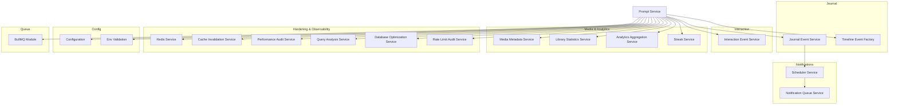

**Diagram sources**
- [prompt.service.ts](file://apps/backend/src/journal/prompt.service.ts)
- [journal-event.service.ts](file://apps/backend/src/journal/journal-event.service.ts)
- [timeline-event-factory.ts](file://apps/backend/src/journal/timeline-event-factory.ts)
- [interaction-event.service.ts](file://apps/backend/src/interaction/interaction-event.service.ts)
- [scheduler.service.ts](file://apps/backend/src/notifications/scheduler.service.ts)
- [notification-queue.service.ts](file://apps/backend/src/notifications/notification-queue.service.ts)
- [media-metadata.service.ts](file://apps/backend/src/media/media-metadata.service.ts)
- [library-statistics.service.ts](file://apps/backend/src/library/library-statistics.service.ts)
- [analytics-aggregation.service.ts](file://apps/backend/src/analytics/analytics-aggregation.service.ts)
- [streak.service.ts](file://apps/backend/src/analytics/streak.service.ts)
- [redis.service.ts](file://apps/backend/src/redis/redis.service.ts)
- [cache-invalidation.service.ts](file://apps/backend/src/hardening/cache-invalidation.service.ts)
- [performance-audit.service.ts](file://apps/backend/src/hardening/performance-audit.service.ts)
- [query-analysis.service.ts](file://apps/backend/src/hardening/query-analysis.service.ts)
- [database-optimization.service.ts](file://apps/backend/src/hardening/database-optimization.service.ts)
- [rate-limit-audit.service.ts](file://apps/backend/src/hardening/rate-limit-audit.service.ts)
- [configuration.ts](file://apps/backend/src/config/configuration.ts)
- [env.validation.ts](file://apps/backend/src/config/env.validation.ts)
- [bullmq.module.ts](file://apps/backend/src/bullmq/bullmq.module.ts)

**Section sources**
- [prompt.service.ts](file://apps/backend/src/journal/prompt.service.ts)
- [journal-event.service.ts](file://apps/backend/src/journal/journal-event.service.ts)
- [timeline-event-factory.ts](file://apps/backend/src/journal/timeline-event-factory.ts)
- [interaction-event.service.ts](file://apps/backend/src/interaction/interaction-event.service.ts)
- [scheduler.service.ts](file://apps/backend/src/notifications/scheduler.service.ts)
- [notification-queue.service.ts](file://apps/backend/src/notifications/notification-queue.service.ts)
- [media-metadata.service.ts](file://apps/backend/src/media/media-metadata.service.ts)
- [library-statistics.service.ts](file://apps/backend/src/library/library-statistics.service.ts)
- [analytics-aggregation.service.ts](file://apps/backend/src/analytics/analytics-aggregation.service.ts)
- [streak.service.ts](file://apps/backend/src/analytics/streak.service.ts)
- [redis.service.ts](file://apps/backend/src/redis/redis.service.ts)
- [cache-invalidation.service.ts](file://apps/backend/src/hardening/cache-invalidation.service.ts)
- [performance-audit.service.ts](file://apps/backend/src/hardening/performance-audit.service.ts)
- [query-analysis.service.ts](file://apps/backend/src/hardening/query-analysis.service.ts)
- [database-optimization.service.ts](file://apps/backend/src/hardening/database-optimization.service.ts)
- [rate-limit-audit.service.ts](file://apps/backend/src/hardening/rate-limit-audit.service.ts)
- [configuration.ts](file://apps/backend/src/config/configuration.ts)
- [env.validation.ts](file://apps/backend/src/config/env.validation.ts)
- [bullmq.module.ts](file://apps/backend/src/bullmq/bullmq.module.ts)

## Core Components
- Prompt Service: Orchestrates prompt generation by aggregating context from media history, user interactions, analytics, and streaks; applies templates; integrates with AI providers; caches results; and emits events for downstream consumers.
- Journal Event Service: Listens to journal-related events (e.g., entry created, updated) and triggers prompt generation when relevant.
- Timeline Event Factory: Builds timeline-based events (e.g., anniversaries, milestones) that drive contextual prompts.
- Interaction Event Service: Captures user interactions (e.g., viewing media, writing entries) and feeds them into the prompt pipeline.
- Scheduler and Notification Queue: Schedule periodic or time-based prompts and queue them for delivery via notifications.
- Media Metadata and Library Statistics: Provide recent media consumption patterns, completion status, and library insights used to personalize prompts.
- Analytics Aggregation and Streak Service: Supply aggregated metrics and streak data to inform emotional state and engagement levels.
- Redis Service and Cache Invalidation: Implement prompt caching and cache invalidation strategies to reduce latency and AI costs.
- Performance and Query Auditing: Monitor and optimize prompt generation performance and database queries.
- Configuration and Environment Validation: Manage AI provider settings, feature flags, and runtime parameters.
- BullMQ Module: Enables asynchronous processing of prompt generation tasks.

**Section sources**
- [prompt.service.ts](file://apps/backend/src/journal/prompt.service.ts)
- [journal-event.service.ts](file://apps/backend/src/journal/journal-event.service.ts)
- [timeline-event-factory.ts](file://apps/backend/src/journal/timeline-event-factory.ts)
- [interaction-event.service.ts](file://apps/backend/src/interaction/interaction-event.service.ts)
- [scheduler.service.ts](file://apps/backend/src/notifications/scheduler.service.ts)
- [notification-queue.service.ts](file://apps/backend/src/notifications/notification-queue.service.ts)
- [media-metadata.service.ts](file://apps/backend/src/media/media-metadata.service.ts)
- [library-statistics.service.ts](file://apps/backend/src/library/library-statistics.service.ts)
- [analytics-aggregation.service.ts](file://apps/backend/src/analytics/analytics-aggregation.service.ts)
- [streak.service.ts](file://apps/backend/src/analytics/streak.service.ts)
- [redis.service.ts](file://apps/backend/src/redis/redis.service.ts)
- [cache-invalidation.service.ts](file://apps/backend/src/hardening/cache-invalidation.service.ts)
- [performance-audit.service.ts](file://apps/backend/src/hardening/performance-audit.service.ts)
- [query-analysis.service.ts](file://apps/backend/src/hardening/query-analysis.service.ts)
- [database-optimization.service.ts](file://apps/backend/src/hardening/database-optimization.service.ts)
- [rate-limit-audit.service.ts](file://apps/backend/src/hardening/rate-limit-audit.service.ts)
- [configuration.ts](file://apps/backend/src/config/configuration.ts)
- [env.validation.ts](file://apps/backend/src/config/env.validation.ts)
- [bullmq.module.ts](file://apps/backend/src/bullmq/bullmq.module.ts)

## Architecture Overview
The system follows an event-driven architecture where user interactions and scheduled events trigger prompt generation. Contextual data is gathered from multiple services, processed through templates, and optionally enhanced by external AI services. Results are cached and delivered via notifications.

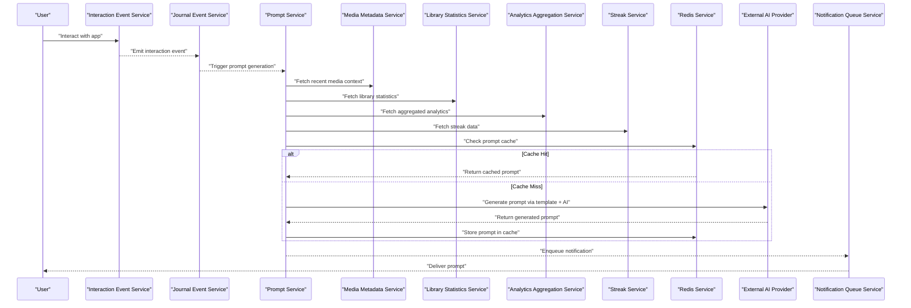

**Diagram sources**
- [interaction-event.service.ts](file://apps/backend/src/interaction/interaction-event.service.ts)
- [journal-event.service.ts](file://apps/backend/src/journal/journal-event.service.ts)
- [prompt.service.ts](file://apps/backend/src/journal/prompt.service.ts)
- [media-metadata.service.ts](file://apps/backend/src/media/media-metadata.service.ts)
- [library-statistics.service.ts](file://apps/backend/src/library/library-statistics.service.ts)
- [analytics-aggregation.service.ts](file://apps/backend/src/analytics/analytics-aggregation.service.ts)
- [streak.service.ts](file://apps/backend/src/analytics/streak.service.ts)
- [redis.service.ts](file://apps/backend/src/redis/redis.service.ts)
- [notification-queue.service.ts](file://apps/backend/src/notifications/notification-queue.service.ts)

## Detailed Component Analysis

### Prompt Service
Responsibilities:
- Orchestrate prompt generation using contextual inputs
- Apply template systems for different prompt types
- Integrate with external AI services for enhancement
- Implement caching strategies to reduce latency and cost
- Emit events for downstream consumers and integrate with queues

Key behaviors:
- Context aggregation from media, stats, analytics, and streaks
- Template selection based on user profile and current state
- AI provider invocation with structured prompts
- Cache lookup and write-through strategies
- Error handling and fallback mechanisms

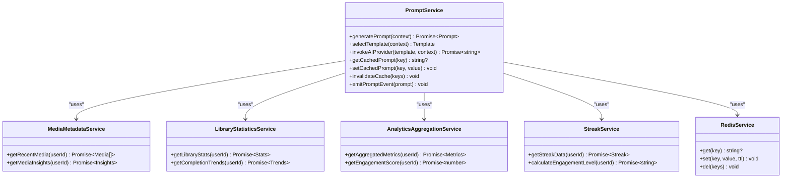

**Diagram sources**
- [prompt.service.ts](file://apps/backend/src/journal/prompt.service.ts)
- [media-metadata.service.ts](file://apps/backend/src/media/media-metadata.service.ts)
- [library-statistics.service.ts](file://apps/backend/src/library/library-statistics.service.ts)
- [analytics-aggregation.service.ts](file://apps/backend/src/analytics/analytics-aggregation.service.ts)
- [streak.service.ts](file://apps/backend/src/analytics/streak.service.ts)
- [redis.service.ts](file://apps/backend/src/redis/redis.service.ts)

**Section sources**
- [prompt.service.ts](file://apps/backend/src/journal/prompt.service.ts)
- [media-metadata.service.ts](file://apps/backend/src/media/media-metadata.service.ts)
- [library-statistics.service.ts](file://apps/backend/src/library/library-statistics.service.ts)
- [analytics-aggregation.service.ts](file://apps/backend/src/analytics/analytics-aggregation.service.ts)
- [streak.service.ts](file://apps/backend/src/analytics/streak.service.ts)
- [redis.service.ts](file://apps/backend/src/redis/redis.service.ts)

### Journal Event Service
Responsibilities:
- Listen to journal-related events (entry creation, updates)
- Trigger prompt generation when journal activity indicates reflection opportunities
- Coordinate with timeline events for contextual relevance

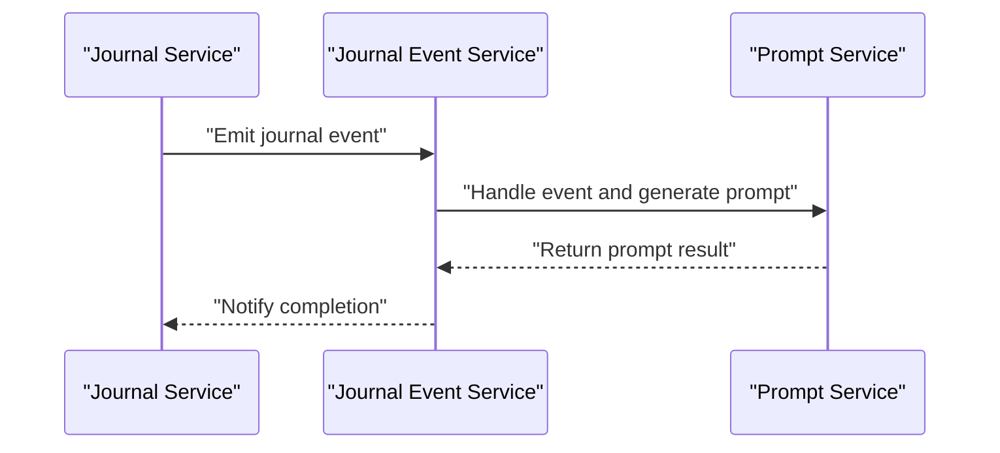

**Diagram sources**
- [journal-event.service.ts](file://apps/backend/src/journal/journal-event.service.ts)
- [prompt.service.ts](file://apps/backend/src/journal/prompt.service.ts)

**Section sources**
- [journal-event.service.ts](file://apps/backend/src/journal/journal-event.service.ts)
- [prompt.service.ts](file://apps/backend/src/journal/prompt.service.ts)

### Timeline Event Factory
Responsibilities:
- Create timeline-based events (anniversaries, milestones, seasonal reflections)
- Provide contextual triggers for prompt generation based on temporal patterns

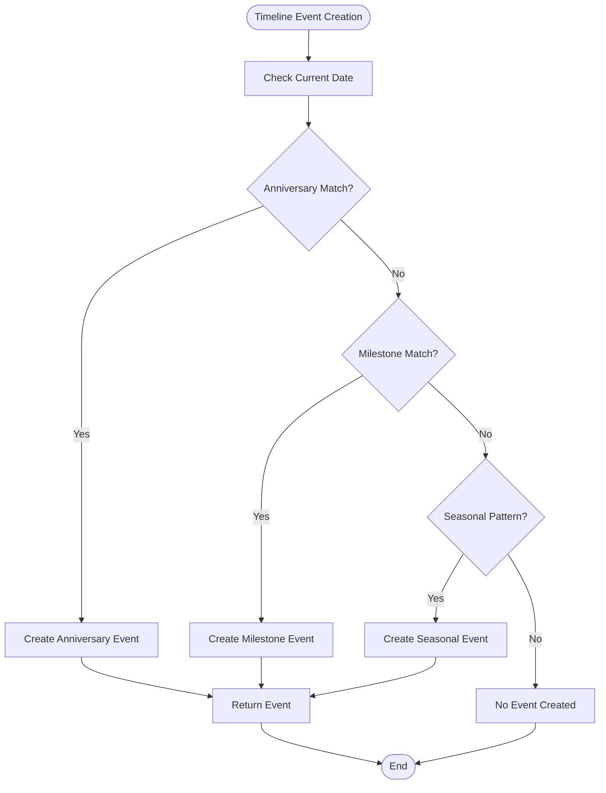

**Diagram sources**
- [timeline-event-factory.ts](file://apps/backend/src/journal/timeline-event-factory.ts)

**Section sources**
- [timeline-event-factory.ts](file://apps/backend/src/journal/timeline-event-factory.ts)

### Interaction Event Service
Responsibilities:
- Capture user interactions (media views, journal entries, navigation)
- Transform interactions into events that can trigger prompt generation
- Maintain interaction history for context enrichment

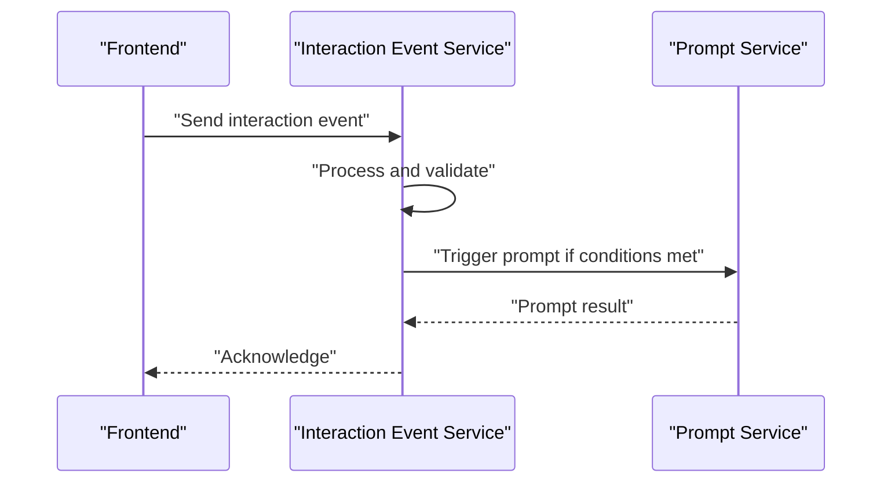

**Diagram sources**
- [interaction-event.service.ts](file://apps/backend/src/interaction/interaction-event.service.ts)
- [prompt.service.ts](file://apps/backend/src/journal/prompt.service.ts)

**Section sources**
- [interaction-event.service.ts](file://apps/backend/src/interaction/interaction-event.service.ts)
- [prompt.service.ts](file://apps/backend/src/journal/prompt.service.ts)

### Scheduler and Notification Queue
Responsibilities:
- Schedule time-based prompt generation (daily reminders, weekly reflections)
- Queue prompts for delivery through notification channels
- Handle retry logic and delivery confirmation

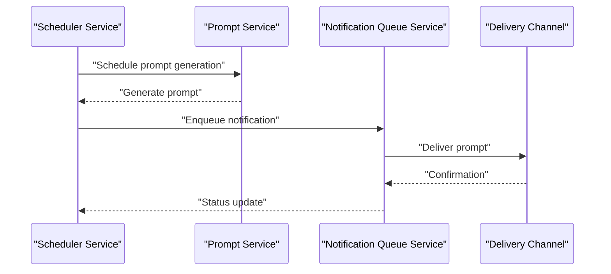

**Diagram sources**
- [scheduler.service.ts](file://apps/backend/src/notifications/scheduler.service.ts)
- [prompt.service.ts](file://apps/backend/src/journal/prompt.service.ts)
- [notification-queue.service.ts](file://apps/backend/src/notifications/notification-queue.service.ts)

**Section sources**
- [scheduler.service.ts](file://apps/backend/src/notifications/scheduler.service.ts)
- [prompt.service.ts](file://apps/backend/src/journal/prompt.service.ts)
- [notification-queue.service.ts](file://apps/backend/src/notifications/notification-queue.service.ts)

### Caching Strategy
Responsibilities:
- Implement prompt caching using Redis to reduce AI costs and improve response times
- Define cache keys based on user context and template selection
- Handle cache invalidation when context changes significantly

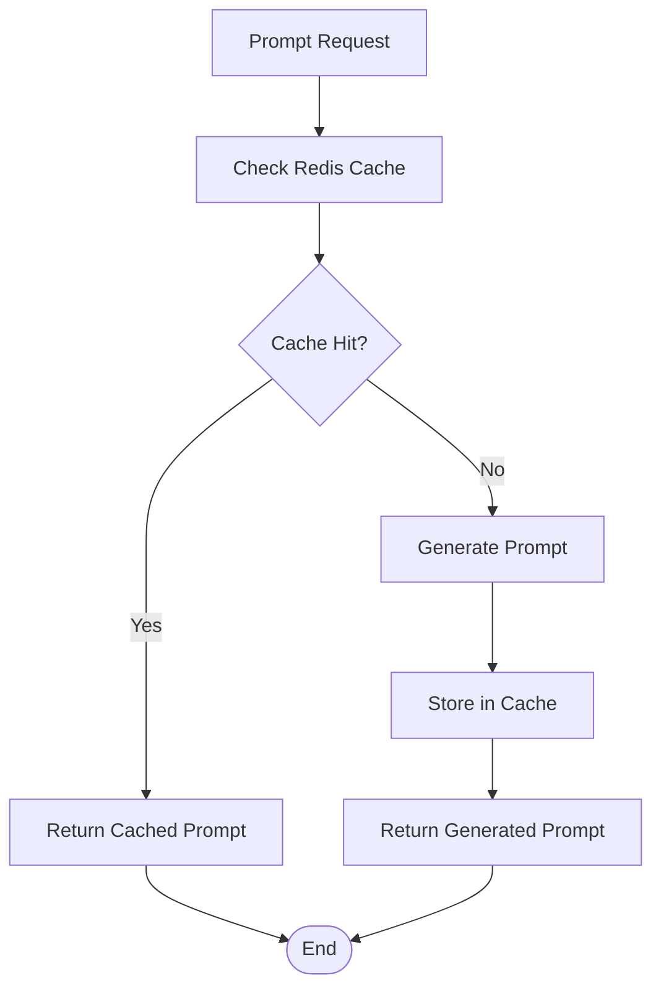

**Diagram sources**
- [redis.service.ts](file://apps/backend/src/redis/redis.service.ts)
- [cache-invalidation.service.ts](file://apps/backend/src/hardening/cache-invalidation.service.ts)
- [prompt.service.ts](file://apps/backend/src/journal/prompt.service.ts)

**Section sources**
- [redis.service.ts](file://apps/backend/src/redis/redis.service.ts)
- [cache-invalidation.service.ts](file://apps/backend/src/hardening/cache-invalidation.service.ts)
- [prompt.service.ts](file://apps/backend/src/journal/prompt.service.ts)

### External AI Integration
Responsibilities:
- Interface with external AI providers for prompt generation and enhancement
- Handle API authentication, rate limiting, and error responses
- Support multiple AI providers through configurable adapters

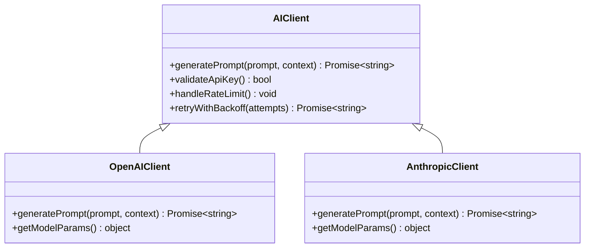

**Diagram sources**
- [prompt.service.ts](file://apps/backend/src/journal/prompt.service.ts)
- [configuration.ts](file://apps/backend/src/config/configuration.ts)
- [env.validation.ts](file://apps/backend/src/config/env.validation.ts)

**Section sources**
- [prompt.service.ts](file://apps/backend/src/journal/prompt.service.ts)
- [configuration.ts](file://apps/backend/src/config/configuration.ts)
- [env.validation.ts](file://apps/backend/src/config/env.validation.ts)

### Template System
Responsibilities:
- Define reusable prompt templates for different contexts and user segments
- Support dynamic variable substitution based on user context
- Allow template versioning and A/B testing capabilities

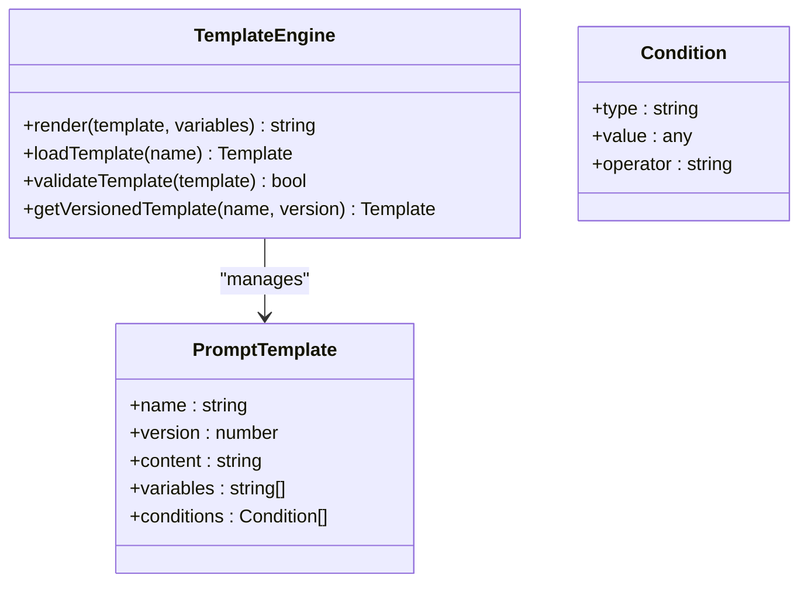

**Diagram sources**
- [prompt.service.ts](file://apps/backend/src/journal/prompt.service.ts)

**Section sources**
- [prompt.service.ts](file://apps/backend/src/journal/prompt.service.ts)

## Dependency Analysis
The prompt generation system has well-defined dependencies between components, with clear separation of concerns and minimal coupling.

```mermaid
graph TB
subgraph "Core Dependencies"
PS["Prompt Service"]
JES["Journal Event Service"]
IES["Interaction Event Service"]
TEF["Timeline Event Factory"]
end
subgraph "Context Providers"
MMS["Media Metadata Service"]
LSS["Library Statistics Service"]
AAS["Analytics Aggregation Service"]
STS["Streak Service"]
end
subgraph "Infrastructure"
RIS["Redis Service"]
BQM["BullMQ Module"]
CFG["Configuration"]
ENV["Env Validation"]
end
subgraph "Monitoring"
PAS["Performance Audit Service"]
QAS["Query Analysis Service"]
DAS["Database Optimization Service"]
RLAS["Rate Limit Audit Service"]
end
PS --> JES
PS --> IES
PS --> TEF
PS --> MMS
PS --> LSS
PS --> AAS
PS --> STS
PS --> RIS
PS --> BQM
PS --> CFG
PS --> ENV
PS --> PAS
PS --> QAS
PS --> DAS
PS --> RLAS
```

**Diagram sources**
- [prompt.service.ts](file://apps/backend/src/journal/prompt.service.ts)
- [journal-event.service.ts](file://apps/backend/src/journal/journal-event.service.ts)
- [interaction-event.service.ts](file://apps/backend/src/interaction/interaction-event.service.ts)
- [timeline-event-factory.ts](file://apps/backend/src/journal/timeline-event-factory.ts)
- [media-metadata.service.ts](file://apps/backend/src/media/media-metadata.service.ts)
- [library-statistics.service.ts](file://apps/backend/src/library/library-statistics.service.ts)
- [analytics-aggregation.service.ts](file://apps/backend/src/analytics/analytics-aggregation.service.ts)
- [streak.service.ts](file://apps/backend/src/analytics/streak.service.ts)
- [redis.service.ts](file://apps/backend/src/redis/redis.service.ts)
- [bullmq.module.ts](file://apps/backend/src/bullmq/bullmq.module.ts)
- [configuration.ts](file://apps/backend/src/config/configuration.ts)
- [env.validation.ts](file://apps/backend/src/config/env.validation.ts)
- [performance-audit.service.ts](file://apps/backend/src/hardening/performance-audit.service.ts)
- [query-analysis.service.ts](file://apps/backend/src/hardening/query-analysis.service.ts)
- [database-optimization.service.ts](file://apps/backend/src/hardening/database-optimization.service.ts)
- [rate-limit-audit.service.ts](file://apps/backend/src/hardening/rate-limit-audit.service.ts)

**Section sources**
- [prompt.service.ts](file://apps/backend/src/journal/prompt.service.ts)
- [journal-event.service.ts](file://apps/backend/src/journal/journal-event.service.ts)
- [interaction-event.service.ts](file://apps/backend/src/interaction/interaction-event.service.ts)
- [timeline-event-factory.ts](file://apps/backend/src/journal/timeline-event-factory.ts)
- [media-metadata.service.ts](file://apps/backend/src/media/media-metadata.service.ts)
- [library-statistics.service.ts](file://apps/backend/src/library/library-statistics.service.ts)
- [analytics-aggregation.service.ts](file://apps/backend/src/analytics/analytics-aggregation.service.ts)
- [streak.service.ts](file://apps/backend/src/analytics/streak.service.ts)
- [redis.service.ts](file://apps/backend/src/redis/redis.service.ts)
- [bullmq.module.ts](file://apps/backend/src/bullmq/bullmq.module.ts)
- [configuration.ts](file://apps/backend/src/config/configuration.ts)
- [env.validation.ts](file://apps/backend/src/config/env.validation.ts)
- [performance-audit.service.ts](file://apps/backend/src/hardening/performance-audit.service.ts)
- [query-analysis.service.ts](file://apps/backend/src/hardening/query-analysis.service.ts)
- [database-optimization.service.ts](file://apps/backend/src/hardening/database-optimization.service.ts)
- [rate-limit-audit.service.ts](file://apps/backend/src/hardening/rate-limit-audit.service.ts)

## Performance Considerations
- Caching Strategy: Use Redis to cache generated prompts and avoid redundant AI calls
- Rate Limiting: Implement rate limiting to prevent AI provider quota exhaustion
- Query Optimization: Analyze and optimize database queries used for context gathering
- Asynchronous Processing: Leverage BullMQ for background prompt generation tasks
- Performance Monitoring: Track prompt generation latency and success rates
- Database Optimization: Optimize queries and indexes for faster context retrieval
- Cache Invalidation: Implement intelligent cache invalidation based on context changes

**Section sources**
- [redis.service.ts](file://apps/backend/src/redis/redis.service.ts)
- [rate-limit-audit.service.ts](file://apps/backend/src/hardening/rate-limit-audit.service.ts)
- [query-analysis.service.ts](file://apps/backend/src/hardening/query-analysis.service.ts)
- [database-optimization.service.ts](file://apps/backend/src/hardening/database-optimization.service.ts)
- [performance-audit.service.ts](file://apps/backend/src/hardening/performance-audit.service.ts)
- [bullmq.module.ts](file://apps/backend/src/bullmq/bullmq.module.ts)

## Troubleshooting Guide
Common issues and solutions:
- AI Provider Errors: Check API keys, rate limits, and network connectivity
- Cache Misses: Verify cache key generation and TTL settings
- Event Processing Failures: Monitor event queues and retry mechanisms
- Performance Degradation: Analyze query performance and database load
- Context Data Issues: Validate data sources and ensure proper error handling

**Section sources**
- [performance-audit.service.ts](file://apps/backend/src/hardening/performance-audit.service.ts)
- [query-analysis.service.ts](file://apps/backend/src/hardening/query-analysis.service.ts)
- [database-optimization.service.ts](file://apps/backend/src/hardening/database-optimization.service.ts)
- [rate-limit-audit.service.ts](file://apps/backend/src/hardening/rate-limit-audit.service.ts)

## Conclusion
The AI-powered prompt generation system provides a robust, scalable solution for creating personalized prompts based on user context, media history, and emotional state. Through its event-driven architecture, comprehensive caching strategy, and flexible template system, it delivers timely and relevant prompts while maintaining high performance and reliability.

## Appendices

### Example Prompt Types
- Reflection Prompts: Based on recent media consumption and emotional state
- Memory Prompts: Triggered by anniversaries and milestones
- Engagement Prompts: Designed to encourage continued journaling
- Discovery Prompts: Suggest new content based on preferences and trends

### Contextual Personalization Examples
- Time-based personalization: Morning vs evening prompts
- Mood-based personalization: Adjusting tone based on emotional indicators
- History-based personalization: Referencing past entries and media
- Goal-oriented personalization: Aligning prompts with user objectives

### User Feedback Loops
- Prompt rating system for quality assessment
- Usage analytics to measure engagement
- A/B testing for prompt effectiveness
- Continuous learning from user interactions

**Section sources**
- [prompt.service.ts](file://apps/backend/src/journal/prompt.service.ts)
- [analytics-aggregation.service.ts](file://apps/backend/src/analytics/analytics-aggregation.service.ts)
- [streak.service.ts](file://apps/backend/src/analytics/streak.service.ts)