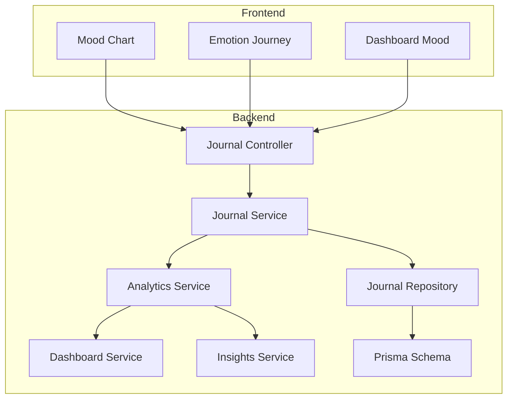
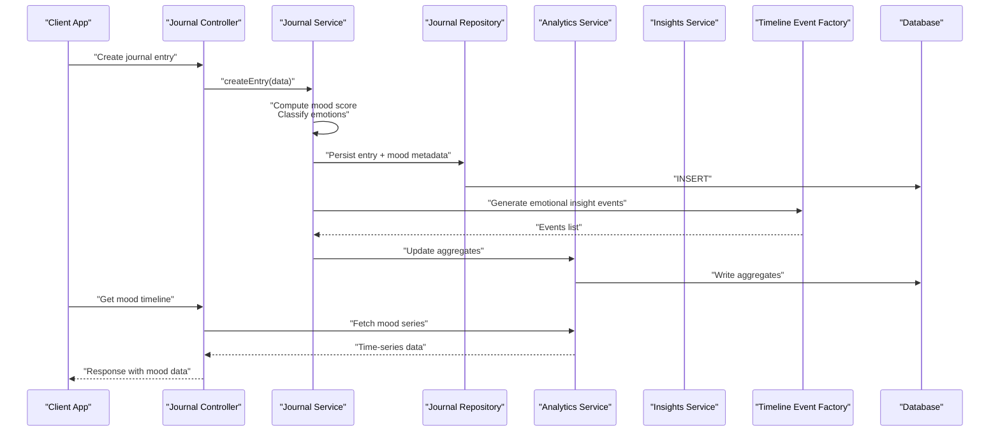
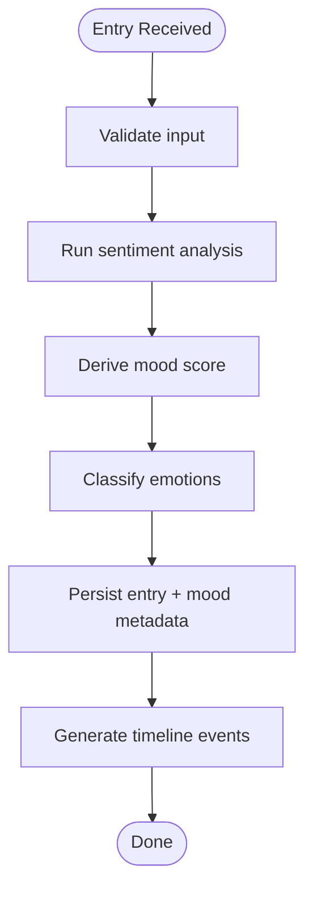
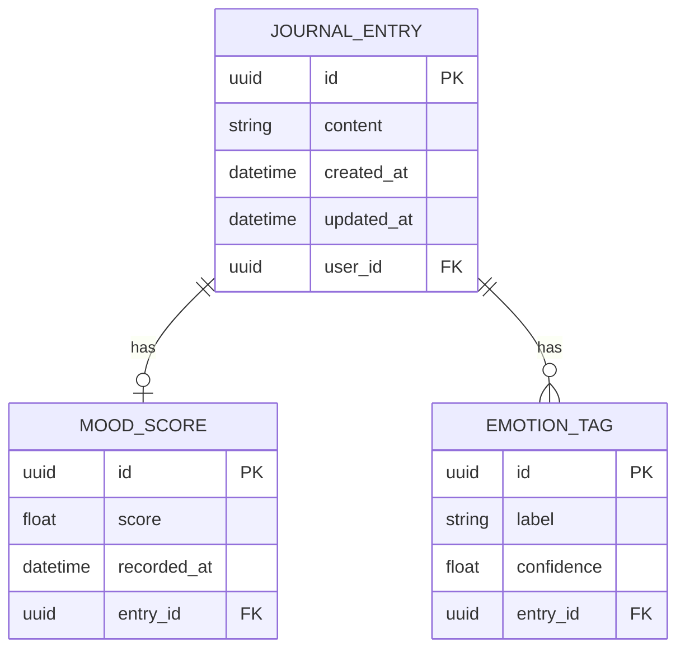
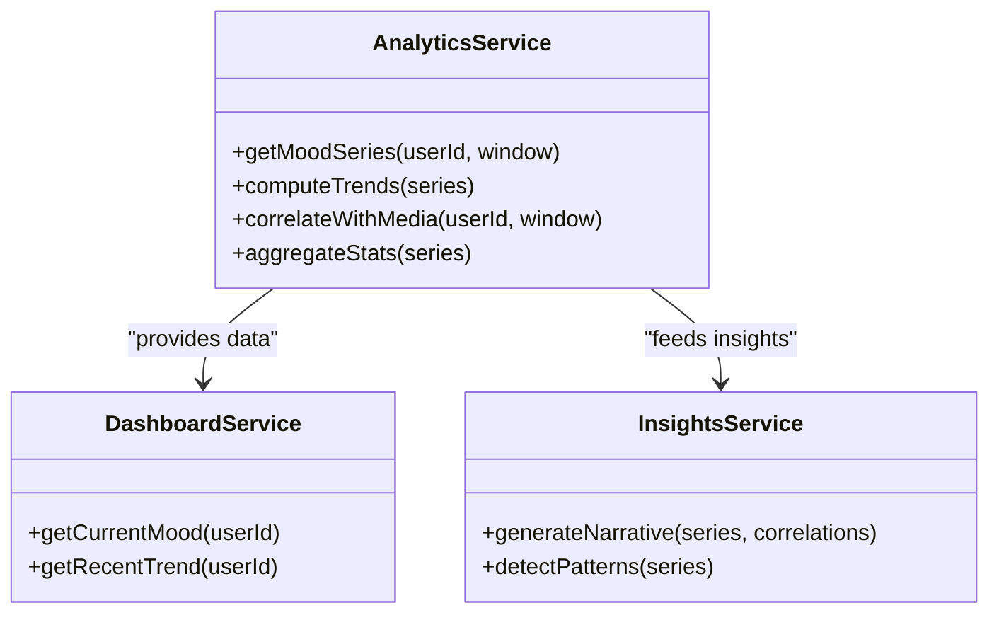
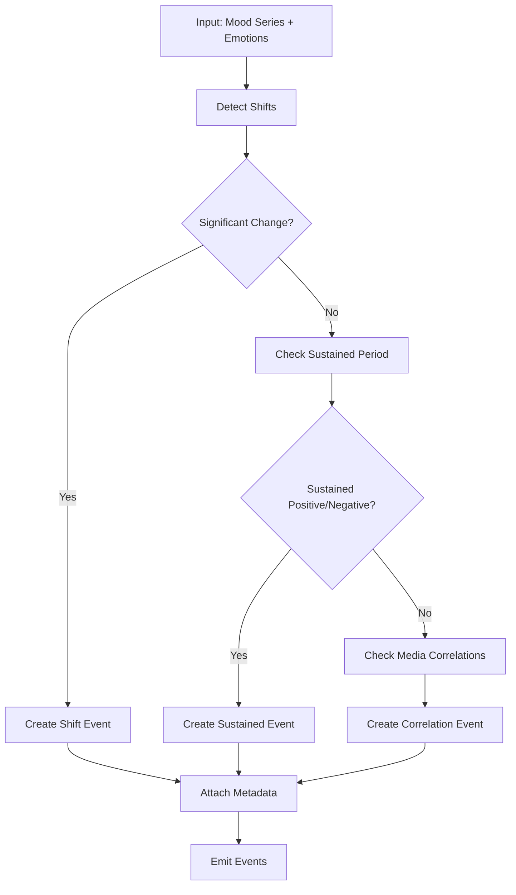
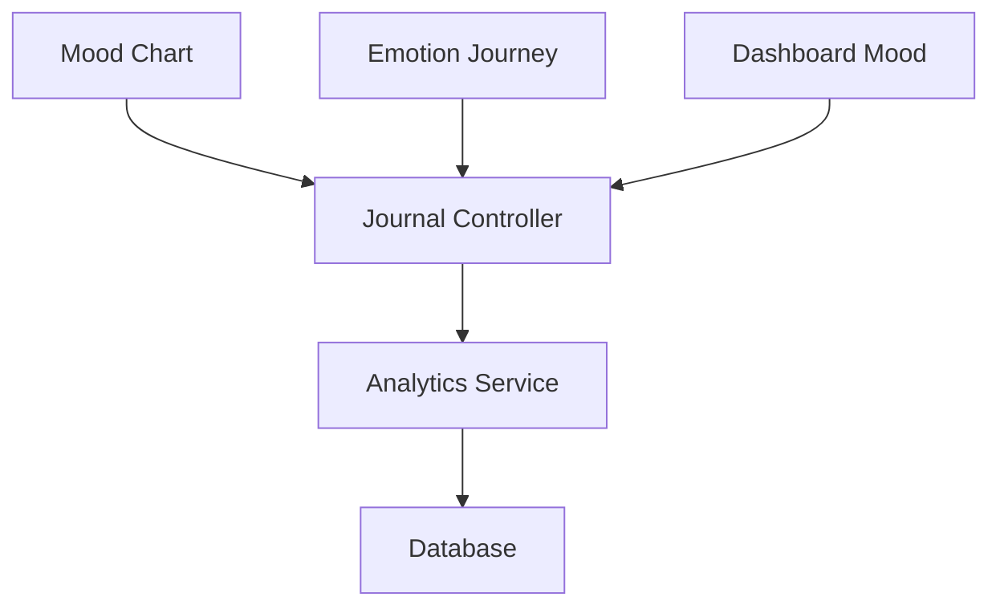
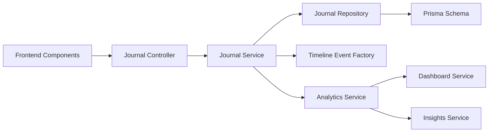

# Emotional State & Mood Tracking

<cite>
**Referenced Files in This Document**
- [journal.service.ts](file://apps/backend/src/journal/journal.service.ts)
- [timeline-event-factory.ts](file://apps/backend/src/journal/timeline-event-factory.ts)
- [journal-statistics.service.ts](file://apps/backend/src/journal/journal-statistics.service.ts)
- [journal.controller.ts](file://apps/backend/src/journal/journal.controller.ts)
- [journal.repository.ts](file://apps/backend/src/journal/journal.repository.ts)
- [analytics.service.ts](file://apps/backend/src/analytics/analytics.service.ts)
- [dashboard.service.ts](file://apps/backend/src/analytics/dashboard.service.ts)
- [insights.service.ts](file://apps/backend/src/analytics/insights.service.ts)
- [emotion-journey.component.tsx](file://src/components/media/EmotionJourney.tsx)
- [mood-chart.component.tsx](file://src/components/journal/MoodChart.tsx)
- [dashboard-mood.component.tsx](file://src/components/dashboard/DashboardMood.tsx)
- [schema.prisma](file://apps/backend/prisma/schema.prisma)
</cite>

## Table of Contents
1. [Introduction](#introduction)
2. [Project Structure](#project-structure)
3. [Core Components](#core-components)
4. [Architecture Overview](#architecture-overview)
5. [Detailed Component Analysis](#detailed-component-analysis)
6. [Dependency Analysis](#dependency-analysis)
7. [Performance Considerations](#performance-considerations)
8. [Troubleshooting Guide](#troubleshooting-guide)
9. [Conclusion](#conclusion)
10. [Appendices](#appendices)

## Introduction
This document explains how emotional state tracking and mood analysis are implemented across the journaling and analytics subsystems. It covers:
- How emotional states are captured from journal entries
- Storage models and persistence
- Mood calculation algorithms and emotion classification
- Integration points for sentiment analysis
- Timeline event factory that generates emotional insights and patterns
- Visualization components for mood trends and correlations with media consumption
- Statistics service providing emotional analytics and reporting

The goal is to provide both a conceptual overview and code-level traceability for developers and product stakeholders.

## Project Structure
Emotional state and mood features span backend services, repositories, controllers, and frontend visualization components:
- Backend: Journal domain (service, repository, controller), Analytics domain (service, dashboard, insights), Prisma schema
- Frontend: Journal and Dashboard UI components for mood charts and emotion journeys

**Diagram sources**
- [journal.controller.ts](file://apps/backend/src/journal/journal.controller.ts)
- [journal.service.ts](file://apps/backend/src/journal/journal.service.ts)
- [journal.repository.ts](file://apps/backend/src/journal/journal.repository.ts)
- [analytics.service.ts](file://apps/backend/src/analytics/analytics.service.ts)
- [dashboard.service.ts](file://apps/backend/src/analytics/dashboard.service.ts)
- [insights.service.ts](file://apps/backend/src/analytics/insights.service.ts)
- [schema.prisma](file://apps/backend/prisma/schema.prisma)
- [mood-chart.component.tsx](file://src/components/journal/MoodChart.tsx)
- [emotion-journey.component.tsx](file://src/components/media/EmotionJourney.tsx)
- [dashboard-mood.component.tsx](file://src/components/dashboard/DashboardMood.tsx)

**Section sources**
- [journal.controller.ts](file://apps/backend/src/journal/journal.controller.ts)
- [journal.service.ts](file://apps/backend/src/journal/journal.service.ts)
- [journal.repository.ts](file://apps/backend/src/journal/journal.repository.ts)
- [analytics.service.ts](file://apps/backend/src/analytics/analytics.service.ts)
- [dashboard.service.ts](file://apps/backend/src/analytics/dashboard.service.ts)
- [insights.service.ts](file://apps/backend/src/analytics/insights.service.ts)
- [schema.prisma](file://apps/backend/prisma/schema.prisma)
- [mood-chart.component.tsx](file://src/components/journal/MoodChart.tsx)
- [emotion-journey.component.tsx](file://src/components/media/EmotionJourney.tsx)
- [dashboard-mood.component.tsx](file://src/components/dashboard/DashboardMood.tsx)

## Core Components
- Journal Service: Orchestrates creation and retrieval of journal entries, computes mood scores, and emits timeline events for emotional insights.
- Journal Repository: Persists journal entries and related metadata; may include fields for mood or emotion tags depending on schema.
- Analytics Service: Aggregates mood data over time, supports trend calculations, and exposes endpoints for dashboards and reports.
- Dashboard Service: Provides summarized mood metrics for the user dashboard (e.g., current mood, recent trends).
- Insights Service: Generates narrative insights based on mood patterns and correlations with media consumption.
- Timeline Event Factory: Produces structured emotional insight events for timeline rendering.
- Frontend Components: Render mood charts, emotion journeys, and dashboard mood widgets.

Key responsibilities:
- Capture: Accept journal text and optional emotion signals, compute mood score, persist entry.
- Store: Save journal entries and derived mood/emotion metadata.
- Analyze: Compute rolling averages, detect spikes/dips, classify emotions, correlate with media.
- Visualize: Provide chart-ready series and aggregated stats for UI components.

**Section sources**
- [journal.service.ts](file://apps/backend/src/journal/journal.service.ts)
- [journal.repository.ts](file://apps/backend/src/journal/journal.repository.ts)
- [analytics.service.ts](file://apps/backend/src/analytics/analytics.service.ts)
- [dashboard.service.ts](file://apps/backend/src/analytics/dashboard.service.ts)
- [insights.service.ts](file://apps/backend/src/analytics/insights.service.ts)
- [timeline-event-factory.ts](file://apps/backend/src/journal/timeline-event-factory.ts)

## Architecture Overview
End-to-end flow from journal entry to mood visualization and insights:

**Diagram sources**
- [journal.controller.ts](file://apps/backend/src/journal/journal.controller.ts)
- [journal.service.ts](file://apps/backend/src/journal/journal.service.ts)
- [journal.repository.ts](file://apps/backend/src/journal/journal.repository.ts)
- [analytics.service.ts](file://apps/backend/src/analytics/analytics.service.ts)
- [insights.service.ts](file://apps/backend/src/analytics/insights.service.ts)
- [timeline-event-factory.ts](file://apps/backend/src/journal/timeline-event-factory.ts)
- [schema.prisma](file://apps/backend/prisma/schema.prisma)

## Detailed Component Analysis

### Journal Service: Mood Calculation and Emotion Classification
Responsibilities:
- Ingest journal content and optional emotion inputs
- Compute a numeric mood score and map to emotion categories
- Persist entry and associated mood/emotion metadata
- Trigger timeline event generation for emotional insights

Processing logic:
- Input validation and normalization
- Sentiment scoring (via integration point)
- Mood score derivation (weighted aggregation)
- Emotion classification (mapping to discrete labels)
- Persistence via repository
- Emission of timeline events through factory

**Diagram sources**
- [journal.service.ts](file://apps/backend/src/journal/journal.service.ts)
- [timeline-event-factory.ts](file://apps/backend/src/journal/timeline-event-factory.ts)

**Section sources**
- [journal.service.ts](file://apps/backend/src/journal/journal.service.ts)
- [timeline-event-factory.ts](file://apps/backend/src/journal/timeline-event-factory.ts)

### Journal Repository: Data Model and Persistence
Responsibilities:
- CRUD operations for journal entries
- Optional storage of mood scores and emotion tags
- Queries for time-series retrieval and aggregations

Data model considerations:
- Entry fields: content, timestamps, user association
- Mood fields: numeric score, timestamp
- Emotion fields: category labels, confidence scores (if applicable)

**Diagram sources**
- [schema.prisma](file://apps/backend/prisma/schema.prisma)
- [journal.repository.ts](file://apps/backend/src/journal/journal.repository.ts)

**Section sources**
- [journal.repository.ts](file://apps/backend/src/journal/journal.repository.ts)
- [schema.prisma](file://apps/backend/prisma/schema.prisma)

### Analytics Service: Mood Time-Series and Trend Analysis
Responsibilities:
- Aggregate mood scores over configurable windows (daily, weekly, monthly)
- Compute trend indicators (moving averages, volatility, peaks/troughs)
- Correlate mood with media consumption events
- Expose endpoints for dashboards and reports

Key outputs:
- Time-series arrays for charting
- Summary statistics (mean, median, variance)
- Correlation metrics between mood and media interactions

**Diagram sources**
- [analytics.service.ts](file://apps/backend/src/analytics/analytics.service.ts)
- [dashboard.service.ts](file://apps/backend/src/analytics/dashboard.service.ts)
- [insights.service.ts](file://apps/backend/src/analytics/insights.service.ts)

**Section sources**
- [analytics.service.ts](file://apps/backend/src/analytics/analytics.service.ts)
- [dashboard.service.ts](file://apps/backend/src/analytics/dashboard.service.ts)
- [insights.service.ts](file://apps/backend/src/analytics/insights.service.ts)

### Timeline Event Factory: Emotional Insights and Patterns
Responsibilities:
- Convert mood/emotion data into structured timeline events
- Detect notable patterns (spikes, dips, sustained shifts)
- Attach contextual metadata (media associations, dates)

Event types:
- Mood shift detected
- Sustained positive/negative period
- Correlation with specific media titles or genres
- Anomaly detection (unexpected mood changes)

**Diagram sources**
- [timeline-event-factory.ts](file://apps/backend/src/journal/timeline-event-factory.ts)

**Section sources**
- [timeline-event-factory.ts](file://apps/backend/src/journal/timeline-event-factory.ts)

### Frontend Components: Mood Visualization and Trends
Components:
- Mood Chart: Renders time-series mood data with interactive tooltips and filters
- Emotion Journey: Displays emotion labels along a timeline with media context
- Dashboard Mood: Shows current mood and short-term trend summary

Data contract:
- Time-series arrays with timestamps and values
- Emotion labels and confidence scores
- Correlation annotations (media titles, genres)

**Diagram sources**
- [mood-chart.component.tsx](file://src/components/journal/MoodChart.tsx)
- [emotion-journey.component.tsx](file://src/components/media/EmotionJourney.tsx)
- [dashboard-mood.component.tsx](file://src/components/dashboard/DashboardMood.tsx)
- [journal.controller.ts](file://apps/backend/src/journal/journal.controller.ts)
- [analytics.service.ts](file://apps/backend/src/analytics/analytics.service.ts)

**Section sources**
- [mood-chart.component.tsx](file://src/components/journal/MoodChart.tsx)
- [emotion-journey.component.tsx](file://src/components/media/EmotionJourney.tsx)
- [dashboard-mood.component.tsx](file://src/components/dashboard/DashboardMood.tsx)
- [journal.controller.ts](file://apps/backend/src/journal/journal.controller.ts)
- [analytics.service.ts](file://apps/backend/src/analytics/analytics.service.ts)

## Dependency Analysis
Coupling and cohesion:
- Journal Service depends on Repository for persistence and on Timeline Event Factory for insights emission
- Analytics Service depends on Journal Repository and Database for time-series queries
- Dashboard and Insights Services depend on Analytics Service for computed data
- Frontend components depend on Journal Controller endpoints and Analytics endpoints

Potential circular dependencies:
- None observed; services are layered and unidirectional

External integrations:
- Sentiment analysis integration point within Journal Service
- Database via Prisma schema

**Diagram sources**
- [journal.service.ts](file://apps/backend/src/journal/journal.service.ts)
- [journal.repository.ts](file://apps/backend/src/journal/journal.repository.ts)
- [timeline-event-factory.ts](file://apps/backend/src/journal/timeline-event-factory.ts)
- [analytics.service.ts](file://apps/backend/src/analytics/analytics.service.ts)
- [dashboard.service.ts](file://apps/backend/src/analytics/dashboard.service.ts)
- [insights.service.ts](file://apps/backend/src/analytics/insights.service.ts)
- [schema.prisma](file://apps/backend/prisma/schema.prisma)
- [journal.controller.ts](file://apps/backend/src/journal/journal.controller.ts)

**Section sources**
- [journal.service.ts](file://apps/backend/src/journal/journal.service.ts)
- [journal.repository.ts](file://apps/backend/src/journal/journal.repository.ts)
- [timeline-event-factory.ts](file://apps/backend/src/journal/timeline-event-factory.ts)
- [analytics.service.ts](file://apps/backend/src/analytics/analytics.service.ts)
- [dashboard.service.ts](file://apps/backend/src/analytics/dashboard.service.ts)
- [insights.service.ts](file://apps/backend/src/analytics/insights.service.ts)
- [schema.prisma](file://apps/backend/prisma/schema.prisma)
- [journal.controller.ts](file://apps/backend/src/journal/journal.controller.ts)

## Performance Considerations
- Batched mood updates: Avoid per-entry heavy computations; consider background jobs for sentiment analysis if external APIs are slow.
- Indexing: Ensure database indexes on timestamps and user IDs for efficient time-series queries.
- Caching: Cache aggregated mood series for common windows (e.g., last 7 days) to reduce repeated computation.
- Pagination: Implement cursor-based pagination for large timelines.
- Streaming: For very long timelines, stream chart data to avoid large payloads.

[No sources needed since this section provides general guidance]

## Troubleshooting Guide
Common issues and resolutions:
- Missing mood data: Verify journal entry persistence and mood computation pipeline; check repository writes and analytics aggregation jobs.
- Incorrect emotion labels: Review sentiment analysis integration configuration and emotion classification thresholds.
- Slow timeline queries: Inspect database indexes and query plans; consider materialized views for aggregated windows.
- Frontend rendering errors: Validate data contracts (timestamps, value ranges) and handle missing or null mood entries gracefully.

**Section sources**
- [journal.service.ts](file://apps/backend/src/journal/journal.service.ts)
- [journal.repository.ts](file://apps/backend/src/journal/journal.repository.ts)
- [analytics.service.ts](file://apps/backend/src/analytics/analytics.service.ts)

## Conclusion
The emotional state tracking and mood analysis system integrates journaling, analytics, and visualization to deliver actionable insights. The Journal Service captures and computes mood, the Timeline Event Factory structures insights, and the Analytics Service provides robust time-series analysis and correlations. Frontend components render these insights effectively, enabling users to understand their emotional patterns and their relationship with media consumption.

[No sources needed since this section summarizes without analyzing specific files]

## Appendices
- Example mood visualization: Use Mood Chart component to plot daily mood scores with tooltips showing emotion labels and media context.
- Trend analysis: Leverage Analytics Service to compute moving averages and detect significant mood shifts over custom windows.
- Correlation with media: Use Insights Service to generate narratives linking mood changes to specific media titles or genres consumed around those times.

[No sources needed since this section provides general guidance]