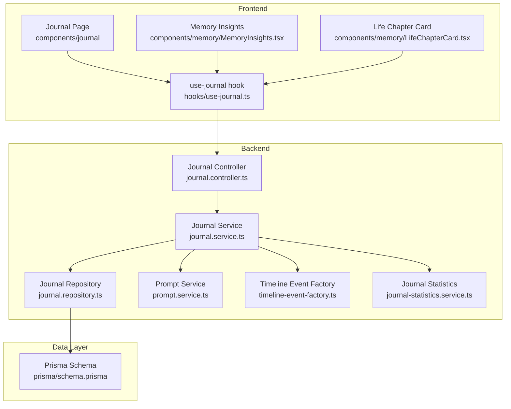
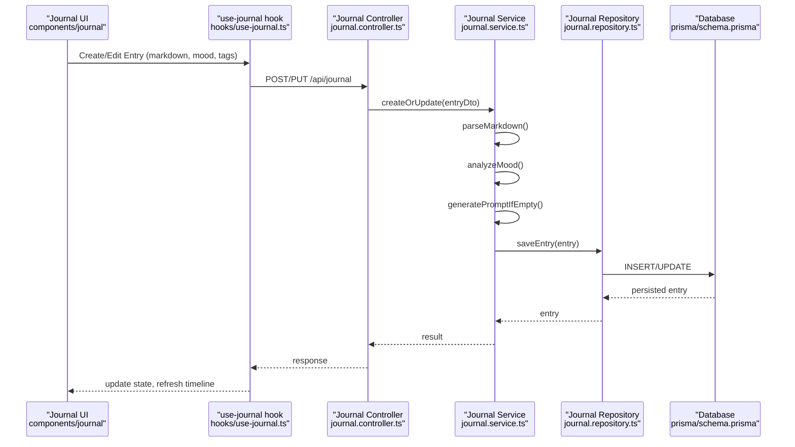
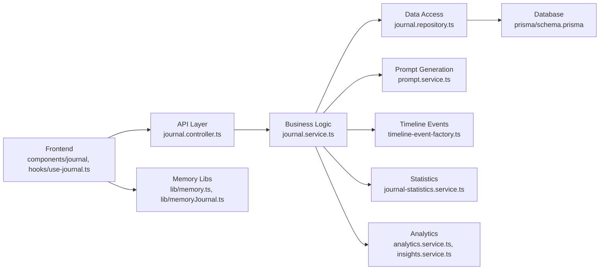

# Journal & Memory System

<cite>
**Referenced Files in This Document**
- [journal.controller.ts](file://apps/backend/src/journal/journal.controller.ts)
- [journal.service.ts](file://apps/backend/src/journal/journal.service.ts)
- [journal.repository.ts](file://apps/backend/src/journal/journal.repository.ts)
- [prompt.service.ts](file://apps/backend/src/journal/prompt.service.ts)
- [timeline-event-factory.ts](file://apps/backend/src/journal/timeline-event-factory.ts)
- [journal-statistics.service.ts](file://apps/backend/src/journal/journal-statistics.service.ts)
- [journal.module.ts](file://apps/backend/src/journal/journal.module.ts)
- [schema.prisma](file://apps/backend/prisma/schema.prisma)
- [use-journal.ts](file://src/hooks/use-journal.ts)
- [JournalHero.tsx](file://src/components/journal/JournalHero.tsx)
- [Page.tsx](file://src/components/journal/Page.tsx)
- [WriteOverlay.tsx](file://src/components/journal/WriteOverlay.tsx)
- [MemoryInsights.tsx](file://src/components/memory/MemoryInsights.tsx)
- [LifeChapterCard.tsx](file://src/components/memory/LifeChapterCard.tsx)
- [memory.ts](file://src/lib/memory.ts)
- [memoryJournal.ts](file://src/lib/memoryJournal.ts)
- [analytics.service.ts](file://apps/backend/src/analytics/analytics.service.ts)
- [insights.service.ts](file://apps/backend/src/analytics/insights.service.ts)
</cite>

## Table of Contents
1. [Introduction](#introduction)
2. [Project Structure](#project-structure)
3. [Core Components](#core-components)
4. [Architecture Overview](#architecture-overview)
5. [Detailed Component Analysis](#detailed-component-analysis)
6. [Dependency Analysis](#dependency-analysis)
7. [Performance Considerations](#performance-considerations)
8. [Troubleshooting Guide](#troubleshooting-guide)
9. [Conclusion](#conclusion)
10. [Appendices](#appendices)

## Introduction
This document explains the journal and memory system, focusing on rich text editing with markdown support, emotional state tracking, timeline generation, and memory organization. It covers prompt generation, mood analysis, reflection features, journal entry CRUD operations, search capabilities, export functionality, integration with media items, character tracking, life chapters, statistics calculation, sentiment analysis, and insight generation from journal entries. The goal is to provide a comprehensive guide for both technical and non-technical readers.

## Project Structure
The journal and memory system spans backend modules (NestJS), Prisma schema definitions, and frontend components/hooks that implement the user-facing features. Key areas include:
- Backend journal module: controllers, services, repositories, and utilities for prompts, timelines, and statistics.
- Frontend journal UI: pages, overlays, and hooks for creating/editing entries, rendering markdown, and interacting with the backend.
- Memory and insights: components and libraries for organizing memories, generating insights, and linking to life chapters and characters.

**Diagram sources**
- [journal.controller.ts](file://apps/backend/src/journal/journal.controller.ts)
- [journal.service.ts](file://apps/backend/src/journal/journal.service.ts)
- [journal.repository.ts](file://apps/backend/src/journal/journal.repository.ts)
- [prompt.service.ts](file://apps/backend/src/journal/prompt.service.ts)
- [timeline-event-factory.ts](file://apps/backend/src/journal/timeline-event-factory.ts)
- [journal-statistics.service.ts](file://apps/backend/src/journal/journal-statistics.service.ts)
- [schema.prisma](file://apps/backend/prisma/schema.prisma)
- [use-journal.ts](file://src/hooks/use-journal.ts)
- [JournalHero.tsx](file://src/components/journal/JournalHero.tsx)
- [Page.tsx](file://src/components/journal/Page.tsx)
- [WriteOverlay.tsx](file://src/components/journal/WriteOverlay.tsx)
- [MemoryInsights.tsx](file://src/components/memory/MemoryInsights.tsx)
- [LifeChapterCard.tsx](file://src/components/memory/LifeChapterCard.tsx)

**Section sources**
- [journal.module.ts](file://apps/backend/src/journal/journal.module.ts)
- [schema.prisma](file://apps/backend/prisma/schema.prisma)

## Core Components
- Journal Controller: Exposes REST endpoints for journal entry CRUD, search, and export.
- Journal Service: Orchestrates business logic including markdown processing, mood tagging, timeline event creation, statistics computation, and insight generation.
- Journal Repository: Data access layer for journal entries, relationships to media and characters, and persistence via Prisma.
- Prompt Service: Generates contextual writing prompts based on user history, media context, and life chapters.
- Timeline Event Factory: Builds structured timeline events from journal entries and related media.
- Journal Statistics Service: Calculates metrics like streaks, word counts, mood distributions, and reflective patterns.
- Frontend Hooks and Components: Provide rich text editing with markdown preview, mood selection, timeline visualization, and memory organization.

Key responsibilities:
- CRUD operations for journal entries with validation and error handling.
- Markdown parsing and sanitization for rich text editing.
- Mood/emotion tagging and sentiment analysis pipeline.
- Integration with media items and character profiles.
- Search across content, tags, and metadata.
- Export options for journal data and timelines.

**Section sources**
- [journal.controller.ts](file://apps/backend/src/journal/journal.controller.ts)
- [journal.service.ts](file://apps/backend/src/journal/journal.service.ts)
- [journal.repository.ts](file://apps/backend/src/journal/journal.repository.ts)
- [prompt.service.ts](file://apps/backend/src/journal/prompt.service.ts)
- [timeline-event-factory.ts](file://apps/backend/src/journal/timeline-event-factory.ts)
- [journal-statistics.service.ts](file://apps/backend/src/journal/journal-statistics.service.ts)

## Architecture Overview
The system follows a layered architecture:
- Presentation layer (frontend): React components and hooks render the journal editor, display timelines, and manage user interactions.
- API layer (backend controller): Validates requests, maps DTOs, and delegates to services.
- Business layer (services): Implements domain logic such as prompt generation, mood analysis, timeline construction, and statistics.
- Data layer (repository + Prisma): Encapsulates database queries and relationships.

**Diagram sources**
- [journal.controller.ts](file://apps/backend/src/journal/journal.controller.ts)
- [journal.service.ts](file://apps/backend/src/journal/journal.service.ts)
- [journal.repository.ts](file://apps/backend/src/journal/journal.repository.ts)
- [schema.prisma](file://apps/backend/prisma/schema.prisma)
- [use-journal.ts](file://src/hooks/use-journal.ts)

## Detailed Component Analysis

### Journal Controller
Responsibilities:
- Define routes for journal entry CRUD, search, and export.
- Validate request payloads and map to DTOs.
- Delegate to service methods for business logic.

Typical endpoints:
- Create entry: POST /api/journal
- Update entry: PUT /api/journal/:id
- Delete entry: DELETE /api/journal/:id
- Get entry: GET /api/journal/:id
- List entries: GET /api/journal?filters...
- Search: GET /api/journal/search?q=...
- Export: GET /api/journal/export?format=...

Error handling:
- Input validation errors return structured responses.
- Not found or permission errors are handled consistently.

**Section sources**
- [journal.controller.ts](file://apps/backend/src/journal/journal.controller.ts)

### Journal Service
Responsibilities:
- Orchestrate entry lifecycle: create, update, delete, retrieve.
- Process markdown content and sanitize HTML.
- Analyze mood/sentiment and tag entries accordingly.
- Generate prompts when content is minimal or empty.
- Build timeline events using the factory.
- Compute statistics and insights.

Processing flow:
- Parse markdown into structured content.
- Detect mood keywords and compute sentiment scores.
- Link entries to media items and characters if referenced.
- Persist changes and emit events for timeline updates.

Optimization opportunities:
- Cache parsed markdown and sentiment results.
- Batch timeline event generation for bulk updates.

**Section sources**
- [journal.service.ts](file://apps/backend/src/journal/journal.service.ts)
- [prompt.service.ts](file://apps/backend/src/journal/prompt.service.ts)
- [timeline-event-factory.ts](file://apps/backend/src/journal/timeline-event-factory.ts)
- [journal-statistics.service.ts](file://apps/backend/src/journal/journal-statistics.service.ts)

### Journal Repository
Responsibilities:
- Implement data access for journal entries and relationships.
- Query by filters (date range, tags, mood, media linkage).
- Support search indexing and full-text queries.
- Manage transactions for consistent writes.

Complexity considerations:
- Use efficient joins for media and character associations.
- Leverage indexes on frequently queried fields (userId, createdAt, tags).

**Section sources**
- [journal.repository.ts](file://apps/backend/src/journal/journal.repository.ts)
- [schema.prisma](file://apps/backend/prisma/schema.prisma)

### Prompt Service
Responsibilities:
- Generate contextual prompts based on:
  - Recent media consumption
  - Life chapter context
  - User’s historical mood patterns
- Provide variety and avoid repetition.

Algorithm highlights:
- Weighted selection from prompt templates.
- Dynamic insertion of variables (media title, character name, date).

**Section sources**
- [prompt.service.ts](file://apps/backend/src/journal/prompt.service.ts)

### Timeline Event Factory
Responsibilities:
- Convert journal entries into timeline events.
- Enrich events with media and character metadata.
- Maintain chronological ordering and grouping.

Output structure:
- Event type, timestamp, title, summary, linked entities.

**Section sources**
- [timeline-event-factory.ts](file://apps/backend/src/journal/timeline-event-factory.ts)

### Journal Statistics Service
Responsibilities:
- Calculate streaks, word counts, mood distribution.
- Identify reflective patterns and trends over time.
- Provide metrics for dashboard and insights.

Metrics examples:
- Daily/weekly/monthly entry counts.
- Average sentiment score per period.
- Most used tags and topics.

**Section sources**
- [journal-statistics.service.ts](file://apps/backend/src/journal/journal-statistics.service.ts)

### Frontend Journal Components and Hooks
- Journal Hero: Displays overview and quick actions.
- Page: Renders the main journal interface.
- WriteOverlay: Provides rich text editor with markdown support and mood selection.
- use-journal hook: Manages state, API calls, and local caching.

Features:
- Markdown preview and sanitization.
- Mood picker integrated with sentiment analysis.
- Real-time timeline updates after edits.
- Search and filter within the UI.

**Section sources**
- [JournalHero.tsx](file://src/components/journal/JournalHero.tsx)
- [Page.tsx](file://src/components/journal/Page.tsx)
- [WriteOverlay.tsx](file://src/components/journal/WriteOverlay.tsx)
- [use-journal.ts](file://src/hooks/use-journal.ts)

### Memory Organization and Insights
- Memory Insights component aggregates reflections and highlights.
- Life Chapter Card organizes entries into narrative chapters.
- Libraries memory.ts and memoryJournal.ts coordinate memory structures and journal linkages.

Integration points:
- Media items linked to journal entries for context.
- Character tracking enriches entries with persona details.
- Life chapters segment long-term narratives.

**Section sources**
- [MemoryInsights.tsx](file://src/components/memory/MemoryInsights.tsx)
- [LifeChapterCard.tsx](file://src/components/memory/LifeChapterCard.tsx)
- [memory.ts](file://src/lib/memory.ts)
- [memoryJournal.ts](file://src/lib/memoryJournal.ts)

### Analytics and Insights Services
- Analytics service computes aggregated metrics across journal and media.
- Insights service synthesizes reflective summaries and recommendations.

Use cases:
- Dashboard widgets showing mood trends.
- Weekly reflection reports.
- Personalized prompt suggestions.

**Section sources**
- [analytics.service.ts](file://apps/backend/src/analytics/analytics.service.ts)
- [insights.service.ts](file://apps/backend/src/analytics/insights.service.ts)

## Dependency Analysis
The journal system depends on several internal modules and external tools:
- NestJS framework for controllers/services.
- Prisma ORM for database interactions.
- Markdown parser and sanitizer for rich text.
- Sentiment/mood analysis utilities.
- Frontend React components and hooks.

**Diagram sources**
- [journal.controller.ts](file://apps/backend/src/journal/journal.controller.ts)
- [journal.service.ts](file://apps/backend/src/journal/journal.service.ts)
- [journal.repository.ts](file://apps/backend/src/journal/journal.repository.ts)
- [prompt.service.ts](file://apps/backend/src/journal/prompt.service.ts)
- [timeline-event-factory.ts](file://apps/backend/src/journal/timeline-event-factory.ts)
- [journal-statistics.service.ts](file://apps/backend/src/journal/journal-statistics.service.ts)
- [schema.prisma](file://apps/backend/prisma/schema.prisma)
- [use-journal.ts](file://src/hooks/use-journal.ts)
- [memory.ts](file://src/lib/memory.ts)
- [memoryJournal.ts](file://src/lib/memoryJournal.ts)
- [analytics.service.ts](file://apps/backend/src/analytics/analytics.service.ts)
- [insights.service.ts](file://apps/backend/src/analytics/insights.service.ts)

**Section sources**
- [journal.module.ts](file://apps/backend/src/journal/journal.module.ts)

## Performance Considerations
- Markdown parsing: Cache parsed results to reduce CPU overhead.
- Sentiment analysis: Batch process entries and cache scores.
- Database queries: Use selective projections and indexes for frequent filters.
- Timeline generation: Defer heavy computations to background jobs if needed.
- Frontend rendering: Lazy-load large timelines and paginate entries.

[No sources needed since this section provides general guidance]

## Troubleshooting Guide
Common issues and resolutions:
- Markdown rendering errors: Ensure sanitization and fallback to plain text.
- Mood detection inaccuracies: Review keyword mappings and adjust thresholds.
- Missing media links: Verify foreign key constraints and relationship mapping.
- Search performance degradation: Check index coverage and query optimization.
- Export failures: Validate output formats and handle large datasets gracefully.

Debugging tips:
- Log service method inputs/outputs.
- Inspect Prisma query logs for slow queries.
- Use frontend network tab to validate API responses.

**Section sources**
- [journal.service.ts](file://apps/backend/src/journal/journal.service.ts)
- [journal.repository.ts](file://apps/backend/src/journal/journal.repository.ts)

## Conclusion
The journal and memory system integrates rich text editing, mood analysis, timeline generation, and memory organization into a cohesive experience. By leveraging modular services, robust data access, and thoughtful frontend design, it supports reflective practices, personalized insights, and meaningful connections between journal entries, media, characters, and life chapters. Continuous optimization and careful error handling ensure reliability and performance at scale.

[No sources needed since this section summarizes without analyzing specific files]

## Appendices

### Journal Entry CRUD Operations
- Create: POST /api/journal with markdown content, mood, tags, and optional media/character references.
- Read: GET /api/journal/:id returns entry details.
- Update: PUT /api/journal/:id modifies content and metadata.
- Delete: DELETE /api/journal/:id removes entry and cleans up relationships.

Search capabilities:
- Full-text search across content and tags.
- Filter by date range, mood, and linked entities.

Export functionality:
- Export entries as JSON, CSV, or markdown bundles.
- Include timeline events and associated metadata.

**Section sources**
- [journal.controller.ts](file://apps/backend/src/journal/journal.controller.ts)
- [journal.service.ts](file://apps/backend/src/journal/journal.service.ts)
- [journal.repository.ts](file://apps/backend/src/journal/journal.repository.ts)

### Mood Analysis and Reflection Features
- Mood tagging: Assign emotions to entries via UI or auto-detection.
- Sentiment analysis: Compute scores from text content.
- Reflection prompts: Generate tailored prompts based on history and context.
- Insight generation: Summarize trends and suggest actions.

**Section sources**
- [prompt.service.ts](file://apps/backend/src/journal/prompt.service.ts)
- [journal-statistics.service.ts](file://apps/backend/src/journal/journal-statistics.service.ts)
- [analytics.service.ts](file://apps/backend/src/analytics/analytics.service.ts)
- [insights.service.ts](file://apps/backend/src/analytics/insights.service.ts)

### Timeline Generation and Memory Organization
- Timeline events: Construct chronological records from entries.
- Memory chapters: Group entries into life phases or themes.
- Media integration: Link entries to consumed media for context.
- Character tracking: Associate entries with personas or relationships.

**Section sources**
- [timeline-event-factory.ts](file://apps/backend/src/journal/timeline-event-factory.ts)
- [MemoryInsights.tsx](file://src/components/memory/MemoryInsights.tsx)
- [LifeChapterCard.tsx](file://src/components/memory/LifeChapterCard.tsx)
- [memory.ts](file://src/lib/memory.ts)
- [memoryJournal.ts](file://src/lib/memoryJournal.ts)