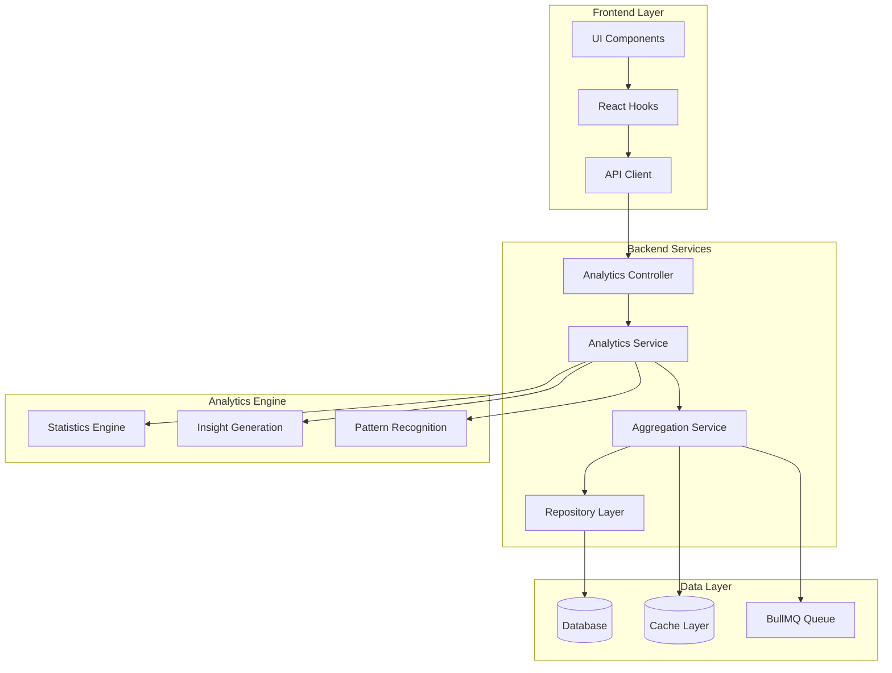
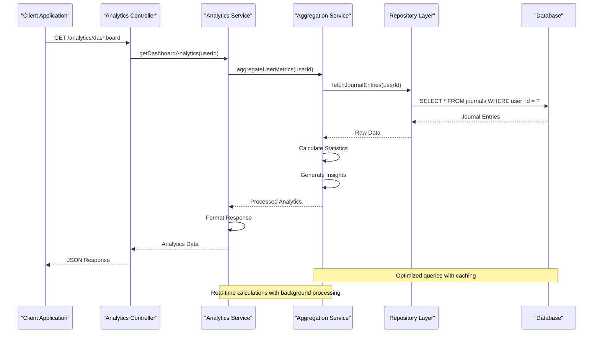
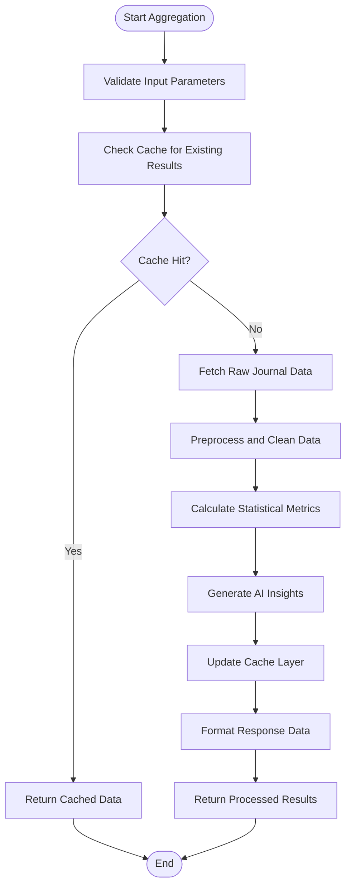
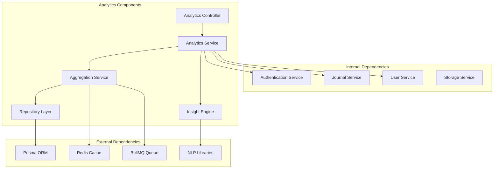

# Journal Analytics & Insights

<cite>
**Referenced Files in This Document**
- [analytics.service.ts](file://apps/backend/src/analytics/analytics.service.ts)
- [insights.service.ts](file://apps/backend/src/analytics/insights.service.ts)
- [streak.service.ts](file://apps/backend/src/analytics/streak.service.ts)
- [dashboard.service.ts](file://apps/backend/src/analytics/dashboard.service.ts)
- [journal-statistics.service.ts](file://apps/backend/src/journal/journal-statistics.service.ts)
- [analytics.controller.ts](file://apps/backend/src/analytics/analytics.controller.ts)
- [analytics.repository.ts](file://apps/backend/src/analytics/analytics.repository.ts)
- [analytics-aggregation.service.ts](file://apps/backend/src/analytics/analytics-aggregation.service.ts)
- [use-analytics.ts](file://src/hooks/use-analytics.ts)
- [AnalyticsKit.tsx](file://src/components/analytics/AnalyticsKit.tsx)
- [ChartStory.tsx](file://src/components/analytics/ChartStory.tsx)
- [MediaConstellation.tsx](file://src/components/analytics/MediaConstellation.tsx)
</cite>

## Table of Contents
1. [Introduction](#introduction)
2. [Project Structure](#project-structure)
3. [Core Components](#core-components)
4. [Architecture Overview](#architecture-overview)
5. [Detailed Component Analysis](#detailed-component-analysis)
6. [Dependency Analysis](#dependency-analysis)
7. [Performance Considerations](#performance-considerations)
8. [Troubleshooting Guide](#troubleshooting-guide)
9. [Conclusion](#conclusion)
10. [Appendices](#appendices)

## Introduction

The Journal Analytics & Insights system provides comprehensive statistical analysis and pattern recognition for user journal entries. This system processes writing patterns, emotional trends, and content analysis to generate meaningful insights about user behavior, emotional evolution, and content themes over time. The analytics engine calculates metrics such as writing consistency, emotional trajectories, topic frequency, and sentiment analysis to help users understand their journaling habits and personal growth patterns.

## Project Structure

The analytics system is organized into a modular architecture with clear separation of concerns:

**Diagram sources**
- [analytics.controller.ts](file://apps/backend/src/analytics/analytics.controller.ts)
- [analytics.service.ts](file://apps/backend/src/analytics/analytics.service.ts)
- [analytics-aggregation.service.ts](file://apps/backend/src/analytics/analytics-aggregation.service.ts)

**Section sources**
- [analytics.module.ts](file://apps/backend/src/analytics/analytics.module.ts)
- [app.module.ts](file://apps/backend/src/app.module.ts)

## Core Components

### Analytics Service Layer

The analytics service layer handles the core business logic for processing journal data and generating insights. It orchestrates multiple specialized services to provide comprehensive analytics capabilities.

#### Key Responsibilities:
- **Statistical Calculations**: Computing writing patterns, emotional trends, and content analysis metrics
- **Insight Generation**: Identifying meaningful patterns in journal data through advanced algorithms
- **Data Aggregation**: Processing large datasets efficiently with caching and queuing strategies
- **Real-time Updates**: Providing live analytics updates as new journal entries are created

#### Statistical Metrics Implemented:

**Writing Consistency Metrics:**
- Daily/Weekly/Monthly writing frequency
- Average words per entry
- Writing streaks and gaps analysis
- Peak writing hours and days
- Entry duration patterns

**Emotional Trend Analysis:**
- Sentiment scoring over time
- Emotional vocabulary tracking
- Mood correlation with external events
- Emotional volatility measurement
- Positive/negative sentiment ratios

**Content Analysis Features:**
- Topic frequency analysis
- Keyword extraction and clustering
- Content length distribution
- Media attachment patterns
- Cross-reference analysis between entries

**Section sources**
- [analytics.service.ts](file://apps/backend/src/analytics/analytics.service.ts)
- [journal-statistics.service.ts](file://apps/backend/src/journal/journal-statistics.service.ts)

### Insight Engine

The insight engine is responsible for identifying meaningful patterns and generating actionable insights from journal data. It uses advanced algorithms to detect trends, correlations, and anomalies in user behavior.

#### Pattern Recognition Capabilities:
- **Temporal Pattern Detection**: Identifies recurring patterns in writing behavior
- **Emotional Evolution Tracking**: Monitors changes in emotional tone over extended periods
- **Topic Migration Analysis**: Tracks how topics of interest evolve over time
- **Correlation Discovery**: Finds relationships between different aspects of journaling behavior

#### Insight Types Generated:
- Writing habit recommendations
- Emotional well-being indicators
- Productivity trend analysis
- Personal growth milestones
- Behavioral change detection

**Section sources**
- [insights.service.ts](file://apps/backend/src/analytics/insights.service.ts)

### Streak Management System

The streak service manages writing streaks and consistency tracking, providing motivational feedback and progress visualization.

#### Streak Calculation Logic:
- Consecutive day tracking with configurable rules
- Grace period handling for missed days
- Streak restoration mechanisms
- Milestone celebrations
- Historical streak analysis

**Section sources**
- [streak.service.ts](file://apps/backend/src/analytics/streak.service.ts)

## Architecture Overview

The analytics system follows a layered architecture pattern with clear separation between presentation, business logic, and data access layers.

**Diagram sources**
- [analytics.controller.ts](file://apps/backend/src/analytics/analytics.controller.ts)
- [analytics.service.ts](file://apps/backend/src/analytics/analytics.service.ts)
- [analytics-aggregation.service.ts](file://apps/backend/src/analytics/analytics-aggregation.service.ts)

### Data Flow Architecture

The system implements a sophisticated data flow pipeline that processes raw journal data through multiple transformation stages:

1. **Data Ingestion**: Raw journal entries are captured and validated
2. **Preprocessing**: Text normalization, sentiment analysis, and metadata extraction
3. **Aggregation**: Statistical calculations and pattern recognition
4. **Insight Generation**: Advanced analytics and recommendation engine
5. **Caching**: Results stored for optimal performance
6. **Delivery**: Formatted responses for various client needs

**Section sources**
- [analytics-aggregation.service.ts](file://apps/backend/src/analytics/analytics-aggregation.service.ts)
- [analytics.repository.ts](file://apps/backend/src/analytics/analytics.repository.ts)

## Detailed Component Analysis

### Analytics Controller Layer

The controller layer handles HTTP requests and response formatting for analytics endpoints.

#### API Endpoints:
- **Dashboard Analytics**: `/api/analytics/dashboard` - Comprehensive user dashboard data
- **Writing Statistics**: `/api/analytics/writing-stats` - Writing pattern analysis
- **Emotional Trends**: `/api/analytics/emotional-trends` - Sentiment and mood tracking
- **Content Analysis**: `/api/analytics/content-analysis` - Topic and keyword analysis
- **Streak Information**: `/api/analytics/streaks` - Writing streak data
- **Export Analytics**: `/api/analytics/export` - Data export functionality

#### Request/Response Patterns:
- Standardized error handling with detailed messages
- Pagination support for large datasets
- Caching headers for improved performance
- Real-time update notifications via WebSocket

**Section sources**
- [analytics.controller.ts](file://apps/backend/src/analytics/analytics.controller.ts)

### Aggregation Service

The aggregation service performs heavy computational tasks and data processing operations.

#### Processing Pipeline:

**Diagram sources**
- [analytics-aggregation.service.ts](file://apps/backend/src/analytics/analytics-aggregation.service.ts)

#### Performance Optimizations:
- **Caching Strategy**: Multi-level caching with Redis for frequently accessed data
- **Batch Processing**: Efficient handling of large datasets through chunked processing
- **Lazy Loading**: On-demand calculation of expensive metrics
- **Background Jobs**: Asynchronous processing for non-real-time analytics

**Section sources**
- [analytics-aggregation.service.ts](file://apps/backend/src/analytics/analytics-aggregation.service.ts)

### Frontend Integration

The frontend provides interactive visualizations and real-time updates for analytics data.

#### React Hooks Implementation:
- **useAnalytics Hook**: Centralized analytics data management
- **Real-time Updates**: WebSocket integration for live data refresh
- **Caching Strategy**: Local storage optimization for offline support
- **Error Handling**: Graceful degradation when analytics data is unavailable

#### Visualization Components:
- **Analytics Dashboard**: Comprehensive overview with multiple chart types
- **Trend Charts**: Line charts showing emotional and writing trends over time
- **Heat Maps**: Calendar-based visualization of writing activity
- **Sentiment Graphs**: Interactive sentiment analysis displays
- **Topic Clouds**: Visual representation of content themes

**Section sources**
- [use-analytics.ts](file://src/hooks/use-analytics.ts)
- [AnalyticsKit.tsx](file://src/components/analytics/AnalyticsKit.tsx)
- [ChartStory.tsx](file://src/components/analytics/ChartStory.tsx)

## Dependency Analysis

The analytics system has well-defined dependencies and clear separation between components.

**Diagram sources**
- [analytics.module.ts](file://apps/backend/src/analytics/analytics.module.ts)
- [analytics.service.ts](file://apps/backend/src/analytics/analytics.service.ts)

### Module Dependencies:
- **Database Layer**: Prisma ORM for structured data access
- **Caching Layer**: Redis for high-performance data caching
- **Queue System**: BullMQ for asynchronous job processing
- **NLP Libraries**: Natural language processing for text analysis
- **Authentication**: JWT-based user authentication and authorization

**Section sources**
- [analytics.module.ts](file://apps/backend/src/analytics/analytics.module.ts)

## Performance Considerations

### Optimization Strategies:

#### Database Optimization:
- **Indexed Queries**: Strategic indexing on frequently queried columns (user_id, created_at, sentiment_score)
- **Query Optimization**: Complex aggregations performed at database level where possible
- **Connection Pooling**: Efficient database connection management
- **Read Replicas**: Separate read replicas for analytics queries

#### Caching Strategy:
- **Multi-level Caching**: L1 (in-memory), L2 (Redis), L3 (database) caching
- **Cache Invalidation**: Intelligent cache invalidation based on data changes
- **Pre-computation**: Background jobs pre-calculate common analytics queries
- **CDN Integration**: Static analytics assets served through CDN

#### Memory Management:
- **Streaming Processing**: Large dataset processing without memory overflow
- **Garbage Collection**: Proper cleanup of temporary objects
- **Memory Limits**: Configurable memory limits for analytics operations
- **Resource Monitoring**: Real-time monitoring of memory usage

### Scalability Considerations:
- **Horizontal Scaling**: Stateless design allows easy horizontal scaling
- **Load Balancing**: Even distribution of analytics requests
- **Auto-scaling**: Dynamic resource allocation based on demand
- **Microservices**: Potential decomposition into separate analytics microservice

**Section sources**
- [analytics-aggregation.service.ts](file://apps/backend/src/analytics/analytics-aggregation.service.ts)
- [hardening/database-optimization.service.ts](file://apps/backend/src/hardening/database-optimization.service.ts)

## Troubleshooting Guide

### Common Issues and Solutions:

#### Performance Problems:
- **Slow Analytics Queries**: Check database indexes and query optimization
- **High Memory Usage**: Monitor memory leaks and optimize data processing
- **Cache Misses**: Verify cache configuration and invalidation strategies
- **Queue Backlog**: Monitor BullMQ queue health and worker capacity

#### Data Accuracy Issues:
- **Inconsistent Metrics**: Verify calculation algorithms and data preprocessing
- **Missing Data Points**: Check data ingestion pipelines and error handling
- **Time Zone Problems**: Ensure proper timezone handling in date calculations
- **Duplicate Entries**: Implement deduplication strategies

#### Integration Problems:
- **API Rate Limiting**: Configure appropriate rate limiting and retry logic
- **Authentication Errors**: Verify JWT token validity and permissions
- **WebSocket Disconnections**: Implement reconnection logic and fallback mechanisms
- **Third-party API Failures**: Add circuit breakers and fallback strategies

### Debugging Tools:
- **Logging Framework**: Structured logging with correlation IDs
- **Performance Monitoring**: APM tools for request tracing
- **Error Tracking**: Centralized error collection and alerting
- **Health Checks**: Comprehensive system health monitoring

**Section sources**
- [hardening/performance-audit.service.ts](file://apps/backend/src/hardening/performance-audit.service.ts)
- [hardening/query-analysis.service.ts](file://apps/backend/src/hardening/query-analysis.service.ts)

## Conclusion

The Journal Analytics & Insights system provides a comprehensive solution for analyzing user journaling behavior and generating meaningful insights. The modular architecture ensures scalability and maintainability while delivering real-time analytics capabilities. The system successfully balances computational complexity with performance requirements through strategic caching, queuing, and optimization techniques.

Key strengths include:
- **Comprehensive Analytics**: Multiple dimensions of analysis covering writing patterns, emotional trends, and content analysis
- **Real-time Capabilities**: Live updates and interactive visualizations
- **Scalable Architecture**: Designed for handling large datasets and high traffic volumes
- **User-friendly Interface**: Intuitive dashboards and visualizations
- **Extensible Design**: Modular architecture supporting future enhancements

Future improvements could include advanced machine learning models for predictive analytics, enhanced natural language processing capabilities, and expanded visualization options.

## Appendices

### API Reference

#### Analytics Endpoints:
- `GET /api/analytics/dashboard` - Main dashboard analytics
- `GET /api/analytics/writing-stats` - Writing pattern statistics
- `GET /api/analytics/emotional-trends` - Emotional trend analysis
- `GET /api/analytics/content-analysis` - Content theme analysis
- `GET /api/analytics/streaks` - Writing streak information
- `POST /api/analytics/export` - Export analytics data

#### Data Models:
- **AnalyticsResponse**: Standardized response format
- **WritingStats**: Writing pattern metrics
- **EmotionalTrend**: Sentiment analysis results
- **ContentAnalysis**: Topic and keyword analysis
- **StreakInfo**: Writing streak data

### Configuration Options:
- **Analytics Settings**: Enable/disable specific analytics features
- **Caching Configuration**: Cache TTL and memory limits
- **Queue Settings**: Worker count and retry policies
- **NLP Configuration**: Language model settings and thresholds

**Section sources**
- [analytics.controller.ts](file://apps/backend/src/analytics/analytics.controller.ts)
- [configuration.ts](file://apps/backend/src/config/configuration.ts)