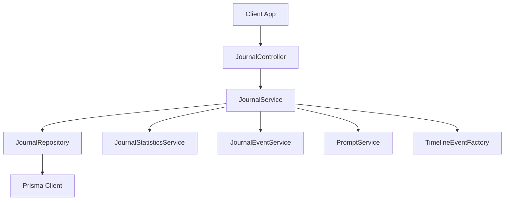
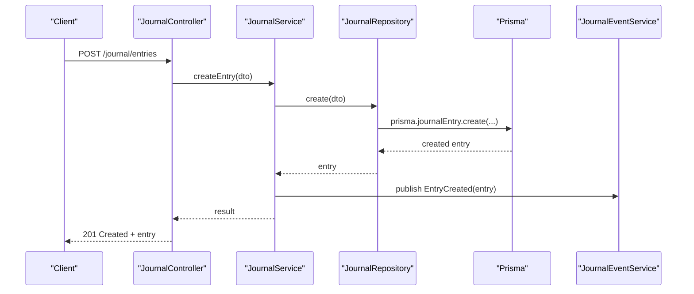
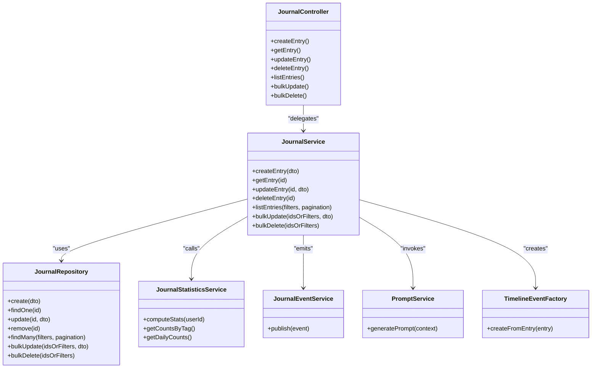
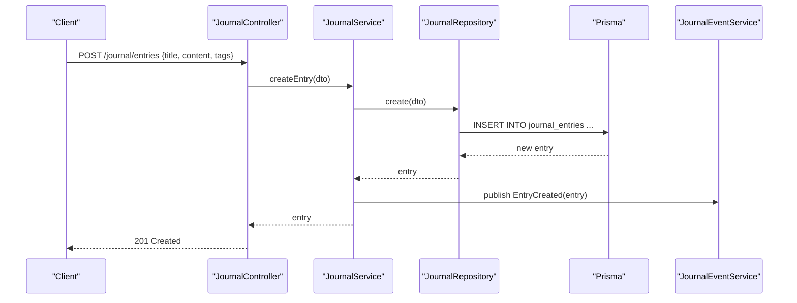
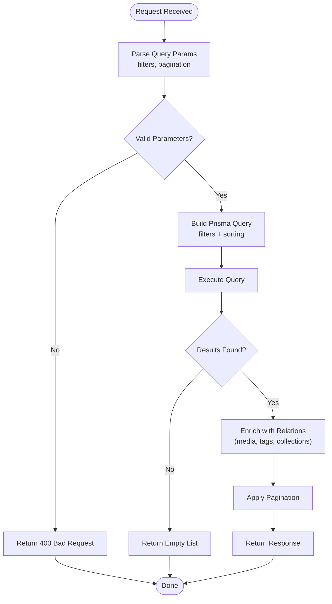
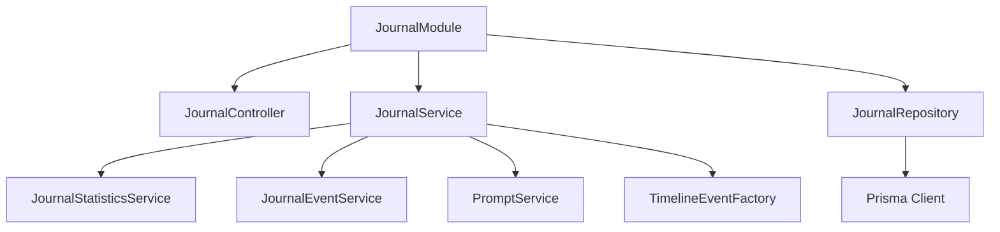
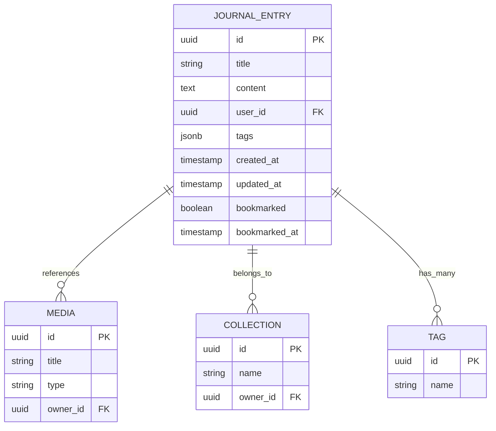

# Journal Entries & CRUD Operations

<cite>
**Referenced Files in This Document**
- [journal.controller.ts](file://apps/backend/src/journal/journal.controller.ts)
- [journal.service.ts](file://apps/backend/src/journal/journal.service.ts)
- [journal.repository.ts](file://apps/backend/src/journal/journal.repository.ts)
- [journal.module.ts](file://apps/backend/src/journal/journal.module.ts)
- [schema.prisma](file://apps/backend/prisma/schema.prisma)
- [dto/index.ts](file://apps/backend/src/journal/dto/index.ts)
- [journal-statistics.service.ts](file://apps/backend/src/journal/journal-statistics.service.ts)
- [journal-event.service.ts](file://apps/backend/src/journal/journal-event.service.ts)
- [prompt.service.ts](file://apps/backend/src/journal/prompt.service.ts)
- [timeline-event-factory.ts](file://apps/backend/src/journal/timeline-event-factory.ts)
</cite>

## Table of Contents
1. [Introduction](#introduction)
2. [Project Structure](#project-structure)
3. [Core Components](#core-components)
4. [Architecture Overview](#architecture-overview)
5. [Detailed Component Analysis](#detailed-component-analysis)
6. [Dependency Analysis](#dependency-analysis)
7. [Performance Considerations](#performance-considerations)
8. [Troubleshooting Guide](#troubleshooting-guide)
9. [Conclusion](#conclusion)
10. [Appendices](#appendices)

## Introduction
This document explains the journal entry management system, focusing on complete CRUD operations (create, read, update, delete), DTO structures and validation rules, API endpoints, repository pattern implementation with Prisma queries, search/filtering, pagination, and advanced operations such as bulk updates, batch deletions, and complex queries with joins. It is intended for both developers integrating with the backend and maintainers extending the journal feature.

## Project Structure
The journal feature follows a layered architecture:
- Controller layer exposes HTTP endpoints
- Service layer encapsulates business logic
- Repository layer implements data access using Prisma
- DTOs define request/response contracts and validation
- Supporting services handle events, statistics, prompts, and timeline mapping

**Diagram sources**
- [journal.controller.ts](file://apps/backend/src/journal/journal.controller.ts)
- [journal.service.ts](file://apps/backend/src/journal/journal.service.ts)
- [journal.repository.ts](file://apps/backend/src/journal/journal.repository.ts)
- [journal-statistics.service.ts](file://apps/backend/src/journal/journal-statistics.service.ts)
- [journal-event.service.ts](file://apps/backend/src/journal/journal-event.service.ts)
- [prompt.service.ts](file://apps/backend/src/journal/prompt.service.ts)
- [timeline-event-factory.ts](file://apps/backend/src/journal/timeline-event-factory.ts)

**Section sources**
- [journal.controller.ts](file://apps/backend/src/journal/journal.controller.ts)
- [journal.service.ts](file://apps/backend/src/journal/journal.service.ts)
- [journal.repository.ts](file://apps/backend/src/journal/journal.repository.ts)
- [journal.module.ts](file://apps/backend/src/journal/journal.module.ts)

## Core Components
- JournalController: Defines REST endpoints for journal entries including create, read, update, delete, list with filtering and pagination, and bulk operations.
- JournalService: Orchestrates business logic, validates inputs via DTOs, coordinates repository calls, and emits domain events.
- JournalRepository: Implements Prisma-based data access, including queries, joins, aggregations, and transactions.
- DTOs: Define input/output shapes and validation constraints for journal entry operations.
- Supporting Services: Statistics aggregation, event publishing, prompt generation, and timeline event mapping.

Key responsibilities:
- Input validation and transformation at the controller/service boundary
- Business rule enforcement in service layer
- Data persistence and relationships managed by repository
- Cross-cutting concerns like events and metrics handled by dedicated services

**Section sources**
- [journal.controller.ts](file://apps/backend/src/journal/journal.controller.ts)
- [journal.service.ts](file://apps/backend/src/journal/journal.service.ts)
- [journal.repository.ts](file://apps/backend/src/journal/journal.repository.ts)
- [dto/index.ts](file://apps/backend/src/journal/dto/index.ts)

## Architecture Overview
The journal subsystem uses a clear separation of concerns:
- Controllers accept HTTP requests and map them to service methods
- Services enforce domain rules, orchestrate repositories, and publish events
- Repositories encapsulate Prisma queries and manage relationships
- DTOs ensure consistent validation and serialization

**Diagram sources**
- [journal.controller.ts](file://apps/backend/src/journal/journal.controller.ts)
- [journal.service.ts](file://apps/backend/src/journal/journal.service.ts)
- [journal.repository.ts](file://apps/backend/src/journal/journal.repository.ts)
- [journal-event.service.ts](file://apps/backend/src/journal/journal-event.service.ts)

## Detailed Component Analysis

### API Endpoints and DTOs
Endpoints typically include:
- Create: POST /journal/entries
- Read single: GET /journal/entries/:id
- Update: PATCH /journal/entries/:id
- Delete: DELETE /journal/entries/:id
- List/Search: GET /journal/entries?filters&pagination
- Bulk operations: PATCH /journal/entries/bulk or DELETE /journal/entries/bulk

DTOs define:
- Required fields (e.g., title, content, userId)
- Optional fields (e.g., tags, mood, bookmarkedAt)
- Validation rules (e.g., length limits, enums, date ranges)
- Pagination parameters (page, limit, sort, order)
- Filter parameters (userId, tags, date range, status)

Validation occurs at the controller/service boundary using DTO classes and decorators. Responses are normalized through shared response wrappers.

**Section sources**
- [journal.controller.ts](file://apps/backend/src/journal/journal.controller.ts)
- [dto/index.ts](file://apps/backend/src/journal/dto/index.ts)

### Repository Pattern and Prisma Queries
The repository abstracts database interactions:
- Single entity operations: create, findOne, update, remove
- List operations: findMany with filters, sorting, and pagination
- Complex queries: joins across related entities (e.g., media, collections, tags)
- Aggregations: counts, sums, group-by for statistics
- Transactions: wrap multi-step writes for consistency

Typical patterns:
- Use Prisma relations to fetch joined data efficiently
- Apply selective field projection to reduce payload size
- Leverage indexes on frequently filtered columns (userId, createdAt, tags)
- Use transactions for batch updates/deletes to maintain integrity

Example query flows:
- Find entries by user with tags and recent activity
- Search entries by text across title/content with relevance scoring
- Aggregate counts per tag or per day for charts

**Section sources**
- [journal.repository.ts](file://apps/backend/src/journal/journal.repository.ts)
- [schema.prisma](file://apps/backend/prisma/schema.prisma)

### Service Layer Logic
The service layer enforces business rules:
- Validates DTO inputs and normalizes payloads
- Coordinates repository calls and handles errors
- Publishes domain events (creation, update, deletion)
- Integrates with statistics and prompt services
- Supports timeline event creation from journal entries

Common workflows:
- Create entry: validate, persist, emit event, compute stats
- Update entry: load, apply changes, persist, recompute stats
- Delete entry: soft/hard delete, cascade effects, emit event
- Bulk update/delete: transactional batches with progress tracking

**Section sources**
- [journal.service.ts](file://apps/backend/src/journal/journal.service.ts)
- [journal-statistics.service.ts](file://apps/backend/src/journal/journal-statistics.service.ts)
- [journal-event.service.ts](file://apps/backend/src/journal/journal-event.service.ts)

### Search, Filtering, and Pagination
Search supports:
- Full-text search across title and content
- Fuzzy matching and tokenization
- Relevance ranking based on match quality and recency

Filtering options:
- By user ID
- By tags/categories
- By date range (createdAt, updatedAt)
- By status or flags (e.g., bookmarked)

Pagination:
- Cursor-based or offset-based pagination
- Sorting by multiple fields (createdAt, title, score)
- Limit and page controls

Implementation highlights:
- Query builders compose filters dynamically
- Index usage optimized for common filter combinations
- Cache-friendly responses for repeated searches

**Section sources**
- [journal.repository.ts](file://apps/backend/src/journal/journal.repository.ts)
- [journal.controller.ts](file://apps/backend/src/journal/journal.controller.ts)

### Bulk Updates and Batch Deletions
Bulk operations:
- Update many entries with partial payloads
- Delete many entries by IDs or filter criteria
- Transactional execution to ensure consistency
- Progress reporting and error handling per item

Best practices:
- Validate all items before starting the batch
- Use upserts where applicable to avoid duplicates
- Emit aggregated events when appropriate
- Monitor performance and adjust batch sizes

**Section sources**
- [journal.service.ts](file://apps/backend/src/journal/journal.service.ts)
- [journal.repository.ts](file://apps/backend/src/journal/journal.repository.ts)

### Complex Queries with Joins
Examples:
- Join with media to enrich entries with metadata
- Join with collections to show context
- Join with tags to support category filtering
- Aggregate counts and averages for analytics

Optimization tips:
- Select only needed fields
- Use Prisma relations efficiently
- Avoid N+1 queries by leveraging includes/select

**Section sources**
- [journal.repository.ts](file://apps/backend/src/journal/journal.repository.ts)
- [schema.prisma](file://apps/backend/prisma/schema.prisma)

### Class Diagram

**Diagram sources**
- [journal.controller.ts](file://apps/backend/src/journal/journal.controller.ts)
- [journal.service.ts](file://apps/backend/src/journal/journal.service.ts)
- [journal.repository.ts](file://apps/backend/src/journal/journal.repository.ts)
- [journal-statistics.service.ts](file://apps/backend/src/journal/journal-statistics.service.ts)
- [journal-event.service.ts](file://apps/backend/src/journal/journal-event.service.ts)
- [prompt.service.ts](file://apps/backend/src/journal/prompt.service.ts)
- [timeline-event-factory.ts](file://apps/backend/src/journal/timeline-event-factory.ts)

### Sequence Diagram: Create Entry

**Diagram sources**
- [journal.controller.ts](file://apps/backend/src/journal/journal.controller.ts)
- [journal.service.ts](file://apps/backend/src/journal/journal.service.ts)
- [journal.repository.ts](file://apps/backend/src/journal/journal.repository.ts)
- [journal-event.service.ts](file://apps/backend/src/journal/journal-event.service.ts)

### Flowchart: Search and Filter

**Diagram sources**
- [journal.repository.ts](file://apps/backend/src/journal/journal.repository.ts)
- [journal.controller.ts](file://apps/backend/src/journal/journal.controller.ts)

## Dependency Analysis
The journal module depends on:
- Prisma for data access
- Common utilities for pagination, exceptions, and results
- Event bus for domain events
- Statistics and prompt services for enhanced features

**Diagram sources**
- [journal.module.ts](file://apps/backend/src/journal/journal.module.ts)
- [journal.controller.ts](file://apps/backend/src/journal/journal.controller.ts)
- [journal.service.ts](file://apps/backend/src/journal/journal.service.ts)
- [journal.repository.ts](file://apps/backend/src/journal/journal.repository.ts)

**Section sources**
- [journal.module.ts](file://apps/backend/src/journal/journal.module.ts)

## Performance Considerations
- Use selective field projection to minimize payload size
- Leverage database indexes on frequently filtered columns (userId, createdAt, tags)
- Prefer cursor-based pagination for large datasets
- Batch operations within transactions to reduce round trips
- Avoid N+1 queries by using Prisma includes/select
- Cache frequent reads where appropriate (e.g., popular tags)
- Monitor slow queries and optimize with EXPLAIN ANALYZE

[No sources needed since this section provides general guidance]

## Troubleshooting Guide
Common issues and resolutions:
- Validation errors: Check DTO constraints and input sanitization
- Not found errors: Verify entity existence and permissions
- Integrity constraints: Ensure foreign key relationships are valid
- Performance bottlenecks: Profile queries and add indexes
- Event delivery failures: Inspect event queue and retry policies

Debugging steps:
- Enable detailed logging in service and repository layers
- Use Prisma query logs to inspect generated SQL
- Validate DTOs with unit tests
- Simulate bulk operations with small batches first

**Section sources**
- [journal.service.ts](file://apps/backend/src/journal/journal.service.ts)
- [journal.repository.ts](file://apps/backend/src/journal/journal.repository.ts)

## Conclusion
The journal entry management system provides a robust, scalable foundation for CRUD operations, search, filtering, and pagination. The repository pattern ensures clean separation between business logic and data access, while DTOs guarantee consistent validation. Advanced features like bulk operations, complex queries, and event-driven architecture enable rich functionality and extensibility.

[No sources needed since this section summarizes without analyzing specific files]

## Appendices

### Data Model Overview

**Diagram sources**
- [schema.prisma](file://apps/backend/prisma/schema.prisma)