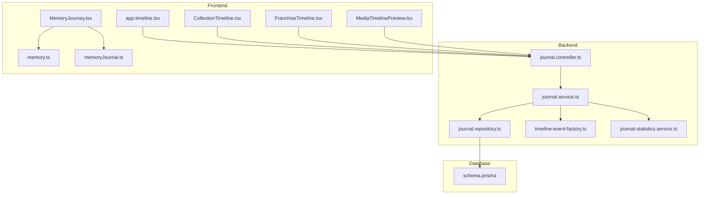
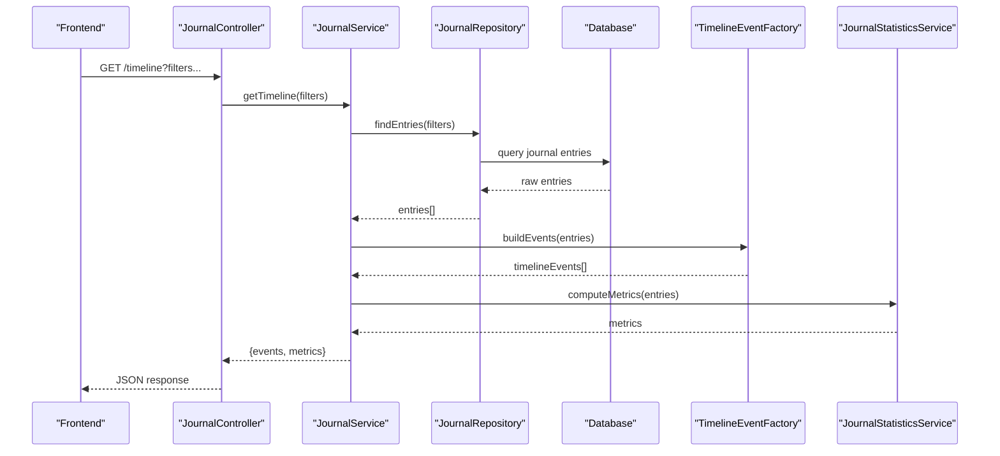
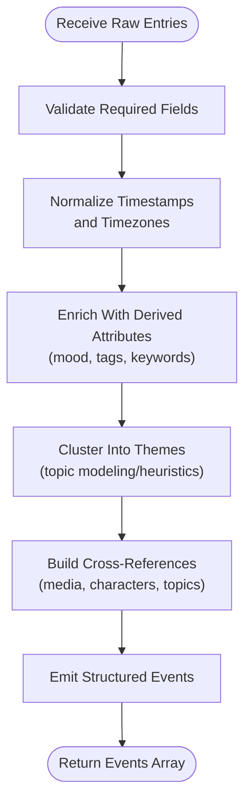
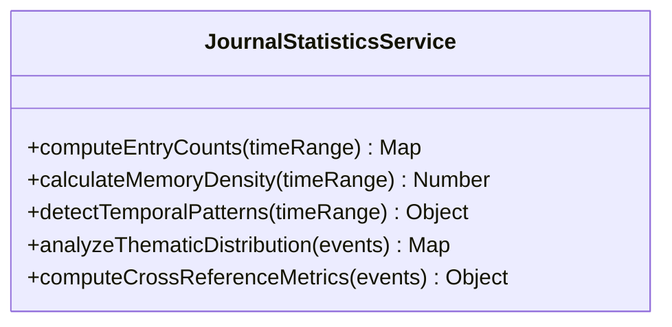
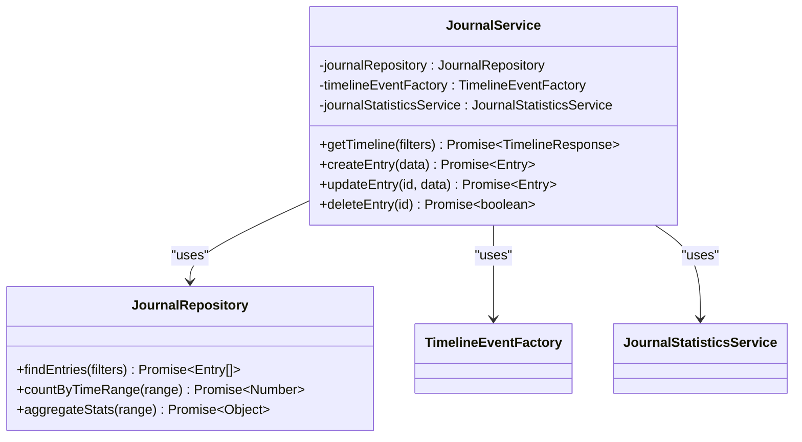
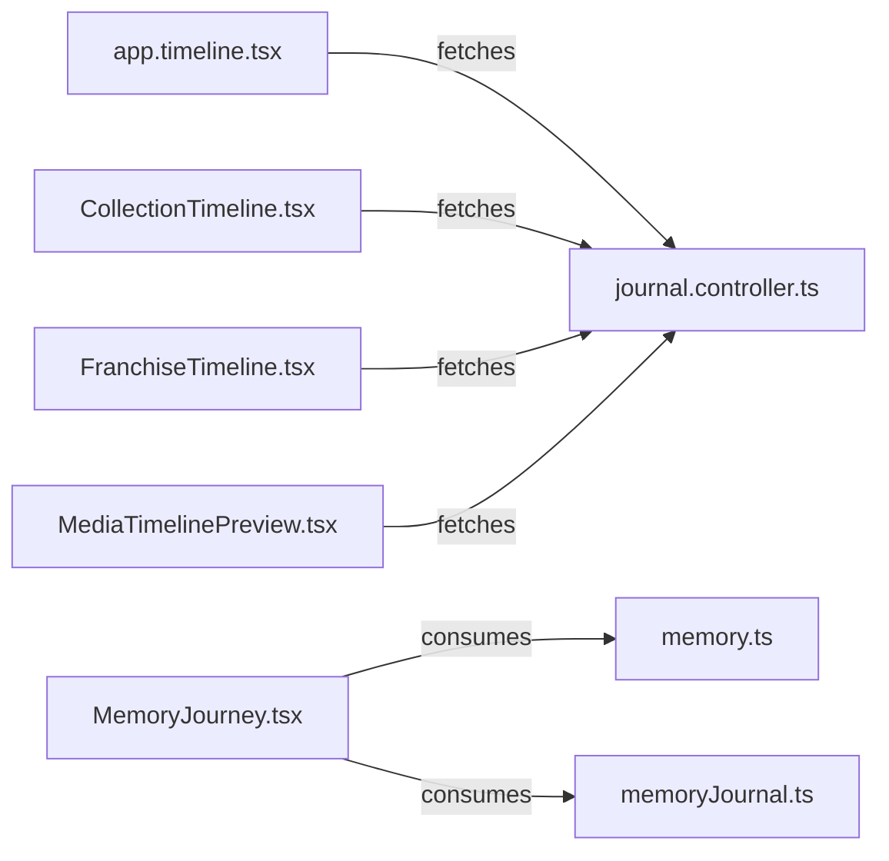
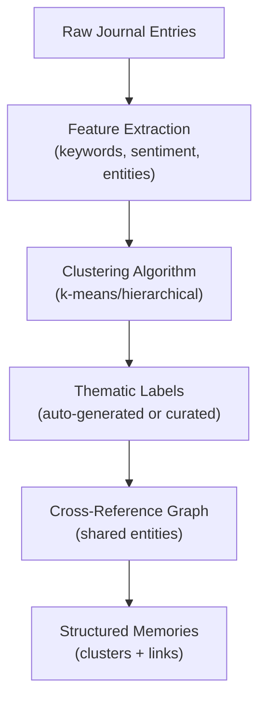
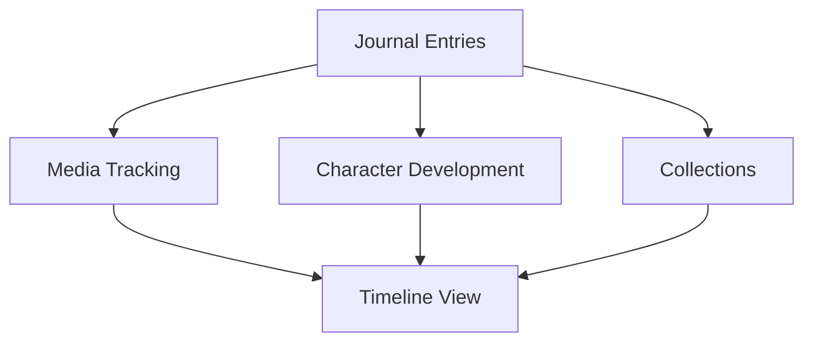
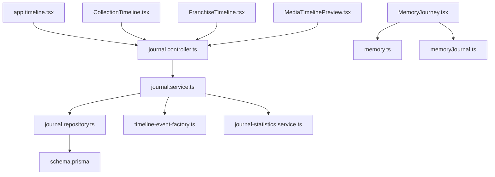

# Timeline & Memory Organization

<cite>
**Referenced Files in This Document**
- [timeline-event-factory.ts](file://apps/backend/src/journal/timeline-event-factory.ts)
- [journal-statistics.service.ts](file://apps/backend/src/journal/journal-statistics.service.ts)
- [journal.controller.ts](file://apps/backend/src/journal/journal.controller.ts)
- [journal.service.ts](file://apps/backend/src/journal/journal.service.ts)
- [journal.repository.ts](file://apps/backend/src/journal/journal.repository.ts)
- [app.timeline.tsx](file://src/routes/app.timeline.tsx)
- [CollectionTimeline.tsx](file://src/components/collections/CollectionTimeline.tsx)
- [FranchiseTimeline.tsx](file://src/components/franchise/FranchiseTimeline.tsx)
- [MediaTimelinePreview.tsx](file://src/components/media-detail/MediaTimelinePreview.tsx)
- [MemoryJourney.tsx](file://src/components/memory/MemoryJourney.tsx)
- [memory.ts](file://src/lib/memory.ts)
- [memoryJournal.ts](file://src/lib/memoryJournal.ts)
- [schema.prisma](file://apps/backend/prisma/schema.prisma)
</cite>

## Table of Contents
1. [Introduction](#introduction)
2. [Project Structure](#project-structure)
3. [Core Components](#core-components)
4. [Architecture Overview](#architecture-overview)
5. [Detailed Component Analysis](#detailed-component-analysis)
6. [Dependency Analysis](#dependency-analysis)
7. [Performance Considerations](#performance-considerations)
8. [Troubleshooting Guide](#troubleshooting-guide)
9. [Conclusion](#conclusion)
10. [Appendices](#appendices)

## Introduction
This document explains how the system organizes journal entries into a chronological timeline and thematic memory structures, and how it transforms raw journal data into structured memories. It covers:
- Chronological and thematic organization of journal entries
- The timeline event factory that creates structured memories from raw journal data
- Advanced features such as memory clustering, thematic grouping, and cross-references between related entries
- A statistics service for timeline metrics, memory density, and temporal patterns
- Examples of timeline visualization components and memory export formats
- Integration points with media tracking and character development

## Project Structure
The timeline and memory features span backend services (NestJS), database schema, and frontend components:
- Backend: Journal module provides controllers, services, repositories, and the timeline event factory
- Database: Prisma schema defines entities used by journals, timelines, and related features
- Frontend: Routes and components render timelines and memory journeys across collections, franchises, media detail pages, and memory views

**Diagram sources**
- [journal.controller.ts](file://apps/backend/src/journal/journal.controller.ts)
- [journal.service.ts](file://apps/backend/src/journal/journal.service.ts)
- [journal.repository.ts](file://apps/backend/src/journal/journal.repository.ts)
- [timeline-event-factory.ts](file://apps/backend/src/journal/timeline-event-factory.ts)
- [journal-statistics.service.ts](file://apps/backend/src/journal/journal-statistics.service.ts)
- [schema.prisma](file://apps/backend/prisma/schema.prisma)
- [app.timeline.tsx](file://src/routes/app.timeline.tsx)
- [CollectionTimeline.tsx](file://src/components/collections/CollectionTimeline.tsx)
- [FranchiseTimeline.tsx](file://src/components/franchise/FranchiseTimeline.tsx)
- [MediaTimelinePreview.tsx](file://src/components/media-detail/MediaTimelinePreview.tsx)
- [MemoryJourney.tsx](file://src/components/memory/MemoryJourney.tsx)
- [memory.ts](file://src/lib/memory.ts)
- [memoryJournal.ts](file://src/lib/memoryJournal.ts)

**Section sources**
- [journal.controller.ts](file://apps/backend/src/journal/journal.controller.ts)
- [journal.service.ts](file://apps/backend/src/journal/journal.service.ts)
- [journal.repository.ts](file://apps/backend/src/journal/journal.repository.ts)
- [timeline-event-factory.ts](file://apps/backend/src/journal/timeline-event-factory.ts)
- [journal-statistics.service.ts](file://apps/backend/src/journal/journal-statistics.service.ts)
- [schema.prisma](file://apps/backend/prisma/schema.prisma)
- [app.timeline.tsx](file://src/routes/app.timeline.tsx)
- [CollectionTimeline.tsx](file://src/components/collections/CollectionTimeline.tsx)
- [FranchiseTimeline.tsx](file://src/components/franchise/FranchiseTimeline.tsx)
- [MediaTimelinePreview.tsx](file://src/components/media-detail/MediaTimelinePreview.tsx)
- [MemoryJourney.tsx](file://src/components/memory/MemoryJourney.tsx)
- [memory.ts](file://src/lib/memory.ts)
- [memoryJournal.ts](file://src/lib/memoryJournal.ts)

## Core Components
- Journal Controller: Exposes endpoints to create, read, update, and delete journal entries; aggregates timeline data for clients.
- Journal Service: Orchestrates business logic for journal operations, coordinates repository access, and composes timeline events via the factory.
- Journal Repository: Data access layer for journal entries and related metadata.
- Timeline Event Factory: Transforms raw journal records into structured timeline events with consistent shape and enriched context.
- Journal Statistics Service: Computes metrics such as entry counts over time, memory density, and temporal patterns.
- Frontend Timeline Routes and Components: Render timelines for the global app view, collection-specific timelines, franchise timelines, and media detail previews; also provide memory journey visualizations.

**Section sources**
- [journal.controller.ts](file://apps/backend/src/journal/journal.controller.ts)
- [journal.service.ts](file://apps/backend/src/journal/journal.service.ts)
- [journal.repository.ts](file://apps/backend/src/journal/journal.repository.ts)
- [timeline-event-factory.ts](file://apps/backend/src/journal/timeline-event-factory.ts)
- [journal-statistics.service.ts](file://apps/backend/src/journal/journal-statistics.service.ts)
- [app.timeline.tsx](file://src/routes/app.timeline.tsx)
- [CollectionTimeline.tsx](file://src/components/collections/CollectionTimeline.tsx)
- [FranchiseTimeline.tsx](file://src/components/franchise/FranchiseTimeline.tsx)
- [MediaTimelinePreview.tsx](file://src/components/media-detail/MediaTimelinePreview.tsx)
- [MemoryJourney.tsx](file://src/components/memory/MemoryJourney.tsx)

## Architecture Overview
The timeline pipeline reads raw journal entries, normalizes them into structured events, and exposes them through API endpoints consumed by frontend components. Statistics are computed on demand or cached to support dashboards and insights.

**Diagram sources**
- [journal.controller.ts](file://apps/backend/src/journal/journal.controller.ts)
- [journal.service.ts](file://apps/backend/src/journal/journal.service.ts)
- [journal.repository.ts](file://apps/backend/src/journal/journal.repository.ts)
- [timeline-event-factory.ts](file://apps/backend/src/journal/timeline-event-factory.ts)
- [journal-statistics.service.ts](file://apps/backend/src/journal/journal-statistics.service.ts)

## Detailed Component Analysis

### Timeline Event Factory
Purpose: Convert raw journal entries into standardized timeline events with consistent fields, timestamps, themes, and optional cross-references.

Key responsibilities:
- Normalize timestamps and ensure chronological ordering
- Enrich events with derived attributes (e.g., mood tags, sentiment hints)
- Group events into thematic clusters based on content signals
- Attach cross-references to related entries (e.g., same media title, shared characters)
- Provide stable identifiers and versioning for each event

**Diagram sources**
- [timeline-event-factory.ts](file://apps/backend/src/journal/timeline-event-factory.ts)

**Section sources**
- [timeline-event-factory.ts](file://apps/backend/src/journal/timeline-event-factory.ts)

### Journal Statistics Service
Purpose: Calculate timeline metrics, memory density, and temporal patterns to power analytics and insights.

Capabilities:
- Entry count per day/week/month
- Memory density (entries per unit time)
- Temporal patterns (peak writing times, streaks, gaps)
- Thematic distribution and cluster sizes
- Cross-reference graph metrics (connectivity, centrality)

**Diagram sources**
- [journal-statistics.service.ts](file://apps/backend/src/journal/journal-statistics.service.ts)

**Section sources**
- [journal-statistics.service.ts](file://apps/backend/src/journal/journal-statistics.service.ts)

### Journal Service and Repository
Responsibilities:
- Journal Service: Coordinates fetching, transformation, and aggregation; integrates with the timeline event factory and statistics service.
- Journal Repository: Encapsulates queries for journal entries, filters, sorting, and pagination.

**Diagram sources**
- [journal.service.ts](file://apps/backend/src/journal/journal.service.ts)
- [journal.repository.ts](file://apps/backend/src/journal/journal.repository.ts)
- [timeline-event-factory.ts](file://apps/backend/src/journal/timeline-event-factory.ts)
- [journal-statistics.service.ts](file://apps/backend/src/journal/journal-statistics.service.ts)

**Section sources**
- [journal.service.ts](file://apps/backend/src/journal/journal.service.ts)
- [journal.repository.ts](file://apps/backend/src/journal/journal.repository.ts)

### Frontend Timeline Components
- Global Timeline Route: Aggregates and displays the user’s overall timeline with filters and search.
- Collection Timeline: Shows timeline within a specific collection context.
- Franchise Timeline: Displays timeline entries related to a franchise.
- Media Timeline Preview: Presents timeline snippets tied to a media item.
- Memory Journey: Visualizes memory clusters and thematic groupings with interactive exploration.

**Diagram sources**
- [app.timeline.tsx](file://src/routes/app.timeline.tsx)
- [CollectionTimeline.tsx](file://src/components/collections/CollectionTimeline.tsx)
- [FranchiseTimeline.tsx](file://src/components/franchise/FranchiseTimeline.tsx)
- [MediaTimelinePreview.tsx](file://src/components/media-detail/MediaTimelinePreview.tsx)
- [MemoryJourney.tsx](file://src/components/memory/MemoryJourney.tsx)
- [memory.ts](file://src/lib/memory.ts)
- [memoryJournal.ts](file://src/lib/memoryJournal.ts)
- [journal.controller.ts](file://apps/backend/src/journal/journal.controller.ts)

**Section sources**
- [app.timeline.tsx](file://src/routes/app.timeline.tsx)
- [CollectionTimeline.tsx](file://src/components/collections/CollectionTimeline.tsx)
- [FranchiseTimeline.tsx](file://src/components/franchise/FranchiseTimeline.tsx)
- [MediaTimelinePreview.tsx](file://src/components/media-detail/MediaTimelinePreview.tsx)
- [MemoryJourney.tsx](file://src/components/memory/MemoryJourney.tsx)
- [memory.ts](file://src/lib/memory.ts)
- [memoryJournal.ts](file://src/lib/memoryJournal.ts)
- [journal.controller.ts](file://apps/backend/src/journal/journal.controller.ts)

### Memory Clustering and Thematic Grouping
Conceptual overview:
- Clustering groups entries by similarity in content, mood, or topic signals
- Thematic grouping assigns labels or categories to clusters for navigation and insights
- Cross-references link entries sharing media titles, characters, locations, or recurring themes

[No sources needed since this diagram shows conceptual workflow, not actual code structure]

### Memory Export Formats
Export options typically include:
- JSON: Full structured memory objects with metadata, clusters, and references
- CSV: Tabular export for timeline entries and basic metrics
- Markdown: Human-readable summaries suitable for documentation or sharing

[No sources needed since this section provides general guidance]

### Integration With Media Tracking and Character Development
Integration points:
- Media tracking: Journal entries can be linked to media items, enabling media-centric timelines and reflections
- Character development: Entries tagged with characters allow character arcs and relationship timelines
- Collections: Journals can be grouped under collections to form themed timelines

[No sources needed since this diagram shows conceptual integration, not specific code mapping]

## Dependency Analysis
The timeline feature depends on:
- Journal controller for API exposure
- Journal service for orchestration
- Journal repository for data access
- Timeline event factory for normalization and enrichment
- Journal statistics service for metrics
- Frontend routes and components for rendering

**Diagram sources**
- [journal.controller.ts](file://apps/backend/src/journal/journal.controller.ts)
- [journal.service.ts](file://apps/backend/src/journal/journal.service.ts)
- [journal.repository.ts](file://apps/backend/src/journal/journal.repository.ts)
- [timeline-event-factory.ts](file://apps/backend/src/journal/timeline-event-factory.ts)
- [journal-statistics.service.ts](file://apps/backend/src/journal/journal-statistics.service.ts)
- [schema.prisma](file://apps/backend/prisma/schema.prisma)
- [app.timeline.tsx](file://src/routes/app.timeline.tsx)
- [CollectionTimeline.tsx](file://src/components/collections/CollectionTimeline.tsx)
- [FranchiseTimeline.tsx](file://src/components/franchise/FranchiseTimeline.tsx)
- [MediaTimelinePreview.tsx](file://src/components/media-detail/MediaTimelinePreview.tsx)
- [MemoryJourney.tsx](file://src/components/memory/MemoryJourney.tsx)
- [memory.ts](file://src/lib/memory.ts)
- [memoryJournal.ts](file://src/lib/memoryJournal.ts)

**Section sources**
- [journal.controller.ts](file://apps/backend/src/journal/journal.controller.ts)
- [journal.service.ts](file://apps/backend/src/journal/journal.service.ts)
- [journal.repository.ts](file://apps/backend/src/journal/journal.repository.ts)
- [timeline-event-factory.ts](file://apps/backend/src/journal/timeline-event-factory.ts)
- [journal-statistics.service.ts](file://apps/backend/src/journal/journal-statistics.service.ts)
- [schema.prisma](file://apps/backend/prisma/schema.prisma)
- [app.timeline.tsx](file://src/routes/app.timeline.tsx)
- [CollectionTimeline.tsx](file://src/components/collections/CollectionTimeline.tsx)
- [FranchiseTimeline.tsx](file://src/components/franchise/FranchiseTimeline.tsx)
- [MediaTimelinePreview.tsx](file://src/components/media-detail/MediaTimelinePreview.tsx)
- [MemoryJourney.tsx](file://src/components/memory/MemoryJourney.tsx)
- [memory.ts](file://src/lib/memory.ts)
- [memoryJournal.ts](file://src/lib/memoryJournal.ts)

## Performance Considerations
- Pagination and filtering: Ensure repository queries use appropriate indexes and limit result sets for large timelines
- Caching: Cache computed statistics and clustered results where feasible to reduce recomputation
- Batch processing: Process large batches of entries in chunks to avoid memory spikes during event creation
- Lazy loading: Load timeline segments on demand in the frontend to improve perceived performance
- Efficient enrichment: Defer heavy enrichment tasks to background jobs if necessary

[No sources needed since this section provides general guidance]

## Troubleshooting Guide
Common issues and resolutions:
- Missing timestamps: Validate required fields in the timeline event factory; normalize timezone handling
- Duplicate events: Implement idempotency checks when creating or updating entries
- Slow queries: Review repository queries and add indexes for frequently filtered fields
- Incorrect clustering: Tune feature extraction parameters and clustering thresholds
- Inconsistent cross-references: Validate entity matching rules and handle edge cases like partial matches

[No sources needed since this section provides general guidance]

## Conclusion
The timeline and memory organization system combines robust backend services with rich frontend components to deliver a cohesive chronological and thematic experience. The timeline event factory ensures consistent, structured memories, while the statistics service provides actionable insights. Integrations with media tracking and character development enable deeper storytelling and personalized timelines.

[No sources needed since this section summarizes without analyzing specific files]

## Appendices

### Example Timeline Visualization
- Global timeline route renders aggregated entries with filters and search
- Collection and franchise timelines contextualize entries within specific scopes
- Media timeline preview highlights entries related to a particular media item
- Memory journey visualizes clusters and thematic groupings interactively

[No sources needed since this section provides general guidance]

### Example Memory Export Formats
- JSON export includes full structured memory objects with metadata and relationships
- CSV export provides tabular data for external analysis tools
- Markdown export offers human-readable summaries for documentation or sharing

[No sources needed since this section provides general guidance]