# File Upload & Processing

<cite>
**Referenced Files in This Document**
- [storage.controller.ts](file://apps/backend/src/storage/storage.controller.ts)
- [upload.service.ts](file://apps/backend/src/storage/upload.service.ts)
- [storage.service.ts](file://apps/backend/src/storage/storage.service.ts)
- [image.service.ts](file://apps/backend/src/storage/image.service.ts)
- [image-processor.service.ts](file://apps/backend/src/storage/image-processor.service.ts)
- [signed-url.service.ts](file://apps/backend/src/storage/signed-url.service.ts)
- [media-cleanup.service.ts](file://apps/backend/src/storage/media-cleanup.service.ts)
- [progress.service.ts](file://apps/backend/src/progress/progress.service.ts)
- [progress.controller.ts](file://apps/backend/src/progress/progress.controller.ts)
- [progress.repository.ts](file://apps/backend/src/progress/progress.repository.ts)
- [configuration.ts](file://apps/backend/src/config/configuration.ts)
- [env.validation.ts](file://apps/backend/src/config/env.validation.ts)
- [core.module.ts](file://apps/backend/src/core/core.module.ts)
- [storage.module.ts](file://apps/backend/src/storage/storage.module.ts)
- [progress.module.ts](file://apps/backend/src/progress/progress.module.ts)
</cite>

## Table of Contents
1. [Introduction](#introduction)
2. [Project Structure](#project-structure)
3. [Core Components](#core-components)
4. [Architecture Overview](#architecture-overview)
5. [Detailed Component Analysis](#detailed-component-analysis)
6. [Dependency Analysis](#dependency-analysis)
7. [Performance Considerations](#performance-considerations)
8. [Troubleshooting Guide](#troubleshooting-guide)
9. [Conclusion](#conclusion)

## Introduction
This document explains how file uploads are handled end-to-end, including multipart form processing, validation, security measures, image processing (resizing, format conversion, optimization), storage backend abstraction (local filesystem, S3, CDN), naming conventions, duplicate detection, cleanup, progress tracking for large uploads, chunked upload support, and error recovery. It is intended for developers integrating with or extending the upload pipeline.

## Project Structure
The upload functionality spans a few key modules:
- Storage module: controllers, services for upload orchestration, storage backends, image processing, signed URLs, and cleanup.
- Progress module: tracks upload progress and exposes endpoints to query status.
- Configuration: environment-driven settings for limits, storage backends, and behavior flags.

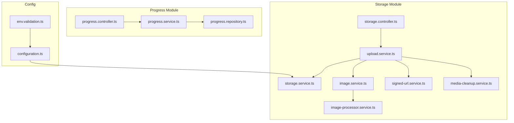

**Diagram sources**
- [storage.controller.ts](file://apps/backend/src/storage/storage.controller.ts)
- [upload.service.ts](file://apps/backend/src/storage/upload.service.ts)
- [storage.service.ts](file://apps/backend/src/storage/storage.service.ts)
- [image.service.ts](file://apps/backend/src/storage/image.service.ts)
- [image-processor.service.ts](file://apps/backend/src/storage/image-processor.service.ts)
- [signed-url.service.ts](file://apps/backend/src/storage/signed-url.service.ts)
- [media-cleanup.service.ts](file://apps/backend/src/storage/media-cleanup.service.ts)
- [progress.controller.ts](file://apps/backend/src/progress/progress.controller.ts)
- [progress.service.ts](file://apps/backend/src/progress/progress.service.ts)
- [progress.repository.ts](file://apps/backend/src/progress/progress.repository.ts)
- [configuration.ts](file://apps/backend/src/config/configuration.ts)
- [env.validation.ts](file://apps/backend/src/config/env.validation.ts)

**Section sources**
- [storage.module.ts](file://apps/backend/src/storage/storage.module.ts)
- [progress.module.ts](file://apps/backend/src/progress/progress.module.ts)
- [core.module.ts](file://apps/backend/src/core/core.module.ts)

## Core Components
- Upload Controller: Receives multipart/form-data requests, validates input, and delegates to the upload service.
- Upload Service: Orchestrates validation, deduplication, storage writes, metadata extraction, and triggers image processing.
- Storage Service: Abstracts storage backends (local, S3, CDN). Handles paths, access control, and URL generation.
- Image Service and Processor: Validates images, resizes, converts formats, optimizes, and produces thumbnails.
- Signed URL Service: Generates secure, time-bound URLs for direct client uploads/downloads.
- Media Cleanup Service: Removes orphaned files and enforces retention policies.
- Progress Service and Repository: Tracks chunked upload progress and completion events.
- Configuration: Centralized environment variables for limits, storage options, and feature toggles.

**Section sources**
- [storage.controller.ts](file://apps/backend/src/storage/storage.controller.ts)
- [upload.service.ts](file://apps/backend/src/storage/upload.service.ts)
- [storage.service.ts](file://apps/backend/src/storage/storage.service.ts)
- [image.service.ts](file://apps/backend/src/storage/image.service.ts)
- [image-processor.service.ts](file://apps/backend/src/storage/image-processor.service.ts)
- [signed-url.service.ts](file://apps/backend/src/storage/signed-url.service.ts)
- [media-cleanup.service.ts](file://apps/backend/src/storage/media-cleanup.service.ts)
- [progress.service.ts](file://apps/backend/src/progress/progress.service.ts)
- [progress.controller.ts](file://apps/backend/src/progress/progress.controller.ts)
- [progress.repository.ts](file://apps/backend/src/progress/progress.repository.ts)
- [configuration.ts](file://apps/backend/src/config/configuration.ts)
- [env.validation.ts](file://apps/backend/src/config/env.validation.ts)

## Architecture Overview
The upload flow supports both simple multipart uploads and resumable chunked uploads. After validation, files are stored via an abstracted storage layer. Images are processed asynchronously where applicable. Progress is tracked per upload session.

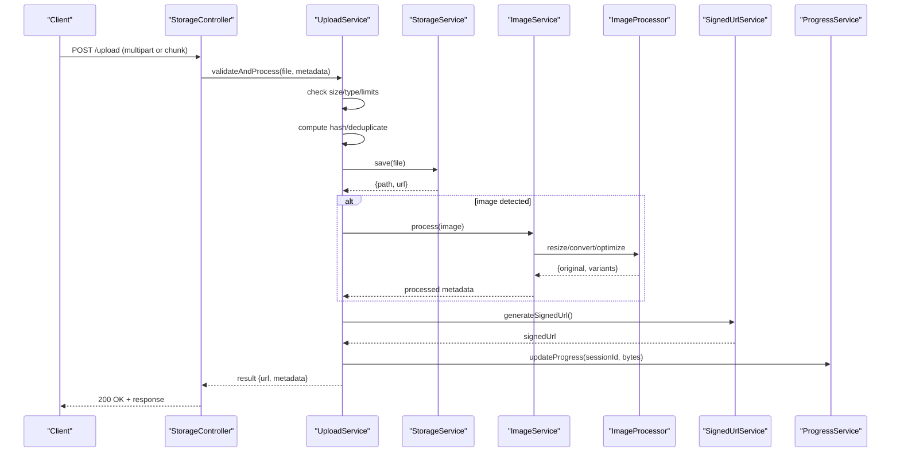

**Diagram sources**
- [storage.controller.ts](file://apps/backend/src/storage/storage.controller.ts)
- [upload.service.ts](file://apps/backend/src/storage/upload.service.ts)
- [storage.service.ts](file://apps/backend/src/storage/storage.service.ts)
- [image.service.ts](file://apps/backend/src/storage/image.service.ts)
- [image-processor.service.ts](file://apps/backend/src/storage/image-processor.service.ts)
- [signed-url.service.ts](file://apps/backend/src/storage/signed-url.service.ts)
- [progress.service.ts](file://apps/backend/src/progress/progress.service.ts)

## Detailed Component Analysis

### Multipart Form Processing and Validation
- The controller parses multipart/form-data and forwards payloads to the upload service.
- Validation includes file type allowlists, maximum size, and optional MIME sniffing.
- Duplicate detection uses content hashing before writing to storage.

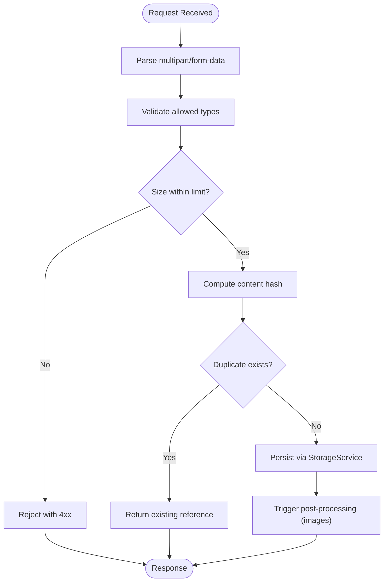

**Diagram sources**
- [storage.controller.ts](file://apps/backend/src/storage/storage.controller.ts)
- [upload.service.ts](file://apps/backend/src/storage/upload.service.ts)
- [storage.service.ts](file://apps/backend/src/storage/storage.service.ts)

**Section sources**
- [storage.controller.ts](file://apps/backend/src/storage/storage.controller.ts)
- [upload.service.ts](file://apps/backend/src/storage/upload.service.ts)

### Storage Backend Abstraction
- StorageService provides a unified interface for local filesystem, S3, and CDN-backed storage.
- Key capabilities include path resolution, ACL handling, and URL generation.
- Configuration drives backend selection and credentials.

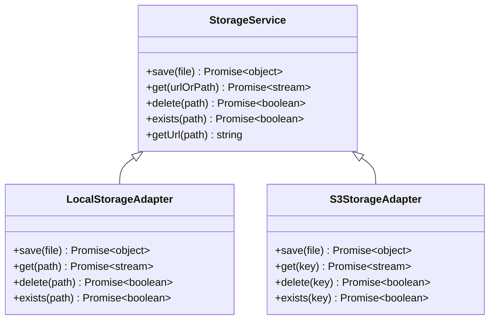

**Diagram sources**
- [storage.service.ts](file://apps/backend/src/storage/storage.service.ts)

**Section sources**
- [storage.service.ts](file://apps/backend/src/storage/storage.service.ts)
- [configuration.ts](file://apps/backend/src/config/configuration.ts)
- [env.validation.ts](file://apps/backend/src/config/env.validation.ts)

### Image Processing Pipeline
- ImageService detects image types and coordinates resizing, format conversion, and optimization.
- ImageProcessor performs heavy operations such as scaling, transcoding, and thumbnail generation.
- Outputs include optimized originals and multiple derived variants.

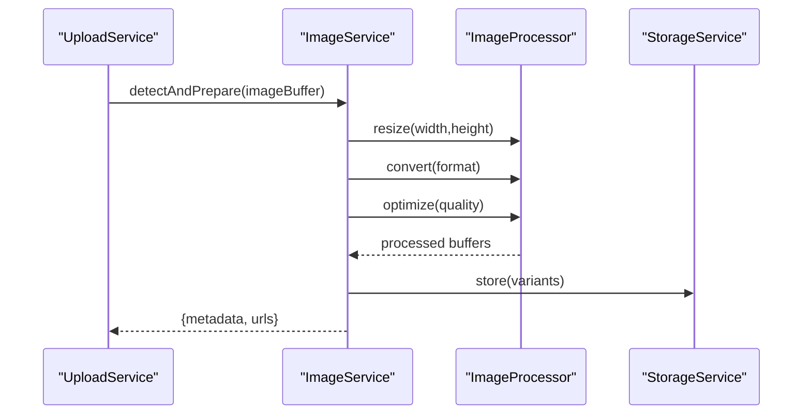

**Diagram sources**
- [image.service.ts](file://apps/backend/src/storage/image.service.ts)
- [image-processor.service.ts](file://apps/backend/src/storage/image-processor.service.ts)
- [storage.service.ts](file://apps/backend/src/storage/storage.service.ts)

**Section sources**
- [image.service.ts](file://apps/backend/src/storage/image.service.ts)
- [image-processor.service.ts](file://apps/backend/src/storage/image-processor.service.ts)

### Security Measures
- Allowed MIME types and extensions enforced at ingestion.
- Maximum payload sizes configured via environment variables.
- Content hashing prevents storing duplicates and aids integrity checks.
- Signed URLs provide time-bound, scoped access to assets.
- Optional malware scanning can be integrated into the pipeline prior to finalization.

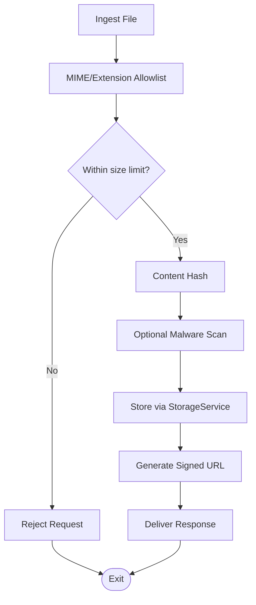

**Diagram sources**
- [upload.service.ts](file://apps/backend/src/storage/upload.service.ts)
- [signed-url.service.ts](file://apps/backend/src/storage/signed-url.service.ts)
- [configuration.ts](file://apps/backend/src/config/configuration.ts)

**Section sources**
- [upload.service.ts](file://apps/backend/src/storage/upload.service.ts)
- [signed-url.service.ts](file://apps/backend/src/storage/signed-url.service.ts)
- [configuration.ts](file://apps/backend/src/config/configuration.ts)

### File Naming Conventions and Duplicate Detection
- Names are generated using deterministic strategies (e.g., user-scoped prefixes, timestamps, hashes).
- Duplicate detection relies on content hashing; if a match exists, return the existing asset instead of re-uploading.
- Variants (thumbnails, converted formats) share a base name with suffixes indicating transformation.

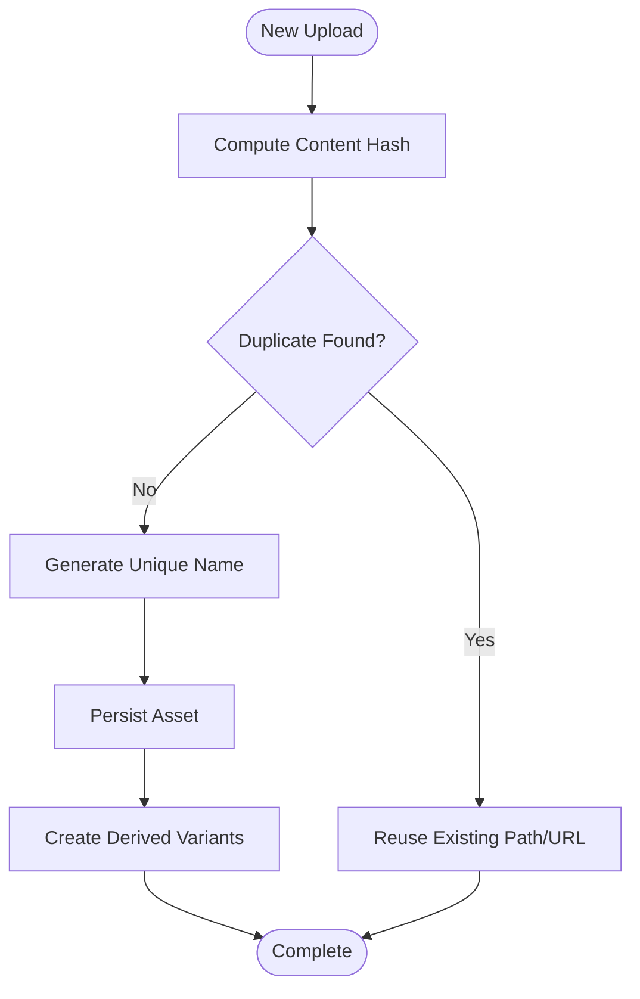

**Diagram sources**
- [upload.service.ts](file://apps/backend/src/storage/upload.service.ts)
- [storage.service.ts](file://apps/backend/src/storage/storage.service.ts)

**Section sources**
- [upload.service.ts](file://apps/backend/src/storage/upload.service.ts)
- [storage.service.ts](file://apps/backend/src/storage/storage.service.ts)

### Cleanup Processes
- MediaCleanupService removes orphaned files and enforces retention policies.
- Supports scheduled runs and manual triggers for maintenance.
- Integrates with storage backend to delete by path/key.

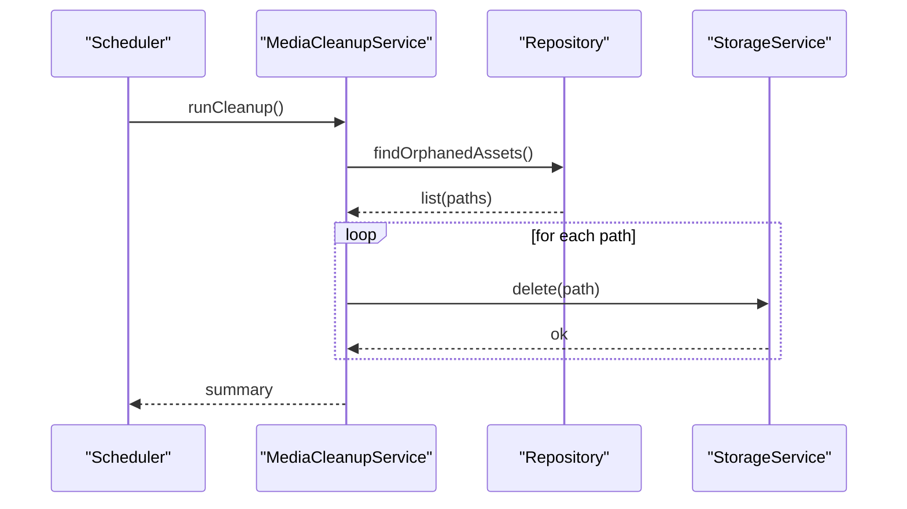

**Diagram sources**
- [media-cleanup.service.ts](file://apps/backend/src/storage/media-cleanup.service.ts)
- [storage.service.ts](file://apps/backend/src/storage/storage.service.ts)

**Section sources**
- [media-cleanup.service.ts](file://apps/backend/src/storage/media-cleanup.service.ts)

### Progress Tracking and Chunked Uploads
- ProgressService updates byte counts per upload session and exposes status via controller.
- Clients can poll or use streaming events to track large uploads.
- Chunked uploads resume from last successful chunk and reconcile state on reconnect.

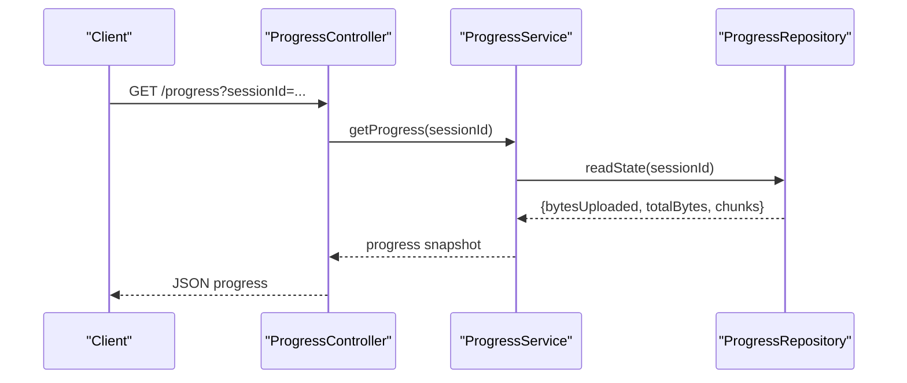

**Diagram sources**
- [progress.controller.ts](file://apps/backend/src/progress/progress.controller.ts)
- [progress.service.ts](file://apps/backend/src/progress/progress.service.ts)
- [progress.repository.ts](file://apps/backend/src/progress/progress.repository.ts)

**Section sources**
- [progress.controller.ts](file://apps/backend/src/progress/progress.controller.ts)
- [progress.service.ts](file://apps/backend/src/progress/progress.service.ts)
- [progress.repository.ts](file://apps/backend/src/progress/progress.repository.ts)

### Error Recovery Mechanisms
- Transient storage errors trigger retries with exponential backoff.
- Partial chunk states are persisted to allow resume after failure.
- Validation failures return clear 4xx responses with actionable messages.
- Orphaned uploads are cleaned up by scheduled jobs.

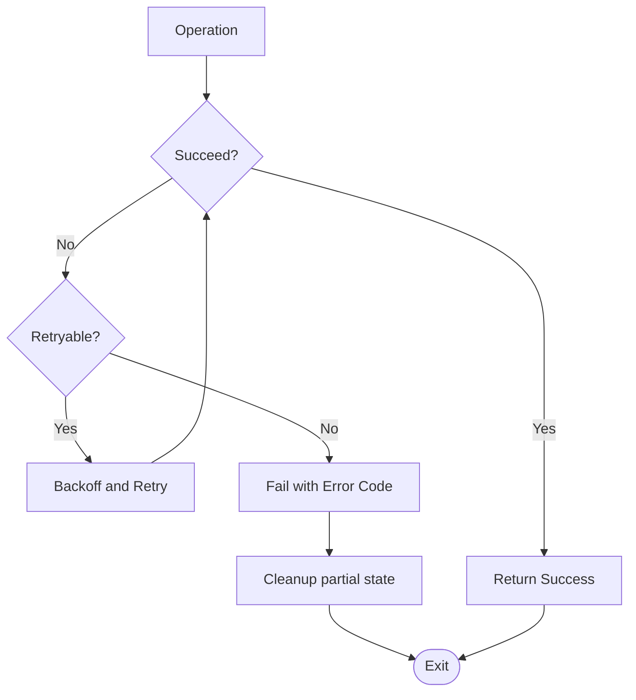

[No sources needed since this diagram shows conceptual workflow, not actual code structure]

## Dependency Analysis
Key dependencies and relationships:
- Controllers depend on services for business logic.
- Services coordinate storage backends and processors.
- Configuration centralizes environment-driven behavior.
- Modules wire providers and exports for NestJS dependency injection.

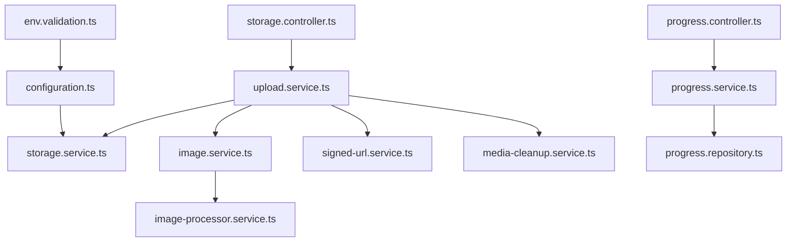

**Diagram sources**
- [storage.controller.ts](file://apps/backend/src/storage/storage.controller.ts)
- [upload.service.ts](file://apps/backend/src/storage/upload.service.ts)
- [storage.service.ts](file://apps/backend/src/storage/storage.service.ts)
- [image.service.ts](file://apps/backend/src/storage/image.service.ts)
- [image-processor.service.ts](file://apps/backend/src/storage/image-processor.service.ts)
- [signed-url.service.ts](file://apps/backend/src/storage/signed-url.service.ts)
- [media-cleanup.service.ts](file://apps/backend/src/storage/media-cleanup.service.ts)
- [progress.controller.ts](file://apps/backend/src/progress/progress.controller.ts)
- [progress.service.ts](file://apps/backend/src/progress/progress.service.ts)
- [progress.repository.ts](file://apps/backend/src/progress/progress.repository.ts)
- [configuration.ts](file://apps/backend/src/config/configuration.ts)
- [env.validation.ts](file://apps/backend/src/config/env.validation.ts)

**Section sources**
- [storage.module.ts](file://apps/backend/src/storage/storage.module.ts)
- [progress.module.ts](file://apps/backend/src/progress/progress.module.ts)
- [core.module.ts](file://apps/backend/src/core/core.module.ts)

## Performance Considerations
- Stream large files directly to storage to minimize memory usage.
- Use background workers for image processing to avoid blocking request threads.
- Cache signed URLs and metadata where appropriate.
- Configure concurrency limits for resizing and transcoding.
- Enable compression for transport where supported.
- Tune storage backend timeouts and retry policies.

[No sources needed since this section provides general guidance]

## Troubleshooting Guide
Common issues and resolutions:
- Invalid file type or extension: Ensure allowlists include required types; verify MIME sniffing configuration.
- Size exceeded: Adjust maximum upload limits in configuration; consider chunked uploads for very large files.
- Duplicate detection false positives: Review hashing strategy and collision handling.
- Storage write failures: Check backend credentials, permissions, and network connectivity; inspect retry logs.
- Missing signed URLs: Verify expiration and scope parameters; ensure backend supports presigned URLs.
- Stalled progress: Confirm chunk acknowledgment and persistence; check repository availability.

**Section sources**
- [upload.service.ts](file://apps/backend/src/storage/upload.service.ts)
- [storage.service.ts](file://apps/backend/src/storage/storage.service.ts)
- [signed-url.service.ts](file://apps/backend/src/storage/signed-url.service.ts)
- [progress.service.ts](file://apps/backend/src/progress/progress.service.ts)

## Conclusion
The upload system combines robust validation, secure storage abstraction, efficient image processing, and resilient progress tracking. By following the documented patterns and configurations, teams can extend backends, add new transformations, and maintain high reliability under load.